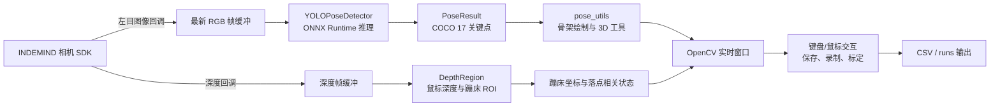

你当前位于入门指南的第一页：[概览](1-gai-lan)。这一页只回答三个新手最先需要弄清的问题：这个项目做什么、由哪些主要部件组成、应该按什么顺序继续阅读。项目的可执行目标名为 `yolo_pose_indemind_left`，构建脚本和 CMake 输出都把它描述为面向 INDEMIND 左目相机的 YOLO Pose 检测程序；主程序启动后会初始化 INDEMIND SDK、读取左目相机内参、创建 YOLOv8-Pose ONNX 推理器，并进入实时图像处理循环。Sources: [CMakeLists.txt](CMakeLists.txt#L193-L211), [get_pose_indemind_left.cpp](get_pose_indemind_left.cpp#L681-L727)

## 这个项目解决什么问题

**YOLO_rec 是一个 C++ 实时人体姿态检测与蹦床落点分析程序**：它从 INDEMIND 双目设备中使用左目图像作为 YOLOv8-Pose 的输入，同时启用深度处理器以支持鼠标深度交互、3D 坐标计算、蹦床 ROI 标定和落点记录。主程序中的注释最初称左目图像为“RGB Only”，但当前实现已经注册了深度回调，并把深度数据转换为毫米单位后放入深度缓冲区，因此概览中应把它理解为“左目图像驱动的姿态检测，辅以深度数据做空间交互与业务分析”。Sources: [get_pose_indemind_left.cpp](get_pose_indemind_left.cpp#L3-L6), [get_pose_indemind_left.cpp](get_pose_indemind_left.cpp#L763-L807)

对初学者来说，可以先把项目看成一条端到端流水线：**相机采集图像 → YOLO 推理得到人体关键点 → 深度与内参把像素点关联到 3D 空间 → 界面显示骨架、参数和记录状态 → 用户通过键盘与鼠标控制标定、保存和录制**。这条流水线在主循环中体现为：取最新 RGB 帧、按时间匹配深度帧、调用 `pose_detector.Detect(left_image)`、统计推理耗时、绘制姿态结果并显示窗口。Sources: [get_pose_indemind_left.cpp](get_pose_indemind_left.cpp#L852-L920), [get_pose_indemind_left.cpp](get_pose_indemind_left.cpp#L1299-L1504)

## 一眼看懂整体架构

下图是概览级架构图，不展开每个算法细节，只展示新手需要先建立的组件关系：INDEMIND SDK 负责输入，`YOLOPoseDetector` 负责 2D 姿态推理，`pose_utils` 负责骨架绘制与 3D 工具函数，`DepthRegion` 负责鼠标 ROI、深度显示和蹦床平面相关交互，`runtime_state` 与 CSV 文件负责运行时录制状态。Sources: [get_pose_indemind_left.cpp](get_pose_indemind_left.cpp#L8-L20), [yolo_pose_detector.h](yolo_pose_detector.h#L60-L90), [pose_utils.h](pose_utils.h#L26-L85), [app/depth_region.h](app/depth_region.h#L26-L49), [app/runtime_state.h](app/runtime_state.h#L7-L24)



这张图对应的代码入口是 `get_pose_indemind_left.cpp` 的 `main` 函数：它先设置默认模型路径 `models/yolov8m-pose-1280.onnx`，随后初始化相机、相机内参、YOLO 推理器、图像/深度缓冲区、鼠标交互对象和录制相关状态，最后进入持续处理循环。Sources: [get_pose_indemind_left.cpp](get_pose_indemind_left.cpp#L672-L760), [get_pose_indemind_left.cpp](get_pose_indemind_left.cpp#L852-L920)

## 核心能力速览

| 能力 | 初学者理解 | 主要代码位置 |
|---|---|---|
| 左目图像接入 | 从 INDEMIND SDK 的图像回调中取左目画面，必要时把灰度图转为 BGR 图像，供 YOLO 使用 | `RegistImgCallback` |
| YOLOv8-Pose 推理 | 加载 ONNX 模型，对每帧图像输出人体框和 COCO 17 个关键点 | `YOLOPoseDetector::Detect` |
| 深度接入 | 启用深度处理器，把深度从米转换成毫米，并按时间缓存 | `RegistDepthCallback` |
| 实时可视化 | 在 OpenCV 窗口中显示骨架、关键点、状态文字和指标面板 | `DrawPoses` 与 `imshow` |
| 蹦床 ROI 交互 | 鼠标点击 4 个角点，作为后续床面平面与坐标系构建的交互入口 | `DepthRegion::OnMouse` |
| 数据录制 | 通过运行时状态控制录制开关，并把会话/输出目录作为运行状态保存 | `RuntimeFlags` 与 `DataSession` |

Sources: [get_pose_indemind_left.cpp](get_pose_indemind_left.cpp#L763-L807), [yolo_pose_detector.h](yolo_pose_detector.h#L48-L90), [pose_utils.h](pose_utils.h#L37-L63), [app/depth_region.h](app/depth_region.h#L45-L81), [app/runtime_state.h](app/runtime_state.h#L7-L24)

## 项目结构导览

下面是面向新手的项目结构视图，只保留阅读源码时最常接触的目录和文件。构建系统把 `yolo_pose_detector.cpp`、`pose_utils.cpp` 作为通用源码，把 `app/camera_intrinsics.cpp`、`app/depth_region.cpp`、`app/depth_utils.cpp`、`app/perf_stats.cpp`、`app/runtime_state.cpp` 作为应用支撑源码，最后与主入口 `get_pose_indemind_left.cpp` 一起生成 `yolo_pose_indemind_left`。Sources: [CMakeLists.txt](CMakeLists.txt#L171-L199)

```text
YOLO_rec/
├── CMakeLists.txt                  # CMake 构建入口
├── build_linux.sh                  # Linux 构建脚本
├── get_pose_indemind_left.cpp      # 主程序入口：相机、推理、界面、交互主循环
├── yolo_pose_detector.*            # YOLOv8-Pose ONNX 推理封装
├── pose_utils.*                    # 姿态绘制、关键点名称、3D 工具函数
├── app/
│   ├── camera_intrinsics.*         # 左目相机内参与逆矩阵
│   ├── depth_region.*              # 深度显示、鼠标 ROI、蹦床交互
│   ├── depth_utils.*               # 鲁棒深度采样
│   ├── perf_stats.*                # 推理、深度、落点检测耗时统计
│   └── runtime_state.*             # 录制开关与数据会话状态
├── include/                        # INDEMIND / IMSEE SDK 头文件
├── lib/                            # INDEMIND 动态库
├── models/                         # YOLOv8-Pose ONNX 模型
└── docs/                           # 已有设计与变更说明文档
```

这个结构中的外部依赖也由 CMake 明确表达：OpenCV 是必需依赖；ONNX Runtime 会优先在 Conda 环境中查找，找不到再查系统路径；INDEMIND/IMSEE SDK 期望头文件位于 `include/`，库文件在 `lib/libindemind.so`。Sources: [CMakeLists.txt](CMakeLists.txt#L62-L70), [CMakeLists.txt](CMakeLists.txt#L72-L130), [CMakeLists.txt](CMakeLists.txt#L132-L155)

## 构建与运行的最小认知

项目使用 CMake 构建，C++ 标准设为 C++14；默认输出目录是 `build_agent_out`，但构建脚本 `build_linux.sh` 会按“检查依赖、清理旧 build、创建 build、执行 cmake、执行 make”的流程生成可执行文件。初学者不需要先理解所有算法，只需要知道：编译前必须具备 CMake、G++、OpenCV、ONNX Runtime、INDEMIND SDK 文件和模型文件。Sources: [CMakeLists.txt](CMakeLists.txt#L6-L20), [build_linux.sh](build_linux.sh#L38-L107), [build_linux.sh](build_linux.sh#L110-L137)

| 项目 | 代码中的检查或配置 | 新手关注点 |
|---|---|---|
| CMake / G++ | 构建脚本检查 `cmake` 与 `g++` 命令 | 没有它们就无法编译 |
| OpenCV | CMake 使用 `find_package(OpenCV REQUIRED)` | 用于图像处理、窗口显示和矩阵计算 |
| ONNX Runtime | 优先查 Conda，再查系统路径 | 用于加载并运行 YOLOv8-Pose ONNX 模型 |
| INDEMIND SDK | 检查 `include/imrsdk.h` 与 `lib/libindemind.so` | 用于访问相机图像与深度数据 |
| 模型文件 | 主程序默认使用 `models/yolov8m-pose-1280.onnx` | 可通过命令行第一个参数替换模型路径 |

Sources: [build_linux.sh](build_linux.sh#L40-L107), [CMakeLists.txt](CMakeLists.txt#L62-L155), [get_pose_indemind_left.cpp](get_pose_indemind_left.cpp#L675-L678)

## 运行时你会看到什么

程序启动后会在控制台打印控制说明，包括退出、开关键点、开关骨架、开关信息叠加、开始/停止髋点坐标记录、保存当前帧、调整 Z 阈值、调整窗口半径、打印参数、鼠标点击 4 个蹦床角点、切换落点 REC、清空落点缓存和保存落点 CSV。Sources: [get_pose_indemind_left.cpp](get_pose_indemind_left.cpp#L809-L824)

| 操作 | 作用 |
|---|---|
| `q` / `ESC` | 退出程序 |
| `k` | 开关关键点显示 |
| `t` | 开关骨架显示 |
| `i` | 开关信息叠加 |
| `l` | 开始或停止髋点坐标记录 |
| `SPACE` | 保存当前帧 |
| `+` / `-` | 增加或减少 Z 阈值 |
| `[` / `]` | 减小或增大窗口半径 |
| 鼠标点击 | 在 YOLO 窗口中点击 4 个蹦床角点 |
| `r` | 切换落点记录 REC |
| `c` | 清空落点缓存 |
| `s` | 保存落点到 CSV |

Sources: [get_pose_indemind_left.cpp](get_pose_indemind_left.cpp#L809-L824)

## 关键数据结构的初步认识

`YOLOPoseDetector` 输出的是 `PoseResult` 列表；每个 `PoseResult` 包含人体框、检测置信度、17 个关键点和可选的人员 ID。每个 `KeyPoint` 保存图像坐标 `x/y`、关键点置信度，以及后续深度融合后可填充的 3D 坐标 `pos3d`。Sources: [yolo_pose_detector.h](yolo_pose_detector.h#L36-L58)

`pose_utils` 提供了新手最容易观察到的辅助能力：获取 COCO 骨架连线、把 2D 关键点映射到 3D、绘制姿态、绘制姿态信息、按索引获取关键点名称、计算 3D 距离和估算人体身高。Sources: [pose_utils.h](pose_utils.h#L20-L85)

`runtime_state` 则保存录制行为的最小运行时状态：`RuntimeFlags` 中有 `record_enabled` 录制开关，`DataSession` 中有会话 ID、输出目录、开始时间和是否激活的标记。Sources: [app/runtime_state.h](app/runtime_state.h#L7-L24)

## 推荐阅读路径

如果你是第一次接触这个仓库，建议按目录顺序继续阅读：先看 [快速开始](2-kuai-su-kai-shi)，确认如何从零启动；再看 [运行环境与依赖检查](3-yun-xing-huan-jing-yu-yi-lai-jian-cha)，补齐 OpenCV、ONNX Runtime 与 INDEMIND SDK；随后阅读 [模型文件、相机 SDK 与目录约定](4-mo-xing-wen-jian-xiang-ji-sdk-yu-mu-lu-yue-ding)，理解模型和 SDK 文件为什么必须放在固定位置；最后进入 [编译、运行与常见启动参数](5-bian-yi-yun-xing-yu-chang-jian-qi-dong-can-shu) 和 [实时界面、鼠标选区与键盘操作](6-shi-shi-jie-mian-shu-biao-xuan-qu-yu-jian-pan-cao-zuo)。Sources: [build_linux.sh](build_linux.sh#L38-L107), [CMakeLists.txt](CMakeLists.txt#L132-L155), [get_pose_indemind_left.cpp](get_pose_indemind_left.cpp#L809-L824)

当你能成功看到实时窗口后，再进入“上手验证”三页：[从左目图像到人体关键点的最小闭环](7-cong-zuo-mu-tu-xiang-dao-ren-ti-guan-jian-dian-de-zui-xiao-bi-huan)、[深度图接入与 3D 关键点验证](8-shen-du-tu-jie-ru-yu-3d-guan-jian-dian-yan-zheng)、[蹦床 ROI 标定与落点记录流程](9-beng-chuang-roi-biao-ding-yu-luo-dian-ji-lu-liu-cheng)。这三页分别对应主循环中的 YOLO 检测、深度帧匹配与鼠标 ROI/录制交互，是从“能运行”走向“能验证功能”的自然路径。Sources: [get_pose_indemind_left.cpp](get_pose_indemind_left.cpp#L852-L920), [get_pose_indemind_left.cpp](get_pose_indemind_left.cpp#L867-L876), [app/depth_region.h](app/depth_region.h#L45-L81)