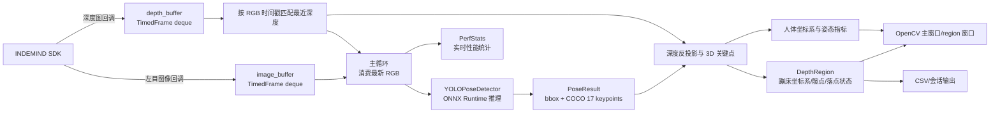
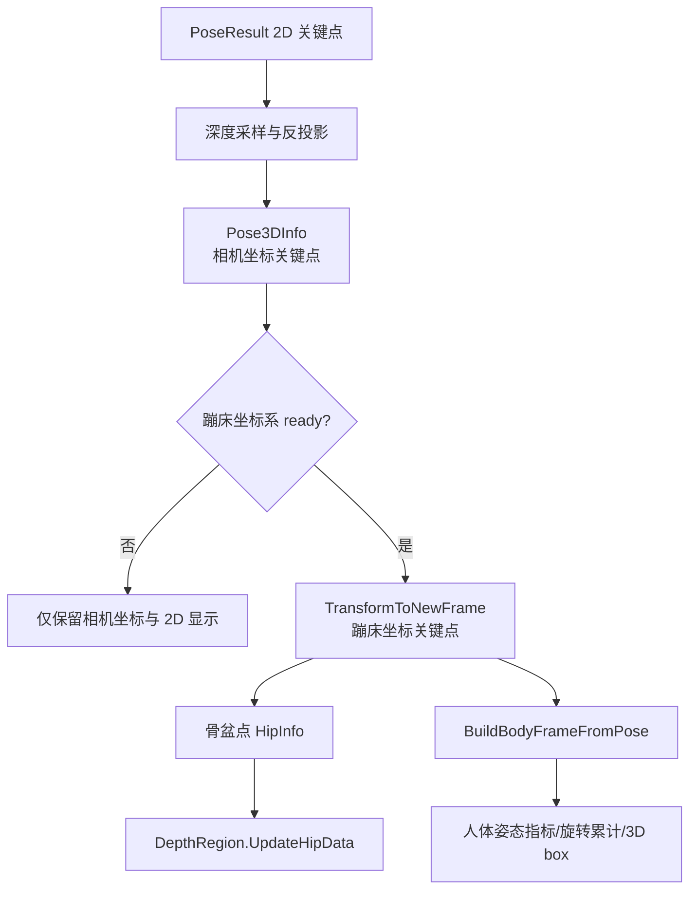

本页定位在“深入剖析”的入口层：不展开单个算法的数学细节，而是解释可执行程序 `yolo_pose_indemind_left` 如何把 **INDEMIND 左目图像、深度图、YOLOv8-Pose 推理结果、蹦床坐标系、人体姿态状态、界面显示与 CSV 记录** 串成一个实时闭环。代码层面，该闭环由一个主程序文件、一个 ONNX 推理器、姿态绘制/结构定义工具、深度与 ROI 交互模块、性能统计和运行时状态模块共同组成，并通过 CMake 链接 OpenCV、ONNX Runtime 与 IMSEE/INDEMIND SDK。Sources: [get_pose_indemind_left.cpp](get_pose_indemind_left.cpp#L672-L727), [CMakeLists.txt](CMakeLists.txt#L171-L211)

## 架构假设与验证结论

从第一原则看，这个系统的实时性来自两个设计约束：**相机回调只负责采集并入队，主循环只消费最新帧并执行推理/融合/显示**；三维业务结果则依赖深度图和已建立的蹦床坐标系，而不是 YOLO 推理器本身。代码验证后可以确认：RGB 回调将左目图像转为 BGR 并写入带时间戳的 `image_buffer`，深度回调将深度从米转换为毫米并写入 `depth_buffer`，主循环用 `PopLatestFrame` 清空旧 RGB 帧、用 `SelectNearestDepthFrame` 选取时间戳最近的深度帧，然后调用 `pose_detector.Detect(left_image)` 完成 2D 姿态推理。Sources: [get_pose_indemind_left.cpp](get_pose_indemind_left.cpp#L178-L230), [get_pose_indemind_left.cpp](get_pose_indemind_left.cpp#L729-L804), [get_pose_indemind_left.cpp](get_pose_indemind_left.cpp#L852-L889)

下图展示的是本页讨论的端到端概念边界：左侧是外部输入与 SDK，中间是实时主循环，右侧是用户可见输出与持久化结果；具体的 ONNX 输出解析、深度鲁棒采样、平面拟合和姿态分类细节分别属于后续专题页。Sources: [get_pose_indemind_left.cpp](get_pose_indemind_left.cpp#L846-L889), [get_pose_indemind_left.cpp](get_pose_indemind_left.cpp#L971-L1134), [get_pose_indemind_left.cpp](get_pose_indemind_left.cpp#L1502-L1618)



## 可执行程序与模块边界

构建系统只声明一个核心可执行目标 `yolo_pose_indemind_left`，其源文件由 `get_pose_indemind_left.cpp`、`yolo_pose_detector.cpp`、`pose_utils.cpp` 以及 `app/` 下的相机内参、深度区域、深度工具、性能统计、运行时状态实现组成；链接层面依赖 IMSEE SDK、OpenCV、ONNX Runtime，并在类 Unix 平台追加 `pthread`。这说明仓库当前的主架构不是多服务拆分，而是一个 **单进程实时视觉应用**，通过模块化源码分离推理、深度、状态和显示职责。Sources: [CMakeLists.txt](CMakeLists.txt#L171-L215)

下表按端到端链路中的职责划分主要模块，而不是按文件大小划分；这有助于中级开发者快速定位“数据在哪里进入、在哪里转换、在哪里输出”。Sources: [CMakeLists.txt](CMakeLists.txt#L181-L211), [yolo_pose_detector.h](yolo_pose_detector.h#L60-L174), [app/depth_region.h](app/depth_region.h#L26-L50), [app/perf_stats.h](app/perf_stats.h#L7-L24)

| 层次 | 主要文件/类型 | 在数据流中的职责 | 关键输入 | 关键输出 |
|---|---|---|---|---|
| 设备接入与主循环 | `get_pose_indemind_left.cpp` | 初始化 SDK、注册回调、调度推理/融合/显示/键盘事件 | 左目图像、深度图、键盘鼠标事件 | 实时窗口、CSV、统计 |
| 2D 姿态推理 | `YOLOPoseDetector` | ONNX Runtime 会话、预处理、推理、后处理、NMS、坐标还原 | BGR 图像 | `std::vector<PoseResult>` |
| 姿态结构与绘制 | `PoseResult` / `KeyPoint` / `DrawPoses` | 承载 bbox、17 个 COCO 关键点、2D 骨架可视化 | 推理结果 | 叠加绘制后的图像 |
| 深度与蹦床区域 | `DepthRegion` | 鼠标四点 ROI、平面/坐标系状态、髋点与落点状态、region 面板 | 深度图、3D 髋点、用户点击 | 蹦床坐标、落点记录、辅助窗口 |
| 运行状态与性能 | `RuntimeFlags` / `DataSession` / `PerfStats` | 录制开关、会话目录、推理/深度/落点耗时统计 | 键盘事件、计时点 | 控制台统计、录制状态 |

表中的边界可以直接从接口看出：`YOLOPoseDetector::Detect` 只接收图像并返回 `PoseResult`，`DepthRegion` 持有 ROI、坐标系和落点相关状态，`PerfStats` 只保存推理、深度映射、落点检测三个耗时序列，运行时状态只暴露录制开关与当前数据会话。Sources: [yolo_pose_detector.h](yolo_pose_detector.h#L79-L145), [app/depth_region.h](app/depth_region.h#L26-L50), [app/perf_stats.h](app/perf_stats.h#L7-L24), [app/runtime_state.h](app/runtime_state.h#L7-L24)

## 启动阶段：模型、SDK、内参与运行对象

程序启动时先确定模型路径，默认使用 `models/yolov8m-pose-1280.onnx`，如果命令行提供第一个参数则覆盖默认路径；随后创建 `CIMRSDK`，配置关闭 SLAM、图像分辨率为 `IMG_1280`、图像频率为 50、IMU 频率为 0，并调用 `Init` 完成相机初始化。初始化失败会删除 SDK 对象并返回错误码。Sources: [get_pose_indemind_left.cpp](get_pose_indemind_left.cpp#L672-L699)

相机初始化成功后，程序读取左目相机在 `RES_1280X800` 下的内参，将 `_K[0]`、`_K[4]`、`_K[2]`、`_K[5]` 填入 OpenCV 3×3 矩阵 `cv_in_left`，并计算逆矩阵 `cv_in_left_inv`。这个内参矩阵是后续从像素和深度反投影到相机三维坐标的公共基础。Sources: [get_pose_indemind_left.cpp](get_pose_indemind_left.cpp#L700-L718)

YOLO 推理器在主程序中以 `model_path, 1280, 0.5f, 0.45f, true` 构造，即输入尺寸 1280、检测置信度阈值 0.5、NMS IoU 阈值 0.45，并请求启用 CUDA；`Init()` 失败时程序同样释放 SDK 并退出。推理器内部会设置 ONNX Runtime 线程数、图优化级别，并在 `use_cuda_` 为真时尝试追加 CUDA execution provider，失败则回退到 CPU。Sources: [get_pose_indemind_left.cpp](get_pose_indemind_left.cpp#L720-L727), [yolo_pose_detector.cpp](yolo_pose_detector.cpp#L10-L47), [yolo_pose_detector.cpp](yolo_pose_detector.cpp#L53-L117)

## 回调采集层：轻量入队与背压策略

RGB 图像回调只使用左目图像，右目参数被显式忽略；如果左目为单通道，则通过 `cv::cvtColor` 转为 BGR，否则复制原图，然后调用 `PushTimedFrame(image_buffer, time, color_image, kMaxImageBufferSize, dropped_images)`。`PushTimedFrame` 在队列达到上限时从队首丢弃旧帧并增加丢帧计数，因此采集层不会因为主循环推理耗时而无限积压旧画面。Sources: [get_pose_indemind_left.cpp](get_pose_indemind_left.cpp#L178-L191), [get_pose_indemind_left.cpp](get_pose_indemind_left.cpp#L763-L787)

深度图回调只在 `EnableDepthProcessor()` 成功后注册；回调收到深度图后通过 `depth.convertTo(depth_mm, CV_16U, 1000.0)` 将单位转换为毫米，再写入最大容量为 8 的深度缓冲。RGB 缓冲上限为 4、深度缓冲上限为 8，两者都使用 `std::deque<TimedFrame>` 与独立互斥锁保护。Sources: [get_pose_indemind_left.cpp](get_pose_indemind_left.cpp#L729-L735), [get_pose_indemind_left.cpp](get_pose_indemind_left.cpp#L789-L807)

这种采集层的模式可以概括为“**回调线程不做重计算，主循环承担计算负载**”。代码中没有在回调内执行 YOLO 推理、深度反投影、ROI 平面拟合或窗口绘制；回调只进行格式转换、时间戳保留和有限队列写入。Sources: [get_pose_indemind_left.cpp](get_pose_indemind_left.cpp#L763-L804), [get_pose_indemind_left.cpp](get_pose_indemind_left.cpp#L879-L889)

## 主循环调度：最新 RGB 与最近深度

主循环每轮先尝试从 `image_buffer` 中弹出最新图像；`PopLatestFrame` 的实现不是弹出队首，而是取 `buffer.back()` 并清空整个缓冲，因此处理逻辑始终偏向最新画面而不是追赶历史帧。随后，如果深度缓冲非空且当前 RGB 时间戳有效，主循环调用 `SelectNearestDepthFrame` 为该 RGB 帧匹配时间戳最近的深度图，并记录同步误差毫秒数。Sources: [get_pose_indemind_left.cpp](get_pose_indemind_left.cpp#L193-L230), [get_pose_indemind_left.cpp](get_pose_indemind_left.cpp#L852-L877)

`SelectNearestDepthFrame` 还会移除早于 RGB 时间戳 0.35 秒以上的深度历史，只在剩余深度帧中寻找绝对时间差最小的一帧；这个策略在架构层面把“深度同步”实现为近邻匹配，而不是强制等待同一时刻的 RGB/Depth 成对到达。Sources: [get_pose_indemind_left.cpp](get_pose_indemind_left.cpp#L202-L230)

匹配完成后，只有当 `left_image` 非空时才进入推理和后续处理；推理前后用 `std::chrono::steady_clock` 计时，并把毫秒级推理耗时写入全局 `g_perf_stats`。检测到人体时，程序增加 `pose_count`，并每 30 帧输出一次首个人体关键点置信度调试信息。Sources: [get_pose_indemind_left.cpp](get_pose_indemind_left.cpp#L879-L904), [app/perf_stats.h](app/perf_stats.h#L7-L24)

## 推理链路：BGR 图像到 PoseResult

`YOLOPoseDetector::Detect` 的输入是 OpenCV BGR 图像，内部先执行 `Preprocess`，再创建形状为 `{1, 3, input_size_, input_size_}` 的 ONNX 输入张量，调用 `session_->Run` 执行推理，然后把输出张量交给 `Postprocess` 生成 `PoseResult` 列表。Sources: [yolo_pose_detector.cpp](yolo_pose_detector.cpp#L170-L212)

预处理采用 letterbox 保持宽高比：根据原图宽高计算 `scale_factor_`，缩放到新尺寸后用常量 114 填充到正方形输入，再执行 BGR→RGB、归一化到 `[0,1]`、HWC→CHW 的数据布局转换。由于 `scale_factor_`、`pad_w_`、`pad_h_` 保存在对象中，后处理可以把模型坐标还原回原始图像坐标。Sources: [yolo_pose_detector.cpp](yolo_pose_detector.cpp#L119-L168), [yolo_pose_detector.cpp](yolo_pose_detector.cpp#L348-L381)

后处理按 YOLOv8-pose 输出格式 `[1, 56, 8400]` 解析：56 个元素包含 bbox 的 `cx, cy, w, h`、一个检测置信度，以及 17 个关键点的 `x, y, visibility`；低于检测置信度阈值的候选被跳过，剩余候选执行 NMS，最后对 bbox 与关键点坐标移除 padding 并按缩放比例还原到原图范围。Sources: [yolo_pose_detector.cpp](yolo_pose_detector.cpp#L215-L289), [yolo_pose_detector.cpp](yolo_pose_detector.cpp#L292-L381)

```mermaid
sequenceDiagram
    participant Loop as 主循环
    participant Det as YOLOPoseDetector
    participant ORT as ONNX Runtime Session
    participant Post as Postprocess/NMS

    Loop->>Det: Detect(left_image)
    Det->>Det: Preprocess<br/>letterbox + RGB + normalize + CHW
    Det->>ORT: session_->Run(input_tensor)
    ORT-->>Det: output tensor
    Det->>Post: Parse [1,56,8400]
    Post-->>Det: PoseResult 列表
    Det-->>Loop: bbox + 17 keypoints
```

`PoseResult` 是贯穿 2D 与 3D 阶段的核心数据载体：它包含人体框、检测置信度、17 个 `KeyPoint` 和可选 `person_id`；每个 `KeyPoint` 既保存图像坐标和置信度，也预留 `pos3d` 字段供深度融合后填充。Sources: [yolo_pose_detector.h](yolo_pose_detector.h#L36-L58)

## 三维融合：关键点、深度与蹦床坐标

2D 推理完成后，程序先用 `DrawPoses` 和 `DrawPoseInfo` 在显示图像上叠加骨架、关键点和信息文本；随后才进入三维融合阶段。三维阶段为每个检测到的人体创建 `Pose3DInfo`，其中分别保存相机坐标系关键点、蹦床坐标系关键点、关键点有效标志、骨盆点相机坐标和骨盆点蹦床坐标。Sources: [get_pose_indemind_left.cpp](get_pose_indemind_left.cpp#L920-L925), [get_pose_indemind_left.cpp](get_pose_indemind_left.cpp#L971-L984), [get_pose_indemind_left.cpp](get_pose_indemind_left.cpp#L44-L51)

当深度图非空且存在姿态结果时，主循环遍历每个人体的关键点：置信度低于 0.3 的关键点被跳过，越界像素被跳过，深度值通过 `RobustDepthMedianU16(depth_data, px, py, 3, z_mm)` 获取；成功得到毫米级深度后，程序构造齐次像素向量 `[u,v,1]`，用 `cv_in_left_inv * Z * kp_img_cor` 反投影为相机三维坐标。Sources: [get_pose_indemind_left.cpp](get_pose_indemind_left.cpp#L985-L1024), [app/depth_utils.h](app/depth_utils.h#L8-L13)

如果蹦床坐标系已经就绪，关键点相机坐标还会通过 `depth_region.TransformToNewFrame(cam_pt)` 转换为新坐标系下的三维点，并写回 `poses[p].keypoints[k].pos3d`。`TransformToNewFrame` 的实现先减去坐标系原点，再用旋转矩阵列向量完成投影，返回新坐标系坐标。Sources: [get_pose_indemind_left.cpp](get_pose_indemind_left.cpp#L1025-L1070), [app/depth_region.h](app/depth_region.h#L374-L403)

骨盆点在架构上是多条业务链路的汇合点：如果左右髋点都有效，则取两者相机坐标平均值；如果只有一侧有效，则使用该侧髋点。该骨盆点会写入 `Pose3DInfo`，并构造成 `DepthRegion::HipInfo` 传给深度区域模块，供后续髋点轨迹、落点状态和界面显示使用。Sources: [get_pose_indemind_left.cpp](get_pose_indemind_left.cpp#L1030-L1058), [get_pose_indemind_left.cpp](get_pose_indemind_left.cpp#L1128-L1134)

## 蹦床坐标系与人体状态在主链路中的位置

蹦床坐标系由 `DepthRegion` 管理，主循环只查询其是否就绪：`IsCoordSystemReady()` 为真时调用 `GetCoordinateSystem(R_bed_cam, bed_origin)` 获取旋转矩阵和原点，然后三维关键点才会产生蹦床坐标。ROI 与平面建立过程由鼠标事件和深度区域内部方法触发：四次点击形成 ROI，`TryFinalizePlaneFromROI` 在深度可用时采样 ROI 内深度点，执行 RANSAC 和最小二乘拟合，并调用 `BuildFrameFromPlane` 建立坐标系。Sources: [get_pose_indemind_left.cpp](get_pose_indemind_left.cpp#L977-L983), [app/depth_region.h](app/depth_region.h#L45-L80), [app/depth_region.h](app/depth_region.h#L284-L371)

人体跟踪在主循环中采用“最近骨盆点”策略：如果此前没有跟踪对象，则选择第一个骨盆有效的人体；如果已有跟踪对象，则计算候选骨盆点与上一帧跟踪骨盆点的三维距离平方，选择距离最小者。选定后，程序更新 `last_tracked_pelvis_cam`，并调用 `BuildBodyFrameFromPose` 构建人体坐标系。Sources: [get_pose_indemind_left.cpp](get_pose_indemind_left.cpp#L1074-L1102)

`BuildBodyFrameFromPose` 使用髋点与肩点构造人体坐标轴：人体 y 轴来自骨盆到肩部中点，人体 x 轴来自右髋到左髋或右肩到左肩，随后用 Gram-Schmidt 正交化并通过叉乘得到 z 轴；输出中同时保存床面坐标系下的人体旋转、相机坐标系下的人体旋转、相对旋转、四元数和 Euler 角。Sources: [get_pose_indemind_left.cpp](get_pose_indemind_left.cpp#L579-L669)



## UI、交互与输出通道

主显示窗口 `"YOLO Pose - INDEMIND Left Camera"` 承载 2D 姿态、FPS、推理耗时、深度同步误差、检测人数、相机标识、显示开关状态、录制状态、蹦床坐标轴、ROI 标记、落点数量和姿态文本；辅助窗口 `"Body Frame Metrics"` 展示蹦床坐标系状态、跟踪人体编号、人体旋转四元数/Euler 角/累计角、姿态指标和跟踪人体的 3D 骨架坐标。Sources: [get_pose_indemind_left.cpp](get_pose_indemind_left.cpp#L927-L970), [get_pose_indemind_left.cpp](get_pose_indemind_left.cpp#L1165-L1356), [get_pose_indemind_left.cpp](get_pose_indemind_left.cpp#L1358-L1504)

鼠标回调绑定在主窗口上，并把 `DepthRegion` 作为用户数据传入；`DepthRegion::OnMouse` 在鼠标移动时更新当前点，在左键点击时记录 ROI 点，达到四点后设置 `pending_roi_finalize_`，后续 `ShowElems` 在深度数据可用时尝试完成平面拟合。Sources: [get_pose_indemind_left.cpp](get_pose_indemind_left.cpp#L1299-L1300), [app/depth_region.h](app/depth_region.h#L45-L80), [app/depth_region.h](app/depth_region.h#L83-L109)

键盘事件统一在主循环尾部处理：`q`/ESC 退出，`k`、`t`、`i` 控制关键点/骨架/信息叠加，空格保存当前帧，`+/-` 调整 Z 阈值，`[/]` 调整窗口半径，`p` 打印参数，`l` 控制髋点 CSV 记录，`r/c/s` 控制落点录制开关、清空缓存和保存落点 CSV。Sources: [get_pose_indemind_left.cpp](get_pose_indemind_left.cpp#L1532-L1618)

输出通道分为三类：第一类是 OpenCV 窗口的实时可视化；第二类是 `l` 键触发的髋点坐标 CSV，文件名形如 `hip_coords_YYYYMMDD_HHMMSS.csv`，字段包含帧号、时间戳、人员 ID、相机坐标和新坐标系坐标；第三类是 `DepthRegion::FlushLandingPoints` 写出的 `landing_points.csv`，字段包含落点 ID、相对时间和新坐标系下的落点坐标。Sources: [get_pose_indemind_left.cpp](get_pose_indemind_left.cpp#L1548-L1571), [get_pose_indemind_left.cpp](get_pose_indemind_left.cpp#L1136-L1163), [app/depth_region.h](app/depth_region.h#L934-L964)

## 实时性与状态管理模式

该程序的实时性模式可以总结为三点：**有限缓冲防止积压、最新帧消费降低延迟、周期性统计暴露瓶颈**。有限缓冲由 `PushTimedFrame` 丢弃旧帧实现，最新帧消费由 `PopLatestFrame` 清空图像缓冲实现，性能统计由 `g_perf_stats.AddInference`、`AddDepthMap`、`AddLandingDetect` 和 `PrintIfNeeded` 贯穿主循环实现。Sources: [get_pose_indemind_left.cpp](get_pose_indemind_left.cpp#L178-L199), [get_pose_indemind_left.cpp](get_pose_indemind_left.cpp#L887-L889), [get_pose_indemind_left.cpp](get_pose_indemind_left.cpp#L1123-L1134), [get_pose_indemind_left.cpp](get_pose_indemind_left.cpp#L1529-L1530)

状态管理分为局部运行状态和全局录制状态：主循环内部保存显示开关、跟踪人体、帧计数、CSV 文件句柄、人体框稳定器和姿态分类器等局部对象；跨模块录制状态则由 `RuntimeFlags g_runtime_flags` 和 `DataSession g_current_session` 暴露，键盘 `r` 会切换 `record_enabled`，从 OFF 到 ON 时创建新会话并清空落点缓存。Sources: [get_pose_indemind_left.cpp](get_pose_indemind_left.cpp#L756-L844), [app/runtime_state.h](app/runtime_state.h#L7-L24), [get_pose_indemind_left.cpp](get_pose_indemind_left.cpp#L1596-L1607)

退出时，程序释放 SDK、销毁 OpenCV 窗口，并打印总运行时长、采集图像数、深度图数、姿态检测数、RGB/Depth 丢帧数，以及平均图像、深度、姿态检测速率。这使端到端运行结果可以从控制台进行粗粒度审计。Sources: [get_pose_indemind_left.cpp](get_pose_indemind_left.cpp#L1621-L1647)

## 架构阅读顺序

如果你要继续深入，建议按数据流顺序阅读：先看构建与依赖边界，再看推理器内部，再看相机/深度同步，再看坐标系和业务状态。对应页面顺序是：[CMake 构建目标与第三方依赖链接](11-cmake-gou-jian-mu-biao-yu-di-san-fang-yi-lai-lian-jie) → [YOLOv8-Pose ONNX 推理器设计](12-yolov8-pose-onnx-tui-li-qi-she-ji) → [INDEMIND SDK 回调模型与最新帧消费策略](15-indemind-sdk-hui-diao-mo-xing-yu-zui-xin-zheng-xiao-fei-ce-lue) → [相机内参、深度采样与像素反投影](16-xiang-ji-nei-can-shen-du-cai-yang-yu-xiang-su-fan-tou-ying) → [四点 ROI 交互与蹦床平面采样](18-si-dian-roi-jiao-hu-yu-beng-chuang-ping-mian-cai-yang) → [人体 3D 姿态指标、身体坐标系与旋转表示](21-ren-ti-3d-zi-tai-zhi-biao-shen-ti-zuo-biao-xi-yu-xuan-zhuan-biao-shi)。Sources: [CMakeLists.txt](CMakeLists.txt#L193-L270), [yolo_pose_detector.h](yolo_pose_detector.h#L60-L174), [get_pose_indemind_left.cpp](get_pose_indemind_left.cpp#L729-L889), [get_pose_indemind_left.cpp](get_pose_indemind_left.cpp#L971-L1134)