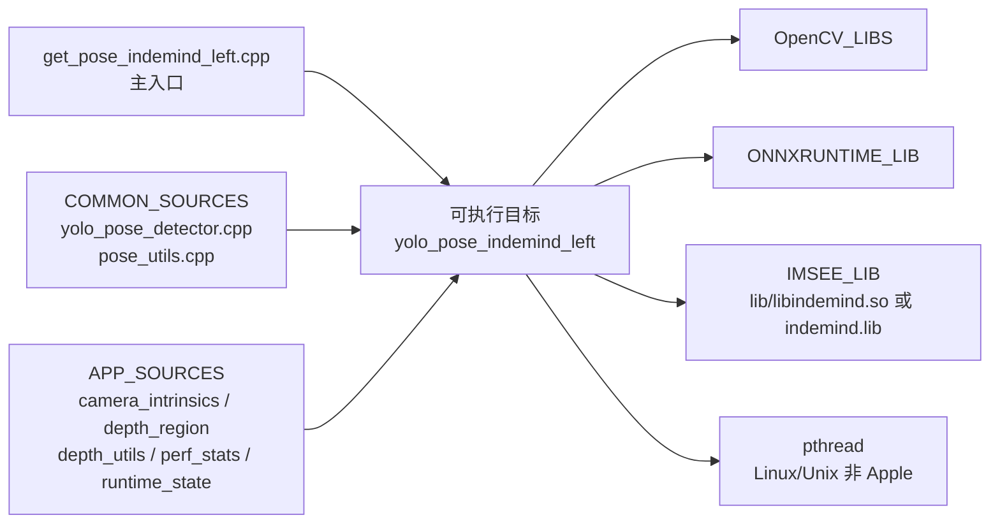
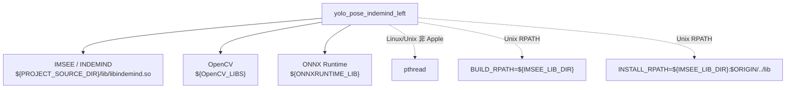

本页解释 YOLO_rec 项目的 **CMake 构建目标、源码聚合方式、第三方依赖查找与链接边界**。我的架构假设是：该仓库的构建系统不是多目标库化工程，而是以一个主可执行文件 `yolo_pose_indemind_left` 为中心，将入口文件、YOLO 推理模块、姿态工具模块和 `app/` 下的运行辅助模块直接编入同一目标，并在目标层链接 INDEMIND SDK、OpenCV、ONNX Runtime 与 Linux pthread。这个假设由 `add_executable()` 的源文件清单、`target_link_libraries()` 的依赖清单以及构建摘要中的单一可执行目标共同验证。Sources: [CMakeLists.txt](CMakeLists.txt#L171-L211), [CMakeLists.txt](CMakeLists.txt#L246-L257)

## 构建入口与全局配置

项目的 CMake 入口要求最低版本为 3.10，项目名为 `YOLOPoseDetection`，启用 C 与 C++ 两种语言，并将 C++ 标准固定为 C++14 且强制要求该标准。默认构建类型在未显式设置 `CMAKE_BUILD_TYPE` 时被设为 `Release`，这意味着普通 `cmake ..` 配置会进入发布构建路径，而非 Debug 路径。Sources: [CMakeLists.txt](CMakeLists.txt#L6-L20)

构建输出目录通过 `YOLO_OUTPUT_DIR` 控制；如果调用 CMake 时没有定义该变量，默认输出到源码目录下的 `build_agent_out`。这一设计使二进制输出位置不完全等同于 CMake 二进制目录，后续排查“make 成功但 build/ 下没有可执行文件”时，应先检查 `YOLO_OUTPUT_DIR` 的实际值。Sources: [CMakeLists.txt](CMakeLists.txt#L12-L15), [CMakeLists.txt](CMakeLists.txt#L201-L205)

平台识别分为 Windows、Linux 与 macOS 三类：`WIN32` 设置 `OS_WINDOWS`，`UNIX AND NOT APPLE` 设置 `OS_LINUX`，`APPLE` 设置 `OS_MACOS`。编译器参数则按 MSVC 与非 MSVC 分流：MSVC 使用 `/W3` 与 Release `/O2`；GCC/Clang 路径使用 `-Wall -Wextra`，Release 追加 `-O3 -march=native`，Debug 追加 `-g -O0`。Sources: [CMakeLists.txt](CMakeLists.txt#L28-L56)

## 构建目标拓扑

当前 CMake 文件实际定义的核心构建目标是 `yolo_pose_indemind_left`。它由入口文件 `get_pose_indemind_left.cpp`、公共推理/姿态源码 `yolo_pose_detector.cpp` 与 `pose_utils.cpp`、对应头文件，以及 `app/` 下的相机内参、深度区域、深度工具、性能统计和运行时状态源码组成。Sources: [CMakeLists.txt](CMakeLists.txt#L171-L199)

下图描述的是 CMake 层面的目标聚合关系，而不是运行时数据流；它回答“哪些源码被编进哪个可执行文件，以及该可执行文件依赖哪些外部库”。Sources: [CMakeLists.txt](CMakeLists.txt#L171-L211)

这种目标拓扑体现出一个 **单可执行文件聚合模式**：项目没有在 CMake 中把 YOLO 推理、姿态工具或 app 辅助模块拆成独立静态库/共享库，而是直接把源码列表传入 `add_executable()`。对中级开发者而言，这意味着新增 `.cpp` 文件后，如果它不被已有 `.cpp` 间接包含并需要参与链接，就必须显式加入相应源码列表，否则会出现未定义符号或目标中缺失实现的问题。Sources: [CMakeLists.txt](CMakeLists.txt#L171-L199)

## 源码列表与职责边界

`COMMON_SOURCES` 仅包含 `yolo_pose_detector.cpp` 与 `pose_utils.cpp`，对应 `COMMON_HEADERS` 包含 `yolo_pose_detector.h` 与 `pose_utils.h`。从包含关系看，`yolo_pose_detector.h` 同时依赖 OpenCV 与 ONNX Runtime C++ API，因此公共推理模块是第三方推理库与图像数据结构进入工程的主要编译边界。Sources: [CMakeLists.txt](CMakeLists.txt#L171-L179), [yolo_pose_detector.h](yolo_pose_detector.h#L1-L13)

`APP_SOURCES` 包含 `app/camera_intrinsics.cpp`、`app/depth_region.cpp`、`app/depth_utils.cpp`、`app/perf_stats.cpp` 和 `app/runtime_state.cpp`。这些文件被直接编入主目标，而不是作为单独库目标链接；因此它们的头文件可通过全局 include 路径被入口文件引用。Sources: [CMakeLists.txt](CMakeLists.txt#L181-L187), [get_pose_indemind_left.cpp](get_pose_indemind_left.cpp#L16-L20)

入口文件 `get_pose_indemind_left.cpp` 同时包含 INDEMIND SDK 头文件、YOLO/姿态工具头文件、`app/` 模块头文件以及 OpenCV 头文件。这解释了为什么 CMake 必须同时提供项目根目录、`app/`、SDK include、OpenCV include 和 ONNX Runtime include：入口与推理头文件在编译期都需要这些路径可见。Sources: [get_pose_indemind_left.cpp](get_pose_indemind_left.cpp#L8-L24), [CMakeLists.txt](CMakeLists.txt#L157-L166)

| CMake 分组 | 文件 | 进入目标的方式 | 构建含义 |
|---|---|---:|---|
| `COMMON_SOURCES` | `yolo_pose_detector.cpp`, `pose_utils.cpp` | 作为源码传入 `add_executable()` | 推理与姿态工具实现直接编入可执行文件 |
| `COMMON_HEADERS` | `yolo_pose_detector.h`, `pose_utils.h` | 作为目标文件清单的一部分 | 便于 IDE 展示；头文件本身不产生独立链接产物 |
| `APP_SOURCES` | `app/*.cpp` 中指定的五个实现文件 | 作为源码传入 `add_executable()` | app 辅助逻辑直接进入主目标 |
| 入口文件 | `get_pose_indemind_left.cpp` | `add_executable()` 第一项 | 定义最终程序入口与主编译单元 |

Sources: [CMakeLists.txt](CMakeLists.txt#L171-L199)

## 第三方依赖查找策略

OpenCV 是必需依赖，CMake 使用 `find_package(OpenCV REQUIRED)` 查找。找到后会输出 OpenCV 版本、包含目录与库列表；如果未找到，配置阶段会触发 `FATAL_ERROR`，因此 OpenCV 缺失会在生成 Makefile 前失败，而不是等到编译或链接阶段。Sources: [CMakeLists.txt](CMakeLists.txt#L58-L70)

ONNX Runtime 的查找策略是 **优先 Conda，再回退系统路径/项目内路径**。当环境变量 `CONDA_PREFIX` 存在时，CMake 先在 `${CONDA_PREFIX}/include/onnxruntime`、`${CONDA_PREFIX}/include` 与 `${CONDA_PREFIX}/lib` 中查找头文件和库；如果没有找到，再查 `/usr/local`、`/usr`、Windows Program Files 路径以及项目内 `onnxruntime` 目录。Sources: [CMakeLists.txt](CMakeLists.txt#L72-L118)

ONNX Runtime 同样是必需依赖：只有 `ONNXRUNTIME_INCLUDE_DIR` 与 `ONNXRUNTIME_LIB` 同时存在时才视为找到，否则配置阶段直接报错，并提示可手动设置 `ONNXRUNTIME_INCLUDE_DIR` 与 `ONNXRUNTIME_LIB`。已有构建缓存显示一次配置中 ONNX Runtime 被解析为 `/usr/local/include/onnxruntime` 与 `/usr/local/lib/libonnxruntime.so`。Sources: [CMakeLists.txt](CMakeLists.txt#L120-L130), [CMakeCache.txt](build_agent_out/CMakeCache.txt#L227-L231)

INDEMIND/IMSEE SDK 的路径不是通过 `find_package()` 查找，而是被约定在项目源码目录下：头文件目录为 `${PROJECT_SOURCE_DIR}/include`，库目录为 `${PROJECT_SOURCE_DIR}/lib`。Linux/macOS 路径使用 `lib/libindemind.so`，Windows 路径使用 `indemind.lib` 并记录 DLL 路径 `indemind.dll`。Sources: [CMakeLists.txt](CMakeLists.txt#L132-L142)

IMSEE SDK 的存在性检查要求 `${IMSEE_INCLUDE_DIR}/imrsdk.h` 与 `${IMSEE_LIB}` 同时存在；任一缺失都会导致 CMake 配置阶段 `FATAL_ERROR`。该检查与仓库中的 `include/imrsdk.h`、`lib/libindemind.so` 目录约定一致，是相机 SDK 链接成功的前置条件。Sources: [CMakeLists.txt](CMakeLists.txt#L144-L155)

| 依赖 | 查找方式 | 必需性 | 主要变量 | 失败时机 |
|---|---|---:|---|---|
| OpenCV | `find_package(OpenCV REQUIRED)` | 必需 | `OpenCV_INCLUDE_DIRS`, `OpenCV_LIBS`, `OpenCV_VERSION` | CMake 配置阶段 |
| ONNX Runtime | `find_path()` + `find_library()`，先 Conda 后系统路径 | 必需 | `ONNXRUNTIME_INCLUDE_DIR`, `ONNXRUNTIME_LIB` | CMake 配置阶段 |
| IMSEE SDK / INDEMIND | 固定项目内 `include/` 与 `lib/` 约定 | 必需 | `IMSEE_INCLUDE_DIR`, `IMSEE_LIB_DIR`, `IMSEE_LIB` | CMake 配置阶段 |
| pthread | Linux/Unix 非 Apple 条件链接 | 条件必需 | `pthread` | 链接阶段 |

Sources: [CMakeLists.txt](CMakeLists.txt#L62-L155), [CMakeLists.txt](CMakeLists.txt#L207-L215)

## Include 路径与编译可见性

CMake 使用全局 `include_directories()` 注入五类包含目录：项目根目录、`app/` 目录、IMSEE SDK include、OpenCV include、ONNX Runtime include。由于这是目录级设置，而不是 `target_include_directories(yolo_pose_indemind_left ...)`，这些包含路径会作用于当前 CMake 目录范围内后续目标；当前文件中实际只有主目标消费这些路径。Sources: [CMakeLists.txt](CMakeLists.txt#L157-L166), [CMakeLists.txt](CMakeLists.txt#L193-L211)

这些 include 路径与源码中的引用方式一一对应：入口文件直接包含 `"imrdata.h"`、`"imrsdk.h"` 等 SDK 头文件，包含 `"app/camera_intrinsics.h"` 等 app 头文件，并包含 OpenCV 头文件；YOLO 推理头文件包含 `<onnxruntime_cxx_api.h>`。因此，缺失任一 include 路径通常会表现为编译阶段的“找不到头文件”，而不是链接阶段错误。Sources: [get_pose_indemind_left.cpp](get_pose_indemind_left.cpp#L8-L24), [yolo_pose_detector.h](yolo_pose_detector.h#L9-L13), [CMakeLists.txt](CMakeLists.txt#L160-L166)

## 链接关系与运行时库路径

`yolo_pose_indemind_left` 目标链接三个核心库集合：`${IMSEE_LIB}`、`${OpenCV_LIBS}` 与 `${ONNXRUNTIME_LIB}`。在 Linux/Unix 非 Apple 平台上，目标还额外链接 `pthread`，这与 SDK 头文件中对 pthread 的使用边界相匹配。Sources: [CMakeLists.txt](CMakeLists.txt#L207-L215), [logging.h](include/logging.h#L100-L112)

在 Unix 平台上，CMake 为目标设置 `BUILD_RPATH` 与 `INSTALL_RPATH`。`BUILD_RPATH` 指向 `${IMSEE_LIB_DIR}`，使构建产物在构建目录附近运行时能定位项目内 SDK 动态库；`INSTALL_RPATH` 同时包含 `${IMSEE_LIB_DIR}` 与 `$ORIGIN/../lib`，为安装后相对可执行文件查找 `../lib` 提供路径。Sources: [CMakeLists.txt](CMakeLists.txt#L217-L222)

下图展示链接阶段的依赖流向；注意它只表达 CMake 链接关系，不表达 ONNX 模型文件或相机设备的运行时加载流程。Sources: [CMakeLists.txt](CMakeLists.txt#L207-L222)

## 构建脚本与 CMake 的边界

`build_linux.sh` 是 Linux 下的外层构建编排脚本：它先确认当前目录存在 `CMakeLists.txt`，再检查 CMake、G++、OpenCV、ONNX Runtime、`include/` 目录和 `lib/libindemind.so`，随后创建 `build` 目录、执行 `cmake ..` 并调用 `make -j$(nproc)`。这些检查属于脚本层预检；真正决定目标、源码和链接关系的是 `CMakeLists.txt`。Sources: [build_linux.sh](build_linux.sh#L32-L65), [build_linux.sh](build_linux.sh#L67-L97), [build_linux.sh](build_linux.sh#L109-L137)

脚本对 OpenCV 的预检使用 `pkg-config --exists opencv`，而 CMake 使用 `find_package(OpenCV REQUIRED)`；二者不是同一机制。因此脚本预检给出警告并允许继续时，后续 CMake 仍可能因为 `find_package(OpenCV REQUIRED)` 未找到合适 OpenCV 配置而失败。Sources: [build_linux.sh](build_linux.sh#L54-L65), [CMakeLists.txt](CMakeLists.txt#L62-L70)

脚本对 ONNX Runtime 的预检只检查 Conda 下的 `libonnxruntime.so` 或 `/usr/local/lib/libonnxruntime.so`，而 CMake 还会查找 include 路径、系统路径、Windows 路径和项目内 `onnxruntime` 路径。因此脚本检查是快速提示，CMake 检查才是最终配置判定。Sources: [build_linux.sh](build_linux.sh#L67-L86), [CMakeLists.txt](CMakeLists.txt#L72-L130)

## 输出、安装与摘要信息

目标属性将运行时输出目录设为 `${YOLO_OUTPUT_DIR}`，并将输出名固定为 `yolo_pose_indemind_left`。这意味着即便 CMake 的构建目录名不同，只要未覆盖 `YOLO_OUTPUT_DIR`，最终可执行文件默认仍会落到项目根目录下的 `build_agent_out/yolo_pose_indemind_left`。Sources: [CMakeLists.txt](CMakeLists.txt#L12-L15), [CMakeLists.txt](CMakeLists.txt#L201-L205)

安装规则只安装 `yolo_pose_indemind_left` 一个目标，运行时目标目的地为 `bin`。构建摘要也只列出一个可执行文件，并打印输出目录以及 OpenCV、ONNX Runtime、IMSEE SDK 三类依赖。Sources: [CMakeLists.txt](CMakeLists.txt#L224-L229), [CMakeLists.txt](CMakeLists.txt#L243-L257)

CMake 摘要给出的构建命令是 `mkdir -p build && cd build`、`cmake ..`、`make`，运行提示在 Windows 与非 Windows 下分流；非 Windows 提示为 `sudo ./build/yolo_pose_indemind_left`。需要注意的是，实际运行路径还受 `YOLO_OUTPUT_DIR` 影响，因为目标输出目录被显式改为 `${YOLO_OUTPUT_DIR}`。Sources: [CMakeLists.txt](CMakeLists.txt#L258-L268), [CMakeLists.txt](CMakeLists.txt#L201-L205)

## 维护注意点

Windows 后构建复制 DLL 的分支中，`add_custom_command(TARGET yolo_pose_detection POST_BUILD ...)` 引用了 `yolo_pose_detection`，而本 CMake 文件实际定义的可执行目标是 `yolo_pose_indemind_left`。这是一处目标名不一致：在维护 Windows 构建路径时，应优先核对该分支的目标名与 `add_executable()` 定义是否一致。Sources: [CMakeLists.txt](CMakeLists.txt#L193-L205), [CMakeLists.txt](CMakeLists.txt#L231-L241)

如果新增第三方库，当前文件的模式要求完成三件事：先通过 `find_package()`、`find_path()` 或固定路径建立依赖变量，再把 include 目录加入编译可见范围，最后把库变量加入 `target_link_libraries(yolo_pose_indemind_left ...)`。现有 OpenCV、ONNX Runtime 与 IMSEE SDK 正好分别展示了包查找、手工查找和项目内固定路径三种模式。Sources: [CMakeLists.txt](CMakeLists.txt#L62-L155), [CMakeLists.txt](CMakeLists.txt#L157-L166), [CMakeLists.txt](CMakeLists.txt#L207-L215)

如果新增项目内 `.cpp` 模块，当前 CMake 没有自动递归收集源码；新增实现文件需要显式加入 `COMMON_SOURCES`、`APP_SOURCES` 或 `add_executable()` 的源文件列表。否则头文件即使能被 include 找到，实现也不会进入链接目标。Sources: [CMakeLists.txt](CMakeLists.txt#L171-L199)

## 推荐阅读路径

理解本页后，如果你要确认本目标如何在整体程序中消费相机帧与推理结果，下一步阅读 [整体架构与端到端数据流](10-zheng-ti-jia-gou-yu-duan-dao-duan-shu-ju-liu)；如果你要深入 ONNX Runtime 在 `yolo_pose_detector` 中的使用方式，继续阅读 [YOLOv8-Pose ONNX 推理器设计](12-yolov8-pose-onnx-tui-li-qi-she-ji)；如果你的问题集中在本地环境缺依赖、路径不匹配或启动参数，回到 [运行环境与依赖检查](3-yun-xing-huan-jing-yu-yi-lai-jian-cha) 与 [编译、运行与常见启动参数](5-bian-yi-yun-xing-yu-chang-jian-qi-dong-can-shu)。Sources: [CMakeLists.txt](CMakeLists.txt#L207-L215), [yolo_pose_detector.h](yolo_pose_detector.h#L60-L75), [build_linux.sh](build_linux.sh#L38-L86)