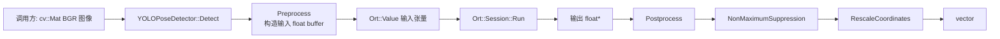
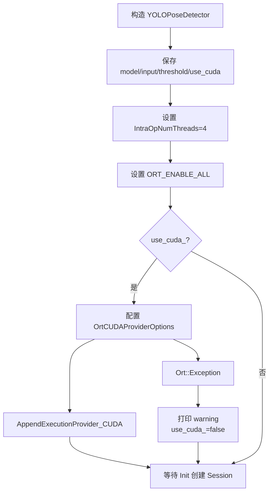
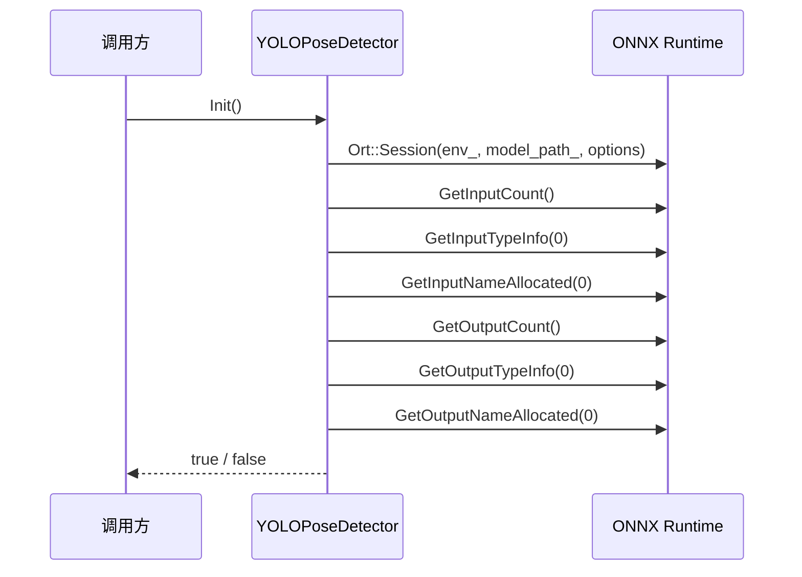

本页聚焦当前目录中 `YOLOPoseDetector` 的**推理器设计**：它如何封装 ONNX Runtime 会话、如何暴露检测接口、如何维护模型输入输出元信息，以及如何把一次 `cv::Mat` 图像转换为 `std::vector<PoseResult>`。本页不展开图像预处理、输出张量解析、NMS 数学细节；这些细节建议继续阅读 [图像预处理、输出解析与非极大值抑制](13-tu-xiang-yu-chu-li-shu-chu-jie-xi-yu-fei-ji-da-zhi-yi-zhi)。Sources: [yolo_pose_detector.h](yolo_pose_detector.h#L60-L174), [yolo_pose_detector.cpp](yolo_pose_detector.cpp#L170-L213)

## 架构假设与验证结论

从第一性原理看，一个 ONNX 姿态推理器至少要解决四件事：**模型生命周期管理**、**输入输出张量命名与形状发现**、**单帧推理执行**、**结果结构化返回**。代码验证后，当前实现确实把这四件事集中在 `YOLOPoseDetector` 类内：构造函数配置 ONNX Runtime 环境与执行提供程序，`Init()` 创建 session 并读取输入输出元信息，`Detect()` 负责单帧推理闭环，私有方法承担预处理、后处理、NMS、坐标回缩。Sources: [yolo_pose_detector.h](yolo_pose_detector.h#L70-L145), [yolo_pose_detector.cpp](yolo_pose_detector.cpp#L10-L47), [yolo_pose_detector.cpp](yolo_pose_detector.cpp#L53-L117), [yolo_pose_detector.cpp](yolo_pose_detector.cpp#L170-L213)

上图表达的是类内部的责任闭环，而不是完整业务链路：`Detect()` 内部显式调用 `Preprocess()`，随后创建 `{1, 3, input_size_, input_size_}` 输入张量并执行 `session_->Run()`，最后把输出指针交给 `Postprocess()` 返回结构化结果。Sources: [yolo_pose_detector.cpp](yolo_pose_detector.cpp#L181-L210)

## 类边界：推理器是一个有状态服务对象

`YOLOPoseDetector` 不是无状态函数集合，而是一个**有状态推理服务对象**。它保存模型路径、输入尺寸、置信度阈值、IoU 阈值、CUDA 开关、ONNX Runtime 环境、session options、session 指针、allocator、输入输出名称、输入输出形状，以及 letterbox 过程中需要复用的缩放与 padding 参数。Sources: [yolo_pose_detector.h](yolo_pose_detector.h#L147-L173)

| 成员类别 | 代表字段 | 设计作用 |
|---|---|---|
| 配置参数 | `model_path_`, `input_size_`, `conf_threshold_`, `iou_threshold_`, `use_cuda_` | 固化模型、输入尺寸与过滤策略 |
| ONNX Runtime 资源 | `env_`, `session_options_`, `session_`, `allocator_` | 管理推理运行时与模型会话 |
| 模型元信息 | `input_names_`, `output_names_`, `input_shape_`, `output_shape_` | 保存 session 查询得到的输入输出信息 |
| 推理中间状态 | `scale_factor_`, `pad_w_`, `pad_h_`, `initialized_` | 支撑坐标回缩与初始化保护 |

这些字段全部定义在类私有区，外部只能通过构造函数、`Init()`、`Detect()`、阈值 setter 和 `GetInputSize()` 与推理器交互，因此调用方不直接接触 ONNX Runtime 的 session、allocator 或 tensor name 指针。Sources: [yolo_pose_detector.h](yolo_pose_detector.h#L70-L105), [yolo_pose_detector.h](yolo_pose_detector.h#L147-L173)

## 公共 API：最小可用接口

当前公共接口围绕“创建、初始化、推理、调参”四个动作展开。构造函数接收 `model_path`、`input_size`、`conf_threshold`、`iou_threshold` 和 `use_cuda`；`Init()` 负责加载模型并发现元信息；`Detect()` 接收一张 BGR 图像并返回多人姿态结果；`SetConfThreshold()` 与 `SetIoUThreshold()` 支持运行期修改过滤阈值；`GetInputSize()` 返回当前模型输入尺寸。Sources: [yolo_pose_detector.h](yolo_pose_detector.h#L63-L105)

| API | 输入 | 输出 | 代码层责任 |
|---|---|---|---|
| `YOLOPoseDetector(...)` | 模型路径、输入尺寸、阈值、CUDA 开关 | 对象实例 | 初始化配置与 ONNX Runtime options |
| `Init()` | 无 | `bool` | 创建 session，读取输入输出名称与形状 |
| `Detect(image)` | `cv::Mat` BGR 图像 | `std::vector<PoseResult>` | 执行一次端到端推理 |
| `SetConfThreshold(threshold)` | `float` | 无 | 修改检测置信度阈值 |
| `SetIoUThreshold(threshold)` | `float` | 无 | 修改 NMS IoU 阈值 |
| `GetInputSize()` | 无 | `int` | 查询输入边长 |

这个 API 形状使主程序只需持有一个检测器实例，并在主循环中对最新图像调用 `Detect()`；主程序中的实例化参数为模型路径、输入尺寸 `640`、置信度 `0.5f`、IoU `0.45f`、CUDA 开启。Sources: [get_pose_indemind_left.cpp](get_pose_indemind_left.cpp#L493-L500), [yolo_pose_detector.h](yolo_pose_detector.h#L70-L105)

## ONNX Runtime 初始化策略

构造函数首先把外部传入参数写入成员变量，并创建 `Ort::Env`，随后设置 session 线程数为 4、图优化等级为 `ORT_ENABLE_ALL`。如果 `use_cuda_` 为真，构造函数会配置 `OrtCUDAProviderOptions`，指定 `device_id = 0`、arena 扩展策略、cuDNN 卷积算法搜索方式与默认 stream 拷贝策略，然后把 CUDA execution provider 追加到 session options。Sources: [yolo_pose_detector.cpp](yolo_pose_detector.cpp#L10-L40)

CUDA provider 的配置被包在 `try/catch` 中；当 `AppendExecutionProvider_CUDA()` 抛出 `Ort::Exception` 时，代码打印警告并把 `use_cuda_` 置为 `false`，表示回退到 CPU execution。析构函数没有显式释放 ONNX Runtime 资源，因为 session 由 `std::unique_ptr<Ort::Session>` 持有，注释也说明清理由智能指针处理。Sources: [yolo_pose_detector.cpp](yolo_pose_detector.cpp#L31-L50), [yolo_pose_detector.h](yolo_pose_detector.h#L154-L158)

该初始化策略把**执行提供程序选择**放在 session 创建之前完成，因为 `Init()` 创建 `Ort::Session` 时会直接使用构造阶段配置好的 `session_options_`。Sources: [yolo_pose_detector.cpp](yolo_pose_detector.cpp#L27-L40), [yolo_pose_detector.cpp](yolo_pose_detector.cpp#L53-L61)

## `Init()`：模型加载与元信息发现

`Init()` 的核心职责是创建 ONNX Runtime session，并把模型的输入输出元信息缓存到对象内部。它先打印模型路径和输入尺寸，再用 `env_`、`model_path_`、`session_options_` 构造 `Ort::Session`，随后检查输入节点数量必须为 1，并读取输入 tensor shape、输入名称、输入名称 C 字符串指针。Sources: [yolo_pose_detector.cpp](yolo_pose_detector.cpp#L53-L84)

输出侧采用同样的防御式检查：输出节点数量必须为 1，随后读取输出 tensor shape、输出名称、输出名称 C 字符串指针，并在成功后把 `initialized_` 设置为 `true`。如果 ONNX Runtime 抛出异常，`Init()` 捕获 `Ort::Exception`，打印错误并返回 `false`。Sources: [yolo_pose_detector.cpp](yolo_pose_detector.cpp#L86-L117)

这里的关键设计点是：`Detect()` 运行时不再动态查询输入输出名称，而是复用 `Init()` 阶段缓存的 `input_names_ptrs_` 与 `output_names_ptrs_`，从而让单帧推理路径更短、更稳定。Sources: [yolo_pose_detector.cpp](yolo_pose_detector.cpp#L74-L99), [yolo_pose_detector.cpp](yolo_pose_detector.cpp#L197-L204)

## `Detect()`：单帧推理编排器

`Detect()` 是推理器的运行期入口。它首先检查 `initialized_`，未初始化时打印 `"Detector not initialized! Call Init() first."` 并返回空结果；随后检查输入图像是否为空，空图像同样返回空结果。这两个保护使调用方即使误用接口，也不会直接触发 session 或 tensor 构造阶段的未定义行为。Sources: [yolo_pose_detector.cpp](yolo_pose_detector.cpp#L170-L179)

通过保护后，`Detect()` 创建 `std::vector<float> input_data` 并调用 `Preprocess()`，随后显式构造输入 shape `{1, 3, input_size_, input_size_}`，使用 `Ort::MemoryInfo::CreateCpu(OrtArenaAllocator, OrtMemTypeDefault)` 创建 CPU memory info，再用 `Ort::Value::CreateTensor<float>()` 包装输入 buffer。Sources: [yolo_pose_detector.cpp](yolo_pose_detector.cpp#L181-L195)

真正的推理由 `session_->Run()` 执行，输入输出名称均来自 `Init()` 阶段缓存的指针数组；推理完成后，代码从第一个输出 tensor 中取得 `float*`，交给 `Postprocess(output_data, image.size())`，最终返回 `std::vector<PoseResult>`。Sources: [yolo_pose_detector.cpp](yolo_pose_detector.cpp#L197-L212)

## 数据结构：从模型输出到业务可消费结果

推理器返回的基本单位是 `PoseResult`，它包含一个 `cv::Rect bbox`、一个人体框置信度 `box_confidence`、17 个 `KeyPoint` 以及可选 `person_id`。`PoseResult` 默认构造时会把 `keypoints` resize 到 17，保证调用方可以按 COCO 关键点索引直接访问。Sources: [yolo_pose_detector.h](yolo_pose_detector.h#L48-L58)

`KeyPoint` 保存二维像素坐标 `x/y`、关键点置信度字段 `confidence`，以及一个预留的 `cv::Point3f pos3d`。在本页范围内，`YOLOPoseDetector` 只负责输出二维关键点与可见性/置信度值；深度融合后的三维坐标属于后续深度与三维重建链路，不在本页展开。Sources: [yolo_pose_detector.h](yolo_pose_detector.h#L36-L46), [yolo_pose_detector.cpp](yolo_pose_detector.cpp#L267-L276)

COCO 17 关键点枚举直接定义在 `yolo_pose_detector.h` 中，索引从 `NOSE = 0` 到 `RIGHT_ANKLE = 16`，这让后续模块可以用具名枚举访问髋、肩、膝、踝等点，而不是散落硬编码数字。具体骨架可视化和关键点语义建议继续阅读 [COCO 17 关键点数据结构与骨架可视化](14-coco-17-guan-jian-dian-shu-ju-jie-gou-yu-gu-jia-ke-shi-hua)。Sources: [yolo_pose_detector.h](yolo_pose_detector.h#L15-L34)

## 后处理责任在类内闭环，但细节可独立理解

`YOLOPoseDetector` 的私有方法把后处理分成三个阶段：`Postprocess()` 解析输出张量并生成候选框，`NonMaximumSuppression()` 对候选结果做置信度排序和重叠抑制，`RescaleCoordinates()` 把模型输入坐标系中的框与关键点映射回原图坐标系。Sources: [yolo_pose_detector.h](yolo_pose_detector.h#L116-L145), [yolo_pose_detector.cpp](yolo_pose_detector.cpp#L215-L289), [yolo_pose_detector.cpp](yolo_pose_detector.cpp#L292-L381)

| 阶段 | 方法 | 输入 | 输出 | 本页关注点 |
|---|---|---|---|---|
| 输出解析 | `Postprocess()` | `float* output`, 原图尺寸 | 候选结果与最终结果 | 作为推理器内部后处理入口 |
| 重叠抑制 | `NonMaximumSuppression()` | 候选 `PoseResult` | 过滤后的 `PoseResult` | 保持单帧输出更可用 |
| 坐标回缩 | `RescaleCoordinates()` | NMS 后结果、原图尺寸 | 原图坐标结果 | 与预处理中的缩放/padding 状态配合 |

表中的三个阶段都属于推理器内部职责，因此调用方只看到 `Detect()` 返回的结构化结果；若需要理解 YOLOv8-pose 输出格式 `[1, 56, 8400]`、关键点起始索引和 NMS 计算细节，应转到 [图像预处理、输出解析与非极大值抑制](13-tu-xiang-yu-chu-li-shu-chu-jie-xi-yu-fei-ji-da-zhi-yi-zhi)。Sources: [yolo_pose_detector.cpp](yolo_pose_detector.cpp#L219-L235), [yolo_pose_detector.cpp](yolo_pose_detector.cpp#L267-L282), [yolo_pose_detector.cpp](yolo_pose_detector.cpp#L292-L381)

## 构建集成：推理器作为公共源码被装入可执行目标

构建系统把 `yolo_pose_detector.cpp` 和 `pose_utils.cpp` 放入 `COMMON_SOURCES`，把 `yolo_pose_detector.h` 和 `pose_utils.h` 放入 `COMMON_HEADERS`，随后在 `yolo_pose_indemind_left` 可执行目标中同时编入主入口、公共源码、公共头与 `app/` 源码。Sources: [CMakeLists.txt](CMakeLists.txt#L171-L199)

推理器依赖 OpenCV 与 ONNX Runtime：CMake 使用 `find_package(OpenCV REQUIRED)` 查找 OpenCV，并优先在 Conda 环境中查找 ONNX Runtime include 与 library，找不到时再回退到系统路径或项目内路径。Sources: [CMakeLists.txt](CMakeLists.txt#L62-L130)

最终链接阶段，`yolo_pose_indemind_left` 链接 INDEMIND SDK、OpenCV 库和 ONNX Runtime 库；Linux 非 Apple 平台还额外链接 `pthread`。这说明推理器并不是独立可执行程序，而是作为业务可执行目标中的一个核心模块参与链接。Sources: [CMakeLists.txt](CMakeLists.txt#L207-L215)

## 主程序中的使用方式

主程序先从命令行读取模型路径，默认模型路径写在 `model_path` 变量中；随后创建 `YOLOPoseDetector pose_detector(model_path, 640, 0.5f, 0.45f, true)`，并立即调用 `pose_detector.Init()`，初始化失败时打印错误、释放 SDK 并返回 `-1`。Sources: [get_pose_indemind_left.cpp](get_pose_indemind_left.cpp#L448-L452), [get_pose_indemind_left.cpp](get_pose_indemind_left.cpp#L493-L500)

在运行期，主循环取得左目图像后调用 `pose_detector.Detect(left_image)`，并用 `std::chrono::steady_clock` 统计推理耗时；如果检测结果非空，则增加 `pose_count`。这表明 `YOLOPoseDetector` 在主流程中承担的是**同步单帧推理服务**，而不是异步队列或线程管理组件。Sources: [get_pose_indemind_left.cpp](get_pose_indemind_left.cpp#L623-L661)

## 设计取舍总结

当前实现的优势是边界清晰：ONNX Runtime 细节被封装在 `YOLOPoseDetector` 内，调用方只需要初始化一次并反复调用 `Detect()`；输入输出名称和 shape 在 `Init()` 阶段缓存，降低了每帧推理路径中的元信息查询；CUDA 配置失败会回退 CPU，避免初始化阶段直接崩溃。Sources: [yolo_pose_detector.cpp](yolo_pose_detector.cpp#L31-L45), [yolo_pose_detector.cpp](yolo_pose_detector.cpp#L53-L117), [yolo_pose_detector.cpp](yolo_pose_detector.cpp#L170-L213)

需要注意的边界是：该类保存 `scale_factor_`、`pad_w_`、`pad_h_` 等预处理状态，并在后处理坐标回缩阶段使用这些状态，因此它的实现语义是“一次 `Detect()` 内部完成预处理、推理、后处理闭环”。当前代码没有暴露批量推理接口，也没有在类内管理图像采集、深度同步或业务状态机。Sources: [yolo_pose_detector.h](yolo_pose_detector.h#L168-L173), [yolo_pose_detector.cpp](yolo_pose_detector.cpp#L119-L168), [yolo_pose_detector.cpp](yolo_pose_detector.cpp#L348-L381)

## 下一步阅读

如果你想继续沿核心推理链路向下理解，下一页应阅读 [图像预处理、输出解析与非极大值抑制](13-tu-xiang-yu-chu-li-shu-chu-jie-xi-yu-fei-ji-da-zhi-yi-zhi)，它会承接本页中 `Preprocess()`、`Postprocess()`、`NonMaximumSuppression()` 与 `RescaleCoordinates()` 的实现细节。Sources: [yolo_pose_detector.h](yolo_pose_detector.h#L108-L145), [yolo_pose_detector.cpp](yolo_pose_detector.cpp#L119-L381)

如果你想理解 `PoseResult` 中 17 个关键点如何被命名、绘制和连接，应阅读 [COCO 17 关键点数据结构与骨架可视化](14-coco-17-guan-jian-dian-shu-ju-jie-gou-yu-gu-jia-ke-shi-hua)；如果你想回到全局视角理解该推理器在端到端系统中的位置，应阅读 [整体架构与端到端数据流](10-zheng-ti-jia-gou-yu-duan-dao-duan-shu-ju-liu)。Sources: [yolo_pose_detector.h](yolo_pose_detector.h#L15-L58), [get_pose_indemind_left.cpp](get_pose_indemind_left.cpp#L493-L500), [get_pose_indemind_left.cpp](get_pose_indemind_left.cpp#L623-L661)