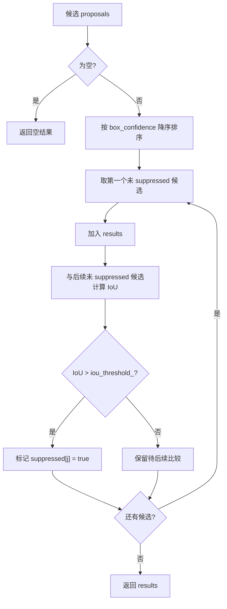

本页聚焦 `YOLOPoseDetector` 中围绕单帧 BGR 图像的三段核心后处理链路：**预处理将原图变成 ONNX Runtime 可消费的 NCHW float 张量**，**输出解析将 YOLOv8-Pose 的 `[1, 56, N]` 张量还原为候选人体框与 17 个关键点**，**非极大值抑制用 IoU 去除重叠候选并把坐标映射回原图**；模型会话初始化、CUDA/CPU 执行提供程序、COCO 关键点语义、深度融合与业务姿态判断不在本页展开，可分别转向 [YOLOv8-Pose ONNX 推理器设计](12-yolov8-pose-onnx-tui-li-qi-she-ji)、[COCO 17 关键点数据结构与骨架可视化](14-coco-17-guan-jian-dian-shu-ju-jie-gou-yu-gu-jia-ke-shi-hua) 与后续深度/业务页面。Sources: [yolo_pose_detector.h](yolo_pose_detector.h#L85-L145), [yolo_pose_detector.cpp](yolo_pose_detector.cpp#L119-L168), [yolo_pose_detector.cpp](yolo_pose_detector.cpp#L215-L381)

## 架构假设与代码验证结论

从第一性原理看，YOLOv8-Pose 的图像推理链路必须保持两个坐标空间的一致性：模型输入空间是固定正方形，例如调用处使用 `1280`，而相机图像空间来自原始 `cv::Mat`；因此代码需要在预处理阶段记录缩放比例与 padding，在输出解析阶段先按模型空间构造框与关键点，最后再用相同参数反变换回原图。该假设在实现中得到验证：构造器保存 `input_size_`、`conf_threshold_`、`iou_threshold_`，调用处以 `YOLOPoseDetector(model_path, 1280, 0.5f, 0.45f, true)` 创建检测器，预处理记录 `scale_factor_`、`pad_w_`、`pad_h_`，后处理的 `RescaleCoordinates` 使用这些参数移除 padding 并除以缩放比例。Sources: [yolo_pose_detector.cpp](yolo_pose_detector.cpp#L10-L25), [get_pose_indemind_left.cpp](get_pose_indemind_left.cpp#L720-L727), [yolo_pose_detector.cpp](yolo_pose_detector.cpp#L123-L147), [yolo_pose_detector.cpp](yolo_pose_detector.cpp#L348-L381)

```mermaid
flowchart LR
    A["原始 BGR cv::Mat"] --> B["Letterbox resize<br/>记录 scale_factor_ / pad_w_ / pad_h_"]
    B --> C["BGR → RGB"]
    C --> D["归一化到 [0,1]<br/>HWC → CHW"]
    D --> E["ONNX 输入张量<br/>[1,3,input_size,input_size]"]
    E --> F["模型输出<br/>[1,56,num_proposals]"]
    F --> G["转置为<br/>[num_proposals,56]"]
    G --> H["置信度过滤<br/>解析 bbox + 17 keypoints"]
    H --> I["按 box_confidence 排序"]
    I --> J["IoU NMS"]
    J --> K["坐标反变换回原图"]
```

上图中的每个节点都能在实现中定位到对应代码：`Detect` 先调用 `Preprocess`，再创建 `{1, 3, input_size_, input_size_}` 输入张量并执行 `session_->Run`，随后把第一个输出张量的 float 指针传入 `Postprocess`；`Postprocess` 内部完成转置、候选解析、NMS 与坐标反变换。Sources: [yolo_pose_detector.cpp](yolo_pose_detector.cpp#L170-L212), [yolo_pose_detector.cpp](yolo_pose_detector.cpp#L215-L289)

## 预处理：保持比例的 Letterbox 与张量布局转换

预处理入口 `Preprocess(const cv::Mat& image, std::vector<float>& input_data)` 接收 OpenCV 默认的 BGR 图像，首先读取原图宽高，然后用 `min(input_size_/img_w, input_size_/img_h)` 计算等比例缩放系数；新宽高由原图尺寸乘以该系数得到，左右与上下 padding 分别保存在 `pad_w_`、`pad_h_` 中。这个设计的关键约束是：**不拉伸人体几何形状**，只通过灰色边框补齐到模型所需的正方形输入。Sources: [yolo_pose_detector.cpp](yolo_pose_detector.cpp#L119-L136), [yolo_pose_detector.h](yolo_pose_detector.h#L168-L171)

预处理随后使用 `cv::resize` 生成缩放图，再用 `cv::copyMakeBorder` 填充到 `input_size_ × input_size_`，边框颜色固定为 `cv::Scalar(114, 114, 114)`；这一步之后，所有像素已经处在模型输入坐标空间，但仍是 BGR 排列。代码接着执行 `cv::cvtColor(padded, rgb, cv::COLOR_BGR2RGB)`，再用 `convertTo(CV_32F, 1.0 / 255.0)` 将像素归一化到 `[0, 1]`。Sources: [yolo_pose_detector.cpp](yolo_pose_detector.cpp#L137-L155)

最后一步是内存布局转换：OpenCV 图像默认是 HWC 排列，而 ONNX 输入张量在 `Detect` 中被声明为 `[1, 3, input_size_, input_size_]`，因此 `Preprocess` 先 `cv::split` 出 RGB 三个通道，再按通道顺序连续拷贝到 `input_data`，每个通道大小为 `input_size_ * input_size_`。这意味着输入向量的连续内存布局是 **R 平面、G 平面、B 平面**，而不是逐像素交错。Sources: [yolo_pose_detector.cpp](yolo_pose_detector.cpp#L156-L168), [yolo_pose_detector.cpp](yolo_pose_detector.cpp#L181-L195)

| 阶段 | 输入 | 输出 | 关键状态 | 代码行为 |
|---|---|---|---|---|
| 等比例缩放 | 原始 BGR 图像 | resized 图像 | `scale_factor_` | 使用宽高方向的较小缩放比例 |
| Padding | resized 图像 | 正方形 padded 图像 | `pad_w_`, `pad_h_` | 使用 114 灰色常量边框补齐 |
| 色彩与数值转换 | padded BGR | RGB float 图像 | 无新增状态 | BGR 转 RGB，除以 255 |
| 布局转换 | HWC RGB | CHW float vector | `input_data` | 分通道拷贝到连续内存 |

该表只归纳 `Preprocess` 中实际存在的转换步骤；代码没有在此处执行均值方差标准化，也没有在预处理阶段改变检测阈值或 NMS 阈值。Sources: [yolo_pose_detector.cpp](yolo_pose_detector.cpp#L119-L168)

## Detect 中的预处理与后处理衔接

`Detect` 是预处理、ONNX 推理与后处理的编排入口：它先检查检测器是否初始化、输入图像是否为空，然后调用 `Preprocess` 填充 `input_data`；接着创建 CPU memory info，并用 `Ort::Value::CreateTensor<float>` 把 `input_data` 包装成形状为 `{1, 3, input_size_, input_size_}` 的张量。Sources: [yolo_pose_detector.cpp](yolo_pose_detector.cpp#L170-L195)

推理阶段调用 `session_->Run`，输入名、输出名来自初始化阶段缓存的 `input_names_ptrs_` 与 `output_names_ptrs_`；推理结束后，代码通过 `GetTensorMutableData<float>()` 获取第一个输出张量的原始 float 指针，并将该指针与原始图像尺寸 `image.size()` 一起传给 `Postprocess`。这里的原始尺寸非常重要，因为坐标反变换必须知道最终要 clamp 到哪个图像边界。Sources: [yolo_pose_detector.cpp](yolo_pose_detector.cpp#L197-L212), [yolo_pose_detector.cpp](yolo_pose_detector.cpp#L348-L360)

## 输出张量格式：从 `[1,56,N]` 到候选人体

后处理入口 `Postprocess(float* output, const cv::Size& original_size)` 明确记录了 YOLOv8-Pose 输出格式：`[1, 56, 8400]`，其中 `56 = 4 + 1 + 17*3`，分别表示边界框中心点与宽高、人体检测置信度、17 个关键点的 `x/y/visibility`；候选数量来自 `output_shape_[2]`，元素数量来自 `output_shape_[1]`，因此代码并不把 `8400` 写死到循环中。Sources: [yolo_pose_detector.cpp](yolo_pose_detector.cpp#L215-L226)

模型输出的内存访问方式是按 `[56, num_proposals]` 展开，因此代码先分配 `num_proposals * num_elements` 大小的 `transposed`，通过双重循环把 `output[j * num_proposals + i]` 放入 `transposed[i * num_elements + j]`，相当于把每个候选的 56 个字段变成连续块，便于逐候选解析。Sources: [yolo_pose_detector.cpp](yolo_pose_detector.cpp#L227-L235)

每个候选的前 4 个元素被解释为 `cx, cy, w, h`，第 5 个元素 `ptr[4]` 是人体检测置信度；只有当 `conf >= conf_threshold_` 时才继续构造 `PoseResult`，否则直接跳过。通过阈值过滤后，代码把中心格式边界框转换为 OpenCV `cv::Rect(x1, y1, w, h)`，其中 `x1 = cx - w/2`、`y1 = cy - h/2`。Sources: [yolo_pose_detector.cpp](yolo_pose_detector.cpp#L237-L266)

关键点解析从索引 `5` 开始，每个关键点占 3 个连续值：`x`、`y`、`visibility`；循环固定遍历 17 个关键点，并用 `KeyPoint(kp_x, kp_y, kp_visibility)` 写入 `result.keypoints[k]`。在当前实现中，关键点 visibility 被存入 `KeyPoint::confidence` 字段，结构体本身还预留了 `pos3d`，但本页仅讨论二维输出解析。Sources: [yolo_pose_detector.cpp](yolo_pose_detector.cpp#L267-L278), [yolo_pose_detector.h](yolo_pose_detector.h#L36-L57)

| 字段范围 | 含义 | 解析位置 | 写入结构 |
|---|---|---|---|
| `ptr[0..3]` | `cx, cy, w, h` | 候选解析阶段 | `PoseResult::bbox` |
| `ptr[4]` | 人体框置信度 | 阈值过滤阶段 | `PoseResult::box_confidence` |
| `ptr[5 + k*3 + 0]` | 第 `k` 个关键点 x | 关键点循环 | `KeyPoint::x` |
| `ptr[5 + k*3 + 1]` | 第 `k` 个关键点 y | 关键点循环 | `KeyPoint::y` |
| `ptr[5 + k*3 + 2]` | 第 `k` 个关键点 visibility | 关键点循环 | `KeyPoint::confidence` |

该字段表对应当前代码注释中的 YOLOv8-Pose 输出约定；实现注释特别指出关键点从索引 `5` 开始，而不是 `6`。Sources: [yolo_pose_detector.cpp](yolo_pose_detector.cpp#L219-L223), [yolo_pose_detector.cpp](yolo_pose_detector.cpp#L267-L276)

## 非极大值抑制：按框置信度排序并用 IoU 剔除重叠候选

候选解析完成后，`Postprocess` 调用 `NonMaximumSuppression(proposals)`；NMS 的输入是所有通过置信度阈值的 `PoseResult`，如果候选为空则直接返回空结果。该函数首先按 `box_confidence` 从高到低排序，这保证了后续保留的是当前未被抑制集合中置信度最高的候选。Sources: [yolo_pose_detector.cpp](yolo_pose_detector.cpp#L281-L289), [yolo_pose_detector.cpp](yolo_pose_detector.cpp#L292-L304)

排序后，代码创建与候选数量相同的 `suppressed` 布尔数组，并按顺序扫描候选；如果当前候选未被抑制，就加入 `results`，然后与其后所有未抑制候选计算 IoU，当 `iou > iou_threshold_` 时将后者标记为抑制。该实现只依据 **bbox 的 IoU** 做抑制，没有使用关键点距离或关键点置信度参与 NMS。Sources: [yolo_pose_detector.cpp](yolo_pose_detector.cpp#L305-L328)

IoU 计算使用两个矩形交集面积除以并集面积：交集左上角取两个框左上角的最大值，交集右下角取两个框右下角的最小值，宽高若为负则通过 `std::max(0, …)` 截断为 0；并集为 `box1_area + box2_area - intersection_area`，返回值是 `intersection_area / union_area`。Sources: [yolo_pose_detector.cpp](yolo_pose_detector.cpp#L331-L346)

该流程图严格对应 `NonMaximumSuppression` 的控制流：空输入早返回，非空时排序、维护抑制标记、保留高置信度候选并抑制 IoU 超阈值的后续框。Sources: [yolo_pose_detector.cpp](yolo_pose_detector.cpp#L292-L328)

## 坐标反变换：从模型输入空间回到原始图像空间

NMS 之后，`Postprocess` 对每个保留下来的结果调用 `RescaleCoordinates(result, original_size)`，这一步发生在 NMS 之后而不是之前；因此 NMS 的 IoU 是在 letterbox 后的模型输入坐标空间中计算的，最终输出给调用方的 `bbox` 与关键点坐标才是原图坐标。Sources: [yolo_pose_detector.cpp](yolo_pose_detector.cpp#L281-L289), [yolo_pose_detector.cpp](yolo_pose_detector.cpp#L348-L381)

坐标反变换封装在局部 lambda `rescale` 中：先执行 `x = (x - pad_w_) / scale_factor_`、`y = (y - pad_h_) / scale_factor_`，再把坐标 clamp 到 `[0, original_size.width - 1]` 与 `[0, original_size.height - 1]`。这与预处理阶段的 letterbox 形成严格的逆关系：先去掉 padding，再按缩放比例还原。Sources: [yolo_pose_detector.cpp](yolo_pose_detector.cpp#L352-L360), [yolo_pose_detector.cpp](yolo_pose_detector.cpp#L123-L147)

对边界框，代码先取左上角 `(x1, y1)` 与右下角 `(x2, y2)`，分别反变换后重新构造 `cv::Rect(x1, y1, x2 - x1, y2 - y1)`；对关键点，则遍历 `result.keypoints` 并对每个 `kp.x`、`kp.y` 调用同一个 `rescale`。这保证人体框与关键点使用完全一致的坐标还原逻辑。Sources: [yolo_pose_detector.cpp](yolo_pose_detector.cpp#L362-L380)

## 阈值与可调参数边界

本页涉及两个主要阈值：`conf_threshold_` 用于候选生成前的置信度过滤，`iou_threshold_` 用于 NMS 阶段的重叠框抑制；它们通过构造函数传入并保存在成员变量中，也可以通过 `SetConfThreshold` 与 `SetIoUThreshold` 修改。当前主程序调用使用 `0.5f` 作为置信度阈值、`0.45f` 作为 IoU 阈值。Sources: [yolo_pose_detector.h](yolo_pose_detector.h#L63-L75), [yolo_pose_detector.h](yolo_pose_detector.h#L92-L100), [get_pose_indemind_left.cpp](get_pose_indemind_left.cpp#L720-L727)

| 参数 | 默认/调用值 | 使用阶段 | 直接影响 |
|---|---:|---|---|
| `input_size_` | 构造默认 `640`，主程序传入 `1280` | 预处理与输入张量创建 | 决定 letterbox 目标尺寸与 ONNX 输入形状 |
| `conf_threshold_` | 构造默认 `0.5`，主程序传入 `0.5` | 输出解析 | 低于阈值的候选不会进入 NMS |
| `iou_threshold_` | 构造默认 `0.45`，主程序传入 `0.45` | NMS | IoU 超过阈值的后续候选被抑制 |

这些参数的使用位置都集中在 `YOLOPoseDetector`：`input_size_` 参与预处理缩放、padding、输入向量大小与输入张量形状，`conf_threshold_` 参与候选过滤，`iou_threshold_` 参与 NMS 抑制判断。Sources: [yolo_pose_detector.cpp](yolo_pose_detector.cpp#L127-L167), [yolo_pose_detector.cpp](yolo_pose_detector.cpp#L185-L195), [yolo_pose_detector.cpp](yolo_pose_detector.cpp#L247-L252), [yolo_pose_detector.cpp](yolo_pose_detector.cpp#L321-L324)

## 实现边界与阅读下一步

就本页范围而言，`YOLOPoseDetector` 输出的是 `std::vector<PoseResult>`，每个结果包含二维 `bbox`、人体框置信度、17 个 `KeyPoint` 与可选 `person_id`；关键点枚举、骨架连接与可视化属于 [COCO 17 关键点数据结构与骨架可视化](14-coco-17-guan-jian-dian-shu-ju-jie-gou-yu-gu-jia-ke-shi-hua)，ONNX Runtime 会话、输入输出名称与执行提供程序属于 [YOLOv8-Pose ONNX 推理器设计](12-yolov8-pose-onnx-tui-li-qi-she-ji)，从二维关键点到深度融合的内容则应继续阅读 [相机内参、深度采样与像素反投影](16-xiang-ji-nei-can-shen-du-cai-yang-yu-xiang-su-fan-tou-ying)。Sources: [yolo_pose_detector.h](yolo_pose_detector.h#L15-L58), [yolo_pose_detector.h](yolo_pose_detector.h#L60-L145)