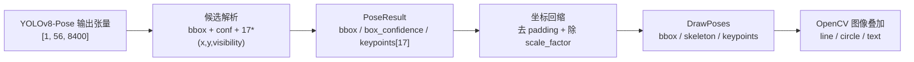
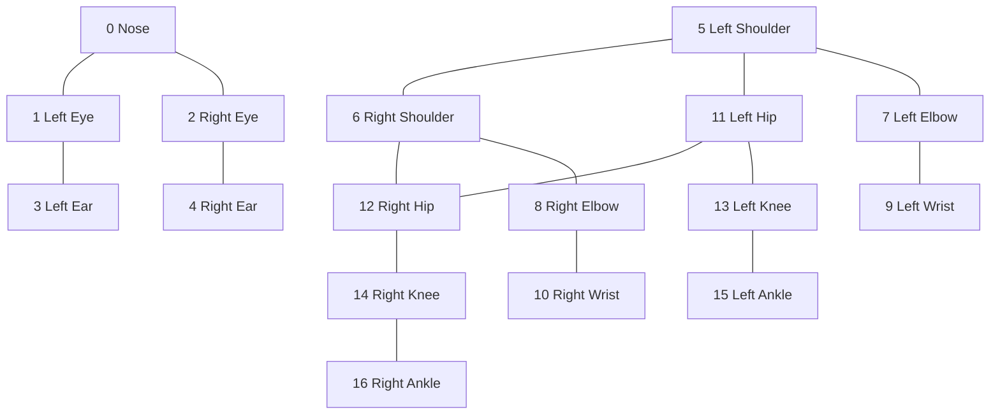
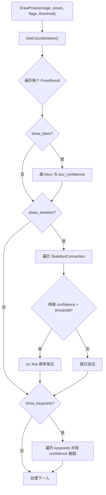

本页解释当前工程中 **COCO 17 关键点** 如何被编码为 C++ 数据结构、如何从 YOLOv8-Pose 输出张量解析为 `PoseResult`，以及如何通过 `pose_utils` 绘制关键点圆点、骨架连线、检测框与基础信息叠加；边界上，本页只讨论关键点索引、姿态结果容器、2D 坐标回缩、骨架连接与可视化开关，不展开 ONNX Runtime 初始化、图像预处理细节、深度反投影、蹦床坐标系或姿态业务分类，这些主题应继续阅读 [YOLOv8-Pose ONNX 推理器设计](12-yolov8-pose-onnx-tui-li-qi-she-ji)、[图像预处理、输出解析与非极大值抑制](13-tu-xiang-yu-chu-li-shu-chu-jie-xi-yu-fei-ji-da-zhi-yi-zhi)、[相机内参、深度采样与像素反投影](16-xiang-ji-nei-can-shen-du-cai-yang-yu-xiang-su-fan-tou-ying)。 Sources: [yolo_pose_detector.h](yolo_pose_detector.h#L15-L58), [pose_utils.h](pose_utils.h#L13-L70), [yolo_pose_detector.cpp](yolo_pose_detector.cpp#L215-L289)

## 架构假设与代码验证结论

本文从三个可验证假设进入：第一，工程将 COCO 17 关键点固定为 `0..16` 的枚举常量，并在每个单人姿态结果中预分配 17 个 `KeyPoint`；第二，YOLOv8-Pose 输出的每个候选包含 `bbox + person confidence + 17*(x,y,visibility)`，解析后将 visibility 写入工程内的 `KeyPoint::confidence` 字段；第三，可视化层不重新解释模型输出语义，而是只依据关键点索引、像素坐标和阈值绘制骨架线与关键点圆。代码检查证实三点分别落在 `yolo_pose_detector.h` 的枚举与结构体、`yolo_pose_detector.cpp` 的 `Postprocess`、以及 `pose_utils.cpp` 的 `GetCocoSkeleton` / `DrawPoses` 实现中。 Sources: [yolo_pose_detector.h](yolo_pose_detector.h#L15-L58), [yolo_pose_detector.cpp](yolo_pose_detector.cpp#L219-L276), [pose_utils.cpp](pose_utils.cpp#L10-L42), [pose_utils.cpp](pose_utils.cpp#L100-L171)

上图描述的是本页范围内的 **关键点数据到骨架可视化** 路径：输出张量先被转置并按候选解析，随后写入 `PoseResult`，再将模型输入坐标系中的框与关键点回缩到原图坐标，最后由 `DrawPoses` 根据开关和阈值绘制检测框、骨架线与关键点圆。 Sources: [yolo_pose_detector.cpp](yolo_pose_detector.cpp#L219-L289), [yolo_pose_detector.cpp](yolo_pose_detector.cpp#L348-L381), [pose_utils.cpp](pose_utils.cpp#L100-L171)

## COCO 17 索引是跨模块契约

`KeypointType` 枚举把 COCO 17 个身体部位固定为连续整数：`NOSE=0`，眼、耳、肩、肘、腕、髋、膝、踝依次排列到 `RIGHT_ANKLE=16`；这个枚举不是展示用常量，而是跨解析、可视化和后续几何访问的索引契约，例如骨架连接直接使用 `LEFT_SHOULDER`、`RIGHT_HIP` 等枚举值访问 `pose.keypoints[index]`。 Sources: [yolo_pose_detector.h](yolo_pose_detector.h#L15-L34), [pose_utils.cpp](pose_utils.cpp#L20-L40), [pose_utils.cpp](pose_utils.cpp#L127-L129)

| 索引 | 枚举名 | 英文名称来源 | 身体区域 |
|---:|---|---|---|
| 0 | `NOSE` | `Nose` | 头部 |
| 1 | `LEFT_EYE` | `Left Eye` | 头部 |
| 2 | `RIGHT_EYE` | `Right Eye` | 头部 |
| 3 | `LEFT_EAR` | `Left Ear` | 头部 |
| 4 | `RIGHT_EAR` | `Right Ear` | 头部 |
| 5 | `LEFT_SHOULDER` | `Left Shoulder` | 躯干/左臂起点 |
| 6 | `RIGHT_SHOULDER` | `Right Shoulder` | 躯干/右臂起点 |
| 7 | `LEFT_ELBOW` | `Left Elbow` | 左臂 |
| 8 | `RIGHT_ELBOW` | `Right Elbow` | 右臂 |
| 9 | `LEFT_WRIST` | `Left Wrist` | 左臂 |
| 10 | `RIGHT_WRIST` | `Right Wrist` | 右臂 |
| 11 | `LEFT_HIP` | `Left Hip` | 躯干/左腿起点 |
| 12 | `RIGHT_HIP` | `Right Hip` | 躯干/右腿起点 |
| 13 | `LEFT_KNEE` | `Left Knee` | 左腿 |
| 14 | `RIGHT_KNEE` | `Right Knee` | 右腿 |
| 15 | `LEFT_ANKLE` | `Left Ankle` | 左腿 |
| 16 | `RIGHT_ANKLE` | `Right Ankle` | 右腿 |

该表同时来自 `KeypointType` 的枚举顺序和 `GetKeypointName(int idx)` 的名称数组；`GetKeypointName` 对 `0..16` 返回对应英文名，越界时返回 `"Unknown"`，因此调试面板或列表展示可用该函数把数组索引转换成人类可读标签。 Sources: [yolo_pose_detector.h](yolo_pose_detector.h#L15-L34), [pose_utils.cpp](pose_utils.cpp#L249-L261)

## 单点与单人结果的数据结构

`KeyPoint` 是单个关键点的最小数据单元，包含图像坐标 `x/y`、置信字段 `confidence`，以及深度融合后可填充的 `cv::Point3f pos3d`；两个构造函数都把 `pos3d` 初始化为 `(0,0,0)`，因此在本页的 2D 骨架可视化中，真正参与绘制的是 `x/y/confidence`。 Sources: [yolo_pose_detector.h](yolo_pose_detector.h#L36-L46), [pose_utils.cpp](pose_utils.cpp#L142-L161)

`PoseResult` 表示一个人的检测结果，字段包括 `cv::Rect bbox`、人体框置信度 `box_confidence`、`std::vector<KeyPoint> keypoints` 和可选 `person_id`；默认构造函数把 `person_id` 设为 `-1`，并调用 `keypoints.resize(17)`，这保证可视化代码可以按 COCO 枚举索引直接访问 17 个槽位。 Sources: [yolo_pose_detector.h](yolo_pose_detector.h#L48-L58), [pose_utils.cpp](pose_utils.cpp#L127-L129)

| 数据结构 | 字段 | 本页语义 | 可视化用途 |
|---|---|---|---|
| `KeyPoint` | `x`, `y` | 原图坐标系中的关键点像素坐标 | `cv::Point(cvRound(kp.x), cvRound(kp.y))` |
| `KeyPoint` | `confidence` | 关键点显示阈值判断值；解析时来自 YOLO visibility | 控制是否画圆点、是否画骨架边 |
| `KeyPoint` | `pos3d` | 3D 位置缓存字段 | 本页仅说明存在，不作为 2D 骨架绘制输入 |
| `PoseResult` | `bbox` | 单人检测框 | `show_bbox=true` 时绘制矩形 |
| `PoseResult` | `box_confidence` | 单人检测置信度 | 绘制检测框文本和信息叠加 |
| `PoseResult` | `keypoints` | 17 个 `KeyPoint` 的有序数组 | 骨架边与关键点圆的索引来源 |

这张表概括了 `DrawPoses` 实际依赖的字段：检测框来自 `pose.bbox`，框文本来自 `pose.box_confidence`，骨架线端点来自 `pose.keypoints[conn.start_idx]` 与 `pose.keypoints[conn.end_idx]`，关键点圆来自遍历 `pose.keypoints`。 Sources: [yolo_pose_detector.h](yolo_pose_detector.h#L36-L58), [pose_utils.cpp](pose_utils.cpp#L110-L169)

## 从 YOLOv8-Pose 输出到 `keypoints[17]`

后处理代码把 YOLOv8-Pose 输出解释为 `[1, 56, 8400]`：其中 `56 = 4` 个框参数 `cx,cy,w,h`，`1` 个人体检测置信度，以及 `17*3` 个关键点元素 `(x,y,visibility)`；实现先将 `[1,56,8400]` 转置为便于访问的 `[8400,56]`，再逐个候选解析。 Sources: [yolo_pose_detector.cpp](yolo_pose_detector.cpp#L219-L239)

每个候选的 `ptr[0..3]` 被解释为中心点与宽高，`ptr[4]` 被解释为人体检测置信度；低于 `conf_threshold_` 的候选直接跳过，保留下来的候选创建 `PoseResult`，把 `box_confidence` 设置为该置信度，并将中心格式框转换为 `cv::Rect(x1,y1,w,h)`。 Sources: [yolo_pose_detector.cpp](yolo_pose_detector.cpp#L241-L266)

关键点从 `ptr[5]` 开始，而不是从 `ptr[6]` 开始；循环 `k=0..16` 时读取 `ptr[5+k*3+0]` 为 `kp_x`，`ptr[5+k*3+1]` 为 `kp_y`，`ptr[5+k*3+2]` 为 `kp_visibility`，并写入 `result.keypoints[k] = KeyPoint(kp_x, kp_y, kp_visibility)`。 Sources: [yolo_pose_detector.cpp](yolo_pose_detector.cpp#L267-L276)

这里需要特别注意命名差异：源码注释说明 YOLOv8-Pose 使用的是 visibility，而不是 keypoint confidence；但工程内部统一把这个值存入 `KeyPoint::confidence`，后续绘制逻辑也只读取 `kp.confidence` 做阈值判断。 Sources: [yolo_pose_detector.cpp](yolo_pose_detector.cpp#L219-L222), [yolo_pose_detector.cpp](yolo_pose_detector.cpp#L267-L276), [pose_utils.cpp](pose_utils.cpp#L131-L132), [pose_utils.cpp](pose_utils.cpp#L147-L156)

## 坐标回缩：从模型输入坐标回到原图坐标

在进入可视化之前，`Postprocess` 会先执行 NMS，再对每个保留结果调用 `RescaleCoordinates(result, original_size)`；这个顺序意味着最终交给 `DrawPoses` 的 `bbox` 与 `keypoints` 已经被转换回原始图像尺寸，而不是模型输入尺寸。 Sources: [yolo_pose_detector.cpp](yolo_pose_detector.cpp#L281-L289)

`RescaleCoordinates` 的核心是先移除 letterbox padding，再除以 `scale_factor_`，随后把 `x/y` 限制到原图宽高范围内；同一个 `rescale` lambda 同时作用于框的左上/右下角与每个关键点坐标，因此骨架线和关键点圆可以直接使用 `kp.x/kp.y` 绘制在原始帧上。 Sources: [yolo_pose_detector.cpp](yolo_pose_detector.cpp#L348-L381)

## COCO 骨架连接与颜色编码

骨架连接由 `SkeletonConnection` 表示，包含 `start_idx`、`end_idx` 与 `cv::Scalar color`；`GetCocoSkeleton()` 返回固定连接表，格式注释明确为 `{start_keypoint_idx, end_keypoint_idx, color}`，因此骨架结构本质上是 **索引对 + OpenCV BGR 颜色** 的静态配置。 Sources: [pose_utils.h](pose_utils.h#L13-L24), [pose_utils.cpp](pose_utils.cpp#L10-L13)

上图等价于 `GetCocoSkeleton()` 的连接表：头部 4 条边，躯干 4 条边，左臂 2 条边，右臂 2 条边，左腿 2 条边，右腿 2 条边，共 16 条骨架边。 Sources: [pose_utils.cpp](pose_utils.cpp#L14-L41)

| 分组 | 连接 | 颜色值 `cv::Scalar(B,G,R)` | 注释颜色 |
|---|---|---|---|
| Head | `NOSE-LEFT_EYE`, `NOSE-RIGHT_EYE`, `LEFT_EYE-LEFT_EAR`, `RIGHT_EYE-RIGHT_EAR` | `(0,255,255)` | yellow |
| Torso | `LEFT_SHOULDER-RIGHT_SHOULDER`, `LEFT_SHOULDER-LEFT_HIP`, `RIGHT_SHOULDER-RIGHT_HIP`, `LEFT_HIP-RIGHT_HIP` | `(255,255,0)` | cyan |
| Left arm | `LEFT_SHOULDER-LEFT_ELBOW`, `LEFT_ELBOW-LEFT_WRIST` | `(0,255,0)` | green |
| Right arm | `RIGHT_SHOULDER-RIGHT_ELBOW`, `RIGHT_ELBOW-RIGHT_WRIST` | `(255,0,0)` | blue |
| Left leg | `LEFT_HIP-LEFT_KNEE`, `LEFT_KNEE-LEFT_ANKLE` | `(255,0,255)` | magenta |
| Right leg | `RIGHT_HIP-RIGHT_KNEE`, `RIGHT_KNEE-RIGHT_ANKLE` | `(0,165,255)` | orange |

颜色表完全来自 `GetCocoSkeleton()` 的返回值；由于 OpenCV `cv::Scalar` 在 BGR 语义下使用，文档中同时保留数值和源码注释名称，避免把显示颜色与 RGB 顺序混淆。 Sources: [pose_utils.cpp](pose_utils.cpp#L14-L41)

## `DrawPoses` 的绘制顺序与阈值语义

`DrawPoses` 接收 `image`、`poses`、三个显示开关 `show_bbox/show_keypoints/show_skeleton`，以及 `keypoint_conf_threshold`；函数先获取 COCO 骨架表，然后逐个 `PoseResult` 绘制，因此同一帧多人的关键点与骨架共享同一套连接规则和阈值规则。 Sources: [pose_utils.h](pose_utils.h#L37-L52), [pose_utils.cpp](pose_utils.cpp#L100-L110)

绘制顺序是：若 `show_bbox` 为真，先画绿色检测框并在框上方写入 `box_confidence`；若 `show_skeleton` 为真，遍历骨架连接并在两个端点关键点置信值都大于阈值时画线；若 `show_keypoints` 为真，再遍历全部关键点并对超过阈值的点画实心圆。 Sources: [pose_utils.cpp](pose_utils.cpp#L110-L169)

骨架线的阈值要求是 **两端同时有效**：`kp1.confidence > keypoint_conf_threshold && kp2.confidence > keypoint_conf_threshold`，只有满足该条件才调用 `cv::line`；这避免了单端缺失时画出从有效点连到无效默认点的错误线段。 Sources: [pose_utils.cpp](pose_utils.cpp#L125-L139)

关键点圆的颜色由该点自身 `confidence` 分段决定：大于 `0.8` 使用红色 `(0,0,255)`，大于 `0.6` 使用橙色 `(0,165,255)`，否则使用黄色 `(0,255,255)`；在默认 `DrawPoses` 声明中阈值为 `0.5`，而主循环实际调用时传入 `0.3f`，因此运行入口采用更低的显示阈值。 Sources: [pose_utils.cpp](pose_utils.cpp#L142-L161), [pose_utils.h](pose_utils.h#L46-L52), [get_pose_indemind_left.cpp](get_pose_indemind_left.cpp#L690-L696)

该流程图对应 `DrawPoses` 的实际控制流，可视化逻辑没有修改 `poses`，只在传入的 `cv::Mat& image` 上执行 OpenCV 绘制操作。 Sources: [pose_utils.cpp](pose_utils.cpp#L100-L171)

## 主循环中的显示开关

主程序初始化显示选项时设置 `show_bbox=false`、`show_keypoints=true`、`show_skeleton=true`、`show_info=true`；因此默认运行时不会绘制 YOLO 绿色检测框，但会绘制关键点与骨架，并显示基础信息叠加。 Sources: [get_pose_indemind_left.cpp](get_pose_indemind_left.cpp#L603-L607), [get_pose_indemind_left.cpp](get_pose_indemind_left.cpp#L690-L696)

键盘控制中，`k/K` 切换 `show_keypoints`，`t/T` 切换 `show_skeleton`，`i/I` 切换 `show_info`；当前代码没有为 `show_bbox` 保留键盘切换分支，因此检测框是否显示由初始化值和调用参数决定。 Sources: [get_pose_indemind_left.cpp](get_pose_indemind_left.cpp#L1251-L1263), [get_pose_indemind_left.cpp](get_pose_indemind_left.cpp#L603-L607)

| 开关 | 默认值 | 影响函数 | 视觉结果 |
|---|---:|---|---|
| `show_bbox` | `false` | `DrawPoses` | 不显示绿色人体框 |
| `show_keypoints` | `true` | `DrawPoses` | 显示超过阈值的关键点圆 |
| `show_skeleton` | `true` | `DrawPoses` | 显示两端均超过阈值的骨架线 |
| `show_info` | `true` | `DrawPoseInfo` | 显示每个人的文本信息 |

显示开关表对应主循环初始化和调用：`DrawPoses(display, poses, show_bbox, show_keypoints, show_skeleton, 0.3f)` 控制几何叠加，`DrawPoseInfo(display, poses, false)` 控制信息叠加。 Sources: [get_pose_indemind_left.cpp](get_pose_indemind_left.cpp#L603-L607), [get_pose_indemind_left.cpp](get_pose_indemind_left.cpp#L690-L696)

## 信息叠加与关键点名称

`DrawPoseInfo` 对每个 `PoseResult` 先写入 `"Person N"`，再写入 `box_confidence`；当 `show_depth=false` 时，它不会显示平均深度或估计身高，主循环正是以 `false` 调用它，因此主窗口的信息叠加在本页范围内主要是人编号和检测置信度。 Sources: [pose_utils.cpp](pose_utils.cpp#L173-L203), [get_pose_indemind_left.cpp](get_pose_indemind_left.cpp#L694-L696)

`GetKeypointName` 提供索引到英文名称的转换，后续 UI 面板在遍历 `poses[tracked_pose_index].keypoints` 时调用它生成每个关键点的标签；即使该面板显示的是 3D 坐标，名称映射仍然复用同一套 COCO 17 索引。 Sources: [pose_utils.cpp](pose_utils.cpp#L249-L261), [get_pose_indemind_left.cpp](get_pose_indemind_left.cpp#L1194-L1213)

## 调试输出中的关键点数组

主循环在检测到姿态后，每 30 次调试计数打印第一人的关键点信息，输出格式包含 `KP<i>`、`conf=<confidence>` 和整数化位置 `pos=(x,y)`；该输出直接遍历 `poses[0].keypoints`，因此是验证 COCO 17 数组是否被正确填充的最低成本观察点。 Sources: [get_pose_indemind_left.cpp](get_pose_indemind_left.cpp#L663-L675)

这段调试输出不调用 `GetKeypointName`，只显示 `KP0..KP16` 的数组索引；如果需要把调试输出和人体部位对应起来，应使用本页的 COCO 17 索引表或 `GetKeypointName` 的名称映射。 Sources: [get_pose_indemind_left.cpp](get_pose_indemind_left.cpp#L666-L675), [pose_utils.cpp](pose_utils.cpp#L249-L261)

## 实现约束与常见误读

第一，不要把 `KeyPoint::confidence` 的字段名误读为模型原生 keypoint confidence；当前解析注释明确写明 YOLOv8-Pose 使用 visibility，并将其作为 `KeyPoint` 的第三个构造参数存入 `confidence` 字段。 Sources: [yolo_pose_detector.cpp](yolo_pose_detector.cpp#L219-L222), [yolo_pose_detector.cpp](yolo_pose_detector.cpp#L267-L276), [yolo_pose_detector.h](yolo_pose_detector.h#L36-L46)

第二，不要在可视化层重新定义 COCO 顺序；`GetCocoSkeleton`、`GetKeypointName`、主循环的调试输出和后续关键点访问都默认 `keypoints[0..16]` 与 `KeypointType` 完全一致，任何索引顺序变化都会直接改变骨架连线端点。 Sources: [yolo_pose_detector.h](yolo_pose_detector.h#L15-L34), [pose_utils.cpp](pose_utils.cpp#L10-L42), [pose_utils.cpp](pose_utils.cpp#L249-L261), [get_pose_indemind_left.cpp](get_pose_indemind_left.cpp#L666-L675)

第三，`DrawPoses` 的阈值是严格大于 `>`，不是大于等于；当某个关键点的值等于阈值时不会绘制该点，也不会作为骨架边端点通过判断。 Sources: [pose_utils.cpp](pose_utils.cpp#L131-L132), [pose_utils.cpp](pose_utils.cpp#L147-L161)

## 下一步阅读

如果你要追踪 `PoseResult` 在进入本页之前如何由 ONNX Runtime 推理得到，请阅读 [YOLOv8-Pose ONNX 推理器设计](12-yolov8-pose-onnx-tui-li-qi-she-ji)；如果你要深入理解 `[1,56,8400]` 的预处理、输出解析和 NMS 细节，请阅读 [图像预处理、输出解析与非极大值抑制](13-tu-xiang-yu-chu-li-shu-chu-jie-xi-yu-fei-ji-da-zhi-yi-zhi)；如果你要把本页的 2D 关键点继续映射到 3D，请阅读 [相机内参、深度采样与像素反投影](16-xiang-ji-nei-can-shen-du-cai-yang-yu-xiang-su-fan-tou-ying)。 Sources: [yolo_pose_detector.cpp](yolo_pose_detector.cpp#L170-L213), [yolo_pose_detector.cpp](yolo_pose_detector.cpp#L215-L289), [pose_utils.h](pose_utils.h#L26-L35)