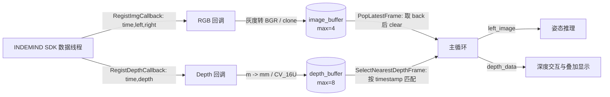
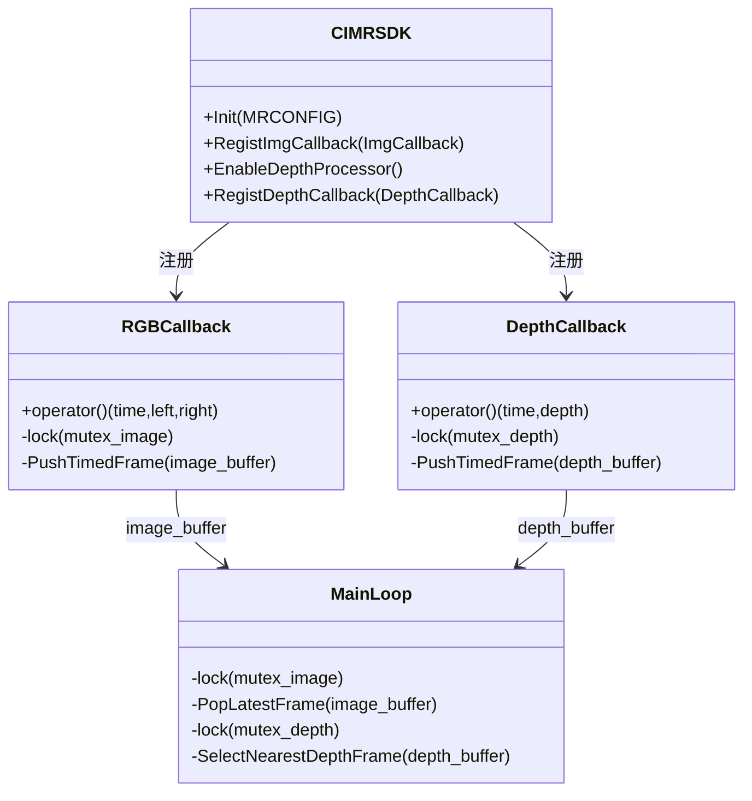

实时姿态推理的第一约束不是“处理每一帧”，而是**让推理线程始终消费最接近当前时刻的数据**。本页聚焦当前程序中 INDEMIND SDK 的回调接入方式、RGB/Depth 两类异步数据如何进入时间戳缓冲区，以及主循环如何通过“取最新 RGB + 匹配最近 Depth”的策略压低延迟；YOLO 推理细节、深度反投影、ROI 平面拟合与业务状态机不在本页展开，可继续阅读 [YOLOv8-Pose ONNX 推理器设计](12-yolov8-pose-onnx-tui-li-qi-she-ji)、[相机内参、深度采样与像素反投影](16-xiang-ji-nei-can-shen-du-cai-yang-yu-xiang-su-fan-tou-ying) 与 [性能统计、队列限流与实时性优化](25-xing-neng-tong-ji-dui-lie-xian-liu-yu-shi-shi-xing-you-hua)。Sources: [get_pose_indemind_left.cpp](get_pose_indemind_left.cpp#L729-L743), [get_pose_indemind_left.cpp](get_pose_indemind_left.cpp#L857-L875)

## 架构假设与代码验证结论

从第一原则看，INDEMIND SDK 是**生产者**，它通过回调把相机图像、深度图等数据推给应用；应用主循环是**消费者**，它不能在回调线程里执行重型推理，否则会阻塞 SDK 的数据输出路径。因此当前实现把回调函数压缩为轻量操作：转换必要格式、加锁、写入有界缓冲区、递增计数；真正的姿态推理与显示更新发生在主循环中。SDK 头文件明确提供 `ImgCallback`、`DepthCallback` 等基于 `std::function` 的回调类型，并提供 `RegistImgCallback`、`RegistDepthCallback` 等注册接口；主程序则在初始化 SDK 与 YOLO 检测器后创建 RGB/Depth 双缓冲与互斥锁。Sources: [include/imrsdk.h](include/imrsdk.h#L59-L81), [include/imrsdk.h](include/imrsdk.h#L222-L250), [get_pose_indemind_left.cpp](get_pose_indemind_left.cpp#L684-L727), [get_pose_indemind_left.cpp](get_pose_indemind_left.cpp#L729-L743)



上图中的关键分界是：**回调只入队，主循环才消费**。`PushTimedFrame` 在缓冲区达到上限时从队首丢弃旧帧，再把新帧压入队尾；`PopLatestFrame` 直接返回队尾最新帧并清空整个 RGB 缓冲，这说明 RGB 通道的消费策略明确偏向低延迟而非完整帧序列保留。Sources: [get_pose_indemind_left.cpp](get_pose_indemind_left.cpp#L178-L199)

## SDK 初始化：只打开必要输入频率

程序在 `main` 中创建 `CIMRSDK`，构造 `MRCONFIG`，关闭 SLAM，设置图像分辨率为 `IMG_1280`，图像频率为 50，并将 IMU 频率设为 0；随后调用 `Init(config)`。SDK 头文件说明 `Init` 会根据配置启动数据接收线程及算法线程，`MRCONFIG` 中也定义了 `bSlam`、`imuFrequency`、`imgFrequency`、`poseFrequency` 与 `imgResolution` 等配置项。Sources: [get_pose_indemind_left.cpp](get_pose_indemind_left.cpp#L684-L693), [include/imrsdk.h](include/imrsdk.h#L118-L145), [include/imrsdk.h](include/imrsdk.h#L168-L180)

| 配置项 | 当前取值 | 在本页语境中的作用 |
|---|---:|---|
| `config.bSlam` | `false` | 不启用 SLAM 位姿链路，页面关注相机帧回调与消费。 |
| `config.imgResolution` | `IMG_1280` | 选择 1280 级图像输入，后续读取左相机 1280x800 标定参数。 |
| `config.imgFrequency` | `50` | 设置图像输入频率为 50。 |
| `config.imuFrequency` | `0` | 当前程序注释为“Disabled for performance”。 |

这些配置项和实际赋值共同限定了本页的输入模型：应用从 SDK 侧接收图像帧，并以左目图像作为姿态推理入口；IMU 与 SLAM 回调不是当前实现的消费对象。Sources: [get_pose_indemind_left.cpp](get_pose_indemind_left.cpp#L684-L690), [get_pose_indemind_left.cpp](get_pose_indemind_left.cpp#L700-L718)

## 回调接口模型：SDK 推送，应用注册处理器

SDK 暴露的回调族覆盖原始模块图像、OpenCV 图像、矫正图、视差图、深度图、点云图、检测图、IMU 与热插拔事件；当前程序使用的是 `RegistImgCallback` 和 `RegistDepthCallback`。其中 `ImgCallback` 的签名为 `void(double time, cv::Mat left, cv::Mat right)`，`DepthCallback` 的签名为 `void(double time, cv::Mat depth)`，两者都携带时间戳，这是后续做“最新帧消费”和“最近深度匹配”的基础。Sources: [include/imrsdk.h](include/imrsdk.h#L55-L86), [include/imrsdk.h](include/imrsdk.h#L220-L250), [get_pose_indemind_left.cpp](get_pose_indemind_left.cpp#L763-L804)

| 回调类型 | SDK 类型签名 | 当前程序是否使用 | 当前处理方式 |
|---|---|---:|---|
| 图像回调 | `ImgCallback(double time, cv::Mat left, cv::Mat right)` | 是 | 忽略右目，左目为空则跳过；灰度转 BGR，否则 clone；写入 `image_buffer`。 |
| 深度回调 | `DepthCallback(double time, cv::Mat depth)` | 是 | 深度非空时从米转换为毫米 `CV_16U`；写入 `depth_buffer`。 |
| 原始模块图像回调 | `ModuleImageCallback(double time, unsigned char* pLeft, unsigned char* pRight, int width, int height, int channel, void* pParam)` | 否 | SDK 提供接口，但当前主程序未注册该回调。 |
| IMU 回调 | `ModuleIMUCallback(indem::ImuData imu)` | 否 | SDK 提供接口，但当前主程序未注册该回调。 |

当前实现使用 OpenCV `cv::Mat` 形式的图像回调，而不是 `unsigned char*` 原始模块图像回调；这减少了应用侧对宽、高、通道与裸指针生命周期的直接处理，使主程序只需围绕 `cv::Mat` 做格式转换、拷贝与缓冲。Sources: [include/imrsdk.h](include/imrsdk.h#L47-L64), [include/imrsdk.h](include/imrsdk.h#L212-L227), [get_pose_indemind_left.cpp](get_pose_indemind_left.cpp#L763-L787)

## RGB 回调：左目图像入有界最新帧缓冲

RGB 回调通过 `RegistImgCallback` 注册，参数包含 `time`、`left`、`right`；当前程序显式忽略右目，只处理左目。若左目图像非空，代码先更新 `last_img_time`，再进入 `mutex_image` 保护区：单通道图像通过 `cv::cvtColor(left, color_image, cv::COLOR_GRAY2BGR)` 转成 BGR，多通道图像通过 `left.clone()` 复制，然后调用 `PushTimedFrame(image_buffer, time, color_image, kMaxImageBufferSize, dropped_images)`。Sources: [get_pose_indemind_left.cpp](get_pose_indemind_left.cpp#L763-L787)

这个回调的设计重点是**把 SDK 回调线程中的工作量限制到格式归一化与入队**。`kMaxImageBufferSize` 被设置为 4；当生产速度高于主循环消费速度时，`PushTimedFrame` 会持续丢弃队首旧帧并记录 `dropped_images`，队尾始终保存较新的图像。Sources: [get_pose_indemind_left.cpp](get_pose_indemind_left.cpp#L178-L190), [get_pose_indemind_left.cpp](get_pose_indemind_left.cpp#L729-L741), [get_pose_indemind_left.cpp](get_pose_indemind_left.cpp#L774-L784)

## Depth 回调：启用处理器后按时间戳进入深度缓冲

深度链路不是无条件注册：程序先调用 `EnableDepthProcessor()`，成功后打印“Depth processor enabled for mouse interaction.”，再注册 `RegistDepthCallback`；失败则打印警告并说明鼠标深度交互不可用。SDK 头文件中 `EnableDepthProcessor()` 被标注为“使能深度计算”，并返回成功或失败。Sources: [get_pose_indemind_left.cpp](get_pose_indemind_left.cpp#L789-L807), [include/imrsdk.h](include/imrsdk.h#L408-L414)

Depth 回调接收 `double time` 与 `cv::Mat depth`，若深度图非空，则用 `depth.convertTo(depth_mm, CV_16U, 1000.0)` 将深度从米转换到毫米，再在 `mutex_depth` 保护下调用 `PushTimedFrame(depth_buffer, time, depth_mm, kMaxDepthBufferSize, dropped_depth)`。当前深度缓冲上限为 8，计数器 `depth_count` 和 `dropped_depth` 分别记录接收量与丢弃量。Sources: [get_pose_indemind_left.cpp](get_pose_indemind_left.cpp#L729-L741), [get_pose_indemind_left.cpp](get_pose_indemind_left.cpp#L789-L804)

## 有界缓冲策略：丢旧帧，而不是阻塞生产者

`TimedFrame` 是 RGB 与 Depth 共用的最小帧单元，包含 `timestamp` 与 `cv::Mat frame` 两个字段。`PushTimedFrame` 对空帧直接返回；对非空帧，如果缓冲区大小已经达到上限，就在 `while (buffer.size() >= max_size)` 中反复 `pop_front()` 并累加丢帧计数，最后把新帧 `push_back` 到队尾。Sources: [get_pose_indemind_left.cpp](get_pose_indemind_left.cpp#L63-L66), [get_pose_indemind_left.cpp](get_pose_indemind_left.cpp#L178-L191)

| 策略点 | 实现位置 | 效果 |
|---|---|---|
| 有界容量 | `kMaxImageBufferSize = 4`，`kMaxDepthBufferSize = 8` | 防止回调生产速度超过主循环时缓冲无限增长。 |
| 队首丢弃 | `buffer.pop_front()` | 丢弃最旧数据，保留更接近当前时刻的数据。 |
| 队尾追加 | `buffer.push_back(TimedFrame{timestamp, frame})` | 队尾总是最新进入的帧。 |
| 丢帧计数 | `++drop_count` | 为运行结束统计提供证据。 |

这里没有使用 `app/queue_utils.h` 中基于 `std::queue` 的 `ClearQueue` 工具，而是在当前源文件内使用 `std::deque<TimedFrame>` 实现“队首丢弃 + 队尾最新”的时间序列缓冲；这与稍后 `PopLatestFrame` 直接访问 `back()` 的消费方式一致。Sources: [app/queue_utils.h](app/queue_utils.h#L1-L13), [get_pose_indemind_left.cpp](get_pose_indemind_left.cpp#L178-L199)

## 主循环消费：RGB 始终取最新帧

主循环每轮先创建空的 `left_image` 和 `image_timestamp`，随后在 `mutex_image` 保护下调用 `PopLatestFrame(image_buffer, latest_image)`。如果缓冲区非空，`PopLatestFrame` 返回队尾最新帧，并立即 `buffer.clear()` 清空所有积压 RGB 帧；主循环只把该最新帧赋给 `left_image`，把时间戳赋给 `image_timestamp`。Sources: [get_pose_indemind_left.cpp](get_pose_indemind_left.cpp#L193-L199), [get_pose_indemind_left.cpp](get_pose_indemind_left.cpp#L852-L865)

这种策略的直接含义是：**RGB 推理链路优先实时性，不追求逐帧处理完整性**。如果 YOLO 推理耗时导致缓冲中堆积了多帧，下一轮主循环不会逐个补处理，而是跳到最新帧，从而避免显示和推理结果持续落后于相机输入。Sources: [get_pose_indemind_left.cpp](get_pose_indemind_left.cpp#L193-L199), [get_pose_indemind_left.cpp](get_pose_indemind_left.cpp#L857-L884)

```mermaid
sequenceDiagram
    participant SDK as SDK 图像回调
    participant Buf as image_buffer
    participant Loop as 主循环
    participant YOLO as YOLO 推理

    SDK->>Buf: PushTimedFrame(t1)
    SDK->>Buf: PushTimedFrame(t2)
    SDK->>Buf: PushTimedFrame(t3)
    Loop->>Buf: PopLatestFrame()
    Buf-->>Loop: 返回 t3，并清空 t1/t2/t3
    Loop->>YOLO: Detect(t3.left_image)
```

该时序图只描述 RGB 消费行为：多帧积压时，主循环拿到的是队尾最新帧，旧帧不会进入 YOLO 推理。代码证据是 `out = buffer.back(); buffer.clear();`，以及主循环随后仅在 `!left_image.empty()` 时调用 `pose_detector.Detect(left_image)`。Sources: [get_pose_indemind_left.cpp](get_pose_indemind_left.cpp#L193-L199), [get_pose_indemind_left.cpp](get_pose_indemind_left.cpp#L879-L884)

## 深度同步：按 RGB 时间戳选择最近深度帧

Depth 的消费策略不同于 RGB 的“直接取最新”：主循环在拿到 RGB 的 `image_timestamp` 后，进入 `mutex_depth` 保护区，若 `depth_buffer` 非空且 RGB 时间戳有效，就调用 `SelectNearestDepthFrame(depth_buffer, image_timestamp, depth_data, &matched_depth_timestamp, &depth_sync_error_ms)`。这说明深度图不是独立驱动处理节奏，而是以当前 RGB 帧时间戳为锚点做最近邻匹配。Sources: [get_pose_indemind_left.cpp](get_pose_indemind_left.cpp#L867-L875)

`SelectNearestDepthFrame` 首先清理过旧历史：当缓冲区超过一帧且队首时间戳早于 `rgb_timestamp - 0.35` 秒时，持续 `pop_front()`。然后遍历剩余深度帧，计算 `abs(depth.timestamp - rgb_timestamp)`，选择绝对时间差最小的帧作为 `selected_depth`，并把同步误差写入 `sync_error_ms`。Sources: [get_pose_indemind_left.cpp](get_pose_indemind_left.cpp#L202-L233)

匹配完成后，函数保留 `depth_buffer.back()` 这一帧，清空缓冲，再把这帧放回缓冲。这与 RGB 的完全清空不同：Depth 通道在匹配后仍保留最新深度帧，用于后续 RGB 帧到来时继续作为候选之一。Sources: [get_pose_indemind_left.cpp](get_pose_indemind_left.cpp#L235-L238)

## RGB 与 Depth 消费策略对比

RGB 与 Depth 的差异来自用途不同：RGB 是姿态推理的驱动帧，必须尽量新；Depth 是与当前 RGB 帧配准的辅助数据，必须尽量近。因此 RGB 使用 `PopLatestFrame`，Depth 使用 `SelectNearestDepthFrame`。Sources: [get_pose_indemind_left.cpp](get_pose_indemind_left.cpp#L193-L238), [get_pose_indemind_left.cpp](get_pose_indemind_left.cpp#L857-L875)

| 维度 | RGB 图像缓冲 | Depth 深度缓冲 |
|---|---|---|
| 数据结构 | `std::deque<TimedFrame> image_buffer` | `std::deque<TimedFrame> depth_buffer` |
| 容量上限 | 4 | 8 |
| 入队函数 | `PushTimedFrame` | `PushTimedFrame` |
| 出队/匹配函数 | `PopLatestFrame` | `SelectNearestDepthFrame` |
| 消费依据 | 队尾最新帧 | 与当前 RGB 时间戳绝对差最小 |
| 消费后缓冲状态 | 清空全部积压帧 | 清空后保留原队尾最新深度帧 |
| 统计指标 | `dropped_images` | `dropped_depth`、`depth_sync_error_ms` |

这个对比表对应的实现集中在三处：缓冲与计数器定义、回调入队、主循环消费。它们共同构成当前程序的“最新帧优先”实时模型。Sources: [get_pose_indemind_left.cpp](get_pose_indemind_left.cpp#L729-L743), [get_pose_indemind_left.cpp](get_pose_indemind_left.cpp#L763-L804), [get_pose_indemind_left.cpp](get_pose_indemind_left.cpp#L857-L875)

## 线程边界：互斥锁保护共享缓冲

RGB 与 Depth 各自拥有独立互斥锁：`mutex_image` 保护 `image_buffer`，`mutex_depth` 保护 `depth_buffer`。回调写入缓冲时使用 `std::unique_lock<std::mutex>`，主循环读取或匹配缓冲时也使用同一把锁；因此共享 `std::deque<TimedFrame>` 的读写不会在代码层面裸奔。Sources: [get_pose_indemind_left.cpp](get_pose_indemind_left.cpp#L729-L733), [get_pose_indemind_left.cpp](get_pose_indemind_left.cpp#L774-L784), [get_pose_indemind_left.cpp](get_pose_indemind_left.cpp#L798-L800), [get_pose_indemind_left.cpp](get_pose_indemind_left.cpp#L857-L875)



该类图不是表示 C++ 中真实声明的类层次，而是表示当前程序中的模块交互关系：`CIMRSDK` 负责回调注册，两个 lambda 回调负责生产，主循环负责消费，两个互斥锁分别隔离 RGB 与 Depth 的共享状态。Sources: [include/imrsdk.h](include/imrsdk.h#L164-L180), [include/imrsdk.h](include/imrsdk.h#L222-L250), [get_pose_indemind_left.cpp](get_pose_indemind_left.cpp#L763-L804), [get_pose_indemind_left.cpp](get_pose_indemind_left.cpp#L852-L875)

## 时间戳是同步契约

当前代码中的 `TimedFrame` 只存储两件事：时间戳与图像矩阵。RGB 回调和 Depth 回调都把 SDK 提供的 `time` 原样写入缓冲；主循环以 RGB 的 `image_timestamp` 作为同步基准，再从深度缓冲中寻找绝对时间差最小的深度图。Sources: [get_pose_indemind_left.cpp](get_pose_indemind_left.cpp#L63-L66), [get_pose_indemind_left.cpp](get_pose_indemind_left.cpp#L763-L783), [get_pose_indemind_left.cpp](get_pose_indemind_left.cpp#L792-L800), [get_pose_indemind_left.cpp](get_pose_indemind_left.cpp#L867-L875)

`depth_sync_error_ms` 是同步质量的直接可视化指标：`SelectNearestDepthFrame` 将最佳匹配的秒级时间差乘以 1000 写入该变量，后续叠加信息中会显示 `"Depth sync: <value> ms"`。这让开发者可以在运行时观察 RGB 与 Depth 的时间偏差，而不是只假设两路数据同步。Sources: [get_pose_indemind_left.cpp](get_pose_indemind_left.cpp#L231-L233), [get_pose_indemind_left.cpp](get_pose_indemind_left.cpp#L942-L942)

## 开发者操作准则

如果你要修改回调逻辑，优先保持三个约束：第一，回调中不要做重型推理；第二，共享缓冲必须在对应互斥锁保护下访问；第三，缓冲应保持有界，并在积压时丢弃旧帧。当前实现已经把这些约束固化为 `PushTimedFrame`、`PopLatestFrame`、`SelectNearestDepthFrame` 三个局部函数，以及 `mutex_image`/`mutex_depth` 两套锁。Sources: [get_pose_indemind_left.cpp](get_pose_indemind_left.cpp#L178-L238), [get_pose_indemind_left.cpp](get_pose_indemind_left.cpp#L729-L733), [get_pose_indemind_left.cpp](get_pose_indemind_left.cpp#L763-L804), [get_pose_indemind_left.cpp](get_pose_indemind_left.cpp#L857-L875)

如果你要调节实时性，可以优先检查两个容量常量：`kMaxImageBufferSize = 4` 与 `kMaxDepthBufferSize = 8`。在当前代码语义下，增大 RGB 缓冲不会让主循环补处理旧帧，因为 `PopLatestFrame` 仍会清空积压；增大 Depth 缓冲则会扩大最近邻匹配的候选集合，但函数仍会清理早于 RGB 时间戳 0.35 秒以上的旧历史。Sources: [get_pose_indemind_left.cpp](get_pose_indemind_left.cpp#L211-L238), [get_pose_indemind_left.cpp](get_pose_indemind_left.cpp#L729-L735)

如果你要排查“没有深度数据”，先确认 `EnableDepthProcessor()` 是否成功，因为只有成功分支才注册 `RegistDepthCallback`；运行时若 `depth_data` 为空，程序还会每隔约 2 秒打印一次包含 `depth_count` 的调试信息。Sources: [get_pose_indemind_left.cpp](get_pose_indemind_left.cpp#L789-L807), [get_pose_indemind_left.cpp](get_pose_indemind_left.cpp#L1507-L1526)

## 与相邻页面的边界

本页只解释 INDEMIND SDK 回调、缓冲与最新帧消费策略；相机内参矩阵如何从 SDK 参数构造并用于三维反投影，应阅读 [相机内参、深度采样与像素反投影](16-xiang-ji-nei-can-shen-du-cai-yang-yu-xiang-su-fan-tou-ying)；深度值如何做局部鲁棒估计，应阅读 [无效深度过滤与局部中值鲁棒估计](17-wu-xiao-shen-du-guo-lu-yu-ju-bu-zhong-zhi-lu-bang-gu-ji)；更宏观的端到端数据流可回到 [整体架构与端到端数据流](10-zheng-ti-jia-gou-yu-duan-dao-duan-shu-ju-liu)。Sources: [get_pose_indemind_left.cpp](get_pose_indemind_left.cpp#L700-L718), [get_pose_indemind_left.cpp](get_pose_indemind_left.cpp#L985-L1027), [get_pose_indemind_left.cpp](get_pose_indemind_left.cpp#L1123-L1130)