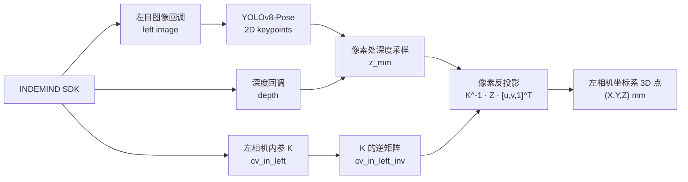

本页位于「相机、深度与三维重建」章节的当前节点，聚焦一个最小但关键的几何闭环：从 INDEMIND 左目相机读取内参矩阵 `K`，将深度回调转换为毫米单位的 `CV_16U` 深度图，在像素位置采样深度，并用 `K^-1 · Z · [u,v,1]^T` 反投影到左相机三维坐标系。这里不展开 ROI 平面拟合、床面坐标系或无效深度鲁棒估计的完整策略；这些内容分别延伸到 [四点 ROI 交互与蹦床平面采样](18-si-dian-roi-jiao-hu-yu-beng-chuang-ping-mian-cai-yang)、[床面坐标系构建、坐标变换与轴向约定](20-chuang-mian-zuo-biao-xi-gou-jian-zuo-biao-bian-huan-yu-zhou-xiang-yue-ding) 与 [无效深度过滤与局部中值鲁棒估计](17-wu-xiao-shen-du-guo-lu-yu-ju-bu-zhong-zhi-lu-bang-gu-ji)。Sources: [get_pose_indemind_left.cpp](get_pose_indemind_left.cpp#L700-L718), [get_pose_indemind_left.cpp](get_pose_indemind_left.cpp#L789-L807), [get_pose_indemind_left.cpp](get_pose_indemind_left.cpp#L1000-L1018)

## 架构假设与验证结果

从第一性原理看，本页链路必须同时满足三个条件：**内参矩阵可全局访问**、**深度值与图像像素坐标处于同一像素坐标语义下**、**反投影保持单位一致**。代码验证显示，项目用 `cv_in_left` 与 `cv_in_left_inv` 两个全局 `cv::Mat` 保存左相机内参与其逆矩阵；主程序在 SDK 初始化后从左相机模块参数填入 `fx/fy/cx/cy`，随后所有反投影路径复用该逆矩阵。Sources: [app/camera_intrinsics.h](app/camera_intrinsics.h#L1-L9), [app/camera_intrinsics.cpp](app/camera_intrinsics.cpp#L1-L5), [get_pose_indemind_left.cpp](get_pose_indemind_left.cpp#L700-L718)

下面的图描述本页范围内的概念关系：图像回调提供左目图像，深度回调提供深度图；YOLO 只产生二维关键点，三维坐标来自“二维关键点 + 同像素深度 + 左目内参逆矩阵”的组合。Sources: [get_pose_indemind_left.cpp](get_pose_indemind_left.cpp#L763-L787), [get_pose_indemind_left.cpp](get_pose_indemind_left.cpp#L789-L807), [get_pose_indemind_left.cpp](get_pose_indemind_left.cpp#L994-L1024)

## 左相机内参的来源与全局保存

内参矩阵在主程序启动阶段构造：SDK 初始化后调用 `GetModuleParams()`，从 `_left_camera[RESOLUTION::RES_1280X800]` 取左相机参数；随后创建 3×3 单位矩阵，将 `_K[0]` 写入 `K(0,0)` 作为 `fx`，`_K[4]` 写入 `K(1,1)` 作为 `fy`，`_K[2]` 写入 `K(0,2)` 作为 `cx`，`_K[5]` 写入 `K(1,2)` 作为 `cy`，最后调用 `cv_in_left.inv()` 生成 `cv_in_left_inv`。Sources: [get_pose_indemind_left.cpp](get_pose_indemind_left.cpp#L700-L718)

| 符号 | 代码位置 | 含义 | 在矩阵中的位置 |
|---|---:|---|---|
| `fx` | `param._K[0]` | x 方向焦距 | `K(0,0)` |
| `fy` | `param._K[4]` | y 方向焦距 | `K(1,1)` |
| `cx` | `param._K[2]` | x 方向主点 | `K(0,2)` |
| `cy` | `param._K[5]` | y 方向主点 | `K(1,2)` |

Sources: [get_pose_indemind_left.cpp](get_pose_indemind_left.cpp#L704-L718)

`cv_in_left` 与 `cv_in_left_inv` 被声明为外部全局变量，使 `get_pose_indemind_left.cpp`、`DepthRegion` 等路径可以共享同一份左目相机模型；实现文件只负责定义这两个矩阵，不在模块内自行填值，因此实际数值来源仍然是主程序启动阶段从 SDK 参数写入的结果。Sources: [app/camera_intrinsics.h](app/camera_intrinsics.h#L1-L9), [app/camera_intrinsics.cpp](app/camera_intrinsics.cpp#L1-L5), [get_pose_indemind_left.cpp](get_pose_indemind_left.cpp#L708-L713)

## 深度图接入与毫米单位约定

深度处理通过 `EnableDepthProcessor()` 启用；启用成功后注册深度回调，回调收到非空 `depth` 时执行 `depth.convertTo(depth_mm, CV_16U, 1000.0)`，也就是将输入深度乘以 1000 并保存为 16 位无符号毫米图。后续缓冲队列保存的是 `depth_mm`，主循环再按图像时间戳选择最近的深度帧供当前 RGB 帧使用。Sources: [get_pose_indemind_left.cpp](get_pose_indemind_left.cpp#L789-L807), [get_pose_indemind_left.cpp](get_pose_indemind_left.cpp#L849-L877)

这一单位约定直接决定反投影输出单位：主路径把 `z_mm` 转为 `double Z` 后立即参与 `cv_in_left_inv * Z * kp_img_cor`，因此三维点 `cam_pt` 的 `x/y/z` 均保持毫米尺度；鼠标位置显示路径也用同一表达式计算 `mouse_left_cor`，并在界面文本中标注 `mm`。Sources: [get_pose_indemind_left.cpp](get_pose_indemind_left.cpp#L1006-L1024), [app/depth_region.h](app/depth_region.h#L121-L130), [app/depth_region.h](app/depth_region.h#L143-L151)

## 像素深度采样入口

二维关键点进入三维链路前先经过置信度与边界检查：关键点置信度低于 `0.3f` 会跳过，像素坐标由 `kp.x/kp.y` 转成整数 `px/py`，若落在深度图尺寸之外也会跳过。只有通过这些条件后，代码才调用 `RobustDepthMedianU16(depth_data, px, py, /*r=*/3, z_mm)` 获取该像素附近的深度值。Sources: [get_pose_indemind_left.cpp](get_pose_indemind_left.cpp#L994-L1008)

`RobustDepthMedianU16` 的接口限定输入为 `CV_16UC1` 深度图，并接受像素坐标 `(x,y)`、窗口半径 `r` 与输出 `out_mm`；当前关键点路径与鼠标路径都使用半径 `3`，因此采样窗口覆盖以目标像素为中心的局部区域。函数声明和调用共同说明，本页实际使用的深度采样不是单点读取，而是局部窗口采样后的毫米深度输出。Sources: [app/depth_utils.h](app/depth_utils.h#L8-L12), [get_pose_indemind_left.cpp](get_pose_indemind_left.cpp#L1006-L1008), [app/depth_region.h](app/depth_region.h#L121-L126)

采样函数内部会遍历 `[-r, r]` 的二维窗口，跳过图像边界外位置，并将通过基础有效性检查的 `uint16_t` 深度加入数组，随后用 `std::nth_element` 取中位位置作为输出；当有效样本少于 6 个时返回失败。更完整的无效深度判定与局部中值鲁棒性讨论，请继续阅读 [无效深度过滤与局部中值鲁棒估计](17-wu-xiao-shen-du-guo-lu-yu-ju-bu-zhong-zhi-lu-bang-gu-ji)。Sources: [app/depth_utils.cpp](app/depth_utils.cpp#L6-L28)

## 像素反投影公式

主路径把像素写成齐次向量 `[u, v, 1]^T`，其中 `u=px`、`v=py`；深度值 `Z` 使用毫米单位。随后执行 `kp_camera_cor = cv_in_left_inv * Z * kp_img_cor`，得到左相机坐标系下的三维点，并写入 `cv::Point3d cam_pt`。Sources: [get_pose_indemind_left.cpp](get_pose_indemind_left.cpp#L1010-L1024)

等价展开为针孔模型公式就是：`X = (u - cx) * Z / fx`，`Y = (v - cy) * Z / fy`，`Z = Z`。项目中的 `MapPoseTo3D` 工具函数保留了这一显式公式：它从 `camera_matrix` 读取 `fx/fy/cx/cy`，读取像素深度 `Z_mm`，先换算为米进行计算，再把结果乘回 1000 存入毫米坐标。Sources: [pose_utils.cpp](pose_utils.cpp#L53-L95), [pose_utils.h](pose_utils.h#L26-L35)

| 实现路径 | 深度来源 | 反投影形式 | 输出语义 |
|---|---|---|---|
| 主实时路径 | `RobustDepthMedianU16(..., r=3, z_mm)` | `cv_in_left_inv * Z * [u,v,1]^T` | `info.kp_cam[k]`，左相机坐标，毫米 |
| 鼠标显示路径 | `RobustDepthMedianU16(..., r=3, z_mm)` | `cv_in_left_inv * Z * [u,v,1]^T` | 当前鼠标像素的相机坐标，毫米 |
| `MapPoseTo3D` 工具函数 | `depth.at<ushort>(y,x)` | 显式 `X/Y/Z` 公式 | `kp.pos3d`，毫米 |

Sources: [get_pose_indemind_left.cpp](get_pose_indemind_left.cpp#L1006-L1024), [app/depth_region.h](app/depth_region.h#L111-L130), [pose_utils.cpp](pose_utils.cpp#L74-L95)

## 与二维投影的互逆关系

项目还定义了 `ProjectPoint` 用于把左相机三维点投影回二维图像：当 `p_cam.z > 0` 且内参矩阵非空时，将三维点构造成列向量 `pt_cam`，计算 `pt_img = K * pt_cam / p_cam.z`，再取前两个分量作为像素坐标。这个函数与本页反投影公式构成一对几何互逆操作：反投影用 `K^-1` 与深度从像素得到三维点，投影用 `K` 与 `z` 归一化从三维点回到像素。Sources: [get_pose_indemind_left.cpp](get_pose_indemind_left.cpp#L241-L249)

该投影函数被用于将人体坐标轴端点、人体盒体等三维可视化元素画回当前显示图像；这些调用说明左相机坐标系是三维中间表示，而最终叠加显示仍要回到二维像素平面。人体坐标系与姿态指标的具体构造属于 [人体 3D 姿态指标、身体坐标系与旋转表示](21-ren-ti-3d-zi-tai-zhi-biao-shen-ti-zuo-biao-xi-yu-xuan-zhuan-biao-shi)，本页只关注投影/反投影所需的相机几何。Sources: [get_pose_indemind_left.cpp](get_pose_indemind_left.cpp#L1195-L1214), [get_pose_indemind_left.cpp](get_pose_indemind_left.cpp#L1280-L1289)

## 鼠标像素到相机坐标的即时验证路径

`DepthRegion::ShowElems` 为调试提供了直接观察路径：鼠标移动或点击更新 `point_`，函数把当前像素写入 `[x,y,1]^T`，用同样的局部深度采样函数获取 `z_mm`，再通过 `cv_in_left_inv * Z * mouse_img_cor` 得到相机坐标，并在辅助窗口中显示“Current camera pos”。这使开发者可以在不依赖 YOLO 关键点的情况下验证某个像素的深度与反投影结果。Sources: [app/depth_region.h](app/depth_region.h#L50-L80), [app/depth_region.h](app/depth_region.h#L111-L130), [app/depth_region.h](app/depth_region.h#L136-L151)

对于 ROI 平面相关流程，代码也会在 ROI 掩膜内遍历像素，读取深度后用 `cv_in_left_inv * z_mm * [x,y,1]^T` 生成三维采样点；这说明 ROI 平面采样的三维输入仍然建立在本页的同一反投影模型上。平面拟合、RANSAC 与床面坐标系构建请分别转到 [四点 ROI 交互与蹦床平面采样](18-si-dian-roi-jiao-hu-yu-beng-chuang-ping-mian-cai-yang)、[RANSAC 与最小二乘平面拟合](19-ransac-yu-zui-xiao-er-cheng-ping-mian-ni-he) 与 [床面坐标系构建、坐标变换与轴向约定](20-chuang-mian-zuo-biao-xi-gou-jian-zuo-biao-bian-huan-yu-zhou-xiang-yue-ding)。Sources: [app/depth_region.h](app/depth_region.h#L306-L328), [app/depth_region.h](app/depth_region.h#L335-L360)

## 关键实现边界

本页链路只保证“像素 + 深度 + 左目内参 → 左相机三维点”的转换；它不判断人体关键点是否属于稳定目标、不定义床面坐标轴、不处理落点状态机，也不负责 CSV 录制。代码上，关键点反投影完成后只把结果放入 `info.kp_cam` 与 `info.kp_valid`；若床面坐标系已就绪，才额外调用 `depth_region.TransformToNewFrame(cam_pt)` 生成床面坐标，这一步已经超出本页核心几何范围。Sources: [get_pose_indemind_left.cpp](get_pose_indemind_left.cpp#L1017-L1027)

从维护角度看，本页最重要的不变量有三个：`cv_in_left` 必须先由 SDK 参数正确填充，深度图必须保持 `CV_16U` 毫米单位，参与反投影的像素坐标必须在深度图边界内。代码分别在启动阶段填充内参、在深度回调中转换单位、在关键点循环中执行边界检查，这三处共同构成反投影链路的基础防线。Sources: [get_pose_indemind_left.cpp](get_pose_indemind_left.cpp#L708-L713), [get_pose_indemind_left.cpp](get_pose_indemind_left.cpp#L793-L800), [get_pose_indemind_left.cpp](get_pose_indemind_left.cpp#L1000-L1008)

## 阅读路径

建议下一步先阅读 [无效深度过滤与局部中值鲁棒估计](17-wu-xiao-shen-du-guo-lu-yu-ju-bu-zhong-zhi-lu-bang-gu-ji)，理解为什么当前链路没有直接使用单点深度；如果你的目标是把反投影点用于蹦床几何，请继续阅读 [四点 ROI 交互与蹦床平面采样](18-si-dian-roi-jiao-hu-yu-beng-chuang-ping-mian-cai-yang) 与 [RANSAC 与最小二乘平面拟合](19-ransac-yu-zui-xiao-er-cheng-ping-mian-ni-he)；如果你的目标是理解三维人体姿态，则转到 [人体 3D 姿态指标、身体坐标系与旋转表示](21-ren-ti-3d-zi-tai-zhi-biao-shen-ti-zuo-biao-xi-yu-xuan-zhuan-biao-shi)。Sources: [app/depth_utils.cpp](app/depth_utils.cpp#L6-L28), [app/depth_region.h](app/depth_region.h#L306-L328), [get_pose_indemind_left.cpp](get_pose_indemind_left.cpp#L1017-L1027)