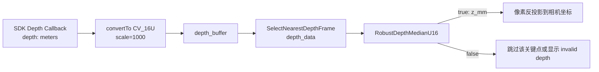
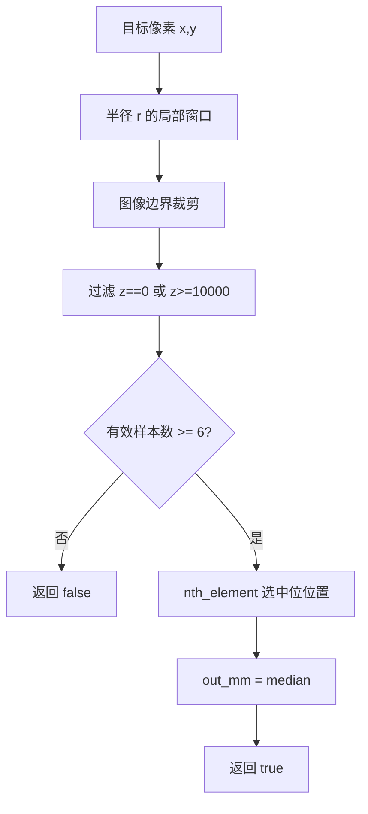
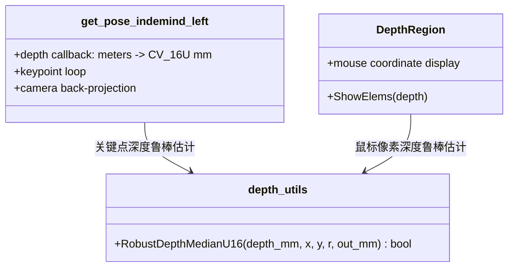

本页聚焦当前代码库中**深度值从“像素读数”进入“三维关键点/鼠标坐标”之前的鲁棒化入口**：`RobustDepthMedianU16` 以局部窗口收集有效 `uint16_t` 毫米深度，过滤无效值与超距值，再用中位数作为代表深度；该函数被主检测循环用于 YOLO 关键点反投影，也被深度交互面板用于鼠标位置三维坐标显示。Sources: [depth_utils.cpp](app/depth_utils.cpp#L6-L28), [get_pose_indemind_left.cpp](get_pose_indemind_left.cpp#L1000-L1023), [depth_region.h](app/depth_region.h#L121-L130)

## 架构假设与验证结论

从第一性原理看，深度图中的单像素读数可能出现空洞、越界或离群值；当前实现并没有对所有深度使用点做统一的复杂滤波，而是将**人体关键点与鼠标查询**收敛到一个小型、可复用的局部中值估计函数：输入必须是 `CV_16UC1` 毫米深度图，输出是过滤后的 `uint16_t` 深度毫米值，失败则返回 `false`。Sources: [depth_utils.h](app/depth_utils.h#L8-L11), [depth_utils.cpp](app/depth_utils.cpp#L6-L8)

验证结果显示，深度源在 SDK 回调中先从米单位转换为 `CV_16U` 毫米图，再进入深度帧缓冲；主循环选取与 RGB 时间戳最近的深度帧作为 `depth_data`，后续关键点三维化才调用局部中值函数，因此本页讨论的过滤逻辑位于“深度帧已同步、像素已定位、反投影尚未发生”的窄接口位置。Sources: [get_pose_indemind_left.cpp](get_pose_indemind_left.cpp#L789-L804), [get_pose_indemind_left.cpp](get_pose_indemind_left.cpp#L849-L876), [get_pose_indemind_left.cpp](get_pose_indemind_left.cpp#L985-L1009)

## 局部中值估计的精确定义

`RobustDepthMedianU16(depth_mm, x, y, r, out_mm)` 首先拒绝空矩阵或非 `CV_16UC1` 的深度图；随后遍历以 `(x, y)` 为中心、半径为 `r` 的方形窗口，窗口理论尺寸为 `(2r+1) × (2r+1)`，并通过行列边界判断跳过落在图像外的采样位置。Sources: [depth_utils.cpp](app/depth_utils.cpp#L6-L18)

在窗口内，采样值 `z` 只有在既非 `0`、又小于 `10000` 时才会进入候选集合；这意味着当前实现把 `0` 定义为空洞/无效深度，把 `>=10000` 毫米定义为超出可用范围的深度。Sources: [depth_utils.cpp](app/depth_utils.cpp#L18-L21)

当候选有效样本少于 `6` 个时，函数直接返回 `false`；否则用 `std::nth_element` 将中位位置元素就位，并把 `vals[vals.size()/2]` 写入 `out_mm`，最后返回 `true`。Sources: [depth_utils.cpp](app/depth_utils.cpp#L24-L27)

| 维度 | 当前实现 | 对调用方的语义 |
|---|---|---|
| 输入类型 | `CV_16UC1` | 非 16 位单通道毫米深度图直接失败 |
| 空洞过滤 | `z == 0` | 不参与局部估计 |
| 超距过滤 | `z >= 10000` | 不参与局部估计 |
| 边界处理 | 越界像素 `continue` | 靠近图像边缘时自动缩小有效采样区域 |
| 最小样本数 | `< 6` 返回 `false` | 有效深度不足时不生成三维点 |
| 代表值 | `nth_element` 后的中位位置值 | 抗局部离群值的深度估计 |

上述表格完全对应函数体中的类型检查、窗口遍历、无效值过滤、最小样本门槛和中位数选择逻辑；它也是高级开发者定位“为什么某个关键点没有 3D 坐标”的最短判定路径。Sources: [depth_utils.cpp](app/depth_utils.cpp#L6-L28)

## 概念关系图：从无效值过滤到鲁棒估计

下图展示的是当前实现的概念关系，而不是额外设计：**无效深度过滤**先缩小候选集合，**最小样本数门槛**决定是否允许输出，**局部中位数**再把局部窗口压缩为单个深度值，最后调用方才进行相机坐标反投影或显示无效状态。Sources: [depth_utils.cpp](app/depth_utils.cpp#L11-L27), [get_pose_indemind_left.cpp](get_pose_indemind_left.cpp#L1006-L1023), [depth_region.h](app/depth_region.h#L121-L149)

## 模块交互边界

`app/depth_utils` 是纯函数式的深度采样模块：头文件只暴露 `RobustDepthMedianU16`，实现文件只依赖 OpenCV 矩阵、`uint16_t` 向量与标准库选择算法；它不持有运行时状态、不访问相机内参、不执行坐标系变换。Sources: [depth_utils.h](app/depth_utils.h#L1-L13), [depth_utils.cpp](app/depth_utils.cpp#L1-L28)

`get_pose_indemind_left.cpp` 将该函数用在 YOLO 关键点三维化路径中：关键点置信度低于 `0.3` 会先被跳过，像素坐标越界也会被跳过，只有局部中值返回成功时才构造齐次像素向量并使用 `cv_in_left_inv * Z * kp_img_cor` 得到相机坐标。Sources: [get_pose_indemind_left.cpp](get_pose_indemind_left.cpp#L994-L1023)

`DepthRegion::ShowElems` 将同一函数用在鼠标位置查询中：当局部中值失败时，面板将当前位置标记为 `invalid depth`；当成功时，使用中值深度 `z_mm` 与相机内参逆矩阵计算鼠标位置对应的左相机坐标。Sources: [depth_region.h](app/depth_region.h#L111-L130), [depth_region.h](app/depth_region.h#L143-L151)

## 关键点三维化中的失败传播

主检测循环不会为局部中值失败的关键点填充近似深度：`RobustDepthMedianU16` 返回 `false` 后直接 `continue`，因此 `info.kp_valid[k]` 保持为 `false`；只有成功反投影后的关键点才会写入 `info.kp_cam[k]` 并标记为有效。Sources: [get_pose_indemind_left.cpp](get_pose_indemind_left.cpp#L989-L992), [get_pose_indemind_left.cpp](get_pose_indemind_left.cpp#L1006-L1023)

髋部有效性在此基础上继续收紧：左髋、右髋不仅要求索引存在和关键点置信度大于 `0.5`，还要求对应 `info.kp_valid` 为真；也就是说，局部中值估计失败会直接阻断后续骨盆点有效性判定。Sources: [get_pose_indemind_left.cpp](get_pose_indemind_left.cpp#L1030-L1037)

## 鼠标深度交互中的失败呈现

鼠标交互路径与关键点路径使用同一个半径 `r=3` 的局部中值采样；当采样失败时，`cursor_valid` 被置为 `false`，显示文本从三维坐标切换为 `Current camera pos: [invalid depth]`。Sources: [depth_region.h](app/depth_region.h#L121-L130), [depth_region.h](app/depth_region.h#L143-L149)

这一路径的价值在于它把深度过滤的结果直接暴露给开发者：如果鼠标停在某个区域持续显示 `invalid depth`，可按当前函数定义回溯为类型错误、窗口内有效深度不足、深度为空洞或深度超过 `10000` 毫米等可验证原因。Sources: [depth_utils.cpp](app/depth_utils.cpp#L6-L27), [depth_region.h](app/depth_region.h#L121-L149)

## 与单点采样路径的差异

代码库中仍存在直接读取单像素深度的工具逻辑：`pose_utils.cpp` 在关键点处读取 `depth.at<ushort>(y, x)`，再过滤 `Z_mm >= 10000 || Z_mm == 0`，随后执行针孔模型反投影；该路径没有局部窗口，也没有中位数估计。Sources: [pose_utils.cpp](pose_utils.cpp#L66-L95)

| 对比项 | 局部中值路径 `RobustDepthMedianU16` | 单点读取路径 `pose_utils.cpp` |
|---|---|---|
| 采样范围 | `(2r+1) × (2r+1)` 局部窗口 | 单个像素 |
| 无效过滤 | `z == 0 || z >= 10000` | `Z_mm >= 10000 || Z_mm == 0` |
| 有效样本门槛 | 至少 6 个有效样本 | 单点有效即可 |
| 鲁棒代表值 | 中位位置元素 | 原始像素值 |
| 当前主检测循环使用 | 是，用于关键点 3D 化 | 未在主循环该段使用 |

该对比只描述代码中可见的两种模式：当前主检测循环的关键点三维化使用局部中值路径，而 `pose_utils.cpp` 展示的是直接单点读取与同一无效阈值规则的旧式/独立工具实现。Sources: [get_pose_indemind_left.cpp](get_pose_indemind_left.cpp#L1006-L1023), [pose_utils.cpp](pose_utils.cpp#L74-L95)

## 半径、样本数与计算成本

当前两个显式调用点都传入 `r=3`，因此理论窗口为 `7 × 7 = 49` 个像素；实际参与候选集合的样本还会受到图像边界和无效深度过滤影响，最终候选数若小于 6 则失败。Sources: [get_pose_indemind_left.cpp](get_pose_indemind_left.cpp#L1006-L1009), [depth_region.h](app/depth_region.h#L121-L123), [depth_utils.cpp](app/depth_utils.cpp#L9-L24)

函数内部对候选向量执行 `reserve((2 * r + 1) * (2 * r + 1))`，然后遍历窗口并调用 `std::nth_element` 选取中位位置；因此代码层面的主要成本来自窗口扫描、候选压入和中位位置选择。Sources: [depth_utils.cpp](app/depth_utils.cpp#L9-L26)

## ROI 平面采样中的边界说明

蹦床 ROI 平面采样也使用相同的无效深度定义，即跳过 `z_mm == 0 || z_mm >= 10000`；但该路径直接按 `roi_sample_step_` 遍历 ROI 内像素并把有效单点反投影为三维样本，没有调用 `RobustDepthMedianU16`。Sources: [depth_region.h](app/depth_region.h#L306-L327)

因此，本页的“局部中值鲁棒估计”只覆盖关键点与鼠标查询两个调用点；ROI 平面拟合的采样、RANSAC 和坐标系构建属于后续页面范围，可继续阅读 [四点 ROI 交互与蹦床平面采样](18-si-dian-roi-jiao-hu-yu-beng-chuang-ping-mian-cai-yang) 与 [RANSAC 与最小二乘平面拟合](19-ransac-yu-zui-xiao-er-cheng-ping-mian-ni-he)。Sources: [depth_region.h](app/depth_region.h#L306-L335), [depth_utils.cpp](app/depth_utils.cpp#L6-L28)

## 调试判定清单

当 3D 关键点缺失时，先确认深度帧是否进入主循环：SDK 深度回调成功后会把米单位深度转换为 `CV_16U` 毫米图并推入 `depth_buffer`，主循环再按 RGB 时间戳选择最近深度帧；若 `depth_data` 为空，则局部中值函数不会被用于关键点三维化。Sources: [get_pose_indemind_left.cpp](get_pose_indemind_left.cpp#L789-L804), [get_pose_indemind_left.cpp](get_pose_indemind_left.cpp#L867-L876), [get_pose_indemind_left.cpp](get_pose_indemind_left.cpp#L985-L986)

当深度帧存在但单个关键点缺失时，按顺序检查关键点置信度是否低于 `0.3`、像素坐标是否越界、局部窗口内是否少于 6 个有效深度、深度值是否为 `0` 或 `>=10000`；这些条件都会导致该关键点不写入有效三维坐标。Sources: [get_pose_indemind_left.cpp](get_pose_indemind_left.cpp#L994-L1009), [depth_utils.cpp](app/depth_utils.cpp#L11-L24)

| 现象 | 可验证触发条件 | 代码位置 |
|---|---|---|
| 鼠标面板显示 `invalid depth` | `RobustDepthMedianU16` 返回 `false` | `DepthRegion::ShowElems` |
| 关键点没有 3D 坐标 | 置信度、越界或局部中值失败后 `continue` | 主检测循环关键点段 |
| 髋点不可用于骨盆 | 髋点置信度不足或 `kp_valid` 为假 | 髋部有效性判定 |
| ROI 样本减少 | ROI 内 `z_mm == 0 || z_mm >= 10000` 被跳过 | ROI 深度采样段 |

上表中的每个现象都能映射到明确的条件分支；若需要继续分析像素反投影矩阵与单位约定，请转到 [相机内参、深度采样与像素反投影](16-xiang-ji-nei-can-shen-du-cai-yang-yu-xiang-su-fan-tou-ying)，若需要分析深度过滤之后的床面几何建模，请转到 [四点 ROI 交互与蹦床平面采样](18-si-dian-roi-jiao-hu-yu-beng-chuang-ping-mian-cai-yang)。Sources: [depth_region.h](app/depth_region.h#L121-L149), [get_pose_indemind_left.cpp](get_pose_indemind_left.cpp#L994-L1037), [depth_region.h](app/depth_region.h#L313-L327)