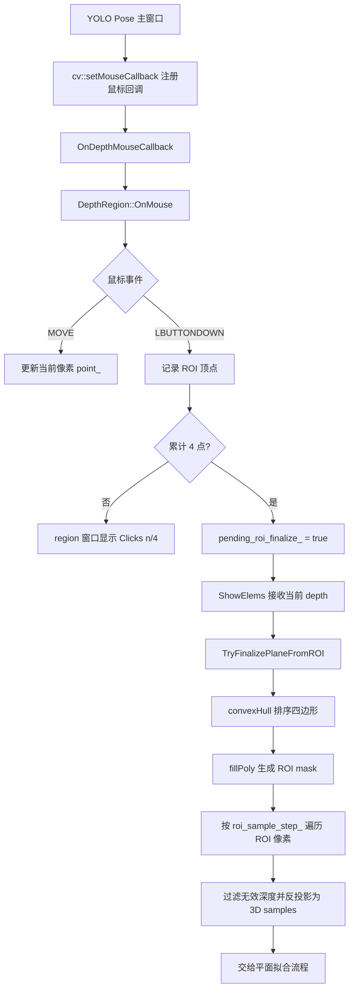

本页定位在“蹦床坐标系与几何算法”小节中的当前节点：[四点 ROI 交互与蹦床平面采样](18-si-dian-roi-jiao-hu-yu-beng-chuang-ping-mian-cai-yang)。它只解释**用户如何通过四次鼠标点击定义蹦床床面 ROI**，以及系统如何从该 ROI 内的深度图抽取三维采样点，为后续的 [RANSAC 与最小二乘平面拟合](19-ransac-yu-zui-xiao-er-cheng-ping-mian-ni-he) 和 [床面坐标系构建、坐标变换与轴向约定](20-chuang-mian-zuo-biao-xi-gou-jian-zuo-biao-bian-huan-yu-zhou-xiang-yue-ding) 提供输入。Sources: [get_pose_indemind_left.cpp](get_pose_indemind_left.cpp#L1657-L1665), [get_pose_indemind_left.cpp](get_pose_indemind_left.cpp#L1708-L1717)

## 架构假设与验证结论

从第一性原理看，四点 ROI 的职责不是直接“识别蹦床”，而是把人工可见的床面边界转化为一个可计算的二维多边形，再用同步到主循环的深度图把该多边形内的有效像素反投影为相机坐标系下的三维点集。代码验证显示，这一职责集中在 `DepthRegion`：鼠标事件由 OpenCV 回调进入 `OnMouse()`，四次左键点击后置位 `pending_roi_finalize_`，随后在 `ShowElems()` 中等待可用深度图并调用 `TryFinalizePlaneFromROI()` 完成 ROI 排序、掩膜生成、深度过滤与采样。Sources: [app/depth_region.cpp](app/depth_region.cpp#L3-L6), [app/depth_region.h](app/depth_region.h#L45-L80), [app/depth_region.h](app/depth_region.h#L106-L109), [app/depth_region.h](app/depth_region.h#L284-L337)

下图描述本页范围内的交互与采样链路；其中“平面拟合”只作为采样链路的下游消费者出现，拟合算法本身属于下一页。Sources: [app/depth_region.h](app/depth_region.h#L284-L371)

## 运行时入口：DepthRegion 与鼠标回调

主程序在初始化阶段创建 `DepthRegion depth_region(3)`，并在启用深度处理器后注册深度回调；深度帧会从 SDK 的深度单位转换为毫米，并推入 `depth_buffer`。这一点决定了 ROI 采样阶段使用的是 `CV_16U` 毫米深度图，而不是原始 SDK 深度矩阵。Sources: [get_pose_indemind_left.cpp](get_pose_indemind_left.cpp#L745-L754), [get_pose_indemind_left.cpp](get_pose_indemind_left.cpp#L789-L804)

鼠标回调不是一次性初始化，而是在主显示循环中对窗口 `"YOLO Pose - INDEMIND Left Camera"` 调用 `cv::setMouseCallback()`，将 `DepthRegion` 实例作为 userdata 传入；回调函数 `OnDepthMouseCallback()` 只做一次类型还原，然后把事件、坐标和 flags 转交给 `DepthRegion::OnMouse()`。Sources: [get_pose_indemind_left.cpp](get_pose_indemind_left.cpp#L1299-L1300), [app/depth_region.cpp](app/depth_region.cpp#L3-L6)

控制台说明也把这一路径暴露给操作者：鼠标在 YOLO 主窗口中点击四个角点以拟合床面平面；帮助文本进一步说明移动鼠标用于预览深度，四次左键点击用于定义蹦床床面 ROI，额外点击会重置 ROI 并开始新的选择。Sources: [get_pose_indemind_left.cpp](get_pose_indemind_left.cpp#L809-L824), [get_pose_indemind_left.cpp](get_pose_indemind_left.cpp#L1708-L1717)

## 四点交互状态机

`DepthRegion::OnMouse()` 只处理两类事件：`cv::EVENT_MOUSEMOVE` 和 `cv::EVENT_LBUTTONDOWN`。鼠标移动时，如果蹦床坐标系尚未建立，系统更新 `point_` 为当前像素坐标；左键点击时，如果已有四个 ROI 点，则先调用 `ResetRoiSelection()` 清空旧状态，然后记录新点、更新点击计数并把 `selected_` 置为 true。Sources: [app/depth_region.h](app/depth_region.h#L50-L80), [app/depth_region.h](app/depth_region.h#L1031-L1041)

当第四个点被记录后，`pending_roi_finalize_` 被置为 true，而不是立即执行采样。这是一个重要的时序设计：鼠标事件线程只记录意图，真正依赖深度图的操作延迟到 `ShowElems()` 中执行，因为该函数接收当前 `depth` 参数，并在检测到 `pending_roi_finalize_` 时调用 `TryFinalizePlaneFromROI(depth)`。Sources: [app/depth_region.h](app/depth_region.h#L77-L80), [app/depth_region.h](app/depth_region.h#L83-L109)

| 状态变量 | 写入位置 | 含义 | 对界面的影响 |
|---|---|---|---|
| `roi_points_` | 左键点击追加；重选时清空 | 已记录的 ROI 顶点列表 | `region` 窗口列出 P1~P4，主图绘制圆点和折线 |
| `click_count_` | 左键点击后同步为点数；重选时归零 | 当前交互进度 | 未完成时显示 `Clicks: n / 4` |
| `pending_roi_finalize_` | 第四点后置 true；进入采样函数后置 false | 等待深度图完成 ROI 采样 | 触发 `TryFinalizePlaneFromROI()` |
| `coord_system_ready_` | ROI 重置时 false；下游坐标系构建成功后 true | 蹦床坐标系是否可用 | 成功后显示 `Trampoline Frame: READY` |
Sources: [app/depth_region.h](app/depth_region.h#L64-L80), [app/depth_region.h](app/depth_region.h#L174-L191), [app/depth_region.h](app/depth_region.h#L405-L425), [app/depth_region.h](app/depth_region.h#L1031-L1041)

## ROI 顶点排序与多边形掩膜

`TryFinalizePlaneFromROI()` 首先验证当前确实处于待完成状态，并要求 `roi_points_` 的数量等于 4；随后要求传入深度图非空且类型为 `CV_16UC1`。如果深度图不可用，函数输出警告并终止，不会继续构造 ROI 采样。Sources: [app/depth_region.h](app/depth_region.h#L284-L296)

四个点击点会通过 `cv::convexHull(roi_points_, ordered_roi, true)` 重新排序为凸包顶点；如果凸包结果不是四点，代码判定 ROI 点退化，并要求重新选择。通过这一约束，后续 `fillPoly()` 获得的是一个四边形多边形，而不是任意顺序或自交的点击序列。Sources: [app/depth_region.h](app/depth_region.h#L298-L308)

掩膜构造使用与深度图同尺寸的 `CV_8UC1` 矩阵，初始值为 0，再用 `cv::fillPoly()` 将四边形内部填充为 255。后续采样循环只接受 `mask` 中非零的像素，因此 ROI 边界之外的深度不会进入床面样本集。Sources: [app/depth_region.h](app/depth_region.h#L306-L318)

## 深度采样策略：从像素到相机三维点

ROI 采样不是逐像素全量扫描，而是使用 `roi_sample_step_` 作为步长遍历深度图的 y 和 x；该成员默认值为 4，样本容器预留容量为 2000。每个候选像素必须同时满足“位于 ROI 掩膜内”和“深度有效”两个条件，深度值为 0 或大于等于 10000 毫米都会被跳过。Sources: [app/depth_region.h](app/depth_region.h#L310-L327), [app/depth_region.h](app/depth_region.h#L1242-L1252)

对通过过滤的像素，代码构造齐次图像坐标 `[x, y, 1]^T`，再用左目内参逆矩阵 `cv_in_left_inv` 和深度值 `z_mm` 计算相机坐标：`pt_cam = cv_in_left_inv * z_mm * pt_img`。生成的 `cv::Point3d` 以毫米为单位存入 `samples`，这使 ROI 从二维交互区域转化为可被几何算法消费的三维点云。Sources: [app/depth_region.h](app/depth_region.h#L321-L327), [app/camera_intrinsics.h](app/camera_intrinsics.h#L1-L9), [app/camera_intrinsics.cpp](app/camera_intrinsics.cpp#L1-L5)

当前鼠标位置的深度预览使用了更鲁棒的局部中值策略：`RobustDepthMedianU16()` 在半径 `r=3` 的窗口内收集有效深度，过滤 0 和大于等于 10000 的值，至少需要 6 个有效样本，并通过 `nth_element` 取中位数。该逻辑用于光标处坐标显示，而 ROI 平面采样循环本身读取的是步长网格上的单点深度值。Sources: [app/depth_region.h](app/depth_region.h#L111-L130), [app/depth_utils.cpp](app/depth_utils.cpp#L6-L28)

## 采样质量门槛与下游交接

ROI 内三维样本少于 50 个时，`TryFinalizePlaneFromROI()` 会输出 “Not enough depth samples in ROI” 警告并返回 false；这意味着四点交互成功并不等价于床面采样成功，深度覆盖、ROI 面积和无效深度比例都会影响后续是否进入拟合流程。Sources: [app/depth_region.h](app/depth_region.h#L330-L333)

当样本数量满足最低要求后，代码把 `samples` 传给 `FitPlaneRansac()`，参数来自 `ransac_max_iters_ = 200` 和 `ransac_inlier_thresh_mm_ = 15.0`；随后以内点集合做最小二乘 refinement，并记录 `plane_inlier_count_` 与 `plane_inlier_ratio_`。这里的重点是：本页的输出是经过 ROI 采样得到的 `samples`，而 RANSAC 和最小二乘细节应继续阅读 [RANSAC 与最小二乘平面拟合](19-ransac-yu-zui-xiao-er-cheng-ping-mian-ni-he)。Sources: [app/depth_region.h](app/depth_region.h#L335-L358), [app/depth_region.h](app/depth_region.h#L1249-L1252)

采样与拟合成功后，控制台会输出 `[Trampoline Plane Established]`、平面法向与 `d`，以及内点数量和内点比例；`region` 窗口则在坐标系 ready 时显示 `Trampoline Frame: READY` 和 `Plane inliers`。这些反馈是验证 ROI 采样是否产生稳定床面输入的主要可见信号。Sources: [app/depth_region.h](app/depth_region.h#L365-L371), [app/depth_region.h](app/depth_region.h#L174-L184)

## 可视化反馈：主图与 region 窗口

在 YOLO 主显示图上，`DrawRect()` 根据 `coord_system_ready_` 选择颜色：坐标系未建立时使用红色，建立后使用绿色；它会为每个 ROI 点绘制实心圆和黑色外圈，当点数达到两个及以上时绘制折线，四点完成时闭合多边形。Sources: [app/depth_region.h](app/depth_region.h#L405-L425)

`region` 窗口由 `ShowElems()` 创建为 1000×650 的白底图像，显示当前深度像素位置、当前相机坐标、ROI 点列表、点击进度或平面内点状态。帮助文本也说明该窗口会展示图像坐标、三维相机坐标、ROI 点列表与平面拟合状态。Sources: [app/depth_region.h](app/depth_region.h#L99-L130), [app/depth_region.h](app/depth_region.h#L136-L191), [get_pose_indemind_left.cpp](get_pose_indemind_left.cpp#L1714-L1717)

## 边界条件与失败路径

如果用户在已经记录四点后再次左键点击，`OnMouse()` 会先调用 `ResetRoiSelection()`，清空 `roi_points_`、`click_count_`、`pending_roi_finalize_`、`plane_fit_ready_`、内点统计、`coord_system_ready_` 和平面系数，然后把这次点击作为新 ROI 的第一个点。Sources: [app/depth_region.h](app/depth_region.h#L64-L80), [app/depth_region.h](app/depth_region.h#L1031-L1041)

ROI 采样阶段存在三个直接失败入口：深度图为空或类型不是 `CV_16UC1`，四点凸包退化为非四边形，以及有效三维样本数少于 50。每个失败路径都会提前返回 false，其中后两类分别提示重新选择 ROI 或样本不足。Sources: [app/depth_region.h](app/depth_region.h#L290-L304), [app/depth_region.h](app/depth_region.h#L330-L333)

| 现象 | 代码判定 | 直接原因 | 建议动作 |
|---|---|---|---|
| 点击四点后没有建立床面 | `depth.empty()` 或类型不为 `CV_16UC1` | 深度图不可用或未转换为毫米 16 位图 | 先确认深度处理器启用成功 |
| 提示 ROI 点退化 | `convexHull()` 结果不是 4 点 | 四个点无法形成有效四边形 | 重新按床面四角点击 |
| 提示样本不足 | `samples.size() < 50` | ROI 内有效深度过少 | 选择深度覆盖更完整的床面区域 |
| 额外点击后旧 ROI 消失 | `roi_points_.size() >= 4` 触发重置 | 设计为重新标定入口 | 继续点击剩余三个新角点 |
Sources: [get_pose_indemind_left.cpp](get_pose_indemind_left.cpp#L789-L807), [app/depth_region.h](app/depth_region.h#L64-L80), [app/depth_region.h](app/depth_region.h#L290-L333), [app/depth_region.h](app/depth_region.h#L1031-L1041)

## 与相邻页面的职责分界

本页到此为止只覆盖“交互选区”和“ROI 内深度采样”：它解释四个像素点如何变成掩膜、掩膜内像素如何变成相机坐标系三维点集，以及系统如何给出采样状态反馈。若要继续理解 `FitPlaneRansac()`、`FitPlaneLeastSquares()` 的数学过程，请转到 [RANSAC 与最小二乘平面拟合](19-ransac-yu-zui-xiao-er-cheng-ping-mian-ni-he)；若要理解 `BuildFrameFromPlane()` 如何把平面和 ROI 方向转成蹦床坐标系，请转到 [床面坐标系构建、坐标变换与轴向约定](20-chuang-mian-zuo-biao-xi-gou-jian-zuo-biao-bian-huan-yu-zhou-xiang-yue-ding)。Sources: [app/depth_region.h](app/depth_region.h#L335-L371), [app/depth_region.h](app/depth_region.h#L1152-L1235)