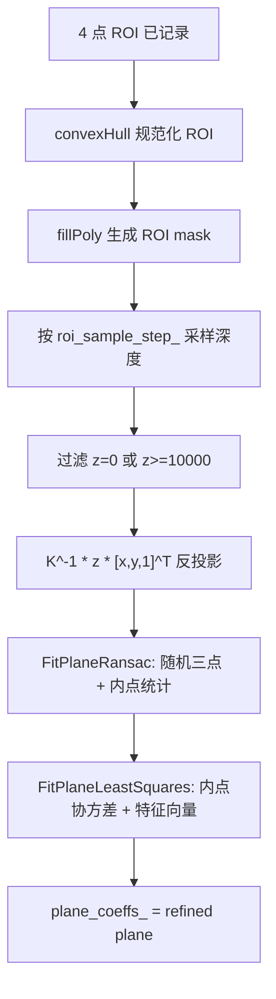
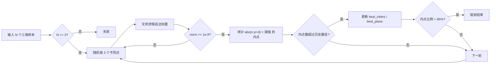
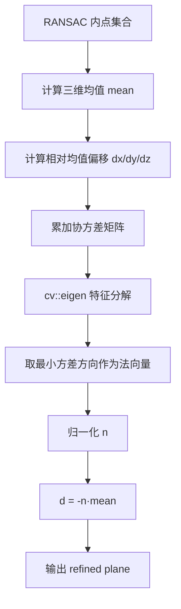
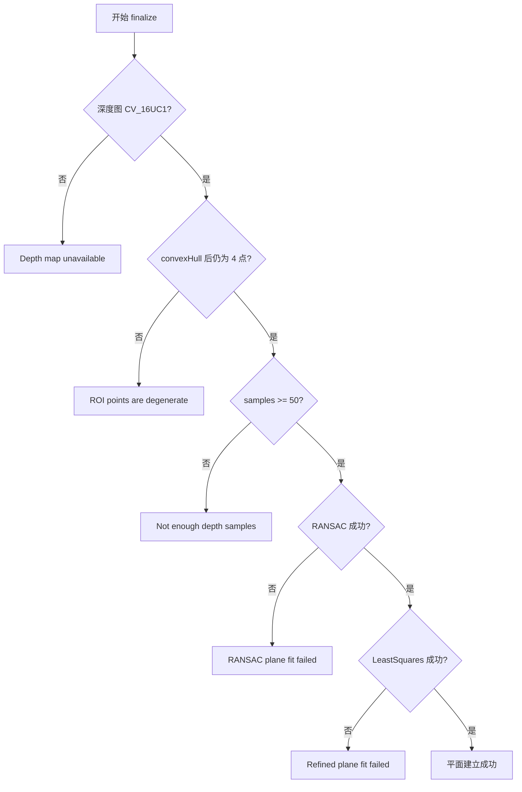

在蹦床 ROI 被四次点击定义之后，本页关注唯一一个几何核心：如何把 ROI 内的深度像素反投影为三维点云，先用 **RANSAC** 抵抗离群深度，再用 **最小二乘平面拟合** 对内点集合精修，最终得到单位法向量形式的平面参数 `n·p + d = 0`。本页位于目录中的 [RANSAC 与最小二乘平面拟合](19-ransac-yu-zui-xiao-er-cheng-ping-mian-ni-he)，上游是 [四点 ROI 交互与蹦床平面采样](18-si-dian-roi-jiao-hu-yu-beng-chuang-ping-mian-cai-yang)，下游是 [床面坐标系构建、坐标变换与轴向约定](20-chuang-mian-zuo-biao-xi-gou-jian-zuo-biao-bian-huan-yu-zhou-xiang-yue-ding)。Sources: [depth_region.h](app/depth_region.h#L45-L49), [depth_region.h](app/depth_region.h#L284-L371)

## 1. 架构假设与代码定位

从第一性原理看，床面平面拟合要解决三个问题：输入点必须来自一个已闭合的床面区域；深度异常、遮挡和 ROI 边缘噪声不能主导模型；最终平面需要用稳定的全体内点重新估计，而不是直接信任某一次随机三点模型。代码中的 `TryFinalizePlaneFromROI` 正好体现了这一链路：检查 ROI 与深度图，构造 ROI mask，采样三维点，调用 `FitPlaneRansac` 获得内点索引，再调用 `FitPlaneLeastSquares` 生成 `plane_refined`。Sources: [depth_region.h](app/depth_region.h#L284-L350)

该流程不是独立的数学工具函数，而是 `DepthRegion` 中 ROI 完成阶段的一部分；状态字段保存了拟合是否完成、内点数量、内点比例和平面系数，默认采样步长为 `4`、RANSAC 最大迭代次数为 `200`、内点阈值为 `15.0` 毫米。Sources: [depth_region.h](app/depth_region.h#L1238-L1252)

## 2. 数据入口：从 ROI 深度像素到三维样本

拟合入口首先拒绝未触发的 finalize、非四点 ROI、空深度图或非 `CV_16UC1` 深度图；这说明该实现假设深度输入是 16 位单通道毫米深度图，并且平面拟合只在四点 ROI 已经完成后执行一次。Sources: [depth_region.h](app/depth_region.h#L284-L296)

ROI 点会通过 `cv::convexHull` 重新排序并验证仍为四边形，然后用 `cv::fillPoly` 写入二值 mask；后续只遍历 mask 内像素，从而把平面拟合的样本域限制在用户选定的蹦床区域内。Sources: [depth_region.h](app/depth_region.h#L298-L309)

采样阶段以 `roi_sample_step_` 为步长遍历整张深度图，跳过 ROI 外像素、深度为 `0` 的像素以及深度 `>= 10000` 的像素；有效像素 `(x,y,z_mm)` 被转换为齐次像素向量 `[x,y,1]^T`，再通过 `cv_in_left_inv * z_mm * [x,y,1]^T` 反投影到左相机三维坐标系。Sources: [depth_region.h](app/depth_region.h#L310-L328)

如果 ROI 内有效样本少于 `50` 个，拟合会直接失败并输出警告；这是一道入口质量门槛，防止 RANSAC 在点数过少的情况下给出偶然模型。Sources: [depth_region.h](app/depth_region.h#L330-L333)

| 阶段 | 代码行为 | 约束含义 |
|---|---|---|
| 深度图检查 | 要求 `CV_16UC1` | 输入单位按毫米深度处理 |
| ROI 规范化 | `cv::convexHull` 后要求 4 点 | 排除退化四边形 |
| ROI mask | `cv::fillPoly` | 只采样床面选区内部 |
| 深度过滤 | 跳过 `0` 与 `>=10000` | 排除无效或过远深度 |
| 样本下限 | `samples.size() < 50` 则失败 | 避免欠约束拟合 |

Sources: [depth_region.h](app/depth_region.h#L293-L333)

## 3. RANSAC：用随机三点模型寻找最大一致集

`FitPlaneRansac` 接收三维点集合、最大迭代次数、内点阈值、输出内点索引和最佳平面；函数首先清空历史内点，并要求输入点数至少为 `3`。Sources: [depth_region.h](app/depth_region.h#L1084-L1091)

每次迭代从样本中随机抽取三个不同点；如果抽到重复索引，当前迭代被回退并重新抽样。三点模型通过 `v1 = p2 - p1`、`v2 = p3 - p1` 和叉积 `n = v1.cross(v2)` 得到法向量，若法向量范数小于 `1e-9`，说明三点近似共线或退化，本次迭代被跳过。Sources: [depth_region.h](app/depth_region.h#L1092-L1114)

平面偏置项由 `d = -(n·p1)` 得到，因此候选平面写作 `n[0]x + n[1]y + n[2]z + d = 0`；由于 `n` 已归一化，点到平面的距离可直接计算为 `abs(n·p + d)`，代码用该距离与 `inlier_thresh` 比较来收集内点。Sources: [depth_region.h](app/depth_region.h#L1111-L1125)

当某次随机模型的内点数超过当前最佳内点数时，代码更新 `best_inliers` 与 `best_plane`；如果最佳内点数量超过总样本数的 `85%`，RANSAC 提前终止。最终只有当最佳内点数至少为 `10` 时，函数才返回成功。Sources: [depth_region.h](app/depth_region.h#L1127-L1136)

这个 RANSAC 实现的核心选择是“最大内点数优先”，没有在 RANSAC 内部做残差均值排序，也没有对随机种子固定化；因此它适合实时交互中的一次性鲁棒初始化，而最终精度由后续最小二乘精修承担。Sources: [depth_region.h](app/depth_region.h#L1092-L1136)

## 4. 最小二乘精修：从内点集合估计稳定法向量

RANSAC 返回成功后，调用方根据 `inlier_idx` 从原始样本中拷贝内点集合；随后 `FitPlaneLeastSquares(inliers, plane_refined)` 对内点重新拟合，并在成功后把 `plane_refined` 写入 `plane_coeffs_`。Sources: [depth_region.h](app/depth_region.h#L343-L357)

`FitPlaneLeastSquares` 同样要求至少 `3` 个点，先计算所有输入点的均值 `mean`，再把每个点转换为相对均值的偏移量 `(dx,dy,dz)`；这一步把平面拟合转换为“寻找点云最小方差方向”的问题。Sources: [depth_region.h](app/depth_region.h#L1043-L1059)

代码显式累加 `xx, xy, xz, yy, yz, zz` 六个二阶项，并构造对称的 `3x3` 协方差矩阵；随后调用 `cv::eigen` 做特征分解，取 `eigen_vecs` 第三行作为法向量 `n`。Sources: [depth_region.h](app/depth_region.h#L1055-L1075)

在 OpenCV `cv::eigen` 返回结果之后，代码对选出的法向量再次归一化，并以 `d = -(n·mean)` 得到平面偏置项；如果法向量范数小于 `1e-9`，函数返回失败，否则输出 `cv::Vec4d(n[0], n[1], n[2], d)`。Sources: [depth_region.h](app/depth_region.h#L1071-L1081)

这里的最小二乘目标不是拟合 `z = ax + by + c`，而是拟合一般三维平面 `n·p+d=0`；这种形式可以处理任意朝向的床面，因为法向量来自三维协方差的最小方差方向，而不是强制把某个坐标轴当作因变量。Sources: [depth_region.h](app/depth_region.h#L1068-L1080)

## 5. RANSAC 与最小二乘的职责分离

RANSAC 和最小二乘在此处不是替代关系，而是串联关系：RANSAC 用随机三点候选模型把“多数一致的床面点”筛出来，最小二乘再用这些内点的整体统计结构估计最终平面。调用链明确体现了这一点：先 `FitPlaneRansac(samples, ...)`，再根据内点索引构造 `inliers`，最后 `FitPlaneLeastSquares(inliers, plane_refined)`。Sources: [depth_region.h](app/depth_region.h#L335-L350)

| 维度 | RANSAC 阶段 | 最小二乘精修阶段 |
|---|---|---|
| 输入 | ROI 内全部有效三维样本 | RANSAC 选出的内点 |
| 模型来源 | 随机三点叉积 | 内点均值与协方差矩阵 |
| 鲁棒性来源 | 最大内点一致集 | 已过滤后的整体统计 |
| 失败条件 | 少于 3 点、最佳内点少于 10 | 少于 3 点、法向量退化 |
| 输出 | `best_inliers` 与候选 `best_plane` | `plane_refined` 最终平面 |

Sources: [depth_region.h](app/depth_region.h#L1084-L1136), [depth_region.h](app/depth_region.h#L1043-L1081)

从工程角度看，`plane_ransac` 在调用点只是中间模型，真正持久化的是 `plane_refined`；代码把精修结果写入 `plane_coeffs_`，并同步记录 `plane_inlier_count_` 与 `plane_inlier_ratio_`。Sources: [depth_region.h](app/depth_region.h#L335-L357)

## 6. 参数与可观察结果

本实现暴露出的关键参数只有三个：ROI 采样步长 `roi_sample_step_ = 4`、RANSAC 最大迭代次数 `ransac_max_iters_ = 200`、RANSAC 内点阈值 `ransac_inlier_thresh_mm_ = 15.0`；它们定义在 `DepthRegion` 的 ROI / plane fit state 区域。Sources: [depth_region.h](app/depth_region.h#L1242-L1252)

| 参数 | 默认值 | 直接影响 |
|---|---:|---|
| `roi_sample_step_` | `4` | ROI 内点云密度与采样开销 |
| `ransac_max_iters_` | `200` | 随机候选平面的搜索次数上限 |
| `ransac_inlier_thresh_mm_` | `15.0` | 点到候选平面的内点判定距离 |
| 最小样本数 | `50` | ROI 采样入口质量门槛 |
| 最小内点数 | `10` | RANSAC 成功判定门槛 |
| 提前终止比例 | `85%` | 高一致性时结束 RANSAC 搜索 |

Sources: [depth_region.h](app/depth_region.h#L330-L337), [depth_region.h](app/depth_region.h#L1127-L1136), [depth_region.h](app/depth_region.h#L1249-L1252)

拟合成功后，控制台会打印 `[Trampoline Plane Established]`、平面法向量 `n`、偏置 `d`、内点数以及内点比例；界面层也会在坐标系统就绪时显示 `Plane inliers` 与百分比，这为开发者判断 ROI 深度质量和拟合一致性提供了直接观测点。Sources: [depth_region.h](app/depth_region.h#L365-L369), [depth_region.h](app/depth_region.h#L174-L184)

## 7. 失败路径与诊断边界

该拟合链路的失败路径都是显式返回：深度图不可用、ROI 点退化、ROI 内有效样本不足、RANSAC 未找到足够内点、最小二乘精修失败，都会输出对应警告并终止当前 finalize。Sources: [depth_region.h](app/depth_region.h#L293-L302), [depth_region.h](app/depth_region.h#L330-L352)

这些失败路径只覆盖平面拟合阶段本身；拟合成功后还会继续交给后续床面坐标系构建逻辑，但坐标系轴向、原点选择和坐标变换属于下一页 [床面坐标系构建、坐标变换与轴向约定](20-chuang-mian-zuo-biao-xi-gou-jian-zuo-biao-bian-huan-yu-zhou-xiang-yue-ding) 的范围。Sources: [depth_region.h](app/depth_region.h#L355-L363)

## 8. 与相邻页面的阅读路径

如果需要理解这些三维样本为何来自四点 ROI、鼠标交互如何触发 `pending_roi_finalize_`，应回到 [四点 ROI 交互与蹦床平面采样](18-si-dian-roi-jiao-hu-yu-beng-chuang-ping-mian-cai-yang)；如果需要理解 `plane_refined` 如何进一步变成床面坐标系，则继续阅读 [床面坐标系构建、坐标变换与轴向约定](20-chuang-mian-zuo-biao-xi-gou-jian-zuo-biao-bian-huan-yu-zhou-xiang-yue-ding)。Sources: [depth_region.h](app/depth_region.h#L45-L49), [depth_region.h](app/depth_region.h#L360-L371)