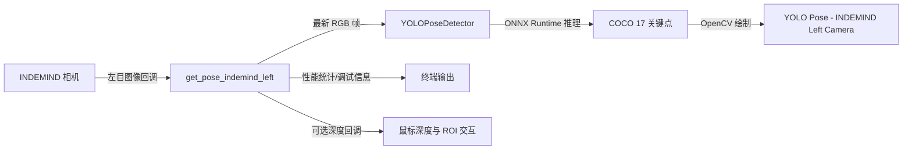
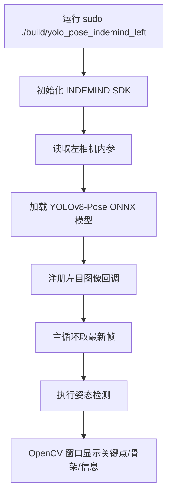

本页的目标是让你在最短路径内完成 **编译 → 启动 → 看到 INDEMIND 左目图像上的 YOLOv8-Pose 姿态结果**。这不是完整依赖安装手册，也不展开深度、ROI、RANSAC、坐标系和落点状态机的细节；如果你在某一步遇到环境问题，请优先跳转到 [运行环境与依赖检查](3-yun-xing-huan-jing-yu-yi-lai-jian-cha)，如果想理解模型、SDK、目录为什么这样放，请继续读 [模型文件、相机 SDK 与目录约定](4-mo-xing-wen-jian-xiang-ji-sdk-yu-mu-lu-yue-ding)。Sources: [CMakeLists.txt](CMakeLists.txt#L62-L70), [CMakeLists.txt](CMakeLists.txt#L72-L130), [CMakeLists.txt](CMakeLists.txt#L132-L155)

## 先建立一个正确心智模型

从第一原则看，这个项目的最小闭环只有四件事：**相机 SDK 提供左目图像，OpenCV 承载图像显示与交互，ONNX Runtime 执行 YOLOv8-Pose 模型推理，主程序把关键点和骨架画回窗口**。代码入口是 `get_pose_indemind_left.cpp`，它初始化 INDEMIND SDK，读取左相机内参，创建 `YOLOPoseDetector`，然后在主循环中取最新 RGB 帧并执行 `pose_detector.Detect(left_image)`。Sources: [get_pose_indemind_left.cpp](get_pose_indemind_left.cpp#L672-L727), [get_pose_indemind_left.cpp](get_pose_indemind_left.cpp#L846-L889)

下面的 Mermaid 图展示“快速开始”阶段需要理解的运行路径：你只需要准备依赖、模型和相机，然后构建一个名为 `yolo_pose_indemind_left` 的可执行程序，运行后观察两个主要窗口与终端输出即可。Sources: [CMakeLists.txt](CMakeLists.txt#L193-L215), [get_pose_indemind_left.cpp](get_pose_indemind_left.cpp#L1502-L1504)



## 项目最小结构

快速开始只需要关注少数目录：根目录的 `CMakeLists.txt` 定义构建目标，`get_pose_indemind_left.cpp` 是主程序，`models/` 放 ONNX 姿态模型，`include/` 和 `lib/` 放 INDEMIND SDK 头文件与动态库，`app/` 放运行期辅助模块，例如相机内参、深度区域、性能统计和运行状态。Sources: [CMakeLists.txt](CMakeLists.txt#L160-L187), [get_pose_indemind_left.cpp](get_pose_indemind_left.cpp#L8-L24)

```text
YOLO_rec/
├── CMakeLists.txt              # CMake 构建入口
├── get_pose_indemind_left.cpp  # 主程序：相机、推理、显示、交互
├── yolo_pose_detector.*        # YOLOv8-Pose ONNX 推理封装
├── pose_utils.*                # 姿态绘制与工具逻辑
├── app/                        # 内参、深度、性能、运行状态等辅助模块
├── include/                    # INDEMIND SDK 头文件
├── lib/
│   └── libindemind.so          # INDEMIND SDK Linux 动态库
└── models/
    ├── yolov8m-pose-1280.onnx
    ├── yolov8n-pose-1280.onnx
    └── yolov8n-pose-640.onnx
```

当前仓库中已经包含 `lib/libindemind.so`、INDEMIND 相关头文件，以及三个 ONNX 模型文件；CMake 会检查 `include/imrsdk.h` 和 `lib/libindemind.so` 是否存在，并把 `include/`、`app/`、OpenCV 与 ONNX Runtime 的 include 路径加入编译。Sources: [CMakeLists.txt](CMakeLists.txt#L132-L166), [CMakeLists.txt](CMakeLists.txt#L171-L199)

## 你需要先确认什么

开始前先确认三类依赖：**OpenCV 必须能被 CMake 找到，ONNX Runtime 必须提供头文件和库文件，INDEMIND SDK 必须在本项目的 `include/` 与 `lib/` 目录下**。CMake 对 OpenCV 使用 `find_package(OpenCV REQUIRED)`；对 ONNX Runtime 会优先检查 Conda 环境中的 include/lib，再回退到系统路径；对 INDEMIND SDK 则固定检查项目内的 `include/imrsdk.h` 和 `lib/libindemind.so`。Sources: [CMakeLists.txt](CMakeLists.txt#L62-L70), [CMakeLists.txt](CMakeLists.txt#L72-L130), [CMakeLists.txt](CMakeLists.txt#L132-L155)

| 检查项 | 项目期望 | 快速判断方式 | 不满足时去哪看 |
|---|---|---|---|
| OpenCV | CMake 能找到 OpenCV 包 | `cmake` 配置阶段出现 Found OpenCV | [运行环境与依赖检查](3-yun-xing-huan-jing-yu-yi-lai-jian-cha) |
| ONNX Runtime | 存在 `onnxruntime_cxx_api.h` 和 `libonnxruntime.so` | Conda 或系统路径中存在 ONNX Runtime | [运行环境与依赖检查](3-yun-xing-huan-jing-yu-yi-lai-jian-cha) |
| INDEMIND SDK | `include/imrsdk.h` 与 `lib/libindemind.so` 在项目内 | CMake 输出 Found IMSEE SDK | [模型文件、相机 SDK 与目录约定](4-mo-xing-wen-jian-xiang-ji-sdk-yu-mu-lu-yue-ding) |
| 模型文件 | 默认使用 `models/yolov8m-pose-1280.onnx` | 文件存在即可直接运行默认命令 | [模型文件、相机 SDK 与目录约定](4-mo-xing-wen-jian-xiang-ji-sdk-yu-mu-lu-yue-ding) |

默认模型路径由主程序设置为 `models/yolov8m-pose-1280.onnx`，如果启动命令附带第一个参数，则使用你传入的模型路径；初始化检测器时，代码传入输入尺寸 `1280`、置信度阈值 `0.5f`、NMS 阈值 `0.45f`，并启用 CUDA 参数。Sources: [get_pose_indemind_left.cpp](get_pose_indemind_left.cpp#L675-L678), [get_pose_indemind_left.cpp](get_pose_indemind_left.cpp#L720-L727)

## 推荐的第一次编译方式

为了避免输出目录理解混乱，推荐你第一次使用显式输出目录：在项目根目录执行下面三条命令，它们会把可执行文件放到 `build/yolo_pose_indemind_left`，便于直接运行。Sources: [CMakeLists.txt](CMakeLists.txt#L12-L15), [CMakeLists.txt](CMakeLists.txt#L201-L215)

```bash
cmake -S . -B build -DYOLO_OUTPUT_DIR="$PWD/build"
cmake --build build -j
sudo ./build/yolo_pose_indemind_left
```

CMake 构建目标名是 `yolo_pose_indemind_left`，它由 `get_pose_indemind_left.cpp`、`yolo_pose_detector.cpp`、`pose_utils.cpp` 以及 `app/` 下的辅助源文件共同组成，并链接 INDEMIND SDK、OpenCV、ONNX Runtime；在 Linux 下还会链接 `pthread`。Sources: [CMakeLists.txt](CMakeLists.txt#L171-L187), [CMakeLists.txt](CMakeLists.txt#L193-L215)

如果你想使用更轻量的模型，可以把模型路径作为启动参数传入，例如运行 `sudo ./build/yolo_pose_indemind_left models/yolov8n-pose-640.onnx`；主程序只读取第一个命令行参数作为模型路径，不解析其它启动参数。Sources: [get_pose_indemind_left.cpp](get_pose_indemind_left.cpp#L672-L679), [get_pose_indemind_left.cpp](get_pose_indemind_left.cpp#L721-L727)

## 启动后应该看到什么

程序启动时会先初始化 INDEMIND SDK，配置项包括关闭 SLAM、图像分辨率 `IMG_1280`、图像频率 `50`、IMU 频率 `0`；初始化成功后读取左相机内参并打印 `fx/fy/cx/cy`，随后初始化 YOLO Pose Detector。Sources: [get_pose_indemind_left.cpp](get_pose_indemind_left.cpp#L684-L718), [get_pose_indemind_left.cpp](get_pose_indemind_left.cpp#L720-L727)



启动成功后，主要显示窗口名为 `"YOLO Pose - INDEMIND Left Camera"`，另一个指标窗口名为 `"Body Frame Metrics"`；如果深度数据可用并且你进行鼠标交互，程序还会通过 `DepthRegion` 展示深度区域信息。Sources: [get_pose_indemind_left.cpp](get_pose_indemind_left.cpp#L1502-L1504), [get_pose_indemind_left.cpp](get_pose_indemind_left.cpp#L1507-L1518)

## 第一次运行只需要掌握的按键

快速验证阶段建议只使用最少按键：`q` 或 `ESC` 退出，`k` 开关关键点显示，`t` 开关骨架显示，`i` 开关信息叠加，`l` 开关髋点坐标 CSV 记录。程序在启动时会把完整控制提示打印到终端。Sources: [get_pose_indemind_left.cpp](get_pose_indemind_left.cpp#L809-L824), [get_pose_indemind_left.cpp](get_pose_indemind_left.cpp#L1532-L1564)

| 操作 | 按键/动作 | 快速开始阶段建议 |
|---|---|---|
| 退出程序 | `q` 或 `ESC` | 必须掌握 |
| 显示/隐藏关键点 | `k` | 检查模型输出是否稳定 |
| 显示/隐藏骨架 | `t` | 检查关键点连接效果 |
| 显示/隐藏信息层 | `i` | 查看画面叠加是否影响观察 |
| 记录髋点坐标 | `l` | 初次运行可暂不使用 |
| 鼠标 ROI | 在主窗口点击 4 个角点 | 属于蹦床 ROI 流程，建议阅读 [蹦床 ROI 标定与落点记录流程](9-beng-chuang-roi-biao-ding-yu-luo-dian-ji-lu-liu-cheng) 后再操作 |

代码中的鼠标交互由 `DepthRegion::OnMouse` 处理：鼠标移动会更新位置，左键点击会记录 ROI 点，达到 4 个点后标记为待拟合平面；快速开始只需要知道“点击 4 点会进入 ROI 标定流程”，算法细节留到后续页面。Sources: [app/depth_region.h](app/depth_region.h#L45-L80), [get_pose_indemind_left.cpp](get_pose_indemind_left.cpp#L1299-L1300)

## 快速故障定位

如果程序没有进入画面显示，先不要修改代码；按“构建阶段 → 模型阶段 → 相机阶段 → 运行阶段”的顺序定位。CMake 阶段的错误通常来自 OpenCV、ONNX Runtime 或 INDEMIND SDK 检查失败；运行阶段的错误通常来自相机初始化失败、模型初始化失败或权限不足。Sources: [CMakeLists.txt](CMakeLists.txt#L62-L70), [CMakeLists.txt](CMakeLists.txt#L120-L130), [CMakeLists.txt](CMakeLists.txt#L144-L155), [get_pose_indemind_left.cpp](get_pose_indemind_left.cpp#L692-L727)

| 现象 | 优先检查 | 依据 |
|---|---|---|
| CMake 报 OpenCV 找不到 | 是否安装 OpenCV 开发包，CMake 是否能 `find_package(OpenCV REQUIRED)` | CMake 明确把 OpenCV 设为必需依赖 |
| CMake 报 ONNX Runtime 找不到 | Conda 环境或系统路径是否存在 ONNX Runtime 头文件与库 | CMake 会查找 `onnxruntime_cxx_api.h` 和 `onnxruntime` 库 |
| CMake 报 IMSEE SDK 找不到 | `include/imrsdk.h` 与 `lib/libindemind.so` 是否存在 | CMake 固定检查项目内 SDK 文件 |
| 启动时报相机初始化失败 | INDEMIND 相机是否连接，是否使用 `sudo` 运行 | 主程序初始化 SDK 失败会直接退出 |
| 启动时报检测器初始化失败 | 模型路径是否正确，ONNX Runtime 是否可用 | `pose_detector.Init()` 失败会直接退出 |
| 有窗口但没有人体 | 人是否完整进入画面，光照是否足够，模型是否加载成功 | 程序只在 `Detect(left_image)` 返回结果后计入姿态检测 |

## 下一步阅读路线

如果你已经成功看到实时姿态画面，下一页建议读 [运行环境与依赖检查](3-yun-xing-huan-jing-yu-yi-lai-jian-cha)，把当前机器的 OpenCV、ONNX Runtime、CUDA/CPU 和 SDK 状态固定下来；随后读 [模型文件、相机 SDK 与目录约定](4-mo-xing-wen-jian-xiang-ji-sdk-yu-mu-lu-yue-ding)，理解为什么模型、头文件和动态库必须放在这些位置。Sources: [CMakeLists.txt](CMakeLists.txt#L72-L130), [CMakeLists.txt](CMakeLists.txt#L132-L155)

如果你的目标是继续动手验证，请按目录顺序进入 [编译、运行与常见启动参数](5-bian-yi-yun-xing-yu-chang-jian-qi-dong-can-shu)、[实时界面、鼠标选区与键盘操作](6-shi-shi-jie-mian-shu-biao-xuan-qu-yu-jian-pan-cao-zuo)、[从左目图像到人体关键点的最小闭环](7-cong-zuo-mu-tu-xiang-dao-ren-ti-guan-jian-dian-de-zui-xiao-bi-huan)；如果你已经准备使用深度、ROI 或落点记录，再进入 [深度图接入与 3D 关键点验证](8-shen-du-tu-jie-ru-yu-3d-guan-jian-dian-yan-zheng) 和 [蹦床 ROI 标定与落点记录流程](9-beng-chuang-roi-biao-ding-yu-luo-dian-ji-lu-liu-cheng)。Sources: [get_pose_indemind_left.cpp](get_pose_indemind_left.cpp#L763-L807), [get_pose_indemind_left.cpp](get_pose_indemind_left.cpp#L846-L889), [app/depth_region.h](app/depth_region.h#L45-L80)