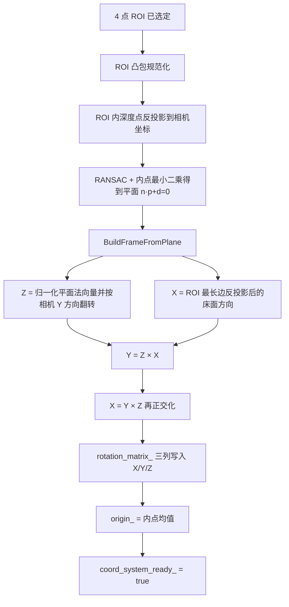
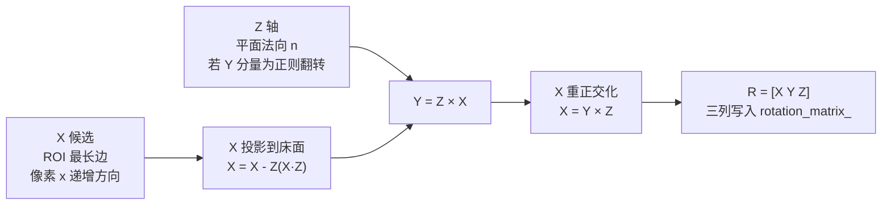
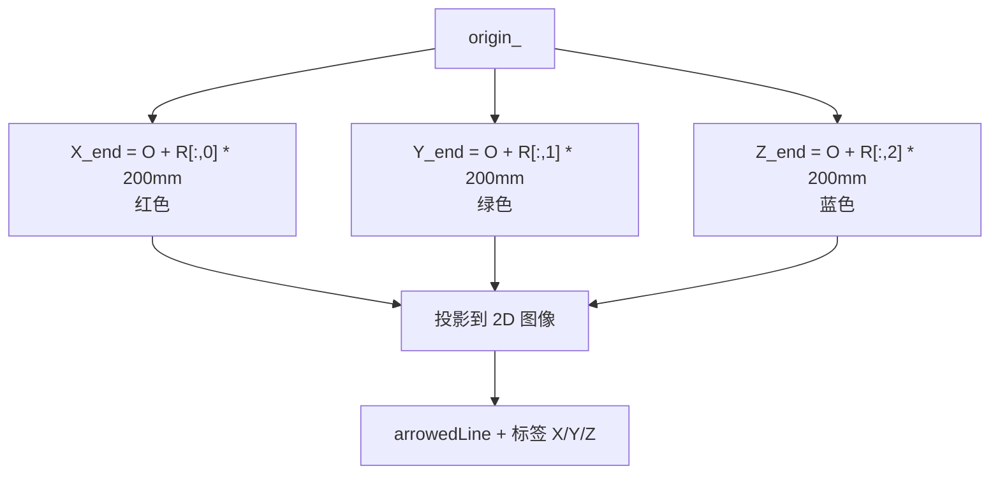

本页聚焦当前目录中的第 20 页「床面坐标系构建、坐标变换与轴向约定」：它解释 `DepthRegion` 如何在蹦床 ROI 平面拟合完成后，从平面法向量、ROI 最长边和内点均值构建床面坐标系，并说明相机坐标到床面坐标的变换公式、三轴方向约定、矩阵列向量语义以及可视化验证路径；平面采样、RANSAC 细节仅作为坐标系构建的上游输入出现，完整平面拟合过程应转到 [RANSAC 与最小二乘平面拟合](19-ransac-yu-zui-xiao-er-cheng-ping-mian-ni-he)。Sources: [depth_region.h](app/depth_region.h#L284-L360), [depth_region.h](app/depth_region.h#L1152-L1234)

## 架构假设与代码验证结论

从第一性原理看，床面坐标系需要三个要素：**原点**、**正交单位基**和**坐标变换方向**。当前实现将原点定义为平面内点均值，将三列旋转矩阵定义为床面 X/Y/Z 轴在相机坐标系中的方向，并使用 `R^T * (P_cam - origin)` 将相机坐标点投影到床面坐标系；这意味着 `rotation_matrix_` 在语义上是“床面基向量表达于相机坐标系”的矩阵，而非直接的点坐标变换矩阵。Sources: [depth_region.h](app/depth_region.h#L378-L402), [depth_region.h](app/depth_region.h#L1210-L1234), [depth_region.h](app/depth_region.h#L1254-L1256)

当前实现的关键链路如下：鼠标 4 点 ROI 触发待完成状态，`ShowElems` 在有深度图时调用 `TryFinalizePlaneFromROI`，该函数对 ROI 点做凸包规范化、采样深度点、拟合并精修平面，然后调用 `BuildFrameFromPlane` 构建床面坐标系；坐标系构建成功后，`coord_system_ready_` 置为 `true`，主循环才会对关键点和髋点执行床面坐标变换。Sources: [depth_region.h](app/depth_region.h#L45-L80), [depth_region.h](app/depth_region.h#L106-L109), [depth_region.h](app/depth_region.h#L284-L360), [get_pose_indemind_left.cpp](get_pose_indemind_left.cpp#L977-L983)

## 坐标系对象与状态边界

床面坐标系状态由 `DepthRegion` 内部持有：`rotation_matrix_` 存放 3×3 基矩阵，`origin_` 存放床面坐标系原点，`coord_system_ready_` 表示坐标系是否可用；初始化时原点为 `(0,0,0)`，可用状态为 `false`，旋转矩阵为单位矩阵，但只有 `coord_system_ready_` 为真时，外部才应通过 `GetCoordinateSystem` 或 `TransformToNewFrame` 使用该坐标系。Sources: [depth_region.h](app/depth_region.h#L28-L41), [depth_region.h](app/depth_region.h#L506-L519), [depth_region.h](app/depth_region.h#L1242-L1256)

`GetCoordinateSystem` 对外返回的是 `rotation_matrix_.clone()` 与 `origin_`，主循环在 `bed_ready = depth_region.IsCoordSystemReady()` 为真后获取它们；随后人体关键点管线会继续调用 `TransformToNewFrame` 得到床面坐标，而不是直接在外部手写变换，这使床面坐标变换集中在 `DepthRegion` 类内维护。Sources: [depth_region.h](app/depth_region.h#L506-L519), [get_pose_indemind_left.cpp](get_pose_indemind_left.cpp#L977-L983), [get_pose_indemind_left.cpp](get_pose_indemind_left.cpp#L1025-L1027)

| 成员 / 接口 | 当前角色 | 坐标语义 | 可用条件 |
|---|---|---|---|
| `origin_` | 床面坐标系原点 | 相机坐标系下的 3D 点，单位 mm | `coord_system_ready_ == true` |
| `rotation_matrix_` | 床面三轴基矩阵 | 三列分别是床面 X/Y/Z 轴在相机坐标系下的方向 | `coord_system_ready_ == true` |
| `TransformToNewFrame` | 点坐标变换 | `P_cam → P_bed` | 未 ready 时返回 `(0,0,0)` |
| `GetCoordinateSystem` | 对外读取床面基与原点 | 返回相机坐标表达的床面基与原点 | 未 ready 时返回 `false` |

上述表格中的语义均来自代码：`TransformToNewFrame` 在未 ready 时直接返回零点；`GetCoordinateSystem` 在未 ready 时返回 `false`；成员注释将 `rotation_matrix_` 标记为 3×3 rotation matrix，`origin_` 标记为 trampoline frame origin。Sources: [depth_region.h](app/depth_region.h#L378-L402), [depth_region.h](app/depth_region.h#L511-L519), [depth_region.h](app/depth_region.h#L1254-L1256)

## 轴向约定：Z 向上、X 沿 ROI 最长边、Y 保持右手系

`BuildFrameFromPlane` 首先从平面参数 `plane = (a,b,c,d)` 取出 `Z_vec=(a,b,c)`，归一化后作为床面法向；随后代码假定相机坐标系 `Y+` 向下，因此当 `Z_vec[1] > 0.0` 时将法向量取反，使 Z 轴朝“上”的方向，也就是朝相机坐标系负 Y 分量的一侧。Sources: [depth_region.h](app/depth_region.h#L1152-L1162)

X 轴不是从图像水平轴直接构造，而是从 ROI 四边形的**最长边**构造：代码遍历 4 条相邻边，以像素长度选择最长边，再确保边的端点顺序使第二点的像素 x 不小于第一点的像素 x；之后通过 `PixelToPlanePoint` 将这两个像素点分别与拟合平面求交，得到平面上的两个 3D 点，二者差向量归一化后成为 X 轴候选。Sources: [depth_region.h](app/depth_region.h#L1164-L1191), [depth_region.h](app/depth_region.h#L1139-L1149)

由于像素最长边反投影得到的 X 候选可能含有法向分量，代码显式执行 `X_vec = X_vec - Z_vec * (X_vec.dot(Z_vec))`，将 X 投影回与 Z 正交的床面切平面；随后通过 `Y_vec = Z_vec.cross(X_vec)` 构造 Y，再以 `X_vec = Y_vec.cross(Z_vec)` 重算 X，以保持三轴正交并符合右手系。Sources: [depth_region.h](app/depth_region.h#L1193-L1208)

最终写入 `rotation_matrix_` 时，第一列是 X 轴，第二列是 Y 轴，第三列是 Z 轴；因此对于任意相机坐标系下的相对向量 `v = P_cam - origin_`，床面坐标的三个分量分别是 `v` 对 X/Y/Z 三根单位轴的点积。Sources: [depth_region.h](app/depth_region.h#L1210-L1220), [depth_region.h](app/depth_region.h#L378-L402)

## 原点约定：以内点均值作为床面坐标中心

床面坐标系原点不是 ROI 四角点之一，也不是 ROI 像素中心，而是拟合平面内点集合的三维均值：`BuildFrameFromPlane` 对所有 `inliers` 的 `x/y/z` 累加后除以内点数量，并将结果赋给 `origin_`；该原点在相机坐标系中表达，单位与深度反投影一致为毫米。Sources: [depth_region.h](app/depth_region.h#L1222-L1234), [depth_region.h](app/depth_region.h#L310-L327)

这个选择与上游拟合状态绑定：`TryFinalizePlaneFromROI` 先把 RANSAC 内点索引转换为 `inliers` 点集，再用这些内点做最小二乘精修，最后把同一个内点集传给 `BuildFrameFromPlane`；因此原点实际对应“被当前平面模型接受的 ROI 深度样本中心”。Sources: [depth_region.h](app/depth_region.h#L335-L360), [depth_region.h](app/depth_region.h#L1043-L1081)

## 坐标变换公式：从相机点到床面点

`TransformToNewFrame` 的变换分两步：先平移，得到 `relative = point_cam - origin_`；再旋转，计算 `new_coords = R^T * relative`。代码没有显式调用矩阵乘法，而是逐分量使用 `rotation_matrix_` 的列向量与 `relative` 做点积：`new.x` 使用第 0 列，`new.y` 使用第 1 列，`new.z` 使用第 2 列。Sources: [depth_region.h](app/depth_region.h#L378-L402)

用数学形式表示，若 `R = [x_axis y_axis z_axis]`，其中每个轴均以相机坐标表达，则当前实现为：`P_bed = R^T (P_cam - O_cam)`；反向理解时，床面坐标点若要回到相机系，则应满足 `P_cam = O_cam + R P_bed`，这一反向式是由当前矩阵列向量语义直接推出的线性代数关系。Sources: [depth_region.h](app/depth_region.h#L388-L400), [depth_region.h](app/depth_region.h#L1210-L1220)

| 变量 | 代码位置 | 数学含义 |
|---|---|---|
| `point_cam` | `TransformToNewFrame` 入参 | 相机坐标系下的 3D 点 |
| `origin_` | `BuildFrameFromPlane` 写入 | 床面坐标系原点在相机坐标系下的位置 |
| `relative` | `point_cam - origin_` | 从床面原点指向目标点的相机系向量 |
| `rotation_matrix_` 第 0/1/2 列 | `BuildFrameFromPlane` 写入 | 床面 X/Y/Z 单位轴在相机系下的方向 |
| `new_coords` | `TransformToNewFrame` 返回 | 点在床面坐标系下的坐标 |

表中变换关系对应代码的逐项实现：`new_coords.x/y/z` 分别由 `rotation_matrix_` 的第 0/1/2 列与 `relative` 点积得到，且该函数在坐标系未建立时不会执行变换，而是返回零坐标。Sources: [depth_region.h](app/depth_region.h#L378-L402)

## 像素射线与平面求交：ROI 方向进入三维空间的方式

X 轴依赖 `PixelToPlanePoint` 把 ROI 最长边的两个像素端点转换为平面上的三维点。该函数使用左目内参逆矩阵 `cv_in_left_inv` 将像素 `[u,v,1]^T` 变成相机射线方向 `dir`，再与平面 `n·p + d = 0` 求交：`t = -d / (n·dir)`；当射线与平面近似平行或交点位于相机后方时，函数返回失败。Sources: [depth_region.h](app/depth_region.h#L1139-L1149)

这一设计使 X 轴定义受两个约束共同控制：第一，方向来源于用户点击 ROI 的最长边；第二，实际向量位于拟合平面上，而不是停留在 2D 图像平面中。代码随后还会将该向量再投影到与 Z 正交的平面切空间，避免平面拟合与像素求交的数值误差破坏正交性。Sources: [depth_region.h](app/depth_region.h#L1164-L1197)

## 可视化约定：红 X、绿 Y、蓝 Z

床面坐标系可视化由 `DrawCoordinateSystem` 完成：当 `coord_system_ready_` 为假时直接返回；可视化轴长固定为 `200.0` mm，三个轴端点分别通过 `origin_ + axis * axis_length` 得到，其中 axis 来自 `rotation_matrix_` 的对应列。Sources: [depth_region.h](app/depth_region.h#L428-L448)

三维端点被投影回左目图像后绘制箭头：X 轴使用红色 `cv::Scalar(0,0,255)`，Y 轴使用绿色 `cv::Scalar(0,255,0)`，Z 轴使用蓝色 `cv::Scalar(255,0,0)`；原点在图像上以白色实心圆加黑色描边显示。Sources: [depth_region.h](app/depth_region.h#L450-L503)

## 下游消费边界：关键点与髋点只读取床面坐标结果

主循环在 `bed_ready` 为真时，将每个有效人体关键点的相机坐标 `cam_pt` 传入 `TransformToNewFrame`，并将结果写入 `info.kp_bed[k]`；髋点中点 `pelvis_cam` 也使用同一函数得到 `info.pelvis_bed`，随后 `HipInfo::new_frame_pos` 保存该床面坐标。Sources: [get_pose_indemind_left.cpp](get_pose_indemind_left.cpp#L1017-L1027), [get_pose_indemind_left.cpp](get_pose_indemind_left.cpp#L1037-L1057)

当床面坐标系可用时，代码还会把 `info.kp_bed` 写回 `poses[p].keypoints[k].pos3d`，指标面板显示标题为 `"3D Skeleton (trampoline coords, mm):"`，并逐行输出当前跟踪人体关键点的床面坐标；这说明床面坐标系是后续人体姿态指标和显示面板的统一三维参考系之一。Sources: [get_pose_indemind_left.cpp](get_pose_indemind_left.cpp#L1060-L1070), [get_pose_indemind_left.cpp](get_pose_indemind_left.cpp#L1470-L1499)

## 实现约束与失败路径

床面坐标系构建有明确失败路径：ROI 点数不足 4、内点不足 3、法向量长度过小、ROI 最长边反投影失败、X/Y 轴归一化失败都会导致 `BuildFrameFromPlane` 返回 `false`；上层 `TryFinalizePlaneFromROI` 在构建失败时输出警告并终止本次坐标系建立。Sources: [depth_region.h](app/depth_region.h#L1152-L1208), [depth_region.h](app/depth_region.h#L360-L363)

上游拟合也对坐标系构建形成硬约束：深度图必须非空且类型为 `CV_16UC1`，ROI 凸包必须仍为 4 点，ROI 内有效深度样本数量至少为 50，RANSAC 必须成功并产生至少 10 个最佳内点，精修平面也必须成功；这些条件未满足时，坐标系不会进入 ready 状态。Sources: [depth_region.h](app/depth_region.h#L290-L333), [depth_region.h](app/depth_region.h#L335-L358), [depth_region.h](app/depth_region.h#L1084-L1137)

| 阶段 | 失败条件 | 结果 |
|---|---|---|
| ROI 规范化 | 凸包不是 4 点 | 输出 ROI 退化警告并返回 |
| 深度采样 | 样本数 `< 50` | 输出样本不足警告并返回 |
| RANSAC | 内点数 `< 10` 或无有效模型 | 输出 RANSAC 失败警告并返回 |
| 精修平面 | 点数不足或法向量退化 | 输出精修失败警告并返回 |
| 坐标系构建 | 轴向求解或正交化失败 | 输出坐标系构建失败警告并返回 |

以上失败条件均对应 `TryFinalizePlaneFromROI`、`FitPlaneRansac`、`FitPlaneLeastSquares` 与 `BuildFrameFromPlane` 的显式返回路径；只有所有步骤成功，`coord_system_ready_` 才会被置为 `true`。Sources: [depth_region.h](app/depth_region.h#L284-L371), [depth_region.h](app/depth_region.h#L1043-L1137), [depth_region.h](app/depth_region.h#L1152-L1234)

## 与相邻页面的阅读衔接

若需要理解床面坐标系之前的输入来源，下一步应回读 [四点 ROI 交互与蹦床平面采样](18-si-dian-roi-jiao-hu-yu-beng-chuang-ping-mian-cai-yang) 与 [RANSAC 与最小二乘平面拟合](19-ransac-yu-zui-xiao-er-cheng-ping-mian-ni-he)；若需要理解床面坐标如何支撑人体旋转、姿态指标与身体坐标系，应继续阅读 [人体 3D 姿态指标、身体坐标系与旋转表示](21-ren-ti-3d-zi-tai-zhi-biao-shen-ti-zuo-biao-xi-yu-xuan-zhuan-biao-shi)。Sources: [depth_region.h](app/depth_region.h#L284-L360), [get_pose_indemind_left.cpp](get_pose_indemind_left.cpp#L1074-L1095), [get_pose_indemind_left.cpp](get_pose_indemind_left.cpp#L1470-L1499)