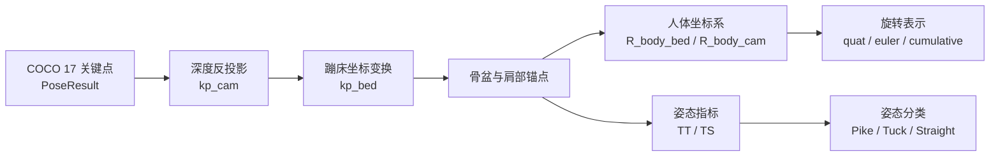
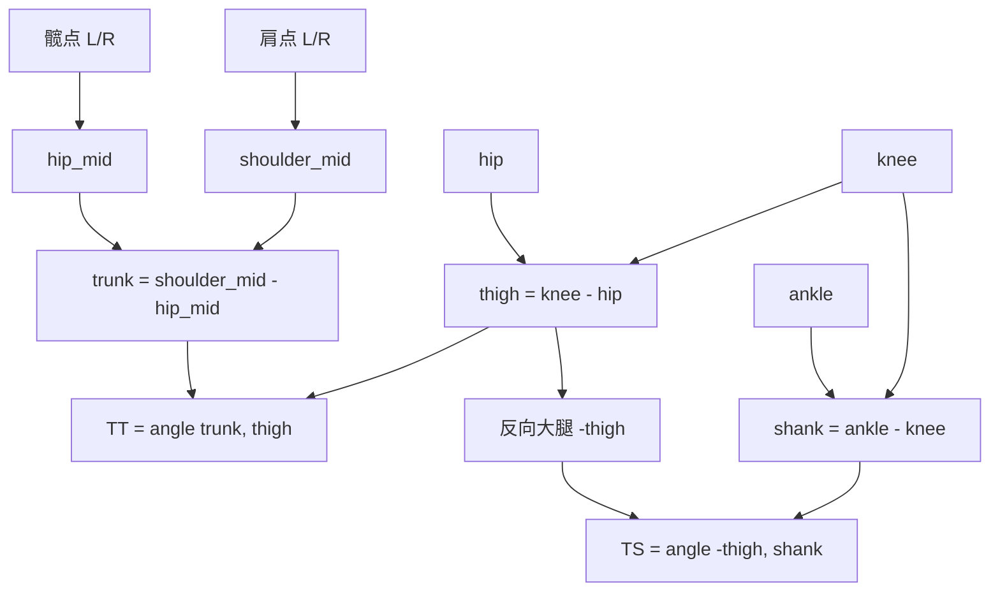
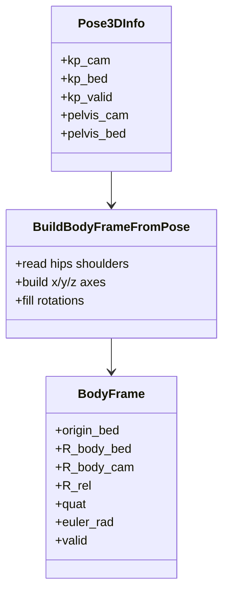

本页解释运行时如何从 YOLOv8-Pose 的 COCO 17 关键点、深度反投影结果与蹦床坐标系，构造**人体 3D 姿态指标**、**人体身体坐标系**与**旋转表示**。边界上，本页只覆盖姿态理解层：关键点有效性、躯干/腿部角度、Pike/Tuck/Straight 分类、身体局部坐标轴、旋转矩阵、四元数、欧拉角与累计旋转；相机深度采样、蹦床平面坐标系和落点状态机分别属于 [相机内参、深度采样与像素反投影](16-xiang-ji-nei-can-shen-du-cai-yang-yu-xiang-su-fan-tou-ying)、[床面坐标系构建、坐标变换与轴向约定](20-chuang-mian-zuo-biao-xi-gou-jian-zuo-biao-bian-huan-yu-zhou-xiang-yue-ding)、[落点检测状态机与加权确认算法](23-luo-dian-jian-ce-zhuang-tai-ji-yu-jia-quan-que-ren-suan-fa)。Sources: [get_pose_indemind_left.cpp](get_pose_indemind_left.cpp#L973-L1121), [yolo_pose_detector.h](yolo_pose_detector.h#L15-L58)

## 架构假设与验证结论

从第一性原理看，人体姿态理解必须解决三个问题：先把 2D 关键点提升为可计算的 3D 点，再用少量稳定的解剖锚点定义人体局部坐标系，最后把该坐标系相对蹦床坐标系的姿态编码为角度、四元数和累计旋转。代码验证显示，运行时先为每个人维护 `Pose3DInfo`，其中包含相机坐标关键点、蹦床坐标关键点、有效性位图和骨盆中心；随后对被跟踪人体构造 `BodyFrame`，其中包含 `origin_bed`、`R_body_bed`、`R_body_cam`、`R_rel`、`quat`、`euler_rad`；同时用 `PostureMetrics` 保存左右腿与平均 TT/TS 角度以及分类标签。Sources: [get_pose_indemind_left.cpp](get_pose_indemind_left.cpp#L44-L61), [get_pose_indemind_left.cpp](get_pose_indemind_left.cpp#L252-L263)

上图中的分支与代码路径一一对应：关键点在循环中经深度中值采样和内参反投影得到 `kp_cam`，在蹦床坐标系就绪时写入 `kp_bed`；随后运行时选择跟踪人体并调用 `BuildBodyFrameFromPose` 生成身体坐标系，再调用 `ComputePostureMetrics` 生成 TT/TS 指标并交给滞回分类器输出姿态标签。Sources: [get_pose_indemind_left.cpp](get_pose_indemind_left.cpp#L986-L1028), [get_pose_indemind_left.cpp](get_pose_indemind_left.cpp#L1074-L1121)

## 输入数据：COCO 17 关键点与 3D 姿态缓存

姿态理解层的原始人体结构来自 `PoseResult`：每个人包含一个检测框、检测置信度、17 个 COCO 关键点和可选 `person_id`；每个 `KeyPoint` 保存图像坐标 `x/y`、关键点置信度和深度融合后填写的 `pos3d`。COCO 枚举中本页主要使用肩、髋、膝、踝：`LEFT_SHOULDER/RIGHT_SHOULDER`、`LEFT_HIP/RIGHT_HIP`、`LEFT_KNEE/RIGHT_KNEE`、`LEFT_ANKLE/RIGHT_ANKLE`。Sources: [yolo_pose_detector.h](yolo_pose_detector.h#L15-L58)

| 数据结构 | 字段 | 本页用途 |
|---|---|---|
| `KeyPoint` | `x`, `y`, `confidence`, `pos3d` | 提供 2D 检测结果、置信度门控和可视化用 3D 坐标 |
| `PoseResult` | `bbox`, `box_confidence`, `keypoints`, `person_id` | 表示单个人体实例，是姿态指标和身体坐标系计算入口 |
| `Pose3DInfo` | `kp_cam`, `kp_bed`, `kp_valid`, `pelvis_*` | 保存每个关键点在相机/蹦床坐标中的 3D 位置与骨盆中心 |
| `BodyFrame` | `origin_bed`, `R_body_bed`, `R_body_cam`, `R_rel`, `quat`, `euler_rad` | 保存人体局部坐标系与旋转表示 |

表中字段均可在结构体定义中验证：`Pose3DInfo` 明确分离相机坐标、蹦床坐标和有效性；`BodyFrame` 同时保存床面坐标下、相机坐标下和相对坐标下的旋转矩阵，并以四元数和欧拉角作为下游显示指标。Sources: [get_pose_indemind_left.cpp](get_pose_indemind_left.cpp#L44-L61), [yolo_pose_detector.h](yolo_pose_detector.h#L36-L58)

## 3D 关键点生成与有效性门控

每帧处理中，程序为每个检测到的人体创建 `Pose3DInfo`，并按关键点数量初始化 `kp_cam`、`kp_bed` 和 `kp_valid`；关键点置信度低于 `0.3f` 会被跳过，像素越界会被跳过，深度中值采样失败也会被跳过。只有通过这些门控的关键点才会通过 `cv_in_left_inv * Z * kp_img_cor` 反投影到相机坐标，并被标记为有效。Sources: [get_pose_indemind_left.cpp](get_pose_indemind_left.cpp#L986-L1024)

当蹦床坐标系已就绪时，有效的相机坐标关键点会通过 `depth_region.TransformToNewFrame(cam_pt)` 转换到蹦床坐标，并写入 `kp_bed`；同一阶段还会将有效 `kp_bed` 回写到 `poses[p].keypoints[k].pos3d`，使显示和信息面板能够读取以蹦床坐标表达的 3D 骨架。Sources: [get_pose_indemind_left.cpp](get_pose_indemind_left.cpp#L1025-L1028), [get_pose_indemind_left.cpp](get_pose_indemind_left.cpp#L1060-L1070)

骨盆中心是本页的核心锚点：当左髋和右髋都满足关键点置信度大于 `0.5f` 且 3D 点有效时，骨盆取二者中点；如果只有一侧髋点可用，则骨盆退化为该侧髋点。生成的 `pelvis_cam` 和可选 `pelvis_bed` 会进入人体跟踪、身体坐标系原点和姿态文字锚点的后续逻辑。Sources: [get_pose_indemind_left.cpp](get_pose_indemind_left.cpp#L1030-L1058), [get_pose_indemind_left.cpp](get_pose_indemind_left.cpp#L1177-L1199)

## 人体跟踪对象的选择

姿态指标和身体坐标系只针对当前被跟踪的人体计算。若之前没有跟踪对象，程序选择第一个具备有效骨盆的人体；若已有跟踪对象，则计算每个候选骨盆与上一帧 `last_tracked_pelvis_cam` 的三维欧氏距离平方，并选择距离最小者作为 `tracked_pose_index`。Sources: [get_pose_indemind_left.cpp](get_pose_indemind_left.cpp#L1074-L1098)

这种跟踪选择只依赖骨盆 3D 位置：命中后更新 `has_tracked_person` 和 `last_tracked_pelvis_cam`，并立即调用 `BuildBodyFrameFromPose`；若本轮没有找到有效骨盆，则将 `has_tracked_person` 置为 `false`。Sources: [get_pose_indemind_left.cpp](get_pose_indemind_left.cpp#L1080-L1101)

## 姿态指标：TT 与 TS 角度

`ComputePostureMetrics` 使用相机坐标下的 3D 点计算角度。它首先以髋中点到肩中点定义躯干向量 `trunk`，要求左右髋与左右肩都能通过 `GetKpCam` 的索引、有效性和最低置信度 `0.3f` 检查；若躯干锚点不足，函数直接返回默认无效指标。Sources: [get_pose_indemind_left.cpp](get_pose_indemind_left.cpp#L428-L444), [get_pose_indemind_left.cpp](get_pose_indemind_left.cpp#L458-L480)

左腿指标使用 `LEFT_HIP → LEFT_KNEE` 作为大腿向量 `thigh`，使用 `LEFT_KNEE → LEFT_ANKLE` 作为小腿向量 `shank`；TT 角为 `trunk` 与 `thigh` 的夹角，TS 角为反向大腿 `-thigh` 与 `shank` 的夹角。右腿以对应的右髋、右膝、右踝重复相同计算。Sources: [get_pose_indemind_left.cpp](get_pose_indemind_left.cpp#L481-L503)

角度计算由 `AngleDeg` 完成：它先检查两个向量范数是否足够大，再计算点积余弦，使用 `[-1, 1]` 截断避免反三角函数越界，最后用 `acos` 转换为角度制。若左右腿都有效，平均 TT/TS 为二者算术平均；若只有一侧有效，则平均值退化为该侧结果。Sources: [get_pose_indemind_left.cpp](get_pose_indemind_left.cpp#L446-L456), [get_pose_indemind_left.cpp](get_pose_indemind_left.cpp#L505-L519)

上图只表达代码实际使用的向量关系：TT 是躯干与大腿的夹角，TS 是反向大腿与小腿的夹角；函数没有引入地面法向、速度、历史窗口或图像二维角度作为 TT/TS 输入。Sources: [get_pose_indemind_left.cpp](get_pose_indemind_left.cpp#L473-L503)

## 姿态分类：Pike、Tuck、Straight 与滞回阈值

分类器 `PostureHysteresisClassifier` 管理 `Unknown`、`Pike`、`Tuck`、`Straight` 四种状态，并在指标无效时累计 `missing_count`；连续无效帧达到 `kResetAfterMissingFrames = 6` 后，状态复位为 `Unknown`。Sources: [get_pose_indemind_left.cpp](get_pose_indemind_left.cpp#L265-L299), [get_pose_indemind_left.cpp](get_pose_indemind_left.cpp#L301-L308)

初始分类从 `Unknown` 进入：当平均 TT 大于等于 `135.0` 度时进入 `Straight`；否则若平均 TS 小于等于 `135.0` 度进入 `Tuck`，不满足则进入 `Pike`。后续状态切换使用滞回阈值：弯曲进入阈值 `kTtBentEnter = 132.0`、伸直退出阈值 `kTtBentExit = 138.0`、团身进入阈值 `kTsTuckEnter = 132.0`、团身退出阈值 `kTsTuckExit = 138.0`。Sources: [get_pose_indemind_left.cpp](get_pose_indemind_left.cpp#L286-L295), [get_pose_indemind_left.cpp](get_pose_indemind_left.cpp#L311-L341)

| 当前状态 | 条件 | 下一状态 |
|---|---:|---|
| `Unknown` | `tt_deg >= 135.0` | `Straight` |
| `Unknown` | `tt_deg < 135.0 && ts_deg <= 135.0` | `Tuck` |
| `Unknown` | `tt_deg < 135.0 && ts_deg > 135.0` | `Pike` |
| `Straight` | `tt_deg < 132.0 && ts_deg <= 132.0` | `Tuck` |
| `Straight` | `tt_deg < 132.0 && ts_deg > 132.0` | `Pike` |
| `Pike` | `tt_deg >= 138.0` | `Straight` |
| `Pike` | `tt_deg < 138.0 && ts_deg <= 132.0` | `Tuck` |
| `Tuck` | `tt_deg >= 138.0` | `Straight` |
| `Tuck` | `tt_deg < 138.0 && ts_deg >= 138.0` | `Pike` |

该表是对 `Update` 分支的直接展开：分类只读取平均 TT/TS 和有效性标志，不读取旋转矩阵、四元数、累计翻转圈数或落点状态。Sources: [get_pose_indemind_left.cpp](get_pose_indemind_left.cpp#L301-L341), [get_pose_indemind_left.cpp](get_pose_indemind_left.cpp#L1114-L1121)

## 身体坐标系的构造

`BuildBodyFrameFromPose` 在蹦床坐标系中定义身体坐标系，因此它要求 `R_bed_cam` 非空，并从 `info.kp_bed` 读取关键点；关键点必须索引合法、`kp_valid` 为真且对应 2D 关键点置信度至少为 `0.3f`。如果髋部两侧都无效，或肩部两侧都无效，身体坐标系构造失败。Sources: [get_pose_indemind_left.cpp](get_pose_indemind_left.cpp#L579-L609)

身体坐标系原点取骨盆：双髋有效时取左右髋中点，否则取可用单侧髋；肩部中心同理，双肩有效时取左右肩中点，否则取可用单侧肩。代码注释明确轴向约定：`y_body` 为髋中点指向肩中点，`x_body` 为右髋指向左髋，`z_body = x_body × y_body`。Sources: [get_pose_indemind_left.cpp](get_pose_indemind_left.cpp#L611-L623)

实现上，`x_raw` 优先使用 `left_hip - right_hip`；若双髋不足但双肩可用，则退化为 `left_shoulder - right_shoulder`。随后先归一化 `x_axis`，再用 Gram-Schmidt 将 `y_raw` 对 `x_axis` 正交化并归一化，最后通过叉积生成 `z_axis` 并再次归一化。Sources: [get_pose_indemind_left.cpp](get_pose_indemind_left.cpp#L623-L648)

该类图中的 `BodyFrame` 由三个列向量组成 `R_body_bed`：第 0 列为 `x_axis`，第 1 列为 `y_axis`，第 2 列为 `z_axis`；这种列向量布局随后直接用于把身体局部点或轴端点变换到相机坐标进行可视化。Sources: [get_pose_indemind_left.cpp](get_pose_indemind_left.cpp#L650-L668), [get_pose_indemind_left.cpp](get_pose_indemind_left.cpp#L1185-L1193)

## 旋转矩阵、相对旋转与四元数

身体坐标系构造完成后，`R_body_bed` 表示身体局部坐标轴在蹦床坐标中的方向；`R_body_cam = R_bed_cam * R_body_bed` 将身体轴表达到相机坐标；`R_rel = R_bed_cam.t() * R_body_cam` 作为后续四元数和欧拉角的输入。由于 `R_body_cam` 又由 `R_bed_cam * R_body_bed` 得到，代码中的 `R_rel` 实际按该乘法链路计算。Sources: [get_pose_indemind_left.cpp](get_pose_indemind_left.cpp#L650-L668)

四元数由 `RotationMatrixToQuaternion` 从 `R_rel` 转换，输出顺序固定为 `(w, x, y, z)`。函数先根据矩阵迹 `trace` 选择常规分支；当迹不为正时，再根据对角线中最大元素选择不同分支，分别计算四元数各分量。Sources: [get_pose_indemind_left.cpp](get_pose_indemind_left.cpp#L53-L60), [get_pose_indemind_left.cpp](get_pose_indemind_left.cpp#L111-L146)

| 表示 | 字段 | 计算来源 | 用途 |
|---|---|---|---|
| 身体到蹦床旋转 | `R_body_bed` | 身体 x/y/z 轴列向量 | 描述人体局部轴在蹦床坐标中的方向 |
| 身体到相机旋转 | `R_body_cam` | `R_bed_cam * R_body_bed` | 绘制身体坐标轴和身体框 |
| 相对旋转 | `R_rel` | `R_bed_cam.t() * R_body_cam` | 生成四元数与欧拉角 |
| 四元数 | `quat` | `RotationMatrixToQuaternion(R_rel)` | 指标面板显示 `(w,x,y,z)` |
| 欧拉角 | `euler_rad` | `RotationMatrixToEulerXYZ(R_rel)` | 指标面板显示角度与累计圈数 |

表中每个字段都来自 `BodyFrame` 的写入逻辑和指标面板读取逻辑：构造阶段填充旋转与姿态表示，显示阶段把四元数、欧拉角、累计角度和圈数输出到 “Body Frame Metrics” 窗口。Sources: [get_pose_indemind_left.cpp](get_pose_indemind_left.cpp#L664-L668), [get_pose_indemind_left.cpp](get_pose_indemind_left.cpp#L1383-L1418)

## 欧拉角与累计旋转

`RotationMatrixToEulerXYZ` 从旋转矩阵读取 `r00`、`r10`、`r20`、`r21`、`r22`，计算 `pitch = asin(-r20)`、`roll = atan2(r21, r22)`、`yaw = atan2(r10, r00)`，并按 `cv::Vec3d(roll, pitch, yaw)` 返回；结构体注释将其标为 `roll(x), pitch(y), yaw(z)`。Sources: [get_pose_indemind_left.cpp](get_pose_indemind_left.cpp#L53-L61), [get_pose_indemind_left.cpp](get_pose_indemind_left.cpp#L148-L162)

`RotationTracker` 维护上一帧欧拉角和累计角度。更新时，它对每个轴计算当前角与上一角的差值，并用 `while (delta > M_PI)` 和 `while (delta < -M_PI)` 把跨越 ±π 的跳变展开为连续增量，然后累加到 `cumulative`；如果连续 3 帧没有有效身体坐标系，运行时会调用 `Reset` 清空累计状态。Sources: [get_pose_indemind_left.cpp](get_pose_indemind_left.cpp#L75-L100), [get_pose_indemind_left.cpp](get_pose_indemind_left.cpp#L1104-L1111)

指标面板将 `euler_rad` 转为角度显示为 `Angles deg (x,y,z)`，将 `rotation_tracker.cumulative` 转为角度显示为 `Cumulative deg (x,y,z)`，并把累计弧度除以 `2π` 显示为 `Counts (flip/twist/side)`。这些标签是显示文本，代码没有在此处进一步定义三者与竞技动作语义之间的数学映射。Sources: [get_pose_indemind_left.cpp](get_pose_indemind_left.cpp#L1383-L1418)

## 可视化：身体轴、身体框与指标窗口

当身体坐标系有效、被跟踪人体索引合法且骨盆有效时，主显示窗口会从骨盆相机坐标出发，沿 `R_body_cam` 的第 0/1/2 列分别延伸固定长度 `520.0`，并投影为红色 `Xb`、绿色 `Yb`、蓝色 `Zb` 三条箭头。Sources: [get_pose_indemind_left.cpp](get_pose_indemind_left.cpp#L1177-L1213)

身体框的中心和尺寸来自躯干几何：肩髋中点距离形成 `torso_height`，肩宽与髋宽形成 `torso_width`，深度取 `max(120.0, torso_width * 0.4)`；框中心为骨盆沿身体 `y` 轴上移半个躯干高度。该测量随后进入 `BodyBoxEmaStabilizer` 做中心、旋转和尺寸的 EMA 平滑，再由 `DrawBodyFrameBox` 投影绘制。Sources: [get_pose_indemind_left.cpp](get_pose_indemind_left.cpp#L1227-L1290), [get_pose_indemind_left.cpp](get_pose_indemind_left.cpp#L345-L425)

`Body Frame Metrics` 窗口集中显示蹦床坐标系是否就绪、当前跟踪人体编号、四元数、欧拉角、累计角度、累计圈数、姿态标签、左右 TT/TS、平均 TT/TS，以及被跟踪人体的 3D 骨架坐标；若身体坐标系无效或 3D 骨架不可用，则显示相应的无效信息。Sources: [get_pose_indemind_left.cpp](get_pose_indemind_left.cpp#L1358-L1467), [get_pose_indemind_left.cpp](get_pose_indemind_left.cpp#L1469-L1502)

## 稳定性边界与失败模式

本页逻辑的第一层失败边界是关键点有效性：低置信度、越界像素、无效深度、深度局部中值失败都会导致对应关键点无效；如果躯干锚点不足，TT/TS 不会计算；如果髋和肩不足，身体坐标系不会构造。Sources: [get_pose_indemind_left.cpp](get_pose_indemind_left.cpp#L994-L1024), [get_pose_indemind_left.cpp](get_pose_indemind_left.cpp#L469-L480), [get_pose_indemind_left.cpp](get_pose_indemind_left.cpp#L607-L609)

第二层失败边界是历史状态复位：姿态分类器在连续 6 帧指标无效后回到 `Unknown`；旋转累计器在连续 3 帧身体坐标系无效后复位；身体框 EMA 在输入无效达到 3 帧后复位，并在中心跳变超过 `900.0` mm 或尺寸比例超过 `2.2` 时重新初始化。Sources: [get_pose_indemind_left.cpp](get_pose_indemind_left.cpp#L286-L308), [get_pose_indemind_left.cpp](get_pose_indemind_left.cpp#L1104-L1111), [get_pose_indemind_left.cpp](get_pose_indemind_left.cpp#L345-L425)

## 阅读路径

若需要追踪本页之前的输入来源，建议回到 [COCO 17 关键点数据结构与骨架可视化](14-coco-17-guan-jian-dian-shu-ju-jie-gou-yu-gu-jia-ke-shi-hua) 理解关键点枚举，再阅读 [相机内参、深度采样与像素反投影](16-xiang-ji-nei-can-shen-du-cai-yang-yu-xiang-su-fan-tou-ying) 和 [床面坐标系构建、坐标变换与轴向约定](20-chuang-mian-zuo-biao-xi-gou-jian-zuo-biao-bian-huan-yu-zhou-xiang-yue-ding) 理解 `kp_cam` 与 `kp_bed` 的来源。Sources: [yolo_pose_detector.h](yolo_pose_detector.h#L15-L58), [get_pose_indemind_left.cpp](get_pose_indemind_left.cpp#L986-L1028)

若需要继续理解本页输出如何被后续业务使用，可以阅读 [髋点轨迹跟踪、EMA 滤波与丢帧复位](22-kuan-dian-gui-ji-gen-zong-ema-lu-bo-yu-diu-zheng-fu-wei) 和 [录制会话、CSV 导出与运行时全局状态](24-lu-zhi-hui-hua-csv-dao-chu-yu-yun-xing-shi-quan-ju-zhuang-tai)，它们位于本页之后，分别承接人体中心轨迹稳定性和运行时数据输出。Sources: [get_pose_indemind_left.cpp](get_pose_indemind_left.cpp#L1030-L1058), [get_pose_indemind_left.cpp](get_pose_indemind_left.cpp#L1358-L1502)