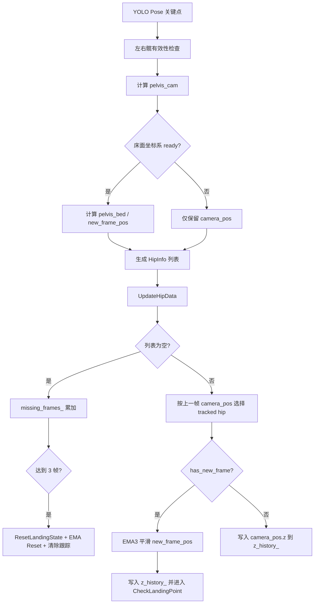
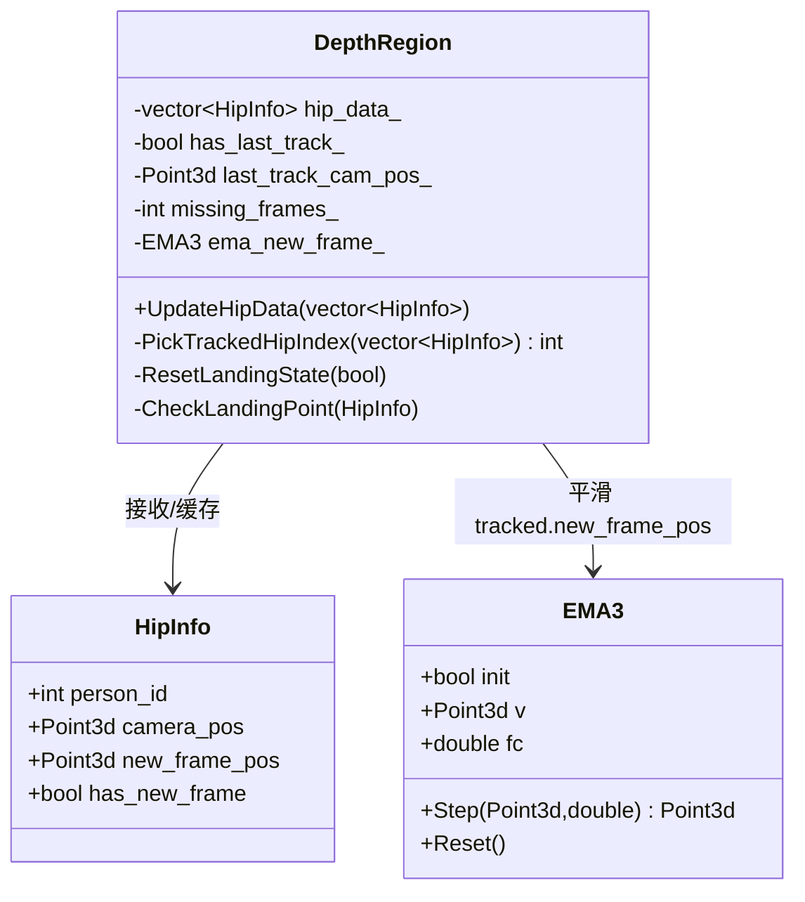
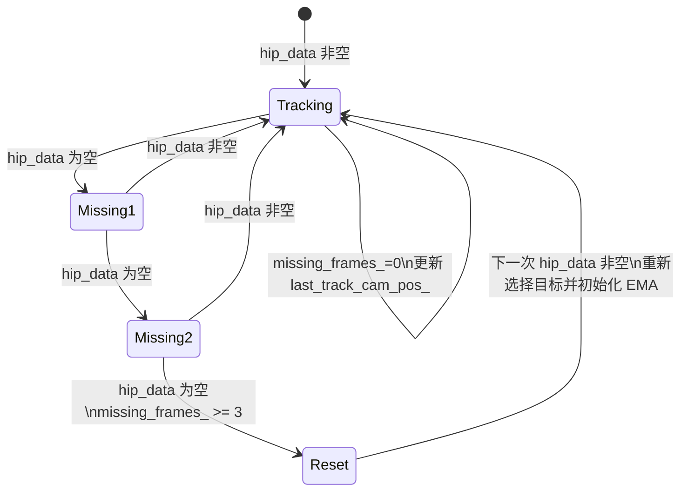

本页聚焦当前目录位置中的 **髋点轨迹跟踪、EMA 滤波与丢帧复位**：从主循环生成 `DepthRegion::HipInfo`，到 `DepthRegion::UpdateHipData()` 选择稳定目标、对床面新坐标系中的髋点做 EMA 平滑，再到连续丢失髋点时复位趋势状态与滤波器。这里不展开 3D 反投影、床面坐标系构建或落点确认细节；这些主题分别属于 [相机内参、深度采样与像素反投影](16-xiang-ji-nei-can-shen-du-cai-yang-yu-xiang-su-fan-tou-ying)、[床面坐标系构建、坐标变换与轴向约定](20-chuang-mian-zuo-biao-xi-gou-jian-zuo-biao-bian-huan-yu-zhou-xiang-yue-ding) 与 [落点检测状态机与加权确认算法](23-luo-dian-jian-ce-zhuang-tai-ji-yu-jia-quan-que-ren-suan-fa)。Sources: [get_pose_indemind_left.cpp](get_pose_indemind_left.cpp#L971-L1058), [app/depth_region.h](app/depth_region.h#L603-L675)

## 架构假设与验证结论

从第一性原理看，髋点轨迹在该代码中承担的是 **“人体检测结果到床面运动信号”** 的中间层：主循环先把左右髋关键点转成相机坐标 `pelvis_cam`，在床面坐标系就绪时再转成 `pelvis_bed`，并封装为 `DepthRegion::HipInfo`；随后 `DepthRegion::UpdateHipData()` 不直接信任多人检测列表的顺序，而是基于上一帧相机坐标选择距离最近的目标，减少多人或检测排序抖动造成的轨迹跳变。Sources: [get_pose_indemind_left.cpp](get_pose_indemind_left.cpp#L1030-L1058), [app/depth_region.h](app/depth_region.h#L580-L600)

验证后的核心结论是：**EMA 滤波只作用于被选中的 tracked hip 的新坐标系三维点，并直接服务于 Z 历史曲线与落点检测输入**；`hip_data_` 的显示缓存先被赋值为原始 `hip_data`，CSV 也写入主循环中的原始 `hip_data_list`，因此当前实现中的 EMA 平滑不会回写到主循环列表，也不会改变界面上 `hip_data_` 遍历显示的原始坐标文本。Sources: [app/depth_region.h](app/depth_region.h#L604-L605), [app/depth_region.h](app/depth_region.h#L646-L674), [app/depth_region.h](app/depth_region.h#L211-L240), [get_pose_indemind_left.cpp](get_pose_indemind_left.cpp#L1136-L1160)

上图中的关键分支与代码一致：空列表触发 `missing_frames_` 计数并在达到 `kMissingResetFrames` 后复位；非空列表先清零丢帧计数，再通过 `PickTrackedHipIndex()` 选择稳定目标；只有 `tracked.has_new_frame` 为真时才计算 `dt` 并调用 `ema_new_frame_.Step()`，之后使用平滑后的 `tracked.new_frame_pos.z` 更新曲线并调用 `CheckLandingPoint()`。Sources: [app/depth_region.h](app/depth_region.h#L625-L675), [app/depth_region.h](app/depth_region.h#L1287-L1298)

## HipInfo：轨迹数据的最小业务载体

`DepthRegion::HipInfo` 是该链路的最小数据结构，包含 `person_id`、相机坐标 `camera_pos`、新坐标系坐标 `new_frame_pos` 以及 `has_new_frame` 标志。它同时表达两个事实：髋点在相机三维空间中总是以 `camera_pos` 进入业务链路；只有床面坐标系可用时，`has_new_frame` 才为真，`new_frame_pos` 才承载后续可用于床面 Z 轴运动分析的数据。Sources: [app/depth_region.h](app/depth_region.h#L521-L527), [get_pose_indemind_left.cpp](get_pose_indemind_left.cpp#L1046-L1057)

| 字段 | 生成位置 | 含义 | 在本页链路中的作用 |
|---|---|---|---|
| `person_id` | 主循环按 pose 下标 `p + 1` 写入 | 检测列表中的人员编号 | 用于显示与 CSV 标识人员 |
| `camera_pos` | 左右髋三维点中点，或单侧有效髋点 | 相机坐标系中的骨盆/髋部代表点 | 用于稳定目标选择与记录 |
| `new_frame_pos` | `TransformToNewFrame(pelvis_cam)` | 床面新坐标系中的髋点 | EMA 与落点检测的输入 |
| `has_new_frame` | `bed_ready` | 床面坐标系是否可用 | 决定是否执行 EMA 与 `CheckLandingPoint()` |

Sources: [get_pose_indemind_left.cpp](get_pose_indemind_left.cpp#L1037-L1058), [app/depth_region.h](app/depth_region.h#L646-L674)

左右髋的计算规则是显式的：当左右髋都满足置信度与深度有效性条件时，`pelvis_cam` 取两者三维坐标平均值；当只有一侧有效时，直接使用该侧髋点作为 `pelvis_cam`。这使轨迹在单侧髋点短暂可见时仍能生成候选 `HipInfo`，但是否能进入床面坐标分析仍取决于 `bed_ready`。Sources: [get_pose_indemind_left.cpp](get_pose_indemind_left.cpp#L1030-L1048)

## 稳定目标选择：用上一帧相机坐标抵抗检测排序抖动

`UpdateHipData()` 接收的是一帧内所有检测到的髋点列表，但后续 EMA 与落点检测只处理一个 `tracked` 目标。选择策略封装在 `PickTrackedHipIndex()` 中：若还没有上一帧跟踪点，直接返回列表第一个目标；若已有上一帧 `last_track_cam_pos_`，则遍历当前所有 `HipInfo.camera_pos`，计算与上一帧相机坐标的三维欧氏距离平方，并选择距离最小的候选。Sources: [app/depth_region.h](app/depth_region.h#L580-L600)

该关系图显示了本页涉及的类内协作边界：`HipInfo` 是输入载体，`PickTrackedHipIndex()` 负责从多目标列表中选出单个稳定目标，`EMA3` 只对该目标的新坐标系位置执行平滑，`ResetLandingState()` 在连续丢失时清理趋势状态并可重置滤波器。Sources: [app/depth_region.h](app/depth_region.h#L521-L565), [app/depth_region.h](app/depth_region.h#L567-L600), [app/depth_region.h](app/depth_region.h#L603-L675)

选中目标后，代码立即把 `tracked.camera_pos` 写回 `last_track_cam_pos_` 并置 `has_last_track_ = true`，因此下一帧的选择会围绕这个相机坐标连续性展开。该策略的稳定性依据不是 `person_id`，而是三维空间距离；这与注释“avoid poses ordering jitter”一致。Sources: [app/depth_region.h](app/depth_region.h#L638-L645), [app/depth_region.h](app/depth_region.h#L1291-L1293)

## EMA3：按真实时间步长计算的三维低通滤波

`EMA3` 是一个三维点滤波器，内部保存初始化标志 `init`、当前滤波值 `v` 与截止频率 `fc = 6.0`。第一次输入时直接把 `v` 设为当前点并返回；后续输入若 `dt_sec <= 0`，使用 `1.0 / 50.0` 作为默认时间步长；平滑系数按 `a = 1.0 - exp(-2π * fc * dt_sec)` 计算，再用 `v = v + a * (x - v)` 更新。Sources: [app/depth_region.h](app/depth_region.h#L548-L565)

| 机制 | 代码行为 | 对轨迹的直接影响 |
|---|---|---|
| 首帧初始化 | `!init` 时 `v = x` | 避免从零点向真实点缓慢爬升 |
| 时间步保护 | `dt_sec <= 0` 时设为 `1/50` | 防止异常时间间隔导致系数不可用 |
| 指数平滑 | `v = v + a * (x - v)` | 将当前输入按系数并入历史状态 |
| 截止频率 | `fc = 6.0` | 固定滤波强度，未在此处暴露运行时配置 |
| Reset | `init = false; v = (0,0,0)` | 下一次有效输入重新作为滤波起点 |

Sources: [app/depth_region.h](app/depth_region.h#L548-L565)

`UpdateHipData()` 中的 `dt` 不是固定帧号差，而是用 `std::chrono::steady_clock::now()` 与 `last_filter_time_` 的时间差计算；首次进入滤波分支时只初始化 `last_filter_time_`，后续帧才用真实时间差更新 `dt`。这使 EMA 系数与实际处理间隔相关，而不是假设每帧恒定到达。Sources: [app/depth_region.h](app/depth_region.h#L646-L658)

## 滤波结果的消费边界

滤波后的 `tracked.new_frame_pos` 被用于两处本页相关消费：第一，若 `tracked.has_new_frame`，`z_history_` 记录平滑后的 `new_frame_pos.z`；第二，随后调用 `CheckLandingPoint(tracked)`，将平滑后的三维点送入后续极低点检测流程。若没有新坐标系数据，则仅把 `tracked.camera_pos.z` 写入 `z_history_`，并不会调用 `CheckLandingPoint()`。Sources: [app/depth_region.h](app/depth_region.h#L660-L674)

这里存在一个重要实现边界：`hip_data_ = hip_data` 发生在 `UpdateHipData()` 开头，而 EMA 修改的是局部变量 `tracked`；界面显示遍历的是 `hip_data_`，CSV 写入的是主循环中的 `hip_data_list`。因此，当前代码中“用于检测的平滑轨迹”和“用于显示/CSV 的原始髋点列表”是分离的。Sources: [app/depth_region.h](app/depth_region.h#L603-L605), [app/depth_region.h](app/depth_region.h#L642-L658), [app/depth_region.h](app/depth_region.h#L211-L240), [get_pose_indemind_left.cpp](get_pose_indemind_left.cpp#L1136-L1160)

| 输出/消费位置 | 使用的数据 | 是否经过 EMA | 代码依据 |
|---|---|---:|---|
| `z_history_` 曲线数据 | `tracked.new_frame_pos.z` 或 `tracked.camera_pos.z` | 新坐标系分支经过 EMA | `tracked.new_frame_pos = ema_new_frame_.Step(...)` 后 push |
| `CheckLandingPoint()` 输入 | 局部 `tracked` | 是，前提是 `has_new_frame` | EMA 后调用 `CheckLandingPoint(tracked)` |
| 区域窗口髋点文本 | `hip_data_` | 否 | `hip_data_ = hip_data` 后显示遍历 |
| CSV 记录 | `hip_data_list` | 否 | 主循环写原始列表 |

Sources: [app/depth_region.h](app/depth_region.h#L646-L674), [app/depth_region.h](app/depth_region.h#L211-L240), [get_pose_indemind_left.cpp](get_pose_indemind_left.cpp#L1136-L1160)

## 丢帧复位：连续 3 帧无髋点时切断旧趋势

`UpdateHipData()` 的丢帧逻辑以 `hip_data.empty()` 为判定入口。若当前帧没有任何髋点，`missing_frames_` 自增；当其达到 `kMissingResetFrames` 时，调用 `ResetLandingState(true)`，把 `missing_frames_` 钳制为阈值，并清除 `has_last_track_`，随后直接返回。常量定义显示 `kMissingResetFrames = 3`。Sources: [app/depth_region.h](app/depth_region.h#L625-L635), [app/depth_region.h](app/depth_region.h#L1287-L1290)

`ResetLandingState(true)` 会复位下降趋势、待确认极小值、待确认索引、极小值后帧数、帧缓冲区与上一帧 Z 值；当 `reset_filter` 为真时，还会调用 `ema_new_frame_.Reset()` 并把 `filter_time_initialized_` 置为 false。也就是说，连续丢失后不仅切断落点趋势状态，还会让下一次有效髋点重新初始化 EMA。Sources: [app/depth_region.h](app/depth_region.h#L567-L578)

该状态图反映代码中的两个恢复点：只要在达到 3 帧前重新检测到髋点，`missing_frames_` 会被清零并继续跟踪；一旦进入复位路径，旧的跟踪参考 `has_last_track_` 被清除，EMA 时间状态也在 `ResetLandingState(true)` 中失效，下一次输入会按新轨迹起点处理。Sources: [app/depth_region.h](app/depth_region.h#L625-L645), [app/depth_region.h](app/depth_region.h#L567-L578)

## 与落点检测的接口边界

本页只说明髋点轨迹如何进入落点检测入口：`CheckLandingPoint()` 读取 `hip.new_frame_pos.z` 作为当前 Z，并把 `hip.new_frame_pos.x/y/z` 与时间戳封装为 `FrameData` 放入 `frame_buffer_`。后续的极低点确认、加权平均与记录属于 [落点检测状态机与加权确认算法](23-luo-dian-jian-ce-zhuang-tai-ji-yu-jia-quan-que-ren-suan-fa)，本页不展开。Sources: [app/depth_region.h](app/depth_region.h#L687-L711)

可以确认的是，进入 `CheckLandingPoint()` 的前置条件由 `UpdateHipData()` 控制：只有被选中的 `tracked` 目标存在 `has_new_frame` 时，才会在 EMA 平滑后调用该函数。因此落点检测入口使用的是床面新坐标系中的髋点，而不是相机坐标系中的 `camera_pos`。Sources: [app/depth_region.h](app/depth_region.h#L646-L674), [app/depth_region.h](app/depth_region.h#L687-L697)

## 运行时可观察性：显示与记录看到的是什么

区域窗口显示“Hip Coordinates”时，会遍历 `hip_data_`，分别输出每个 `HipInfo` 的相机坐标；若 `hip.has_new_frame` 为真，还会输出新坐标系坐标。由于 `hip_data_` 在 `UpdateHipData()` 开头直接接收原始列表，且局部 `tracked` 的 EMA 修改没有回写到 `hip_data_`，该显示用于观察原始检测/转换结果，而不是滤波后的检测输入。Sources: [app/depth_region.h](app/depth_region.h#L211-L240), [app/depth_region.h](app/depth_region.h#L603-L605), [app/depth_region.h](app/depth_region.h#L642-L658)

CSV 记录逻辑同样遍历 `hip_data_list`，输出帧号、时间戳、人员编号、相机坐标，并在 `has_new_frame` 为真时输出新坐标系坐标；这段写入发生在调用 `depth_region.UpdateHipData(hip_data_list)` 之后，但写入对象仍是主循环中的 `hip_data_list`，而不是 `UpdateHipData()` 内部被 EMA 修改过的局部 `tracked`。Sources: [get_pose_indemind_left.cpp](get_pose_indemind_left.cpp#L1128-L1160)

## 参数与状态变量速查

下表列出本页链路中直接决定行为的状态与常量。它们共同定义了“选谁跟踪、如何平滑、何时复位”的最小机制集合。Sources: [app/depth_region.h](app/depth_region.h#L1258-L1302)

| 名称 | 默认/初始值 | 类型 | 作用 |
|---|---:|---|---|
| `max_history_size_` | `100` | `const size_t` | 限制 `z_history_` 最近帧数量 |
| `missing_frames_` | `0` | `int` | 连续无髋点帧计数 |
| `kMissingResetFrames` | `3` | `static constexpr int` | 达到后触发丢帧复位 |
| `has_last_track_` | `false` | `bool` | 是否已有上一帧跟踪参考 |
| `last_track_cam_pos_` | `(0,0,0)` | `cv::Point3d` | 稳定目标选择的距离参考 |
| `ema_new_frame_` | `EMA3` | 滤波器对象 | 平滑床面新坐标系髋点 |
| `filter_time_initialized_` | `false` | `bool` | EMA 时间步是否已初始化 |
| `last_filter_time_` | 未显式数值 | `steady_clock::time_point` | 计算相邻滤波调用间隔 |

Sources: [app/depth_region.h](app/depth_region.h#L1261-L1264), [app/depth_region.h](app/depth_region.h#L1287-L1298), [app/depth_region.h](app/depth_region.h#L548-L565)

## 面向开发者的维护要点

如果维护目标是调整轨迹稳定性，应优先定位 `EMA3::fc`、`kMissingResetFrames` 与 `PickTrackedHipIndex()` 的距离选择逻辑，因为这三处分别控制滤波响应速度、丢失容忍帧数与多人检测排序抖动下的目标连续性。当前代码中 `EMA3::fc` 是结构体内固定默认值，`kMissingResetFrames` 是类内 `static constexpr int`，二者未在本页涉及代码中暴露为运行时参数。Sources: [app/depth_region.h](app/depth_region.h#L548-L565), [app/depth_region.h](app/depth_region.h#L580-L600), [app/depth_region.h](app/depth_region.h#L1287-L1298)

如果维护目标是解释“为什么显示/CSV 与落点检测曲线不完全一致”，应从消费边界入手：显示与 CSV 读取原始 `hip_data_`/`hip_data_list`，而落点检测读取 EMA 后的局部 `tracked`。这个差异不是外部推断，而是由赋值顺序、局部变量修改与写入对象共同决定。Sources: [app/depth_region.h](app/depth_region.h#L603-L674), [app/depth_region.h](app/depth_region.h#L211-L240), [get_pose_indemind_left.cpp](get_pose_indemind_left.cpp#L1136-L1160)

## 建议的后续阅读

若需要追溯 `HipInfo.camera_pos` 的三维来源，请阅读 [相机内参、深度采样与像素反投影](16-xiang-ji-nei-can-shen-du-cai-yang-yu-xiang-su-fan-tou-ying)；若需要理解 `new_frame_pos` 的坐标轴意义，请阅读 [床面坐标系构建、坐标变换与轴向约定](20-chuang-mian-zuo-biao-xi-gou-jian-zuo-biao-bian-huan-yu-zhou-xiang-yue-ding)；若需要继续分析 `CheckLandingPoint()` 之后的确认与记录策略，请进入 [落点检测状态机与加权确认算法](23-luo-dian-jian-ce-zhuang-tai-ji-yu-jia-quan-que-ren-suan-fa)。Sources: [get_pose_indemind_left.cpp](get_pose_indemind_left.cpp#L971-L1058), [app/depth_region.h](app/depth_region.h#L687-L735)