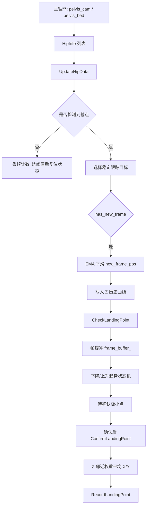
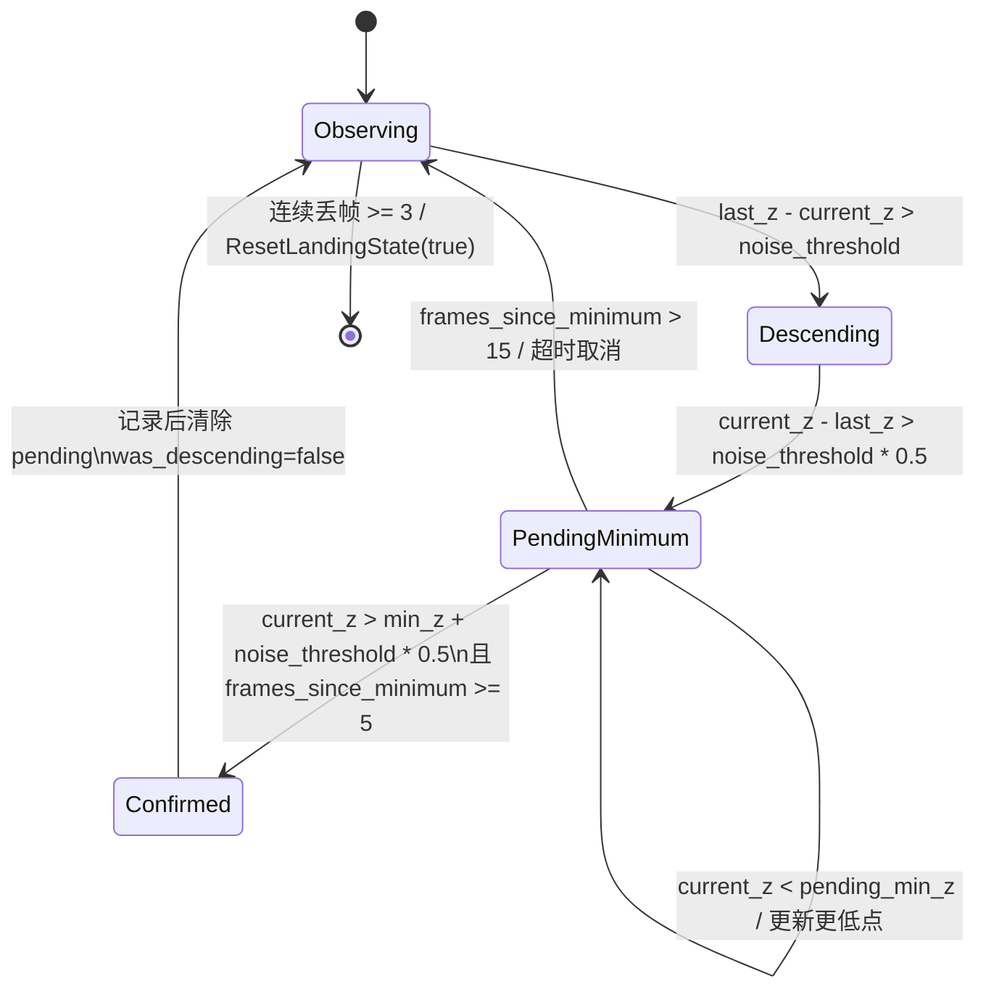
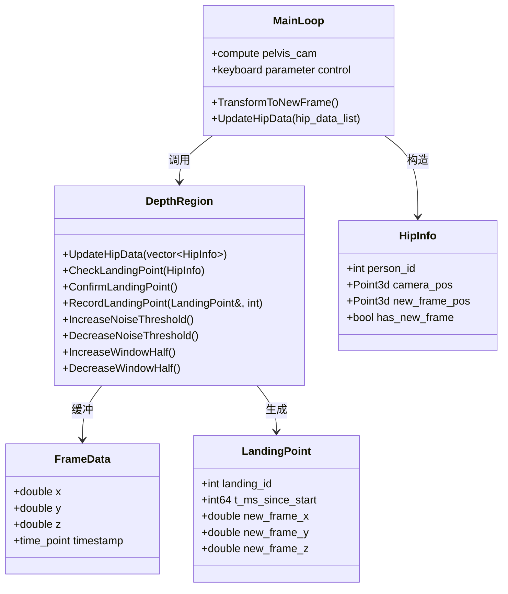

本页解释**落点检测**在当前工程中的核心机制：主循环将人体髋点从相机坐标转换到蹦床新坐标系后，交给 `DepthRegion::UpdateHipData()`；`DepthRegion` 选择稳定跟踪目标、对新坐标系 3D 髋点做 EMA 平滑、维护 Z 轴运动趋势，并在“下降→上升”的局部极小点附近执行延迟确认与 Z 加权平均，最终生成落点记录。这里仅覆盖状态机、确认逻辑、加权坐标与运行时参数，不展开 ROI 标定、平面拟合、3D 反投影或 CSV 会话管理细节；相关背景可继续阅读 [髋点轨迹跟踪、EMA 滤波与丢帧复位](22-kuan-dian-gui-ji-gen-zong-ema-lu-bo-yu-diu-zheng-fu-wei) 与 [录制会话、CSV 导出与运行时全局状态](24-lu-zhi-hui-hua-csv-dao-chu-yun-xing-shi-quan-ju-zhuang-tai)。Sources: [get_pose_indemind_left.cpp](get_pose_indemind_left.cpp#L1038-L1057), [get_pose_indemind_left.cpp](get_pose_indemind_left.cpp#L1128-L1134), [app/depth_region.h](app/depth_region.h#L603-L674)

## 1. 架构定位：落点检测是髋点 Z 轨迹上的事件识别器

从第一性原理看，落点检测并不直接依赖整个人体骨架的动作语义，而是把**蹦床坐标系下髋点 Z 值的局部极小点**作为落点事件候选；主循环先由左右髋关键点计算 `pelvis_cam`，在蹦床坐标系就绪时得到 `pelvis_bed`，再封装为 `DepthRegion::HipInfo`，其中 `camera_pos` 用于稳定目标选择，`new_frame_pos` 用于落点检测。Sources: [get_pose_indemind_left.cpp](get_pose_indemind_left.cpp#L1038-L1057), [app/depth_region.h](app/depth_region.h#L521-L527)

下面的图展示了本页关注的局部链路：检测输入来自髋点 3D 位置，输出是 `LandingPoint`，中间核心是目标选择、EMA、趋势状态机、延迟确认和加权平均。Sources: [app/depth_region.h](app/depth_region.h#L540-L546), [app/depth_region.h](app/depth_region.h#L567-L578), [app/depth_region.h](app/depth_region.h#L687-L852)



`LandingPoint` 的数据结构只保存落点编号、时间、程序启动后的毫秒时间戳，以及新坐标系中的 `x/y/z`；其中 `z` 是确认窗口内的极低点值，而 `x/y` 是按 Z 接近极低点程度加权得到的横向位置。Sources: [app/depth_region.h](app/depth_region.h#L529-L538), [app/depth_region.h](app/depth_region.h#L840-L848)

## 2. 输入前处理：稳定目标选择、EMA 与丢帧复位

`UpdateHipData()` 的第一层防线是**丢帧复位**：当 `hip_data` 为空时累加 `missing_frames_`，连续达到 `kMissingResetFrames = 3` 后调用 `ResetLandingState(true)`，清空下降趋势、待确认极小点、帧缓冲和滤波器状态，同时取消上一跟踪目标，避免旧趋势在目标丢失后继续触发落点。Sources: [app/depth_region.h](app/depth_region.h#L567-L578), [app/depth_region.h](app/depth_region.h#L625-L635), [app/depth_region.h](app/depth_region.h#L1287-L1298)

多人或检测顺序抖动时，`PickTrackedHipIndex()` 会优先选择与上一帧 `last_track_cam_pos_` 欧氏距离平方最小的髋点；如果还没有历史目标，则使用列表中的第一个目标。这个选择只基于相机坐标 `camera_pos`，用于降低姿态检测结果排序变化对落点状态机的冲击。Sources: [app/depth_region.h](app/depth_region.h#L580-L600), [app/depth_region.h](app/depth_region.h#L638-L645)

当被跟踪目标带有新坐标系位置时，系统用 `EMA3::Step()` 对 `new_frame_pos` 做一阶指数平滑；滤波系数由截止频率 `fc = 6.0 Hz` 与帧间隔 `dt_sec` 计算为 `a = 1 - exp(-2πfc dt)`，随后按 `v = v + a * (x - v)` 更新。平滑后的 `new_frame_pos.z` 被写入显示曲线，并进入落点检测。Sources: [app/depth_region.h](app/depth_region.h#L548-L565), [app/depth_region.h](app/depth_region.h#L646-L674)

| 环节 | 使用的数据 | 作用 | 触发条件 |
|---|---:|---|---|
| 丢帧复位 | `hip_data.empty()` | 清空趋势、待确认极小点、缓冲与滤波状态 | 连续空帧达到 `3` |
| 稳定目标选择 | `camera_pos` | 避免多人顺序抖动导致目标跳变 | 每次 `UpdateHipData()` 有髋点 |
| EMA 平滑 | `new_frame_pos` | 降低新坐标系 3D 髋点抖动 | `tracked.has_new_frame == true` |
| 落点检测 | 平滑后的 `new_frame_pos.z` | 识别局部极低点 | 新坐标系可用 |

Sources: [app/depth_region.h](app/depth_region.h#L625-L674), [app/depth_region.h](app/depth_region.h#L1287-L1298)

## 3. 隐式状态机：从下降趋势到待确认极小点

落点状态机没有定义显式枚举，而是由 `was_descending_`、`has_pending_minimum_`、`pending_min_index_`、`frames_since_minimum_` 与 `last_new_z_` 共同表达。初始化或复位时，系统关闭下降状态和待确认状态，清空帧缓冲，将 `pending_min_index_` 设为 `-1`，并把 `last_new_z_` 归零。Sources: [app/depth_region.h](app/depth_region.h#L567-L578), [app/depth_region.h](app/depth_region.h#L1265-L1280)

每一帧进入 `CheckLandingPoint()` 后，当前 `x/y/z` 与时间戳被封装为 `FrameData` 追加到 `frame_buffer_`；缓冲区上限为 `BUFFER_SIZE = 15`，溢出时从前端弹出，并同步修正或取消待确认极小点索引，保证状态索引始终对应当前缓冲区。Sources: [app/depth_region.h](app/depth_region.h#L540-L546), [app/depth_region.h](app/depth_region.h#L687-L711), [app/depth_region.h](app/depth_region.h#L1274-L1277)

状态机的“下降”判定使用可调阈值 `noise_threshold_`：当 `last_new_z_ - current_z > noise_threshold_` 时，`was_descending_` 被置为真；当此前处于下降并且当前帧相对上一帧上升超过 `noise_threshold * 0.5` 时，上一帧被标记为候选极小点并进入待确认状态。Sources: [app/depth_region.h](app/depth_region.h#L719-L720), [app/depth_region.h](app/depth_region.h#L747-L764), [app/depth_region.h](app/depth_region.h#L1300-L1302)



待确认状态的设计是**延迟确认**：系统不会在 Z 刚刚反弹时立即记录落点，而是要求当前 Z 持续高于候选极小点 `min_z + noise_threshold * 0.5`，并且候选极小点之后至少经过 `CONFIRM_FRAMES = 5` 帧，才调用 `ConfirmLandingPoint()`；如果等待期间出现更低的 Z，则候选索引更新到当前帧并重新计数。Sources: [app/depth_region.h](app/depth_region.h#L722-L746), [app/depth_region.h](app/depth_region.h#L1274-L1280)

## 4. 加权确认算法：用 Z 接近程度估计落点 X/Y

`ConfirmLandingPoint()` 首先校验 `pending_min_index_` 是否仍在缓冲区范围内，然后在候选索引前后各 3 帧内重新搜索实际最小 Z，避免候选帧受噪声或索引偏移影响；最终使用 `actual_min_idx` 与 `min_z` 作为确认窗口中心。Sources: [app/depth_region.h](app/depth_region.h#L774-L792)

加权平均窗口由运行时参数 `window_half_` 控制，默认值为 `3`，窗口范围被裁剪到缓冲区有效边界；也就是说默认最多使用极低点前后各 3 帧、共 7 帧参与横向位置估计。Sources: [app/depth_region.h](app/depth_region.h#L794-L797), [app/depth_region.h](app/depth_region.h#L1300-L1302)

权重公式是 `w_i = 1 / (|Z_i - Z_min| + epsilon)`，其中 `epsilon = 1.0` 用于避免除零；Z 越接近极低点，帧的 `x/y` 对最终落点横向坐标贡献越大。最终 `final_x = Σ(w_i x_i) / Σw_i`，`final_y = Σ(w_i y_i) / Σw_i`，而 `final_z` 直接取确认到的 `min_z`。Sources: [app/depth_region.h](app/depth_region.h#L769-L772), [app/depth_region.h](app/depth_region.h#L798-L815), [app/depth_region.h](app/depth_region.h#L840-L848)

```mermaid
flowchart LR
    A[候选 pending_min_index_] --> B[±3 帧搜索实际 min_z]
    B --> C[以 actual_min_idx 为中心裁剪加权窗口]
    C --> D[计算 z_diff = abs(z_i - min_z)]
    D --> E[weight = 1 / (z_diff + 1.0)]
    E --> F[weighted_x / weight_sum]
    E --> G[weighted_y / weight_sum]
    F --> H[LandingPoint.x]
    G --> I[LandingPoint.y]
    B --> J[LandingPoint.z = min_z]
```

这种加权方式的工程含义是：**时间上接近极低点并不足够，Z 值更接近极低点的帧才更可信**；因此它比单帧取值更能抵抗横向关键点抖动，也比普通平均更强调落点瞬间附近的有效观测。该结论直接来自实现中的权重定义和 `weighted_x/weighted_y` 累积方式。Sources: [app/depth_region.h](app/depth_region.h#L798-L815)

## 5. 防抖与记录门控：检测可以发生，入库由 REC 决定

确认到落点后，系统还会执行最小时间间隔防抖：如果已有上一落点时间，且当前极低点时间戳与上一落点时间差小于 `kMinLandingIntervalMs = 600` 毫秒，则更新时间戳并直接返回，不创建 `LandingPoint` 记录。Sources: [app/depth_region.h](app/depth_region.h#L826-L838), [app/depth_region.h](app/depth_region.h#L1282-L1285)

`RecordLandingPoint()` 将“检测到落点”和“是否入库”解耦：当全局 `g_runtime_flags.record_enabled` 为真时，才递增 `landing_count_`、分配 `landing_id` 并写入 `landing_points_`；否则只向控制台输出“检测到落点（未入库 - REC OFF）”。Sources: [app/depth_region.h](app/depth_region.h#L854-L880), [app/runtime_state.h](app/runtime_state.h#L7-L10)

主程序通过键盘 `r/R` 切换 `record_enabled`，从 OFF 切到 ON 时创建新会话并调用 `ClearLandingPoints()` 清空此前落点；`c/C` 可手动清空落点缓存，`s/S` 在会话激活时刷新落点到 CSV。这里只需注意：这些操作控制落点记录生命周期，不改变局部极小点识别算法本身。Sources: [get_pose_indemind_left.cpp](get_pose_indemind_left.cpp#L1560-L1599), [get_pose_indemind_left.cpp](get_pose_indemind_left.cpp#L1600-L1617), [app/depth_region.h](app/depth_region.h#L920-L964)

| 阶段 | 条件 | 结果 | 是否写入 `landing_points_` |
|---|---|---|---|
| 检测确认 | 趋势确认 + 加权完成 + 防抖通过 | 构造 `LandingPoint` | 未决定 |
| REC ON | `g_runtime_flags.record_enabled == true` | 分配 ID、入库、控制台输出已入库 | 是 |
| REC OFF | `g_runtime_flags.record_enabled == false` | 控制台输出未入库 | 否 |
| 防抖拒绝 | 与上一落点间隔 `< 600ms` | 返回，不构造记录 | 否 |

Sources: [app/depth_region.h](app/depth_region.h#L826-L880), [app/runtime_state.h](app/runtime_state.h#L7-L10)

## 6. 参数面：运行时可调的阈值与窗口半径

落点检测暴露两个运行时可调参数：`noise_threshold_` 控制 Z 变化需要多大才被视为有效下降或反弹，默认 `300.0 mm`；`window_half_` 控制确认后参与加权平均的窗口半径，默认 `3` 帧。Sources: [app/depth_region.h](app/depth_region.h#L719-L720), [app/depth_region.h](app/depth_region.h#L794-L797), [app/depth_region.h](app/depth_region.h#L1300-L1302)

键盘 `+/-` 调整 Z 阈值，范围被限制在 `10.0` 到 `2000.0` 毫米；键盘 `[/]` 调整窗口半径，范围被限制在 `1` 到 `7` 帧；键盘 `p/P` 打印当前参数。Sources: [app/depth_region.h](app/depth_region.h#L888-L918), [get_pose_indemind_left.cpp](get_pose_indemind_left.cpp#L809-L824), [get_pose_indemind_left.cpp](get_pose_indemind_left.cpp#L1581-L1595)

| 参数 | 默认值 | 调整键 | 下限 | 上限 | 影响 |
|---|---:|---|---:|---:|---|
| `noise_threshold_` | `300.0 mm` | `+ / -` | `10.0 mm` | `2000.0 mm` | 趋势识别、候选极小点触发、确认反弹幅度 |
| `window_half_` | `3 帧` | `[ / ]` | `1 帧` | `7 帧` | 加权平均窗口大小，实际窗口会被缓冲边界裁剪 |
| `BUFFER_SIZE` | `15 帧` | 不可通过键盘调 | 固定 | 固定 | 保存近期帧，并限定待确认超时 |
| `CONFIRM_FRAMES` | `5 帧` | 不可通过键盘调 | 固定 | 固定 | 极小点确认所需上升帧数 |
| `kMinLandingIntervalMs` | `600 ms` | 不可通过键盘调 | 固定 | 固定 | 落点防抖最小间隔 |

Sources: [app/depth_region.h](app/depth_region.h#L1274-L1285), [app/depth_region.h](app/depth_region.h#L888-L918), [app/depth_region.h](app/depth_region.h#L1300-L1302)

## 7. 模块交互：`get_pose_indemind_left.cpp` 驱动，`DepthRegion` 持有状态

在交互边界上，主循环只负责生成 `hip_data_list` 并调用 `depth_region.UpdateHipData()`，同时把落点检测耗时计入性能统计；状态机变量、帧缓冲、参数、落点列表与记录逻辑全部封装在 `DepthRegion` 内。Sources: [get_pose_indemind_left.cpp](get_pose_indemind_left.cpp#L1050-L1057), [get_pose_indemind_left.cpp](get_pose_indemind_left.cpp#L1128-L1134), [app/depth_region.h](app/depth_region.h#L1265-L1302)



显示层只读取已入库的 `landing_points_`：区域窗口显示最近 5 个落点和总数，主 YOLO 窗口面板显示落点数量与最后一个落点坐标；这意味着 UI 看到的是记录集合，而不是所有 REC OFF 时检测到但未入库的候选事件。Sources: [app/depth_region.h](app/depth_region.h#L243-L279), [get_pose_indemind_left.cpp](get_pose_indemind_left.cpp#L1315-L1330)

## 8. 实现要点与阅读路径

理解这段算法时，应把它视为一个**带噪声门限的局部极小点事件检测器**：EMA 先减少输入抖动，趋势状态机只在显著下降后接受显著反弹，延迟确认要求反弹持续若干帧，加权平均则把横向落点估计集中到 Z 最接近极低点的帧。Sources: [app/depth_region.h](app/depth_region.h#L646-L674), [app/depth_region.h](app/depth_region.h#L719-L767), [app/depth_region.h](app/depth_region.h#L769-L852)

如果需要向前追踪输入质量，应阅读 [髋点轨迹跟踪、EMA 滤波与丢帧复位](22-kuan-dian-gui-ji-gen-zong-ema-lu-bo-yu-diu-zheng-fu-wei)；如果需要向后理解落点数据如何进入文件和会话目录，应阅读 [录制会话、CSV 导出与运行时全局状态](24-lu-zhi-hui-hua-csv-dao-chu-yun-xing-shi-quan-ju-zhuang-tai)；如果要调试性能与实时性边界，应继续阅读 [性能统计、队列限流与实时性优化](25-xing-neng-tong-ji-dui-lie-xian-liu-yu-shi-shi-xing-you-hua)。Sources: [get_pose_indemind_left.cpp](get_pose_indemind_left.cpp#L1128-L1134), [app/depth_region.h](app/depth_region.h#L933-L964), [app/perf_stats.cpp](app/perf_stats.cpp#L20-L21)