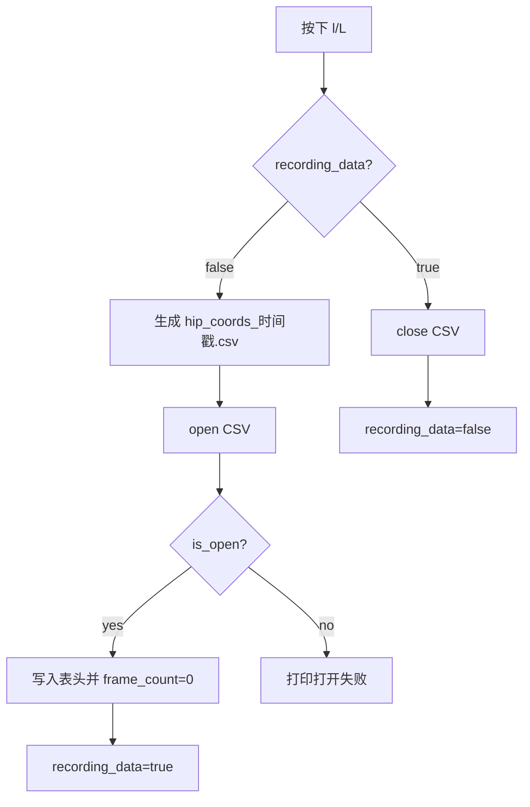
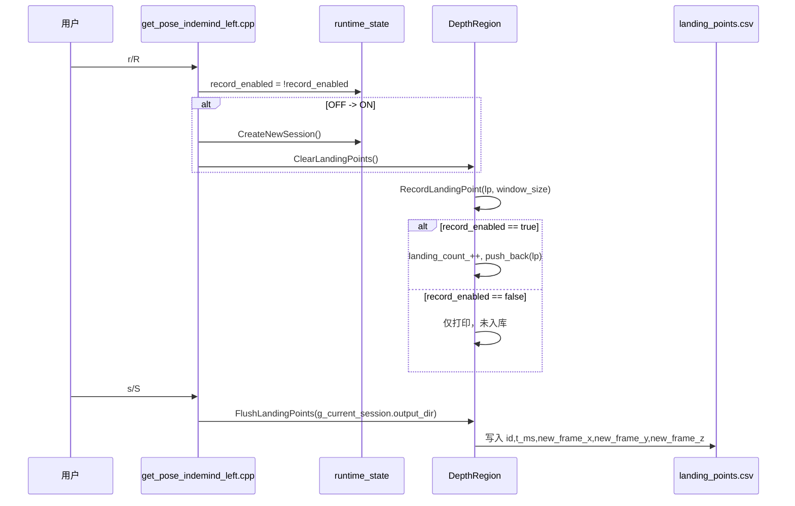
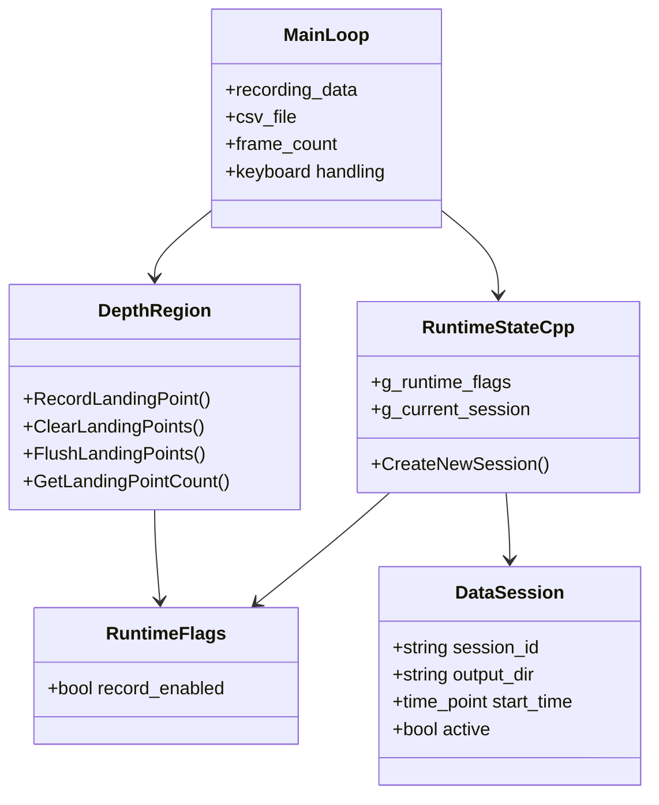

本页解释当前工程中**两条彼此独立的录制路径**：其一是主循环内由 `l` 键控制的髋点坐标 CSV 流式写入；其二是由全局运行时状态 `g_runtime_flags` 与 `g_current_session` 协调的落点入库、会话目录创建和 `landing_points.csv` 导出。阅读边界限定在录制开关、会话状态、CSV 字段、保存触发和界面状态显示；落点检测算法本身请转到 [落点检测状态机与加权确认算法](23-luo-dian-jian-ce-zhuang-tai-ji-yu-jia-quan-que-ren-suan-fa)，床面坐标含义请转到 [床面坐标系构建、坐标变换与轴向约定](20-chuang-mian-zuo-biao-xi-gou-jian-zuo-biao-bian-huan-yu-zhou-xiang-yue-ding)。Sources: [get_pose_indemind_left.cpp](get_pose_indemind_left.cpp#L809-L824), [app/runtime_state.h](app/runtime_state.h#L7-L24), [app/depth_region.h](app/depth_region.h#L933-L964)

## 架构假设与代码验证结论

从第一原则看，“录制”在该程序中不是单一概念，而是**两种数据产品的生命周期管理**：髋点坐标记录直接在主循环持有 `std::ofstream csv_file` 并逐帧追加；落点记录则先进入 `DepthRegion` 的内存缓存，再由会话目录统一导出。这个假设由三处实现共同验证：主程序声明 `recording_data/csv_file/frame_count`，键盘帮助区同时暴露 `l`、`r`、`s` 三类操作，`DepthRegion::FlushLandingPoints()` 将缓存写成 `landing_points.csv`。Sources: [get_pose_indemind_left.cpp](get_pose_indemind_left.cpp#L756-L759), [get_pose_indemind_left.cpp](get_pose_indemind_left.cpp#L809-L824), [app/depth_region.h](app/depth_region.h#L933-L964)

```mermaid
flowchart LR
  User[键盘输入] --> L[l: 髋点CSV录制开关]
  User --> R[r: 落点REC开关]
  User --> S[s: 保存落点CSV]

  L --> HipFile[hip_coords_YYYYMMDD_HHMMSS.csv]
  R --> RuntimeFlags[g_runtime_flags.record_enabled]
  R --> Session[g_current_session / runs/YYYYMMDD_HHMMSS]
  RuntimeFlags --> DepthRegion[DepthRegion::RecordLandingPoint]
  DepthRegion --> Cache[landing_points_内存缓存]
  S --> Flush[FlushLandingPoints(output_dir)]
  Flush --> LandingFile[runs/.../landing_points.csv]
```

上图中的关键分界是：`l` 键不依赖 `RuntimeFlags` 或 `DataSession`，它只控制主循环本地变量 `recording_data` 和本地文件句柄；`r` 键才会翻转全局 `g_runtime_flags.record_enabled`，在从 OFF 变为 ON 时创建新会话并清空旧落点缓存；`s` 键只在 `g_current_session.active` 为真时调用落点 CSV 导出。Sources: [get_pose_indemind_left.cpp](get_pose_indemind_left.cpp#L1545-L1571), [get_pose_indemind_left.cpp](get_pose_indemind_left.cpp#L1596-L1617)

## 运行时全局状态模型

运行时全局状态定义在 `app/runtime_state.h`，由两个结构组成：`RuntimeFlags` 目前只包含 `record_enabled`，默认值为 `false`；`DataSession` 保存 `session_id`、`output_dir`、`start_time` 和 `active`，用于描述一次落点录制会话。两个全局实例以 `extern` 形式暴露，实际定义位于 `app/runtime_state.cpp`，因此主程序和 `DepthRegion` 可以共享同一个录制开关与当前会话。Sources: [app/runtime_state.h](app/runtime_state.h#L7-L24), [app/runtime_state.cpp](app/runtime_state.cpp#L10-L11), [app/depth_region.h](app/depth_region.h#L1-L6)

| 状态对象 | 字段 | 默认/赋值方式 | 代码用途 |
|---|---|---|---|
| `RuntimeFlags` | `record_enabled` | 默认 `false` | 控制落点是否真正进入 `landing_points_` 缓存 |
| `DataSession` | `session_id` | `CreateNewSession()` 用本地时间格式化为 `%Y%m%d_%H%M%S` | 作为会话标识 |
| `DataSession` | `output_dir` | `"runs/" + session_id` | 作为 `landing_points.csv` 的输出目录 |
| `DataSession` | `active` | 会话创建成功置为 `true`，目录创建失败置为 `false` | `s` 键保存前的前置条件 |

Sources: [app/runtime_state.h](app/runtime_state.h#L7-L24), [app/runtime_state.cpp](app/runtime_state.cpp#L13-L38), [get_pose_indemind_left.cpp](get_pose_indemind_left.cpp#L1611-L1617)

`CreateNewSession()` 的行为是同步且直接的：读取当前系统时间，生成会话 ID，填充全局 `g_current_session`，然后通过 `system("mkdir -p " + output_dir)` 创建目录；命令返回 0 时打印新会话路径并返回 `true`，失败时打印错误、将 `active` 置回 `false` 并返回 `false`。Sources: [app/runtime_state.cpp](app/runtime_state.cpp#L13-L38)

## 两条录制路径的职责边界

髋点 CSV 录制面向**逐帧姿态/髋点轨迹调试**：主循环在检测到 `recording_data && !hip_data_list.empty()` 时写入当前帧号、相对程序启动的毫秒时间戳、人员 ID、相机坐标，以及在可用时写入新坐标系坐标。该路径的文件名位于工程运行目录根部，格式为 `hip_coords_YYYYMMDD_HHMMSS.csv`。Sources: [get_pose_indemind_left.cpp](get_pose_indemind_left.cpp#L1136-L1163), [get_pose_indemind_left.cpp](get_pose_indemind_left.cpp#L1545-L1564)

落点 CSV 录制面向**确认后的业务事件归档**：落点由 `DepthRegion::RecordLandingPoint()` 决定是否入库，只有当 `g_runtime_flags.record_enabled` 为真时才递增 `landing_count_`、分配 `landing_id` 并写入 `landing_points_`；当 REC 关闭时，检测结果仍会打印到控制台，但不会进入缓存。Sources: [app/depth_region.h](app/depth_region.h#L840-L881)

| 维度 | 髋点坐标 CSV | 落点 CSV |
|---|---|---|
| 启停按键 | `l` / `L` | `r` / `R` 控制入库，`s` / `S` 保存 |
| 状态变量 | `recording_data`、`csv_file`、`frame_count` | `g_runtime_flags.record_enabled`、`g_current_session`、`landing_points_` |
| 文件位置 | 当前运行目录 | `runs/YYYYMMDD_HHMMSS/landing_points.csv` |
| 写入时机 | 主循环逐帧追加 | 先缓存，按 `s` 导出 |
| 数据粒度 | 每帧、每个髋点目标 | 已确认的落点事件 |

Sources: [get_pose_indemind_left.cpp](get_pose_indemind_left.cpp#L756-L759), [get_pose_indemind_left.cpp](get_pose_indemind_left.cpp#L1136-L1163), [get_pose_indemind_left.cpp](get_pose_indemind_left.cpp#L1545-L1617), [app/depth_region.h](app/depth_region.h#L858-L964)

## 髋点坐标 CSV：启动、字段与写入策略

按下 `l` 键且当前未录制时，程序用系统时间生成 `hip_coords_YYYYMMDD_HHMMSS.csv`，打开文件成功后立即写入表头 `frame,timestamp_ms,person_id,cam_x,cam_y,cam_z,new_x,new_y,new_z`，随后将 `recording_data` 置为 `true` 并把 `frame_count` 归零；再次按下 `l` 键时关闭文件、置 `recording_data=false`，并打印累计帧数。Sources: [get_pose_indemind_left.cpp](get_pose_indemind_left.cpp#L1545-L1571)



髋点数据的逐帧写入发生在 `DepthRegion::UpdateHipData()` 之后：程序计算 `current_time - loop_start` 得到毫秒时间戳，对 `hip_data_list` 中每个目标写入一行；若 `hip.has_new_frame` 为真，则追加 `new_frame_pos.x/y/z`，否则为新坐标系三列写入空字段 `,,,`。写完当前批次后，`frame_count` 递增一次。Sources: [get_pose_indemind_left.cpp](get_pose_indemind_left.cpp#L1128-L1163), [get_pose_indemind_left.cpp](get_pose_indemind_left.cpp#L838-L842)

| 字段 | 来源 | 说明 |
|---|---|---|
| `frame` | `frame_count` | 髋点 CSV 内部帧序号 |
| `timestamp_ms` | `current_time - loop_start` | 相对程序主循环启动的毫秒时间 |
| `person_id` | `hip.person_id` | 髋点所属目标编号 |
| `cam_x/cam_y/cam_z` | `hip.camera_pos` | 相机坐标系下的髋点位置 |
| `new_x/new_y/new_z` | `hip.new_frame_pos` | 新坐标系下的髋点位置；不可用时为空 |

Sources: [get_pose_indemind_left.cpp](get_pose_indemind_left.cpp#L1136-L1163), [app/depth_region.h](app/depth_region.h#L521-L527)

界面上，髋点 CSV 的录制状态使用独立的 `[REC]` 文本提示：当 `recording_data` 为真时，程序在显示图像右上区域绘制红色 `[REC]`。这个提示只反映 `l` 键控制的逐帧髋点 CSV 录制，不等同于落点 REC。Sources: [get_pose_indemind_left.cpp](get_pose_indemind_left.cpp#L965-L969), [get_pose_indemind_left.cpp](get_pose_indemind_left.cpp#L1545-L1571)

## 落点会话：REC、缓存与 CSV 导出

按下 `r` 键时，程序翻转 `g_runtime_flags.record_enabled`；若本次是从 OFF 切到 ON，则调用 `CreateNewSession()` 创建 `runs/<session_id>` 目录，并调用 `depth_region.ClearLandingPoints()` 清除旧缓存。随后控制台打印当前 REC 状态。Sources: [get_pose_indemind_left.cpp](get_pose_indemind_left.cpp#L1596-L1607), [app/runtime_state.cpp](app/runtime_state.cpp#L13-L38)



`ClearLandingPoints()` 不只是清空向量，它还会将 `landing_count_` 归零并调用 `ResetLandingState(true)`，随后打印“已清空所有落点数据”。因此一次新的 REC 会话从空缓存和重新编号开始。Sources: [app/depth_region.h](app/depth_region.h#L920-L926), [get_pose_indemind_left.cpp](get_pose_indemind_left.cpp#L1601-L1605)

`RecordLandingPoint()` 接收已经构造好的 `LandingPoint`，再根据全局 `record_enabled` 决定是否存储。入库路径会递增计数、设置 `landing_id`、压入 `landing_points_` 并打印“已入库”；非入库路径只打印“检测到落点（未入库 - REC OFF）”。两条路径都会输出时间、新坐标系 X/Y/Z、采样窗口和当前已入库数量。Sources: [app/depth_region.h](app/depth_region.h#L840-L881)

按下 `s` 键时，主程序首先检查 `g_current_session.active`；若会话有效，则调用 `depth_region.FlushLandingPoints(g_current_session.output_dir)`，否则提示“请先按 R 开始录制会话”。`FlushLandingPoints()` 在缓存为空时返回 `false` 并提示无数据；在文件打开失败时返回 `false`；成功时写入表头和所有缓存行，关闭文件并打印保存数量与路径。Sources: [get_pose_indemind_left.cpp](get_pose_indemind_left.cpp#L1611-L1617), [app/depth_region.h](app/depth_region.h#L933-L964)

| 字段 | 来源 | 说明 |
|---|---|---|
| `id` | `lp.landing_id` | REC 开启后入库时分配的落点编号 |
| `t_ms` | `lp.t_ms_since_start` | 精确毫秒时间戳 |
| `new_frame_x` | `lp.new_frame_x` | 新坐标系 X |
| `new_frame_y` | `lp.new_frame_y` | 新坐标系 Y |
| `new_frame_z` | `lp.new_frame_z` | 新坐标系 Z，即记录的极低点值 |

Sources: [app/depth_region.h](app/depth_region.h#L529-L538), [app/depth_region.h](app/depth_region.h#L947-L958)

## 界面与控制台反馈

主程序的帮助区明确区分两组控制：`l` 是 “Toggle hip coords recording”，用于髋点坐标记录；`r` 是 “Toggle REC”，用于落点入库开关；`c` 清除落点缓存；`s` 将落点保存到 CSV。这种命令设计使逐帧轨迹记录和事件级落点记录可以分开使用。Sources: [get_pose_indemind_left.cpp](get_pose_indemind_left.cpp#L809-L824)

落点 REC 的可视化状态位于显示面板：程序根据 `g_runtime_flags.record_enabled` 绘制 `REC: ON` 或 `REC: OFF`，ON 使用红色，OFF 使用灰色；下一行显示 `LP: <count>`，其中数量来自 `depth_region.GetLandingPointCount()`。如果已有落点，面板还显示最后一个落点的新坐标系三元组。Sources: [get_pose_indemind_left.cpp](get_pose_indemind_left.cpp#L1302-L1318), [get_pose_indemind_left.cpp](get_pose_indemind_left.cpp#L1320-L1329)

控制台反馈覆盖关键状态转换：创建会话成功时打印 `[Session] 新会话已创建`，创建失败时打印错误；落点保存成功时打印保存数量和文件路径；髋点 CSV 开始/停止时分别打印文件名和累计帧数。Sources: [app/runtime_state.cpp](app/runtime_state.cpp#L30-L36), [app/depth_region.h](app/depth_region.h#L960-L963), [get_pose_indemind_left.cpp](get_pose_indemind_left.cpp#L1554-L1570)

## 编译集成与模块依赖

`runtime_state.cpp` 被纳入 `APP_SOURCES`，因此全局运行时状态会随应用目标一起编译链接；主程序通过 `#include "app/runtime_state.h"` 访问全局状态与 `CreateNewSession()`，`DepthRegion` 也通过包含 `runtime_state.h` 读取 `g_runtime_flags.record_enabled`。Sources: [CMakeLists.txt](CMakeLists.txt#L181-L187), [get_pose_indemind_left.cpp](get_pose_indemind_left.cpp#L16-L20), [app/depth_region.h](app/depth_region.h#L1-L6)



这个依赖形态体现了当前代码的实际边界：髋点 CSV 是主循环局部实现；落点录制则通过 `runtime_state` 暴露的全局状态跨越主程序与 `DepthRegion`。该页面不描述落点如何被检测和确认，只描述确认后的入库条件、缓存管理与导出路径。Sources: [get_pose_indemind_left.cpp](get_pose_indemind_left.cpp#L756-L759), [get_pose_indemind_left.cpp](get_pose_indemind_left.cpp#L1596-L1617), [app/depth_region.h](app/depth_region.h#L858-L964)

## 操作路径速查

若目标是记录连续髋点轨迹，运行程序后按 `l` 开始，观察画面右上角 `[REC]`，需要结束时再次按 `l`；输出文件位于当前运行目录，字段包含相机坐标和可选的新坐标系坐标。Sources: [get_pose_indemind_left.cpp](get_pose_indemind_left.cpp#L965-L969), [get_pose_indemind_left.cpp](get_pose_indemind_left.cpp#L1545-L1571), [get_pose_indemind_left.cpp](get_pose_indemind_left.cpp#L1136-L1163)

若目标是记录落点事件，先按 `r` 开启 REC 并创建会话目录；检测到落点时，只有 REC 为 ON 才会入库；需要落盘时按 `s`，程序会将缓存保存到当前会话目录下的 `landing_points.csv`。Sources: [get_pose_indemind_left.cpp](get_pose_indemind_left.cpp#L1596-L1617), [app/depth_region.h](app/depth_region.h#L858-L881), [app/depth_region.h](app/depth_region.h#L933-L964)

| 目标 | 按键序列 | 成功迹象 | 输出 |
|---|---|---|---|
| 记录髋点逐帧坐标 | `l` 开始，`l` 停止 | 画面出现 `[REC]`，控制台打印 started/stopped | `hip_coords_YYYYMMDD_HHMMSS.csv` |
| 开启落点入库 | `r` | 面板显示 `REC: ON`，控制台打印会话目录 | `runs/YYYYMMDD_HHMMSS/` |
| 保存落点 CSV | `s` | 控制台打印保存数量和路径 | `runs/YYYYMMDD_HHMMSS/landing_points.csv` |
| 清除落点缓存 | `c` | 控制台打印已清空 | 内存缓存清零 |

Sources: [get_pose_indemind_left.cpp](get_pose_indemind_left.cpp#L809-L824), [get_pose_indemind_left.cpp](get_pose_indemind_left.cpp#L1307-L1318), [get_pose_indemind_left.cpp](get_pose_indemind_left.cpp#L1545-L1617), [app/depth_region.h](app/depth_region.h#L920-L964)

## 后续阅读

如果你需要理解 `new_frame_x/y/z` 的几何含义，下一步应阅读 [床面坐标系构建、坐标变换与轴向约定](20-chuang-mian-zuo-biao-xi-gou-jian-zuo-biao-bian-huan-yu-zhou-xiang-yue-ding)；如果你需要理解为什么某一帧会被确认为落点，应阅读 [落点检测状态机与加权确认算法](23-luo-dian-jian-ce-zhuang-tai-ji-yu-jia-quan-que-ren-suan-fa)；如果你关注实时写文件和显示叠加对性能的影响，应继续阅读 [性能统计、队列限流与实时性优化](25-xing-neng-tong-ji-dui-lie-xian-liu-yu-shi-shi-xing-you-hua)。Sources: [app/depth_region.h](app/depth_region.h#L529-L538), [app/depth_region.h](app/depth_region.h#L840-L881), [get_pose_indemind_left.cpp](get_pose_indemind_left.cpp#L1128-L1163)