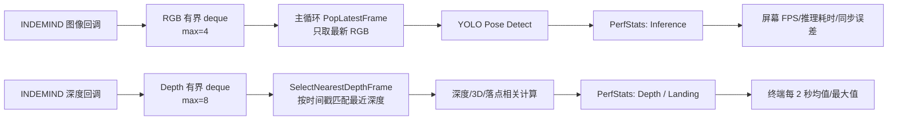

本页聚焦当前工程中的**实时性工程机制**：它不解释姿态算法、深度反投影或落点业务状态机本身，而是说明系统如何通过性能采样、有限缓冲、最新帧消费、深度时间戳匹配和周期性统计输出来控制延迟。代码证据显示，实时链路的关键点集中在 `get_pose_indemind_left.cpp` 的主循环与回调缓冲区，以及 `app/perf_stats.*` 的性能统计模块。Sources: [get_pose_indemind_left.cpp](get_pose_indemind_left.cpp#L729-L744), [perf_stats.h](app/perf_stats.h#L7-L23), [perf_stats.cpp](app/perf_stats.cpp#L7-L54)

## 架构假设与验证结论

从第一性原理看，实时视觉程序的瓶颈通常不是“是否处理了所有帧”，而是“是否在处理最新有效帧”。本工程采用的可验证模式是：相机 SDK 回调只负责把 RGB 与深度帧写入有限长度缓冲区；主循环每次取 RGB 最新帧，并用时间戳选择最接近的深度帧；耗时统计在主线程内围绕推理、深度映射和落点更新三个阶段采样。Sources: [get_pose_indemind_left.cpp](get_pose_indemind_left.cpp#L763-L804), [get_pose_indemind_left.cpp](get_pose_indemind_left.cpp#L852-L889), [get_pose_indemind_left.cpp](get_pose_indemind_left.cpp#L1123-L1134)

下面的图描述本页讨论的实时性闭环：回调层只做轻量入队，主循环执行“最新 RGB + 最近深度”的同步消费，随后把耗时写入滑动窗口，并在 UI 与终端两个层面暴露实时状态。Sources: [get_pose_indemind_left.cpp](get_pose_indemind_left.cpp#L729-L735), [get_pose_indemind_left.cpp](get_pose_indemind_left.cpp#L857-L877), [perf_stats.cpp](app/perf_stats.cpp#L24-L54)

## 性能统计模块：滑动窗口而非全量历史

`PerfStats` 使用三个 `std::deque<double>` 分别保存推理耗时、深度映射耗时和落点检测耗时，并把每类样本的上限固定为 `MAX_SAMPLES = 100`。这意味着统计口径是最近 100 次采样的窗口，而不是进程启动后的全量历史；当新样本加入后超过上限，最旧样本会被 `pop_front()` 移除。Sources: [perf_stats.h](app/perf_stats.h#L7-L20), [perf_stats.cpp](app/perf_stats.cpp#L9-L22)

| 指标 | 采样入口 | 保存结构 | 窗口上限 | 统计输出 |
|---|---|---:|---:|---|
| 推理耗时 | `AddInference(ms)` | `inference_ms` | 100 | 平均值 / 最大值 |
| 深度映射耗时 | `AddDepthMap(ms)` | `depth_map_ms` | 100 | 平均值 / 最大值 |
| 落点更新耗时 | `AddLandingDetect(ms)` | `landing_detect_ms` | 100 | 平均值 / 最大值 |

这些指标的终端输出由 `PrintIfNeeded()` 节流：首次调用只初始化 `last_print_time`，之后仅当距离上次输出达到 2 秒时才调用 `PrintStats()`。`PrintStats()` 对每个 deque 计算平均值和最大值，并以 `[Perf] Inference: avg/maxms | Depth: avg/maxms | Landing: avg/maxms` 的格式写到标准输出。Sources: [perf_stats.cpp](app/perf_stats.cpp#L24-L35), [perf_stats.cpp](app/perf_stats.cpp#L38-L54)

## 主循环中的采样点

推理耗时的采样包围 `pose_detector.Detect(left_image)`：主循环在调用前记录 `pose_start`，调用后记录 `pose_end`，再以毫秒为单位写入 `g_perf_stats.AddInference(inference_time)`。这是当前页面最核心的端到端推理延迟指标，因为它直接覆盖 ONNX 姿态检测器对当前 RGB 帧的处理时间。Sources: [get_pose_indemind_left.cpp](get_pose_indemind_left.cpp#L879-L889)

深度相关耗时的采样范围从 `depth_start` 到 `depth_end`，随后转换为毫秒写入 `g_perf_stats.AddDepthMap(depth_time)`；落点更新则单独包围 `depth_region.UpdateHipData(hip_data_list)`，并把耗时写入 `g_perf_stats.AddLandingDetect(landing_time)`。这三个采样点把重计算链路拆成“推理、深度/3D处理、落点区域更新”三个可观测段。Sources: [get_pose_indemind_left.cpp](get_pose_indemind_left.cpp#L985-L986), [get_pose_indemind_left.cpp](get_pose_indemind_left.cpp#L1123-L1134)

## 屏幕实时指标与终端周期指标

除了终端的 2 秒周期统计，主窗口还显示即时 FPS、当前帧推理耗时、RGB/Depth 同步误差和检测人数。FPS 使用 `fps_frame_count` 在至少 1 秒的时间窗口内计算，推理耗时直接显示当前帧的 `inference_time`，同步误差显示 `depth_sync_error_ms`。Sources: [get_pose_indemind_left.cpp](get_pose_indemind_left.cpp#L906-L916), [get_pose_indemind_left.cpp](get_pose_indemind_left.cpp#L927-L949)

| 展示位置 | 指标 | 更新节奏 | 代码口径 |
|---|---|---|---|
| 主 OpenCV 窗口 | FPS | 至少每 1 秒重算一次 | `fps_frame_count / elapsed` |
| 主 OpenCV 窗口 | Inference ms | 每处理一帧更新 | 当前帧 `Detect()` 耗时 |
| 主 OpenCV 窗口 | Sync dt ms | 每次深度匹配后更新 | 最近 RGB 与所选深度帧的时间差 |
| 终端 | Inference / Depth / Landing 平均与最大值 | 每 2 秒 | 最近最多 100 个样本 |

这种双层可观测性把“当前帧是否卡顿”和“最近窗口是否退化”分开：屏幕适合运行中观察实时反馈，终端适合持续查看阶段耗时的平均值与峰值。Sources: [get_pose_indemind_left.cpp](get_pose_indemind_left.cpp#L927-L949), [perf_stats.cpp](app/perf_stats.cpp#L31-L54)

## 有界缓冲：用丢旧帧换取低延迟

RGB 与深度缓冲区都使用 `std::deque<TimedFrame>`，并分别设置最大长度：RGB 为 4，深度为 8。`PushTimedFrame()` 在插入新帧前检查缓冲区大小，只要当前大小大于等于上限，就持续弹出队首旧帧并递增丢帧计数，最后把新帧放入队尾。Sources: [get_pose_indemind_left.cpp](get_pose_indemind_left.cpp#L178-L191), [get_pose_indemind_left.cpp](get_pose_indemind_left.cpp#L729-L741)

| 缓冲区 | 最大长度 | 写入者 | 读取者 | 超限策略 |
|---|---:|---|---|---|
| `image_buffer` | 4 | 图像回调 | 主循环 | 删除最旧 RGB 帧并累计 `dropped_images` |
| `depth_buffer` | 8 | 深度回调 | 主循环 | 删除最旧深度帧并累计 `dropped_depth` |

主循环消费 RGB 时调用 `PopLatestFrame()`，该函数不是弹出队首，而是取 `buffer.back()` 作为输出，然后清空整个缓冲区。这是典型的**最新帧优先**策略：当推理速度低于相机输入速度时，系统主动跳过积压帧，避免 UI 和推理结果落后于真实场景。Sources: [get_pose_indemind_left.cpp](get_pose_indemind_left.cpp#L193-L199), [get_pose_indemind_left.cpp](get_pose_indemind_left.cpp#L857-L865)

## 回调层的轻量化与锁边界

图像回调只在左目图像非空时执行必要的格式转换：单通道图像转换为 BGR，多通道图像 clone 后入 RGB 缓冲区；整个写入过程由 `mutex_image` 保护。深度回调只把深度从米转换为毫米，然后在 `mutex_depth` 保护下写入深度缓冲区。Sources: [get_pose_indemind_left.cpp](get_pose_indemind_left.cpp#L763-L785), [get_pose_indemind_left.cpp](get_pose_indemind_left.cpp#L789-L803)

主循环读取时同样以短临界区访问缓冲区：RGB 锁只覆盖 `PopLatestFrame()`，深度锁只覆盖 `SelectNearestDepthFrame()`。耗时较高的 YOLO 推理、绘制、深度区域显示和键盘处理都不在这些锁内完成，从代码结构上避免了长时间持锁阻塞 SDK 回调写入。Sources: [get_pose_indemind_left.cpp](get_pose_indemind_left.cpp#L852-L877), [get_pose_indemind_left.cpp](get_pose_indemind_left.cpp#L879-L889), [get_pose_indemind_left.cpp](get_pose_indemind_left.cpp#L1507-L1533)

## 深度帧匹配：有限历史中的最近时间戳

深度同步通过 `SelectNearestDepthFrame()` 完成。函数首先移除早于 `rgb_timestamp - 0.35s` 的历史深度帧，然后遍历剩余缓冲区，选择与 RGB 时间戳绝对差最小的一帧；同步误差以秒差乘以 1000 转换为毫秒写入 `sync_error_ms`。Sources: [get_pose_indemind_left.cpp](get_pose_indemind_left.cpp#L202-L233)

选中深度后，函数把当前深度缓冲区清空，但保留调用前的最后一帧作为新的唯一历史项。这说明深度缓冲并不追求保存完整流，而是保留足够少的上下文供下一帧匹配使用，从而限制内存增长和过期深度对实时性的影响。Sources: [get_pose_indemind_left.cpp](get_pose_indemind_left.cpp#L235-L238)

## 退出时的吞吐统计与丢帧审计

程序退出前会打印总运行时间、采集到的图像数量、深度图数量、姿态检测数量，以及 RGB 和深度缓冲区因限流丢弃的帧数。若总运行时间大于 0，还会输出图像采集、深度和姿态检测的平均速率。Sources: [get_pose_indemind_left.cpp](get_pose_indemind_left.cpp#L1621-L1644)

这些退出统计与运行中性能统计的作用不同：运行中 `[Perf]` 日志关注最近窗口的阶段耗时，退出统计关注整个进程生命周期内的吞吐量和限流结果。两者结合后，可以区分“单阶段计算慢”和“输入流量超过处理能力导致丢帧”这两类问题。Sources: [perf_stats.cpp](app/perf_stats.cpp#L38-L54), [get_pose_indemind_left.cpp](get_pose_indemind_left.cpp#L1628-L1641)

## 队列工具与当前实现边界

工程中还提供了一个通用 `ClearQueue(std::queue<T>&)` 工具函数，它通过构造空队列并与目标队列 `swap` 来清空 `std::queue`。当前实时帧缓冲主体使用的是 `std::deque<TimedFrame>` 及专用的 `PushTimedFrame()`、`PopLatestFrame()` 和 `SelectNearestDepthFrame()`，因此本页的实时限流分析以这些 deque 逻辑为主。Sources: [queue_utils.h](app/queue_utils.h#L1-L13), [get_pose_indemind_left.cpp](get_pose_indemind_left.cpp#L178-L238)

## 实时性优化模式对照

以下表格总结当前代码中可验证的实时性模式，以及它们各自解决的问题。Sources: [get_pose_indemind_left.cpp](get_pose_indemind_left.cpp#L178-L238), [get_pose_indemind_left.cpp](get_pose_indemind_left.cpp#L729-L804), [perf_stats.cpp](app/perf_stats.cpp#L24-L54)

| 模式 | 代码位置 | 解决的问题 | 代价 |
|---|---|---|---|
| 有界缓冲 | `kMaxImageBufferSize=4`、`kMaxDepthBufferSize=8` | 防止回调输入无限堆积 | 旧帧会被丢弃 |
| 最新帧消费 | `PopLatestFrame()` | 避免主循环处理过期 RGB | 不保证逐帧处理 |
| 最近深度匹配 | `SelectNearestDepthFrame()` | 在 RGB 与深度异步到达时选取最接近深度 | 只保留有限深度历史 |
| 周期性日志 | `PrintIfNeeded()` | 避免每帧打印影响运行 | 终端指标不是逐帧输出 |
| 滑动窗口统计 | `MAX_SAMPLES=100` | 反映近期性能而非长期均值 | 历史尖峰会被窗口淘汰 |

## 阅读路径建议

如果需要理解这些优化机制在端到端数据流中的位置，建议先阅读[整体架构与端到端数据流](10-zheng-ti-jia-gou-yu-duan-dao-duan-shu-ju-liu)；如果要深入相机回调与最新帧消费策略，可继续阅读[INDEMIND SDK 回调模型与最新帧消费策略](15-indemind-sdk-hui-diao-mo-xing-yu-zui-xin-zheng-xiao-fei-ce-lue)；如果关注后续维护与职责拆分，则进入[模块职责边界与重构路线](26-mo-kuai-zhi-ze-bian-jie-yu-zhong-gou-lu-xian)。Sources: [get_pose_indemind_left.cpp](get_pose_indemind_left.cpp#L729-L804), [get_pose_indemind_left.cpp](get_pose_indemind_left.cpp#L852-L889)