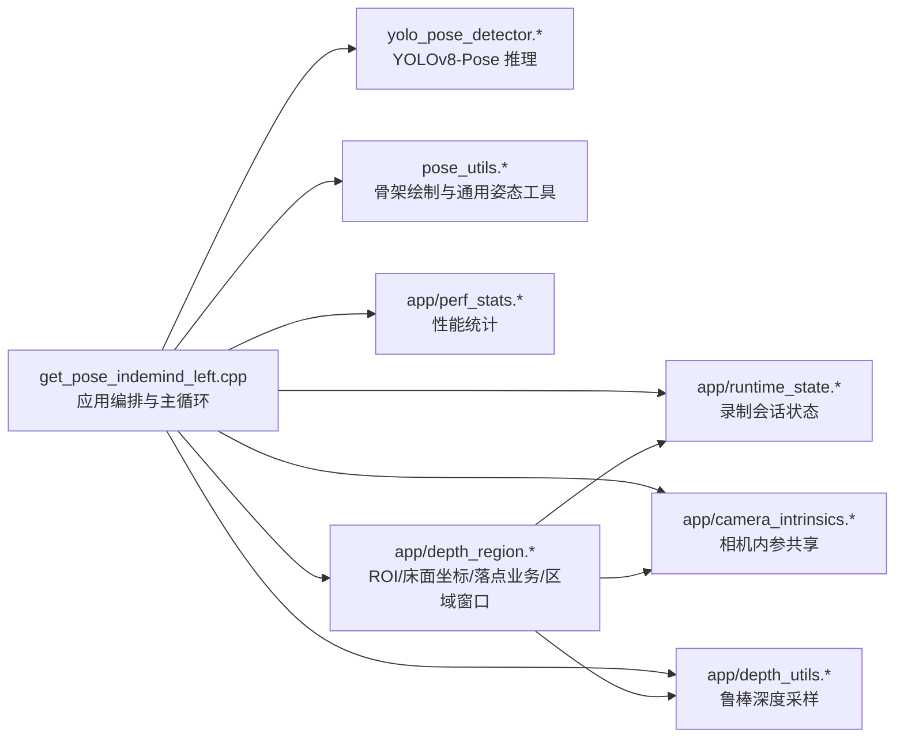
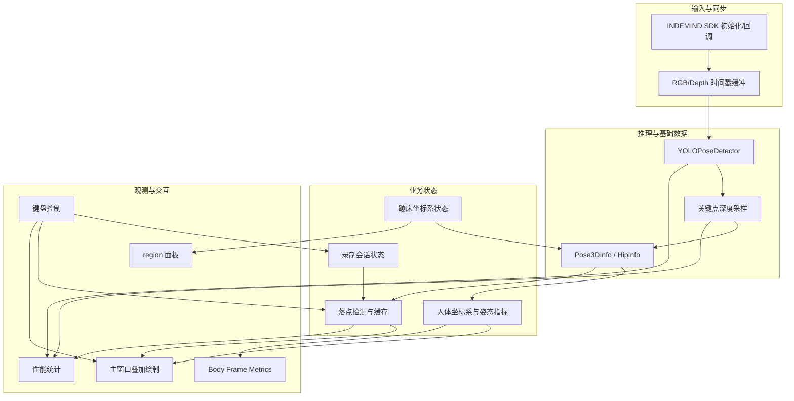

本页的目标是把当前工程中已经拆出的模块边界讲清楚，并给出后续重构时应遵守的迁移路线；它不重复推理算法、深度反投影、蹦床平面拟合或落点检测的数学细节，而是从“哪些职责已经在哪个文件内”“哪些职责仍耦合在入口文件或大类里”“下一步如何拆而不改变运行行为”三个问题出发。现有重构记录明确要求在保持运行时行为不变的前提下，把原单体入口拆成分层模块，并保持 `yolo_pose_indemind_left` 目标仍链接相同核心检测器与工具。Sources: [refactor_get_pose_indemind_left.md](docs/refactor_get_pose_indemind_left.md#L4-L9)

## 架构假设与验证结论

本页采用的初始假设是：工程已经从单体 `get_pose_indemind_left.cpp` 中抽离出一部分横切职责，但主入口仍承担编排、相机生命周期、同步缓冲、3D 姿态派生、UI 面板和键盘控制等多类职责；该假设可以从构建装配验证，当前唯一主要可执行目标 `yolo_pose_indemind_left` 同时编入入口文件、通用检测/绘制模块以及 `app/` 下的状态、性能、深度和交互模块。Sources: [CMakeLists.txt](CMakeLists.txt#L171-L199)

上图表达的是“当前编译单元级依赖”，不是理想架构：`get_pose_indemind_left.cpp` 仍是中央编排点，而 `DepthRegion` 已经吸收了 ROI 交互、坐标系状态、落点缓存与区域窗口显示等多种业务；`app/depth_region.h` 直接包含相机内参、深度工具和运行时状态，说明它不仅是纯 UI 类，也直接读写项目级共享状态。Sources: [get_pose_indemind_left.cpp](get_pose_indemind_left.cpp#L16-L20), [depth_region.h](app/depth_region.h#L4-L7)

## 当前模块职责边界

| 模块 | 当前职责 | 边界判断 | 主要外部依赖 |
|---|---|---|---|
| `get_pose_indemind_left.cpp` | 程序入口、SDK 初始化、内参初始化、检测器初始化、回调注册、主循环、同步缓冲、UI 绘制、键盘控制 | **应用编排层**，但仍含大量业务派生逻辑 | INDEMIND SDK、OpenCV、YOLO detector、`app/*` |
| `yolo_pose_detector.*` | ONNX Runtime 初始化、预处理、推理、输出解析、NMS、坐标回缩 | **推理内核层**，边界相对清晰 | OpenCV、ONNX Runtime |
| `pose_utils.*` | COCO 骨架连接、姿态绘制、姿态信息绘制、通用 3D 映射工具声明 | **显示/姿态工具层** | `PoseResult`、OpenCV |
| `app/camera_intrinsics.*` | 全局左目内参矩阵与逆矩阵 | **共享硬件参数层**，当前以 `extern` 暴露 | OpenCV |
| `app/depth_utils.*` | 局部窗口中值深度采样，过滤无效深度 | **纯函数工具层**，边界清晰 | OpenCV |
| `app/runtime_state.*` | 录制开关、当前会话、创建输出目录 | **运行时全局状态层** | 标准库、系统命令 |
| `app/perf_stats.*` | 推理、深度映射、落点检测耗时滑窗与周期打印 | **横切观测层** | 标准库 |
| `app/depth_region.*` | 鼠标 ROI、区域面板、床面坐标系、髋点跟踪、EMA、落点确认、落点缓存/导出 | **交互+几何+业务聚合层**，后续最需要拆分 | OpenCV、内参、深度工具、运行时状态 |

Sources: [CMakeLists.txt](CMakeLists.txt#L171-L199), [runtime_state.h](app/runtime_state.h#L7-L24), [perf_stats.h](app/perf_stats.h#L7-L23), [camera_intrinsics.h](app/camera_intrinsics.h#L4-L8), [depth_utils.h](app/depth_utils.h#L8-L11), [depth_region.h](app/depth_region.h#L26-L50)

当前边界中最稳定的是推理内核、性能统计、深度采样和队列清空工具：`YOLOPoseDetector::Detect()` 内部完成预处理、输入 tensor 构造、ONNX Runtime 推理和后处理；`PerfStats` 只维护三个耗时滑窗并按周期打印；`RobustDepthMedianU16()` 只负责从 `CV_16UC1` 深度图中收集局部有效值并取中位数；`ClearQueue<T>()` 只是模板化队列置空辅助。Sources: [yolo_pose_detector.cpp](yolo_pose_detector.cpp#L170-L213), [perf_stats.cpp](app/perf_stats.cpp#L9-L54), [depth_utils.cpp](app/depth_utils.cpp#L6-L28), [queue_utils.h](app/queue_utils.h#L7-L11)

当前边界中最混合的是入口文件与 `DepthRegion`：入口文件不仅初始化 SDK 和模型，还在主循环中做 RGB/深度帧匹配、3D 关键点生成、人体坐标系构建、姿态指标计算、落点更新调度、多个窗口绘制和键盘动作分发；`DepthRegion` 则在一个头文件类中同时实现鼠标四点 ROI、深度面板绘制、坐标变换、髋点更新、落点状态机和内部稳定性参数。Sources: [get_pose_indemind_left.cpp](get_pose_indemind_left.cpp#L672-L735), [get_pose_indemind_left.cpp](get_pose_indemind_left.cpp#L852-L889), [get_pose_indemind_left.cpp](get_pose_indemind_left.cpp#L971-L1134), [depth_region.h](app/depth_region.h#L83-L130), [depth_region.h](app/depth_region.h#L603-L675)

## 边界关系图：从“能跑”到“可维护”

下面的关系图按维护视角重排当前职责：左侧是输入与推理，中间是业务状态转换，右侧是观测与交互输出。它强调一个事实：当前代码已经有模块化雏形，但主循环仍直接串接几乎所有业务阶段，因此后续重构应优先减少入口文件对业务细节的直接认知。Sources: [refactor_get_pose_indemind_left.md](docs/refactor_get_pose_indemind_left.md#L11-L36), [get_pose_indemind_left.cpp](get_pose_indemind_left.cpp#L971-L1134)

从该图可以看出，`RuntimeFlags` 与 `DataSession` 已被抽到 `runtime_state`，但入口文件仍直接处理 `R/C/S` 三类录制按键，并调用 `CreateNewSession()`、`ClearLandingPoints()` 与 `FlushLandingPoints()`；这说明“会话状态”已模块化，“用户命令到业务动作”的应用服务层尚未抽出。Sources: [runtime_state.h](app/runtime_state.h#L7-L24), [runtime_state.cpp](app/runtime_state.cpp#L10-L38), [get_pose_indemind_left.cpp](get_pose_indemind_left.cpp#L1596-L1617)

## 已完成的重构切面

已完成的重构切面可以概括为五个层次：应用层保留入口、相机初始化、主循环和 UI 控制；运行时状态层承载 `RuntimeFlags`、`DataSession` 和 `CreateNewSession()`；性能层承载 `PerfStats` 与全局性能对象；相机/深度工具层承载内参矩阵、深度中值采样和队列清空；交互/可视化层承载 `DepthRegion` 与鼠标回调。Sources: [refactor_get_pose_indemind_left.md](docs/refactor_get_pose_indemind_left.md#L11-L36)

这些切面在 CMake 中已经固化为构建装配：`COMMON_SOURCES` 包含 `yolo_pose_detector.cpp` 与 `pose_utils.cpp`，`APP_SOURCES` 包含 `camera_intrinsics.cpp`、`depth_region.cpp`、`depth_utils.cpp`、`perf_stats.cpp`、`runtime_state.cpp`，最终共同链接到 `yolo_pose_indemind_left`。Sources: [CMakeLists.txt](CMakeLists.txt#L171-L199)

重构后的运行行为被文档明确标注为未做算法变更：主循环仍保留在 `get_pose_indemind_left.cpp`，只是改为包含和调用已抽出的辅助模块；构建仍生成同名可执行程序，并使用同样依赖和运行时行为。Sources: [refactor_get_pose_indemind_left.md](docs/refactor_get_pose_indemind_left.md#L76-L86)

## 应继续拆分的高耦合区域

第一类高耦合区域是入口文件中的**设备与帧同步职责**。当前 `main()` 直接创建 `CIMRSDK`、配置分辨率和频率、读取左目内参并写入全局 `cv_in_left/cv_in_left_inv`，随后直接维护 RGB/深度时间戳缓冲和互斥锁；这些代码属于硬件适配与帧同步层，不应长期停留在业务主循环中。Sources: [get_pose_indemind_left.cpp](get_pose_indemind_left.cpp#L684-L713), [get_pose_indemind_left.cpp](get_pose_indemind_left.cpp#L729-L735), [camera_intrinsics.cpp](app/camera_intrinsics.cpp#L1-L4)

第二类高耦合区域是入口文件中的**3D 姿态派生职责**。当前主循环在检测结果之后直接遍历每个人、每个关键点，调用 `RobustDepthMedianU16()`、用 `cv_in_left_inv` 反投影到相机坐标，再在床面坐标系就绪时调用 `DepthRegion::TransformToNewFrame()`，并填充 `Pose3DInfo` 与 `HipInfo`；这段逻辑更适合作为独立的“Pose3DBuilder / PoseFusion”模块。Sources: [get_pose_indemind_left.cpp](get_pose_indemind_left.cpp#L971-L1028), [get_pose_indemind_left.cpp](get_pose_indemind_left.cpp#L1030-L1058), [depth_region.h](app/depth_region.h#L374-L403)

第三类高耦合区域是 `DepthRegion` 中的**交互、几何和业务状态聚合**。`DepthRegion::OnMouse()` 管理四点 ROI 选择，`ShowElems()` 同时负责区域窗口绘制和在深度可用时触发 ROI 平面最终化，`FitPlaneLeastSquares()`、`FitPlaneRansac()` 和 `BuildFrameFromPlane()` 负责几何建模，而 `UpdateHipData()`、`CheckLandingPoint()` 与 `ConfirmLandingPoint()` 又负责髋点跟踪和落点确认。Sources: [depth_region.h](app/depth_region.h#L45-L80), [depth_region.h](app/depth_region.h#L83-L130), [depth_region.h](app/depth_region.h#L1038-L1152), [depth_region.h](app/depth_region.h#L603-L799)

第四类高耦合区域是**UI 面板与控制命令**。当前入口文件直接绘制主窗口叠加信息、录制状态、落点数量、人体指标窗口和 3D 骨架明细，同时在同一个循环末尾处理键盘输入；这使显示代码、运行状态和业务动作在主循环内交织。Sources: [get_pose_indemind_left.cpp](get_pose_indemind_left.cpp#L930-L969), [get_pose_indemind_left.cpp](get_pose_indemind_left.cpp#L1310-L1356), [get_pose_indemind_left.cpp](get_pose_indemind_left.cpp#L1358-L1504), [get_pose_indemind_left.cpp](get_pose_indemind_left.cpp#L1532-L1618)

## 目标模块边界建议

| 目标模块 | 从哪里抽出 | 应承担的职责 | 不应承担的职责 |
|---|---|---|---|
| `CameraRuntime` 或 `IndemindFrameSource` | `main()` 中 SDK 初始化、回调、缓冲 | SDK 生命周期、RGB/Depth 回调、时间戳缓冲、丢帧计数 | YOLO 推理、姿态业务、UI 绘制 |
| `Pose3DBuilder` | `main()` 中关键点深度采样与反投影 | `PoseResult + depth + K^-1 -> Pose3DInfo/HipInfo` | 床面拟合、落点检测、键盘控制 |
| `TrampolineFrameModel` | `DepthRegion` 中 ROI 采样、平面拟合、坐标系构建 | ROI 点、平面参数、坐标系变换 | 区域窗口绘制、落点状态机 |
| `LandingDetector` | `DepthRegion` 中髋点跟踪与极低点确认 | EMA、丢帧复位、局部极小值确认、落点缓存 | 鼠标事件、OpenCV 窗口绘制 |
| `UiRenderer` | `main()` 与 `DepthRegion::ShowElems()` | 主窗口叠加、region 面板、metrics 面板 | 修改业务状态 |
| `CommandController` | `main()` 键盘分支 | 按键到应用动作的映射 | 具体算法实现 |

Sources: [get_pose_indemind_left.cpp](get_pose_indemind_left.cpp#L763-L804), [get_pose_indemind_left.cpp](get_pose_indemind_left.cpp#L971-L1134), [depth_region.h](app/depth_region.h#L360-L403), [depth_region.h](app/depth_region.h#L1261-L1303), [get_pose_indemind_left.cpp](get_pose_indemind_left.cpp#L1532-L1618)

这些目标模块不是另起炉灶，而是对已有代码位置的“职责归位”：`DepthRegion` 当前可先退化为组合门面，内部持有床面模型、落点检测器和 region 渲染器；入口文件则退化为生命周期编排，即初始化依赖、拉取最新帧、调用服务、分发渲染和处理退出。Sources: [depth_region.h](app/depth_region.h#L26-L41), [get_pose_indemind_left.cpp](get_pose_indemind_left.cpp#L852-L889), [get_pose_indemind_left.cpp](get_pose_indemind_left.cpp#L1507-L1530)

## 重构路线图

| 阶段 | 操作 | 验证点 | 风险控制 |
|---|---|---|---|
| A | 保持 CMake 目标不变，先抽 `Pose3DBuilder` 纯函数/类 | 主循环仍能生成相同 `hip_data_list` 与 `pose_3d_infos` | 不改阈值、不改坐标公式 |
| B | 从 `DepthRegion` 拆出 `LandingDetector` | `UpdateHipData()` 外部行为不变，落点数量和 CSV 输出路径不变 | 保留原 public API 做适配层 |
| C | 从 `DepthRegion` 拆出 `TrampolineFrameModel` | ROI 四点后 `IsCoordSystemReady()` 与 `TransformToNewFrame()` 行为不变 | 先迁移成员变量，再迁移算法 |
| D | 抽 `UiRenderer`，减少主循环绘制代码 | 主窗口、region、metrics 三类窗口仍显示 | 只移动绘制语句，不改业务数据 |
| E | 抽 `CommandController` | `k/t/i/l/+/-/[/]/p/r/c/s/q` 行为保持 | 以命令对象返回动作，不直接嵌入算法 |
| F | 抽 `IndemindFrameSource` | 图像/深度回调、丢帧计数、同步误差保持 | 保留时间戳缓冲策略 |

Sources: [CMakeLists.txt](CMakeLists.txt#L193-L215), [get_pose_indemind_left.cpp](get_pose_indemind_left.cpp#L971-L1134), [depth_region.h](app/depth_region.h#L603-L799), [depth_region.h](app/depth_region.h#L1038-L1152), [get_pose_indemind_left.cpp](get_pose_indemind_left.cpp#L1310-L1504), [get_pose_indemind_left.cpp](get_pose_indemind_left.cpp#L1532-L1618)

第一阶段应优先抽 `Pose3DBuilder`，因为这段逻辑输入和输出最明确：输入是 `poses`、`depth_data`、`cv_in_left_inv` 和床面坐标系状态，输出是每个姿态的相机/床面 3D 关键点、骨盆点和 `DepthRegion::HipInfo` 列表；当前代码已经把这些中间结果集中在一个连续区间内，适合低风险搬迁。Sources: [get_pose_indemind_left.cpp](get_pose_indemind_left.cpp#L971-L1058)

第二阶段应拆 `LandingDetector`，但要保留 `DepthRegion::UpdateHipData()` 作为兼容入口。现有 `UpdateHipData()` 内部已经包含丢帧复位、目标髋点选择、EMA 滤波、Z 历史写入和 `CheckLandingPoint()` 调用，后续可以把这些状态迁入独立检测器，再让 `DepthRegion` 只负责把 UI 数据转交给检测器。Sources: [depth_region.h](app/depth_region.h#L603-L675), [depth_region.h](app/depth_region.h#L1265-L1302)

第三阶段应拆床面模型，把 ROI 点、平面参数、内点比例、坐标系旋转矩阵和坐标变换移入一个专门模型。当前 `TransformToNewFrame()` 只依赖 `coord_system_ready_`、`origin_` 和 `rotation_matrix_`，而平面拟合与坐标系构建集中在 `FitPlaneLeastSquares()`、`FitPlaneRansac()`、`PixelToPlanePoint()` 与 `BuildFrameFromPlane()`，这些天然属于几何模型而不是窗口类。Sources: [depth_region.h](app/depth_region.h#L374-L403), [depth_region.h](app/depth_region.h#L1038-L1152)

第四阶段再处理 UI 和命令，因为它们改动面广但算法风险低。当前主窗口和 metrics 面板绘制代码大量使用已经计算好的状态变量，键盘分支也主要调用已有对象方法或切换布尔值；把这些迁移为渲染器和命令控制器时，应保持输入数据结构不变，避免和算法拆分同时发生。Sources: [get_pose_indemind_left.cpp](get_pose_indemind_left.cpp#L1310-L1504), [get_pose_indemind_left.cpp](get_pose_indemind_left.cpp#L1532-L1618)

## 重构约束与验收标准

第一条约束是**构建目标不变**：`yolo_pose_indemind_left` 的输出名、运行输出目录、链接库和 Linux 下的 `pthread` 链接方式都应保持；新增 `.cpp` 文件时只追加到 `APP_SOURCES` 或新的源集合，不应改变可执行目标名称。Sources: [CMakeLists.txt](CMakeLists.txt#L181-L199), [CMakeLists.txt](CMakeLists.txt#L201-L215)

第二条约束是**行为入口不变**：命令行默认模型路径、SDK 初始化流程、内参矩阵写入、检测器初始化和主循环退出方式应保持一致；这些代码是用户运行路径的起点，重构时可以封装，但不应同时改变参数语义。Sources: [get_pose_indemind_left.cpp](get_pose_indemind_left.cpp#L675-L727), [get_pose_indemind_left.cpp](get_pose_indemind_left.cpp#L1532-L1535)

第三条约束是**公共数据契约不变**：`PoseResult` 仍表示一个人的检测框、置信度、17 个关键点和可选 `person_id`，`KeyPoint` 仍包含图像坐标、关键点置信度和后续填充的 `pos3d`；拆分模块时应围绕这些结构传递数据，而不是引入并行的重复结构。Sources: [yolo_pose_detector.h](yolo_pose_detector.h#L36-L58)

第四条约束是**全局状态迁移要分步完成**：`cv_in_left/cv_in_left_inv`、`g_perf_stats`、`g_runtime_flags/g_current_session` 当前都通过头文件 `extern` 暴露并在 `.cpp` 中唯一定义；在没有引入依赖注入或上下文对象前，不应一次性删除这些全局对象。Sources: [camera_intrinsics.h](app/camera_intrinsics.h#L6-L7), [camera_intrinsics.cpp](app/camera_intrinsics.cpp#L3-L4), [perf_stats.h](app/perf_stats.h#L23-L23), [perf_stats.cpp](app/perf_stats.cpp#L7-L7), [runtime_state.h](app/runtime_state.h#L20-L23), [runtime_state.cpp](app/runtime_state.cpp#L10-L14)

## 推荐阅读顺序

若要理解本页边界背后的端到端上下文，下一步先读 [整体架构与端到端数据流](10-zheng-ti-jia-gou-yu-duan-dao-duan-shu-ju-liu)，再读 [CMake 构建目标与第三方依赖链接](11-cmake-gou-jian-mu-biao-yu-di-san-fang-yi-lian-jie)；如果正在拆相机与帧同步，请转到 [INDEMIND SDK 回调模型与最新帧消费策略](15-indemind-sdk-hui-diao-mo-xing-yu-zui-xin-zheng-xiao-fei-ce-lue)，如果正在拆性能和队列策略，请转到 [性能统计、队列限流与实时性优化](25-xing-neng-tong-ji-dui-lie-xian-liu-yu-shi-shi-xing-you-hua)。Sources: [project_cpp_architecture_guide.md](docs/project_cpp_architecture_guide.md#L14-L33), [project_cpp_architecture_guide.md](docs/project_cpp_architecture_guide.md#L78-L102)

若要继续处理 `DepthRegion` 的拆分，请按职责分别参考 [四点 ROI 交互与蹦床平面采样](18-si-dian-roi-jiao-hu-yu-beng-chuang-ping-mian-cai-yang)、[RANSAC 与最小二乘平面拟合](19-ransac-yu-zui-xiao-er-cheng-ping-mian-ni-he)、[床面坐标系构建、坐标变换与轴向约定](20-chuang-mian-zuo-biao-xi-gou-jian-zuo-biao-bian-huan-yu-zhou-xiang-yue-ding) 和 [落点检测状态机与加权确认算法](23-luo-dian-jian-ce-zhuang-tai-ji-yu-jia-quan-que-ren-suan-fa)，这些页面分别承载算法解释，本页只定义拆分边界。Sources: [depth_region.h](app/depth_region.h#L45-L80), [depth_region.h](app/depth_region.h#L1038-L1152), [depth_region.h](app/depth_region.h#L687-L799)