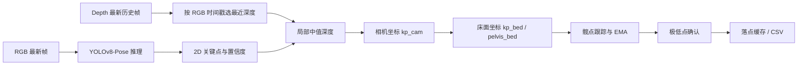
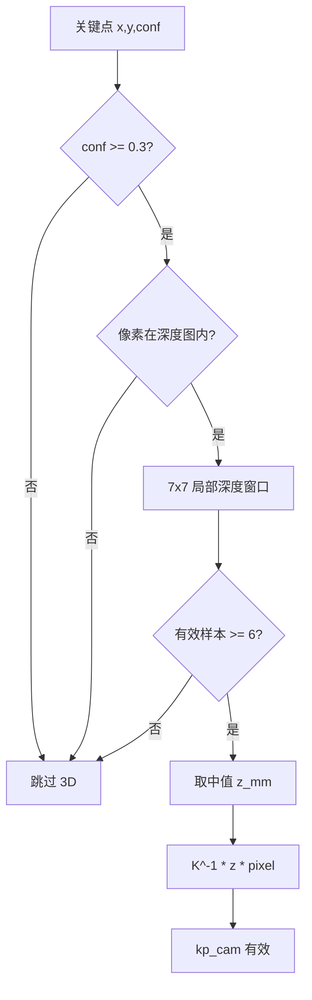
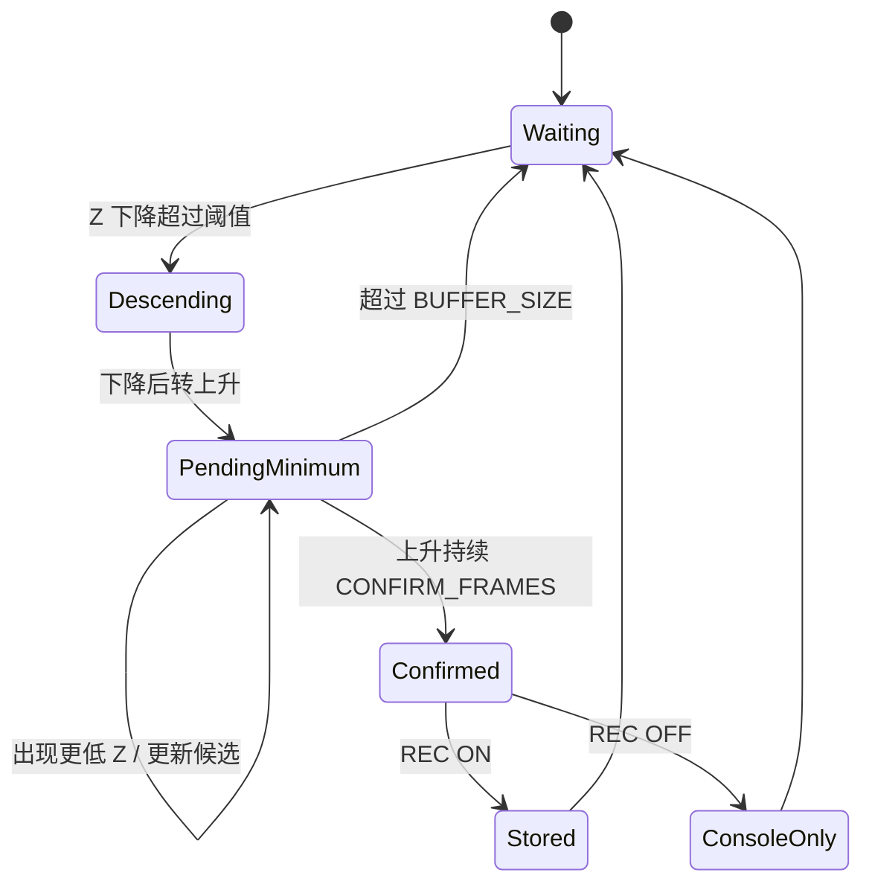
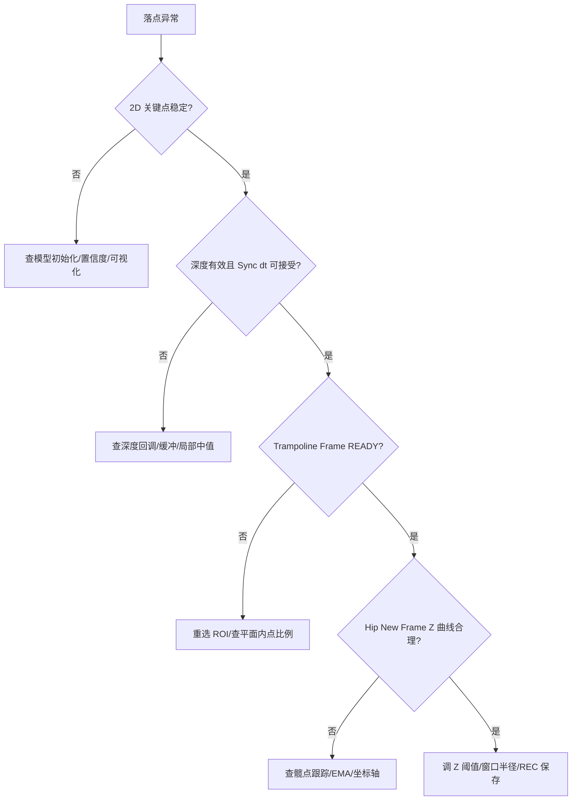

本页定位在工程化维护章节的最后一环：当 YOLO 推理、深度接入、蹦床坐标系和落点检测已经能够端到端运行后，开发者如何**定位误差来自哪一层**。本页只讨论可观测调试入口、误差传播路径、运行时面板和 CSV/日志核对方法；算法原理本身请回到 [YOLOv8-Pose ONNX 推理器设计](12-yolov8-pose-onnx-tui-li-qi-she-ji)、[相机内参、深度采样与像素反投影](16-xiang-ji-nei-can-shen-du-cai-yang-yu-xiang-su-fan-tou-ying)、[床面坐标系构建、坐标变换与轴向约定](20-chuang-mian-zuo-biao-xi-gou-jian-zuo-biao-bian-huan-yu-zhou-xiang-yue-ding) 和 [落点检测状态机与加权确认算法](23-luo-dian-jian-ce-zhuang-tai-ji-yu-jia-quan-que-ren-suan-fa)。Sources: [get_pose_indemind_left.cpp](get_pose_indemind_left.cpp#L809-L824), [app/depth_region.h](app/depth_region.h#L200-L281)

## 架构假设：误差按“像素 → 深度 → 相机坐标 → 床面坐标 → 落点记录”单向传播

调试时应先建立一个可验证假设：系统中的落点误差不是单点问题，而是从 2D 关键点像素、深度帧同步、局部深度采样、相机反投影、蹦床坐标变换、髋点跟踪与落点确认逐级传递。主循环先取最新 RGB 帧，再按时间戳匹配最近深度帧，随后执行 YOLO 检测、深度反投影、髋点/床面坐标生成、落点状态更新，并在 UI 与控制台输出观测量。Sources: [get_pose_indemind_left.cpp](get_pose_indemind_left.cpp#L857-L889), [get_pose_indemind_left.cpp](get_pose_indemind_left.cpp#L971-L1134)

图中的每个节点在代码中都有对应的观测接口：推理层输出关键点置信度日志和检测人数叠加层，深度同步层输出 `Sync dt`，坐标层输出 region 窗口中的 Camera/New Frame 坐标和 Body Frame Metrics，落点层输出控制台记录、右上角 LP 状态以及 `landing_points.csv`。Sources: [get_pose_indemind_left.cpp](get_pose_indemind_left.cpp#L894-L949), [app/depth_region.h](app/depth_region.h#L211-L273), [get_pose_indemind_left.cpp](get_pose_indemind_left.cpp#L1302-L1329), [app/depth_region.h](app/depth_region.h#L858-L880)

## 推理层调试：先确认模型、输入缩放和关键点置信度

推理器初始化会打印模型路径、输入尺寸、输入/输出节点名称与张量形状；如果 CUDA 配置失败，构造函数捕获 ONNX Runtime 异常并回退到 CPU。定位“没有人”“关键点漂移”“推理慢”时，第一步不是看深度，而是确认初始化输出和运行时检测人数是否稳定。Sources: [yolo_pose_detector.cpp](yolo_pose_detector.cpp#L10-L47), [yolo_pose_detector.cpp](yolo_pose_detector.cpp#L53-L117), [get_pose_indemind_left.cpp](get_pose_indemind_left.cpp#L947-L949)

YOLO 预处理使用 letterbox 等比例缩放、灰色填充、BGR→RGB、归一化到 `[0,1]`，并转换为 CHW；后处理假定输出格式为 `[1,56,8400]`，其中 56 包含 bbox、目标置信度和 17 个关键点的 x/y/visibility，最后移除 padding 并缩放回原图坐标。若 2D 点整体偏移，优先检查这条缩放链路，而不是床面坐标系。Sources: [yolo_pose_detector.cpp](yolo_pose_detector.cpp#L119-L168), [yolo_pose_detector.cpp](yolo_pose_detector.cpp#L215-L287), [yolo_pose_detector.cpp](yolo_pose_detector.cpp#L348-L381)

运行时每 30 次有效检测会打印第一人的全部关键点置信度和像素位置，显示层默认以 0.3 作为绘制阈值，而 3D 髋点有效性要求左右髋置信度大于 0.5。调试时若可视化上能看到点但没有 3D 髋点或落点，需注意这两个阈值并不相同。Sources: [get_pose_indemind_left.cpp](get_pose_indemind_left.cpp#L894-L903), [get_pose_indemind_left.cpp](get_pose_indemind_left.cpp#L918-L925), [get_pose_indemind_left.cpp](get_pose_indemind_left.cpp#L1030-L1058)

| 观测对象 | 代码入口 | 正常可见现象 | 异常定位方向 |
|---|---|---|---|
| 模型初始化 | `YOLOPoseDetector::Init()` | 输出模型、输入尺寸、输入/输出 shape | 模型路径、ONNX Runtime、CUDA provider |
| 2D 关键点 | `[DEBUG] First person keypoint confidences` | 每 30 次有效检测打印 17 点 | 光照、遮挡、模型输入尺寸、置信度阈值 |
| 画面叠加 | `DrawPoses` / `Detected` | 主窗口显示骨架和人数 | 后处理坐标缩放或 NMS |
| 推理耗时 | `Inference: ... ms` / `[Perf]` | UI 与控制台都有耗时 | CPU/GPU 回退、模型规模、实时队列压力 |

Sources: [yolo_pose_detector.cpp](yolo_pose_detector.cpp#L53-L117), [get_pose_indemind_left.cpp](get_pose_indemind_left.cpp#L894-L949), [app/perf_stats.cpp](app/perf_stats.cpp#L24-L54)

## 深度同步调试：`Sync dt` 是 3D 抖动的第一判据

RGB 和深度不是在同一个回调中产生：RGB 回调把左目图像转换成 BGR 后放入 `image_buffer`，深度回调在启用深度处理器后把深度从米转换成毫米并放入 `depth_buffer`。主循环使用 `SelectNearestDepthFrame` 为当前 RGB 帧选择绝对时间差最小的深度帧，并在 UI 中显示 `Sync dt`。Sources: [get_pose_indemind_left.cpp](get_pose_indemind_left.cpp#L764-L787), [get_pose_indemind_left.cpp](get_pose_indemind_left.cpp#L789-L807), [get_pose_indemind_left.cpp](get_pose_indemind_left.cpp#L867-L876), [get_pose_indemind_left.cpp](get_pose_indemind_left.cpp#L940-L944)

`SelectNearestDepthFrame` 会丢弃早于 RGB 时间戳 0.35 秒以上的历史深度帧，从剩余缓冲中选择最近帧，并在选择后只保留最新深度帧。这个策略保证主循环不处理积压深度，但也意味着 `Sync dt` 过大时，3D 点可能来自时间上不匹配的人体姿态。Sources: [get_pose_indemind_left.cpp](get_pose_indemind_left.cpp#L202-L239)

当 region 窗口没有深度数据时，主循环每 2 秒输出一次 `[DEBUG] No depth data available for region display. Depth count: ...`；退出时还会打印总图像数、总深度图数、丢弃 RGB/Depth 帧数和平均速率。调试深度断流时，应同时看实时 debug 和退出统计，避免把“深度未到达”误判为“反投影错误”。Sources: [get_pose_indemind_left.cpp](get_pose_indemind_left.cpp#L1507-L1527), [get_pose_indemind_left.cpp](get_pose_indemind_left.cpp#L1628-L1642)

| 现象 | 直接观测量 | 可验证原因 | 下一步 |
|---|---|---|---|
| 2D 骨架稳定但 3D 坐标跳变 | `Sync dt` 偏大或波动 | RGB/Depth 时间戳匹配不稳定 | 先看深度回调计数与丢帧统计 |
| region 窗口无坐标 | `[DEBUG] No depth data...` | 深度处理器未启用或没有深度帧 | 检查 `EnableDepthProcessor()` 输出 |
| 关键点有像素但无 3D | 深度中值采样失败 | 局部窗口有效深度少于 6 个 | 检查无效深度过滤和人体边缘点 |
| 退出时深度帧远少于 RGB | `Total depth maps` / `Total images` | 深度链路低频或断流 | 优先调相机/SDK，不调落点阈值 |

Sources: [get_pose_indemind_left.cpp](get_pose_indemind_left.cpp#L789-L807), [app/depth_utils.cpp](app/depth_utils.cpp#L6-L28), [get_pose_indemind_left.cpp](get_pose_indemind_left.cpp#L1628-L1642)

## 深度采样调试：局部中值过滤决定关键点是否进入 3D

所有关键点反投影前都会先通过 `RobustDepthMedianU16(depth_data, px, py, r=3, z_mm)` 采样，函数只接受 `CV_16UC1` 深度图，忽略 0 和大于等于 10000 mm 的值，并要求局部窗口至少 6 个有效样本。这个规则解释了为什么同一个 2D 关键点可见，但 3D 面板中显示 `N/A`：不是关键点不存在，而是深度局部样本不满足有效性条件。Sources: [get_pose_indemind_left.cpp](get_pose_indemind_left.cpp#L994-L1028), [app/depth_utils.cpp](app/depth_utils.cpp#L6-L28), [app/depth_utils.h](app/depth_utils.h#L8-L11)

鼠标在主窗口移动或点击后，region 窗口会显示当前像素 `[row, col]` 和相机坐标 `[X,Y,Z] mm`；该坐标使用同一个局部中值采样和 `cv_in_left_inv * Z * [u,v,1]^T` 反投影链路。调试单点深度误差时，鼠标读数是最小闭环验证入口。Sources: [app/depth_region.h](app/depth_region.h#L111-L152), [get_pose_indemind_left.cpp](get_pose_indemind_left.cpp#L745-L754)

3D 关键点计算中，像素先取整为 `px/py`，越界即跳过；深度有效后，以毫米为单位构造图像齐次坐标并通过左目内参逆矩阵得到相机坐标。若坐标量级异常，必须先核对左目内参初始化输出中的 `fx/fy/cx/cy` 与实际图像分辨率，而不是直接修改落点算法。Sources: [get_pose_indemind_left.cpp](get_pose_indemind_left.cpp#L700-L718), [get_pose_indemind_left.cpp](get_pose_indemind_left.cpp#L1000-L1023)

这条链路提供了明确的排查顺序：先看关键点置信度，再看像素是否落在深度图范围内，再用鼠标 region 读数确认局部深度是否有效，最后核对相机内参反投影。Sources: [get_pose_indemind_left.cpp](get_pose_indemind_left.cpp#L994-L1028), [app/depth_region.h](app/depth_region.h#L111-L152), [app/depth_utils.cpp](app/depth_utils.cpp#L6-L28)

## 坐标系调试：ROI 平面未就绪时不要解释床面坐标

蹦床坐标系只有在四点 ROI 完成且深度可用后才建立。鼠标点击会记录四个角点，第四点后设置待拟合状态；region 窗口在有深度图时执行 ROI 平面拟合，并显示 `Trampoline Frame: READY`、内点数量和内点比例。Sources: [app/depth_region.h](app/depth_region.h#L45-L81), [app/depth_region.h](app/depth_region.h#L174-L191), [app/depth_region.h](app/depth_region.h#L284-L371)

ROI 拟合流程先对四点求凸包，生成多边形 mask，再按 `roi_sample_step_` 从 ROI 内采样有效深度，少于 50 个样本会拒绝拟合；随后使用 RANSAC 得到内点，再用最小二乘细化平面，并打印平面法向、d、内点数和比例。调试坐标轴倾斜或原点异常时，先看这些拟合日志。Sources: [app/depth_region.h](app/depth_region.h#L298-L371), [app/depth_region.h](app/depth_region.h#L1031-L1137)

床面坐标变换使用 `relative = point_cam - origin_`，再用旋转矩阵列向量做投影得到新坐标；Z 轴来自平面法向，并强制使其满足“向上”为相机负 Y 方向，X 轴取 ROI 中最长边方向并投影回平面，Y 轴由叉乘构造。坐标轴方向错误时，重点检查 ROI 点顺序、最长边方向和法向翻转条件。Sources: [app/depth_region.h](app/depth_region.h#L374-L403), [app/depth_region.h](app/depth_region.h#L1152-L1234)

主窗口会绘制蹦床坐标轴和 ROI 多边形，跟踪到人体后还会以骨盆为原点绘制人体坐标轴；Body Frame Metrics 窗口显示 `Trampoline frame: READY/NOT READY`、跟踪人 ID、四元数、欧拉角、累计旋转和 3D Skeleton 的床面坐标。定位“床面坐标错”时，应同时观察 ROI 轴、人体轴和 metrics 面板，而不是只看 CSV。Sources: [get_pose_indemind_left.cpp](get_pose_indemind_left.cpp#L1165-L1214), [get_pose_indemind_left.cpp](get_pose_indemind_left.cpp#L1358-L1502), [app/depth_region.h](app/depth_region.h#L405-L426)

| 坐标层级 | 有效条件 | 观测入口 | 常见错误边界 |
|---|---|---|---|
| 相机坐标 `kp_cam` | 关键点置信度、像素范围、有效深度 | region 鼠标坐标、3D 关键点计算 | 深度无效、内参不匹配 |
| 床面坐标 `kp_bed` | ROI 坐标系 ready | region New Frame、Body Metrics | 平面拟合失败、ROI 退化 |
| 骨盆床面坐标 `pelvis_bed` | 至少一个髋点有效且床面 ready | Hip Coordinates、落点检测输入 | 髋点置信度不足、人物跟踪跳变 |
| 人体坐标轴 | 跟踪人体和身体关键点满足构造条件 | 主窗口 Xb/Yb/Zb、Metrics | 关键点缺失、连续丢帧复位 |

Sources: [get_pose_indemind_left.cpp](get_pose_indemind_left.cpp#L1030-L1058), [get_pose_indemind_left.cpp](get_pose_indemind_left.cpp#L1074-L1121), [app/depth_region.h](app/depth_region.h#L211-L240)

## 落点误差调试：区分“检测到”与“已入库”

落点检测输入来自跟踪髋点的新坐标系 Z；`UpdateHipData` 在没有髋点时累计丢帧并在达到阈值后复位落点状态，选择稳定目标后对新坐标系 3D 点做 EMA，再把过滤后的 Z 写入历史曲线并调用 `CheckLandingPoint`。因此落点误差既可能来自髋点 3D 坐标，也可能来自目标选择、滤波或状态复位。Sources: [app/depth_region.h](app/depth_region.h#L604-L675)

`CheckLandingPoint` 使用下降转上升的趋势检测候选极低点，候选点需要等待 `CONFIRM_FRAMES` 帧确认；如果当前 Z 比候选最小值高出阈值的一半并满足确认帧数，就进入加权确认，否则遇到更低点会更新候选，超时会取消。运行时 `+/-` 修改 Z 阈值，`[/]` 修改加权窗口半径，`p` 打印当前参数。Sources: [app/depth_region.h](app/depth_region.h#L677-L767), [app/depth_region.h](app/depth_region.h#L888-L918), [get_pose_indemind_left.cpp](get_pose_indemind_left.cpp#L1581-L1595)

确认阶段会在候选点附近 ±3 帧重新找实际最小 Z，再以 `1/(|Z_i-Z_min|+1)` 对窗口内 X/Y 做加权平均；同时使用 400 ms 最小间隔做防抖。若落点 X/Y 偏差大但 Z 极低点时刻正确，应检查加权窗口半径和极低点附近的床面坐标稳定性。Sources: [app/depth_region.h](app/depth_region.h#L769-L852)

落点“检测到”不等于“已入库”：`RecordLandingPoint` 只有在 `g_runtime_flags.record_enabled` 为真时才递增 ID 并写入 `landing_points_`；REC 关闭时仍会在控制台输出“检测到落点”，但不会进入保存列表。调试 CSV 缺数据时，先看控制台标记是 `[已入库]` 还是 `REC OFF`。Sources: [app/depth_region.h](app/depth_region.h#L854-L881), [app/runtime_state.h](app/runtime_state.h#L7-L23)

这个状态图对应的调试动作是：先确认 region 曲线中确实出现下降—上升形态，再用 `p` 输出阈值和窗口半径，最后按 `r` 确保 REC 为 ON；如果只想验证算法触发而不保存，可保持 REC OFF 并观察控制台“检测到落点”。Sources: [app/depth_region.h](app/depth_region.h#L677-L881), [get_pose_indemind_left.cpp](get_pose_indemind_left.cpp#L1596-L1617)

## 运行时控制面板：把调试入口映射到误差层

程序启动后会打印控制说明：`k/t/i` 控制可视化，`l` 记录髋点坐标 CSV，空格保存当前帧，`+/-` 调整 Z 阈值，`[/]` 调整窗口半径，`p` 打印落点参数，鼠标四点标定蹦床 ROI，`r/c/s` 分别控制落点录制、清空缓存和保存 CSV。Sources: [get_pose_indemind_left.cpp](get_pose_indemind_left.cpp#L809-L824), [get_pose_indemind_left.cpp](get_pose_indemind_left.cpp#L1532-L1618)

| 操作 | 影响层级 | 代码行为 | 用于排查 |
|---|---|---|---|
| `k` / `t` / `i` | 2D 推理显示 | 切换关键点、骨架、信息叠加 | 判断 YOLO 输出是否稳定 |
| 鼠标移动/点击 | 深度与 ROI | 显示单点深度，四点后拟合平面 | 验证深度有效性和床面 ready |
| `+` / `-` | 落点趋势阈值 | 调整 `noise_threshold_` | 抑制 Z 抖动误触发或漏触发 |
| `[` / `]` | 落点加权窗口 | 调整 `window_half_` | 控制 X/Y 加权平均范围 |
| `p` | 落点参数 | 打印当前阈值与窗口 | 记录调参上下文 |
| `r` | 入库开关 | 创建会话并清空旧落点 | 区分检测和保存 |
| `s` | 数据落盘 | 写 `landing_points.csv` | 与控制台落点核对 |
| `l` | 髋点轨迹 CSV | 写 `hip_coords_*.csv` | 复盘 camera/new frame 坐标 |

Sources: [get_pose_indemind_left.cpp](get_pose_indemind_left.cpp#L1536-L1618), [app/depth_region.h](app/depth_region.h#L888-L964)

右上角状态面板显示 `REC: ON/OFF`、落点数 `LP` 和最后一个落点的新坐标；region 窗口显示最近 5 个落点、总数、髋点 Camera/New Frame 坐标和 Z 曲线。开发时应把主窗口右上角视为“录制状态”，把 region 视为“几何状态”，把控制台视为“事件日志”。Sources: [get_pose_indemind_left.cpp](get_pose_indemind_left.cpp#L1302-L1329), [app/depth_region.h](app/depth_region.h#L211-L281), [app/depth_region.h](app/depth_region.h#L969-L1029)

## CSV 与日志核对：用两类记录分离坐标误差和事件误差

`l` 键生成 `hip_coords_YYYYMMDD_HHMMSS.csv`，表头包含 `frame,timestamp_ms,person_id,cam_x,cam_y,cam_z,new_x,new_y,new_z`；它记录每帧髋点在相机坐标和新坐标系下的位置，适合复盘“落点触发前后 Z 曲线是否合理”。Sources: [get_pose_indemind_left.cpp](get_pose_indemind_left.cpp#L1136-L1163), [get_pose_indemind_left.cpp](get_pose_indemind_left.cpp#L1545-L1571)

`r` 键开启落点 REC 时会创建 `runs/<session_id>` 会话目录并清空旧落点，`s` 键把缓存落点保存为 `landing_points.csv`，表头为 `id,t_ms,new_frame_x,new_frame_y,new_frame_z`。这份文件记录的是事件级结果，适合核对“最终入库落点是否与控制台已入库事件一致”。Sources: [get_pose_indemind_left.cpp](get_pose_indemind_left.cpp#L1596-L1617), [app/runtime_state.cpp](app/runtime_state.cpp#L13-L38), [app/depth_region.h](app/depth_region.h#L934-L964)

调试落点误差时建议同时保存髋点轨迹和落点事件：若髋点轨迹在极低点附近已经偏离，误差在深度/坐标层；若轨迹合理但事件时间或 X/Y 偏离，误差在趋势阈值、确认帧数或加权窗口层。Sources: [get_pose_indemind_left.cpp](get_pose_indemind_left.cpp#L1136-L1163), [app/depth_region.h](app/depth_region.h#L677-L852), [app/depth_region.h](app/depth_region.h#L934-L964)

## 分层排错路径

从第一性原则出发，任何落点误差都应按“先观测、后调参”的顺序处理：先确认 YOLO 关键点稳定，再确认 `Sync dt` 和深度有效，再确认 ROI 平面 ready 和坐标轴方向，最后才调整 Z 阈值与窗口半径。这个顺序避免把上游数据问题掩盖成下游参数问题。Sources: [get_pose_indemind_left.cpp](get_pose_indemind_left.cpp#L894-L949), [get_pose_indemind_left.cpp](get_pose_indemind_left.cpp#L1000-L1048), [app/depth_region.h](app/depth_region.h#L284-L403), [app/depth_region.h](app/depth_region.h#L888-L918)

如果需要继续深入上游实现，请按问题所在层跳转：推理层读 [图像预处理、输出解析与非极大值抑制](13-tu-xiang-yu-chu-li-shu-chu-jie-xi-yu-fei-ji-da-zhi-yi-zhi)，深度层读 [无效深度过滤与局部中值鲁棒估计](17-wu-xiao-shen-du-guo-lu-yu-ju-bu-zhong-zhi-lu-bang-gu-ji)，坐标系层读 [RANSAC 与最小二乘平面拟合](19-ransac-yu-zui-xiao-er-cheng-ping-mian-ni-he)，落点层读 [髋点轨迹跟踪、EMA 滤波与丢帧复位](22-kuan-dian-gui-ji-gen-zong-ema-lu-bo-yu-diu-zheng-fu-wei) 与 [落点检测状态机与加权确认算法](23-luo-dian-jian-ce-zhuang-tai-ji-yu-jia-quan-que-ren-suan-fa)。Sources: [app/depth_utils.cpp](app/depth_utils.cpp#L6-L28), [app/depth_region.h](app/depth_region.h#L1031-L1234), [app/depth_region.h](app/depth_region.h#L604-L852)