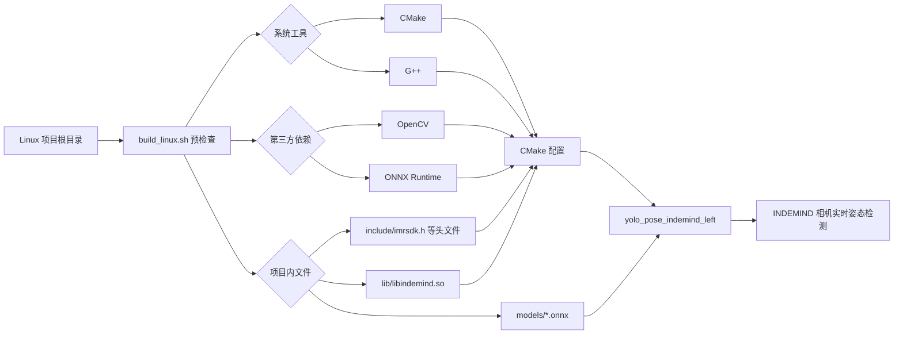
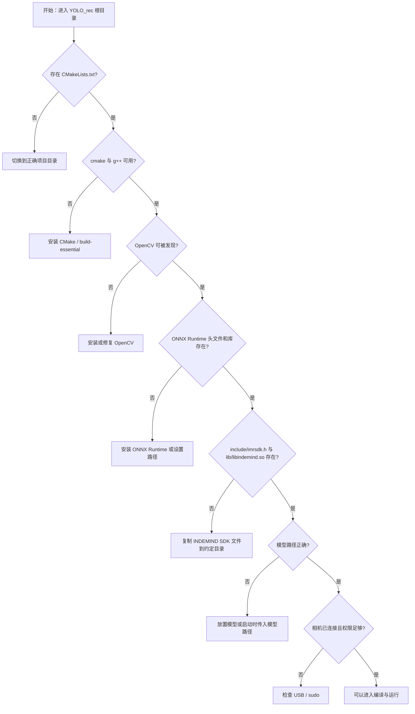

本页位于入门指南的第三站：**运行环境与依赖检查**。它只回答一个初学者最容易卡住的问题：在编译或运行 `yolo_pose_indemind_left` 之前，本机需要具备哪些系统工具、第三方库、SDK 文件、模型文件和运行权限。项目的构建入口明确要求 CMake 3.10 以上、C++14，并在 Linux 平台下识别为 `OS_LINUX`；Linux 构建脚本也从项目根目录、CMake、G++、OpenCV、ONNX Runtime、INDEMIND SDK 与模型文件开始逐项检查。Sources: [CMakeLists.txt](CMakeLists.txt#L6-L10), [CMakeLists.txt](CMakeLists.txt#L28-L40), [build_linux.sh](build_linux.sh#L32-L107)

## 架构假设与验证结论

从第一原则看，这个项目的运行环境可以拆成三层：**构建层**负责把 C++ 源码编译成可执行程序，**推理层**负责通过 OpenCV 与 ONNX Runtime 加载 YOLOv8-Pose 模型，**设备层**负责通过 INDEMIND SDK 访问相机。代码验证显示：CMake 会强制查找 OpenCV、ONNX Runtime 和 IMSEE/INDEMIND SDK，随后把这些依赖链接到唯一的运行目标 `yolo_pose_indemind_left`。Sources: [CMakeLists.txt](CMakeLists.txt#L58-L70), [CMakeLists.txt](CMakeLists.txt#L72-L130), [CMakeLists.txt](CMakeLists.txt#L132-L155), [CMakeLists.txt](CMakeLists.txt#L193-L211)

下面的 Mermaid 图展示的是**环境检查与可执行程序之间的依赖关系**：左侧是你需要准备的系统与文件，右侧是 CMake 最终生成并运行的目标。阅读时只需记住：任何一个必需项缺失，都会在配置、编译或启动阶段暴露出来。Sources: [CMakeLists.txt](CMakeLists.txt#L120-L155), [CMakeLists.txt](CMakeLists.txt#L207-L221), [build_linux.sh](build_linux.sh#L38-L107)



## 最小环境清单

最小可用环境由五类内容组成：CMake、C++ 编译器、OpenCV、ONNX Runtime、INDEMIND SDK 文件。构建脚本会先确认当前目录存在 `CMakeLists.txt`，再检查 `cmake` 与 `g++` 命令；CMake 配置阶段还会再次通过 `find_package(OpenCV REQUIRED)`、`find_path(ONNXRUNTIME_INCLUDE_DIR ...)`、`find_library(ONNXRUNTIME_LIB ...)` 和 SDK 文件存在性检查来阻止不完整环境继续构建。Sources: [build_linux.sh](build_linux.sh#L32-L52), [CMakeLists.txt](CMakeLists.txt#L62-L70), [CMakeLists.txt](CMakeLists.txt#L79-L118), [CMakeLists.txt](CMakeLists.txt#L144-L155)

| 类别 | 必需项 | 项目如何检查 | 缺失时的直接表现 |
|---|---|---|---|
| 构建工具 | `cmake` | `command -v cmake` | 脚本提示安装 CMake 后退出 |
| 编译器 | `g++` | `command -v g++` | 脚本提示安装 `build-essential` 后退出 |
| 视觉库 | OpenCV | `pkg-config --exists opencv` 与 CMake `find_package(OpenCV REQUIRED)` | 脚本警告；CMake 阶段找不到会失败 |
| 推理库 | ONNX Runtime | Conda 或 `/usr/local/lib/libonnxruntime.so`，CMake 还检查头文件与库文件 | CMake 报 `ONNX Runtime not found` |
| 相机 SDK | INDEMIND/IMSEE SDK | `include/` 与 `lib/libindemind.so` | 脚本或 CMake 报 SDK 文件缺失 |

上表中的“脚本检查”和“CMake 检查”不是重复劳动，而是两个不同阶段：脚本用于给初学者更早、更友好的提示，CMake 用于生成构建系统时做最终约束。脚本对 OpenCV 和 ONNX Runtime 在部分情况下允许用户选择继续，但 CMake 对 OpenCV、ONNX Runtime 和 SDK 文件使用的是必需检查，缺失会导致配置失败。Sources: [build_linux.sh](build_linux.sh#L54-L86), [CMakeLists.txt](CMakeLists.txt#L62-L70), [CMakeLists.txt](CMakeLists.txt#L120-L130), [CMakeLists.txt](CMakeLists.txt#L144-L155)

## 推荐的项目目录检查

运行环境不只包括系统包，也包括仓库内固定位置的文件。项目约定 SDK 头文件位于 `include/`，Linux 动态库位于 `lib/libindemind.so`，CMake 会把 `${PROJECT_SOURCE_DIR}/include` 作为 SDK 头文件目录，把 `${PROJECT_SOURCE_DIR}/lib` 作为 SDK 库目录，并在 Linux 下链接 `libindemind.so`。Sources: [CMakeLists.txt](CMakeLists.txt#L132-L142), [CMakeLists.txt](CMakeLists.txt#L160-L166), [CMakeLists.txt](CMakeLists.txt#L207-L211)

```text
YOLO_rec/
├── CMakeLists.txt              # CMake 构建入口
├── build_linux.sh              # Linux 预检查与构建脚本
├── include/                    # INDEMIND/IMSEE SDK 头文件目录
│   └── imrsdk.h                # CMake 明确检查的 SDK 头文件
├── lib/
│   └── libindemind.so          # Linux 下 CMake 明确链接的相机 SDK 动态库
├── models/
│   └── *.onnx                  # 运行时加载的 YOLOv8-Pose 模型
└── build_agent_out/
    └── yolo_pose_indemind_left # CMake 默认输出目录之一
```

这棵目录树只表达本页关注的环境约定：构建入口、Linux 脚本、SDK 头文件、SDK 动态库、模型目录和可执行文件输出位置。CMake 默认将 `YOLO_OUTPUT_DIR` 设置为项目下的 `build_agent_out`，目标名固定为 `yolo_pose_indemind_left`；如果你看到可执行程序没有出现在传统的 `build/` 目录，需要优先检查这个输出目录设定。Sources: [CMakeLists.txt](CMakeLists.txt#L12-L15), [CMakeLists.txt](CMakeLists.txt#L201-L205), [CMakeLists.txt](CMakeLists.txt#L249-L252)

## Linux 构建工具检查

初学者可以先在项目根目录执行脚本，因为脚本第一步就会验证自己是否位于包含 `CMakeLists.txt` 的项目目录；如果不在正确目录，它会直接报错并退出。随后脚本检查 `cmake` 和 `g++` 是否可用，缺失时分别提示安装 `cmake` 或 `build-essential`。Sources: [build_linux.sh](build_linux.sh#L32-L52)

```bash
cd /home/chris4/workspace/from_vm/YOLO_rec
./build_linux.sh
```

如果只想手动检查构建工具，可以分别运行 `cmake --version` 与 `g++ --version`；这与脚本内部使用 `command -v cmake`、`command -v g++` 的目的相同，都是确认命令是否存在于当前 shell 的 `PATH` 中。Sources: [build_linux.sh](build_linux.sh#L40-L52)

## OpenCV 检查

OpenCV 是必需依赖。脚本阶段使用 `pkg-config --exists opencv` 做快速检查，找不到时会提示安装 `libopencv-dev` 并询问是否继续；CMake 阶段使用 `find_package(OpenCV REQUIRED)`，成功后会输出 OpenCV 版本、头文件目录和库列表，失败则终止配置。Sources: [build_linux.sh](build_linux.sh#L54-L65), [CMakeLists.txt](CMakeLists.txt#L62-L70)

| 检查位置 | 检查方式 | 成功信息 | 失败处理 |
|---|---|---|---|
| `build_linux.sh` | `pkg-config --exists opencv` | 输出 `OpenCV found` 与版本号 | 警告并询问是否继续 |
| `CMakeLists.txt` | `find_package(OpenCV REQUIRED)` | 输出 `Found OpenCV`、Include、Libraries | `FATAL_ERROR` 终止配置 |

需要注意的是，脚本使用的 `pkg-config` 名称是 `opencv`，而 CMake 使用的是 OpenCV 的 CMake 查找机制；因此脚本警告并不必然等于 CMake 一定失败，但 CMake 的结果才是最终构建依据。Sources: [build_linux.sh](build_linux.sh#L54-L65), [CMakeLists.txt](CMakeLists.txt#L62-L70)

## ONNX Runtime 检查

ONNX Runtime 是 YOLOv8-Pose 推理所需的必需依赖。CMake 优先检查 Conda 环境：如果存在 `CONDA_PREFIX`，会在 `${CONDA_PREFIX}/include/onnxruntime`、`${CONDA_PREFIX}/include` 和 `${CONDA_PREFIX}/lib` 中查找头文件与库；如果未找到，再回退到 `/usr/local/include/onnxruntime`、`/usr/include/onnxruntime`、`/usr/local/lib`、`/usr/lib` 以及项目内 `onnxruntime` 目录。Sources: [CMakeLists.txt](CMakeLists.txt#L72-L118)

| 安装位置 | CMake 查找内容 | 适合场景 |
|---|---|---|
| Conda 环境 | `onnxruntime_cxx_api.h` 与 `libonnxruntime.so` | 使用 Conda 管理 CPU/GPU 推理库 |
| `/usr/local` 或 `/usr` | 系统级头文件与动态库 | 机器上统一安装 ONNX Runtime |
| 项目内 `onnxruntime/` | 项目随附头文件与库 | 将 ONNX Runtime 放入仓库附近 |

如果 CMake 同时找到了 `ONNXRUNTIME_INCLUDE_DIR` 和 `ONNXRUNTIME_LIB`，会输出对应路径；否则会报 `ONNX Runtime not found`，并提示 Linux 可运行安装脚本、Windows 可从 GitHub Release 下载，或手动设置 `ONNXRUNTIME_INCLUDE_DIR` 与 `ONNXRUNTIME_LIB`。Sources: [CMakeLists.txt](CMakeLists.txt#L120-L130)

当前仓库已有构建缓存显示，曾经成功解析到 `/usr/local/include/onnxruntime` 和 `/usr/local/lib/libonnxruntime.so`；这说明在该工作区的某次配置中，ONNX Runtime 使用的是系统级 `/usr/local` 安装路径。Sources: [CMakeCache.txt](build_agent_out/CMakeCache.txt#L227-L234)

## INDEMIND SDK 检查

INDEMIND/IMSEE SDK 是相机访问的必需依赖。CMake 将 SDK 头文件目录固定为 `${PROJECT_SOURCE_DIR}/include`，库目录固定为 `${PROJECT_SOURCE_DIR}/lib`；在 Linux 下，它期望库文件为 `${PROJECT_SOURCE_DIR}/lib/libindemind.so`。Sources: [CMakeLists.txt](CMakeLists.txt#L132-L142)

CMake 的 SDK 文件存在性检查非常具体：必须同时存在 `include/imrsdk.h` 和 `lib/libindemind.so`，才会输出 `Found IMSEE SDK`；否则会提示预期的头文件目录与库文件路径，并要求把 SDK 文件复制到这些位置。Sources: [CMakeLists.txt](CMakeLists.txt#L144-L155)

运行阶段也依赖 INDEMIND 相机初始化。主程序创建 `CIMRSDK`，设置配置项后调用 `m_pSDK->Init(config)`；如果初始化失败，程序会输出 `Failed to initialize INDEMIND SDK` 并返回错误。Sources: [get_pose_indemind_left.cpp](get_pose_indemind_left.cpp#L684-L698)

## 模型文件检查

模型文件属于运行时依赖，而不是 CMake 编译目标的一部分。主程序默认使用 `models/yolov8m-pose-1280.onnx`，如果启动命令提供了第一个参数，则改用该参数作为模型路径。Sources: [get_pose_indemind_left.cpp](get_pose_indemind_left.cpp#L672-L679)

```bash
sudo ./build/yolo_pose_indemind_left models/yolov8m-pose-1280.onnx
```

这里有一个初学者需要特别留意的环境一致性点：`build_linux.sh` 的预检查提示的是 `models/yolov8n-pose.onnx`，而主程序当前默认路径是 `models/yolov8m-pose-1280.onnx`；因此以“实际启动时传入的模型路径”和“主程序默认模型路径”为准检查文件更可靠。Sources: [build_linux.sh](build_linux.sh#L99-L107), [get_pose_indemind_left.cpp](get_pose_indemind_left.cpp#L675-L679)

## 动态库路径与运行权限

Linux 下目标程序会链接 `libindemind.so`、OpenCV 库和 ONNX Runtime 库，并额外链接 `pthread`。同时 CMake 为 Unix 平台设置了 `BUILD_RPATH` 和 `INSTALL_RPATH`，其中包含 SDK 的 `lib` 目录以及 `$ORIGIN/../lib`，用于帮助运行时定位项目内相机 SDK 动态库。Sources: [CMakeLists.txt](CMakeLists.txt#L207-L221)

相机访问通常还涉及 USB 设备权限。脚本构建成功后的提示要求确认 INDEMIND 相机已连接、使用 `lsusb` 检查 USB，并以 `sudo ./build/yolo_pose_indemind_left` 运行；程序内置说明也明确写到相机初始化失败时应检查相机连接、USB 权限并尝试使用 `sudo`。Sources: [build_linux.sh](build_linux.sh#L146-L152), [get_pose_indemind_left.cpp](get_pose_indemind_left.cpp#L1790-L1795), [get_pose_indemind_left.cpp](get_pose_indemind_left.cpp#L1807-L1809)

## 一次性检查流程

推荐初学者按下面顺序检查，因为它与项目脚本和 CMake 的失败顺序基本一致：先确认目录，再确认工具链，再确认库，再确认 SDK 文件，最后确认模型与相机。这样做的好处是每一步只排除一类问题，不会把“编译失败”“模型找不到”和“相机权限不足”混在一起。Sources: [build_linux.sh](build_linux.sh#L32-L107), [CMakeLists.txt](CMakeLists.txt#L62-L155), [get_pose_indemind_left.cpp](get_pose_indemind_left.cpp#L684-L698)



这个流程图不是额外规则，而是把脚本与 CMake 中已经存在的检查顺序可视化：脚本从项目目录和系统命令开始，随后检查 OpenCV、ONNX Runtime、`include/`、`lib/libindemind.so` 与模型；CMake 再对 OpenCV、ONNX Runtime 和 SDK 执行最终必需检查。Sources: [build_linux.sh](build_linux.sh#L32-L107), [CMakeLists.txt](CMakeLists.txt#L62-L155)

## 常见问题定位表

| 现象 | 优先检查 | 依据 |
|---|---|---|
| `CMakeLists.txt not found` | 是否在 `/home/chris4/workspace/from_vm/YOLO_rec` 项目根目录运行脚本 | 脚本要求当前目录存在 `CMakeLists.txt` |
| `CMake not found` | 是否安装并能执行 `cmake` | 脚本用 `command -v cmake` 检查 |
| `G++ not found` | 是否安装 `build-essential` 或等价 C++ 工具链 | 脚本用 `command -v g++` 检查 |
| `OpenCV not found` | OpenCV 是否安装，CMake 是否能找到 OpenCV | CMake 使用 `find_package(OpenCV REQUIRED)` |
| `ONNX Runtime not found` | 头文件 `onnxruntime_cxx_api.h` 与库 `libonnxruntime.so` 是否在 Conda、系统或手动路径中 | CMake 同时要求 include 与 library |
| `IMSEE SDK not found` | `include/imrsdk.h` 与 `lib/libindemind.so` 是否存在 | CMake 同时检查头文件与库 |
| `Failed to initialize INDEMIND SDK` | 相机连接、USB 权限、是否使用 `sudo` | 主程序初始化 SDK 失败会退出 |

这些定位项都来自项目中已有的显式检查与错误路径；处理时建议不要同时修改多处环境，而是按表格自上而下逐项验证。Sources: [build_linux.sh](build_linux.sh#L32-L107), [CMakeLists.txt](CMakeLists.txt#L62-L155), [get_pose_indemind_left.cpp](get_pose_indemind_left.cpp#L684-L698), [get_pose_indemind_left.cpp](get_pose_indemind_left.cpp#L1784-L1795)

## 下一步阅读

完成本页检查后，建议继续阅读 [模型文件、相机 SDK 与目录约定](4-mo-xing-wen-jian-xiang-ji-sdk-yu-mu-lu-yue-ding)，把模型、SDK 头文件和动态库的放置规则确认清楚；随后阅读 [编译、运行与常见启动参数](5-bian-yi-yun-xing-yu-chang-jian-qi-dong-can-shu)，再实际执行构建和启动。若你还没有跑通过整体流程，可先回到 [快速开始](2-kuai-su-kai-shi) 对照最短路径。Sources: [CMakeLists.txt](CMakeLists.txt#L258-L268), [build_linux.sh](build_linux.sh#L146-L153)