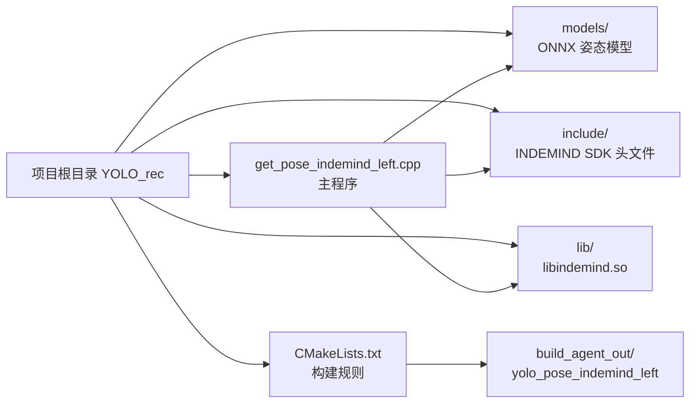

本页位于入门指南的第 4 页，目标是帮助初学者先把“文件放在哪里、程序默认找什么、哪些目录属于输入资源、哪些目录属于构建产物”理清楚。当前程序的核心约定可以从三条线索确认：CMake 固定从项目根目录下的 `include/` 与 `lib/` 查找 INDEMIND/IMSEE SDK，主程序默认使用 `models/yolov8m-pose-1280.onnx` 作为姿态模型，最终可执行文件默认输出到 `build_agent_out/`。Sources: [CMakeLists.txt](CMakeLists.txt#L132-L155), [get_pose_indemind_left.cpp](get_pose_indemind_left.cpp#L672-L679), [CMakeLists.txt](CMakeLists.txt#L12-L15)

## 先建立一个目录心智模型

从第一性原理看，这个项目的启动依赖分为三类：**模型文件**提供 YOLOv8-Pose 推理权重，**相机 SDK 文件**提供 INDEMIND 相机访问能力，**构建目录**保存 CMake/Make 生成的中间文件与可执行程序。你可以把项目根目录理解为运行时的“相对路径基准点”：主程序中的默认模型路径写成 `models/yolov8m-pose-1280.onnx`，CMake 中的 SDK 头文件路径写成 `${PROJECT_SOURCE_DIR}/include`，SDK 动态库路径写成 `${PROJECT_SOURCE_DIR}/lib`。Sources: [get_pose_indemind_left.cpp](get_pose_indemind_left.cpp#L675-L679), [CMakeLists.txt](CMakeLists.txt#L132-L142)



上图表达的是“资源先就位，构建再链接，运行再读取”的顺序：CMake 配置阶段会检查 `include/imrsdk.h` 和 `lib/libindemind.so` 是否存在；主程序运行阶段会读取默认或命令行传入的 ONNX 模型路径；构建产物则按照 `YOLO_OUTPUT_DIR` 输出到默认目录。Sources: [CMakeLists.txt](CMakeLists.txt#L144-L155), [get_pose_indemind_left.cpp](get_pose_indemind_left.cpp#L675-L679), [CMakeLists.txt](CMakeLists.txt#L201-L205)

## 推荐的项目结构视图

对初学者来说，最重要的是不要把“源码目录、资源目录、构建目录”混在一起。当前仓库中，`models/` 放模型，`include/` 放 SDK 头文件，`lib/` 放 SDK 动态库，`app/` 放应用辅助模块，根目录下的 `get_pose_indemind_left.cpp` 是当前可执行程序入口，`build*` 与 `cmake-build-debug/` 属于构建输出或 IDE 生成目录。Sources: [CMakeLists.txt](CMakeLists.txt#L160-L166), [CMakeLists.txt](CMakeLists.txt#L181-L199), [CMakeLists.txt](CMakeLists.txt#L201-L205)

```text
YOLO_rec/
├── models/
│   ├── yolov8m-pose-1280.onnx      # 当前主程序默认模型
│   ├── yolov8n-pose-1280.onnx      # 仓库内可选模型
│   └── yolov8n-pose-640.onnx       # 仓库内可选模型
├── include/
│   ├── imrsdk.h                    # SDK 主接口声明
│   ├── imrdata.h                   # SDK 数据结构
│   ├── types.h                     # SDK 类型与分辨率枚举
│   └── ...
├── lib/
│   └── libindemind.so              # Linux 下的 INDEMIND 动态库
├── app/
│   └── ...                         # 相机内参、深度、性能、运行状态辅助模块
├── get_pose_indemind_left.cpp      # 当前主程序入口
├── yolo_pose_detector.cpp/.h       # ONNX Runtime 推理封装
├── CMakeLists.txt                  # 构建与依赖查找规则
└── build_agent_out/
    └── yolo_pose_indemind_left     # CMake 默认输出位置
```

这份结构视图只反映当前仓库中可验证的约定：仓库内实际存在三个 ONNX 文件，SDK 头文件位于 `include/`，Linux 动态库位于 `lib/libindemind.so`，CMake 默认构建目标名为 `yolo_pose_indemind_left`。Sources: [CMakeLists.txt](CMakeLists.txt#L193-L205), [CMakeLists.txt](CMakeLists.txt#L207-L221), [CMakeLists.txt](CMakeLists.txt#L249-L251)

## 模型文件约定

当前主程序在启动时先设置默认模型路径为 `models/yolov8m-pose-1280.onnx`，如果启动命令携带了第一个参数，则用 `argv[1]` 覆盖这个默认值。因此，最稳妥的初学者做法是：先保持仓库根目录下的 `models/yolov8m-pose-1280.onnx` 不变；等确认程序能启动后，再通过命令行参数切换其他模型。Sources: [get_pose_indemind_left.cpp](get_pose_indemind_left.cpp#L672-L679)

| 模型文件 | 当前仓库状态 | 程序中的直接约定 | 初学者建议 |
|---|---:|---|---|
| `models/yolov8m-pose-1280.onnx` | 已在仓库结构中列出 | 主程序默认路径 | 首次运行优先保持不动 |
| `models/yolov8n-pose-1280.onnx` | 已在仓库结构中列出 | 可通过命令行参数传入 | 需要更小模型时再尝试 |
| `models/yolov8n-pose-640.onnx` | 已在仓库结构中列出 | 帮助文本和排错文本提到 | 与当前默认 1280 输入不同，切换时要同时理解输入尺寸影响 |

模型加载真正发生在 `YOLOPoseDetector::Init()` 中，它会把 `model_path_` 传给 `Ort::Session` 创建 ONNX Runtime 会话；构造检测器时，当前主程序传入的输入尺寸是 `1280`，置信度阈值是 `0.5f`，NMS IoU 阈值是 `0.45f`，并启用 CUDA 参数。Sources: [get_pose_indemind_left.cpp](get_pose_indemind_left.cpp#L720-L727), [yolo_pose_detector.cpp](yolo_pose_detector.cpp#L53-L62)

需要注意一个可验证的不一致点：`build_linux.sh` 检查的是 `models/yolov8n-pose.onnx`，但当前仓库结构中列出的模型文件是 `yolov8m-pose-1280.onnx`、`yolov8n-pose-1280.onnx`、`yolov8n-pose-640.onnx`，并且主程序默认路径是 `models/yolov8m-pose-1280.onnx`。因此，如果你使用脚本看到“YOLO model not found”警告，应优先回到主程序默认路径与仓库实际文件名进行核对。Sources: [build_linux.sh](build_linux.sh#L99-L107), [get_pose_indemind_left.cpp](get_pose_indemind_left.cpp#L675-L679)

## 相机 SDK 文件约定

CMake 将 INDEMIND/IMSEE SDK 的头文件目录固定为 `${PROJECT_SOURCE_DIR}/include`，动态库目录固定为 `${PROJECT_SOURCE_DIR}/lib`；Linux 下期望的库文件名是 `libindemind.so`，Windows 分支则写有 `indemind.lib` 与 `indemind.dll` 的变量。当前运行环境是 Linux，因此本页重点关注 `include/imrsdk.h` 与 `lib/libindemind.so`。Sources: [CMakeLists.txt](CMakeLists.txt#L132-L142)

| SDK 文件或目录 | CMake 期望位置 | 用途 | 缺失时表现 |
|---|---|---|---|
| `include/imrsdk.h` | `${PROJECT_SOURCE_DIR}/include/imrsdk.h` | SDK 主接口声明 | CMake 直接报 IMSEE SDK not found |
| `include/imrdata.h` | 由主程序和 SDK 头文件包含 | SDK 数据结构声明 | 编译阶段无法解析相关类型 |
| `include/types.h` | 由主程序和 SDK 头文件包含 | 分辨率、深度模式、相机参数等类型 | 编译阶段无法解析相关枚举或结构 |
| `lib/libindemind.so` | `${PROJECT_SOURCE_DIR}/lib/libindemind.so` | Linux 动态链接库 | CMake 直接报 IMSEE SDK not found |

SDK 接口层面，`imrsdk.h` 定义了 `CIMRSDK` 类，它提供 `Init()`、`Release()`、相机图像回调注册、深度图回调注册以及深度处理器启用等接口；主程序正是通过 `new CIMRSDK()` 创建 SDK 对象，再用 `MRCONFIG` 设置图像分辨率、图像频率、IMU 频率等启动参数。Sources: [include/imrsdk.h](include/imrsdk.h#L164-L180), [include/imrsdk.h](include/imrsdk.h#L220-L250), [get_pose_indemind_left.cpp](get_pose_indemind_left.cpp#L684-L693)

当前主程序的相机配置非常明确：关闭 SLAM，设置图像分辨率为 `IMG_1280`，图像频率为 `50`，IMU 频率为 `0`；随后通过 `GetModuleParams()` 读取左相机在 `RES_1280X800` 下的参数，并从 `_K` 中取出 `fx`、`fy`、`cx`、`cy` 组成左相机内参矩阵。Sources: [get_pose_indemind_left.cpp](get_pose_indemind_left.cpp#L684-L713), [include/imrsdk.h](include/imrsdk.h#L108-L143), [include/types.h](include/types.h#L36-L38)

## 运行时从 SDK 取哪些数据

在当前程序中，相机图像回调只使用左目图像，右目图像被显式忽略；如果左目图像是单通道灰度图，程序会转换成 BGR 图像再送入 YOLO 检测器，因为检测器接口说明输入图像是 BGR。这个约定解释了为什么页面标题强调“相机 SDK 与目录约定”，而不是深入讲图像预处理细节：初学者只需要知道左目图像来自 SDK，模型推理接收的是 BGR 图像。Sources: [get_pose_indemind_left.cpp](get_pose_indemind_left.cpp#L763-L787), [yolo_pose_detector.h](yolo_pose_detector.h#L85-L90)

程序还会尝试调用 `EnableDepthProcessor()` 并注册深度图回调；如果启用成功，深度回调会把 SDK 返回的深度从米转换为毫米并放入缓冲区。这里的重点不是深度算法，而是目录与 SDK 约定：深度能力来自 `libindemind.so` 对应的 SDK 实现，头文件中只声明了启用深度处理器与注册深度回调的接口。Sources: [get_pose_indemind_left.cpp](get_pose_indemind_left.cpp#L789-L807), [include/imrsdk.h](include/imrsdk.h#L245-L250), [include/imrsdk.h](include/imrsdk.h#L408-L414)

## 构建输出目录约定

CMake 顶部定义了 `YOLO_OUTPUT_DIR`，如果外部没有传入这个变量，就默认设为 `${PROJECT_SOURCE_DIR}/build_agent_out`；随后 `set_target_properties()` 将 `yolo_pose_indemind_left` 的运行时输出目录设置为这个变量。因此，在当前 CMake 规则下，默认可执行文件位置不是传统的 `build/yolo_pose_indemind_left`，而是 `build_agent_out/yolo_pose_indemind_left`。Sources: [CMakeLists.txt](CMakeLists.txt#L12-L15), [CMakeLists.txt](CMakeLists.txt#L201-L205)

| 目录 | 类型 | 当前约定 |
|---|---|---|
| `build/` | 构建目录 | `build_linux.sh` 会创建并进入该目录执行 `cmake ..` 与 `make` |
| `build_agent_out/` | 可执行文件输出目录 | CMake 默认 `YOLO_OUTPUT_DIR` 指向这里 |
| `cmake-build-debug/` | IDE/调试构建目录 | 仓库结构中存在，但不是 CMakeLists 默认输出说明中的目标目录 |
| `models/` | 运行时资源目录 | 主程序默认从这里读取 ONNX 模型 |
| `include/` 与 `lib/` | SDK 依赖目录 | CMake 配置阶段检查这里的 SDK 文件 |

这里还有第二个初学者容易踩到的可验证不一致点：`build_linux.sh` 最后提示可执行文件在 `build/yolo_pose_indemind_left`，但 CMake 当前默认输出目录是 `build_agent_out`。如果你使用脚本构建后在 `build/` 下找不到可执行文件，应检查 `build_agent_out/yolo_pose_indemind_left`，或者查看 CMake 输出中的 `Output directory`。Sources: [build_linux.sh](build_linux.sh#L141-L152), [CMakeLists.txt](CMakeLists.txt#L201-L205), [CMakeLists.txt](CMakeLists.txt#L249-L251)

## 启动命令与相对路径

主程序的模型路径是相对路径，所以建议从项目根目录启动程序，而不是从任意目录启动。CMake 的运行提示写的是 Linux 下使用 `sudo ./build/yolo_pose_indemind_left`，源码帮助文本也写有 `sudo ./build/yolo_pose_indemind_left [model_path]`，但结合当前 `YOLO_OUTPUT_DIR`，实际可执行文件默认位置应以 CMake 输出配置为准。Sources: [get_pose_indemind_left.cpp](get_pose_indemind_left.cpp#L1684-L1688), [CMakeLists.txt](CMakeLists.txt#L263-L268), [CMakeLists.txt](CMakeLists.txt#L201-L205)

如果使用默认模型，可以按“在项目根目录执行可执行文件”的思路组织命令；如果要指定模型，则把模型路径作为第一个参数传入，例如 `models/yolov8n-pose-1280.onnx`。主程序只读取 `argv[1]` 作为模型路径，没有在这里解析更多启动参数。Sources: [get_pose_indemind_left.cpp](get_pose_indemind_left.cpp#L672-L679)

## 初学者检查清单

开始编译或运行前，先检查三个基础资源：`models/` 下是否有你要用的 `.onnx` 文件，`include/` 下是否有 `imrsdk.h` 等 SDK 头文件，`lib/` 下是否有 `libindemind.so`。CMake 对 SDK 文件是硬检查，模型文件则由程序运行时交给 ONNX Runtime 加载。Sources: [CMakeLists.txt](CMakeLists.txt#L144-L155), [yolo_pose_detector.cpp](yolo_pose_detector.cpp#L53-L62)

| 检查项 | 应看到的结果 | 如果不满足，优先处理 |
|---|---|---|
| SDK 头文件 | `include/imrsdk.h` 存在 | 将 SDK 头文件放回 `include/` |
| SDK 动态库 | `lib/libindemind.so` 存在 | 将 Linux 动态库放回 `lib/` |
| 默认模型 | `models/yolov8m-pose-1280.onnx` 存在 | 保持默认文件名，或运行时传入其他模型路径 |
| 输出目录 | `build_agent_out/yolo_pose_indemind_left` | 根据 CMake 的 `YOLO_OUTPUT_DIR` 查找可执行文件 |
| 启动位置 | 从项目根目录启动 | 避免相对模型路径解析失败 |

如果程序提示检测器初始化失败，源码中的排错文本要求检查 ONNX Runtime 安装和模型文件是否存在；如果相机初始化失败，排错文本要求检查 INDEMIND 相机连接、USB 权限，并尝试使用 `sudo` 启动。Sources: [get_pose_indemind_left.cpp](get_pose_indemind_left.cpp#L1784-L1795)

## 下一步阅读建议

完成本页后，建议先读 [编译、运行与常见启动参数](5-bian-yi-yun-xing-yu-chang-jian-qi-dong-can-shu)，把这里的目录约定转化为实际命令；再读 [实时界面、鼠标选区与键盘操作](6-shi-shi-jie-mian-shu-biao-xuan-qu-yu-jian-pan-cao-zuo)，理解程序启动后的界面交互；如果你想验证最小推理闭环，再进入 [从左目图像到人体关键点的最小闭环](7-cong-zuo-mu-tu-xiang-dao-ren-ti-guan-jian-dian-de-zui-xiao-bi-huan)。Sources: [get_pose_indemind_left.cpp](get_pose_indemind_left.cpp#L809-L820), [get_pose_indemind_left.cpp](get_pose_indemind_left.cpp#L1690-L1700)