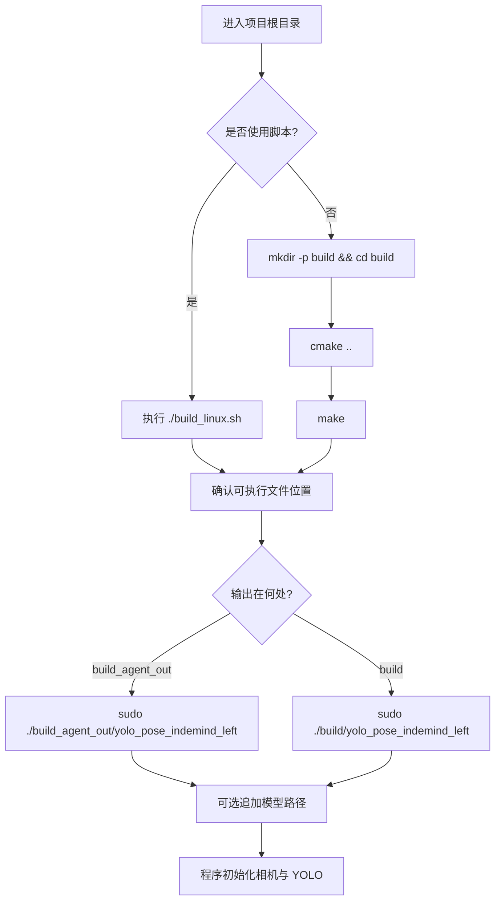

本页聚焦“从源码到可运行程序”的最小路径：先确认构建入口，再理解 CMake 生成的可执行文件位置，最后掌握唯一的命令行启动参数——可选的 ONNX 模型路径。当前程序入口是 `get_pose_indemind_left.cpp` 中的 `main(int argc, char **argv)`，默认模型路径写死为 `models/yolov8m-pose-1280.onnx`，当命令行传入第一个参数时会覆盖该默认值；推理器随后以输入尺寸 `1280`、置信度阈值 `0.5`、IoU 阈值 `0.45`、CUDA 开关 `true` 初始化。Sources: [get_pose_indemind_left.cpp](get_pose_indemind_left.cpp#L672-L723)

## 1. 架构假设与验证结论

从第一原则看，编译运行链路只需要回答三个问题：**编译什么目标**、**链接哪些依赖**、**运行时如何选择模型**。代码验证后可以确认：CMake 只定义了一个主要可执行目标 `yolo_pose_indemind_left`，它由 `get_pose_indemind_left.cpp`、YOLO 推理公共源码、姿态工具源码以及 `app/` 下的运行时辅助模块共同构成；运行时没有复杂参数解析，只读取 `argv[1]` 作为模型路径。Sources: [CMakeLists.txt](CMakeLists.txt#L171-L199), [get_pose_indemind_left.cpp](get_pose_indemind_left.cpp#L672-L679)

```mermaid
flowchart TD
    A[项目根目录] --> B[CMakeLists.txt]
    B --> C[查找 OpenCV]
    B --> D[查找 ONNX Runtime]
    B --> E[查找 INDEMIND SDK]
    C --> F[构建 yolo_pose_indemind_left]
    D --> F
    E --> F
    F --> G[启动程序]
    G --> H{是否传入 argv[1]?}
    H -- 否 --> I[使用默认 models/yolov8m-pose-1280.onnx]
    H -- 是 --> J[使用用户指定模型路径]
    I --> K[初始化 INDEMIND 相机与 YOLO 推理器]
    J --> K
```

上图中的关键点是：构建阶段由 CMake 负责发现 OpenCV、ONNX Runtime 和 INDEMIND SDK；运行阶段只允许通过第一个位置参数切换模型文件，其他推理参数目前在源码中固定。Sources: [CMakeLists.txt](CMakeLists.txt#L62-L155), [get_pose_indemind_left.cpp](get_pose_indemind_left.cpp#L675-L723)

## 2. 编译前目录与依赖检查

初学者应从项目根目录运行构建命令，因为 `build_linux.sh` 会显式检查当前目录是否存在 `CMakeLists.txt`，如果找不到就报错退出。脚本还会检查 `cmake`、`g++`、OpenCV、ONNX Runtime、`include/` 目录和 `lib/libindemind.so`；其中 OpenCV 和 ONNX Runtime 找不到时脚本会提示并询问是否继续，而 `include/` 和 `lib/libindemind.so` 缺失会直接失败。Sources: [build_linux.sh](build_linux.sh#L32-L107)

项目中与本页直接相关的目录可以按下面方式理解：`CMakeLists.txt` 是构建入口，`build_linux.sh` 是 Linux 构建脚本，`include/` 和 `lib/` 存放 INDEMIND SDK 头文件与动态库，`models/` 存放 ONNX 模型，`get_pose_indemind_left.cpp` 是程序入口，`yolo_pose_detector.cpp/.h` 是 ONNX Runtime 推理封装。Sources: [CMakeLists.txt](CMakeLists.txt#L132-L166), [CMakeLists.txt](CMakeLists.txt#L171-L199), [yolo_pose_detector.cpp](yolo_pose_detector.cpp#L10-L47)

```text
YOLO_rec/
├── CMakeLists.txt              # CMake 构建入口
├── build_linux.sh              # Linux 构建脚本
├── get_pose_indemind_left.cpp  # main() 与运行入口
├── yolo_pose_detector.cpp      # YOLO Pose 推理实现
├── yolo_pose_detector.h        # 推理器接口声明
├── include/                    # INDEMIND SDK 头文件目录
├── lib/
│   └── libindemind.so          # INDEMIND SDK Linux 动态库
├── models/                     # ONNX 模型目录
└── app/                        # 相机、深度、性能、运行状态辅助模块
```

CMake 对 INDEMIND SDK 的目录约定是固定的：头文件从 `${PROJECT_SOURCE_DIR}/include` 查找，Linux 动态库从 `${PROJECT_SOURCE_DIR}/lib/libindemind.so` 查找；如果 `imrsdk.h` 或动态库不存在，配置阶段会 `FATAL_ERROR`。Sources: [CMakeLists.txt](CMakeLists.txt#L132-L155)

## 3. 推荐编译方式

最直接的手动编译方式是在项目根目录创建构建目录、进入构建目录、执行 `cmake ..`，然后执行 `make`。CMake 文件本身也在配置摘要中打印了同样的构建步骤：`mkdir -p build && cd build`、`cmake ..`、`make`。Sources: [CMakeLists.txt](CMakeLists.txt#L258-L261)

```bash
mkdir -p build
cd build
cmake ..
make
```

需要注意一个对初学者很重要的细节：当前 CMake 默认把可执行文件输出到 `${PROJECT_SOURCE_DIR}/build_agent_out`，除非配置时显式传入 `-DYOLO_OUTPUT_DIR=...` 覆盖；目标名固定为 `yolo_pose_indemind_left`。因此，执行普通 `cmake .. && make` 后，优先到项目根目录下的 `build_agent_out/yolo_pose_indemind_left` 查找生成结果。Sources: [CMakeLists.txt](CMakeLists.txt#L12-L15), [CMakeLists.txt](CMakeLists.txt#L201-L205)

如果你希望可执行文件生成到传统的 `build/` 目录内，可以在配置时覆盖输出目录，例如在 `build/` 目录中执行 `cmake -DYOLO_OUTPUT_DIR="$PWD" ..`，这样目标的 `RUNTIME_OUTPUT_DIRECTORY` 就会指向当前构建目录。这个行为来自 CMake 中可覆盖的 `YOLO_OUTPUT_DIR` 变量与目标输出目录设置。Sources: [CMakeLists.txt](CMakeLists.txt#L12-L15), [CMakeLists.txt](CMakeLists.txt#L201-L204)

| 编译方式 | 命令位置 | 输出位置 | 适合场景 |
|---|---:|---|---|
| 默认 CMake | `build/` | `../build_agent_out/yolo_pose_indemind_left` | 接受项目默认输出目录 |
| 指定输出目录 | `build/` | `build/yolo_pose_indemind_left` | 希望运行命令与构建目录一致 |
| `build_linux.sh` | 项目根目录 | 受 CMake 默认输出目录影响 | 希望脚本自动检查依赖 |

`build_linux.sh` 会自动清理旧 `build/`、重新创建 `build/`、执行 `cmake ..` 和 `make -j$(nproc)`；但脚本末尾打印的运行路径是 `sudo ./build/yolo_pose_indemind_left`，而当前 CMake 默认输出目录是 `build_agent_out`，两者存在不一致。初学者遇到“脚本成功但 build/ 下没有可执行文件”时，应优先根据 CMake 的 `Output directory` 信息或 `build_agent_out/` 查找。Sources: [build_linux.sh](build_linux.sh#L110-L153), [CMakeLists.txt](CMakeLists.txt#L246-L267)

## 4. 构建目标与链接内容

当前项目的核心构建目标只有 `yolo_pose_indemind_left`，它链接三个主要依赖：INDEMIND SDK 动态库、OpenCV 库、ONNX Runtime 库；在 Linux 或其他 Unix 非 Apple 平台上还会额外链接 `pthread`。Sources: [CMakeLists.txt](CMakeLists.txt#L193-L215)

| 构建项 | CMake 中的证据 | 作用 |
|---|---|---|
| `yolo_pose_indemind_left` | `add_executable(...)` | 生成主程序 |
| `${IMSEE_LIB}` | `target_link_libraries(...)` | 接入 INDEMIND 相机 SDK |
| `${OpenCV_LIBS}` | `target_link_libraries(...)` | 图像显示、图像处理、窗口交互 |
| `${ONNXRUNTIME_LIB}` | `target_link_libraries(...)` | 加载并执行 ONNX 姿态模型 |
| `pthread` | Unix 条件链接 | 支持线程相关运行环境 |

CMake 还为 Unix 平台设置了运行时库搜索路径：`BUILD_RPATH` 指向 INDEMIND SDK 的 `lib/` 目录，`INSTALL_RPATH` 包含 SDK `lib/` 与 `$ORIGIN/../lib`。这意味着程序在构建目录附近运行时，会按这些路径寻找动态库。Sources: [CMakeLists.txt](CMakeLists.txt#L217-L222)

## 5. 启动命令

如果使用 CMake 默认输出目录，启动命令通常是从项目根目录执行 `sudo ./build_agent_out/yolo_pose_indemind_left`；如果你配置时把输出目录改成了 `build/`，则可以执行 `sudo ./build/yolo_pose_indemind_left`。项目中的 CMake 摘要和脚本均提示 Linux 下以 `sudo` 启动，源码注释也说明相机访问需要 sudo 权限。Sources: [CMakeLists.txt](CMakeLists.txt#L263-L268), [build_linux.sh](build_linux.sh#L146-L151), [get_pose_indemind_left.cpp](get_pose_indemind_left.cpp#L1807-L1809)

```bash
# 默认 CMake 输出目录
sudo ./build_agent_out/yolo_pose_indemind_left

# 如果配置时使用 cmake -DYOLO_OUTPUT_DIR="$PWD" ..
sudo ./build/yolo_pose_indemind_left
```

程序启动后会先打印标题，说明使用 INDEMIND 左目 RGB 图像；随后初始化 SDK，配置项包括关闭 SLAM、图像分辨率 `IMG_1280`、图像频率 `50`、IMU 频率 `0`。SDK 初始化失败时，程序会打印 `ERROR: Failed to initialize INDEMIND SDK!` 并返回 `-1`。Sources: [get_pose_indemind_left.cpp](get_pose_indemind_left.cpp#L681-L698)

## 6. 常见启动参数

当前程序只有一个命令行位置参数：`[model_path]`。如果不传参数，使用默认模型 `models/yolov8m-pose-1280.onnx`；如果传入第一个参数，程序把它作为模型路径传给 `YOLOPoseDetector`。源码中没有解析 `--help`、`--conf`、`--iou`、`--cpu` 这类命名参数。Sources: [get_pose_indemind_left.cpp](get_pose_indemind_left.cpp#L672-L679), [get_pose_indemind_left.cpp](get_pose_indemind_left.cpp#L720-L723)

| 启动方式 | 示例 | 实际效果 |
|---|---|---|
| 使用默认模型 | `sudo ./build_agent_out/yolo_pose_indemind_left` | 加载 `models/yolov8m-pose-1280.onnx` |
| 指定模型路径 | `sudo ./build_agent_out/yolo_pose_indemind_left models/yolov8n-pose-640.onnx` | 用 `argv[1]` 覆盖默认模型路径 |
| 指定其他 ONNX 文件 | `sudo ./build_agent_out/yolo_pose_indemind_left /path/to/model.onnx` | 尝试加载给定路径的模型 |

虽然源码尾部的大段使用说明注释写到默认模型是 `models/yolov8n-pose-640.onnx`，但 `main()` 中真正生效的默认值是 `models/yolov8m-pose-1280.onnx`。编写启动命令时应以 `main()` 的实际赋值为准。Sources: [get_pose_indemind_left.cpp](get_pose_indemind_left.cpp#L675-L679), [get_pose_indemind_left.cpp](get_pose_indemind_left.cpp#L1684-L1688)

推理器的其他关键参数目前不是启动参数，而是在代码中固定：输入尺寸为 `1280`，置信度阈值为 `0.5f`，NMS IoU 阈值为 `0.45f`，CUDA 标志为 `true`。如果 CUDA Provider 配置失败，推理器构造逻辑会捕获 ONNX Runtime 异常并回退到 CPU 执行。Sources: [get_pose_indemind_left.cpp](get_pose_indemind_left.cpp#L720-L723), [yolo_pose_detector.cpp](yolo_pose_detector.cpp#L10-L47)

## 7. 从编译到运行的步骤图

下面的流程适合第一次上手：先站在项目根目录确认依赖，再选择默认输出或指定输出目录，然后运行程序并观察窗口是否出现。这里不展开实时界面和键盘操作细节，那些内容属于下一页 [实时界面、鼠标选区与键盘操作](6-shi-shi-jie-mian-shu-biao-xuan-qu-yu-jian-pan-cao-zuo)。Sources: [build_linux.sh](build_linux.sh#L32-L107), [CMakeLists.txt](CMakeLists.txt#L258-L267), [get_pose_indemind_left.cpp](get_pose_indemind_left.cpp#L1490-L1505)



启动后程序会创建主显示窗口 `"YOLO Pose - INDEMIND Left Camera"` 和指标窗口 `"Body Frame Metrics"`；如果有深度数据，还会通过 `DepthRegion` 显示区域细节。退出时程序会销毁窗口，并打印总运行时间、采集图像数、深度图数量、姿态检测次数、丢帧统计和平均速率。Sources: [get_pose_indemind_left.cpp](get_pose_indemind_left.cpp#L1490-L1518), [get_pose_indemind_left.cpp](get_pose_indemind_left.cpp#L1621-L1645)

## 8. 启动后的基础按键

本页只列出启动验证时最常用的按键：`q` 或 `ESC` 退出，`k` 开关关键点，`t` 开关骨架，`i` 开关信息叠加，空格保存当前帧，`l` 开关髋点坐标记录。更完整的界面、鼠标选区和键盘行为应继续阅读 [实时界面、鼠标选区与键盘操作](6-shi-shi-jie-mian-shu-biao-xuan-qu-yu-jian-pan-cao-zuo)。Sources: [get_pose_indemind_left.cpp](get_pose_indemind_left.cpp#L809-L824), [get_pose_indemind_left.cpp](get_pose_indemind_left.cpp#L1532-L1580)

| 按键 | 启动验证时的用途 | 代码行为 |
|---|---|---|
| `q` / `ESC` | 退出程序 | 跳出主循环 |
| `k` | 显示或隐藏关键点 | 切换 `show_keypoints` |
| `t` | 显示或隐藏骨架 | 切换 `show_skeleton` |
| `i` | 显示或隐藏信息层 | 切换 `show_info` |
| 空格 | 保存当前帧 | 写出 `pose_frame_XXXX.jpg` |
| `l` | 记录髋点坐标 | 创建 `hip_coords_时间.csv` 并写入表头 |

`l` 键保存的是髋点坐标 CSV，文件名格式为 `hip_coords_YYYYMMDD_HHMMSS.csv`，表头包含 `frame,timestamp_ms,person_id,cam_x,cam_y,cam_z,new_x,new_y,new_z`；空格键保存的是当前左目图像，文件名格式为 `pose_frame_0000.jpg`、`pose_frame_0001.jpg` 递增。Sources: [get_pose_indemind_left.cpp](get_pose_indemind_left.cpp#L1545-L1580)

## 9. 常见问题排查

如果 CMake 阶段报 OpenCV 找不到，说明 `find_package(OpenCV REQUIRED)` 未能成功；如果 ONNX Runtime 找不到，CMake 会提示安装 ONNX Runtime 或手动设置 `ONNXRUNTIME_INCLUDE_DIR` 与 `ONNXRUNTIME_LIB`；如果 INDEMIND SDK 找不到，CMake 会提示期望的头文件目录和库文件路径。Sources: [CMakeLists.txt](CMakeLists.txt#L62-L130), [CMakeLists.txt](CMakeLists.txt#L132-L155)

| 现象 | 优先检查 | 依据 |
|---|---|---|
| `OpenCV not found` | 是否安装 OpenCV 开发包 | CMake 使用 `find_package(OpenCV REQUIRED)` |
| `ONNX Runtime not found` | Conda 环境或系统路径下是否有头文件和库 | CMake 先查 `CONDA_PREFIX`，再查系统路径 |
| `IMSEE SDK not found` | `include/imrsdk.h` 与 `lib/libindemind.so` 是否存在 | CMake 固定检查这两个位置 |
| 启动后相机初始化失败 | 是否连接 INDEMIND 相机、是否使用 sudo | 程序初始化 SDK 失败会直接返回 |
| 找不到可执行文件 | 查看 CMake 输出目录是否为 `build_agent_out` | 当前默认 `YOLO_OUTPUT_DIR` 指向 `build_agent_out` |

如果程序提示 `Failed to initialize YOLO Pose Detector!`，优先检查模型路径是否正确、ONNX Runtime 是否可用。推理器初始化时会打印模型路径、输入尺寸、输入输出信息；ONNX Runtime Session 创建失败会导致初始化失败并返回 `false`。Sources: [get_pose_indemind_left.cpp](get_pose_indemind_left.cpp#L720-L727), [yolo_pose_detector.cpp](yolo_pose_detector.cpp#L53-L90)

如果启动后低帧率或 CUDA 不可用，不要先改启动参数，因为当前没有 CPU/GPU 命令行开关。代码中默认请求 CUDA Provider；如果配置 CUDA Provider 失败，会打印警告并回退到 CPU。需要进一步理解推理器内部行为时，继续阅读 [YOLOv8-Pose ONNX 推理器设计](12-yolov8-pose-onnx-tui-li-qi-she-ji)。Sources: [get_pose_indemind_left.cpp](get_pose_indemind_left.cpp#L720-L723), [yolo_pose_detector.cpp](yolo_pose_detector.cpp#L31-L47)

## 10. 建议阅读顺序

完成本页后，建议先阅读 [实时界面、鼠标选区与键盘操作](6-shi-shi-jie-mian-shu-biao-xuan-qu-yu-jian-pan-cao-zuo)，因为它承接本页的启动结果，解释窗口、鼠标和按键如何使用；随后进入 [从左目图像到人体关键点的最小闭环](7-cong-zuo-mu-tu-xiang-dao-ren-ti-guan-jian-dian-de-zui-xiao-bi-huan)，验证从相机图像到 2D 关键点的最小链路；如果你要理解 CMake 的目标、依赖和链接细节，再阅读 [CMake 构建目标与第三方依赖链接](11-cmake-gou-jian-mu-biao-yu-di-san-fang-yi-lai-lian-jie)。Sources: [CMakeLists.txt](CMakeLists.txt#L193-L222), [get_pose_indemind_left.cpp](get_pose_indemind_left.cpp#L809-L824), [get_pose_indemind_left.cpp](get_pose_indemind_left.cpp#L1490-L1505)