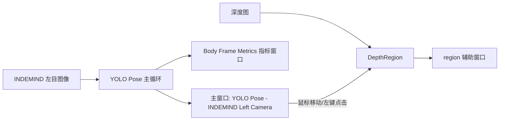
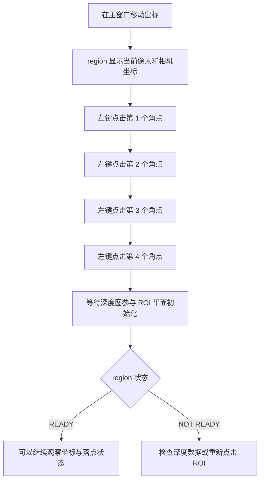
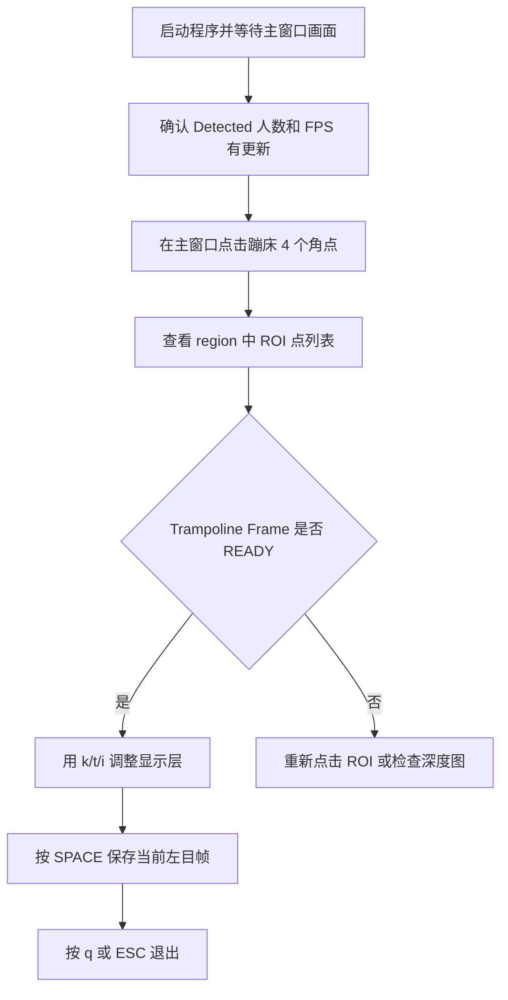

本页位于入门指南的第 6 页，聚焦程序启动后的**实时 OpenCV 界面**、**鼠标 ROI 选区**与**键盘快捷键**。阅读目标很简单：你应该能看懂主窗口和辅助窗口分别显示什么，知道如何用鼠标点击 4 个角点完成蹦床床面 ROI 选择，并掌握运行时开关显示、截图、录制与调参的基本操作。Sources: [get_pose_indemind_left.cpp](get_pose_indemind_left.cpp#L809-L824), [app/depth_region.h](app/depth_region.h#L45-L80)

## 先建立界面心智模型

程序运行后主要围绕三个 OpenCV 窗口工作：主窗口 `"YOLO Pose - INDEMIND Left Camera"` 显示左目图像、姿态可视化、性能指标和录制状态；辅助窗口 `"region"` 在有鼠标交互和深度数据时显示鼠标位置、相机坐标、ROI 点、平面状态、检测参数与落点摘要；指标窗口 `"Body Frame Metrics"` 显示身体姿态相关的运行指标。主窗口和身体指标窗口由主循环直接 `imshow`，`region` 窗口由 `DepthRegion::ShowElems()` 创建并显示。Sources: [get_pose_indemind_left.cpp](get_pose_indemind_left.cpp#L1458-L1505), [app/depth_region.h](app/depth_region.h#L96-L108), [app/depth_region.h](app/depth_region.h#L174-L181), [app/depth_region.h](app/depth_region.h#L281-L281)



Sources: [get_pose_indemind_left.cpp](get_pose_indemind_left.cpp#L789-L807), [get_pose_indemind_left.cpp](get_pose_indemind_left.cpp#L1299-L1300), [get_pose_indemind_left.cpp](get_pose_indemind_left.cpp#L1502-L1517), [app/depth_region.h](app/depth_region.h#L50-L80)

## 可视化窗口一览

| 窗口名称 | 何时出现 | 主要用途 | 初学者应关注什么 |
|---|---:|---|---|
| `YOLO Pose - INDEMIND Left Camera` | 有左目图像时 | 显示人体检测、关键点、骨架、FPS、推理耗时、同步误差、人数、录制状态 | 这是主要操作窗口，鼠标 ROI 点击也绑定在这里 |
| `region` | 鼠标交互后且有深度数据时 | 显示当前鼠标深度坐标、相机坐标、ROI 点、蹦床坐标系状态、参数和落点信息 | 点击 4 个角点后看这里确认 `Trampoline Frame: READY` |
| `Body Frame Metrics` | 主循环显示图像时 | 显示蹦床坐标系状态、跟踪对象、姿态角、姿态分类和 3D 关键点摘要 | 入门阶段主要看 `Trampoline frame: READY / NOT READY` |

Sources: [get_pose_indemind_left.cpp](get_pose_indemind_left.cpp#L918-L969), [get_pose_indemind_left.cpp](get_pose_indemind_left.cpp#L1358-L1424), [get_pose_indemind_left.cpp](get_pose_indemind_left.cpp#L1502-L1517), [app/depth_region.h](app/depth_region.h#L136-L191)

## 主窗口显示内容

主窗口的基础图像来自左目相机帧，程序先复制 `left_image` 得到 `display`，再调用 `DrawPoses()` 绘制姿态结果；是否显示关键点和骨架由 `show_keypoints`、`show_skeleton` 两个布尔开关控制，是否显示检测信息由 `show_info` 控制。默认状态下，关键点、骨架和信息叠加均为开启。Sources: [get_pose_indemind_left.cpp](get_pose_indemind_left.cpp#L826-L830), [get_pose_indemind_left.cpp](get_pose_indemind_left.cpp#L918-L925)

主窗口左下角显示实时性能与检测摘要，包括 FPS、推理耗时、RGB 与深度帧同步误差、检测到的人数；左上角显示 `"INDEMIND LEFT"`，右上角用 `[KSI]` 这类字母组合提示当前开启的显示层，其中 `K` 表示关键点、`S` 表示骨架、`I` 表示信息叠加。Sources: [get_pose_indemind_left.cpp](get_pose_indemind_left.cpp#L927-L963)

主窗口还会显示录制状态：普通髋点 CSV 录制开启时显示 `[REC]`，落点录制开关开启时右上角状态面板显示 `REC: ON`，并显示落点数量 `LP` 以及最后一个落点坐标摘要。Sources: [get_pose_indemind_left.cpp](get_pose_indemind_left.cpp#L965-L969), [get_pose_indemind_left.cpp](get_pose_indemind_left.cpp#L1302-L1330)

## 鼠标交互：4 次左键点击完成 ROI

鼠标回调绑定在主窗口 `"YOLO Pose - INDEMIND Left Camera"` 上，因此你需要在主窗口里移动鼠标和点击。`DepthRegion::OnMouse()` 只处理两类事件：鼠标移动 `EVENT_MOUSEMOVE` 和左键按下 `EVENT_LBUTTONDOWN`；移动鼠标会更新当前像素位置，左键点击会把当前位置记录为 ROI 点。Sources: [get_pose_indemind_left.cpp](get_pose_indemind_left.cpp#L1299-L1300), [app/depth_region.h](app/depth_region.h#L50-L64)

ROI 选择采用**四点点击**：第 1 到第 4 次左键点击会依次保存为 `roi_points_`，并更新点击计数；当 ROI 点数达到 4 个时，程序把 `pending_roi_finalize_` 置为 `true`，表示后续在有深度图时执行 ROI 平面初始化。Sources: [app/depth_region.h](app/depth_region.h#L64-L80), [app/depth_region.h](app/depth_region.h#L106-L109)

如果已经有 4 个 ROI 点，再次左键点击会先调用 `ResetRoiSelection()` 清空旧 ROI、点击计数、平面状态、内点统计和坐标系状态，然后把这次点击作为新一轮 ROI 的第 1 个点。这个行为适合初学者重新标定：点错了不需要重启程序，继续点击即可开始新选择。Sources: [app/depth_region.h](app/depth_region.h#L64-L67), [app/depth_region.h](app/depth_region.h#L1031-L1041)



Sources: [app/depth_region.h](app/depth_region.h#L45-L49), [app/depth_region.h](app/depth_region.h#L77-L80), [app/depth_region.h](app/depth_region.h#L174-L191), [app/depth_region.h](app/depth_region.h#L284-L330)

## region 窗口怎么看

`region` 窗口会显示当前鼠标位置的深度图坐标，格式为 `[row, col]`，代码中用 `point_.y` 和 `point_.x` 输出；如果鼠标附近能取得有效深度，窗口还会显示相机坐标 `[X, Y, Z] mm`，否则显示 `[invalid depth]`。Sources: [app/depth_region.h](app/depth_region.h#L111-L130), [app/depth_region.h](app/depth_region.h#L136-L152)

当你已经点击 ROI 点时，`region` 窗口会列出 `P1`、`P2`、`P3`、`P4` 的像素坐标；坐标系未就绪时显示 `Clicks: 当前数量 / 4`，坐标系就绪时显示 `Trampoline Frame: READY` 和平面内点数量及比例。Sources: [app/depth_region.h](app/depth_region.h#L154-L171), [app/depth_region.h](app/depth_region.h#L174-L191)

`region` 窗口还显示检测参数，包括 `Z Threshold` 和 `Window`，并在有髋点数据和落点数据时显示髋点坐标、最近落点信息以及曲线区域。入门阶段不需要理解这些算法细节，只要知道它们是运行时状态面板即可；参数调节键在下一节列出。Sources: [app/depth_region.h](app/depth_region.h#L193-L209), [app/depth_region.h](app/depth_region.h#L211-L279)

## 键盘快捷键速查

| 按键 | 作用 | 屏幕或控制台反馈 |
|---|---|---|
| `q` / `Q` / `ESC` | 退出程序 | 跳出主循环并销毁窗口 |
| `k` / `K` | 开关关键点显示 | 控制台打印 `Keypoints: ON/OFF` |
| `t` / `T` | 开关骨架线显示 | 控制台打印 `Skeleton: ON/OFF` |
| `i` / `I` | 开关信息叠加 | 控制台打印 `Info overlay: ON/OFF` |
| `l` / `L` | 开关髋点坐标 CSV 录制 | 创建或关闭 `hip_coords_时间戳.csv` |
| `SPACE` | 保存当前左目帧 | 生成 `pose_frame_0000.jpg` 这类图片 |
| `+` / `=` | 增大 Z 阈值 | 调用 `IncreaseNoiseThreshold()` |
| `-` / `_` | 减小 Z 阈值 | 调用 `DecreaseNoiseThreshold()` |
| `]` / `}` | 增大窗口半径 | 调用 `IncreaseWindowHalf()` |
| `[` / `{` | 减小窗口半径 | 调用 `DecreaseWindowHalf()` |
| `p` / `P` | 打印当前参数 | 调用 `PrintParameters()` |
| `r` / `R` | 开关落点录制会话 | `REC` 状态切换，开启时创建新会话并清空旧落点 |
| `c` / `C` | 清空落点缓存 | 调用 `ClearLandingPoints()` |
| `s` / `S` | 保存落点 CSV | 有活动会话时写出落点，否则提示先按 `R` |

Sources: [get_pose_indemind_left.cpp](get_pose_indemind_left.cpp#L1532-L1618)

需要特别注意：运行时控制台提示和实际代码均表明骨架开关是 `t/T`，而 `s/S` 在当前实现中用于保存落点 CSV。文件尾部的历史说明注释中仍写有 `s/S` 切换骨架和空格保存帧等说明，但以主循环键盘处理逻辑为准。Sources: [get_pose_indemind_left.cpp](get_pose_indemind_left.cpp#L809-L824), [get_pose_indemind_left.cpp](get_pose_indemind_left.cpp#L1532-L1618), [get_pose_indemind_left.cpp](get_pose_indemind_left.cpp#L1701-L1707)

## 截图与两类录制的区别

空格键保存的是**当前左目原始图像帧**，文件名按 `pose_frame_0000.jpg`、`pose_frame_0001.jpg` 递增；代码保存对象是 `left_image`，不是叠加了骨架和文字的 `display`。Sources: [get_pose_indemind_left.cpp](get_pose_indemind_left.cpp#L1572-L1580)

`l/L` 控制的是髋点坐标记录，开启时创建 `hip_coords_YYYYMMDD_HHMMSS.csv`，并写入 `frame,timestamp_ms,person_id,cam_x,cam_y,cam_z,new_x,new_y,new_z` 表头；之后每帧在有髋点数据时追加当前髋点相机坐标和新坐标系坐标。Sources: [get_pose_indemind_left.cpp](get_pose_indemind_left.cpp#L1545-L1571), [get_pose_indemind_left.cpp](get_pose_indemind_left.cpp#L1136-L1163)

`r/R` 控制的是落点录制会话开关，开启时会调用 `CreateNewSession()` 并清空已有落点；`s/S` 保存的是落点数据，如果当前没有活动会话，程序会提示“请先按 R 开始录制会话”。这与 `l/L` 的髋点 CSV 录制是两套不同入口。Sources: [get_pose_indemind_left.cpp](get_pose_indemind_left.cpp#L1596-L1618), [app/runtime_state.h](app/runtime_state.h#L7-L24)

## 初学者推荐操作流程

第一次操作时，建议先只关注主窗口和 `region` 窗口：启动程序后等待主窗口出现，确认画面中有人体检测结果；在主窗口用鼠标沿蹦床床面点击 4 个角点；观察 `region` 窗口是否显示 `Trampoline Frame: READY`；最后用 `k/t/i` 熟悉显示开关，用空格保存一帧验证输出。Sources: [get_pose_indemind_left.cpp](get_pose_indemind_left.cpp#L846-L880), [app/depth_region.h](app/depth_region.h#L154-L191), [get_pose_indemind_left.cpp](get_pose_indemind_left.cpp#L1532-L1580)



Sources: [get_pose_indemind_left.cpp](get_pose_indemind_left.cpp#L927-L949), [app/depth_region.h](app/depth_region.h#L64-L80), [app/depth_region.h](app/depth_region.h#L174-L191), [get_pose_indemind_left.cpp](get_pose_indemind_left.cpp#L1532-L1580)

## 与本页相关的代码结构

```text
.
├── get_pose_indemind_left.cpp      # 主循环、imshow、waitKey、鼠标回调绑定、快捷键处理
└── app
    ├── depth_region.h              # 鼠标事件、ROI 点、region 窗口、参数显示、落点面板
    └── runtime_state.h             # 落点录制开关与会话状态声明
```

Sources: [get_pose_indemind_left.cpp](get_pose_indemind_left.cpp#L1299-L1300), [get_pose_indemind_left.cpp](get_pose_indemind_left.cpp#L1502-L1517), [get_pose_indemind_left.cpp](get_pose_indemind_left.cpp#L1532-L1618), [app/depth_region.h](app/depth_region.h#L26-L41), [app/runtime_state.h](app/runtime_state.h#L7-L24)

## 常见问题排查

| 现象 | 直接检查点 | 代码依据 |
|---|---|---|
| 鼠标点击后没有 `region` 信息 | 确认深度图不为空；`ShowElems()` 只在 `depth_data` 可用时调用 | 主循环在 `!depth_data.empty()` 时才调用 `depth_region.ShowElems()` |
| 点击 4 点后没有 READY | 可能深度图不可用、ROI 点退化、ROI 内有效深度样本不足 | 平面初始化会检查深度类型、凸包点数和样本数量 |
| 按 `s` 没有切换骨架 | 当前代码里 `s/S` 是保存落点 CSV，骨架开关是 `t/T` | 键盘处理分支明确将 `t/T` 绑定到 `show_skeleton` |
| 保存落点时提示先按 R | 当前没有活动录制会话 | `s/S` 分支要求 `g_current_session.active` 为真 |
| 按空格保存的图没有骨架文字 | 空格保存的是 `left_image`，不是叠加显示后的 `display` | `cv::imwrite()` 的输入是 `left_image` |

Sources: [get_pose_indemind_left.cpp](get_pose_indemind_left.cpp#L1507-L1527), [app/depth_region.h](app/depth_region.h#L284-L330), [get_pose_indemind_left.cpp](get_pose_indemind_left.cpp#L1539-L1541), [get_pose_indemind_left.cpp](get_pose_indemind_left.cpp#L1611-L1617), [get_pose_indemind_left.cpp](get_pose_indemind_left.cpp#L1572-L1580)

## 下一步阅读建议

完成本页操作后，如果你想验证从图像到关键点的最小闭环，继续阅读[从左目图像到人体关键点的最小闭环](7-cong-zuo-mu-tu-xiang-dao-ren-ti-guan-jian-dian-de-zui-xiao-bi-huan)；如果你已经能看到深度和 ROI 状态，下一步适合阅读[深度图接入与 3D 关键点验证](8-shen-du-tu-jie-ru-yu-3d-guan-jian-dian-yan-zheng)；如果目标是完整完成蹦床标定和落点记录，请继续阅读[蹦床 ROI 标定与落点记录流程](9-beng-chuang-roi-biao-ding-yu-luo-dian-ji-lu-liu-cheng)。Sources: [get_pose_indemind_left.cpp](get_pose_indemind_left.cpp#L809-L824), [app/depth_region.h](app/depth_region.h#L45-L80)