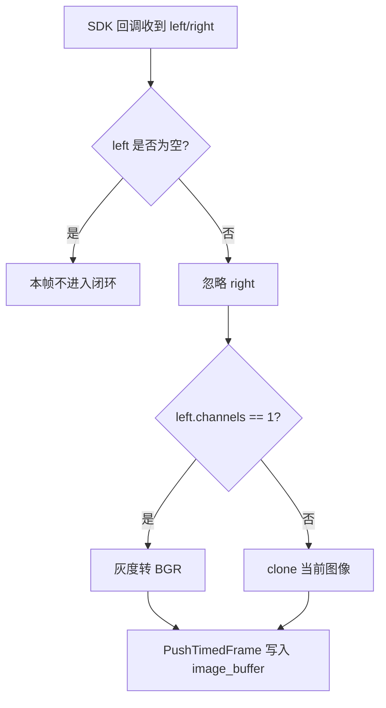
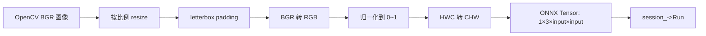
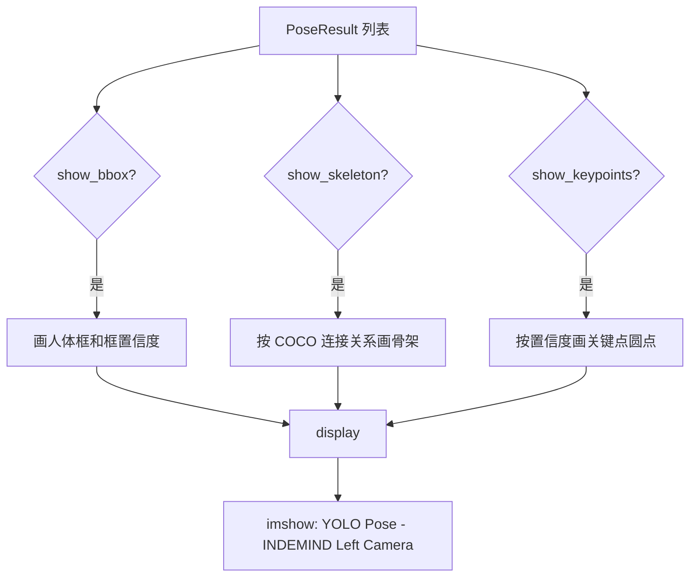

这一页只解释一个**最小闭环**：程序如何从 INDEMIND 左目图像取得一帧画面，送入 YOLOv8-Pose ONNX 推理器，得到人体框与 COCO 17 个二维关键点，再把骨架画回窗口。这里不展开深度图、3D 反投影、蹦床 ROI、落点检测等后续功能；这些内容应继续阅读 [深度图接入与 3D 关键点验证](8-shen-du-tu-jie-ru-yu-3d-guan-jian-dian-yan-zheng) 与 [蹦床 ROI 标定与落点记录流程](9-beng-chuang-roi-biao-ding-yu-luo-dian-ji-lu-liu-cheng)。Sources: [get_pose_indemind_left.cpp](get_pose_indemind_left.cpp#L681-L683), [get_pose_indemind_left.cpp](get_pose_indemind_left.cpp#L879-L925)

## 架构假设与验证结论

从第一性原理看，这个闭环必须具备四个最小环节：**相机帧入口、图像格式适配、模型推理、结果可视化**。代码验证后可以确认：入口来自 `RegistImgCallback` 注册的图像回调；程序只使用 `left` 参数并显式忽略 `right`；灰度左目图会被转换成 BGR；主循环取最新左目帧调用 `pose_detector.Detect(left_image)`；最后通过 `DrawPoses` 和 `DrawPoseInfo(..., false)` 显示二维姿态结果。Sources: [get_pose_indemind_left.cpp](get_pose_indemind_left.cpp#L763-L784), [get_pose_indemind_left.cpp](get_pose_indemind_left.cpp#L879-L925)

```mermaid
flowchart LR
    A[INDEMIND 左目图像回调] --> B[灰度转 BGR / 克隆彩色帧]
    B --> C[写入最新帧缓冲区]
    C --> D[主循环取出 latest left_image]
    D --> E[YOLOPoseDetector::Detect]
    E --> F[预处理: letterbox / RGB / 归一化 / CHW]
    F --> G[ONNX Runtime 推理]
    G --> H[后处理: 解析关键点 / NMS / 坐标还原]
    H --> I[DrawPoses 绘制人体框、关键点、骨架]
    I --> J[imshow 显示窗口]
```



这张图中的关键点是：**左目图像不是直接在 SDK 回调里推理**，而是先进入一个带时间戳的小缓冲区；主循环再取最新帧做推理。这种设计让相机采集与模型推理解耦，避免推理耗时阻塞 SDK 回调。Sources: [get_pose_indemind_left.cpp](get_pose_indemind_left.cpp#L729-L735), [get_pose_indemind_left.cpp](get_pose_indemind_left.cpp#L763-L784), [get_pose_indemind_left.cpp](get_pose_indemind_left.cpp#L857-L864)

## 最小闭环中的文件位置

本闭环主要跨越三个源文件：主程序负责相机接入、循环调度与窗口显示；推理器负责 ONNX Runtime 初始化、预处理、推理与后处理；姿态工具负责 COCO 骨架连接和绘制。构建系统把这些文件编译进同一个可执行目标 `yolo_pose_indemind_left`。Sources: [CMakeLists.txt](CMakeLists.txt#L171-L179), [CMakeLists.txt](CMakeLists.txt#L193-L211)

```text
YOLO_rec/
├── get_pose_indemind_left.cpp    # 左目相机入口、主循环、调用 Detect、显示结果
├── yolo_pose_detector.h          # KeyPoint / PoseResult / YOLOPoseDetector 接口
├── yolo_pose_detector.cpp        # ONNX Runtime 初始化、预处理、推理、后处理、NMS
├── pose_utils.h                  # DrawPoses / DrawPoseInfo 等姿态工具声明
├── pose_utils.cpp                # COCO 骨架连接与二维可视化实现
├── models/
│   ├── yolov8m-pose-1280.onnx    # 默认模型路径
│   ├── yolov8n-pose-1280.onnx
│   └── yolov8n-pose-640.onnx
└── CMakeLists.txt                # 生成 yolo_pose_indemind_left
```

| 文件 | 在最小闭环中的职责 | 初学者需要关注的入口 |
|---|---|---|
| `get_pose_indemind_left.cpp` | 接相机、取左目帧、调用检测、显示画面 | `RegistImgCallback`、主循环中的 `Detect` |
| `yolo_pose_detector.h/.cpp` | 把 OpenCV 图像变成 ONNX 输入，再把模型输出变成 `PoseResult` | `YOLOPoseDetector::Detect` |
| `pose_utils.h/.cpp` | 把 `PoseResult` 画成框、点和骨架 | `DrawPoses` |
| `CMakeLists.txt` | 把主程序、推理器和绘制工具链接成可执行程序 | `add_executable(yolo_pose_indemind_left ...)` |

Sources: [get_pose_indemind_left.cpp](get_pose_indemind_left.cpp#L763-L784), [get_pose_indemind_left.cpp](get_pose_indemind_left.cpp#L879-L925), [yolo_pose_detector.h](yolo_pose_detector.h#L60-L90), [pose_utils.cpp](pose_utils.cpp#L100-L171), [CMakeLists.txt](CMakeLists.txt#L193-L211)

## 第一步：初始化左目相机与模型

程序启动后默认使用 `models/yolov8m-pose-1280.onnx`，如果命令行传入了第一个参数，则用该参数覆盖模型路径。随后程序初始化 INDEMIND SDK，配置图像分辨率为 `IMG_1280`、图像频率为 `50`，并关闭 IMU 频率以减少额外开销。Sources: [get_pose_indemind_left.cpp](get_pose_indemind_left.cpp#L672-L690)

YOLO 推理器的创建参数是 `model_path, 1280, 0.5f, 0.45f, true`，含义分别是模型路径、输入尺寸、检测置信度阈值、NMS IoU 阈值，以及启用 CUDA。创建后必须调用 `pose_detector.Init()`，失败则退出程序。Sources: [get_pose_indemind_left.cpp](get_pose_indemind_left.cpp#L720-L727)

| 参数 | 代码值 | 在闭环中的作用 |
|---|---:|---|
| 模型路径 | 默认 `models/yolov8m-pose-1280.onnx` | 决定加载哪个 YOLOv8-Pose ONNX 模型 |
| 输入尺寸 | `1280` | 推理器把图像整理成 `1×3×1280×1280` 输入 |
| 置信度阈值 | `0.5f` | 过滤低置信度人体候选框 |
| NMS IoU 阈值 | `0.45f` | 抑制重叠人体框 |
| CUDA | `true` | 优先配置 GPU 执行提供程序，失败时回退 CPU |

Sources: [get_pose_indemind_left.cpp](get_pose_indemind_left.cpp#L675-L678), [get_pose_indemind_left.cpp](get_pose_indemind_left.cpp#L720-L727), [yolo_pose_detector.cpp](yolo_pose_detector.cpp#L10-L47)

## 第二步：只接收左目图像

图像回调的签名同时提供 `left` 和 `right`，但本闭环明确只处理左目：代码对 `right` 执行 `(void)right`，表示右目图像在这里被忽略。只要 `left` 非空，程序就记录时间戳，并进入图像格式适配流程。Sources: [get_pose_indemind_left.cpp](get_pose_indemind_left.cpp#L763-L772)

YOLO 推理器期望输入是彩色 BGR 图像；如果左目帧只有 1 个通道，程序用 `cv::cvtColor(left, color_image, cv::COLOR_GRAY2BGR)` 转成 BGR；如果已经是彩色图，则直接 `clone`。适配后的图像通过 `PushTimedFrame` 放入 `image_buffer`，缓冲区最大长度为 4。Sources: [get_pose_indemind_left.cpp](get_pose_indemind_left.cpp#L729-L735), [get_pose_indemind_left.cpp](get_pose_indemind_left.cpp#L774-L784)



这个步骤的 beginner 重点是：**相机原始输出不一定满足模型输入格式**。本程序最小化处理方式不是做复杂增强，而是确保左目帧至少满足 OpenCV BGR 三通道图像这一输入约定。Sources: [get_pose_indemind_left.cpp](get_pose_indemind_left.cpp#L763-L784), [yolo_pose_detector.h](yolo_pose_detector.h#L85-L90)

## 第三步：主循环只处理最新帧

主循环每轮先尝试从 `image_buffer` 中取出最新图像。`PopLatestFrame` 的行为是取 `buffer.back()`，随后 `buffer.clear()`；这意味着如果推理慢于采集，旧帧会被丢弃，程序优先保证显示和推理接近实时，而不是逐帧补处理历史画面。Sources: [get_pose_indemind_left.cpp](get_pose_indemind_left.cpp#L178-L199), [get_pose_indemind_left.cpp](get_pose_indemind_left.cpp#L852-L864)

拿到 `left_image` 后，主循环记录推理起止时间，调用 `pose_detector.Detect(left_image)`，并把耗时写入性能统计。若 `poses` 非空，程序会增加检测计数，并每 30 帧打印第一个人的关键点置信度和像素坐标，方便初学者确认模型确实输出了关键点。Sources: [get_pose_indemind_left.cpp](get_pose_indemind_left.cpp#L879-L904)

| 设计点 | 代码行为 | 初学者理解 |
|---|---|---|
| 最新帧优先 | 取 `buffer.back()` 后清空缓冲区 | 宁可丢旧帧，也要处理最新画面 |
| 回调不推理 | 回调只做格式转换和入队 | 避免相机回调被模型推理卡住 |
| 主循环推理 | `pose_detector.Detect(left_image)` | 真正的人体关键点检测发生在主循环 |
| 调试输出 | 每 30 帧打印关键点置信度与坐标 | 用控制台确认结果是否合理 |

Sources: [get_pose_indemind_left.cpp](get_pose_indemind_left.cpp#L178-L199), [get_pose_indemind_left.cpp](get_pose_indemind_left.cpp#L852-L904)

## 第四步：YOLOPoseDetector 如何把图像变成关键点

`YOLOPoseDetector::Detect` 首先检查推理器是否初始化、输入图像是否为空；然后调用 `Preprocess` 生成 `input_data`，创建形状为 `{1, 3, input_size_, input_size_}` 的 ONNX 输入张量，最后通过 `session_->Run(...)` 执行模型推理。Sources: [yolo_pose_detector.cpp](yolo_pose_detector.cpp#L170-L213)

预处理采用 letterbox 思路：按比例缩放原图，计算左右和上下 padding，用常量颜色 `114,114,114` 补边；随后 BGR 转 RGB，把像素归一化到 `[0,1]`，并从 HWC 排列转换成 CHW 排列。这个步骤保证任意原始图像可以进入固定尺寸的 YOLO 输入张量。Sources: [yolo_pose_detector.cpp](yolo_pose_detector.cpp#L119-L168)



后处理假设 YOLOv8-Pose 输出格式为 `[1, 56, 8400]`：其中 `56 = 4` 个框参数、`1` 个人体置信度、`17×3` 个关键点字段；关键点字段从索引 5 开始，每个关键点包含 `x, y, visibility`。代码先按置信度过滤候选，再执行 NMS，最后把框和关键点坐标从模型输入尺度还原到原图尺度。Sources: [yolo_pose_detector.cpp](yolo_pose_detector.cpp#L215-L289), [yolo_pose_detector.cpp](yolo_pose_detector.cpp#L348-L381)

## 第五步：PoseResult 的数据结构

模型输出最终被组织为 `PoseResult`。一个 `PoseResult` 表示一个人，包含人体框 `bbox`、人体框置信度 `box_confidence`、17 个 `KeyPoint`，以及可选的 `person_id`。每个 `KeyPoint` 保存二维像素坐标 `x, y`、关键点置信度 `confidence`，并预留 `pos3d` 字段给后续深度融合使用；在本页最小闭环中只关注二维字段。Sources: [yolo_pose_detector.h](yolo_pose_detector.h#L36-L58)

COCO 17 个关键点的索引在枚举 `KeypointType` 中固定定义，顺序从鼻子、眼睛、耳朵、肩、肘、腕、髋、膝到踝。理解这个索引表很重要，因为绘制骨架、调试输出和后续姿态算法都通过这些编号访问关键点。Sources: [yolo_pose_detector.h](yolo_pose_detector.h#L15-L34)

| 索引范围 | 身体部位 | 典型枚举 |
|---:|---|---|
| 0 | 头部中心 | `NOSE` |
| 1–4 | 眼睛与耳朵 | `LEFT_EYE`、`RIGHT_EAR` |
| 5–10 | 上肢 | `LEFT_SHOULDER`、`RIGHT_WRIST` |
| 11–16 | 下肢 | `LEFT_HIP`、`RIGHT_ANKLE` |

Sources: [yolo_pose_detector.h](yolo_pose_detector.h#L15-L34), [pose_utils.cpp](pose_utils.cpp#L249-L260)

## 第六步：把关键点画回左目图像

主循环先复制一份 `left_image` 到 `display`，再调用 `DrawPoses(display, poses, show_bbox, show_keypoints, show_skeleton, 0.3f)`。这里的 `0.3f` 是绘制关键点和骨架时使用的可视化阈值；它不同于模型检测阶段的 `0.5f` 人体框置信度阈值。Sources: [get_pose_indemind_left.cpp](get_pose_indemind_left.cpp#L918-L925), [get_pose_indemind_left.cpp](get_pose_indemind_left.cpp#L826-L830)

`DrawPoses` 会按开关绘制人体框、关键点和骨架。人体框用绿色矩形和框置信度显示；骨架只连接两个端点置信度都大于阈值的关键点；关键点颜色按置信度分为高、中、低三档。Sources: [pose_utils.cpp](pose_utils.cpp#L100-L171)

骨架连接关系由 `GetCocoSkeleton` 给出：头部为黄色，躯干为青色，左臂为绿色，右臂为蓝色，左腿为洋红色，右腿为橙色。这些颜色不是模型输出的一部分，而是可视化层为了帮助观察人体结构而定义的绘制约定。Sources: [pose_utils.cpp](pose_utils.cpp#L10-L42)



最后，程序调用 `cv::imshow("YOLO Pose - INDEMIND Left Camera", display)` 显示结果窗口；用户按 `q` 或 `ESC` 可以退出主循环。Sources: [get_pose_indemind_left.cpp](get_pose_indemind_left.cpp#L1500-L1505), [get_pose_indemind_left.cpp](get_pose_indemind_left.cpp#L1532-L1535)

## 可操作的最小运行路径

从构建角度看，CMake 目标名是 `yolo_pose_indemind_left`，它由 `get_pose_indemind_left.cpp`、`yolo_pose_detector.cpp`、`pose_utils.cpp` 以及 app 目录下若干辅助源文件组成，并链接 IMSEE SDK、OpenCV、ONNX Runtime；Linux 下还链接 `pthread`。Sources: [CMakeLists.txt](CMakeLists.txt#L181-L215)

```bash
mkdir -p build
cd build
cmake ..
make
sudo ./yolo_pose_indemind_left ../models/yolov8m-pose-1280.onnx
```

上面的命令表达的是最小意图：配置工程、编译目标、用一个 YOLOv8-Pose ONNX 模型启动左目姿态检测。实际输出目录可能受 `YOLO_OUTPUT_DIR` 影响；CMake 默认把运行产物输出到 `${PROJECT_SOURCE_DIR}/build_agent_out`，构建摘要中也会打印运行提示。Sources: [CMakeLists.txt](CMakeLists.txt#L12-L15), [CMakeLists.txt](CMakeLists.txt#L201-L205), [CMakeLists.txt](CMakeLists.txt#L246-L269)

| 现象 | 可检查位置 | 代码依据 |
|---|---|---|
| 程序启动后没有姿态 | 确认模型路径是否正确、`pose_detector.Init()` 是否成功 | 初始化失败会直接返回 |
| 有相机画面但没有点 | 查看控制台每 30 帧的关键点置信度输出 | 主循环会打印第一个人的关键点置信度与坐标 |
| 点的位置明显不对 | 检查输入尺寸与模型是否匹配 | 推理器使用创建时传入的 `input_size_` 做 letterbox 与坐标还原 |
| 图像是灰度但模型需要彩色 | 检查回调中的灰度转 BGR | `left.channels()==1` 时会转成 BGR |

Sources: [get_pose_indemind_left.cpp](get_pose_indemind_left.cpp#L720-L727), [get_pose_indemind_left.cpp](get_pose_indemind_left.cpp#L776-L784), [get_pose_indemind_left.cpp](get_pose_indemind_left.cpp#L894-L903), [yolo_pose_detector.cpp](yolo_pose_detector.cpp#L119-L168)

## 本页边界与下一步阅读

到这里，最小闭环已经闭合：**左目帧进入 → 图像适配 → YOLOv8-Pose 推理 → `PoseResult` → 二维骨架显示**。本页没有解释深度图如何与关键点融合，也没有解释蹦床平面、人体 3D 姿态、落点检测或录制导出；这些都是在二维关键点稳定可见之后才应该继续理解的功能。Sources: [get_pose_indemind_left.cpp](get_pose_indemind_left.cpp#L763-L784), [get_pose_indemind_left.cpp](get_pose_indemind_left.cpp#L879-L925), [pose_utils.cpp](pose_utils.cpp#L100-L171)

推荐阅读顺序是：先回看 [实时界面、鼠标选区与键盘操作](6-shi-shi-jie-mian-shu-biao-xuan-qu-yu-jian-pan-cao-zuo) 理解窗口交互；再进入 [深度图接入与 3D 关键点验证](8-shen-du-tu-jie-ru-yu-3d-guan-jian-dian-yan-zheng) 扩展到三维；如果你想深入模型内部，再阅读 [YOLOv8-Pose ONNX 推理器设计](12-yolov8-pose-onnx-tui-li-qi-she-ji) 与 [图像预处理、输出解析与非极大值抑制](13-tu-xiang-yu-chu-li-shu-chu-jie-xi-yu-fei-ji-da-zhi-yi-zhi)。Sources: [yolo_pose_detector.h](yolo_pose_detector.h#L60-L90), [yolo_pose_detector.cpp](yolo_pose_detector.cpp#L119-L213), [yolo_pose_detector.cpp](yolo_pose_detector.cpp#L215-L381)