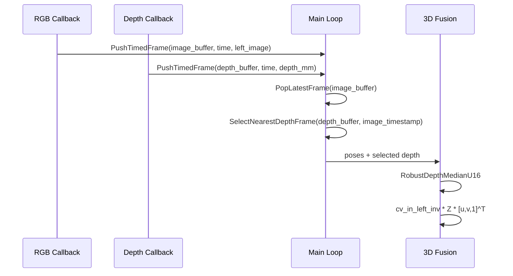
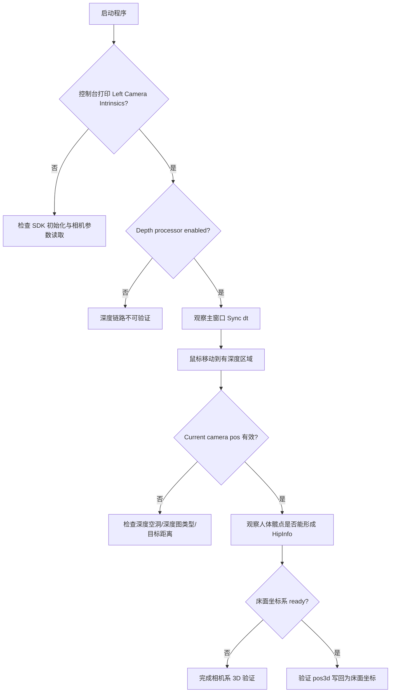

本页的目标是帮助你验证“左目 RGB 姿态检测 + 深度图 + 相机内参反投影”是否形成了可运行的 **3D 关键点闭环**：程序从 INDEMIND SDK 获取左目图像与深度图，YOLOv8-Pose 先输出 COCO 17 个 2D 关键点，随后用深度中值采样和左目内参逆矩阵把关键点反投影到左相机坐标系，并在蹦床坐标系已建立时同步写入床面坐标。当前页只覆盖深度图接入、时间同步、关键点反投影与验证观察点；蹦床 ROI 标定、平面拟合和落点记录请继续阅读 [蹦床 ROI 标定与落点记录流程](9-beng-chuang-roi-biao-ding-yu-luo-dian-ji-lu-liu-cheng)。Sources: [get_pose_indemind_left.cpp](get_pose_indemind_left.cpp#L763-L807), [get_pose_indemind_left.cpp](get_pose_indemind_left.cpp#L971-L1070)

## 架构假设：3D 关键点不是模型直接输出，而是后处理融合结果

从实现上看，YOLO 推理器的数据结构只为每个关键点预留 `pos3d` 字段，2D 检测本身输出的是图像坐标 `x/y` 与置信度；真正的 3D 坐标在主循环中使用深度图和 `cv_in_left_inv` 计算后再写回。因此，本页验证的核心不是“模型是否会输出 3D”，而是“深度帧是否按时间匹配到 RGB 帧、关键点像素处是否有有效深度、反投影是否写入 `PoseResult::keypoints[k].pos3d`”。Sources: [yolo_pose_detector.h](yolo_pose_detector.h#L36-L46), [get_pose_indemind_left.cpp](get_pose_indemind_left.cpp#L985-L1070)

```mermaid
flowchart LR
    A[INDEMIND 左目图像回调] --> B[image_buffer<br/>保留最新 RGB 帧]
    C[INDEMIND 深度回调] --> D[depth_buffer<br/>深度米转毫米]
    B --> E[主循环取最新 RGB]
    D --> F[按时间戳选择最近深度帧]
    E --> G[YOLOv8-Pose 2D 关键点]
    F --> H[局部中值深度采样]
    G --> H
    H --> I[K^-1 * Z * [u,v,1]^T]
    I --> J[相机坐标 kp_cam]
    J --> K{床面坐标系 ready?}
    K -- 是 --> L[TransformToNewFrame 写入 kp_bed / pos3d]
    K -- 否 --> M[仅保留相机坐标与髋点验证]
```

上图对应的代码路径是：图像回调将左目灰度图转换为 BGR 后压入 `image_buffer`，深度回调启用深度处理器后把深度从米转换为 `CV_16U` 毫米并压入 `depth_buffer`，主循环取最新 RGB 帧并用最近时间戳深度帧做融合。Sources: [get_pose_indemind_left.cpp](get_pose_indemind_left.cpp#L763-L807), [get_pose_indemind_left.cpp](get_pose_indemind_left.cpp#L857-L877)

## 接入点一：左目内参矩阵是 3D 反投影的前置条件

程序初始化 SDK 后读取左相机在 `RES_1280X800` 下的模块参数，用 `_K[0]`、`_K[4]`、`_K[2]`、`_K[5]` 分别填入 `fx`、`fy`、`cx`、`cy`，构造 `cv_in_left` 并立即计算 `cv_in_left_inv`。后续所有深度点反投影都依赖这个全局逆矩阵，因此验证 3D 关键点时应先确认控制台打印了左目内参，且矩阵不是空值。Sources: [get_pose_indemind_left.cpp](get_pose_indemind_left.cpp#L700-L718), [app/camera_intrinsics.h](app/camera_intrinsics.h#L1-L9), [app/camera_intrinsics.cpp](app/camera_intrinsics.cpp#L1-L5)

| 矩阵/参数 | 来源 | 在 3D 验证中的作用 |
|---|---|---|
| `cv_in_left` | SDK 左相机 `_K` 参数 | 用于 3D 点重新投影到图像，验证坐标轴或骨架叠加是否落在合理位置 |
| `cv_in_left_inv` | `cv_in_left.inv()` | 用于从像素坐标与深度值反投影到左相机坐标 |
| `fx/fy/cx/cy` | `_K[0]/_K[4]/_K[2]/_K[5]` | 决定 `X/Y/Z` 的尺度与主点偏移 |

这些字段均在启动阶段由 SDK 参数填充，反投影路径没有重新估计或自动标定内参；如果内参错误，后续深度中值采样仍可能成功，但相机坐标会整体偏移或尺度异常。Sources: [get_pose_indemind_left.cpp](get_pose_indemind_left.cpp#L700-L718), [app/camera_intrinsics.cpp](app/camera_intrinsics.cpp#L1-L5)

## 接入点二：深度图以毫米单位进入融合链路

深度处理器通过 `EnableDepthProcessor()` 开启；成功后注册深度回调，回调收到 SDK 深度图时用 `depth.convertTo(depth_mm, CV_16U, 1000.0)` 把单位从米转换成毫米，再以带时间戳的 `TimedFrame` 写入深度缓冲区。这个单位转换非常关键，因为主循环、局部中值过滤、髋点 CSV 和床面坐标均按毫米解释深度值。Sources: [get_pose_indemind_left.cpp](get_pose_indemind_left.cpp#L789-L807), [app/depth_utils.cpp](app/depth_utils.cpp#L6-L28)

| 阶段 | 数据形态 | 验证现象 | 失败时的典型表现 |
|---|---|---|---|
| SDK 深度回调 | `cv::Mat depth` | 控制台打印深度处理器启用成功 | 深度窗口无数据，`depth_count` 不增长 |
| 单位转换 | `CV_16U` 毫米图 | 鼠标位置可显示毫米级相机坐标 | 深度值被当作米或毫米混用，坐标尺度异常 |
| 深度缓冲 | `depth_buffer` | 主窗口显示 `Sync dt` | 同步误差长期异常或 3D 点间歇缺失 |
| 关键点采样 | 局部窗口中值 | 大多数可见关键点可得到 `kp_cam` | 单点深度空洞导致关键点 3D 无效 |

以上表格中的验证项都来自当前实现中的显式逻辑：深度帧被计数、按时间戳入队、主循环显示同步误差，并且只有通过深度采样的关键点才会被标记为有效。Sources: [get_pose_indemind_left.cpp](get_pose_indemind_left.cpp#L789-L807), [get_pose_indemind_left.cpp](get_pose_indemind_left.cpp#L940-L944), [get_pose_indemind_left.cpp](get_pose_indemind_left.cpp#L994-L1027)

## 时间同步：使用最近深度帧，而不是阻塞等待同帧

RGB 和深度并不是在同一个回调里同步产生的；程序分别维护 `image_buffer` 与 `depth_buffer`，主循环每次处理最新 RGB 帧，然后在深度缓冲区中寻找与 RGB 时间戳绝对差最小的深度帧。为控制历史数据污染，选择前会丢弃早于 RGB 时间戳 0.35 秒以上的旧深度帧，选择后只保留最新深度帧继续参与下一轮匹配。Sources: [get_pose_indemind_left.cpp](get_pose_indemind_left.cpp#L729-L735), [get_pose_indemind_left.cpp](get_pose_indemind_left.cpp#L202-L239), [get_pose_indemind_left.cpp](get_pose_indemind_left.cpp#L867-L877)



验证同步时，主窗口左下角附近会绘制 `Sync dt: ... ms`；这个值由最近深度帧与当前 RGB 帧的时间差计算而来，能直接反映深度帧是否在实时更新以及是否与图像帧大致对齐。Sources: [get_pose_indemind_left.cpp](get_pose_indemind_left.cpp#L227-L233), [get_pose_indemind_left.cpp](get_pose_indemind_left.cpp#L940-L944)

## 深度采样：使用局部中值过滤空洞和离群值

关键点像素不是直接读取单个深度值，而是调用 `RobustDepthMedianU16(depth_data, px, py, r=3, z_mm)` 在 7×7 局部窗口中收集有效深度；采样会跳过越界像素、深度为 0 的无效点，以及大于等于 10000 mm 的远距或异常点。有效样本少于 6 个时函数返回失败，关键点不会被写入 3D 坐标。Sources: [get_pose_indemind_left.cpp](get_pose_indemind_left.cpp#L1000-L1009), [app/depth_utils.cpp](app/depth_utils.cpp#L6-L28)

| 过滤条件 | 代码行为 | 对 3D 关键点的影响 |
|---|---|---|
| 深度图为空或不是 `CV_16UC1` | 立即返回 `false` | 本帧无法产生 3D 关键点 |
| 窗口像素越界 | 跳过该像素 | 边缘关键点更容易无效 |
| `z == 0` | 跳过 | 深度空洞不会污染坐标 |
| `z >= 10000` | 跳过 | 远距异常点不会参与中值 |
| 有效样本 `< 6` | 返回 `false` | 当前关键点保留为无效 |
| 有效样本充足 | `nth_element` 取中值 | 抑制单点噪声，输出 `z_mm` |

该策略使 3D 验证更关注“局部区域是否存在稳定深度”，而不是某一个关键点像素是否刚好有深度；因此，当人体边缘、关节遮挡或深度空洞较多时，部分关键点缺失是代码允许的正常结果。Sources: [app/depth_utils.cpp](app/depth_utils.cpp#L6-L28), [get_pose_indemind_left.cpp](get_pose_indemind_left.cpp#L994-L1027)

## 反投影公式：从像素坐标进入左相机坐标系

当关键点置信度至少为 0.3、像素坐标在深度图范围内、且局部中值深度有效时，程序构造齐次像素向量 `[u, v, 1]^T`，然后计算 `kp_camera_cor = cv_in_left_inv * Z * kp_img_cor`。这里的 `Z` 是毫米单位深度，因此得到的 `cam_pt.x/y/z` 也按毫米存储在左相机坐标系中。Sources: [get_pose_indemind_left.cpp](get_pose_indemind_left.cpp#L994-L1023), [pose_utils.cpp](pose_utils.cpp#L82-L95)

```mermaid
flowchart TD
    A[YOLO KeyPoint<br/>x, y, confidence] --> B{confidence >= 0.3?}
    B -- 否 --> X[跳过该关键点]
    B -- 是 --> C{像素在 depth 范围内?}
    C -- 否 --> X
    C -- 是 --> D[RobustDepthMedianU16<br/>r=3]
    D --> E{z_mm 有效?}
    E -- 否 --> X
    E -- 是 --> F[构造 [u,v,1]^T]
    F --> G[cv_in_left_inv * Z * pixel]
    G --> H[kp_cam[k] = Point3d<br/>kp_valid[k] = true]
```

这条反投影路径与 `pose_utils.cpp` 中保留的通用 `MapPoseTo3D` 公式等价：`X=(u-cx)*Z/fx`、`Y=(v-cy)*Z/fy`、`Z=Z`；当前主程序选择矩阵形式实现，并额外加入局部中值采样和床面坐标写入。Sources: [get_pose_indemind_left.cpp](get_pose_indemind_left.cpp#L1012-L1027), [pose_utils.cpp](pose_utils.cpp#L53-L96)

## 验证点一：髋点是最小 3D 闭环观察对象

程序在每个人体上优先检查左右髋点：要求对应关键点置信度大于 0.5 且 `kp_valid` 为真；如果双髋都有效，则骨盆点取左右髋点相机坐标平均值，否则使用单侧有效髋点。随后该骨盆点被写入 `DepthRegion::HipInfo::camera_pos`，并在床面坐标系可用时同步写入 `new_frame_pos`。Sources: [get_pose_indemind_left.cpp](get_pose_indemind_left.cpp#L1030-L1057), [app/depth_region.h](app/depth_region.h#L521-L527)

| 验证对象 | 最低条件 | 成功标志 |
|---|---|---|
| 单个关键点 3D | 置信度 ≥ 0.3、深度有效 | `info.kp_valid[k] = true` |
| 骨盆相机坐标 | 至少一个髋点置信度 > 0.5 且 3D 有效 | `info.pelvis_valid = true` |
| 骨盆床面坐标 | 骨盆有效且床面坐标系 ready | `hip_info.has_new_frame = true` |
| 关键点 `pos3d` 写回 | 床面坐标系 ready 且关键点 3D 有效 | `poses[p].keypoints[k].pos3d = kp_bed` |

对于当前页的“3D 关键点验证”，建议先看骨盆相机坐标是否持续有效，因为它只依赖左右髋点和深度融合；床面坐标则额外依赖 ROI 平面标定，属于后续页面 [蹦床 ROI 标定与落点记录流程](9-beng-chuang-roi-biao-ding-yu-luo-dian-ji-lu-liu-cheng) 的完整流程。Sources: [get_pose_indemind_left.cpp](get_pose_indemind_left.cpp#L1030-L1070), [app/depth_region.h](app/depth_region.h#L512-L527)

## 验证点二：鼠标深度窗口可以独立检查反投影是否合理

除了人体关键点，`DepthRegion::ShowElems` 也提供了一个独立的深度验证入口：鼠标移动时记录当前像素位置，窗口会对该像素使用同样的 `RobustDepthMedianU16` 采样，并用 `cv_in_left_inv * Z * [u,v,1]^T` 输出左相机坐标。这个机制可以在不依赖 YOLO 检测结果的情况下验证深度图、内参和反投影是否工作。Sources: [app/depth_region.h](app/depth_region.h#L83-L130), [get_pose_indemind_left.cpp](get_pose_indemind_left.cpp#L1507-L1517)


如果鼠标停在人体、床面或其他有深度的位置时仍显示 `invalid depth`，优先检查深度处理器是否启用、深度图是否为空、目标区域是否存在深度空洞；如果鼠标坐标有效而人体 3D 关键点无效，则更可能是关键点置信度、关键点越界或局部窗口有效样本不足。Sources: [app/depth_region.h](app/depth_region.h#L121-L149), [get_pose_indemind_left.cpp](get_pose_indemind_left.cpp#L994-L1009)

## 验证点三：床面坐标系可用时，3D 关键点会从相机系转换到新坐标系

当 `depth_region.IsCoordSystemReady()` 返回真时，程序会读取床面坐标系的旋转矩阵与原点，并对每个有效相机坐标点调用 `TransformToNewFrame`。该函数先用点坐标减去床面原点，再使用旋转矩阵列向量做转置投影，得到新坐标系下的 `x/y/z`。Sources: [get_pose_indemind_left.cpp](get_pose_indemind_left.cpp#L977-L983), [get_pose_indemind_left.cpp](get_pose_indemind_left.cpp#L1025-L1027), [app/depth_region.h](app/depth_region.h#L378-L403)

床面坐标系 ready 后，程序还会把每个有效关键点的 `kp_bed` 写回 `poses[p].keypoints[k].pos3d`，这意味着后续绘制、姿态指标和记录逻辑读取到的是床面坐标，而不是原始相机坐标。若当前只验证深度接入，可以先不要求 `pos3d` 写回成功；若需要验证床面坐标，请继续阅读 [四点 ROI 交互与蹦床平面采样](18-si-dian-roi-jiao-hu-yu-beng-chuang-ping-mian-cai-yang)。Sources: [get_pose_indemind_left.cpp](get_pose_indemind_left.cpp#L1060-L1070), [app/depth_region.h](app/depth_region.h#L512-L519)

## 操作流程：从启动到确认 3D 关键点有效

启动程序后，先观察控制台是否打印左目内参和深度处理器启用信息；运行中主窗口会显示实时 FPS、推理耗时、`Sync dt` 和检测人数，鼠标移动到图像区域后可通过深度信息窗口查看当前像素的相机坐标。Sources: [get_pose_indemind_left.cpp](get_pose_indemind_left.cpp#L715-L718), [get_pose_indemind_left.cpp](get_pose_indemind_left.cpp#L789-L807), [get_pose_indemind_left.cpp](get_pose_indemind_left.cpp#L927-L949)



这个流程刻意把“相机系 3D 验证”和“床面坐标验证”分开：前者只需要 RGB、深度、内参和关键点，后者还需要 ROI 平面标定成功；这样可以避免在深度接入阶段把问题误判为平面拟合或落点检测问题。Sources: [get_pose_indemind_left.cpp](get_pose_indemind_left.cpp#L971-L1070), [app/depth_region.h](app/depth_region.h#L284-L371)

## 常见问题排查表

| 现象 | 可验证原因 | 对应检查位置 |
|---|---|---|
| 控制台提示深度处理器启用失败 | `EnableDepthProcessor()` 返回 false | 深度回调不会注册，鼠标深度交互不可用 |
| 主窗口 `Sync dt` 长期异常 | 深度帧与 RGB 帧时间差过大或深度帧未更新 | `SelectNearestDepthFrame` 的最近帧匹配结果 |
| 鼠标窗口显示 `invalid depth` | 局部窗口内有效深度少于 6 个，或深度为 0/≥10000 | `RobustDepthMedianU16` 的过滤逻辑 |
| 2D 骨架正常但 3D 髋点缺失 | 髋点置信度不足、深度越界或采样失败 | 左右髋点 `confidence > 0.5` 与 `kp_valid` |
| 关键点 `pos3d` 始终为零 | 床面坐标系未 ready，未执行 `kp_bed` 写回 | `bed_ready` 条件分支 |
| 相机坐标看起来尺度错误 | 深度单位或内参矩阵异常 | 深度米转毫米和 `cv_in_left_inv` |

这些问题均能在当前代码路径中定位：深度处理器失败会直接打印警告，深度采样失败会跳过关键点，床面坐标系未建立时 `TransformToNewFrame` 不会为关键点写入床面坐标。Sources: [get_pose_indemind_left.cpp](get_pose_indemind_left.cpp#L789-L807), [app/depth_utils.cpp](app/depth_utils.cpp#L6-L28), [get_pose_indemind_left.cpp](get_pose_indemind_left.cpp#L1030-L1070), [app/depth_region.h](app/depth_region.h#L378-L403)

## 当前页面的最小成功标准

本页的最小成功标准可以定义为三层：第一层，左目内参成功读取且深度处理器启用；第二层，鼠标移动到有效深度区域时能显示毫米级相机坐标；第三层，人体检测结果中至少髋点能通过深度采样并形成 `pelvis_cam`。完成这三层后，就可以确认深度图已经接入 2D 姿态链路，并能产出可用于后续业务逻辑的 3D 骨盆与关键点基础数据。Sources: [get_pose_indemind_left.cpp](get_pose_indemind_left.cpp#L700-L718), [app/depth_region.h](app/depth_region.h#L121-L149), [get_pose_indemind_left.cpp](get_pose_indemind_left.cpp#L1030-L1057)

## 下一步阅读路径

如果你刚完成左目图像到 2D 姿态的验证，请先确保已读 [从左目图像到人体关键点的最小闭环](7-cong-zuo-mu-tu-xiang-dao-ren-ti-guan-jian-dian-de-zui-xiao-bi-huan)；完成本页的深度与 3D 关键点验证后，下一步进入 [蹦床 ROI 标定与落点记录流程](9-beng-chuang-roi-biao-ding-yu-luo-dian-ji-lu-liu-cheng)。若你需要理解底层实现细节，再阅读 [相机内参、深度采样与像素反投影](16-xiang-ji-nei-can-shen-du-cai-yang-yu-xiang-su-fan-tou-ying) 和 [无效深度过滤与局部中值鲁棒估计](17-wu-xiao-shen-du-guo-lu-yu-ju-bu-zhong-zhi-lu-bang-gu-ji)。Sources: [get_pose_indemind_left.cpp](get_pose_indemind_left.cpp#L971-L1070), [app/depth_utils.cpp](app/depth_utils.cpp#L6-L28)