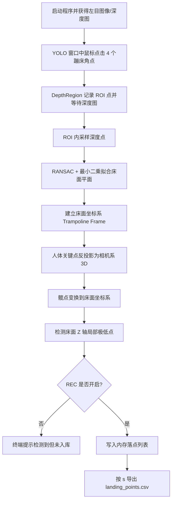
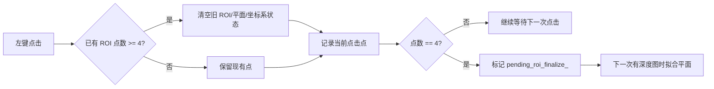

本页说明当前程序中“**四点 ROI 标定蹦床床面 → 建立床面坐标系 → 用髋点轨迹检测落点 → 按会话导出落点 CSV**”的最小可操作流程。它处在入门指南的上手验证阶段，前置能力是左目图像、YOLO-Pose、深度图与 3D 髋点已经能进入主循环；更深入的 ROI 几何、RANSAC、坐标轴约定与落点状态机细节，应继续阅读 [四点 ROI 交互与蹦床平面采样](18-si-dian-roi-jiao-hu-yu-beng-chuang-ping-mian-cai-yang)、[RANSAC 与最小二乘平面拟合](19-ransac-yu-zui-xiao-er-cheng-ping-mian-ni-he)、[床面坐标系构建、坐标变换与轴向约定](20-chuang-mian-zuo-biao-xi-gou-jian-zuo-biao-bian-huan-yu-zhou-xiang-yue-ding) 与 [落点检测状态机与加权确认算法](23-luo-dian-jian-ce-zhuang-tai-ji-yu-jia-quan-que-ren-suan-fa)。Sources: [get_pose_indemind_left.cpp](get_pose_indemind_left.cpp#L809-L824), [app/depth_region.h](app/depth_region.h#L45-L49)

## 1. 先建立操作心智模型

从第一性原理看，落点记录不是直接记录鼠标点击点，而是先用鼠标四点定义蹦床床面 ROI，再从 ROI 内的深度样本拟合床面平面，随后将人体髋点从相机坐标系变换到床面坐标系，最后在床面坐标系的 Z 轴轨迹上检测局部极低点；只有当 `REC` 开启时，检测到的落点才会进入内存列表，并在按 `s` 时写入当前会话目录的 `landing_points.csv`。Sources: [app/depth_region.h](app/depth_region.h#L284-L372), [get_pose_indemind_left.cpp](get_pose_indemind_left.cpp#L970-L1058), [app/depth_region.h](app/depth_region.h#L858-L880), [get_pose_indemind_left.cpp](get_pose_indemind_left.cpp#L1596-L1617)



上图对应的关键实现点是：鼠标回调被绑定到 `"YOLO Pose - INDEMIND Left Camera"` 窗口；四点完成后 `pending_roi_finalize_` 触发平面拟合；主循环每帧把髋点列表交给 `DepthRegion::UpdateHipData`；录制开关由 `g_runtime_flags.record_enabled` 控制，导出由 `FlushLandingPoints()` 完成。Sources: [get_pose_indemind_left.cpp](get_pose_indemind_left.cpp#L1299-L1300), [app/depth_region.h](app/depth_region.h#L64-L80), [app/depth_region.h](app/depth_region.h#L106-L109), [get_pose_indemind_left.cpp](get_pose_indemind_left.cpp#L1128-L1134), [app/depth_region.h](app/depth_region.h#L858-L880), [app/depth_region.h](app/depth_region.h#L933-L963)

## 2. 运行时窗口与项目结构定位

这个流程主要发生在三个可见界面中：主窗口负责显示 YOLO 结果、ROI 轮廓、坐标轴和 `REC/LP/Last` 状态；`region` 面板在点击后显示鼠标深度位置、ROI 点列表、床面坐标系状态与 Z 轨迹；`Body Frame Metrics` 窗口显示 `Trampoline frame: READY/NOT READY`，可作为 ROI 标定是否完成的辅助确认。Sources: [get_pose_indemind_left.cpp](get_pose_indemind_left.cpp#L1307-L1329), [app/depth_region.h](app/depth_region.h#L99-L180), [get_pose_indemind_left.cpp](get_pose_indemind_left.cpp#L1358-L1370), [get_pose_indemind_left.cpp](get_pose_indemind_left.cpp#L1502-L1504)

```text
YOLO_rec/
├── get_pose_indemind_left.cpp      # 主循环、窗口、键盘交互、髋点接线
└── app/
    ├── depth_region.h              # ROI、床面坐标系、落点检测、CSV 导出
    ├── depth_region.cpp            # OpenCV 鼠标回调桥接
    ├── runtime_state.h/.cpp        # REC 开关与 runs/<session> 会话目录
    └── depth_utils.h/.cpp          # 深度中值采样工具
```

在源码层面，`DepthRegion` 是该流程的核心聚合类：它持有 ROI 点、平面拟合状态、床面坐标系、髋点历史、落点列表、落点检测缓冲与运行时可调参数；`get_pose_indemind_left.cpp` 则负责把 SDK 图像/深度、YOLO 结果、OpenCV 交互与键盘命令接到这个类上。Sources: [app/depth_region.h](app/depth_region.h#L1242-L1303), [get_pose_indemind_left.cpp](get_pose_indemind_left.cpp#L745-L825), [get_pose_indemind_left.cpp](get_pose_indemind_left.cpp#L970-L1134), [get_pose_indemind_left.cpp](get_pose_indemind_left.cpp#L1532-L1618)

## 3. 操作步骤：从四点 ROI 到 CSV

| 步骤 | 用户动作 | 程序内部状态 | 可观察结果 |
|---:|---|---|---|
| 1 | 启动程序并等待窗口显示 | 深度处理器启用并注册深度回调，深度图被转换为毫米单位 | 控制台打印 “Depth processor enabled…” 或失败警告 |
| 2 | 在 YOLO 主窗口依次点击蹦床 4 个角点 | `roi_points_` 累积到 4 个点，`pending_roi_finalize_ = true` | 控制台打印 `[ROI Click n]`，主窗口出现 ROI 点/线 |
| 3 | 等待下一帧深度图进入 `ShowElems()` | `TryFinalizePlaneFromROI(depth)` 执行 ROI 采样、RANSAC、精修与坐标系构建 | `Trampoline Frame: READY`，控制台打印平面与内点比例 |
| 4 | 让人体在床面上跳动并保持髋点可见 | 主循环计算髋点 3D，并传入 `UpdateHipData()` | 主窗口 `LP` 显示已入库落点数量 |
| 5 | 按 `r` 开启 REC | 创建 `runs/YYYYMMDD_HHMMSS` 会话并清空旧落点 | 主窗口显示红色 `REC: ON` |
| 6 | 检测到落点后按 `s` | `FlushLandingPoints()` 写入 `landing_points.csv` | 控制台打印保存路径 |

Sources: [get_pose_indemind_left.cpp](get_pose_indemind_left.cpp#L789-L807), [app/depth_region.h](app/depth_region.h#L64-L80), [app/depth_region.h](app/depth_region.h#L284-L372), [get_pose_indemind_left.cpp](get_pose_indemind_left.cpp#L970-L1058), [get_pose_indemind_left.cpp](get_pose_indemind_left.cpp#L1128-L1134), [get_pose_indemind_left.cpp](get_pose_indemind_left.cpp#L1596-L1617)

推荐的最小验证顺序是：先不按 `r`，只完成四点 ROI 并观察 `Trampoline Frame: READY`；确认床面坐标系稳定后，再按 `r` 开启落点入库；检测到若干落点后按 `s` 导出 CSV。这样可以区分“标定失败”“落点检测失败”和“录制/保存未开启”三类问题。Sources: [app/depth_region.h](app/depth_region.h#L174-L180), [app/depth_region.h](app/depth_region.h#L858-L880), [get_pose_indemind_left.cpp](get_pose_indemind_left.cpp#L1596-L1617)

## 4. ROI 标定的准确入口

鼠标交互只接受移动事件与左键点击事件；移动鼠标时，如果床面坐标系尚未建立，程序只更新当前光标像素；左键点击时，程序记录该点，累计四个点后设置 `pending_roi_finalize_`。如果已经存在四个 ROI 点，再次点击会先调用 `ResetRoiSelection()`，因此“第 5 次点击”实际是重新开始一次 ROI 选择。Sources: [app/depth_region.h](app/depth_region.h#L50-L80), [app/depth_region.h](app/depth_region.h#L1031-L1041)



ROI 点会经过凸包排序以形成四边形，并用 `fillPoly()` 转成 mask；随后程序按 `roi_sample_step_ = 4` 的步长遍历 ROI 内像素，过滤无效深度 `0` 和大于等于 `10000` 的深度值，再用相机内参逆矩阵把像素深度反投影为相机坐标系 3D 点。Sources: [app/depth_region.h](app/depth_region.h#L298-L328), [app/depth_region.h](app/depth_region.h#L1242-L1252)

## 5. 床面坐标系何时算“标定完成”

ROI 内有效样本数少于 50 时会放弃拟合；样本足够时，程序先执行 `FitPlaneRansac()`，再对内点执行 `FitPlaneLeastSquares()` 精修，最后保存平面参数、内点数量、内点比例，并调用 `BuildFrameFromPlane()` 构建床面坐标系。Sources: [app/depth_region.h](app/depth_region.h#L330-L360), [app/depth_region.h](app/depth_region.h#L1043-L1081), [app/depth_region.h](app/depth_region.h#L1084-L1137)

坐标系建立成功的判据是 `coord_system_ready_ = true`，对外通过 `IsCoordSystemReady()` 暴露；主循环读取该状态为 `bed_ready`，只有 `bed_ready` 为真时，关键点与髋点才会被转换到床面坐标系。Sources: [app/depth_region.h](app/depth_region.h#L1222-L1234), [app/depth_region.h](app/depth_region.h#L506-L519), [get_pose_indemind_left.cpp](get_pose_indemind_left.cpp#L977-L983), [get_pose_indemind_left.cpp](get_pose_indemind_left.cpp#L1025-L1056)

| 状态 | 代码条件 | 说明 | 操作建议 |
|---|---|---|---|
| `NOT READY` | `IsCoordSystemReady() == false` | ROI 未完成、深度不可用、样本不足或拟合失败 | 重新点击 4 点，确保 ROI 覆盖床面且深度有效 |
| `READY` | `coord_system_ready_ == true` | 床面坐标系已建立，可进行髋点变换与落点检测 | 再开启 `REC` 记录落点 |
| `REC: OFF` | `g_runtime_flags.record_enabled == false` | 落点可检测但不会入库 | 用于试跑检测逻辑 |
| `REC: ON` | `g_runtime_flags.record_enabled == true` | 确认落点会写入内存列表 | 按 `s` 导出 CSV |

Sources: [app/depth_region.h](app/depth_region.h#L507-L519), [app/depth_region.h](app/depth_region.h#L858-L880), [get_pose_indemind_left.cpp](get_pose_indemind_left.cpp#L1307-L1318), [get_pose_indemind_left.cpp](get_pose_indemind_left.cpp#L1596-L1607)

## 6. 落点记录依赖的髋点数据流

主循环对每个姿态结果遍历关键点，使用 `RobustDepthMedianU16()` 在关键点像素附近做深度中值采样，再用 `cv_in_left_inv * Z * [u,v,1]^T` 得到相机坐标系 3D 点；当左髋或右髋有效时，程序用双髋平均或单侧髋点构造 `pelvis_cam`，并在床面坐标系就绪时生成 `pelvis_bed`。Sources: [get_pose_indemind_left.cpp](get_pose_indemind_left.cpp#L994-L1028), [get_pose_indemind_left.cpp](get_pose_indemind_left.cpp#L1030-L1048)

随后主循环构造 `DepthRegion::HipInfo`，字段包括 `person_id`、`camera_pos`、`new_frame_pos` 和 `has_new_frame`；只有 `bed_ready` 为真时，`has_new_frame` 才为真，落点检测也只在 `tracked.has_new_frame` 时进入 `CheckLandingPoint()`。Sources: [get_pose_indemind_left.cpp](get_pose_indemind_left.cpp#L1050-L1058), [app/depth_region.h](app/depth_region.h#L521-L527), [app/depth_region.h](app/depth_region.h#L646-L674)

## 7. 落点检测与入库规则

`UpdateHipData()` 会先处理丢帧复位：如果没有髋点输入，连续缺失达到阈值后会重置落点趋势状态和滤波状态；如果有多个人体，程序会选择与上一帧跟踪髋点距离最近的目标，减少姿态排序抖动对落点检测的影响。Sources: [app/depth_region.h](app/depth_region.h#L625-L645), [app/depth_region.h](app/depth_region.h#L580-L600)

对有效髋点，程序先用 `EMA3` 对床面坐标系 3D 点做滤波，然后把床面 Z 值写入历史曲线；落点检测基于“下降趋势后转为上升”的局部极小值候选，并在达到确认帧数后调用 `ConfirmLandingPoint()`。Sources: [app/depth_region.h](app/depth_region.h#L548-L565), [app/depth_region.h](app/depth_region.h#L646-L674), [app/depth_region.h](app/depth_region.h#L687-L767)

确认阶段会在候选点附近搜索实际最小 Z，并在 `window_half_` 定义的窗口内做加权平均；权重公式为 `1 / (|Z_i - Z_min| + epsilon)`，因此越接近极低点的帧对最终 X/Y 结果影响越大。Sources: [app/depth_region.h](app/depth_region.h#L769-L851)

最后的入库由 `RecordLandingPoint()` 决定：`REC OFF` 时只打印“检测到落点但未入库”；`REC ON` 时增加 `landing_count_`，为落点分配编号，并写入 `landing_points_`。Sources: [app/depth_region.h](app/depth_region.h#L854-L880)

## 8. 键盘控制与输出文件

| 按键 | 作用 | 影响范围 |
|---|---|---|
| `r` / `R` | 切换落点 REC；从 OFF 到 ON 时创建新会话并清空旧落点 | `g_runtime_flags.record_enabled`、`runs/<session>`、落点缓存 |
| `c` / `C` | 清空已入库落点并复位落点检测状态 | 内存落点列表、落点计数器、滤波/趋势状态 |
| `s` / `S` | 将当前会话的落点写入 `landing_points.csv` | 当前 `g_current_session.output_dir` |
| `+` / `-` | 增减 Z 变化阈值 | `noise_threshold_` |
| `[` / `]` | 减小/增大加权平均窗口半径 | `window_half_` |
| `p` / `P` | 打印当前落点检测参数 | 控制台 |

Sources: [get_pose_indemind_left.cpp](get_pose_indemind_left.cpp#L809-L824), [get_pose_indemind_left.cpp](get_pose_indemind_left.cpp#L1581-L1617), [app/depth_region.h](app/depth_region.h#L888-L918), [app/depth_region.h](app/depth_region.h#L920-L930)

按 `r` 从关闭切换到开启时，程序调用 `CreateNewSession()`，会话 ID 使用本地时间格式 `%Y%m%d_%H%M%S`，输出目录为 `runs/<session_id>`；如果目录创建成功，`g_current_session.active` 保持为真。Sources: [get_pose_indemind_left.cpp](get_pose_indemind_left.cpp#L1596-L1607), [app/runtime_state.cpp](app/runtime_state.cpp#L14-L37), [app/runtime_state.h](app/runtime_state.h#L12-L24)

导出的落点文件固定命名为 `landing_points.csv`，字段为 `id,t_ms,new_frame_x,new_frame_y,new_frame_z`；其中 `t_ms` 是从落点检测起始时间计算的毫秒时间戳，坐标单位来自床面坐标系中的毫米值。Sources: [app/depth_region.h](app/depth_region.h#L817-L848), [app/depth_region.h](app/depth_region.h#L933-L963)

## 9. 常见问题排查

| 现象 | 可验证原因 | 处理动作 |
|---|---|---|
| 点击 4 点后仍然 `NOT READY` | 深度图为空、类型不是 `CV_16UC1`、ROI 退化或样本少于 50 | 确认深度处理器启用；重新选择覆盖真实床面的四点 |
| 控制台提示 ROI 深度样本不足 | ROI 内有效深度过滤后少于 50 个样本 | 扩大 ROI 或避开无深度/反光区域 |
| 检测到落点但 `LP` 不增长 | `REC OFF`，`RecordLandingPoint()` 只打印不入库 | 按 `r` 开启 `REC: ON` |
| 按 `s` 提示先开始录制会话 | `g_current_session.active == false` | 先按 `r` 创建会话，再按 `s` |
| 多人场景落点不稳定 | 程序按距离上一帧跟踪髋点最近的目标选择人体，但仍依赖髋点连续可见 | 保持目标人体髋点可见，减少遮挡 |

Sources: [app/depth_region.h](app/depth_region.h#L293-L333), [app/depth_region.h](app/depth_region.h#L858-L880), [get_pose_indemind_left.cpp](get_pose_indemind_left.cpp#L1611-L1617), [app/depth_region.h](app/depth_region.h#L580-L645)

一个容易混淆的点是：`l` 键会录制逐帧髋点坐标到 `hip_coords_*.csv`，而本页的“落点记录”使用的是 `r/c/s` 这组按键，并输出会话目录下的 `landing_points.csv`；两套记录路径在代码中是分离的。Sources: [get_pose_indemind_left.cpp](get_pose_indemind_left.cpp#L1545-L1571), [get_pose_indemind_left.cpp](get_pose_indemind_left.cpp#L1596-L1617), [app/depth_region.h](app/depth_region.h#L933-L963)

## 10. 下一步阅读路径

完成本页验证后，建议按目录顺序继续阅读：若想理解鼠标四点如何变成床面采样区域，读 [四点 ROI 交互与蹦床平面采样](18-si-dian-roi-jiao-hu-yu-beng-chuang-ping-mian-cai-yang)；若想理解为什么使用 RANSAC 与最小二乘精修，读 [RANSAC 与最小二乘平面拟合](19-ransac-yu-zui-xiao-er-cheng-ping-mian-ni-he)；若想确认床面 X/Y/Z 轴的方向约定，读 [床面坐标系构建、坐标变换与轴向约定](20-chuang-mian-zuo-biao-xi-gou-jian-zuo-biao-bian-huan-yu-zhou-xiang-yue-ding)；若想修改落点判定灵敏度与确认策略，读 [落点检测状态机与加权确认算法](23-luo-dian-jian-ce-zhuang-tai-ji-yu-jia-quan-que-ren-suan-fa)。Sources: [app/depth_region.h](app/depth_region.h#L284-L372), [app/depth_region.h](app/depth_region.h#L687-L851)

如果本页流程尚未跑通，回退检查 [深度图接入与 3D 关键点验证](8-shen-du-tu-jie-ru-yu-3d-guan-jian-dian-yan-zheng)，确认深度图、内参反投影与髋点 3D 坐标已经可用；如果已经能导出 CSV，则可以进入 [录制会话、CSV 导出与运行时全局状态](24-lu-zhi-hui-hua-csv-dao-chu-yu-yun-xing-shi-quan-ju-zhuang-tai) 了解会话与导出机制。Sources: [get_pose_indemind_left.cpp](get_pose_indemind_left.cpp#L789-L807), [get_pose_indemind_left.cpp](get_pose_indemind_left.cpp#L970-L1058), [app/runtime_state.cpp](app/runtime_state.cpp#L14-L37), [app/depth_region.h](app/depth_region.h#L933-L963)