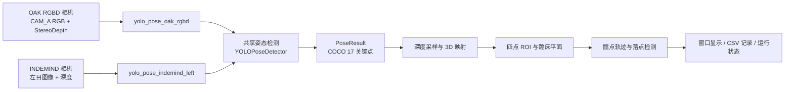

你当前位于入门指南的第一页 **「项目概览」**。本页的目标不是教你立即编译或调试，而是先回答一个新手最容易迷失的问题：这个仓库到底把“相机画面、深度图、YOLOv8 Pose、蹦床平面、落点记录”怎样组织成一个 C++ 程序。项目当前提供 OAK/DepthAI RGBD 新入口，并保留 INDEMIND 旧入口；两条入口共享姿态检测、深度处理、运行状态等通用模块。Sources: [README_OAK_RGBD.md](README_OAK_RGBD.md#L3-L8), [CMakeLists.txt](CMakeLists.txt#L10-L18), [CMakeLists.txt](CMakeLists.txt#L541-L568), [CMakeLists.txt](CMakeLists.txt#L625-L631)

## 架构假设与验证结果

从第一性原理看，这个项目的最小闭环是：**采集一帧 RGB 图像和对应深度图 → 用 YOLOv8 Pose 得到人体 2D 关键点 → 用深度和相机内参恢复 3D 信息 → 在蹦床空间中做业务判断与记录**。这个假设被现有架构说明和源码接口共同验证：旧 INDEMIND 链路的架构文档明确描述了从相机、姿态检测、3D 点、蹦床平面坐标系到髋点轨迹/落点检测的流程；OAK 迁移说明则说明新目标使用 OAK RGBD 采集，并默认使用 `models/yolov8n-pose-640.onnx`。Sources: [docs/project_cpp_architecture_guide.md](docs/project_cpp_architecture_guide.md#L3-L10), [README_OAK_RGBD.md](README_OAK_RGBD.md#L10-L18)

项目的工程组织可以理解为“两层入口、一组共享能力”：入口层包含 `get_pose_oak_rgbd.cpp` 和 `get_pose_indemind_left.cpp`，分别面向 OAK RGBD 新链路和 INDEMIND 旧链路；共享层包含 `yolo_pose_detector.cpp`、`pose_utils.cpp` 与 `app/` 下的相机内参、深度采样、蹦床 ROI、性能统计、运行状态模块。CMake 中的 `COMMON_SOURCES`、`APP_SOURCES`、`yolo_pose_oak_rgbd`、`yolo_pose_indemind_left` 定义直接体现了这个分层。Sources: [CMakeLists.txt](CMakeLists.txt#L541-L568), [CMakeLists.txt](CMakeLists.txt#L625-L631), [docs/project_cpp_architecture_guide.md](docs/project_cpp_architecture_guide.md#L36-L68)

## 这个项目解决什么问题

这个仓库围绕“蹦床场景中的人体姿态与落点分析”组织代码：它先用 YOLOv8 Pose ONNX 模型识别人体关键点，再结合深度图和相机内参为关键点补充 3D 信息，随后通过用户选定的四点 ROI 建立蹦床平面相关坐标系，并把髋点轨迹送入落点检测与记录流程。对新手来说，可以先把它看成一个 **RGBD 姿态感知应用**，而不是单纯的 YOLO 示例程序。Sources: [docs/project_cpp_architecture_guide.md](docs/project_cpp_architecture_guide.md#L137-L146), [pose_utils.h](pose_utils.h#L27-L35), [app/depth_region.h](app/depth_region.h#L45-L80)

姿态检测部分使用 COCO 17 关键点结构，`KeyPoint` 保存图像坐标、置信度和后续填充的 3D 坐标，`PoseResult` 保存人体框、检测置信度、17 个关键点和可选人员 ID；`YOLOPoseDetector` 负责加载 ONNX 模型并对输入图像执行检测。这个设计让“模型推理结果”和“后续 3D/业务处理”之间有清晰的数据边界。Sources: [yolo_pose_detector.h](yolo_pose_detector.h#L15-L34), [yolo_pose_detector.h](yolo_pose_detector.h#L36-L58), [yolo_pose_detector.h](yolo_pose_detector.h#L60-L90)

## 一眼看懂总体架构

下面的图只表达项目概览层面的数据流，不展开每个算法细节：左侧是硬件采集入口，中间是共享推理与几何处理，右侧是可视化、落点记录和运行输出。OAK 新链路通过 `OakRgbdCapture` 提供最新 RGBD 帧，旧 INDEMIND 链路通过 SDK 回调将图像和深度送入主循环；两者最终都会复用 YOLO 姿态检测、深度采样、ROI/坐标系和运行状态模块。Sources: [app/oak_rgbd_capture.h](app/oak_rgbd_capture.h#L35-L56), [docs/project_cpp_architecture_guide.md](docs/project_cpp_architecture_guide.md#L80-L89), [CMakeLists.txt](CMakeLists.txt#L541-L568)



Sources: [README_OAK_RGBD.md](README_OAK_RGBD.md#L10-L18), [yolo_pose_detector.h](yolo_pose_detector.h#L48-L58), [app/depth_utils.cpp](app/depth_utils.cpp#L6-L28), [app/depth_region.h](app/depth_region.h#L45-L80), [app/runtime_state.h](app/runtime_state.h#L7-L24)

## 两条运行入口的区别

项目现在默认面向 OAK/DepthAI RGBD 目标构建，`BUILD_OAK_RGBD_TARGET` 默认为 `ON`，`BUILD_INDEMIND_TARGET` 默认为 `OFF`；这说明 OAK RGBD 是当前主入口，INDEMIND 是保留的兼容入口。两个入口最终都会链接 OpenCV 和 ONNX Runtime，但 OAK 入口还依赖 DepthAI，INDEMIND 入口依赖本仓库 `include/` 与 `lib/libindemind.so` 中的 IMSEE/INDEMIND SDK 文件。Sources: [CMakeLists.txt](CMakeLists.txt#L10-L18), [CMakeLists.txt](CMakeLists.txt#L447-L485), [CMakeLists.txt](CMakeLists.txt#L487-L505), [CMakeLists.txt](CMakeLists.txt#L663-L681)

| 入口 | 可执行文件 | 面向硬件 | 构建开关 | 主要额外依赖 | 初学者理解重点 |
|---|---|---|---|---|---|
| OAK RGBD 新链路 | `yolo_pose_oak_rgbd` | OAK-FFC-4P / DepthAI RGBD | `BUILD_OAK_RGBD_TARGET=ON` | DepthAI | 当前默认路径，RGB 与深度由 OAK 管线配对 |
| INDEMIND 旧链路 | `yolo_pose_indemind_left` | INDEMIND 相机 | `BUILD_INDEMIND_TARGET=ON` | IMSEE/INDEMIND SDK | 兼容旧实现，便于对照历史主流程 |

Sources: [README_OAK_RGBD.md](README_OAK_RGBD.md#L3-L8), [README_OAK_RGBD.md](README_OAK_RGBD.md#L52-L58), [CMakeLists.txt](CMakeLists.txt#L561-L600), [CMakeLists.txt](CMakeLists.txt#L625-L647)

## 代码目录地图

从新手视角看，仓库中最重要的不是 `build/` 目录，而是根目录入口文件、共享推理文件、`app/` 工程模块、模型文件和硬件 SDK 文件。`build_agent_out/` 中已经出现 `yolo_pose_oak_rgbd` 与 `yolo_pose_indemind_left` 可执行文件，说明两个目标在本地输出目录中都曾被生成过；CMake 也明确把默认输出目录设置为 `build_agent_out`。Sources: [CMakeLists.txt](CMakeLists.txt#L16-L19), [CMakeLists.txt](CMakeLists.txt#L570-L573), [CMakeLists.txt](CMakeLists.txt#L633-L636)

```text
YOLO_rec/
├── CMakeLists.txt              # 构建入口：开关、依赖、可执行目标
├── README_OAK_RGBD.md          # OAK RGBD 迁移、构建与运行说明
├── get_pose_oak_rgbd.cpp       # OAK RGBD 新入口
├── get_pose_indemind_left.cpp  # INDEMIND 旧入口
├── yolo_pose_detector.*        # YOLOv8 Pose ONNX 推理封装
├── pose_utils.*                # 姿态绘制、3D 映射等工具
├── app/
│   ├── oak_rgbd_capture.*      # OAK RGBD 采集封装
│   ├── depth_region.*          # ROI、平面、坐标系、落点相关逻辑
│   ├── depth_utils.*           # 深度图鲁棒采样
│   ├── camera_intrinsics.*     # 相机内参全局矩阵
│   ├── perf_stats.*            # 性能统计
│   └── runtime_state.*         # 录制状态与会话管理
├── include/                    # INDEMIND SDK 头文件
├── lib/                        # INDEMIND 动态库
└── models/                     # YOLOv8 Pose ONNX 模型
```

Sources: [CMakeLists.txt](CMakeLists.txt#L529-L557), [CMakeLists.txt](CMakeLists.txt#L561-L568), [CMakeLists.txt](CMakeLists.txt#L625-L631), [README_OAK_RGBD.md](README_OAK_RGBD.md#L45-L50)

## 核心模块速览

`YOLOPoseDetector` 是姿态推理边界：它接收 OpenCV 的 BGR 图像，返回 `std::vector<PoseResult>`，内部接口包含预处理、后处理、NMS 和 IoU 计算。新手只需要先记住：入口程序不直接解析 ONNX 输出，而是通过这个类得到“人体框 + 17 个关键点”的结构化结果。Sources: [yolo_pose_detector.h](yolo_pose_detector.h#L60-L90), [yolo_pose_detector.h](yolo_pose_detector.h#L107-L138)

`pose_utils` 是可视化和基础几何工具边界：它声明了 COCO 骨架连接、2D 关键点到 3D 的映射函数、姿态绘制函数、关键点名称查询、3D 距离和人体高度估计。对新手来说，它更像“把检测结果画出来、量出来”的工具箱。Sources: [pose_utils.h](pose_utils.h#L13-L24), [pose_utils.h](pose_utils.h#L27-L35), [pose_utils.h](pose_utils.h#L37-L85)

`app/depth_utils.cpp` 中的 `RobustDepthMedianU16` 是深度采样的基础防线：它要求深度图为 `CV_16UC1`，在局部窗口内收集有效深度，过滤 0 和大于等于 10000 的值，并用中位数作为输出；这让关键点附近的深度比单点读取更稳定。Sources: [app/depth_utils.cpp](app/depth_utils.cpp#L6-L28)

`DepthRegion` 是蹦床业务空间的集中模块：它处理鼠标四点 ROI 选择，并在四次点击后标记需要完成 ROI 平面处理；头文件还引入了相机内参、深度工具和运行状态，说明它处在“深度几何”和“业务记录”的交界处。Sources: [app/depth_region.h](app/depth_region.h#L1-L7), [app/depth_region.h](app/depth_region.h#L26-L41), [app/depth_region.h](app/depth_region.h#L45-L80)

`runtime_state` 管理录制开关和会话信息：`RuntimeFlags` 中有 `record_enabled`，`DataSession` 中保存会话 ID、输出目录、开始时间和激活状态，并通过 `CreateNewSession()` 创建新会话。这说明落点等数据不是随意写文件，而是挂在一个运行会话上。Sources: [app/runtime_state.h](app/runtime_state.h#L7-L24)

| 模块 | 初学者应先理解的职责 | 典型文件 |
|---|---|---|
| 采集入口 | 从硬件拿 RGB 与深度，形成主循环输入 | `get_pose_oak_rgbd.cpp`、`get_pose_indemind_left.cpp`、`app/oak_rgbd_capture.*` |
| 姿态推理 | 把图像变成 `PoseResult` | `yolo_pose_detector.*` |
| 姿态工具 | 绘制骨架、映射 3D、计算基础指标 | `pose_utils.*` |
| 深度与空间 | 过滤深度、ROI 建模、坐标系与落点 | `app/depth_utils.*`、`app/depth_region.*` |
| 运行工程化 | 性能、录制状态、输出目录 | `app/perf_stats.*`、`app/runtime_state.*` |

Sources: [docs/project_cpp_architecture_guide.md](docs/project_cpp_architecture_guide.md#L36-L68), [app/oak_rgbd_capture.h](app/oak_rgbd_capture.h#L42-L63), [yolo_pose_detector.h](yolo_pose_detector.h#L48-L90), [app/runtime_state.h](app/runtime_state.h#L7-L24)

## 构建与依赖概览

CMake 项目名是 `YOLOPoseDetection`，使用 C++17；构建脚本会查找 OpenCV 和 ONNX Runtime，并在启用 OAK 目标时查找 DepthAI，在启用 INDEMIND 目标时检查 `include/imrsdk.h` 和对应平台库文件。这里的重点是：**模型推理依赖 ONNX Runtime，图像与可视化依赖 OpenCV，OAK 硬件链路依赖 DepthAI，旧硬件链路依赖 INDEMIND SDK**。Sources: [CMakeLists.txt](CMakeLists.txt#L4-L8), [CMakeLists.txt](CMakeLists.txt#L58-L72), [CMakeLists.txt](CMakeLists.txt#L73-L123), [CMakeLists.txt](CMakeLists.txt#L447-L505)

| 配置项 / 依赖 | 默认或作用 | 在哪里体现 |
|---|---|---|
| `BUILD_OAK_RGBD_TARGET` | 默认 `ON`，构建 OAK RGBD 新目标 | `CMakeLists.txt` |
| `BUILD_INDEMIND_TARGET` | 默认 `OFF`，需要时构建旧目标 | `CMakeLists.txt` |
| `YOLO_OUTPUT_DIR` | 默认输出到 `build_agent_out` | `CMakeLists.txt` |
| OpenCV | 图像矩阵、显示、绘制、几何处理 | `find_package(OpenCV REQUIRED)` |
| ONNX Runtime | 加载并运行 YOLOv8 Pose ONNX 模型 | `ONNXRUNTIME_INCLUDE_DIR` / `ONNXRUNTIME_LIB` |
| DepthAI | OAK RGBD 采集目标所需 | `BUILD_OAK_RGBD_TARGET=ON` |
| IMSEE/INDEMIND SDK | 旧 INDEMIND 目标所需 | `BUILD_INDEMIND_TARGET=ON` |

Sources: [CMakeLists.txt](CMakeLists.txt#L10-L18), [CMakeLists.txt](CMakeLists.txt#L58-L72), [CMakeLists.txt](CMakeLists.txt#L73-L123), [CMakeLists.txt](CMakeLists.txt#L447-L505), [CMakeLists.txt](CMakeLists.txt#L663-L687)

## 模型与数据输入概览

OAK RGBD 说明文档中记录的硬件配置是 OAK-FFC-4P、RVC2，RGB 主图来自 CAM_A，双目来自 CAM_B/C，深度图为 `CV_16UC1`、单位毫米，并对齐到 CAM_A；默认 YOLO 模型是 `models/yolov8n-pose-640.onnx`。这对新手非常关键：业务层图像保持 640×400，YOLO 检测器内部再做 letterbox 到 640×640 并把关键点映射回原图尺寸。Sources: [README_OAK_RGBD.md](README_OAK_RGBD.md#L10-L18), [README_OAK_RGBD.md](README_OAK_RGBD.md#L54-L58)

OAK 采集封装的配置结构 `OakRgbdConfig` 给出了默认分辨率、帧率、RGB/深度配对阈值、曝光和深度后处理参数；采集结果 `TimedRgbdFrame` 包含时间戳、RGB/Depth 配对时间差、BGR 图像和毫米深度图。这说明新链路不是只传一张图片，而是传递“带同步信息的一对 RGBD 数据”。Sources: [app/oak_rgbd_capture.h](app/oak_rgbd_capture.h#L11-L33), [app/oak_rgbd_capture.h](app/oak_rgbd_capture.h#L35-L40)

## 新手阅读路径

建议你按目录顺序继续阅读，而不是一开始跳进最长的源码文件。下一页先读 [快速开始](2-kuai-su-kai-shi)，建立最小运行认知；如果你需要准备硬件、模型和环境，再读 [硬件、模型与运行环境准备](3-ying-jian-mo-xing-yu-yun-xing-huan-jing-zhun-bei)；如果你使用当前主线 OAK 目标，接着读 [OAK RGBD 目标的构建与启动](4-oak-rgbd-mu-biao-de-gou-jian-yu-qi-dong)；如果你维护旧相机链路，再读 [INDEMIND 旧目标的构建与启动](5-indemind-jiu-mu-biao-de-gou-jian-yu-qi-dong)。Sources: [README_OAK_RGBD.md](README_OAK_RGBD.md#L19-L50), [README_OAK_RGBD.md](README_OAK_RGBD.md#L52-L58), [CMakeLists.txt](CMakeLists.txt#L682-L687)

当你能启动程序后，再读 [实时窗口、鼠标 ROI 与键盘交互指南](6-shi-shi-chuang-kou-shu-biao-roi-yu-jian-pan-jiao-hu-zhi-nan)，理解窗口显示、鼠标四点 ROI 和录制操作；随后读 [从 2D 姿态检测到 3D 落点检测的最小闭环](7-cong-2d-zi-tai-jian-ce-dao-3d-luo-dian-jian-ce-de-zui-xiao-bi-huan)，把本页的架构图落到可运行的数据闭环；最后在遇到构建、模型或相机问题时查 [常见构建、模型加载与相机连接问题排查](8-chang-jian-gou-jian-mo-xing-jia-zai-yu-xiang-ji-lian-jie-wen-ti-pai-cha)。Sources: [app/depth_region.h](app/depth_region.h#L45-L80), [app/runtime_state.h](app/runtime_state.h#L7-L24), [docs/project_cpp_architecture_guide.md](docs/project_cpp_architecture_guide.md#L149-L177)

如果你已经完成入门部分，并想理解内部原理，可以再进入深入解析的第一组页面：[整体数据流：相机采集、姿态推理、深度融合与业务判断](9-zheng-ti-shu-ju-liu-xiang-ji-cai-ji-zi-tai-tui-li-shen-du-rong-he-yu-ye-wu-pan-duan)、[双入口架构：OAK RGBD 新链路与 INDEMIND 兼容链路](10-shuang-ru-kou-jia-gou-oak-rgbd-xin-lian-lu-yu-indemind-jian-rong-lian-lu)、[CMake 目标、依赖发现与输出目录组织](11-cmake-mu-biao-yi-lai-fa-xian-yu-shu-chu-mu-lu-zu-zhi)。这些页面会把本页只概览过的采集、推理、构建与依赖关系展开。Sources: [docs/project_cpp_architecture_guide.md](docs/project_cpp_architecture_guide.md#L78-L103), [CMakeLists.txt](CMakeLists.txt#L561-L620), [CMakeLists.txt](CMakeLists.txt#L625-L681)