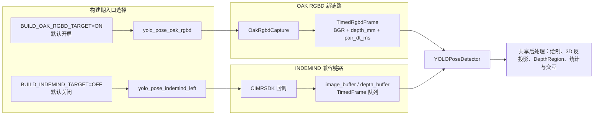
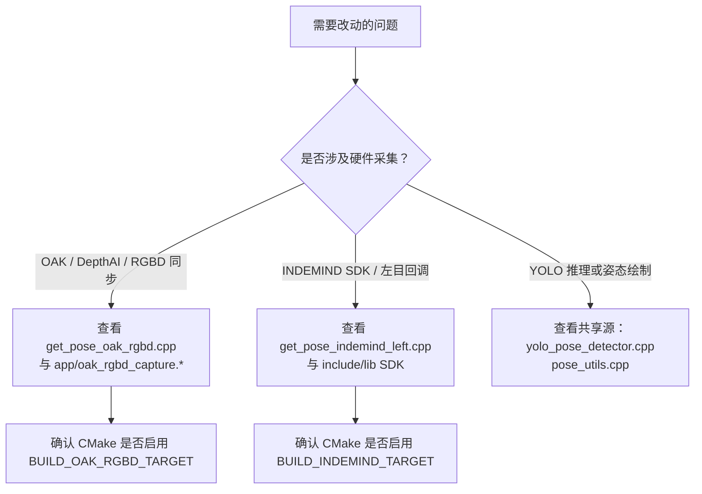

本页解释当前项目的**双入口架构**：一个默认开启的 OAK/DepthAI RGBD 新链路 `yolo_pose_oak_rgbd`，以及一个需要显式开启的 INDEMIND 兼容链路 `yolo_pose_indemind_left`。两者不是运行时动态切换的同一个二进制，而是在 CMake 层通过不同构建选项生成的两个入口目标；它们共享 YOLO Pose 推理、姿态绘制、深度区域、性能统计与运行状态等应用模块，但在相机采集、帧同步和外部 SDK 依赖上分叉。Sources: [CMakeLists.txt](CMakeLists.txt#L10-L18), [CMakeLists.txt](CMakeLists.txt#L541-L646)

## 架构假设与验证结论

从第一性原理看，这个页面关注的是“入口层如何把不同硬件采集系统适配到同一业务处理链路”。代码验证后的结论是：**OAK RGBD 是迁移后的主入口**，默认构建，直接依赖 DepthAI 并通过 `OakRgbdCapture` 输出已配对的 RGB 与毫米深度图；**INDEMIND 是兼容入口**，默认不构建，依赖本仓库 `include/` 与 `lib/libindemind.so` 中的 IMSEE/INDEMIND SDK，并使用 SDK 回调把左目图像与可用深度帧放入本地缓冲区。Sources: [CMakeLists.txt](CMakeLists.txt#L10-L14), [CMakeLists.txt](CMakeLists.txt#L447-L506), [app/oak_rgbd_capture.h](app/oak_rgbd_capture.h#L35-L63), [get_pose_indemind_left.cpp](get_pose_indemind_left.cpp#L729-L806)

上图的关键阅读方式是：左右两条链路只在**采集适配层**不同，进入主循环后都调用 `YOLOPoseDetector::Detect` 并进入相似的可视化、深度反投影和交互逻辑；差异主要集中在 OAK 入口把同步封装进 `OakRgbdCapture::TryGetLatest`，而 INDEMIND 入口在 `main` 内维护回调缓冲与最近深度匹配。Sources: [get_pose_oak_rgbd.cpp](get_pose_oak_rgbd.cpp#L731-L896), [get_pose_indemind_left.cpp](get_pose_indemind_left.cpp#L852-L1048)

## 双入口在 CMake 中的边界

CMake 顶层直接定义两个构建开关：`BUILD_OAK_RGBD_TARGET` 默认 `ON`，`BUILD_INDEMIND_TARGET` 默认 `OFF`；同时还定义 `DEPTHAI_CORE_ROOT`、`DEPTHAI_CORE_BUILD_DIR` 与默认输出目录 `build_agent_out`，这意味着仓库当前配置优先服务 OAK/DepthAI 迁移目标，而 INDEMIND 目标需要维护者显式打开。Sources: [CMakeLists.txt](CMakeLists.txt#L10-L19)

| 维度 | OAK RGBD 新链路 | INDEMIND 兼容链路 |
|---|---|---|
| 构建开关 | `BUILD_OAK_RGBD_TARGET`，默认 `ON`。Sources: [CMakeLists.txt](CMakeLists.txt#L10-L11) | `BUILD_INDEMIND_TARGET`，默认 `OFF`。Sources: [CMakeLists.txt](CMakeLists.txt#L10-L11) |
| 可执行目标 | `yolo_pose_oak_rgbd`，包含 `get_pose_oak_rgbd.cpp` 与 `app/oak_rgbd_capture.cpp`。Sources: [CMakeLists.txt](CMakeLists.txt#L561-L568) | `yolo_pose_indemind_left`，包含 `get_pose_indemind_left.cpp`。Sources: [CMakeLists.txt](CMakeLists.txt#L625-L631) |
| 采集 SDK | DepthAI，通过 `find_package(depthai CONFIG ...)` 查找。Sources: [CMakeLists.txt](CMakeLists.txt#L447-L485) | IMSEE/INDEMIND SDK，通过 `include/imrsdk.h` 与 `lib/libindemind.so` 检查。Sources: [CMakeLists.txt](CMakeLists.txt#L487-L506) |
| 共享依赖 | ONNX Runtime、OpenCV、通用源文件与 `app/` 模块。Sources: [CMakeLists.txt](CMakeLists.txt#L58-L123), [CMakeLists.txt](CMakeLists.txt#L541-L557) | ONNX Runtime、OpenCV、通用源文件与 `app/` 模块。Sources: [CMakeLists.txt](CMakeLists.txt#L58-L123), [CMakeLists.txt](CMakeLists.txt#L541-L557) |
| 链接差异 | 链接 `${DEPTHAI_TARGET}`、ONNX Runtime，并为 DepthAI 静态依赖追加 OpenCV、pthread 与静态库 group。Sources: [CMakeLists.txt](CMakeLists.txt#L575-L620) | 链接 `${IMSEE_LIB}`、OpenCV、ONNX Runtime，并在 Unix 下链接 pthread。Sources: [CMakeLists.txt](CMakeLists.txt#L638-L646) |

这种边界设计把“硬件 SDK 与采集实现”从“姿态推理与业务后处理”中分离出来：`COMMON_SOURCES` 只包含 `yolo_pose_detector.cpp` 与 `pose_utils.cpp`，`APP_SOURCES` 包含相机内参、深度区域、深度工具、性能统计与运行状态；两个入口目标都复用这些源文件，只有 OAK 目标额外加入 `app/oak_rgbd_capture.cpp`。Sources: [CMakeLists.txt](CMakeLists.txt#L541-L568), [CMakeLists.txt](CMakeLists.txt#L625-L631)

## OAK RGBD 新链路：采集被封装成同步 RGBD 源

OAK 入口的 `main` 首先设置默认模型为 `models/yolov8n-pose-640.onnx`，关闭 DepthAI 自动标定环境变量，然后构造 `OakRgbdConfig`：RGB 与 mono 都配置为 `640x400`，帧率 `50 FPS`，RGB/深度配对阈值 `5 ms`，并设置曝光、ISO、置信度、subpixel 与若干深度后处理开关。Sources: [get_pose_oak_rgbd.cpp](get_pose_oak_rgbd.cpp#L602-L638)

`OakRgbdCapture` 是 OAK 链路的适配器对象；入口只调用 `Start()`、读取 CAM_A 内参矩阵与逆矩阵，并在失败时停止采集后退出。随后 YOLO 推理器以输入尺寸 `640` 初始化，说明 OAK 入口的采集分辨率与默认模型输入尺寸在入口层被成对配置。Sources: [get_pose_oak_rgbd.cpp](get_pose_oak_rgbd.cpp#L639-L668)

`OakRgbdCapture` 的公开接口非常窄：`Start()`、`Stop()`、`TryGetLatest()`、相机内参读取与计数器读取。它暴露的帧结构 `TimedRgbdFrame` 已经包含 `timestamp_sec`、`pair_dt_ms`、`bgr` 和 `depth_mm`，因此主循环不需要直接理解 DepthAI 队列、节点或双目同步细节。Sources: [app/oak_rgbd_capture.h](app/oak_rgbd_capture.h#L35-L63)

在 OAK 采集线程内部，代码读取 DepthAI 标定并生成 CAM_A 的 `K` 与 `K_inv`；随后创建 CAM_A RGB、CAM_B mono、CAM_C mono 三个相机节点，并设置帧同步模式，其中 CAM_B 为 `OUTPUT`，CAM_A 与 CAM_C 为 `INPUT`。Sources: [app/oak_rgbd_capture.cpp](app/oak_rgbd_capture.cpp#L280-L332)

OAK 深度链路使用 `StereoDepth`：设置输入/输出尺寸、`FAST_ACCURACY` 预设、左右一致性检查、subpixel、扩展视差、frame sync 与置信度阈值；CAM_B/C 输出连接到 stereo 左右输入，CAM_A RGB 输出连接到 `stereo->inputAlignTo`，从而把 stereo depth 对齐到 CAM_A RGB 输出。Sources: [app/oak_rgbd_capture.cpp](app/oak_rgbd_capture.cpp#L353-L370)

DepthAI 输出侧创建 RGB 队列与经 host `ImageFilters` 后的 depth 队列；采集循环持续读取两类消息，调用 `PopClosestPair` 按时间戳寻找阈值内最近对，再把 RGB 转为 BGR、深度转为 `CV_16UC1`，检查二者均为 `640x400` 后发布为最新 `TimedRgbdFrame`。Sources: [app/oak_rgbd_capture.cpp](app/oak_rgbd_capture.cpp#L371-L456)

OAK 主循环体现了“只消费已配对最新帧”的模式：`TryGetLatest` 成功后，入口直接取出 `rgbd.bgr`、`rgbd.depth_mm` 与 `rgbd.pair_dt_ms`，再调用 `pose_detector.Detect(left_image)`；界面上显示同步误差 `Sync dt`，并用 “OAK CAM_A RGBD” 标识当前入口。Sources: [get_pose_oak_rgbd.cpp](get_pose_oak_rgbd.cpp#L731-L823)

## INDEMIND 兼容链路：SDK 回调与本地缓冲适配

INDEMIND 入口的默认模型为 `models/yolov8m-pose-1280.onnx`，启动日志标识为 “YOLO Pose Detection with INDEMIND Left Camera”，并构造 `CIMRSDK`、`MRCONFIG`：关闭 SLAM，图像分辨率设为 `IMG_1280`，图像频率为 `50`，IMU 频率为 `0`。Sources: [get_pose_indemind_left.cpp](get_pose_indemind_left.cpp#L672-L690)

该入口通过 `m_pSDK->Init(config)` 初始化 INDEMIND SDK，随后从 `GetModuleParams()` 中读取左相机 `RES_1280X800` 参数，把 `_K[0]`、`_K[4]`、`_K[2]`、`_K[5]` 写入 OpenCV 内参矩阵并求逆；YOLO 推理器以输入尺寸 `1280` 初始化。Sources: [get_pose_indemind_left.cpp](get_pose_indemind_left.cpp#L692-L727)

INDEMIND 入口没有像 OAK 那样把采集封装成独立类，而是在 `main` 内声明 `image_buffer`、`depth_buffer`、两个互斥锁、缓冲上限、计数器与同步误差变量；这些对象构成本入口的本地适配层。Sources: [get_pose_indemind_left.cpp](get_pose_indemind_left.cpp#L729-L744)

图像回调只使用左相机图像并显式忽略右相机；若左图是单通道则转换为 BGR，否则 clone 原图，然后调用 `PushTimedFrame` 写入 `image_buffer`。这说明兼容链路的姿态推理输入是“左目图像适配后的 BGR 帧”。Sources: [get_pose_indemind_left.cpp](get_pose_indemind_left.cpp#L763-L787)

虽然入口启动文字写着 “Left camera RGB image only”，实现中仍会尝试 `EnableDepthProcessor()` 并注册深度回调；深度回调把 SDK 深度从米转换为毫米 `CV_16U` 后写入 `depth_buffer`，失败时输出 “Mouse depth interaction disabled”。因此更准确地说，INDEMIND 兼容入口的**姿态输入是左目 RGB/BGR**，但代码路径仍保留可用深度数据以支持鼠标深度交互与后续三维计算。Sources: [get_pose_indemind_left.cpp](get_pose_indemind_left.cpp#L681-L682), [get_pose_indemind_left.cpp](get_pose_indemind_left.cpp#L789-L806)

INDEMIND 的缓冲工具函数很直接：`PushTimedFrame` 在缓冲满时丢弃最旧帧并增加 drop 计数，`PopLatestFrame` 取出最后一帧后清空图像缓冲，`SelectNearestDepthFrame` 在深度缓冲中寻找与 RGB 时间戳最近的深度帧并返回同步误差。Sources: [get_pose_indemind_left.cpp](get_pose_indemind_left.cpp#L178-L239)

INDEMIND 主循环先从 `image_buffer` 取最新左目图像，再在 `depth_buffer` 中为当前 RGB 时间戳匹配最近深度帧；如果有图像，就调用 `pose_detector.Detect(left_image)`，绘制结果，并用 “INDEMIND LEFT” 标识当前入口。Sources: [get_pose_indemind_left.cpp](get_pose_indemind_left.cpp#L852-L953)

## 两条链路的共同收敛点

两条入口最终都收敛到相同的主处理形态：获得一张 BGR 图像，调用 `YOLOPoseDetector::Detect` 得到 `std::vector<PoseResult>`，统计推理耗时，绘制姿态、FPS、推理时间、同步误差与检测人数。OAK 代码中的对应段落与 INDEMIND 代码中的对应段落几乎同构，只是相机标识不同。Sources: [get_pose_oak_rgbd.cpp](get_pose_oak_rgbd.cpp#L748-L823), [get_pose_indemind_left.cpp](get_pose_indemind_left.cpp#L879-L953)

两条链路也共享 3D 反投影模式：当 `depth_data` 非空且存在姿态结果时，遍历关键点，过滤低置信度与越界像素，调用 `RobustDepthMedianU16` 获取毫米深度，再用 `cv_in_left_inv * Z * kp_img_cor` 从像素坐标反投影到相机坐标；如果床面坐标系已准备好，则调用 `depth_region.TransformToNewFrame` 转到床面坐标。Sources: [get_pose_oak_rgbd.cpp](get_pose_oak_rgbd.cpp#L840-L896), [get_pose_indemind_left.cpp](get_pose_indemind_left.cpp#L971-L1028)

从维护视角看，共同收敛点意味着大部分业务算法不是按硬件分叉实现，而是复用入口文件中的同构后处理逻辑；真正的硬件差异被限制在“如何取得 BGR 图像、毫米深度图、相机内参与同步误差”。Sources: [get_pose_oak_rgbd.cpp](get_pose_oak_rgbd.cpp#L731-L746), [get_pose_indemind_left.cpp](get_pose_indemind_left.cpp#L852-L877)

## 采集与同步模式对比

OAK RGBD 新链路把同步策略封装在 `OakRgbdCapture::CaptureLoop` 中：DepthAI 输出队列进入 RGB/depth 双缓冲，`PopClosestPair` 按时间戳和 `pair_threshold_ms` 寻找最近对，成功后发布为单个 `TimedRgbdFrame`。主循环只看到一个已经配好对的对象。Sources: [app/oak_rgbd_capture.cpp](app/oak_rgbd_capture.cpp#L392-L456), [app/oak_rgbd_capture.h](app/oak_rgbd_capture.h#L35-L40)

INDEMIND 兼容链路把同步策略留在入口主文件内：图像回调和深度回调分别写入两个 `std::deque<TimedFrame>`，主循环先取最新 RGB，再调用 `SelectNearestDepthFrame` 查找最近深度帧；该函数还会清理过旧深度历史，并在选择后只保留最新深度帧。Sources: [get_pose_indemind_left.cpp](get_pose_indemind_left.cpp#L178-L239), [get_pose_indemind_left.cpp](get_pose_indemind_left.cpp#L852-L877)

| 对比项 | OAK RGBD 新链路 | INDEMIND 兼容链路 |
|---|---|---|
| 同步位置 | `OakRgbdCapture::CaptureLoop` 内部完成。Sources: [app/oak_rgbd_capture.cpp](app/oak_rgbd_capture.cpp#L392-L456) | `get_pose_indemind_left.cpp` 主循环内完成。Sources: [get_pose_indemind_left.cpp](get_pose_indemind_left.cpp#L852-L877) |
| 帧容器 | `TimedRgbdFrame` 同时包含 RGB、depth 与配对误差。Sources: [app/oak_rgbd_capture.h](app/oak_rgbd_capture.h#L35-L40) | `TimedFrame` 分别承载图像或深度，靠时间戳匹配。Sources: [get_pose_indemind_left.cpp](get_pose_indemind_left.cpp#L63-L66), [get_pose_indemind_left.cpp](get_pose_indemind_left.cpp#L202-L239) |
| 丢帧策略 | OAK 采集层对 RGB/depth 队列调用 `AppendAndTrim`，超限丢弃旧帧。Sources: [app/oak_rgbd_capture.cpp](app/oak_rgbd_capture.cpp#L43-L52), [app/oak_rgbd_capture.cpp](app/oak_rgbd_capture.cpp#L399-L415) | INDEMIND 本地缓冲 `PushTimedFrame` 超限丢弃旧帧。Sources: [get_pose_indemind_left.cpp](get_pose_indemind_left.cpp#L178-L190) |
| 主循环复杂度 | 主循环调用 `TryGetLatest` 即可获得 RGBD。Sources: [get_pose_oak_rgbd.cpp](get_pose_oak_rgbd.cpp#L731-L746) | 主循环需要分别取图像和匹配深度。Sources: [get_pose_indemind_left.cpp](get_pose_indemind_left.cpp#L852-L877) |

## 入口选择的工程含义

当前 CMake 默认值使 OAK RGBD 成为主线：如果不修改构建选项，将生成 `yolo_pose_oak_rgbd`，且构建系统会查找 DepthAI；INDEMIND 目标默认关闭，只有设置 `BUILD_INDEMIND_TARGET=ON` 时才会检查 `include/imrsdk.h` 与平台库文件。Sources: [CMakeLists.txt](CMakeLists.txt#L10-L14), [CMakeLists.txt](CMakeLists.txt#L447-L506)

如果你在维护采集硬件、同步、DepthAI 链路或 RGBD 帧格式，应优先阅读 OAK 入口与 `OakRgbdCapture`；如果你需要保留旧硬件、验证 IMSEE SDK 回调行为或对比旧链路输出，应打开并检查 INDEMIND 目标。这个判断来自构建开关、目标源文件和外部 SDK 依赖的实际分布。Sources: [CMakeLists.txt](CMakeLists.txt#L561-L646)

这张维护决策图的核心是“先定位入口，再定位共享层”：采集问题通常不应直接修改 YOLO 推理器；共享推理问题也不应分别在两个入口中重复修补，除非差异来自输入尺寸、模型路径或硬件数据格式。Sources: [CMakeLists.txt](CMakeLists.txt#L541-L568), [CMakeLists.txt](CMakeLists.txt#L625-L646), [get_pose_oak_rgbd.cpp](get_pose_oak_rgbd.cpp#L605-L668), [get_pose_indemind_left.cpp](get_pose_indemind_left.cpp#L675-L727)

## 页面边界与后续阅读

本页只解释双入口架构，不展开 CMake 依赖发现的全部细节、DepthAI 管线的数学与同步细节、YOLOv8 Pose 推理内部流程、深度反投影公式或业务算法状态机。若要继续沿目录深入，构建细节请读 [CMake 目标、依赖发现与输出目录组织](11-cmake-mu-biao-yi-lai-fa-xian-yu-shu-chu-mu-lu-zu-zhi)，OAK 管线请读 [OAK DepthAI 管线、RGB-Depth 配对与时间同步](15-oak-depthai-guan-xian-rgb-depth-pei-dui-yu-shi-jian-tong-bu)，推理链路请读 [YOLOv8 Pose 的 ONNX Runtime 推理流程](12-yolov8-pose-de-onnx-runtime-tui-li-liu-cheng)。Sources: [CMakeLists.txt](CMakeLists.txt#L447-L646), [app/oak_rgbd_capture.cpp](app/oak_rgbd_capture.cpp#L280-L456), [get_pose_oak_rgbd.cpp](get_pose_oak_rgbd.cpp#L731-L896)

对于中级开发者，建议的阅读路径是：先用本页建立入口边界，再读 [整体数据流：相机采集、姿态推理、深度融合与业务判断](9-zheng-ti-shu-ju-liu-xiang-ji-cai-ji-zi-tai-tui-li-shen-du-rong-he-yu-ye-wu-pan-duan) 衔接全局数据流；如果要运行 OAK 目标，转到 [OAK RGBD 目标的构建与启动](4-oak-rgbd-mu-biao-de-gou-jian-yu-qi-dong)；如果要验证旧硬件，转到 [INDEMIND 旧目标的构建与启动](5-indemind-jiu-mu-biao-de-gou-jian-yu-qi-dong)。Sources: [CMakeLists.txt](CMakeLists.txt#L10-L18), [CMakeLists.txt](CMakeLists.txt#L561-L646)