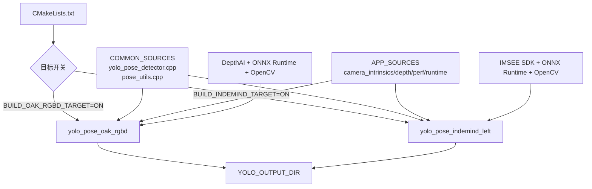
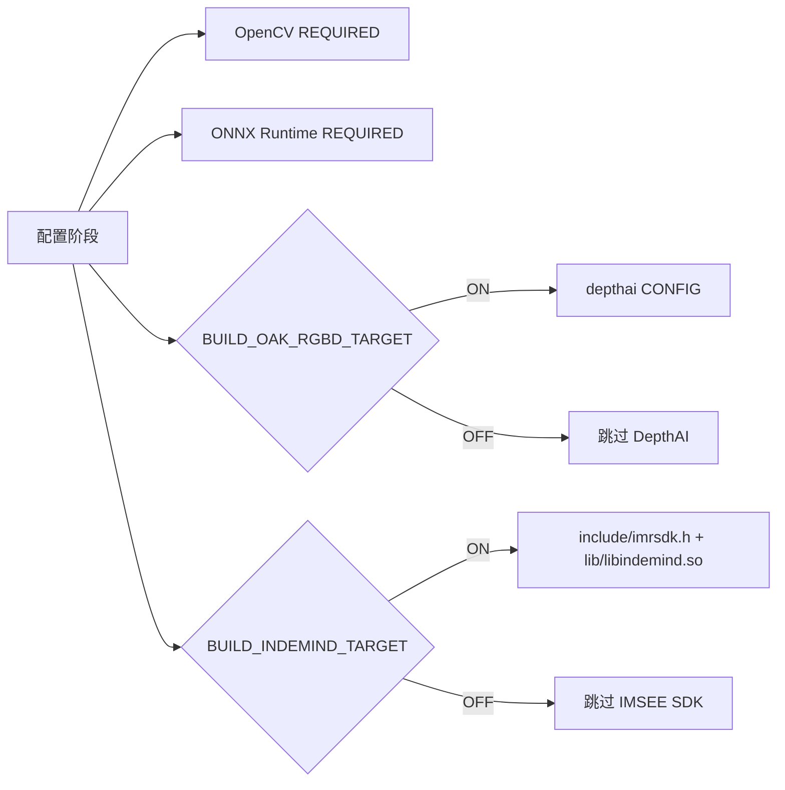
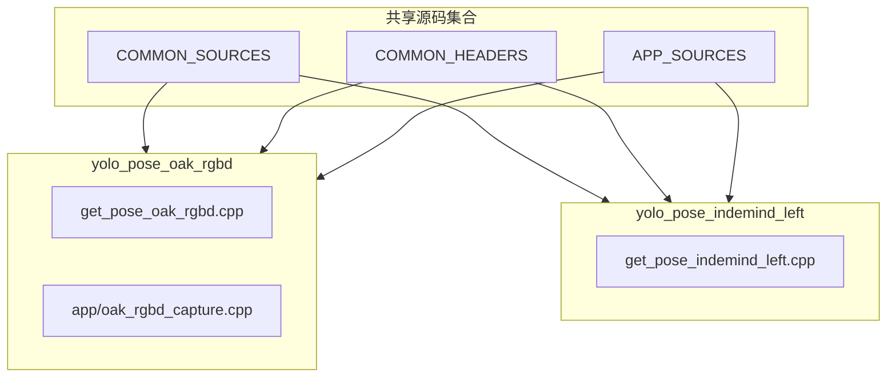
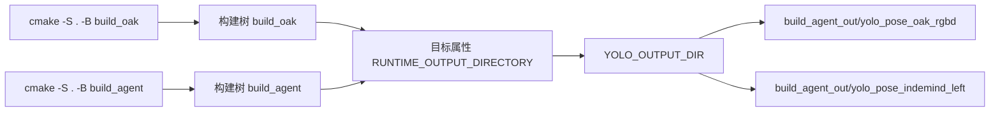
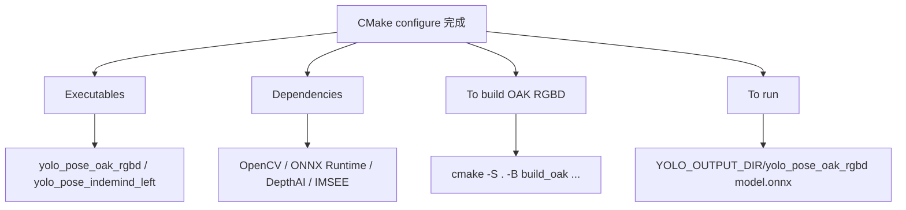

本页解释当前工程的 **CMake 构建骨架**：它如何通过开关选择 OAK RGBD 新目标或 INDEMIND 兼容目标，如何发现 OpenCV、ONNX Runtime、DepthAI 与 IMSEE SDK，如何把最终可执行文件统一输出到 `YOLO_OUTPUT_DIR`，以及为什么 OAK 目标需要额外的 DepthAI 静态依赖修正逻辑。本文只覆盖构建目标、依赖发现与输出目录组织；运行流程请转到 [OAK RGBD 目标的构建与启动](4-oak-rgbd-mu-biao-de-gou-jian-yu-qi-dong) 或 [INDEMIND 旧目标的构建与启动](5-indemind-jiu-mu-biao-de-gou-jian-yu-qi-dong)。Sources: [CMakeLists.txt](CMakeLists.txt#L4-L23), [CMakeLists.txt](CMakeLists.txt#L561-L687)

## 架构假设与验证结论

从第一原则看，这个仓库的构建系统不是“一个入口编译全部程序”，而是一个 **双目标、共享核心源码、按需启用硬件后端** 的 CMake 配置：`BUILD_OAK_RGBD_TARGET` 默认开启，生成 `yolo_pose_oak_rgbd`；`BUILD_INDEMIND_TARGET` 默认关闭，开启后生成 `yolo_pose_indemind_left`。两个目标共享 YOLO 推理与姿态工具源码，差异集中在入口文件、相机 SDK 依赖和链接修正策略上。Sources: [CMakeLists.txt](CMakeLists.txt#L10-L18), [CMakeLists.txt](CMakeLists.txt#L541-L568), [CMakeLists.txt](CMakeLists.txt#L625-L657)

上图的关键关系来自 CMake 的目标定义：OAK 目标包含 `get_pose_oak_rgbd.cpp` 与 `app/oak_rgbd_capture.cpp`，并链接 DepthAI、ONNX Runtime、OpenCV 与线程库；INDEMIND 目标包含 `get_pose_indemind_left.cpp`，并链接本地 `libindemind.so`、OpenCV、ONNX Runtime 与线程库。Sources: [CMakeLists.txt](CMakeLists.txt#L561-L620), [CMakeLists.txt](CMakeLists.txt#L625-L657)

## 顶层项目配置与默认构建策略

工程要求 CMake 最低版本为 3.20，项目名为 `YOLOPoseDetection`，版本为 `1.1.0`，语言启用 C 与 C++；C++ 标准固定为 C++17 且要求必须满足。构建类型如果未显式指定，则被设置为 `Release`，这使命令行或脚本未传入 `-DCMAKE_BUILD_TYPE` 时仍会走发布配置。Sources: [CMakeLists.txt](CMakeLists.txt#L4-L8), [CMakeLists.txt](CMakeLists.txt#L21-L23)

| 配置项 | 默认值 | 作用 |
|---|---:|---|
| `BUILD_OAK_RGBD_TARGET` | `ON` | 默认构建 OAK/DepthAI RGBD 目标 |
| `BUILD_INDEMIND_TARGET` | `OFF` | 默认不构建旧 INDEMIND 目标 |
| `DEPTHAI_CORE_ROOT` | `/home/chris4/workspace/from_git/depthai-core` | DepthAI 源码根目录缓存变量 |
| `DEPTHAI_CORE_BUILD_DIR` | `${DEPTHAI_CORE_ROOT}/build` | DepthAI 构建目录缓存变量 |
| `YOLO_OUTPUT_DIR` | `${PROJECT_SOURCE_DIR}/build_agent_out` | 可执行文件输出目录 |

这些配置项都在 CMake 顶部定义，其中 `YOLO_OUTPUT_DIR` 只有在外部未定义时才回退到 `build_agent_out`，注释明确说明这是为了避免 root 拥有的 `build/` 目录带来的权限问题。Sources: [CMakeLists.txt](CMakeLists.txt#L10-L19)

平台识别逻辑仅设置内部布尔标记并输出状态：Windows 设置 `OS_WINDOWS`，Linux 设置 `OS_LINUX`，macOS 设置 `OS_MACOS`；编译器选项则按 MSVC 与非 MSVC 分支设置，非 MSVC 默认追加 `-Wall -Wextra`，Release 追加 `-O3 -march=native`，Debug 追加 `-g -O0`。Sources: [CMakeLists.txt](CMakeLists.txt#L36-L56)

## 依赖发现总览

依赖发现分为 **全局必需依赖** 与 **目标条件依赖**：OpenCV 和 ONNX Runtime 总是被查找；DepthAI 只在 `BUILD_OAK_RGBD_TARGET=ON` 时查找；IMSEE SDK 只在 `BUILD_INDEMIND_TARGET=ON` 时检查。这个分层避免了构建 OAK 目标时强制要求 INDEMIND SDK，也避免了构建旧目标时强制要求 DepthAI。Sources: [CMakeLists.txt](CMakeLists.txt#L58-L123), [CMakeLists.txt](CMakeLists.txt#L447-L506)

OpenCV 使用 `find_package(OpenCV REQUIRED)`，随后立即把 `OpenCV_VERSION`、`OpenCV_INCLUDE_DIRS` 和 `OpenCV_LIBS` 保存到 `YOLO_OPENCV_*` 变量。CMake 注释说明这是为了防止后续 `depthaiConfig.cmake` 调用 `find_dependency(OpenCV)` 时覆盖 OpenCV 变量，并且最终链接时会再次把保存的 OpenCV 库放到链接命令末尾，以解决静态 DepthAI 对 `cv::*` 符号的引用。Sources: [CMakeLists.txt](CMakeLists.txt#L58-L71), [CMakeLists.txt](CMakeLists.txt#L593-L620)

ONNX Runtime 优先从 Conda 环境发现：如果存在 `CONDA_PREFIX`，CMake 会在 `${CONDA_PREFIX}/include/onnxruntime`、`${CONDA_PREFIX}/include` 和 `${CONDA_PREFIX}/lib` 中查找头文件与库；如果失败，再回退到 `/usr/local`、`/usr`、Windows Program Files 路径以及项目内 `onnxruntime` 目录。若头文件或库任一缺失，配置阶段会直接 `FATAL_ERROR`。Sources: [CMakeLists.txt](CMakeLists.txt#L73-L123)

## DepthAI 发现与构建树兼容逻辑

OAK 目标启用时，CMake 首先在 `DEPTHAI_CORE_BUILD_DIR`、其 `install` 子目录、`lib/cmake/depthai` 子目录，以及 `DEPTHAI_CORE_ROOT}/build` 的对应位置查找 `depthai CONFIG`；如果这些显式路径没有找到，再执行普通的 `find_package(depthai CONFIG REQUIRED)`。找到包后，CMake 优先使用 `depthai::core`，若不存在则使用 `depthai::opencv`，两者都不存在时配置失败。Sources: [CMakeLists.txt](CMakeLists.txt#L447-L471)

DepthAI 的特殊性在于仓库支持直接链接 depthai-core 的 **build tree**，而不仅是安装后的 prefix。为适配 build tree 导出的不完整依赖，CMake 定义了 `yolo_try_find_depthai_transitive_deps()`，尝试导入 `fmt`、`yaml-cpp`、`spdlog`、`BZip2`、`LibArchive`、`OpenSSL`、`CURL`、`Eigen3`、`Protobuf`、`absl` 等常见传递依赖，并为常见目标命名差异创建兼容 alias。Sources: [CMakeLists.txt](CMakeLists.txt#L126-L189)

当 DepthAI imported target 的 `INTERFACE_LINK_LIBRARIES` 中引用了当前 CMake 作用域尚不存在的 target 时，`yolo_strip_missing_interface_targets()` 会识别 `$<LINK_ONLY:...>` 或 `namespace::target` 形式的引用，并只移除仍然缺失的 target；这是一种“尽量保留、只删除不可解析项”的兼容策略。Sources: [CMakeLists.txt](CMakeLists.txt#L191-L225)

OAK 构建还包含针对 Protobuf、Abseil、UTF-8 与 Dynamic Calibration 的静态链接修正：CMake 会从 DepthAI 的 vcpkg 或依赖构建目录收集 `libprotobuf*.a`、`libutf8*.a`、`libabsl*.a` 以及 dynamic calibration 相关库，并在最终链接时使用 GNU ld 的 `--start-group/--end-group` 包裹，以处理静态库左到右解析和循环依赖问题。Sources: [CMakeLists.txt](CMakeLists.txt#L228-L396), [CMakeLists.txt](CMakeLists.txt#L399-L445), [CMakeLists.txt](CMakeLists.txt#L602-L615)

`build_oak_rgbd_linux.sh` 与上述 CMake 逻辑配套：脚本设置 `DEPTHAI_CORE_ROOT` 默认路径，将 `DEPTHAI_CORE_BUILD_DIR` 固定到 `${DEPTHAI_CORE_ROOT}/build_no_dcl`，扫描 DepthAI `_deps` 下的 `*-build` 目录与 `*Config.cmake`，并把这些路径合并进 `CMAKE_PREFIX_PATH`，从而提高 build-tree 依赖被 CMake 找到的概率。Sources: [build_oak_rgbd_linux.sh](build_oak_rgbd_linux.sh#L4-L63)

## IMSEE SDK 发现逻辑

INDEMIND 目标启用时，CMake 把 `IMSEE_INCLUDE_DIR` 指向项目内 `include`，把 `IMSEE_LIB_DIR` 指向项目内 `lib`；Windows 分支使用 `indemind.lib` 与 `indemind.dll`，非 Windows 分支使用 `libindemind.so`。只有当 `include/imrsdk.h` 与目标平台对应库同时存在时，配置才继续，否则以 `FATAL_ERROR` 终止。Sources: [CMakeLists.txt](CMakeLists.txt#L487-L506)

旧版构建脚本 `build_linux.sh` 也体现了同样的本地 SDK 假设：它要求从项目根目录运行，检查 `include/` 目录是否存在，并检查 `lib/libindemind.so` 是否存在；脚本最终提示旧目标可执行文件位置为 `build/yolo_pose_indemind_left`，但当前 CMake 的默认输出目录逻辑已将目标输出组织到 `YOLO_OUTPUT_DIR`，默认是 `build_agent_out`。Sources: [build_linux.sh](build_linux.sh#L32-L45), [build_linux.sh](build_linux.sh#L88-L107), [build_linux.sh](build_linux.sh#L141-L153), [CMakeLists.txt](CMakeLists.txt#L16-L19)

## 源码集合与目标组成

CMake 把共享源码拆成三组：`COMMON_SOURCES` 包含 `yolo_pose_detector.cpp` 与 `pose_utils.cpp`；`COMMON_HEADERS` 包含对应头文件；`APP_SOURCES` 包含相机内参、深度区域、深度工具、性能统计与运行状态模块。两个可执行目标都复用这些集合，从构建层面保证推理与应用支撑模块的一致性。Sources: [CMakeLists.txt](CMakeLists.txt#L541-L557), [CMakeLists.txt](CMakeLists.txt#L561-L568), [CMakeLists.txt](CMakeLists.txt#L625-L631)

| 目标 | 启用条件 | 独有源码 | 共享源码 | 主要链接依赖 |
|---|---|---|---|---|
| `yolo_pose_oak_rgbd` | `BUILD_OAK_RGBD_TARGET=ON` | `get_pose_oak_rgbd.cpp`, `app/oak_rgbd_capture.cpp` | `COMMON_SOURCES`, `COMMON_HEADERS`, `APP_SOURCES` | DepthAI、ONNX Runtime、OpenCV、pthread、DepthAI 静态修正组 |
| `yolo_pose_indemind_left` | `BUILD_INDEMIND_TARGET=ON` | `get_pose_indemind_left.cpp` | `COMMON_SOURCES`, `COMMON_HEADERS`, `APP_SOURCES` | IMSEE SDK、OpenCV、ONNX Runtime、pthread |

OAK 目标在链接顺序上更复杂：先链接 DepthAI target 与 ONNX Runtime，再按需追加 Abseil 修正组，随后把保存的 OpenCV 库放到末尾；若存在最终静态链接组，则再追加一次 OpenCV，以覆盖 late static archives 引入的 OpenCV 符号引用。INDEMIND 目标的链接顺序较直接，依次链接 IMSEE 库、OpenCV 与 ONNX Runtime，并在 Unix 平台追加 `pthread`。Sources: [CMakeLists.txt](CMakeLists.txt#L575-L620), [CMakeLists.txt](CMakeLists.txt#L638-L647)

## include 路径组织

全局 include 路径包含项目根目录、`app` 目录、保存后的 OpenCV include 路径、ONNX Runtime include 路径，以及 DepthAI/PCL 兼容 include 路径。若启用 INDEMIND 目标，还会额外加入 `IMSEE_INCLUDE_DIR`。Sources: [CMakeLists.txt](CMakeLists.txt#L508-L539)

DepthAI/PCL include 兼容逻辑会检查 `/usr/include/pcl-1.15` 到 `/usr/include/pcl-1.11` 以及 `/usr/include/eigen3` 是否存在，存在则加入 `YOLO_EXTRA_INCLUDE_DIRS`；CMake 注释说明这是因为 DepthAI v3 公共 umbrella headers 可能间接包含 `PointCloudData.hpp`，而该头文件会包含 PCL 头。Sources: [CMakeLists.txt](CMakeLists.txt#L508-L527)

## 输出目录与安装规则

两个可执行目标都通过 `set_target_properties(... RUNTIME_OUTPUT_DIRECTORY ${YOLO_OUTPUT_DIR})` 指定运行时输出目录，并通过 `OUTPUT_NAME` 固定最终文件名。因此无论构建目录是 `build_oak`、`build_agent` 还是其他目录，只要未覆盖 `YOLO_OUTPUT_DIR`，最终可执行文件都会写入项目根目录下的 `build_agent_out`。Sources: [CMakeLists.txt](CMakeLists.txt#L16-L19), [CMakeLists.txt](CMakeLists.txt#L570-L573), [CMakeLists.txt](CMakeLists.txt#L633-L636)

如果至少有一个目标被加入 `BUILT_TARGETS`，CMake 会注册安装规则 `install(TARGETS ${BUILT_TARGETS} RUNTIME DESTINATION bin)`；也就是说，安装阶段的目标集合与构建开关保持一致，不会安装未启用的可执行文件。Sources: [CMakeLists.txt](CMakeLists.txt#L559-L660)

## 构建脚本与 CMake 参数关系

`build_oak_rgbd_linux.sh` 是当前 OAK RGBD 目标的专用脚本：它调用 `cmake -S . -B build_oak`，显式设置 `CMAKE_BUILD_TYPE=Release`、`BUILD_OAK_RGBD_TARGET=ON`、`BUILD_INDEMIND_TARGET=OFF`、DepthAI 根目录与构建目录、`CMAKE_PREFIX_PATH`、OpenCV CUDA 版 CMake 路径以及 Boost 相关参数，随后执行 `cmake --build "${BUILD_DIR}" --parallel`。Sources: [build_oak_rgbd_linux.sh](build_oak_rgbd_linux.sh#L65-L80)

| 场景 | 推荐配置意图 | 关键 CMake 参数 |
|---|---|---|
| 构建 OAK RGBD 默认目标 | 只启用 DepthAI/OAK 链路 | `-DBUILD_OAK_RGBD_TARGET=ON -DBUILD_INDEMIND_TARGET=OFF` |
| 构建 INDEMIND 兼容目标 | 只启用本地 IMSEE SDK 链路 | `-DBUILD_OAK_RGBD_TARGET=OFF -DBUILD_INDEMIND_TARGET=ON` |
| 避免输出到构建树 | 将可执行文件集中到指定目录 | `-DYOLO_OUTPUT_DIR=/path/to/out` |
| 使用指定 DepthAI build tree | 让 `find_package(depthai CONFIG)` 找到 build-tree 导出 | `-DDEPTHAI_CORE_ROOT=... -DDEPTHAI_CORE_BUILD_DIR=... -DCMAKE_PREFIX_PATH=...` |
| 指定 OpenCV 包 | 使用某个 OpenCV CMake 配置目录 | `-DOpenCV_DIR=...` |

这些参数关系来自 CMake 顶部开关、DepthAI 查找路径、输出目录变量以及 OAK 构建脚本的实际命令行；表中没有列出运行参数，因为运行行为属于相邻页面范围。Sources: [CMakeLists.txt](CMakeLists.txt#L10-L19), [CMakeLists.txt](CMakeLists.txt#L447-L485), [CMakeLists.txt](CMakeLists.txt#L570-L573), [build_oak_rgbd_linux.sh](build_oak_rgbd_linux.sh#L65-L83)

## 配置摘要输出

配置结束时，CMake 会打印构建摘要：列出启用的可执行文件、OpenCV 版本、ONNX Runtime、按需显示 DepthAI target 或 IMSEE SDK，并给出 OAK RGBD 的示例构建命令和运行命令。这个摘要是定位“当前到底构建了哪个目标、链接了哪些核心依赖、输出到哪里”的第一检查点。Sources: [CMakeLists.txt](CMakeLists.txt#L663-L688)

## 维护判断点

如果 OAK 构建在配置阶段失败，优先检查 `CMAKE_PREFIX_PATH` 是否覆盖了 DepthAI build tree、`DEPTHAI_CORE_BUILD_DIR` 是否指向实际构建目录，以及 `depthai::core` 或 `depthai::opencv` 是否由包导出；这些判断点直接对应 CMake 的 DepthAI 查找路径、target 选择与失败分支。Sources: [CMakeLists.txt](CMakeLists.txt#L447-L471), [build_oak_rgbd_linux.sh](build_oak_rgbd_linux.sh#L11-L63)

如果 OAK 构建在链接阶段出现 Protobuf、Abseil、UTF-8、Dynamic Calibration 或 OpenCV 符号问题，应优先审查最终静态链接组与 OpenCV 重复追加逻辑，而不是先修改业务源码；CMake 已经把这些库从 DepthAI imported target 的接口中剥离或收集，并在目标链接末尾集中处理。Sources: [CMakeLists.txt](CMakeLists.txt#L328-L396), [CMakeLists.txt](CMakeLists.txt#L399-L445), [CMakeLists.txt](CMakeLists.txt#L581-L620)

如果 INDEMIND 目标配置失败，检查范围应收敛到项目内 `include/imrsdk.h` 与 `lib/libindemind.so` 是否存在，以及是否显式开启了 `BUILD_INDEMIND_TARGET`；CMake 不会在该目标关闭时检查 IMSEE SDK。Sources: [CMakeLists.txt](CMakeLists.txt#L487-L506), [CMakeLists.txt](CMakeLists.txt#L625-L657)

## 下一步阅读

如果你要实际构建并运行 OAK RGBD 目标，下一步阅读 [OAK RGBD 目标的构建与启动](4-oak-rgbd-mu-biao-de-gou-jian-yu-qi-dong)；如果你需要理解两个入口为何并存，阅读 [双入口架构：OAK RGBD 新链路与 INDEMIND 兼容链路](10-shuang-ru-kou-jia-gou-oak-rgbd-xin-lian-lu-yu-indemind-jian-rong-lian-lu)；如果你想继续进入推理层，阅读 [YOLOv8 Pose 的 ONNX Runtime 推理流程](12-yolov8-pose-de-onnx-runtime-tui-li-liu-cheng)。Sources: [CMakeLists.txt](CMakeLists.txt#L561-L657), [CMakeLists.txt](CMakeLists.txt#L682-L687)