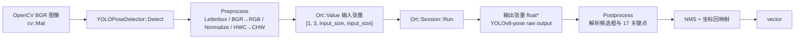
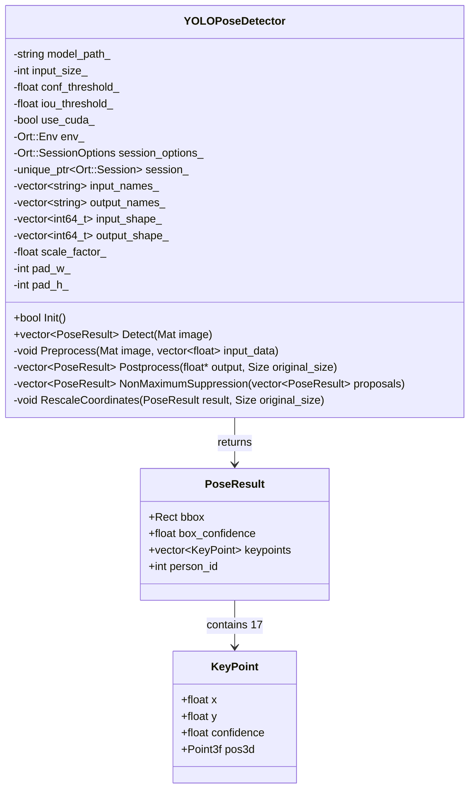
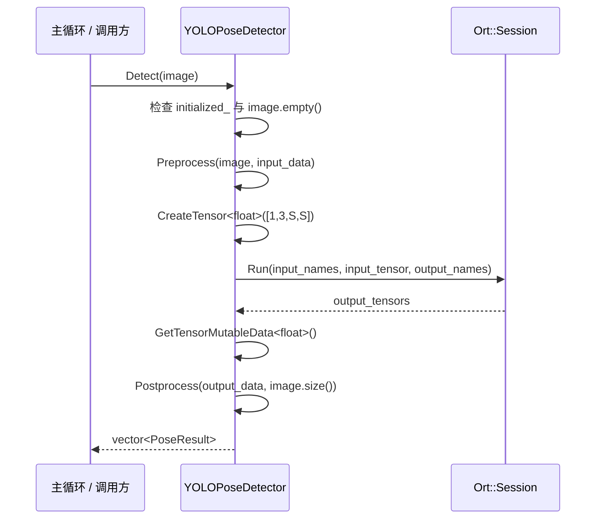
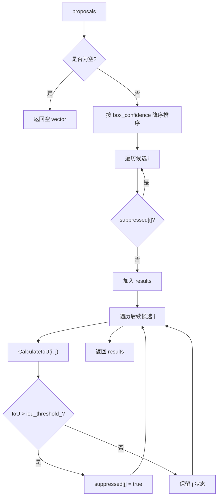

本页聚焦 `YOLOPoseDetector` 这一条 **YOLOv8 Pose → ONNX Runtime → 结构化 2D 姿态结果** 的推理链路：它如何初始化 ONNX Runtime session，如何把 OpenCV BGR 图像转换为模型输入张量，如何运行 `session_->Run()`，以及如何把 YOLOv8-pose 输出解析为 `PoseResult`。深度融合、三维重建、蹦床平面与业务判断不在本页展开，可继续阅读 [Letterbox 预处理、坐标回映射与非极大值抑制](13-letterbox-yu-chu-li-zuo-biao-hui-ying-she-yu-fei-ji-da-zhi-yi-zhi)、[COCO 17 关键点数据结构与骨架可视化](14-coco-17-guan-jian-dian-shu-ju-jie-gou-yu-gu-jia-ke-shi-hua)。Sources: [yolo_pose_detector.h](yolo_pose_detector.h#L60-L90), [yolo_pose_detector.cpp](yolo_pose_detector.cpp#L170-L212)

## 架构假设与代码验证结论

从第一性原理看，ONNX Runtime 推理流程必须完成四件事：**模型会话创建**、**输入张量构造**、**输出张量读取**、**输出语义解析**。本仓库把这四件事集中封装在 `YOLOPoseDetector` 中：构造函数保存模型路径、输入尺寸、检测阈值、NMS 阈值和 CUDA 开关；`Init()` 创建 session 并读取输入输出元信息；`Detect()` 串联预处理、张量创建、ONNX Runtime 执行和后处理；`Postprocess()` 解析 YOLOv8-pose 输出并返回 `std::vector<PoseResult>`。Sources: [yolo_pose_detector.h](yolo_pose_detector.h#L70-L90), [yolo_pose_detector.h](yolo_pose_detector.h#L107-L145), [yolo_pose_detector.cpp](yolo_pose_detector.cpp#L10-L47), [yolo_pose_detector.cpp](yolo_pose_detector.cpp#L53-L117)

下面的图只描述本页范围内的 2D 姿态推理边界。入口程序把 BGR 图像交给 `YOLOPoseDetector::Detect()`，检测器内部完成 ONNX Runtime 推理并输出 `PoseResult`；后续绘制、深度采样和业务算法属于其它页面的范围。Sources: [get_pose_oak_rgbd.cpp](get_pose_oak_rgbd.cpp#L661-L668), [get_pose_indemind_left.cpp](get_pose_indemind_left.cpp#L720-L727), [yolo_pose_detector.cpp](yolo_pose_detector.cpp#L170-L212)

## 运行时入口如何创建检测器

两个主入口都通过 `YOLOPoseDetector(model_path, input_size, 0.5f, 0.45f, true)` 创建检测器，并在创建后立即调用 `Init()`；如果初始化失败，入口程序直接返回错误。OAK RGBD 入口默认模型是 `models/yolov8n-pose-640.onnx`，输入尺寸为 `640`；INDEMIND 兼容入口默认模型是 `models/yolov8m-pose-1280.onnx`，输入尺寸为 `1280`。这说明 `input_size_` 并不是从模型文件名自动推断，而是由入口构造参数显式传入。Sources: [get_pose_oak_rgbd.cpp](get_pose_oak_rgbd.cpp#L605-L608), [get_pose_oak_rgbd.cpp](get_pose_oak_rgbd.cpp#L661-L668), [get_pose_indemind_left.cpp](get_pose_indemind_left.cpp#L675-L678), [get_pose_indemind_left.cpp](get_pose_indemind_left.cpp#L720-L727)

| 入口 | 默认模型路径 | `input_size` | 置信度阈值 | NMS IoU 阈值 | CUDA 参数 |
|---|---:|---:|---:|---:|---:|
| OAK RGBD | `models/yolov8n-pose-640.onnx` | `640` | `0.5f` | `0.45f` | `true` |
| INDEMIND | `models/yolov8m-pose-1280.onnx` | `1280` | `0.5f` | `0.45f` | `true` |

Sources: [get_pose_oak_rgbd.cpp](get_pose_oak_rgbd.cpp#L605-L608), [get_pose_oak_rgbd.cpp](get_pose_oak_rgbd.cpp#L661-L668), [get_pose_indemind_left.cpp](get_pose_indemind_left.cpp#L675-L678), [get_pose_indemind_left.cpp](get_pose_indemind_left.cpp#L720-L727)

## ONNX Runtime 组件边界

`YOLOPoseDetector` 的头文件明确保存了 ONNX Runtime 运行所需的核心对象：`Ort::Env`、`Ort::SessionOptions`、`std::unique_ptr<Ort::Session>` 和默认 allocator；同时缓存输入输出名称、名称指针、输入输出 shape，以及 Letterbox 预处理产生的 `scale_factor_`、`pad_w_`、`pad_h_`。这种设计把 **模型执行状态** 与 **图像几何回映射状态** 放在同一个检测器实例中，因此每次 `Detect()` 都会更新当前帧的缩放与 padding 参数，再在后处理阶段用它们回映射坐标。Sources: [yolo_pose_detector.h](yolo_pose_detector.h#L147-L173), [yolo_pose_detector.cpp](yolo_pose_detector.cpp#L119-L168), [yolo_pose_detector.cpp](yolo_pose_detector.cpp#L348-L381)

## 构造函数：线程、图优化与 CUDA Provider

构造函数初始化模型路径、输入尺寸、阈值、CUDA 标志、ONNX Runtime 环境和预处理状态，并把 `initialized_` 置为 `false`。随后它设置 `session_options_`：单次算子内部线程数为 4，图优化级别为 `ORT_ENABLE_ALL`。如果 `use_cuda_` 为真，代码会创建 `OrtCUDAProviderOptions`，指定 GPU 设备 `0`，设置 arena 策略、cuDNN 卷积算法搜索方式和默认 stream 拷贝行为，然后调用 `AppendExecutionProvider_CUDA()`；如果 CUDA Provider 配置抛出 `Ort::Exception`，则打印警告并把 `use_cuda_` 改为 `false`，也就是回落到 CPU 执行路径。Sources: [yolo_pose_detector.cpp](yolo_pose_detector.cpp#L10-L47)

| 阶段 | 代码行为 | 作用 |
|---|---|---|
| 基础状态初始化 | 保存 `model_path_`、`input_size_`、`conf_threshold_`、`iou_threshold_`、`use_cuda_` | 形成检测器运行配置 |
| ONNX Runtime 环境 | `env_(ORT_LOGGING_LEVEL_WARNING, "YOLOPose")` | 创建 ORT 环境并设置日志级别 |
| Session 选项 | `SetIntraOpNumThreads(4)`、`SetGraphOptimizationLevel(ORT_ENABLE_ALL)` | 设置推理线程与图优化 |
| CUDA Provider | `AppendExecutionProvider_CUDA(cuda_options)` | 尝试启用 GPU 执行 |
| 异常回退 | 捕获 `Ort::Exception` 后 `use_cuda_ = false` | CUDA 配置失败时继续 CPU 路径 |

Sources: [yolo_pose_detector.cpp](yolo_pose_detector.cpp#L10-L47)

## Init：创建 Session 并读取模型元信息

`Init()` 是模型加载边界。它首先打印模型路径和输入尺寸，然后用 `env_`、`model_path_` 与 `session_options_` 创建 `Ort::Session`。创建成功后，代码检查输入节点数量必须为 1；读取输入 tensor shape；通过 allocator 获取输入名称并缓存为 `std::string`，同时缓存对应的 `const char*` 指针供 `session_->Run()` 使用。随后输出节点执行同样流程：检查输出节点数量必须为 1，读取输出 shape，获取输出名称并缓存。全部成功后，`initialized_` 被置为 `true`。Sources: [yolo_pose_detector.cpp](yolo_pose_detector.cpp#L53-L111)

`Init()` 的错误路径也很明确：如果输入节点数量不是 1，或输出节点数量不是 1，函数打印错误并返回 `false`；如果 ONNX Runtime 在 session 创建或元信息读取阶段抛出 `Ort::Exception`，函数打印 `ONNX Runtime error:` 并返回 `false`。因此入口程序只需要检查 `pose_detector.Init()` 的布尔返回值，就能阻止后续在未加载模型的状态下进入推理循环。Sources: [yolo_pose_detector.cpp](yolo_pose_detector.cpp#L63-L68), [yolo_pose_detector.cpp](yolo_pose_detector.cpp#L86-L91), [yolo_pose_detector.cpp](yolo_pose_detector.cpp#L109-L116), [get_pose_oak_rgbd.cpp](get_pose_oak_rgbd.cpp#L661-L668)

## Detect：单帧推理的主干流程

`Detect()` 是面向调用方的单帧推理接口。它先检查 `initialized_`，未初始化时打印 `Detector not initialized! Call Init() first.` 并返回空结果；再检查输入图像是否为空，空图像同样返回空结果。正常路径中，它创建 `std::vector<float> input_data`，调用 `Preprocess()` 填充模型输入，然后构造形状 `{1, 3, input_size_, input_size_}` 的输入张量。这里使用 `Ort::MemoryInfo::CreateCpu(OrtArenaAllocator, OrtMemTypeDefault)` 创建 CPU memory info，并用 `Ort::Value::CreateTensor<float>()` 直接包装 `input_data.data()`。Sources: [yolo_pose_detector.cpp](yolo_pose_detector.cpp#L170-L195)

推理执行点是 `session_->Run()`：它传入空 `Ort::RunOptions`、输入名指针数组、输入 tensor 地址、输入数量 `1`、输出名指针数组和输出数量 `1`，返回 `output_tensors`。随后代码从第一个输出 tensor 取 `float* output_data`，并把原始输出指针与原图尺寸 `image.size()` 交给 `Postprocess()`，最终返回 `std::vector<PoseResult>`。Sources: [yolo_pose_detector.cpp](yolo_pose_detector.cpp#L197-L212)

## Preprocess：从 BGR Mat 到 NCHW Float Tensor

`Preprocess()` 的输入是 OpenCV BGR 图像，输出是连续的 `std::vector<float>`。它先读取原图宽高，然后计算 `scale_factor_ = min(input_size / img_w, input_size / img_h)`，保证等比例缩放后图像完整落入正方形模型输入范围；接着计算缩放后的 `new_w`、`new_h`，并计算左右与上下 padding 的起始量 `pad_w_`、`pad_h_`。这些参数不仅用于构建输入，也会被后处理阶段用于坐标回映射。Sources: [yolo_pose_detector.cpp](yolo_pose_detector.cpp#L119-L136)

缩放阶段使用 `cv::resize()` 得到 `new_w × new_h` 图像；补边阶段使用 `cv::copyMakeBorder()` 将图像放入 `input_size_ × input_size_` 的正方形画布，边界颜色为 `cv::Scalar(114, 114, 114)`。随后代码执行 BGR 到 RGB 转换，并通过 `convertTo(CV_32F, 1.0 / 255.0)` 把像素归一化到 `[0, 1]`。Sources: [yolo_pose_detector.cpp](yolo_pose_detector.cpp#L137-L155)

最后一步是布局转换：OpenCV 图像默认是 HWC，而模型输入张量使用 CHW。代码为 `input_data` 分配 `3 * input_size_ * input_size_` 个 float，使用 `cv::split()` 分离 RGB 三通道，然后逐通道 `memcpy` 到连续内存中，通道大小为 `input_size_ * input_size_`。因此最终输入张量语义是 `[batch=1, channel=3, height=input_size_, width=input_size_]`。Sources: [yolo_pose_detector.cpp](yolo_pose_detector.cpp#L156-L168), [yolo_pose_detector.cpp](yolo_pose_detector.cpp#L185-L195)

| 步骤 | 输入 | 输出 | 关键状态 |
|---|---|---|---|
| 等比例缩放参数 | 原图宽高、`input_size_` | `scale_factor_`, `new_w`, `new_h` | 用于 Letterbox 与回映射 |
| Padding 参数 | `input_size_`, `new_w`, `new_h` | `pad_w_`, `pad_h_` | 用于回映射 |
| Resize | 原始 BGR 图 | 缩放 BGR 图 | 保持宽高比 |
| Border | 缩放图 | 正方形 padded 图 | padding 色值 114 |
| Color + Normalize | padded BGR | RGB float `[0,1]` | 模型输入像素格式 |
| HWC→CHW | RGB Mat | `vector<float>` | 连续 NCHW 输入 |

Sources: [yolo_pose_detector.cpp](yolo_pose_detector.cpp#L119-L168)

## Postprocess：解析 YOLOv8-pose 输出张量

`Postprocess()` 假定 YOLOv8-pose 输出格式为 `[1, 56, 8400]`，其中 `56 = 4 + 1 + 17*3`：4 个 bbox 参数是 `cx, cy, w, h`，1 个检测置信度是 person confidence，17 个关键点各包含 `x, y, visibility`。代码没有硬编码 `8400` 和 `56`，而是从 `output_shape_[2]` 读取 proposal 数量，从 `output_shape_[1]` 读取每个 proposal 的元素数量。Sources: [yolo_pose_detector.cpp](yolo_pose_detector.cpp#L215-L226)

由于模型输出内存布局按 `[1, 56, num_proposals]` 组织，代码先分配 `num_proposals * num_elements` 大小的 `transposed`，把输出转置为更易访问的 `[num_proposals, num_elements]`。转置后，第 `i` 个候选的首地址是 `transposed.data() + i * num_elements`，bbox 位于 `ptr[0..3]`，置信度位于 `ptr[4]`，关键点从 `ptr[5]` 开始。Sources: [yolo_pose_detector.cpp](yolo_pose_detector.cpp#L227-L239)

每个候选会先读取 `cx, cy, w, h` 与 `conf`；如果 `conf < conf_threshold_`，该候选被跳过。保留的候选会创建 `PoseResult`，把中心点格式 bbox 转换为左上角加宽高的 `cv::Rect`，并循环 17 次读取关键点：`kp_x = ptr[5 + k*3 + 0]`、`kp_y = ptr[5 + k*3 + 1]`、`kp_visibility = ptr[5 + k*3 + 2]`，再构造 `KeyPoint(kp_x, kp_y, kp_visibility)`。Sources: [yolo_pose_detector.cpp](yolo_pose_detector.cpp#L237-L279)

| 输出索引范围 | 含义 | 代码读取方式 |
|---:|---|---|
| `0` | bbox center x | `ptr[0]` |
| `1` | bbox center y | `ptr[1]` |
| `2` | bbox width | `ptr[2]` |
| `3` | bbox height | `ptr[3]` |
| `4` | person confidence | `ptr[4]` |
| `5 + k*3 + 0` | 第 `k` 个关键点 x | `ptr[5 + k * 3 + 0]` |
| `5 + k*3 + 1` | 第 `k` 个关键点 y | `ptr[5 + k * 3 + 1]` |
| `5 + k*3 + 2` | 第 `k` 个关键点 visibility | `ptr[5 + k * 3 + 2]` |

Sources: [yolo_pose_detector.cpp](yolo_pose_detector.cpp#L219-L221), [yolo_pose_detector.cpp](yolo_pose_detector.cpp#L241-L276)

## NMS：按检测置信度筛除重叠人体框

候选解析完成后，`Postprocess()` 调用 `NonMaximumSuppression()`。NMS 首先处理空候选列表；非空时按 `box_confidence` 降序排序，然后维护一个 `suppressed` 布尔数组。外层循环遇到未被抑制的候选时将其加入结果；内层循环计算当前候选与后续候选的 IoU，如果 IoU 大于 `iou_threshold_`，则把后续候选标记为 suppressed。Sources: [yolo_pose_detector.cpp](yolo_pose_detector.cpp#L281-L328)

IoU 计算由 `CalculateIoU()` 完成：先计算两个矩形交集的左上角与右下角，再用 `max(0, x2-x1) * max(0, y2-y1)` 得到交集面积；并用 `box1_area + box2_area - intersection_area` 得到并集面积，最后返回 `intersection_area / union_area`。Sources: [yolo_pose_detector.cpp](yolo_pose_detector.cpp#L331-L346)

## 坐标回映射：从模型输入空间回到原图空间

NMS 之后，`Postprocess()` 对每个结果调用 `RescaleCoordinates()`。回映射公式与预处理阶段的 Letterbox 参数严格对应：先减去 padding，再除以 `scale_factor_`，即 `x = (x - pad_w_) / scale_factor_`、`y = (y - pad_h_) / scale_factor_`。随后将坐标 clamp 到原图边界 `[0, width-1]` 与 `[0, height-1]`。Sources: [yolo_pose_detector.cpp](yolo_pose_detector.cpp#L281-L289), [yolo_pose_detector.cpp](yolo_pose_detector.cpp#L348-L360)

bbox 回映射时，代码先取左上角 `(x1, y1)` 和右下角 `(x2, y2)`，分别执行同一个 `rescale` lambda，再用回映射后的坐标重建 `cv::Rect(x1, y1, x2-x1, y2-y1)`。关键点回映射则遍历 `result.keypoints`，对每个 `kp.x`、`kp.y` 执行同一个 `rescale`。因此调用方收到的 `PoseResult` 坐标已经是原始输入图像坐标，而不是模型正方形输入坐标。Sources: [yolo_pose_detector.cpp](yolo_pose_detector.cpp#L362-L381)

## 输出数据结构：PoseResult 与 KeyPoint

`KeyPoint` 保存关键点的二维图像坐标 `x, y`、置信度字段 `confidence`，以及后续深度融合阶段可填充的 `cv::Point3f pos3d`；默认构造函数把这些值置零，带参构造函数写入二维坐标和置信度。`PoseResult` 保存一个人体框 `bbox`、人体检测置信度 `box_confidence`、17 个 `KeyPoint` 和可选 `person_id`，构造时默认把 `person_id` 设为 `-1`，并把关键点数组 resize 到 17。Sources: [yolo_pose_detector.h](yolo_pose_detector.h#L36-L58)

本页只说明 `YOLOPoseDetector` 如何生成 `PoseResult`。COCO 17 个关键点枚举也定义在同一头文件中，例如 `LEFT_SHOULDER=5`、`RIGHT_HIP=12`、`LEFT_ANKLE=15` 等；关键点语义和骨架连接的可视化细节请继续阅读 [COCO 17 关键点数据结构与骨架可视化](14-coco-17-guan-jian-dian-shu-ju-jie-gou-yu-gu-jia-ke-shi-hua)。Sources: [yolo_pose_detector.h](yolo_pose_detector.h#L15-L34), [yolo_pose_detector.h](yolo_pose_detector.h#L36-L58)

## 构建层面的依赖接线

CMake 在配置阶段查找 ONNX Runtime 头文件和库：如果存在 Conda 环境，会优先在 `$CONDA_PREFIX/include` 与 `$CONDA_PREFIX/lib` 下查找；否则回退到系统路径和项目内 `onnxruntime` 目录。找不到时会触发 `FATAL_ERROR`，提示手动设置 `ONNXRUNTIME_INCLUDE_DIR` 与 `ONNXRUNTIME_LIB`。Sources: [CMakeLists.txt](CMakeLists.txt#L73-L123)

构建目标层面，`yolo_pose_detector.cpp` 被列入 `COMMON_SOURCES`，`yolo_pose_detector.h` 被列入 `COMMON_HEADERS`；include 路径包含项目根目录、`app`、OpenCV include、ONNX Runtime include 等。OAK RGBD 目标链接 `${ONNXRUNTIME_LIB}`，因此 `YOLOPoseDetector` 的 ONNX Runtime 调用在链接阶段由该库解析。Sources: [CMakeLists.txt](CMakeLists.txt#L529-L548), [CMakeLists.txt](CMakeLists.txt#L561-L579)

## 当前实现的关键约束

当前实现要求模型输入节点数量为 1、输出节点数量为 1；`Detect()` 构造的输入 shape 固定为 `{1, 3, input_size_, input_size_}`；后处理逻辑按 YOLOv8-pose 的 `[1, 56, proposals]` 输出布局解析，并使用 `output_shape_[1]`、`output_shape_[2]` 决定元素数和候选数。换言之，模型文件、入口传入的 `input_size`、以及输出张量语义必须与这套解析逻辑匹配。Sources: [yolo_pose_detector.cpp](yolo_pose_detector.cpp#L63-L72), [yolo_pose_detector.cpp](yolo_pose_detector.cpp#L86-L95), [yolo_pose_detector.cpp](yolo_pose_detector.cpp#L185-L195), [yolo_pose_detector.cpp](yolo_pose_detector.cpp#L219-L226)

另一个重要约束是坐标回映射依赖检测器实例中的 `scale_factor_`、`pad_w_`、`pad_h_`。这些值在 `Preprocess()` 中按当前帧更新，在 `Postprocess()` 中用于同一帧输出回映射；因此推理流程的正确顺序必须是 `Preprocess()` → `session_->Run()` → `Postprocess()`，不能跳过或复用不属于当前帧的 Letterbox 参数。Sources: [yolo_pose_detector.cpp](yolo_pose_detector.cpp#L119-L136), [yolo_pose_detector.cpp](yolo_pose_detector.cpp#L181-L210), [yolo_pose_detector.cpp](yolo_pose_detector.cpp#L348-L381)

## 阅读路径

如果你要继续理解几何正确性，下一步应读 [Letterbox 预处理、坐标回映射与非极大值抑制](13-letterbox-yu-chu-li-zuo-biao-hui-ying-she-yu-fei-ji-da-zhi-yi-zhi)，它会把本页涉及的缩放、padding、clamp 与 NMS 进一步拆开。如果你要理解 `PoseResult.keypoints[17]` 的语义、左右肢体索引和骨架绘制，应读 [COCO 17 关键点数据结构与骨架可视化](14-coco-17-guan-jian-dian-shu-ju-jie-gou-yu-gu-jia-ke-shi-hua)。Sources: [yolo_pose_detector.cpp](yolo_pose_detector.cpp#L119-L168), [yolo_pose_detector.cpp](yolo_pose_detector.cpp#L292-L381), [yolo_pose_detector.h](yolo_pose_detector.h#L15-L58)