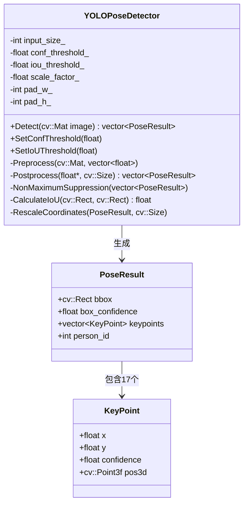

本页聚焦 `YOLOPoseDetector` 内部的三段几何后处理链路：**Letterbox 预处理**如何把任意输入帧变成正方形模型张量，**坐标回映射**如何把模型输入坐标恢复到原图像坐标，**非极大值抑制（NMS）**如何从多个人体候选框中保留重叠较少且置信度更高的结果；不展开 ONNX Runtime 会话创建、COCO 17 关键点语义、深度融合或业务姿态判断，这些内容分别应继续阅读 [YOLOv8 Pose 的 ONNX Runtime 推理流程](12-yolov8-pose-de-onnx-runtime-tui-li-liu-cheng)、[COCO 17 关键点数据结构与骨架可视化](14-coco-17-guan-jian-dian-shu-ju-jie-gou-yu-gu-jia-ke-shi-hua) 与后续 RGBD/业务算法页面。Sources: [yolo_pose_detector.h](yolo_pose_detector.h#L107-L145), [yolo_pose_detector.cpp](yolo_pose_detector.cpp#L119-L168), [yolo_pose_detector.cpp](yolo_pose_detector.cpp#L215-L381)

## 架构假设与验证结论

本页的架构假设是：检测器把“图像尺度变化”集中封装在 `Preprocess()` 与 `RescaleCoordinates()` 之间，用成员变量 `scale_factor_`、`pad_w_`、`pad_h_` 保存一次检测调用中的 Letterbox 参数；模型输出先被解析为候选 `PoseResult`，经过置信度过滤与 NMS 后，再统一回映射到原图坐标。代码验证支持这个假设：头文件声明了 `Preprocess()`、`Postprocess()`、`NonMaximumSuppression()`、`CalculateIoU()`、`RescaleCoordinates()`，并把 `scale_factor_`、`pad_w_`、`pad_h_` 作为预处理状态保存在检测器对象中。Sources: [yolo_pose_detector.h](yolo_pose_detector.h#L107-L145), [yolo_pose_detector.h](yolo_pose_detector.h#L168-L173)

从调用顺序看，`Detect()` 先检查初始化状态与空图像，再调用 `Preprocess(image, input_data)`，随后创建形状为 `{1, 3, input_size_, input_size_}` 的输入张量，运行 ONNX 推理，最后把输出指针和 `image.size()` 交给 `Postprocess()`；因此，Letterbox 与坐标回映射构成同一次 `Detect()` 调用中的一对正反变换。Sources: [yolo_pose_detector.cpp](yolo_pose_detector.cpp#L170-L212)

## 推理前后处理关系图

下面的 Mermaid 图只描述本页范围内的几何与筛选关系：左侧是原始 BGR 图像到模型张量的预处理，右侧是模型输出到原图坐标 `PoseResult` 的后处理；其中 `scale_factor_`、`pad_w_`、`pad_h_` 是连接两侧的关键状态，NMS 在坐标回映射前执行。Sources: [yolo_pose_detector.cpp](yolo_pose_detector.cpp#L119-L168), [yolo_pose_detector.cpp](yolo_pose_detector.cpp#L215-L289)

```mermaid
flowchart LR
    A[原始 BGR 图像\nimage.rows / image.cols] --> B[计算 scale_factor_\nmin(input/img_w, input/img_h)]
    B --> C[resize 到 new_w x new_h]
    C --> D[copyMakeBorder\n填充到 input_size x input_size\n灰色 114]
    D --> E[BGR 转 RGB\n归一化到 0~1]
    E --> F[HWC 转 CHW\nfloat input_data]
    F --> G[ONNX Runtime 推理]
    G --> H[输出 [1, 56, 8400]]
    H --> I[转置为 [8400, 56]\n解析 bbox 与 17*3 keypoints]
    I --> J[conf_threshold_ 过滤]
    J --> K[NMS\n按 box_confidence 降序 + IoU 抑制]
    K --> L[去 padding / 除 scale\nClamp 到原图边界]
    L --> M[原图坐标 PoseResult]
```

`Postprocess()` 的代码顺序验证了图中右半部分：模型输出格式被注释为 `[1, 56, 8400]`，其中 `56 = 4 + 1 + 17*3`；实现先按 `output_shape_[2]` 与 `output_shape_[1]` 得到候选数和元素数，再把 `[1, 56, 8400]` 转置为 `[8400, 56]` 便于逐候选读取，随后解析框、人体置信度和 17 个关键点，最后调用 `NonMaximumSuppression()` 并对 NMS 结果执行 `RescaleCoordinates()`。Sources: [yolo_pose_detector.cpp](yolo_pose_detector.cpp#L215-L289)

## Letterbox：保持宽高比的正方形输入

`Preprocess()` 的第一步是读取原图高度 `img_h = image.rows` 与宽度 `img_w = image.cols`，然后计算 `scale_factor_ = min(input_size_ / img_w, input_size_ / img_h)`；这个公式保证缩放后的图像不会超过模型输入正方形的任一边，较短的一边会留下空白区域用于 padding。Sources: [yolo_pose_detector.cpp](yolo_pose_detector.cpp#L119-L132)

缩放后的尺寸由 `new_w = int(img_w * scale_factor_)` 与 `new_h = int(img_h * scale_factor_)` 得到，水平与垂直 padding 的左/上偏移分别是 `pad_w_ = (input_size_ - new_w) / 2` 和 `pad_h_ = (input_size_ - new_h) / 2`；由于使用整数除法，剩余的另一半 padding 在 `copyMakeBorder()` 的右/下边界表达式中补齐。Sources: [yolo_pose_detector.cpp](yolo_pose_detector.cpp#L131-L147)

真正的图像变换分两步完成：先用 `cv::resize(image, resized, cv::Size(new_w, new_h))` 生成保持宽高比的缩放图，再用 `cv::copyMakeBorder()` 把它扩展为 `input_size_ x input_size_`，边界类型为 `cv::BORDER_CONSTANT`，填充值为 `cv::Scalar(114, 114, 114)`。Sources: [yolo_pose_detector.cpp](yolo_pose_detector.cpp#L137-L147)

Letterbox 后，代码继续执行颜色与张量布局转换：`cv::cvtColor(padded, rgb, cv::COLOR_BGR2RGB)` 把 OpenCV 常用 BGR 输入转成 RGB，`rgb.convertTo(rgb, CV_32F, 1.0 / 255.0)` 把像素归一化到 `[0, 1]`，随后 `cv::split()` 分离三通道并用 `std::memcpy()` 写入连续的 CHW 浮点数组。Sources: [yolo_pose_detector.cpp](yolo_pose_detector.cpp#L149-L167)

| 阶段 | 输入 | 输出 | 代码中的关键状态 | 作用 |
|---|---|---|---|---|
| 尺度计算 | 原图 `img_w/img_h` | `scale_factor_` | `input_size_`、`scale_factor_` | 决定等比缩放比例 |
| 缩放 | 原图 `cv::Mat` | `new_w x new_h` 图像 | `new_w`、`new_h` | 保持宽高比 |
| 填充 | 缩放图 | 正方形 `padded` | `pad_w_`、`pad_h_` | 对齐模型输入尺寸 |
| 颜色/归一化 | BGR `padded` | RGB float | `CV_32F`、`1/255` | 匹配模型输入数值域 |
| 布局转换 | HWC RGB | CHW `input_data` | `3 * input_size_ * input_size_` | 匹配 `{1,3,H,W}` 张量 |

表中的每个阶段都直接对应 `Preprocess()` 中的连续语句；`Detect()` 随后创建输入张量时固定使用 `{1, 3, input_size_, input_size_}`，说明预处理输出必须满足 CHW 且边长等于 `input_size_` 的约束。Sources: [yolo_pose_detector.cpp](yolo_pose_detector.cpp#L119-L168), [yolo_pose_detector.cpp](yolo_pose_detector.cpp#L181-L195)

## 模型输出解析：从 `[1, 56, 8400]` 到候选姿态

`Postprocess()` 明确按 YOLOv8-pose 输出格式解析：`56` 个元素被拆成 `4` 个 bbox 数值、`1` 个人体检测置信度和 `17*3` 个关键点字段；注释还指出关键点第三项是 visibility，代码把它作为 `KeyPoint` 的 `confidence` 字段保存。Sources: [yolo_pose_detector.cpp](yolo_pose_detector.cpp#L215-L225), [yolo_pose_detector.cpp](yolo_pose_detector.cpp#L267-L276)

由于原始输出按 `[1, 56, 8400]` 排布，代码先分配 `transposed(num_proposals * num_elements)`，再用双层循环执行 `transposed[i * num_elements + j] = output[j * num_proposals + i]`，把读取方式转换为“第 i 个候选的一整行 56 个元素”。Sources: [yolo_pose_detector.cpp](yolo_pose_detector.cpp#L224-L235)

每个候选的前四个值按中心点格式读取为 `cx, cy, w, h`，第五个值 `ptr[4]` 作为 person detection confidence；若 `conf < conf_threshold_`，该候选直接跳过，否则创建 `PoseResult` 并把中心点框转换为左上角框：`x1 = cx - w/2`、`y1 = cy - h/2`、`cv::Rect(x1, y1, w, h)`。Sources: [yolo_pose_detector.cpp](yolo_pose_detector.cpp#L237-L266)

17 个关键点从索引 `5` 开始，每个关键点占用三项：`x`、`y`、`visibility`；循环 `k = 0..16` 时读取 `ptr[5 + k*3 + 0/1/2]`，并赋值为 `KeyPoint(kp_x, kp_y, kp_visibility)`。Sources: [yolo_pose_detector.cpp](yolo_pose_detector.cpp#L267-L278)

## NMS：按框重叠抑制重复人体候选

`NonMaximumSuppression()` 的输入是置信度过滤后的 `proposals`；如果候选为空直接返回空结果，否则先按 `box_confidence` 从高到低排序，保证后续保留的是当前未抑制集合中置信度最高的候选。Sources: [yolo_pose_detector.cpp](yolo_pose_detector.cpp#L292-L303)

排序后，代码为每个候选维护一个 `suppressed` 标记数组；外层循环遇到未抑制候选就把它加入 `results`，内层循环比较它与后续所有未抑制候选的 IoU，若 `iou > iou_threshold_`，后续候选被标记为 suppressed。Sources: [yolo_pose_detector.cpp](yolo_pose_detector.cpp#L305-L328)

IoU 计算使用两个 `cv::Rect` 的交集面积与并集面积：交集左上角取两个框左上角最大值，右下角取两个框右下角最小值，交集宽高用 `max(0, x2-x1)` 和 `max(0, y2-y1)` 防止负面积，并集为 `box1_area + box2_area - intersection_area`。Sources: [yolo_pose_detector.cpp](yolo_pose_detector.cpp#L331-L345)

| 参数/状态 | 来源 | 用途 | 当前代码行为 |
|---|---|---|---|
| `conf_threshold_` | 构造函数参数或 `SetConfThreshold()` | 候选进入 NMS 前的人体置信度过滤 | `conf < conf_threshold_` 时跳过候选 |
| `iou_threshold_` | 构造函数参数或 `SetIoUThreshold()` | NMS 判断两个框是否重复 | `iou > iou_threshold_` 时抑制后续框 |
| `box_confidence` | 模型输出 `ptr[4]` | 排序和显示检测置信度 | 降序排序，优先保留高置信度 |
| `bbox` | 模型输出 `cx,cy,w,h` 转换 | IoU 与最终人体框 | NMS 前仍在模型输入坐标系中 |

这些参数的默认值与接口在头文件中声明：构造函数默认 `input_size = 640`、`conf_threshold = 0.5f`、`iou_threshold = 0.45f`，同时提供 `SetConfThreshold()` 与 `SetIoUThreshold()` 运行时修改阈值；实际入口也以显式参数创建检测器。Sources: [yolo_pose_detector.h](yolo_pose_detector.h#L63-L100), [get_pose_oak_rgbd.cpp](get_pose_oak_rgbd.cpp#L661-L668), [get_pose_indemind_left.cpp](get_pose_indemind_left.cpp#L720-L727)

## 坐标回映射：去 padding、除缩放、再裁剪

NMS 后的 `PoseResult` 仍然处在模型输入正方形坐标系中，因此 `Postprocess()` 在返回前对每个 NMS 结果调用 `RescaleCoordinates(result, original_size)`，把 bbox 和关键点恢复到原始图像坐标。Sources: [yolo_pose_detector.cpp](yolo_pose_detector.cpp#L281-L289)

`RescaleCoordinates()` 内部定义了一个局部 lambda：`x = (x - pad_w_) / scale_factor_`，`y = (y - pad_h_) / scale_factor_`；这正好是 Letterbox 的逆过程，先去掉模型输入图上的左/上 padding，再除以等比缩放因子回到原图尺度。Sources: [yolo_pose_detector.cpp](yolo_pose_detector.cpp#L348-L356)

回映射后，代码用 `std::max` 与 `std::min` 把坐标限制在原图范围内：`x` 被裁剪到 `[0, original_size.width - 1]`，`y` 被裁剪到 `[0, original_size.height - 1]`；这避免了模型预测框或关键点略超出原图边界时影响后续绘制与索引。Sources: [yolo_pose_detector.cpp](yolo_pose_detector.cpp#L357-L360)

bbox 的回映射先把 `cv::Rect` 还原为两个角点 `(x1,y1)` 与 `(x2,y2)`，分别执行 `rescale()`，再用回映射后的 `x1,y1,x2-x1,y2-y1` 重建 `cv::Rect`；关键点则遍历 `result.keypoints`，对每个 `kp.x`、`kp.y` 执行同一个 `rescale()`。Sources: [yolo_pose_detector.cpp](yolo_pose_detector.cpp#L362-L380)

| 坐标对象 | NMS 前/后所在空间 | 回映射公式 | 边界处理 |
|---|---|---|---|
| bbox 左上角 | Letterbox 后模型输入坐标 | `(x - pad_w_) / scale_factor_`, `(y - pad_h_) / scale_factor_` | clamp 到原图宽高范围 |
| bbox 右下角 | Letterbox 后模型输入坐标 | 同上 | clamp 到原图宽高范围 |
| 17 个关键点 | Letterbox 后模型输入坐标 | 同上 | clamp 到原图宽高范围 |

这个实现意味着 `PoseResult` 对外暴露的 `bbox` 与 `keypoints` 坐标已经是原始图像坐标；后续可视化函数直接使用 `pose.bbox` 画框，并用 `kp.x/kp.y` 画骨架连线和关键点圆点。Sources: [yolo_pose_detector.cpp](yolo_pose_detector.cpp#L348-L381), [pose_utils.cpp](pose_utils.cpp#L100-L110)

## 模块交互边界

从类接口看，`YOLOPoseDetector` 对外只暴露 `Detect()`、阈值设置与输入尺寸读取；预处理、后处理、NMS、IoU 与坐标回映射都是私有函数，因此调用方不需要也不能直接操作 Letterbox 状态。Sources: [yolo_pose_detector.h](yolo_pose_detector.h#L60-L145)

两个入口都通过构造函数显式传入模型路径、输入尺寸、置信度阈值、IoU 阈值和 CUDA 开关：OAK RGBD 链路使用 `YOLOPoseDetector(model_path, 640, 0.5f, 0.45f, true)`，INDEMIND 链路使用 `YOLOPoseDetector(model_path, 1280, 0.5f, 0.45f, true)`；因此同一个后处理实现同时服务 640 与 1280 两种输入尺寸。Sources: [get_pose_oak_rgbd.cpp](get_pose_oak_rgbd.cpp#L661-L668), [get_pose_indemind_left.cpp](get_pose_indemind_left.cpp#L720-L727)



类图中的数据结构也由头文件验证：`KeyPoint` 保存 `x`、`y`、`confidence` 与后续深度融合用的 `pos3d`，`PoseResult` 保存 `bbox`、`box_confidence`、`keypoints` 和 `person_id`，构造时默认把 `keypoints` 调整为 17 个。Sources: [yolo_pose_detector.h](yolo_pose_detector.h#L36-L58)

## 实现特征与维护注意点

一个关键实现特征是 **NMS 在坐标回映射前执行**：`Postprocess()` 先构造模型输入坐标系中的候选框，然后调用 `NonMaximumSuppression()`，最后才对 NMS 后结果执行 `RescaleCoordinates()`；这保证 IoU 比较发生在同一个 Letterbox 坐标系中。Sources: [yolo_pose_detector.cpp](yolo_pose_detector.cpp#L254-L289), [yolo_pose_detector.cpp](yolo_pose_detector.cpp#L292-L328)

另一个关键实现特征是 **bbox 与关键点使用同一套逆变换**：`RescaleCoordinates()` 的局部 lambda 被 bbox 两个角点和所有 keypoints 复用，因此只要 `scale_factor_`、`pad_w_`、`pad_h_` 来自同一次 `Preprocess()`，框和关键点就会被一致地映射回原图。Sources: [yolo_pose_detector.cpp](yolo_pose_detector.cpp#L348-L380)

当前代码没有在 `CalculateIoU()` 中对 `union_area == 0` 做额外分支，而是直接返回 `intersection_area / union_area`；文档只能确认这一实现事实，不能推断它在异常框面积情况下的运行表现。Sources: [yolo_pose_detector.cpp](yolo_pose_detector.cpp#L331-L345)

当前代码把 bbox 坐标和尺寸在候选构造阶段转换为 `int` 类型的 `cv::Rect`，关键点则保留为 `float`；后续 bbox 回映射重建 `cv::Rect` 时再次转为 `int`，关键点回映射后仍保留浮点坐标。Sources: [yolo_pose_detector.cpp](yolo_pose_detector.cpp#L258-L266), [yolo_pose_detector.cpp](yolo_pose_detector.cpp#L371-L380)

## 下一步阅读

如果你想理解 `Detect()` 外层的 ONNX Runtime 会话、输入输出节点名、CUDA provider 与张量运行流程，下一页应阅读 [YOLOv8 Pose 的 ONNX Runtime 推理流程](12-yolov8-pose-de-onnx-runtime-tui-li-liu-cheng)；如果你想理解 `KeyPoint` 的 17 个索引、骨架连线和绘制阈值，应继续阅读 [COCO 17 关键点数据结构与骨架可视化](14-coco-17-guan-jian-dian-shu-ju-jie-gou-yu-gu-jia-ke-shi-hua)。Sources: [yolo_pose_detector.h](yolo_pose_detector.h#L15-L58), [pose_utils.cpp](pose_utils.cpp#L100-L110)

如果你关心这些 2D 关键点如何进入深度图采样、相机内参反投影与 3D 坐标恢复，请继续阅读 [深度图单位、相机内参与像素反投影](16-shen-du-tu-dan-wei-xiang-ji-nei-can-yu-xiang-su-fan-tou-ying) 和 [鲁棒深度采样与无效深度过滤策略](17-lu-bang-shen-du-cai-yang-yu-wu-xiao-shen-du-guo-lu-ce-lue)；本页只说明 2D 检测结果已经在返回前被映射回原始图像坐标。Sources: [yolo_pose_detector.cpp](yolo_pose_detector.cpp#L348-L381), [yolo_pose_detector.h](yolo_pose_detector.h#L36-L58)