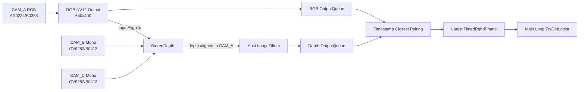
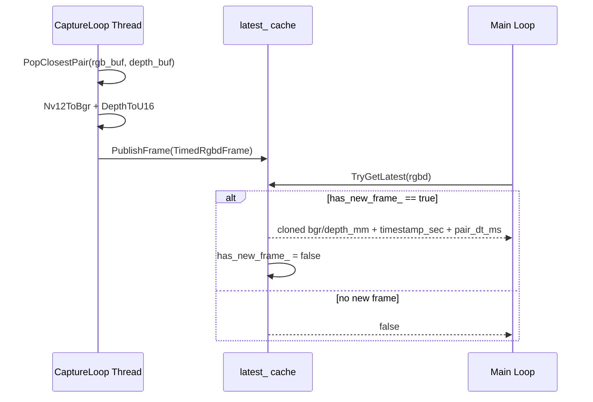

本页解释 OAK RGBD 新链路中 **DepthAI 管线如何构建、RGB 与 Depth 如何配对、时间同步误差如何进入主推理循环**。范围限定在采集层与同步层：包括 CAM_A/CAM_B/CAM_C 的 DepthAI 节点、StereoDepth 对齐、主机端 ImageFilters、输出队列、最近时间戳配对、最新帧发布，以及主循环读取 `TimedRgbdFrame` 的方式；深度单位、反投影、鲁棒采样等后续 3D 细节请继续阅读 [深度图单位、相机内参与像素反投影](16-shen-du-tu-dan-wei-xiang-ji-nei-can-yu-xiang-su-fan-tou-ying) 与 [鲁棒深度采样与无效深度过滤策略](17-lu-bang-shen-du-cai-yang-yu-wu-xiao-shen-du-guo-lu-ce-lue)。Sources: [oak_rgbd_capture.h](app/oak_rgbd_capture.h#L11-L40), [oak_rgbd_capture.cpp](app/oak_rgbd_capture.cpp#L280-L389), [get_pose_oak_rgbd.cpp](get_pose_oak_rgbd.cpp#L731-L747)

## 架构假设与验证结论

从第一原则看，RGBD 采集层必须同时满足三个约束：**空间对齐**，即 depth 图与 CAM_A RGB 图具有相同分辨率与像素坐标；**时间邻近**，即交付给业务层的 RGB 与 depth 来自时间戳差值不超过配置阈值的一对帧；**主循环解耦**，即 DepthAI 采集线程不阻塞 YOLO 推理主循环，而是发布一份“最新可用 RGBD 帧”。代码验证结果与此一致：`StereoDepth` 输出尺寸被设置为 RGB 尺寸并通过 `inputAlignTo` 对齐到 CAM_A，RGB/depth 分别进入主机队列后按时间戳最近邻配对，最终通过 `PublishFrame()` 覆盖式发布到 `TryGetLatest()` 可读取的缓存。Sources: [oak_rgbd_capture.cpp](app/oak_rgbd_capture.cpp#L353-L377), [oak_rgbd_capture.cpp](app/oak_rgbd_capture.cpp#L423-L456), [oak_rgbd_capture.cpp](app/oak_rgbd_capture.cpp#L233-L243)



上图中的关键不是“有两个输出队列”，而是 **RGB 输出同时承担图像输出与 StereoDepth 对齐参考**：`rgb_out` 被创建为 CAM_A 的 NV12 输出，随后链接到 `stereo->inputAlignTo`；`stereo->depth` 再经过主机端 `ImageFilters` 输出到 depth 队列。因此主循环看到的是已经在采集层对齐到 CAM_A 的 `CV_16UC1` depth，而不是一个需要业务层再做跨相机重映射的裸 stereo depth。Sources: [oak_rgbd_capture.cpp](app/oak_rgbd_capture.cpp#L334-L377), [README_OAK_RGBD.md](README_OAK_RGBD.md#L10-L17)

## 采集配置对象：同步行为的外部参数边界

`OakRgbdConfig` 是 OAK 采集链路的配置边界，包含 RGB 分辨率、mono 分辨率、帧率、RGB-depth 配对阈值、曝光与 ISO、StereoDepth 置信度、subpixel、extended disparity，以及主机端 speckle/spatial 滤波参数。默认配置给出 `rgb_width=640`、`rgb_height=400`、`mono_width=640`、`mono_height=400`、`fps=50.0f`、`pair_threshold_ms=5.0`；实际 OAK 入口在 `main()` 中显式覆盖部分参数，并将 `subpixel` 设为 `true`、`enable_speckle_filter` 与 `enable_spatial_filter` 设为 `false`。Sources: [oak_rgbd_capture.h](app/oak_rgbd_capture.h#L11-L33), [get_pose_oak_rgbd.cpp](get_pose_oak_rgbd.cpp#L616-L637)

| 参数组 | 字段 | 在本页中的作用 | 代码位置 |
|---|---|---|---|
| 图像规格 | `rgb_width/rgb_height`, `mono_width/mono_height` | 决定 CAM_A 输出尺寸、stereo 输入尺寸与 depth 输出尺寸 | `OakRgbdConfig` 与 `CaptureLoop()` |
| 时间同步 | `fps`, `pair_threshold_ms` | 决定相机请求帧率与 RGB-depth 最近邻配对容忍窗口 | `OakRgbdConfig` 与 `PopClosestPair()` |
| 曝光同步稳定性 | `exposure_us`, `rgb_iso`, `mono_iso` | 三路相机使用手动曝光和关闭 anti-banding | `CaptureLoop()` |
| StereoDepth | `confidence`, `subpixel`, `extended_disparity` | 控制 stereo 深度输出配置 | `CaptureLoop()` |
| Host Filters | `enable_post_processing`, speckle/spatial 字段 | 构造主机端 `ImageFiltersConfig` | `BuildHostFilterConfig()` |

这张表只描述采集层可验证的配置职责：字段本身定义在头文件中，入口配置写在 OAK 主程序中，字段被消费的位置集中在 `CaptureLoop()` 与 `BuildHostFilterConfig()`；它不延伸解释深度数值如何参与 3D 几何计算。Sources: [oak_rgbd_capture.h](app/oak_rgbd_capture.h#L11-L33), [oak_rgbd_capture.cpp](app/oak_rgbd_capture.cpp#L161-L187), [oak_rgbd_capture.cpp](app/oak_rgbd_capture.cpp#L327-L363)

## DepthAI 设备启动与内参读取

`OakRgbdCapture::Start()` 负责启动后台采集线程，并通过条件变量等待 `CaptureLoop()` 报告启动结果；如果线程已经运行则直接返回成功。采集线程进入后首先设置 `DEPTHAI_AUTOCALIBRATION=OFF`，构造 `dai::Device::Config`，对 GPIO 6 设置输出高电平，然后创建 `dai::Device`、打印 USB speed 与已连接相机信息。Sources: [oak_rgbd_capture.cpp](app/oak_rgbd_capture.cpp#L206-L224), [oak_rgbd_capture.cpp](app/oak_rgbd_capture.cpp#L280-L291)

启动阶段还从设备标定中读取 CAM_A 在目标 RGB 分辨率下的内参矩阵，并将 `fx/fy/cx/cy` 填入 3×3 `cv::Mat`；同时缓存 `K_` 与 `K_inv_`，供主程序启动后调用 `GetCameraMatrix()` 与 `GetCameraMatrixInv()`。主程序在 OAK capture 启动成功后读取这两个矩阵，并在矩阵为空时停止采集并退出。Sources: [oak_rgbd_capture.cpp](app/oak_rgbd_capture.cpp#L293-L306), [oak_rgbd_capture.cpp](app/oak_rgbd_capture.cpp#L246-L254), [get_pose_oak_rgbd.cpp](get_pose_oak_rgbd.cpp#L639-L652)

## 三相机 DepthAI 管线：CAM_A 为 RGB 与对齐目标，CAM_B/C 为 stereo 输入

管线使用 `dai::Pipeline pipeline(device)` 创建三路 Camera 节点：CAM_A 使用固定传感器规格 `1920x1200` 并按配置帧率构建，CAM_B 与 CAM_C 使用配置中的 mono 分辨率与同一帧率构建。随后三路相机设置 frame sync：CAM_B 为 `OUTPUT`，CAM_A 与 CAM_C 为 `INPUT`；启动日志也明确输出 “FSYNC: CAM_B OUTPUT master, CAM_A/C INPUT”。Sources: [oak_rgbd_capture.cpp](app/oak_rgbd_capture.cpp#L308-L325), [oak_rgbd_capture.cpp](app/oak_rgbd_capture.cpp#L379-L386)

三路相机都使用手动曝光：CAM_A 使用 `exposure_us/rgb_iso`，CAM_B 与 CAM_C 使用 `exposure_us/mono_iso`，并且三路都关闭 anti-banding。代码层面可确认这是采集层对输入一致性的固定策略，但本页不推断其对图像质量或测距误差的经验效果。Sources: [oak_rgbd_capture.cpp](app/oak_rgbd_capture.cpp#L327-L332), [oak_rgbd_capture.h](app/oak_rgbd_capture.h#L18-L20)

## RGB、Mono 与 StereoDepth 输出链路

CAM_A 的 `rgb_out` 请求输出为配置 RGB 分辨率、`dai::ImgFrame::Type::NV12`、`STRETCH` resize、配置 FPS，并启用最后一个布尔参数；CAM_B/C 的 `left_out/right_out` 请求输出为 mono 分辨率、默认图像类型、`STRETCH` resize、配置 FPS，并将最后一个布尔参数设为 `false`。这构成了后续主机端 RGB 解码与 StereoDepth 输入的两个来源。Sources: [oak_rgbd_capture.cpp](app/oak_rgbd_capture.cpp#L334-L351)

`StereoDepth` 节点被设置为 mono 输入分辨率、RGB 输出尺寸，并关闭保持宽高比；预设为 `FAST_ACCURACY`，开启 left-right check，按配置设置 subpixel 与 extended disparity，开启 `setFrameSync(true)`，设置 confidence threshold，并将 `inputConfig` 设为非阻塞。CAM_B/C 输出分别链接到 `stereo->left/right`，CAM_A 的 `rgb_out` 链接到 `stereo->inputAlignTo`，注释明确标记这是 RVC2 路径下将 stereo depth 对齐到 CAM_A RGB 输出的方式。Sources: [oak_rgbd_capture.cpp](app/oak_rgbd_capture.cpp#L353-L370)

## 主机端深度滤波与输出队列

`ImageFilters` 节点被创建后设置为 `setRunOnHost(true)`，其 `initialConfig` 来自 `BuildHostFilterConfig(cfg_)`，输入连接 `stereo->depth`，输出创建为 depth 队列；RGB 队列直接从 `rgb_out` 创建。两个输出队列都使用常量 `kOutputQueueSize=120` 与 `kOutputQueueBlocking=true`。Sources: [oak_rgbd_capture.cpp](app/oak_rgbd_capture.cpp#L19-L21), [oak_rgbd_capture.cpp](app/oak_rgbd_capture.cpp#L371-L377)

`BuildHostFilterConfig()` 只在 `enable_post_processing` 为真时插入滤波器；若启用 speckle，则设置 `enable=true`、`speckleRange` 与 `differenceThreshold`；若启用 spatial，则设置 `enable=true`、`alpha`、`delta`、`holeFillingRadius` 与 `numIterations`。入口配置虽然开启 `enable_post_processing`，但将 speckle 与 spatial 都设为 `false`，因此本次入口配置不会插入这两个滤波器。Sources: [oak_rgbd_capture.cpp](app/oak_rgbd_capture.cpp#L161-L187), [get_pose_oak_rgbd.cpp](get_pose_oak_rgbd.cpp#L629-L637)

| 队列 | 来源 | 数据语义 | 队列参数 | 后续处理 |
|---|---|---|---|---|
| `rgb_queue` | `rgb_out` | CAM_A NV12 RGB 输出 | size 120, blocking true | `Nv12ToBgr()` 转 BGR |
| `depth_queue` | `filters->output` | 对齐到 CAM_A 的 depth 输出 | size 120, blocking true | `DepthToU16()` 转 `CV_16UC1` |

队列表达的是采集线程内部的生产端结构：两个队列并不直接暴露给主循环，而是先进入本地 deque 缓冲，再由最近时间戳配对逻辑生成 `TimedRgbdFrame`。Sources: [oak_rgbd_capture.cpp](app/oak_rgbd_capture.cpp#L376-L377), [oak_rgbd_capture.cpp](app/oak_rgbd_capture.cpp#L392-L456)

## RGB-Depth 最近时间戳配对算法

采集循环启动 pipeline 后持续从两个输出队列中非阻塞拉取所有可用消息：RGB 消息进入 `rgb_buf`，depth 消息进入 `depth_buf`，每次追加都通过 `AppendAndTrim()` 限制 deque 最大长度为 `kPairBufferLimit=90`，超出时弹出最旧帧并递增对应 dropped 计数。若本轮没有拿到任何消息，线程 sleep 500 微秒，避免空转。Sources: [oak_rgbd_capture.cpp](app/oak_rgbd_capture.cpp#L19-L20), [oak_rgbd_capture.cpp](app/oak_rgbd_capture.cpp#L43-L52), [oak_rgbd_capture.cpp](app/oak_rgbd_capture.cpp#L395-L421)

`PopClosestPair()` 以 `primary_buf.front()` 的 RGB 时间戳为基准，在 secondary depth 缓冲中扫描绝对时间差最小的帧；若最小差值超过 `threshold_ms`，则比较 RGB 与该 depth 的时间戳，丢弃更早的一侧并返回 false；若差值在阈值内，则弹出当前 RGB、弹出 depth 缓冲中从队首到最佳索引的所有帧，输出这一对消息与 `pair_dt_ms`。Sources: [oak_rgbd_capture.cpp](app/oak_rgbd_capture.cpp#L54-L97)

```mermaid
flowchart TD
    A[读取 rgb_buf.front 时间戳] --> B[扫描 depth_buf 找最小 abs(dt)]
    B --> C{best_dt <= pair_threshold_ms?}
    C -- 否 --> D{RGB 时间戳更早?}
    D -- 是 --> E[丢弃 RGB 队首<br/>dropped_rgb++]
    D -- 否 --> F[丢弃 Depth 队首<br/>dropped_depth++]
    E --> G[本轮不发布配对帧]
    F --> G
    C -- 是 --> H[输出 RGB 队首与最佳 Depth]
    H --> I[记录 pair_dt_ms]
    I --> J[转换格式并 PublishFrame]
```

该算法的精确行为可以概括为 **以 RGB 队首驱动的最近邻配对 + 阈值外早帧淘汰**。它不是按序号配对，也不是等待两个队列完全同步；它利用 DepthAI 消息时间戳计算毫秒级差值，并将每一对成功配对的 `best_dt` 作为 `TimedRgbdFrame::pair_dt_ms` 传递给主循环。Sources: [oak_rgbd_capture.cpp](app/oak_rgbd_capture.cpp#L35-L40), [oak_rgbd_capture.cpp](app/oak_rgbd_capture.cpp#L54-L97), [oak_rgbd_capture.cpp](app/oak_rgbd_capture.cpp#L450-L455)

## 帧格式归一化：NV12 到 BGR，Depth 到 U16

配对成功后，RGB 消息通过 `Nv12ToBgr()` 转换为 OpenCV BGR 图像。该函数优先尝试 `msg->getCvFrame()`：若已经是 `CV_8UC3` 则 clone 返回；若是 `CV_8UC1` 且形状符合 NV12 的 `height * 3 / 2 × width`，则用 `cv::COLOR_YUV2BGR_NV12` 转换，否则按灰度转 BGR；若 `getCvFrame()` 不可用，则读取 raw frame，必要时 reshape 到 NV12 高度后再转换。Sources: [oak_rgbd_capture.cpp](app/oak_rgbd_capture.cpp#L99-L140)

depth 消息通过 `DepthToU16()` 归一化：若 frame 为空则返回空；若为 `CV_16UC1` 则 clone；若为 `CV_16SC1` 则 convert 到 `CV_16U`；若 frame depth 为 `CV_16U` 且单通道也 clone；其他类型返回空。发布前还会强制检查 RGB 是否为配置尺寸的 `CV_8UC3`，depth 是否为同一 RGB 尺寸的 `CV_16UC1`；不满足时打印错误并跳过该对帧。Sources: [oak_rgbd_capture.cpp](app/oak_rgbd_capture.cpp#L142-L159), [oak_rgbd_capture.cpp](app/oak_rgbd_capture.cpp#L433-L448)

## TimedRgbdFrame：同步结果的最小数据契约

`TimedRgbdFrame` 只包含四个字段：`timestamp_sec`、`pair_dt_ms`、`bgr` 与 `depth_mm`。采集线程在构造它时使用 RGB 消息时间戳作为帧时间戳，使用最近邻配对得到的 `pair_dt` 作为同步误差，并移动 BGR 与 depth Mat 后调用 `PublishFrame()`。Sources: [oak_rgbd_capture.h](app/oak_rgbd_capture.h#L35-L40), [oak_rgbd_capture.cpp](app/oak_rgbd_capture.cpp#L450-L456)

`PublishFrame()` 在 `latest_mutex_` 下覆盖缓存中的 `timestamp_sec`、`pair_dt_ms`、`bgr` 与 `depth_mm`，并设置 `has_new_frame_=true`；`TryGetLatest()` 同样在锁下检查该标志，成功时 clone 两个 Mat 到调用方，并将 `has_new_frame_` 置回 false。这个契约意味着主循环读取的是“最新发布且尚未消费”的一份 RGBD 帧，而不是一个可积压的帧队列。Sources: [oak_rgbd_capture.cpp](app/oak_rgbd_capture.cpp#L271-L278), [oak_rgbd_capture.cpp](app/oak_rgbd_capture.cpp#L233-L243)



这个 sequence diagram 对应的是线程协作边界：后台线程持续采集并覆盖最新 RGBD 帧，主线程只在 `TryGetLatest()` 返回 true 时进入后续检测流程；若没有新帧，主线程仅处理键盘退出检查并继续等待。Sources: [oak_rgbd_capture.cpp](app/oak_rgbd_capture.cpp#L271-L278), [get_pose_oak_rgbd.cpp](get_pose_oak_rgbd.cpp#L731-L740)

## 主推理循环如何使用同步误差

OAK 主程序创建 `OakRgbdConfig` 后启动 `OakRgbdCapture`，再在主循环中调用 `TryGetLatest(rgbd)`。读取成功后，`rgbd.bgr` 被赋给 `left_image`，`rgbd.depth_mm` 被赋给 `depth_data`，`rgbd.timestamp_sec` 被保存在 `image_timestamp`，`rgbd.pair_dt_ms` 被写入 `depth_sync_error_ms`。Sources: [get_pose_oak_rgbd.cpp](get_pose_oak_rgbd.cpp#L616-L647), [get_pose_oak_rgbd.cpp](get_pose_oak_rgbd.cpp#L731-L747)

在本页范围内，`depth_sync_error_ms` 的来源可以精确追溯为 `PopClosestPair()` 输出的最近 RGB-depth 时间戳差值；主循环不重新配对、不重新读取 DepthAI 队列，也不直接访问 `dai::ImgFrame`。这种边界将 DepthAI 管线复杂度封装在 `OakRgbdCapture` 内部，对业务层暴露的是 OpenCV Mat 与同步误差数值。Sources: [oak_rgbd_capture.cpp](app/oak_rgbd_capture.cpp#L54-L97), [oak_rgbd_capture.cpp](app/oak_rgbd_capture.cpp#L450-L456), [get_pose_oak_rgbd.cpp](get_pose_oak_rgbd.cpp#L742-L747)

## 运行时统计：采集、配对与丢帧的可观测性

`OakRgbdCapture` 提供 `ImageCount()`、`DepthCount()`、`PairedCount()`、`DroppedRgbCount()` 与 `DroppedDepthCount()` 这些只读计数接口；采集循环在收到 RGB/depth 消息时分别递增 image/depth 计数，在成功发布配对帧后递增 paired 计数，在缓冲裁剪或阈值外淘汰时递增 dropped 计数。Sources: [oak_rgbd_capture.h](app/oak_rgbd_capture.h#L58-L63), [oak_rgbd_capture.cpp](app/oak_rgbd_capture.cpp#L43-L52), [oak_rgbd_capture.cpp](app/oak_rgbd_capture.cpp#L399-L456)

程序退出时会停止 OAK capture、销毁窗口，并打印总运行时间、采集图像数、depth map 数、姿态检测数、丢弃 RGB 帧数、丢弃 depth 帧数，以及基于总时间计算的平均 image/depth/pose 速率。这些统计反映采集同步层的吞吐与丢帧情况，但不区分丢帧来源是缓冲上限裁剪还是配对阈值外淘汰。Sources: [get_pose_oak_rgbd.cpp](get_pose_oak_rgbd.cpp#L1490-L1511), [oak_rgbd_capture.cpp](app/oak_rgbd_capture.cpp#L43-L52), [oak_rgbd_capture.cpp](app/oak_rgbd_capture.cpp#L77-L87)

| 计数 | 递增位置 | 含义 |
|---|---|---|
| `image_count_` | RGB 队列成功 `tryGet` 后 | 进入主机 RGB 缓冲的消息数 |
| `depth_count_` | depth 队列成功 `tryGet` 后 | 进入主机 depth 缓冲的消息数 |
| `paired_count_` | `PublishFrame()` 后 | 成功生成并发布的 RGBD 对数 |
| `dropped_rgb_` | 缓冲裁剪或阈值外 RGB 早帧淘汰 | 未进入发布帧的 RGB 消息数 |
| `dropped_depth_` | 缓冲裁剪或阈值外 depth 早帧淘汰 | 未进入发布帧的 depth 消息数 |

这些计数器是理解同步层行为的第一诊断入口：如果 image/depth 速率正常但 paired 速率低，检查 `pair_threshold_ms` 与 dropped 计数；如果 dropped 计数只在高负载时上升，则需要结合 [性能统计、队列限流与只处理最新帧策略](25-xing-neng-tong-ji-dui-lie-xian-liu-yu-zhi-chu-li-zui-xin-zheng-ce-lue) 继续分析主循环消费速度。Sources: [oak_rgbd_capture.h](app/oak_rgbd_capture.h#L58-L63), [oak_rgbd_capture.cpp](app/oak_rgbd_capture.cpp#L399-L456), [get_pose_oak_rgbd.cpp](get_pose_oak_rgbd.cpp#L1497-L1511)

## 与相邻页面的阅读边界

读完本页后，下一步应进入 [深度图单位、相机内参与像素反投影](16-shen-du-tu-dan-wei-xiang-ji-nei-can-yu-xiang-su-fan-tou-ying)，因为本页只确认 depth Mat 已对齐到 CAM_A、类型为 `CV_16UC1`、由 `TimedRgbdFrame::depth_mm` 交给主循环；至于 “mm 数值如何变成相机坐标系 3D 点”，属于下一页的几何主题。Sources: [oak_rgbd_capture.h](app/oak_rgbd_capture.h#L35-L40), [README_OAK_RGBD.md](README_OAK_RGBD.md#L54-L58)

如果关注采集线程与主循环协作的更广义工程模式，请转到 [全局状态、回调线程与主循环协作模式](27-quan-ju-zhuang-tai-hui-diao-xian-cheng-yu-zhu-xun-huan-xie-zuo-mo-shi)；如果关注帧处理吞吐、只处理最新帧与限流策略，请转到 [性能统计、队列限流与只处理最新帧策略](25-xing-neng-tong-ji-dui-lie-xian-liu-yu-zhi-chu-li-zui-xin-zheng-ce-lue)。Sources: [oak_rgbd_capture.cpp](app/oak_rgbd_capture.cpp#L233-L243), [oak_rgbd_capture.cpp](app/oak_rgbd_capture.cpp#L271-L278), [get_pose_oak_rgbd.cpp](get_pose_oak_rgbd.cpp#L731-L747)