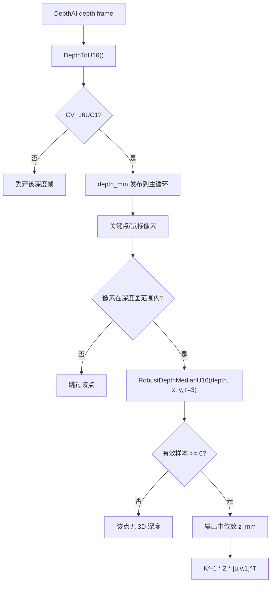
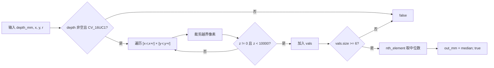

本页聚焦一个边界清晰的问题：当 2D 姿态关键点或鼠标 ROI 操作落到深度图像素上时，系统如何从 `CV_16UC1` 毫米深度图中取得稳定、可用的深度值，并在遇到空图、错误类型、越界像素、无效深度和离群深度时主动跳过后续三维计算。当前实现的核心模式是“**局部窗口采样 → 无效值过滤 → 中位数代表值 → 失败即不生成 3D 点**”。Sources: [depth_utils.cpp](app/depth_utils.cpp#L6-L27), [get_pose_oak_rgbd.cpp](get_pose_oak_rgbd.cpp#L863-L897)

## 架构假设与验证结论

从第一原则看，深度融合链路必须先保证输入深度图的格式稳定，再保证单个像素深度不会被空洞或局部噪声直接污染，最后才能执行像素反投影。代码验证后可以确认：OAK 链路在发布帧前将深度帧转换为 `CV_16UC1`，并检查深度尺寸、类型与 RGB 输出一致；业务侧再通过 `RobustDepthMedianU16` 对每个关键点或鼠标点做局部中值采样，采样失败时直接 `continue` 或显示 `invalid depth`。Sources: [oak_rgbd_capture.cpp](app/oak_rgbd_capture.cpp#L142-L158), [oak_rgbd_capture.cpp](app/oak_rgbd_capture.cpp#L433-L454), [depth_region.h](app/depth_region.h#L121-L130), [get_pose_oak_rgbd.cpp](get_pose_oak_rgbd.cpp#L875-L889)

下面的关系图只描述本页范围内的深度采样与过滤路径，不展开相机同步、姿态推理、床面坐标系或落点状态机；这些内容分别属于 [OAK DepthAI 管线、RGB-Depth 配对与时间同步](15-oak-depthai-guan-xian-rgb-depth-pei-dui-yu-shi-jian-tong-bu)、[YOLOv8 Pose 的 ONNX Runtime 推理流程](12-yolov8-pose-de-onnx-runtime-tui-li-liu-cheng) 与 [四点 ROI、RANSAC 平面拟合与床面坐标系构建](18-si-dian-roi-ransac-ping-mian-ni-he-yu-chuang-mian-zuo-biao-xi-gou-jian)。Sources: [oak_rgbd_capture.cpp](app/oak_rgbd_capture.cpp#L425-L454), [depth_utils.cpp](app/depth_utils.cpp#L6-L27), [get_pose_oak_rgbd.cpp](get_pose_oak_rgbd.cpp#L863-L897)



## 深度图输入契约：只接受 16 位单通道毫米深度

OAK 采集模块中的 `DepthToU16` 将 DepthAI 的 `ImgFrame` 转成 OpenCV 矩阵；如果输入已经是 `CV_16UC1` 则克隆返回，如果是 `CV_16SC1` 则转换到 `CV_16U`，如果矩阵深度为 `CV_16U` 且单通道也直接克隆，否则返回空矩阵。随后主循环发布前再次要求深度图宽高等于配置的 RGB 宽高，并且类型必须是 `CV_16UC1`，不满足则打印错误并跳过该帧。Sources: [oak_rgbd_capture.cpp](app/oak_rgbd_capture.cpp#L142-L158), [oak_rgbd_capture.cpp](app/oak_rgbd_capture.cpp#L433-L454)

这意味着后续鲁棒采样函数面对的是明确的输入契约：`depth_mm` 是单通道 16 位无符号深度图，单位为毫米，并且在 OAK RGBD 入口注释中标明深度与 `CAM_A` RGB 对齐；采样层不再负责对齐或单位换算，只负责在像素邻域内选出可信的毫米深度值。Sources: [get_pose_oak_rgbd.cpp](get_pose_oak_rgbd.cpp#L5-L14), [oak_rgbd_capture.h](app/oak_rgbd_capture.h#L39-L39), [depth_utils.h](app/depth_utils.h#L8-L11)

| 层级 | 代码位置 | 本页相关职责 | 失败处理 |
|---|---|---|---|
| 采集转换 | `DepthToU16` | 将 DepthAI 深度帧规范化为 16 位单通道矩阵 | 返回空矩阵 |
| 发布前校验 | `CaptureLoop` | 检查 RGB/Depth 尺寸与深度类型 | 打印错误并跳过帧 |
| 采样函数 | `RobustDepthMedianU16` | 校验非空、类型、邻域有效深度数量 | 返回 `false` |
| 业务调用点 | 关键点三维化 / 鼠标显示 | 根据返回值决定是否反投影 | 跳过点或显示无效深度 |

Sources: [oak_rgbd_capture.cpp](app/oak_rgbd_capture.cpp#L142-L158), [oak_rgbd_capture.cpp](app/oak_rgbd_capture.cpp#L433-L454), [depth_utils.cpp](app/depth_utils.cpp#L6-L27), [depth_region.h](app/depth_region.h#L121-L130), [get_pose_oak_rgbd.cpp](get_pose_oak_rgbd.cpp#L875-L889)

## 核心函数：局部窗口中值采样

`RobustDepthMedianU16` 是本策略的核心函数。它首先拒绝空矩阵和非 `CV_16UC1` 输入；随后以目标像素 `(x, y)` 为中心，在半径 `r` 的正方形邻域内遍历候选深度值，遍历时对图像边界做裁剪，越界像素不会参与采样。Sources: [depth_utils.cpp](app/depth_utils.cpp#L6-L18)

函数的无效深度规则非常直接：深度值为 `0` 的像素被过滤，深度值大于等于 `10000` 毫米的像素也被过滤；剩余深度值被放入 `vals`。当有效样本数少于 `6` 时，函数返回 `false`，表示该像素邻域不足以支撑可靠深度估计。Sources: [depth_utils.cpp](app/depth_utils.cpp#L18-L24)

当有效样本数量满足下限后，函数使用 `std::nth_element` 将中位位置元素放到 `vals.size()/2`，并把该位置的值写入 `out_mm`；调用者得到的不是中心像素原值，而是局部有效深度集合的中位数。Sources: [depth_utils.cpp](app/depth_utils.cpp#L24-L27)



| 过滤条件 | 代码判定 | 含义 | 结果 |
|---|---|---|---|
| 深度图为空 | `depth_mm.empty()` | 没有可采样输入 | 返回 `false` |
| 类型不匹配 | `depth_mm.type() != CV_16UC1` | 输入不是 16 位单通道深度 | 返回 `false` |
| 邻域像素越界 | `xx/yy` 范围检查 | 窗口靠近图像边缘 | 跳过越界像素 |
| 深度为零 | `z == 0` | 无效深度值 | 不加入样本 |
| 深度过大 | `z >= 10000` | 超出当前策略接受范围 | 不加入样本 |
| 有效样本太少 | `vals.size() < 6` | 邻域内可用深度不足 | 返回 `false` |

Sources: [depth_utils.cpp](app/depth_utils.cpp#L6-L27)

## 半径 r=3 的实际调用语义

在当前代码中，关键点三维化与鼠标深度显示都以 `r=3` 调用 `RobustDepthMedianU16`。结合函数内部从 `-r` 到 `+r` 的双层循环，`r=3` 对应最多 `7×7` 个候选像素；但由于边界裁剪、`0` 值过滤和 `>=10000` 过滤，实际参与中位数计算的样本数可能少于 49，且少于 6 时整体失败。Sources: [depth_utils.cpp](app/depth_utils.cpp#L9-L24), [depth_region.h](app/depth_region.h#L121-L130), [get_pose_oak_rgbd.cpp](get_pose_oak_rgbd.cpp#L875-L879)

这个设计把“单点深度读取”替换为“局部有效样本的中位值”，避免中心像素恰好为无效值时直接破坏 3D 点生成；同时它没有对缺失深度做插值或外推，因为样本不足时返回 `false`，调用端会跳过该关键点或显示无效深度。Sources: [depth_utils.cpp](app/depth_utils.cpp#L18-L27), [get_pose_oak_rgbd.cpp](get_pose_oak_rgbd.cpp#L875-L889), [depth_region.h](app/depth_region.h#L121-L130)

## 在姿态关键点三维化中的失败传播

OAK RGBD 主循环中，系统会遍历每个人体姿态的关键点；关键点置信度低于 `0.3f` 时直接跳过，像素坐标超出深度图范围时也跳过。只有通过这两层检查后，代码才调用 `RobustDepthMedianU16(depth_data, px, py, r=3, z_mm)`。Sources: [get_pose_oak_rgbd.cpp](get_pose_oak_rgbd.cpp#L855-L878)

如果鲁棒采样失败，当前关键点不会生成相机坐标；如果采样成功，代码把 `z_mm` 转成 `double Z`，构造齐次像素向量 `[px, py, 1]^T`，再用 `cv_in_left_inv * Z * kp_img_cor` 计算相机坐标，并把 `kp_valid[k]` 标记为 `true`。Sources: [get_pose_oak_rgbd.cpp](get_pose_oak_rgbd.cpp#L875-L893)

髋点聚合也继承这个有效性约束：左髋或右髋不仅需要对应关键点置信度高于 `0.5f`，还必须满足 `info.kp_valid[LEFT_HIP]` 或 `info.kp_valid[RIGHT_HIP]`；因此，无效深度不会被用于骨盆点计算。Sources: [get_pose_oak_rgbd.cpp](get_pose_oak_rgbd.cpp#L899-L917)

INDEMIND 兼容入口采用同样的调用模式：关键点置信度、像素边界、`RobustDepthMedianU16` 返回值三者依次作为门控条件，采样成功后才进行反投影并标记关键点有效。Sources: [get_pose_indemind_left.cpp](get_pose_indemind_left.cpp#L994-L1027)

```mermaid
sequenceDiagram
    participant Pose as 2D Pose Keypoint
    participant Main as 主循环
    participant Sampler as RobustDepthMedianU16
    participant K as 相机内参逆矩阵
    Pose->>Main: kp.x, kp.y, confidence
    Main->>Main: confidence >= 0.3 且像素在 depth 范围内
    Main->>Sampler: depth_data, px, py, r=3
    Sampler-->>Main: false 或 z_mm
    alt false
        Main->>Main: continue，kp_valid 保持 false
    else z_mm
        Main->>K: K^-1 * Z * [px,py,1]^T
        Main->>Main: kp_cam[k] = cam_pt; kp_valid[k] = true
    end
```

## 在鼠标深度预览中的显示策略

`DepthRegion::ShowElems` 中的鼠标深度预览同样调用 `RobustDepthMedianU16(depth, point_.x, point_.y, r=3, z_mm)`。采样失败时，`cursor_valid` 被置为 `false`；采样成功时，代码使用同样的相机内参逆矩阵反投影出 `(x, y, z)` 毫米坐标。Sources: [depth_region.h](app/depth_region.h#L111-L130)

显示层根据 `cursor_valid` 决定输出内容：成功时显示 `Current camera pos: [x, y, z] mm`，失败时显示 `Current camera pos: [invalid depth]`。因此鼠标预览不会把无效深度伪装成零坐标，也不会在 UI 上给出误导性的 3D 值。Sources: [depth_region.h](app/depth_region.h#L136-L152)

## ROI 平面采样中的相同无效值边界

虽然 ROI 平面拟合属于 [四点 ROI、RANSAC 平面拟合与床面坐标系构建](18-si-dian-roi-ransac-ping-mian-ni-he-yu-chuang-mian-zuo-biao-xi-gou-jian) 的主题，但本页需要指出它在深度有效性上使用了相同的边界规则：ROI 内采样时要求深度图非空且类型为 `CV_16UC1`，并过滤 `z_mm == 0` 与 `z_mm >= 10000` 的点。Sources: [depth_region.h](app/depth_region.h#L284-L296), [depth_region.h](app/depth_region.h#L313-L327)

ROI 采样与关键点采样的区别在于：ROI 代码按 `roi_sample_step_` 在多边形掩膜内网格采样，并直接读取该像素深度；关键点与鼠标预览则调用局部窗口中位数函数。两者共享“只接受非零且小于 10000 毫米”的有效深度边界，但采样粒度不同。Sources: [depth_region.h](app/depth_region.h#L306-L327), [depth_utils.cpp](app/depth_utils.cpp#L11-L27)

| 使用场景 | 采样方式 | 无效值过滤 | 失败条件 | 输出用途 |
|---|---|---|---|---|
| 姿态关键点 | `r=3` 局部窗口中位数 | `0` 与 `>=10000` 被过滤 | 有效样本少于 6 或前置门控失败 | 关键点相机坐标 |
| 鼠标预览 | `r=3` 局部窗口中位数 | `0` 与 `>=10000` 被过滤 | 有效样本少于 6 | UI 显示当前相机坐标或无效深度 |
| ROI 深度点 | 多边形掩膜内按步长直接采样 | `0` 与 `>=10000` 被过滤 | ROI 样本不足等后续条件失败 | ROI 点云输入 |

Sources: [get_pose_oak_rgbd.cpp](get_pose_oak_rgbd.cpp#L863-L897), [depth_region.h](app/depth_region.h#L111-L152), [depth_region.h](app/depth_region.h#L306-L333)

## 策略边界：它解决什么，不解决什么

这套策略解决的是局部深度空洞、单像素噪声和明显无效距离值进入三维链路的问题：格式错误会在采集层被拒绝，像素越界会在调用层被拒绝，深度为 `0` 或不小于 `10000` 毫米会在采样层被拒绝，邻域有效样本不足会让采样函数返回失败。Sources: [oak_rgbd_capture.cpp](app/oak_rgbd_capture.cpp#L433-L454), [get_pose_oak_rgbd.cpp](get_pose_oak_rgbd.cpp#L863-L878), [depth_utils.cpp](app/depth_utils.cpp#L6-L27)

它不在本层处理 RGB-Depth 时间同步、不改变相机内参、不估计床面坐标系，也不对缺失关键点进行补全；代码中这些职责分别出现在采集配对、反投影、坐标系转换和后续状态处理位置。本页只把边界限定在“深度值是否可用于当前像素的三维反投影”。Sources: [oak_rgbd_capture.cpp](app/oak_rgbd_capture.cpp#L425-L454), [get_pose_oak_rgbd.cpp](get_pose_oak_rgbd.cpp#L881-L897), [depth_region.h](app/depth_region.h#L374-L403)

## 阅读路径建议

如果你想理解本页之前的输入来源，下一步应阅读 [OAK DepthAI 管线、RGB-Depth 配对与时间同步](15-oak-depthai-guan-xian-rgb-depth-pei-dui-yu-shi-jian-tong-bu)；如果你想理解 `z_mm` 如何通过内参变成相机坐标，应阅读 [深度图单位、相机内参与像素反投影](16-shen-du-tu-dan-wei-xiang-ji-nei-can-yu-xiang-su-fan-tou-ying)；如果你关心 ROI 深度点如何进一步形成床面模型，应继续阅读 [四点 ROI、RANSAC 平面拟合与床面坐标系构建](18-si-dian-roi-ransac-ping-mian-ni-he-yu-chuang-mian-zuo-biao-xi-gou-jian)。Sources: [oak_rgbd_capture.cpp](app/oak_rgbd_capture.cpp#L425-L454), [get_pose_oak_rgbd.cpp](get_pose_oak_rgbd.cpp#L875-L897), [depth_region.h](app/depth_region.h#L284-L355)