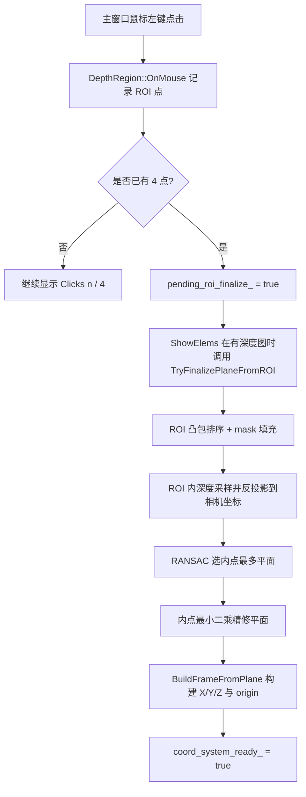
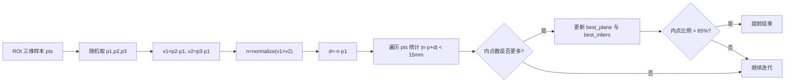
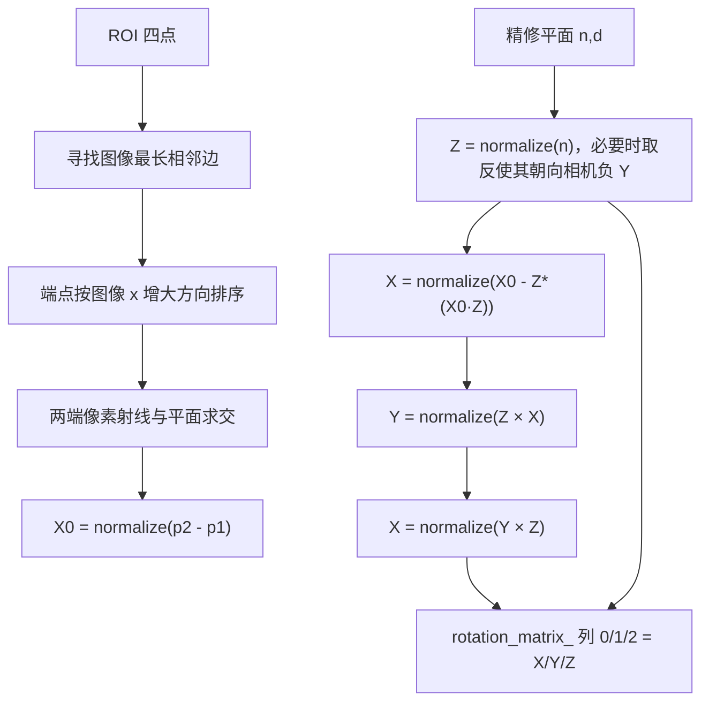
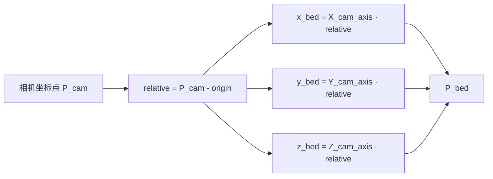

本文位于“蹦床空间建模”章节中的当前页，聚焦一个闭环：用户在主视觉窗口点击 **4 个床面角点**，`DepthRegion` 在深度图 ROI 内采样三维点，用 **RANSAC + 内点最小二乘精修** 得到床面平面，再从平面法向量与 ROI 最长边构造床面坐标系；坐标系就绪后，后续模块可把相机坐标点转换到床面坐标。本文不展开人体坐标系、落点状态机或姿态分类，这些内容应继续阅读 [相机坐标系、床面坐标系与人体坐标系的转换关系](19-xiang-ji-zuo-biao-xi-chuang-mian-zuo-biao-xi-yu-ren-ti-zuo-biao-xi-de-zhuan-huan-guan-xi) 与 [髋点轨迹建模与落点检测状态机](21-kuan-dian-gui-ji-jian-mo-yu-luo-dian-jian-ce-zhuang-tai-ji)。Sources: [depth_region.h](app/depth_region.h#L45-L49), [depth_region.h](app/depth_region.h#L284-L371), [depth_region.h](app/depth_region.h#L1152-L1234)

## 架构假设与代码验证结论

从第一性原理看，床面坐标系不能直接由 2D 点击点确定，因为点击点只给出图像平面上的像素约束；代码实际采用的可验证路径是：先用四点形成图像 ROI，再从深度图中反投影出一批相机坐标三维点，随后在三维点集上估计床面平面，最后把平面几何转成坐标系基向量。`TryFinalizePlaneFromROI` 明确执行了 `convexHull`、`fillPoly`、深度过滤、`cv_in_left_inv * z * [u,v,1]^T` 反投影、`FitPlaneRansac`、`FitPlaneLeastSquares` 和 `BuildFrameFromPlane`，因此该模块的核心模式是 **交互式 ROI 约束下的鲁棒三维平面建模**。Sources: [depth_region.h](app/depth_region.h#L298-L327), [depth_region.h](app/depth_region.h#L335-L363), [camera_intrinsics.h](app/camera_intrinsics.h#L6-L8)

该流程图对应的调度点在 `OnMouse` 与 `ShowElems`：鼠标左键点击超过 4 点时会先重置 ROI，点击数达到 4 时只设置 `pending_roi_finalize_`，真正的平面拟合延迟到 `ShowElems` 拿到当前深度图之后执行；这避免了鼠标回调线程直接依赖深度帧数据。Sources: [depth_region.h](app/depth_region.h#L50-L80), [depth_region.h](app/depth_region.h#L96-L109), [depth_region.h](app/depth_region.h#L1031-L1041)

## 运行时入口与交互状态

两个主程序都把 `DepthRegion` 接入主显示窗口：OAK RGBD 入口在 `"YOLO Pose - OAK CAM_A RGBD"` 上注册 `OnDepthMouseCallback`，INDEMIND 入口在 `"YOLO Pose - INDEMIND Left Camera"` 上注册同类回调；两条链路都在主显示图上调用 `DrawCoordinateSystem` 和 `DrawRect`，因此 ROI 绘制与床面坐标轴可视化是入口共享的 `DepthRegion` 能力。Sources: [get_pose_oak_rgbd.cpp](get_pose_oak_rgbd.cpp#L1028-L1040), [get_pose_oak_rgbd.cpp](get_pose_oak_rgbd.cpp#L1168-L1169), [get_pose_indemind_left.cpp](get_pose_indemind_left.cpp#L1165-L1171), [get_pose_indemind_left.cpp](get_pose_indemind_left.cpp#L1299-L1300)

| 交互/状态 | 代码行为 | 成功后的可见反馈 |
|---|---|---|
| 第 1 至第 4 次左键点击 | `roi_points_` 追加像素点，`click_count_` 同步更新 | `region` 窗口显示 ROI 点列表与 `Clicks: n / 4` |
| 第 4 次点击 | `pending_roi_finalize_ = true` | 下一次 `ShowElems` 使用深度图触发拟合 |
| 第 5 次及之后点击 | 如果已有 4 点，先 `ResetRoiSelection()` | 清空旧平面状态并重新选择 |
| 坐标系构建成功 | `coord_system_ready_ = true` | `region` 显示 `Trampoline Frame: READY` 与内点比例 |

以上表格只归纳 `DepthRegion` 内部状态机的可验证行为：`OnMouse` 管理点击与重置，`ShowElems` 显示 ROI 点、点击计数、坐标系就绪状态和内点统计，`ResetRoiSelection` 清除 ROI、平面拟合标志、内点统计与坐标系就绪标志。Sources: [depth_region.h](app/depth_region.h#L64-L79), [depth_region.h](app/depth_region.h#L154-L190), [depth_region.h](app/depth_region.h#L1031-L1041)

## ROI 到三维样本：从像素约束转为相机坐标点云

ROI 不是直接用于拟合平面，而是先被规范化为凸四边形：`TryFinalizePlaneFromROI` 对 `roi_points_` 调用 `cv::convexHull`，若结果不是 4 点则判定为退化 ROI 并放弃拟合；随后用 `cv::fillPoly` 在深度图尺寸上生成 mask，只在 mask 内按固定步长扫描像素。Sources: [depth_region.h](app/depth_region.h#L298-L313)

深度采样的输入约束非常明确：深度图必须非空且类型为 `CV_16UC1`，ROI 内像素深度值为 `0` 或 `>= 10000` 时会被过滤；有效像素通过 `cv_in_left_inv * z_mm * [x,y,1]^T` 反投影为相机坐标系下的 `cv::Point3d`，并存入 `samples`。如果有效三维样本少于 50 个，函数输出警告并返回失败。Sources: [depth_region.h](app/depth_region.h#L293-L327), [depth_region.h](app/depth_region.h#L330-L333), [camera_intrinsics.cpp](app/camera_intrinsics.cpp#L1-L4)

| 参数/阈值 | 当前值 | 作用位置 | 失败条件或影响 |
|---|---:|---|---|
| 深度图类型 | `CV_16UC1` | `TryFinalizePlaneFromROI` | 类型不匹配直接放弃拟合 |
| ROI 采样步长 | `roi_sample_step_ = 4` | ROI mask 扫描 | 步长越小样本越密，当前代码固定为 4 |
| 深度上限过滤 | `< 10000 mm` | ROI 深度采样 | `0` 与 `>=10000` 被跳过 |
| 最少 ROI 样本数 | `50` | RANSAC 前检查 | 少于 50 个样本直接失败 |

这些参数均是当前实现中的硬编码成员或条件判断：`roi_sample_step_`、`ransac_max_iters_`、`ransac_inlier_thresh_mm_` 定义在类私有状态中，深度类型、无效深度和样本数量检查位于 ROI 完成阶段。Sources: [depth_region.h](app/depth_region.h#L293-L333), [depth_region.h](app/depth_region.h#L1242-L1252)

## RANSAC：用随机三点模型隔离异常深度

`FitPlaneRansac` 的平面假设来自随机抽取的 3 个不同样本点：代码用两条向量叉乘得到候选法向量，若法向量范数过小则跳过退化三点；候选平面写作 `n·p + d = 0`，其中 `d = -n·p1`。Sources: [depth_region.h](app/depth_region.h#L1084-L1116)

每个候选平面都会遍历全部样本点，计算点到平面的代数距离绝对值 `abs(n·p + d)`；由于 `n` 已归一化，这个值直接以毫米为单位与 `ransac_inlier_thresh_mm_` 比较。当前内点阈值为 `15.0`，迭代上限为 `200`，当最佳内点数超过样本数的 `85%` 时提前终止；最终最佳内点数至少要达到 `10`，否则 RANSAC 失败。Sources: [depth_region.h](app/depth_region.h#L1117-L1137), [depth_region.h](app/depth_region.h#L1250-L1252)

RANSAC 在这里的架构价值不是给出最终最优平面，而是从深度 ROI 中筛出对同一床面一致的内点集合；真正写入 `plane_coeffs_` 的平面来自后续 `FitPlaneLeastSquares(inliers, plane_refined)`。Sources: [depth_region.h](app/depth_region.h#L335-L357), [depth_region.h](app/depth_region.h#L1084-L1137)

## 内点最小二乘精修：把鲁棒筛选结果变成稳定平面

`FitPlaneLeastSquares` 先计算输入点集均值，再围绕均值累积 3×3 协方差矩阵，随后调用 `cv::eigen` 做特征分解；代码取 `eigen_vecs` 的第 3 行作为法向量，归一化后计算 `d = -n·mean`，最终输出 `[nx, ny, nz, d]`。Sources: [depth_region.h](app/depth_region.h#L1043-L1081)

该精修只对 RANSAC 的内点执行，而不是对全部 ROI 样本执行，因此实现上分为两层：RANSAC 负责抗异常深度，最小二乘负责用一致样本降低随机三点模型的抖动。拟合成功后，代码保存 `plane_coeffs_`、`plane_inlier_count_`、`plane_inlier_ratio_`，并把 `plane_fit_ready_` 置为 `true`。Sources: [depth_region.h](app/depth_region.h#L343-L358)

## 床面坐标系构建：Z 来自平面，X 来自 ROI 最长边，Y 保持右手系

`BuildFrameFromPlane` 首先把精修平面的法向量作为候选 `Z_vec` 并归一化；代码注释说明相机 `Y+` 向下，因此当 `Z_vec[1] > 0` 时反转法向量，使床面 Z 轴朝向相机坐标的负 Y 方向。这个“向上”约定来自当前实现中的显式判断。Sources: [depth_region.h](app/depth_region.h#L1152-L1162)

X 轴不是任意选择的平面切向量，而是来自 ROI 四边形的最长边：代码遍历 4 条相邻边，选出图像长度最大的边，并在必要时交换端点，保证第二点的图像 `x` 不小于第一点，即 X 轴参考方向在图像上指向右侧。随后这两个像素点通过 `PixelToPlanePoint` 与拟合平面求交，得到相机坐标下的两端三维点。Sources: [depth_region.h](app/depth_region.h#L1164-L1186), [depth_region.h](app/depth_region.h#L1139-L1149)

`PixelToPlanePoint` 的几何含义是“像素射线与床面平面求交”：像素 `[u,v,1]` 先乘以 `cv_in_left_inv` 得到相机射线方向 `dir`，再用 `t = -d / (n·dir)` 求交点；若射线与平面近似平行或交点在相机后方，则构建失败。Sources: [depth_region.h](app/depth_region.h#L1139-L1149), [camera_intrinsics.h](app/camera_intrinsics.h#L6-L8)

X 轴初值由最长边两端三维点相减得到，随后代码把它投影回平面内，即减去其在 Z 轴上的分量并重新归一化；Y 轴由 `Z × X` 得到并归一化，最后再用 `Y × Z` 重算 X，确保三轴正交并保持右手系。Sources: [depth_region.h](app/depth_region.h#L1188-L1208)

坐标系原点不是 ROI 的某个角点，也不是平面与光轴交点；当前实现把所有内点三维坐标求平均，并将该均值写入 `origin_`。之后 `coord_system_ready_ = true`，标志床面坐标系可用于可视化与坐标变换。Sources: [depth_region.h](app/depth_region.h#L1222-L1234)

## 旋转矩阵与坐标变换的精确定义

`rotation_matrix_` 的三列分别写入 X、Y、Z 三个床面轴在相机坐标系下的方向分量：第 0 列是 `X_vec`，第 1 列是 `Y_vec`，第 2 列是 `Z_vec`。这意味着它在实现上保存的是“床面基向量用相机坐标表达”的 3×3 矩阵。Sources: [depth_region.h](app/depth_region.h#L1210-L1220), [depth_region.h](app/depth_region.h#L1254-L1256)

`TransformToNewFrame` 先计算 `relative = point_cam - origin_`，再分别与旋转矩阵的 X、Y、Z 列做点积，得到床面坐标 `new_coords.x/y/z`；代码注释写明这是 `new_coords = R^T * relative`。因此，任何相机坐标点进入床面坐标系时，都先平移到床面原点，再投影到床面三轴。Sources: [depth_region.h](app/depth_region.h#L374-L402)

`GetCoordinateSystem` 在坐标系就绪时返回 `rotation_matrix_.clone()` 与 `origin_`，可供其他模块读取床面基向量和原点；如果 `coord_system_ready_` 为假，则返回 `false`。Sources: [depth_region.h](app/depth_region.h#L506-L519)

## 可视化与诊断信号

主图像上的 ROI 绘制由 `DrawRect` 完成：未完成坐标系时颜色为红色，坐标系就绪后颜色为绿色；函数会绘制每个 ROI 点，并在点数不少于 2 时用 `cv::polylines` 连接，4 点时闭合多边形。Sources: [depth_region.h](app/depth_region.h#L405-L425)

床面坐标轴由 `DrawCoordinateSystem` 绘制：函数从 `origin_` 沿旋转矩阵三列分别延伸 `200 mm` 得到 X/Y/Z 端点，再投影到图像平面；X 轴用红色，Y 轴用绿色，Z 轴用蓝色，并分别标注 `X`、`Y`、`Z`。Sources: [depth_region.h](app/depth_region.h#L428-L504)

`region` 诊断窗口提供两类关键反馈：未就绪时显示 `Clicks: n / 4`，就绪后显示 `Trampoline Frame: READY` 与 `Plane inliers: count (ratio%)`；这些信息直接来自 `click_count_`、`plane_inlier_count_` 与 `plane_inlier_ratio_`。Sources: [depth_region.h](app/depth_region.h#L174-L190)

## 失败路径与边界条件

当前实现中的失败路径是显式可枚举的：ROI 点数不是 4、深度图为空或类型不为 `CV_16UC1`、凸包不是 4 点、ROI 内有效深度样本少于 50、RANSAC 最佳内点少于 10、内点最小二乘失败、像素射线无法与平面求交、构建 X/Y/Z 时向量退化，都会导致本次床面坐标系构建失败。Sources: [depth_region.h](app/depth_region.h#L284-L363), [depth_region.h](app/depth_region.h#L1089-L1137), [depth_region.h](app/depth_region.h#L1139-L1208)

| 阶段 | 失败条件 | 代码反应 |
|---|---|---|
| ROI 输入 | `roi_points_.size() != 4` | 返回 `false` |
| 深度输入 | `depth.empty()` 或类型不是 `CV_16UC1` | 输出警告并返回 |
| ROI 几何 | `convexHull` 后不是 4 点 | 输出退化 ROI 警告 |
| 样本数量 | `samples.size() < 50` | 输出样本不足警告 |
| RANSAC | 最佳内点数 `< 10` | 拟合失败 |
| 精修 | 内点最小二乘失败 | 输出精修失败警告 |
| 坐标系 | 法向量、X、Y 退化或射线求交失败 | 构建失败 |

这些失败条件说明该模块依赖三个前置事实：四边形 ROI 必须有效，深度图必须已经与主图像坐标对齐并以毫米 `uint16` 表示，ROI 内必须有足够多的有效床面深度点。OAK 入口文件顶部注释明确写明深度为 `CV_16UC1 millimeters aligned to CAM_A`，而 `DepthRegion` 的采样逻辑也按毫米单位处理 `uint16_t z_mm`。Sources: [get_pose_oak_rgbd.cpp](get_pose_oak_rgbd.cpp#L3-L6), [depth_region.h](app/depth_region.h#L293-L327)

## 与相邻页面的阅读衔接

读完本页后，下一步应沿目录继续到 [相机坐标系、床面坐标系与人体坐标系的转换关系](19-xiang-ji-zuo-biao-xi-chuang-mian-zuo-biao-xi-yu-ren-ti-zuo-biao-xi-de-zhuan-huan-guan-xi)，因为本页已经解释了 `origin_`、`rotation_matrix_` 与 `TransformToNewFrame` 的来源；如果需要理解旋转表达的矩阵、四元数和欧拉角语义，再继续阅读 [旋转矩阵、四元数与欧拉角的姿态表达](20-xuan-zhuan-ju-zhen-si-yuan-shu-yu-ou-la-jiao-de-zi-tai-biao-da)。Sources: [depth_region.h](app/depth_region.h#L374-L402), [depth_region.h](app/depth_region.h#L506-L519)