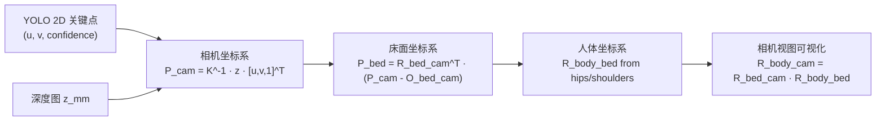
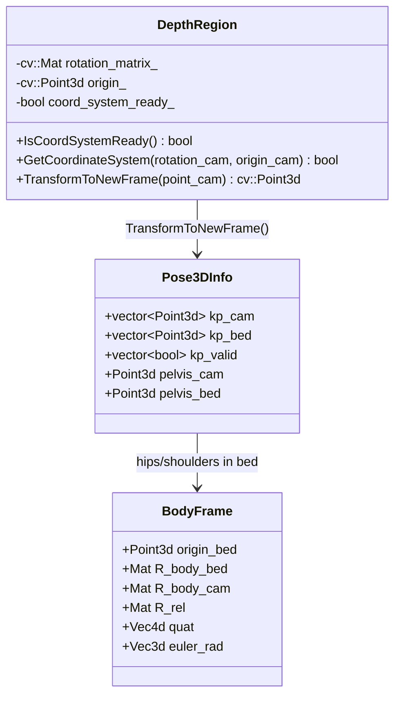
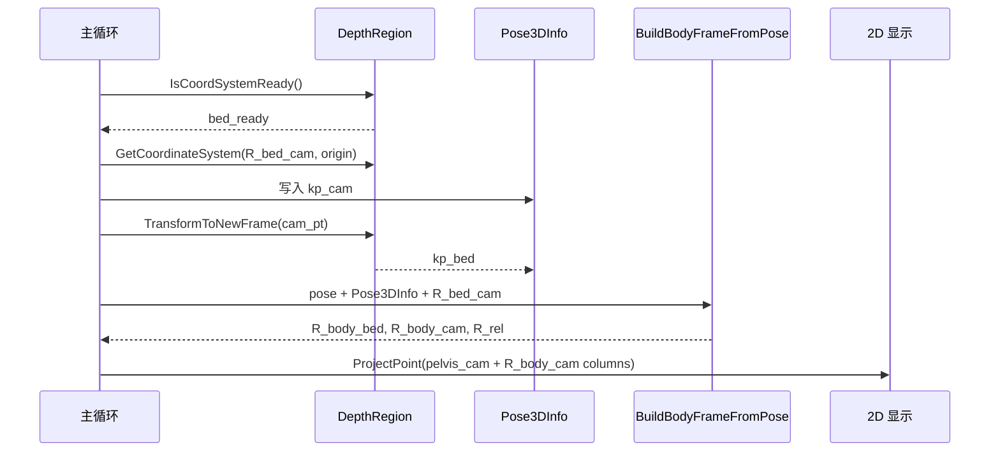

本文的核心假设是：本项目的三维几何链路不是“直接在人体上定义全局姿态”，而是先把 **2D 关键点 + 深度** 反投影到左相机坐标系，再通过已标定的床面坐标系把关键点转换到蹦床局部空间，最后在床面坐标中用髋部与肩部关键点构建人体坐标系；代码验证显示，这条链路由 `Pose3DInfo` 保存相机坐标与床面坐标，由 `DepthRegion` 提供床面坐标系状态、旋转矩阵和原点，由 `BuildBodyFrameFromPose` 生成人体相对床面的旋转表达。Sources: [get_pose_indemind_left.cpp](get_pose_indemind_left.cpp#L44-L61), [app/depth_region.h](app/depth_region.h#L506-L519), [get_pose_indemind_left.cpp](get_pose_indemind_left.cpp#L579-L669)

## 坐标系关系总览

当前实现中存在三个直接参与转换的坐标系：**相机坐标系**用于承载由深度反投影得到的三维点，**床面坐标系**由床面 ROI 对应平面建立并作为运动分析的稳定参考系，**人体坐标系**由床面坐标中的髋部与肩部关键点构建；关键数据结构 `Pose3DInfo` 同时保存 `kp_cam`、`kp_bed`、`kp_valid`、`pelvis_cam` 与 `pelvis_bed`，说明主流程显式维护“相机空间点”和“床面空间点”的并行表示。Sources: [get_pose_indemind_left.cpp](get_pose_indemind_left.cpp#L44-L51), [get_pose_indemind_left.cpp](get_pose_indemind_left.cpp#L970-L983)

这张图中的 `R_bed_cam` 对应 `DepthRegion::GetCoordinateSystem` 返回的 `rotation_matrix_`，其列向量是床面坐标轴在相机坐标系下的方向；`TransformToNewFrame` 对相机点先减去床面原点 `origin_`，再使用该矩阵列向量做点积，等价于执行 `R^T * relative`，得到床面坐标。Sources: [app/depth_region.h](app/depth_region.h#L511-L519), [app/depth_region.h](app/depth_region.h#L374-L403)

## 从像素到相机坐标系：反投影是第一层变换

主循环对每个检测到的人体关键点执行相同的反投影：先过滤置信度低于 `0.3f` 的关键点，再检查像素是否落在深度图边界内，然后用 `RobustDepthMedianU16(depth_data, px, py, r=3, z_mm)` 取得稳健深度，最后构造齐次像素向量 `[px, py, 1]^T` 并计算 `kp_camera_cor = cv_in_left_inv * Z * kp_img_cor`；其中 `Z` 来自毫米单位的 `z_mm`，所以 `cam_pt` 也以毫米为单位进入后续链路。Sources: [get_pose_indemind_left.cpp](get_pose_indemind_left.cpp#L994-L1023)

相机反投影也在通用工具函数 `MapPoseTo3D` 中以同一针孔模型表达：从相机内参矩阵读取 `fx`、`fy`、`cx`、`cy`，再按 `X = (u - cx) * Z / fx`、`Y = (v - cy) * Z / fy`、`Z = Z` 生成相机坐标系下的三维位置，并最终以毫米写回关键点的 `pos3d` 字段；不过当前 INDEMIND 主链路使用的是 `get_pose_indemind_left.cpp` 内的稳健深度采样与床面转换流程。Sources: [pose_utils.cpp](pose_utils.cpp#L53-L95), [get_pose_indemind_left.cpp](get_pose_indemind_left.cpp#L1006-L1027)

| 变换阶段 | 输入 | 输出 | 代码公式/操作 | 单位 |
|---|---|---|---|---|
| 像素 + 深度 → 相机点 | `(px, py, z_mm)` | `cam_pt` | `cv_in_left_inv * Z * [px, py, 1]^T` | mm |
| 相机点 → 床面点 | `cam_pt` | `kp_bed[k]` | `TransformToNewFrame(cam_pt)` | mm |
| 床面关键点 → 人体坐标轴 | hips/shoulders in bed | `R_body_bed` | 髋肩向量 + Gram-Schmidt | 单位轴 |
| 人体坐标轴 → 相机可视化方向 | `R_body_bed` | `R_body_cam` | `R_bed_cam * R_body_bed` | 单位轴 |

上表只描述本页关注的坐标转换链路：相机反投影在主循环中完成，床面转换由 `DepthRegion::TransformToNewFrame` 完成，人体坐标轴由 `BuildBodyFrameFromPose` 用床面坐标中的关键点完成，人体轴回到相机坐标用于图像投影和绘制。Sources: [get_pose_indemind_left.cpp](get_pose_indemind_left.cpp#L1012-L1027), [app/depth_region.h](app/depth_region.h#L378-L403), [get_pose_indemind_left.cpp](get_pose_indemind_left.cpp#L619-L667), [get_pose_indemind_left.cpp](get_pose_indemind_left.cpp#L1178-L1213)

## 床面坐标系：相机空间中的局部正交基

床面坐标系的旋转矩阵由 `BuildFrameFromPlane` 写入 `rotation_matrix_`，矩阵三列分别是床面 `X_vec`、`Y_vec`、`Z_vec` 在相机坐标系中的方向；`Z_vec` 来自平面法向并被规范化，若其相机 `Y` 分量为正则翻转，以满足代码注释中的“相机 Y+ 向下，因此确保 up 是负 Y”的约束。Sources: [app/depth_region.h](app/depth_region.h#L1152-L1162), [app/depth_region.h](app/depth_region.h#L1210-L1220)

床面 `X_vec` 由 ROI 四边形最长边确定，代码在最长边两端点中选择图像 `x` 更小者作为起点、`x` 更大者作为终点，然后用 `PixelToPlanePoint` 将这两个像素投影到拟合平面上并形成三维方向；随后 `X_vec` 会去除在 `Z_vec` 上的投影，保证它位于床面平面内且与法向正交。Sources: [app/depth_region.h](app/depth_region.h#L1164-L1198)

床面 `Y_vec` 由 `Z_vec.cross(X_vec)` 得到，之后代码再用 `X_vec = Y_vec.cross(Z_vec)` 对 `X` 重新正交化，从而保持右手系；床面原点 `origin_` 是平面内点集合的均值，最终 `coord_system_ready_ = true` 标记该局部参考系可用于后续转换。Sources: [app/depth_region.h](app/depth_region.h#L1199-L1234)

该交互结构反映出一个明确边界：`DepthRegion` 不直接构建人体坐标系，它只暴露床面坐标系的就绪状态、旋转矩阵、原点与相机点到床面点的转换；人体姿态层则读取 `Pose3DInfo::kp_bed` 并生成 `BodyFrame`。Sources: [app/depth_region.h](app/depth_region.h#L506-L519), [get_pose_indemind_left.cpp](get_pose_indemind_left.cpp#L44-L61), [get_pose_indemind_left.cpp](get_pose_indemind_left.cpp#L579-L669)

## 相机坐标到床面坐标：`R^T · (P - O)` 的实现形式

`TransformToNewFrame` 的输入是相机坐标系下的 `point_cam`，当 `coord_system_ready_` 为假时直接返回零点；当床面坐标系已就绪时，函数先计算 `relative = point_cam - origin_`，再分别用 `rotation_matrix_` 的第 0、1、2 列与 `relative` 做点积，得到新坐标的 `x`、`y`、`z`，这正是将相机点投影到床面正交基上的过程。Sources: [app/depth_region.h](app/depth_region.h#L374-L403)

用矩阵记号表达，当前实现可写为：`P_bed = R_bed_cam^T · (P_cam - O_bed_cam)`，其中 `R_bed_cam` 的列向量是床面坐标轴在相机坐标中的方向，`O_bed_cam` 是床面原点在相机坐标中的位置；代码没有把这个公式集中写成一次矩阵乘法，而是在 `new_coords.x/y/z` 中逐列展开。Sources: [app/depth_region.h](app/depth_region.h#L388-L400), [app/depth_region.h](app/depth_region.h#L1210-L1231)

主循环只在 `bed_ready = depth_region.IsCoordSystemReady()` 为真时获取 `R_bed_cam` 与床面原点，并对每个有效关键点调用 `depth_region.TransformToNewFrame(cam_pt)` 写入 `info.kp_bed[k]`；同样，骨盆点 `pelvis_cam` 也只在床面就绪时转换为 `pelvis_bed`，并作为 `HipInfo::new_frame_pos` 传入后续显示或统计。Sources: [get_pose_indemind_left.cpp](get_pose_indemind_left.cpp#L977-L983), [get_pose_indemind_left.cpp](get_pose_indemind_left.cpp#L1022-L1027), [get_pose_indemind_left.cpp](get_pose_indemind_left.cpp#L1037-L1057)

## 人体坐标系：在床面坐标中构建的局部身体基

人体坐标系由 `BuildBodyFrameFromPose` 构建，该函数明确读取 `info.kp_bed` 而不是 `info.kp_cam`：它通过 `kp_ok` 检查索引范围、`kp_valid` 和关键点置信度，然后取得左髋、右髋、左肩、右肩在床面坐标系中的三维点；如果髋部或肩部一侧整体缺失，则函数返回失败。Sources: [get_pose_indemind_left.cpp](get_pose_indemind_left.cpp#L579-L609)

人体原点 `origin_bed` 是骨盆点：左右髋都有效时取二者中点，否则取有效单侧髋；肩部中点同理，左右肩都有效时取二者中点，否则取有效单侧肩；因此人体坐标系的原点和构轴向量都定义在床面坐标系中，而不是直接定义在相机坐标系中。Sources: [get_pose_indemind_left.cpp](get_pose_indemind_left.cpp#L611-L618), [get_pose_indemind_left.cpp](get_pose_indemind_left.cpp#L650-L662)

人体 `y_body` 使用“骨盆到肩部”的向量，表示身体向上方向；人体 `x_body` 优先使用“右髋到左髋”的向量，若髋部无法成对使用则回退到“右肩到左肩”的向量；人体 `z_body` 由 `x_body × y_body` 得到，从而形成右手系方向。Sources: [get_pose_indemind_left.cpp](get_pose_indemind_left.cpp#L619-L648)

由于检测关键点噪声会使 `x_raw` 与 `y_raw` 不严格垂直，代码对 `y_raw` 执行 Gram-Schmidt 正交化：先将 `y_raw` 在 `x_axis` 上的投影减掉得到 `y_orth`，再归一化为 `y_axis`，最后通过叉乘得到 `z_axis` 并归一化；这保证写入 `R_body_bed` 三列的是正交单位基。Sources: [get_pose_indemind_left.cpp](get_pose_indemind_left.cpp#L633-L648), [get_pose_indemind_left.cpp](get_pose_indemind_left.cpp#L651-L662)

| 人体轴 | 构造来源 | 失败条件 | 写入矩阵列 |
|---|---|---|---|
| `x_body` | 左髋 - 右髋；无双髋时用左肩 - 右肩 | 对应左右点无法成对形成方向，或归一化失败 | `R_body_bed` 第 0 列 |
| `y_body` | 肩部中点 - 骨盆点，并对 `x_body` 正交化 | 髋/肩关键点不足，或正交化后归一化失败 | `R_body_bed` 第 1 列 |
| `z_body` | `x_body.cross(y_body)` | 叉乘结果无法归一化 | `R_body_bed` 第 2 列 |

该表中的轴定义完全对应 `BuildBodyFrameFromPose` 的注释与实现，尤其要注意 `R_body_bed` 的语义：它不是人体点坐标集合，而是人体坐标轴在床面坐标系中的方向矩阵。Sources: [get_pose_indemind_left.cpp](get_pose_indemind_left.cpp#L619-L667)

## 人体坐标系回到相机坐标系：用于投影与显示

`BuildBodyFrameFromPose` 在得到 `R_body_bed` 后计算 `R_body_cam = R_bed_cam * R_body_bed`，这一步把人体坐标轴从床面坐标表达转换为相机坐标表达；随后代码还计算 `R_rel = R_bed_cam.t() * R_body_cam`，并基于 `R_rel` 生成四元数与 XYZ 欧拉角。Sources: [get_pose_indemind_left.cpp](get_pose_indemind_left.cpp#L664-L667), [get_pose_indemind_left.cpp](get_pose_indemind_left.cpp#L111-L162)

人体坐标轴的屏幕可视化使用的是 `R_body_cam` 而不是 `R_body_bed`：代码以 `pelvis_cam` 为起点，将 `R_body_cam` 的第 0、1、2 列分别乘以 `axis_length` 形成 `x_end`、`y_end`、`z_end`，再通过 `ProjectPoint` 投影到图像平面并绘制 `Xb`、`Yb`、`Zb` 三个箭头。Sources: [get_pose_indemind_left.cpp](get_pose_indemind_left.cpp#L1178-L1213), [get_pose_indemind_left.cpp](get_pose_indemind_left.cpp#L241-L249)

这个时序说明了一个重要的实现约束：人体坐标系只有在床面坐标系已经就绪、关键点深度有效、并且被跟踪人体拥有可用髋肩关键点时才会生成；主循环会选择跟踪人体，调用 `BuildBodyFrameFromPose`，若 `tracked_body_frame.valid` 为真则更新旋转跟踪器，否则在连续缺失达到阈值后重置旋转累计。Sources: [get_pose_indemind_left.cpp](get_pose_indemind_left.cpp#L1074-L1110)

## 三个矩阵的语义边界

`R_bed_cam` 是床面坐标轴在相机坐标系下的方向矩阵，由 `DepthRegion::GetCoordinateSystem` 复制 `rotation_matrix_` 得到；它把床面方向带回相机空间时作为左乘矩阵使用，也在相机点转床面点时通过转置等价形式使用。Sources: [app/depth_region.h](app/depth_region.h#L511-L519), [app/depth_region.h](app/depth_region.h#L388-L400), [get_pose_indemind_left.cpp](get_pose_indemind_left.cpp#L664-L665)

`R_body_bed` 是人体坐标轴在床面坐标系下的方向矩阵，三列依次为人体 `x_body`、`y_body`、`z_body`；它的输入点来自 `info.kp_bed`，因此它表达的是“人体相对床面”的姿态，而不是相机视角中的直接像素姿态。Sources: [get_pose_indemind_left.cpp](get_pose_indemind_left.cpp#L587-L598), [get_pose_indemind_left.cpp](get_pose_indemind_left.cpp#L651-L662)

`R_body_cam` 是人体坐标轴在相机坐标系下的方向矩阵，由 `R_bed_cam * R_body_bed` 得到；这使人体坐标轴可以与 `pelvis_cam` 一起被投影回图像平面，用于在相机画面中绘制跟随人体旋转的坐标轴。Sources: [get_pose_indemind_left.cpp](get_pose_indemind_left.cpp#L664-L667), [get_pose_indemind_left.cpp](get_pose_indemind_left.cpp#L1178-L1213)

| 符号/变量 | 所在结构 | 坐标含义 | 主要用途 |
|---|---|---|---|
| `origin_` | `DepthRegion` | 床面原点在相机坐标系中的位置 | 相机点转床面点时先平移 |
| `rotation_matrix_` / `R_bed_cam` | `DepthRegion` / 主循环局部变量 | 床面三轴在相机坐标系中的方向 | 相机↔床面方向转换 |
| `R_body_bed` | `BodyFrame` | 人体三轴在床面坐标系中的方向 | 表达人体相对床面的姿态 |
| `R_body_cam` | `BodyFrame` | 人体三轴在相机坐标系中的方向 | 图像投影与坐标轴绘制 |
| `R_rel` | `BodyFrame` | 代码中由 `R_bed_cam.t() * R_body_cam` 得到 | 生成四元数与欧拉角 |

表中变量均来自当前代码路径：床面坐标系由 `DepthRegion` 持有并暴露，人体坐标系由 `BodyFrame` 持有，主循环在床面就绪后把二者串接起来。Sources: [app/depth_region.h](app/depth_region.h#L511-L519), [get_pose_indemind_left.cpp](get_pose_indemind_left.cpp#L53-L61), [get_pose_indemind_left.cpp](get_pose_indemind_left.cpp#L977-L983), [get_pose_indemind_left.cpp](get_pose_indemind_left.cpp#L1094-L1098)

## `pos3d` 字段在当前链路中的语义

`KeyPoint::pos3d` 是检测结果结构中的三维位置字段，定义在 `yolo_pose_detector.h`；在当前 INDEMIND 主循环里，当床面坐标系就绪且关键点深度有效时，代码把 `info.kp_bed[k]` 写回 `poses[p].keypoints[k].pos3d`，因此该字段在此链路中承载的是床面坐标，而不是原始相机坐标。Sources: [yolo_pose_detector.h](yolo_pose_detector.h#L36-L46), [get_pose_indemind_left.cpp](get_pose_indemind_left.cpp#L1060-L1070)

这一点与 `pose_utils.cpp::MapPoseTo3D` 的通用实现不同：`MapPoseTo3D` 会把相机坐标系下的反投影结果写入 `kp.pos3d`，而主循环在床面就绪后写入的是 `kp_bed`；阅读或复用 `pos3d` 时必须先确认调用路径，否则同名字段可能代表不同参考系。Sources: [pose_utils.cpp](pose_utils.cpp#L85-L95), [get_pose_indemind_left.cpp](get_pose_indemind_left.cpp#L1025-L1027), [get_pose_indemind_left.cpp](get_pose_indemind_left.cpp#L1060-L1070)

## 变换链的工程边界与阅读路径

从工程边界看，本页覆盖的是三类坐标系之间的转换关系：相机坐标通过内参反投影得到，床面坐标通过 `DepthRegion` 的正交基和原点得到，人体坐标通过床面坐标中的髋肩关键点得到；关于 ROI 采样、RANSAC 平面拟合本身，应继续阅读 [四点 ROI、RANSAC 平面拟合与床面坐标系构建](18-si-dian-roi-ransac-ping-mian-ni-he-yu-chuang-mian-zuo-biao-xi-gou-jian)，关于姿态表达格式应继续阅读 [旋转矩阵、四元数与欧拉角的姿态表达](20-xuan-zhuan-ju-zhen-si-yuan-shu-yu-ou-la-jiao-de-zi-tai-biao-da)。Sources: [app/depth_region.h](app/depth_region.h#L284-L372), [app/depth_region.h](app/depth_region.h#L1152-L1234), [get_pose_indemind_left.cpp](get_pose_indemind_left.cpp#L579-L669)

如果需要向前追踪数据来源，可阅读 [深度图单位、相机内参与像素反投影](16-shen-du-tu-dan-wei-xiang-ji-nei-can-yu-xiang-su-fan-tou-ying) 与 [鲁棒深度采样与无效深度过滤策略](17-lu-bang-shen-du-cai-yang-yu-wu-xiao-shen-du-guo-lu-ce-lue)；如果需要向后理解这些坐标如何进入业务判断，可阅读 [髋点轨迹建模与落点检测状态机](21-kuan-dian-gui-ji-jian-mo-yu-luo-dian-jian-ce-zhuang-tai-ji) 和 [团身、屈体、直体三种基础姿态判定](22-tuan-shen-qu-ti-zhi-ti-san-chong-ji-chu-zi-tai-pan-ding)。Sources: [get_pose_indemind_left.cpp](get_pose_indemind_left.cpp#L1006-L1027), [get_pose_indemind_left.cpp](get_pose_indemind_left.cpp#L1037-L1057), [get_pose_indemind_left.cpp](get_pose_indemind_left.cpp#L1074-L1110)