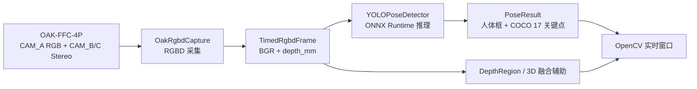
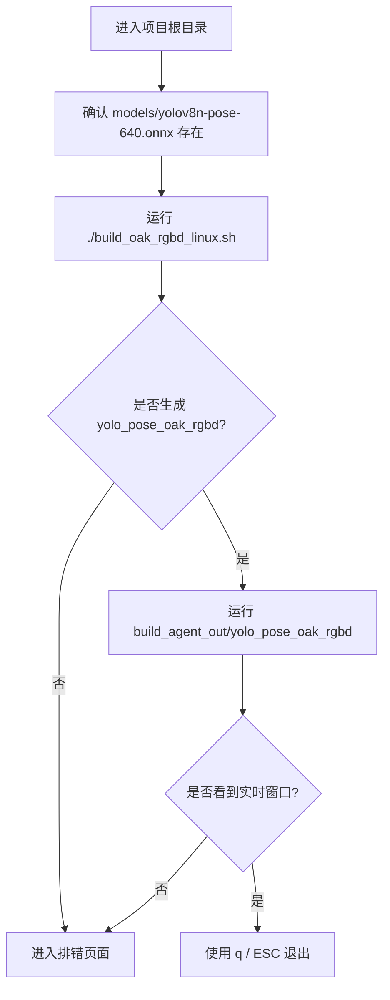

本页是 **入门指南 > 快速开始**，目标是在不深入算法细节的前提下，帮助新手开发者完成一个最小可运行闭环：确认项目入口、构建 OAK RGBD 目标、加载默认 YOLOv8 Pose ONNX 模型，并启动实时姿态检测窗口；更细的硬件环境、交互说明和排错会放到后续页面继续展开。Sources: [README_OAK_RGBD.md](README_OAK_RGBD.md#L3-L9), [get_pose_oak_rgbd.cpp](get_pose_oak_rgbd.cpp#L602-L668)

## 架构假设形成：先跑通 OAK RGBD 主链路

从第一性原则看，快速开始只需要回答三个问题：**入口程序是什么、输入从哪里来、模型如何被调用**。代码和构建配置共同验证了当前推荐入口是 `yolo_pose_oak_rgbd`：它由 `get_pose_oak_rgbd.cpp`、`app/oak_rgbd_capture.cpp`、YOLO 推理公共源码和若干运行时模块组成，并在 CMake 中默认开启 `BUILD_OAK_RGBD_TARGET`、关闭旧的 `BUILD_INDEMIND_TARGET`。Sources: [CMakeLists.txt](CMakeLists.txt#L10-L19), [CMakeLists.txt](CMakeLists.txt#L541-L568)



上图表达的是快速开始阶段需要掌握的最小结构：OAK 设备产生 RGB 与深度帧，`OakRgbdCapture` 提供最新 RGBD 帧，`YOLOPoseDetector` 对 BGR 图像执行姿态推理，主循环再把检测结果、深度辅助信息和运行状态显示在 OpenCV 窗口中。Sources: [app/oak_rgbd_capture.h](app/oak_rgbd_capture.h#L35-L56), [yolo_pose_detector.h](yolo_pose_detector.h#L48-L90), [get_pose_oak_rgbd.cpp](get_pose_oak_rgbd.cpp#L731-L745)

## 你将使用的文件位置

快速开始涉及的项目结构可以先记住下面这几块：根目录保存 CMake 配置和构建脚本，`models/` 保存 ONNX 模型，`app/` 保存 OAK RGBD 采集、深度区域、性能统计和运行状态模块，根目录下的 `get_pose_oak_rgbd.cpp` 是 OAK RGBD 主程序入口，`yolo_pose_detector.*` 是 YOLOv8 Pose 推理封装。Sources: [README_OAK_RGBD.md](README_OAK_RGBD.md#L3-L18), [CMakeLists.txt](CMakeLists.txt#L541-L568)

```text
YOLO_rec/
├── CMakeLists.txt                 # 构建选项、依赖发现、目标定义
├── build_oak_rgbd_linux.sh         # OAK RGBD Linux 构建脚本
├── get_pose_oak_rgbd.cpp           # OAK RGBD 实时检测入口
├── yolo_pose_detector.cpp/.h       # YOLOv8 Pose ONNX Runtime 推理
├── pose_utils.cpp/.h               # 姿态绘制与辅助逻辑
├── app/
│   ├── oak_rgbd_capture.cpp/.h     # OAK RGBD 采集封装
│   ├── depth_region.cpp/.h         # 深度区域与鼠标交互辅助
│   ├── depth_utils.cpp/.h          # 深度处理工具
│   ├── perf_stats.cpp/.h           # 性能统计
│   └── runtime_state.cpp/.h        # 运行状态与录制会话
├── models/
│   └── yolov8n-pose-640.onnx       # 默认快速开始模型
└── build_agent_out/
    └── yolo_pose_oak_rgbd          # 默认输出可执行文件位置
```

## 快速开始前的最小准备

当前 OAK RGBD 链路使用的硬件配置在仓库说明中明确为 OAK-FFC-4P、RVC2，CAM_A 作为 640x400 RGB 主图像，CAM_B/C 作为 640x400 双目深度来源，深度图格式为 `CV_16UC1` 且单位为毫米，并对齐到 CAM_A；默认模型路径是 `models/yolov8n-pose-640.onnx`。Sources: [README_OAK_RGBD.md](README_OAK_RGBD.md#L10-L18)

| 准备项 | 快速开始所需状态 | 代码或配置中的证据 |
|---|---|---|
| 操作系统 | Linux 路径被构建脚本和 CMake 平台分支覆盖 | `build_oak_rgbd_linux.sh` 与 CMake Linux 分支 |
| C++ 标准 | C++17 | `CMAKE_CXX_STANDARD 17` |
| OpenCV | 必需 | `find_package(OpenCV REQUIRED)` |
| ONNX Runtime | 必需 | 找不到时 CMake 直接 `FATAL_ERROR` |
| DepthAI | 构建 OAK RGBD 目标时必需 | `BUILD_OAK_RGBD_TARGET` 下查找 `depthai` |
| 模型文件 | 默认 `models/yolov8n-pose-640.onnx` | 主程序默认模型路径 |

Sources: [CMakeLists.txt](CMakeLists.txt#L4-L13), [CMakeLists.txt](CMakeLists.txt#L58-L123), [CMakeLists.txt](CMakeLists.txt#L448-L485), [get_pose_oak_rgbd.cpp](get_pose_oak_rgbd.cpp#L605-L609)

## 第一步：构建 OAK RGBD 目标

推荐从项目根目录直接运行 OAK RGBD 构建脚本；脚本会设置 `DEPTHAI_AUTOCALIBRATION=OFF`，配置 `BUILD_OAK_RGBD_TARGET=ON`、`BUILD_INDEMIND_TARGET=OFF`，然后执行 CMake 配置与并行构建，最终提示可执行文件位于 `build_agent_out/yolo_pose_oak_rgbd`。Sources: [build_oak_rgbd_linux.sh](build_oak_rgbd_linux.sh#L4-L10), [build_oak_rgbd_linux.sh](build_oak_rgbd_linux.sh#L65-L84)

```bash
export DEPTHAI_AUTOCALIBRATION=OFF
./build_oak_rgbd_linux.sh
```

如果你想理解脚本实际做了什么，它等价于一次显式 CMake 配置：开启 OAK RGBD 目标、关闭 INDEMIND 旧目标、传入 `DEPTHAI_CORE_ROOT` 和 `DEPTHAI_CORE_BUILD_DIR`，再构建 `build_oak` 目录。Sources: [README_OAK_RGBD.md](README_OAK_RGBD.md#L19-L41), [build_oak_rgbd_linux.sh](build_oak_rgbd_linux.sh#L65-L80)

```bash
export DEPTHAI_AUTOCALIBRATION=OFF

cmake -S . -B build_oak \
  -DCMAKE_BUILD_TYPE=Release \
  -DBUILD_OAK_RGBD_TARGET=ON \
  -DBUILD_INDEMIND_TARGET=OFF \
  -DDEPTHAI_CORE_ROOT=/home/chris4/workspace/from_git/depthai-core \
  -DDEPTHAI_CORE_BUILD_DIR=/home/chris4/workspace/from_git/depthai-core/build_no_dcl

cmake --build build_oak --parallel
```

## 第二步：启动实时检测

构建完成后，使用默认模型启动 OAK RGBD 程序；主程序也内置了同一个默认路径，因此不传参数时会尝试使用 `models/yolov8n-pose-640.onnx`，传入第一个命令行参数时则会覆盖模型路径。Sources: [README_OAK_RGBD.md](README_OAK_RGBD.md#L43-L50), [get_pose_oak_rgbd.cpp](get_pose_oak_rgbd.cpp#L602-L609)

```bash
export DEPTHAI_AUTOCALIBRATION=OFF
./build_agent_out/yolo_pose_oak_rgbd models/yolov8n-pose-640.onnx
```

程序启动后会初始化 OAK RGBD 采集、读取 CAM_A 相机内参、创建 `YOLOPoseDetector(model_path, 640, 0.5f, 0.45f, true)`，其中输入尺寸为 640，检测置信度阈值为 0.5，NMS IoU 阈值为 0.45，并启用 CUDA 参数。Sources: [get_pose_oak_rgbd.cpp](get_pose_oak_rgbd.cpp#L639-L668), [yolo_pose_detector.h](yolo_pose_detector.h#L63-L75)

## 第三步：确认窗口与基本操作

启动成功后，程序会进入主循环等待 OAK RGBD 帧，并显示两个 OpenCV 窗口：`YOLO Pose - OAK CAM_A RGBD` 用于主画面显示，`Body Frame Metrics` 用于姿态与度量信息面板；如果暂时没有拿到新帧，主循环仍会响应 `q` 或 `ESC` 退出。Sources: [get_pose_oak_rgbd.cpp](get_pose_oak_rgbd.cpp#L728-L740), [get_pose_oak_rgbd.cpp](get_pose_oak_rgbd.cpp#L1360-L1374)

| 按键 / 操作 | 快速开始阶段用途 |
|---|---|
| `q` / `ESC` | 退出程序 |
| `k` | 显示或隐藏关键点 |
| `t` | 显示或隐藏骨架 |
| `i` | 显示或隐藏信息叠加层 |
| `SPACE` | 保存当前帧为 `pose_frame_XXXX.jpg` |
| 鼠标点击 4 个角点 | 在 YOLO 窗口中选择蹦床 ROI，用于拟合床面平面 |
| `r` | 开关落点录制会话 |
| `s` | 将落点数据保存为 CSV |
| `c` | 清空落点缓存 |

Sources: [get_pose_oak_rgbd.cpp](get_pose_oak_rgbd.cpp#L691-L707), [get_pose_oak_rgbd.cpp](get_pose_oak_rgbd.cpp#L1401-L1487)

## 快速验证清单

你可以用下面的顺序判断是否已经跑通最小闭环：第一，构建脚本最后输出 `Built: .../build_agent_out/yolo_pose_oak_rgbd`；第二，运行时打印 OAK 设备配置和 CAM_A 内参；第三，模型初始化没有报错；第四，窗口持续刷新并能通过 `q` 或 `ESC` 正常退出。Sources: [build_oak_rgbd_linux.sh](build_oak_rgbd_linux.sh#L81-L84), [get_pose_oak_rgbd.cpp](get_pose_oak_rgbd.cpp#L613-L668), [get_pose_oak_rgbd.cpp](get_pose_oak_rgbd.cpp#L1490-L1515)



## OAK 新链路与 INDEMIND 旧链路的快速区分

快速开始推荐先使用 OAK RGBD 新链路，因为仓库说明明确表示新增目标是 `get_pose_oak_rgbd.cpp` 与 `app/oak_rgbd_capture.*`，而 CMake 默认也开启 OAK 目标、关闭 INDEMIND 目标；旧目标仍可通过 `BUILD_INDEMIND_TARGET=ON` 构建，但它依赖 `include/` 与 `lib/libindemind.so` 中的 INDEMIND SDK 文件。Sources: [README_OAK_RGBD.md](README_OAK_RGBD.md#L3-L9), [README_OAK_RGBD.md](README_OAK_RGBD.md#L52-L52), [CMakeLists.txt](CMakeLists.txt#L10-L11), [CMakeLists.txt](CMakeLists.txt#L487-L505)

| 链路 | 可执行目标 | 默认状态 | 适合快速开始吗 | 关键依赖 |
|---|---|---:|---|---|
| OAK RGBD 新链路 | `yolo_pose_oak_rgbd` | 默认开启 | 是 | DepthAI、OpenCV、ONNX Runtime、OAK 硬件 |
| INDEMIND 旧链路 | `yolo_pose_indemind_left` | 默认关闭 | 不作为本页主线 | INDEMIND SDK、OpenCV、ONNX Runtime |

Sources: [CMakeLists.txt](CMakeLists.txt#L561-L623), [CMakeLists.txt](CMakeLists.txt#L625-L647)

## 常见第一反应：如果没有跑起来，先看哪里

如果构建失败，优先检查 CMake 输出中 OpenCV、ONNX Runtime、DepthAI 是否被找到，因为 OpenCV 和 ONNX Runtime 是必需项，DepthAI 是构建 OAK RGBD 目标时的必需项；如果运行失败，优先确认模型文件路径、OAK 设备连接和 `DEPTHAI_AUTOCALIBRATION=OFF` 环境变量。Sources: [CMakeLists.txt](CMakeLists.txt#L58-L123), [CMakeLists.txt](CMakeLists.txt#L448-L485), [README_OAK_RGBD.md](README_OAK_RGBD.md#L23-L50), [get_pose_oak_rgbd.cpp](get_pose_oak_rgbd.cpp#L605-L668)

| 现象 | 首先检查 | 本页建议动作 |
|---|---|---|
| CMake 报 OpenCV 未找到 | OpenCV 安装或 `OpenCV_DIR` | 参考后续排错页 |
| CMake 报 ONNX Runtime 未找到 | `ONNXRUNTIME_INCLUDE_DIR` 与 `ONNXRUNTIME_LIB` | 参考后续排错页 |
| CMake 报 DepthAI 未找到 | `DEPTHAI_CORE_ROOT`、`DEPTHAI_CORE_BUILD_DIR`、`CMAKE_PREFIX_PATH` | 参考 OAK 构建页 |
| 运行时报模型初始化失败 | 模型路径是否存在 | 使用 `models/yolov8n-pose-640.onnx` |
| 运行后无图像 | OAK 采集是否启动成功 | 查看终端中的 OAK RGBD 错误信息 |

Sources: [CMakeLists.txt](CMakeLists.txt#L95-L123), [CMakeLists.txt](CMakeLists.txt#L448-L485), [get_pose_oak_rgbd.cpp](get_pose_oak_rgbd.cpp#L639-L668)

## 下一步阅读路径

完成本页后，建议按入门目录继续推进：如果你还没有准备硬件、模型或依赖环境，进入 [硬件、模型与运行环境准备](3-ying-jian-mo-xing-yu-yun-xing-huan-jing-zhun-bei)；如果你想把构建命令和启动参数理解得更清楚，进入 [OAK RGBD 目标的构建与启动](4-oak-rgbd-mu-biao-de-gou-jian-yu-qi-dong)；如果你已经看到窗口并想学习 ROI、键盘和鼠标交互，进入 [实时窗口、鼠标 ROI 与键盘交互指南](6-shi-shi-chuang-kou-shu-biao-roi-yu-jian-pan-jiao-hu-zhi-nan)；如果你希望理解从 2D 姿态到 3D 落点的完整闭环，进入 [从 2D 姿态检测到 3D 落点检测的最小闭环](7-cong-2d-zi-tai-jian-ce-dao-3d-luo-dian-jian-ce-de-zui-xiao-bi-huan)；如果中途遇到构建、模型加载或相机连接问题，进入 [常见构建、模型加载与相机连接问题排查](8-chang-jian-gou-jian-mo-xing-jia-zai-yu-xiang-ji-lian-jie-wen-ti-pai-cha)。Sources: [README_OAK_RGBD.md](README_OAK_RGBD.md#L19-L59), [get_pose_oak_rgbd.cpp](get_pose_oak_rgbd.cpp#L691-L707), [CMakeLists.txt](CMakeLists.txt#L448-L485)