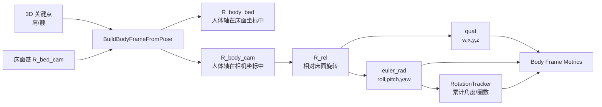
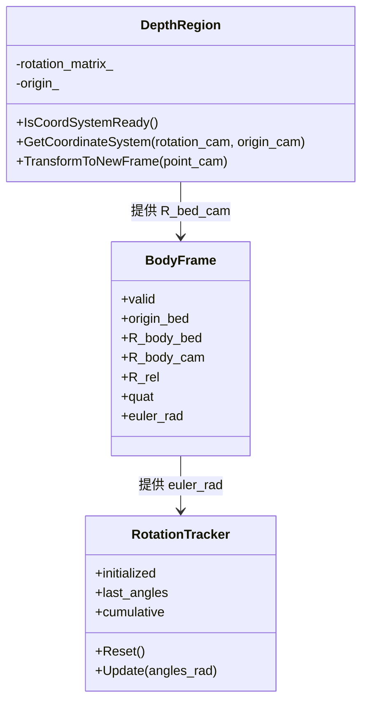

本页位于“蹦床空间建模”章节中，聚焦当前代码如何把**床面坐标系与人体坐标系之间的相对姿态**表达为旋转矩阵、四元数与欧拉角，并说明这些表达如何进入实时指标窗口；不展开 ROI 平面拟合、落点检测或姿态分类规则，这些内容分别属于 [四点 ROI、RANSAC 平面拟合与床面坐标系构建](18-si-dian-roi-ransac-ping-mian-ni-he-yu-chuang-mian-zuo-biao-xi-gou-jian)、[髋点轨迹建模与落点检测状态机](21-kuan-dian-gui-ji-jian-mo-yu-luo-dian-jian-ce-zhuang-tai-ji) 与 [团身、屈体、直体三种基础姿态判定](22-tuan-shen-qu-ti-zhi-ti-san-chong-ji-chu-zi-tai-pan-ding)。Sources: [get_pose_indemind_left.cpp](get_pose_indemind_left.cpp#L58-L65), [get_pose_indemind_left.cpp](get_pose_indemind_left.cpp#L437-L440)

## 架构假设与验证结论

**架构假设**：仓库中的姿态表达不是从 IMU 或外部 SLAM 四元数直接读取，而是在主循环中由 3D 人体关键点构建人体坐标系，再相对床面坐标系计算旋转矩阵 `R_rel`，随后派生四元数 `quat` 与欧拉角 `euler_rad`。代码验证显示，`BodyFrame` 同时保存 `R_body_bed`、`R_body_cam`、`R_rel`、`quat` 与 `euler_rad`；`BuildBodyFrameFromPose(...)` 负责构造矩阵并调用 `RotationMatrixToQuaternion(...)` 与 `RotationMatrixToEulerXYZ(...)`；指标窗口读取这些字段并显示 `Quat`、`Angles deg`、`Cumulative deg` 与 `Counts`。Sources: [get_pose_indemind_left.cpp](get_pose_indemind_left.cpp#L58-L65), [get_pose_indemind_left.cpp](get_pose_indemind_left.cpp#L352-L440), [get_pose_indemind_left.cpp](get_pose_indemind_left.cpp#L1102-L1137)

上图中的核心约束是：`R_body_bed` 的三列分别写入 `x_axis`、`y_axis`、`z_axis`，`R_body_cam` 由 `R_bed_cam * R_body_bed` 得到，`R_rel` 由 `R_bed_cam.t() * R_body_cam` 得到；四元数与欧拉角均从 `R_rel` 派生，而不是从图像检测器或 SDK 输出直接读取。Sources: [get_pose_indemind_left.cpp](get_pose_indemind_left.cpp#L423-L440)

## 三种姿态表达在代码中的角色

当前实现把旋转矩阵作为**主表达**：床面坐标系中的人体三轴先组成 `R_body_bed`，相机坐标系中的人体三轴组成 `R_body_cam`，人体相对床面的旋转组成 `R_rel`。四元数是由 `R_rel` 转换得到的紧凑显示量，欧拉角同样由 `R_rel` 转换得到，并额外进入 `RotationTracker` 做跨帧累计。Sources: [get_pose_indemind_left.cpp](get_pose_indemind_left.cpp#L58-L65), [get_pose_indemind_left.cpp](get_pose_indemind_left.cpp#L437-L440), [get_pose_indemind_left.cpp](get_pose_indemind_left.cpp#L870-L877)

| 表达形式 | 代码字段 / 函数 | 当前用途 | 直接来源 |
|---|---|---|---|
| 旋转矩阵 | `R_body_bed`、`R_body_cam`、`R_rel` | 保存人体坐标系三轴方向，并表达人体相对床面的旋转 | 由关键点轴向与床面矩阵计算 |
| 四元数 | `quat`、`RotationMatrixToQuaternion(...)` | 指标窗口显示 `Quat (w,x,y,z)` | 从 `R_rel` 转换 |
| 欧拉角 | `euler_rad`、`RotationMatrixToEulerXYZ(...)` | 指标窗口显示角度，并作为累计旋转输入 | 从 `R_rel` 转换 |
| 累计角 | `RotationTracker::cumulative` | 显示累计角度与 `counts` | 从逐帧 `euler_rad` 差分更新 |

Sources: [get_pose_indemind_left.cpp](get_pose_indemind_left.cpp#L58-L65), [get_pose_indemind_left.cpp](get_pose_indemind_left.cpp#L104-L154), [get_pose_indemind_left.cpp](get_pose_indemind_left.cpp#L68-L92), [get_pose_indemind_left.cpp](get_pose_indemind_left.cpp#L1102-L1137)

## 人体坐标系如何形成旋转矩阵

人体坐标系由肩部与髋部关键点构造：原点是 `pelvis`，即左右髋中点或单侧有效髋点；`y_raw` 是从髋部中点指向肩部中点的向量；`x_raw` 优先由右髋指向左髋，在髋部左右点不同时有效时退化为右肩指向左肩；`z_axis` 由 `x_axis.cross(y_axis)` 得到。Sources: [get_pose_indemind_left.cpp](get_pose_indemind_left.cpp#L374-L404), [get_pose_indemind_left.cpp](get_pose_indemind_left.cpp#L392-L419)

为了保证旋转矩阵的列向量是正交单位基，代码先归一化 `x_raw` 得到 `x_axis`，再用 Gram-Schmidt 思路把 `y_raw` 在 `x_axis` 上的投影减掉，得到 `y_orth = y_raw - x_axis * (y_raw.dot(x_axis))`，再归一化得到 `y_axis`；最后用叉乘得到并归一化 `z_axis`。如果任一向量范数小于阈值导致 `NormalizeVec(...)` 失败，函数直接返回 `false`，不会产生有效 `BodyFrame`。Sources: [get_pose_indemind_left.cpp](get_pose_indemind_left.cpp#L95-L102), [get_pose_indemind_left.cpp](get_pose_indemind_left.cpp#L406-L421)

三根单位轴被写入 `R_body_bed` 的三列：第 0 列是 `x_axis`，第 1 列是 `y_axis`，第 2 列是 `z_axis`。随后代码用 `out.R_body_cam = R_bed_cam * out.R_body_bed` 得到人体坐标系在相机坐标系中的方向，用 `out.R_rel = R_bed_cam.t() * out.R_body_cam` 得到人体相对床面坐标系的旋转。Sources: [get_pose_indemind_left.cpp](get_pose_indemind_left.cpp#L423-L438)

## 与床面坐标系的关系

床面坐标系由 `DepthRegion` 提供，主循环先检查 `depth_region.IsCoordSystemReady()`，就绪后通过 `depth_region.GetCoordinateSystem(R_bed_cam, bed_origin)` 取出床面旋转矩阵与原点。`GetCoordinateSystem(...)` 返回的 `rotation_cam` 是 `rotation_matrix_` 的克隆，注释说明它是 bed frame basis in camera coordinates；这就是后续构建人体相对床面旋转的参考基。Sources: [get_pose_indemind_left.cpp](get_pose_indemind_left.cpp#L743-L748), [app/depth_region.h](app/depth_region.h#L507-L518), [app/depth_region.h](app/depth_region.h#L1254-L1256)

床面矩阵本身的三列也遵循“轴向作为列”的约定：`BuildFrameFromPlane(...)` 将 `X_vec`、`Y_vec`、`Z_vec` 分别写入 `rotation_matrix_` 的第 0、1、2 列，并把内点均值写入 `origin_`，最后设置 `coord_system_ready_ = true`。这与人体矩阵 `R_body_bed` 的列向量写法一致，使 `R_bed_cam * R_body_bed` 的矩阵乘法在代码结构上保持一致。Sources: [app/depth_region.h](app/depth_region.h#L1210-L1234), [get_pose_indemind_left.cpp](get_pose_indemind_left.cpp#L423-L437)

该交互图只表示姿态表达相关对象：`DepthRegion` 提供床面基，`BodyFrame` 保存人体旋转表达，`RotationTracker` 只消费欧拉角并维护累计值；落点缓存、CSV 输出与姿态分类不属于本页范围。Sources: [app/depth_region.h](app/depth_region.h#L507-L518), [get_pose_indemind_left.cpp](get_pose_indemind_left.cpp#L58-L65), [get_pose_indemind_left.cpp](get_pose_indemind_left.cpp#L68-L92)

## 旋转矩阵到四元数

`RotationMatrixToQuaternion(...)` 的输入是 `cv::Mat R`，输出是 `cv::Vec4d q`，默认值为 `(1,0,0,0)`，注释与字段约定均显示四元数顺序是 `w, x, y, z`。函数首先计算矩阵迹 `trace = r00 + r11 + r22`；如果 `trace > 0`，使用 `sqrt(trace + 1.0) * 2.0` 计算公共尺度 `s`，再分别计算 `w/x/y/z`。Sources: [get_pose_indemind_left.cpp](get_pose_indemind_left.cpp#L64-L65), [get_pose_indemind_left.cpp](get_pose_indemind_left.cpp#L104-L116)

当 `trace <= 0` 时，代码按 `R(0,0)`、`R(1,1)`、`R(2,2)` 中较大的对角分量分支计算四元数分量；这避免只依赖正迹分支，并在不同主轴占优时使用不同公式。函数最后返回 `q`，调用点固定为 `out.quat = RotationMatrixToQuaternion(out.R_rel)`。Sources: [get_pose_indemind_left.cpp](get_pose_indemind_left.cpp#L116-L139), [get_pose_indemind_left.cpp](get_pose_indemind_left.cpp#L437-L440)

## 旋转矩阵到欧拉角

`RotationMatrixToEulerXYZ(...)` 返回 `cv::Vec3d(roll, pitch, yaw)`，字段注释标明对应 `roll(x), pitch(y), yaw(z)`。函数读取 `r00`、`r10`、`r20`、`r21`、`r22`，按 `pitch = asin(clamp(-r20))`、`roll = atan2(r21, r22)`、`yaw = atan2(r10, r00)` 计算，最后返回以弧度为单位的三元组。Sources: [get_pose_indemind_left.cpp](get_pose_indemind_left.cpp#L64-L65), [get_pose_indemind_left.cpp](get_pose_indemind_left.cpp#L141-L154)

该欧拉角随后被用于两类输出：一是指标窗口中将 `tracked_body_frame.euler_rad * (180.0 / M_PI)` 转成度数显示为 `Angles deg (x,y,z)`；二是传入 `rotation_tracker.Update(tracked_body_frame.euler_rad)`，作为逐帧累计旋转的输入。Sources: [get_pose_indemind_left.cpp](get_pose_indemind_left.cpp#L870-L877), [get_pose_indemind_left.cpp](get_pose_indemind_left.cpp#L1102-L1121)

## 欧拉角累计与跨 ±π 展开

`RotationTracker` 保存 `last_angles` 与 `cumulative`。第一次收到角度时只初始化 `last_angles`，后续每帧对三个轴分别计算 `delta = angles_rad[i] - last_angles[i]`；如果 `delta > M_PI` 就减去 `2π`，如果 `delta < -M_PI` 就加上 `2π`，再把修正后的 `delta` 累加到 `cumulative[i]`。Sources: [get_pose_indemind_left.cpp](get_pose_indemind_left.cpp#L68-L92)

当前主循环只有在 `tracked_body_frame.valid` 时更新累计；如果连续无效帧达到 3 帧，则调用 `rotation_tracker.Reset()`，清空初始化状态、上一帧角度和累计角度。指标窗口中，`cumulative_deg = rotation_tracker.cumulative * (180.0 / M_PI)` 显示累计角度，`counts = rotation_tracker.cumulative * (1.0 / (2.0 * M_PI))` 显示相当于多少圈。Sources: [get_pose_indemind_left.cpp](get_pose_indemind_left.cpp#L870-L877), [get_pose_indemind_left.cpp](get_pose_indemind_left.cpp#L1102-L1137)

## 显示管线：从 BodyFrame 到指标窗口

当 `tracked_body_frame.valid` 为真时，指标窗口依次显示四元数、当前欧拉角、累计角度与累计圈数：`Quat (w,x,y,z)` 取 `tracked_body_frame.quat[0..3]`，`Angles deg (x,y,z)` 取欧拉角度数，`Cumulative deg (x,y,z)` 取累计角度度数，`Counts (flip/twist/side)` 取 `counts[0..2]`。如果人体坐标系无效，则窗口显示 `Body frame: INVALID`。Sources: [get_pose_indemind_left.cpp](get_pose_indemind_left.cpp#L1077-L1143)

需要注意，界面字符串中的 `Counts (flip/twist/side)` 只是显示标签；代码层面只把 `cumulative` 的三个分量除以 `2π` 并按 `[0], [1], [2]` 输出，未在该代码段中实现额外的语义映射或分类逻辑。Sources: [get_pose_indemind_left.cpp](get_pose_indemind_left.cpp#L1131-L1137)

## 表达形式对比与工程取舍

旋转矩阵在当前实现中承担坐标变换与可视化主干，因为人体三轴本身就是矩阵列向量，且绘制人体坐标轴与 3D 躯干盒子都直接读取 `R_body_cam` 的列；四元数在当前代码中主要作为指标窗口显示值；欧拉角则既用于显示，也用于跨帧累计。Sources: [get_pose_indemind_left.cpp](get_pose_indemind_left.cpp#L944-L952), [get_pose_indemind_left.cpp](get_pose_indemind_left.cpp#L1024-L1035), [get_pose_indemind_left.cpp](get_pose_indemind_left.cpp#L1102-L1137)

| 维度 | 旋转矩阵 | 四元数 | 欧拉角 |
|---|---|---|---|
| 当前代码来源 | 由人体三轴与床面基组合 | `RotationMatrixToQuaternion(R_rel)` | `RotationMatrixToEulerXYZ(R_rel)` |
| 当前代码用途 | 坐标轴、盒子、相对旋转主表达 | 指标窗口显示 | 指标窗口显示与累计 |
| 存储字段 | `R_body_bed`、`R_body_cam`、`R_rel` | `quat` | `euler_rad`、`RotationTracker` |
| 单位 / 排列 | 3×3 `CV_64F`，列为轴 | `w,x,y,z` | 弧度存储，显示时转度 |
| 失败保护 | 无效关键点或归一化失败则 `BuildBodyFrameFromPose` 返回 false | 空矩阵返回默认单位四元数 | 空矩阵返回 `(0,0,0)` |

Sources: [get_pose_indemind_left.cpp](get_pose_indemind_left.cpp#L58-L65), [get_pose_indemind_left.cpp](get_pose_indemind_left.cpp#L95-L154), [get_pose_indemind_left.cpp](get_pose_indemind_left.cpp#L352-L442)

## 关键实现边界

本实现中的姿态表达依赖 3D 肩髋关键点与床面坐标系：`BuildBodyFrameFromPose(...)` 要求 `R_bed_cam` 非空，并且至少有一个髋点和一个肩点可用；同时，构造 `x_raw` 时要求左右髋同时可用，或左右肩同时可用，否则无法确定人体左右轴并返回失败。Sources: [get_pose_indemind_left.cpp](get_pose_indemind_left.cpp#L352-L404)

本实现没有把 SDK 结构体中的 `q[4]` 作为人体姿态输入；可验证的姿态表达链路是“YOLO 关键点 + 深度反投影 + 床面坐标系 + 人体轴构建 + `R_rel` 派生四元数/欧拉角”。3D 关键点来自主循环中对关键点像素、深度中值与 `cv_in_left_inv` 的计算，并在床面就绪时转换到 `kp_bed`。Sources: [get_pose_indemind_left.cpp](get_pose_indemind_left.cpp#L751-L793), [get_pose_indemind_left.cpp](get_pose_indemind_left.cpp#L826-L837), [get_pose_indemind_left.cpp](get_pose_indemind_left.cpp#L437-L440)

## 阅读路径建议

若需要理解 `R_bed_cam` 如何产生，请先读 [四点 ROI、RANSAC 平面拟合与床面坐标系构建](18-si-dian-roi-ransac-ping-mian-ni-he-yu-chuang-mian-zuo-biao-xi-gou-jian)；若需要理解相机坐标、床面坐标与人体坐标之间的关系，请读 [相机坐标系、床面坐标系与人体坐标系的转换关系](19-xiang-ji-zuo-biao-xi-chuang-mian-zuo-biao-xi-yu-ren-ti-zuo-biao-xi-de-zhuan-huan-guan-xi)；读完本页后，若要理解这些姿态指标如何与动作业务判断并列展示，可继续读 [团身、屈体、直体三种基础姿态判定](22-tuan-shen-qu-ti-zhi-ti-san-chong-ji-chu-tai-pan-ding) 与 [单腿姿态、左右侧角度与人体框测量扩展](23-dan-tui-zi-tai-zuo-you-ce-jiao-du-yu-ren-ti-kuang-ce-liang-kuo-zhan)。Sources: [app/depth_region.h](app/depth_region.h#L507-L518), [get_pose_indemind_left.cpp](get_pose_indemind_left.cpp#L352-L440), [get_pose_indemind_left.cpp](get_pose_indemind_left.cpp#L1077-L1143)