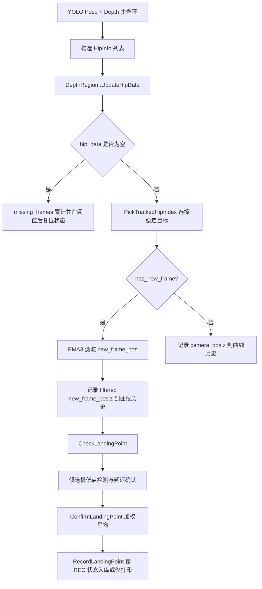
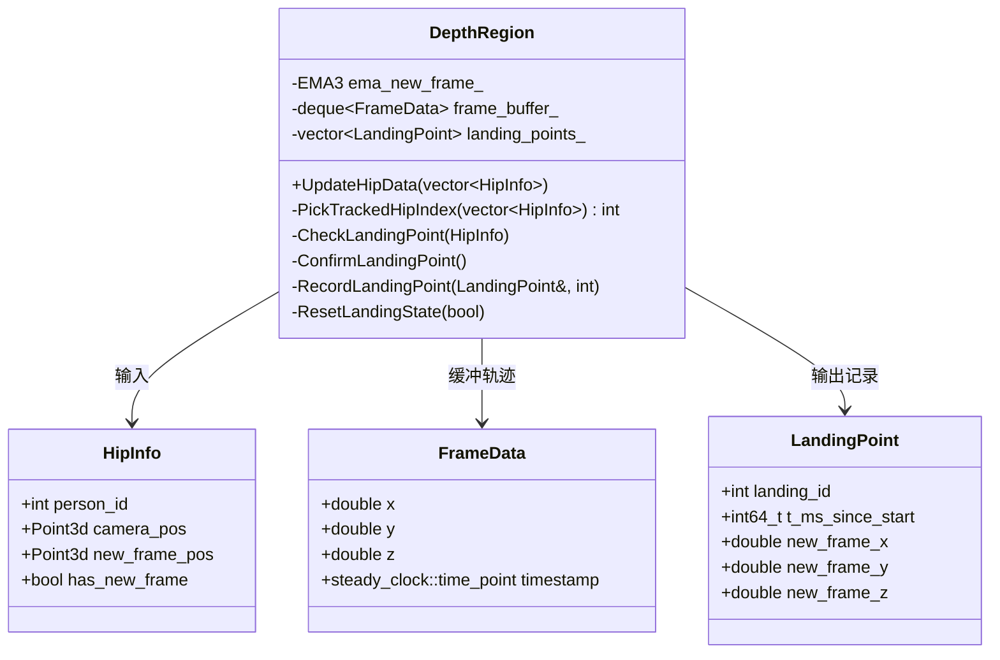
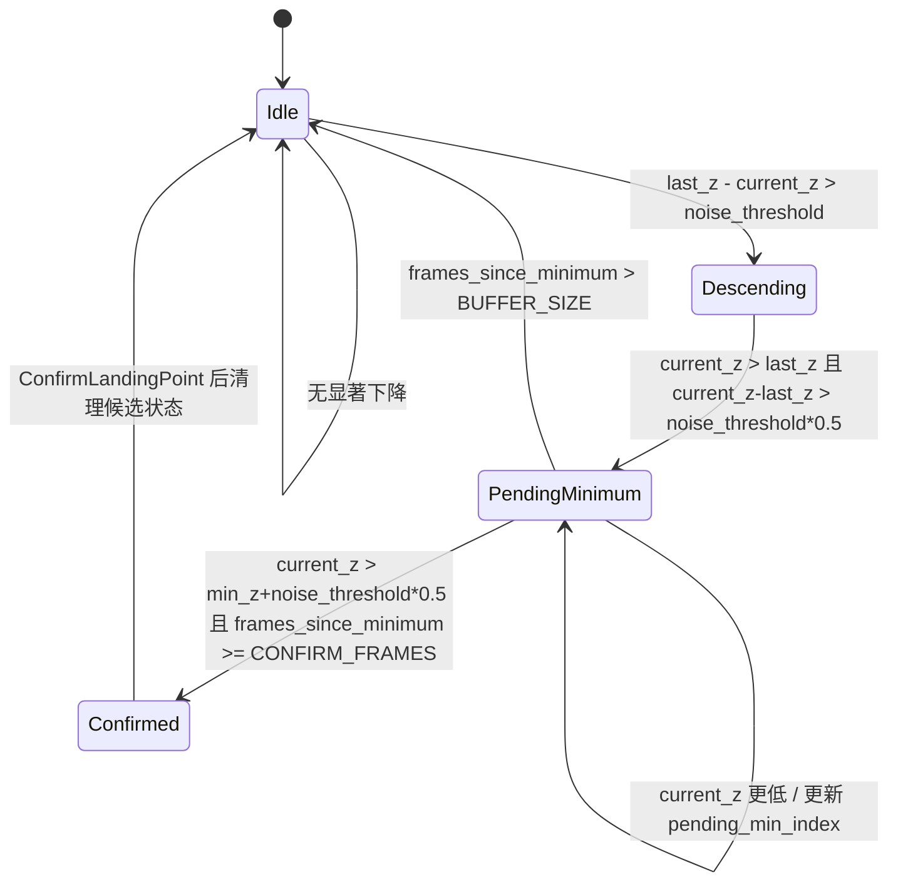

本页解释当前目录中的**髋点轨迹建模与落点检测状态机**：它从主循环传入的 `DepthRegion::HipInfo` 列表中选择稳定跟踪目标，对床面新坐标系中的髋点三维位置做 EMA 滤波、Z 轴轨迹缓存、局部极低点候选检测、延迟确认、加权平均与录制落盘。本文只覆盖髋点轨迹与落点状态机本身；床面 ROI、RANSAC 平面拟合、人体姿态分类和工程构建细节请分别阅读 [四点 ROI、RANSAC 平面拟合与床面坐标系构建](18-si-dian-roi-ransac-ping-mian-ni-he-yu-chuang-mian-zuo-biao-xi-gou-jian)、[团身、屈体、直体三种基础姿态判定](22-tuan-shen-qu-ti-zhi-ti-san-chong-ji-chu-zi-tai-pan-ding) 与 [CMake 目标、依赖发现与输出目录组织](11-cmake-mu-biao-yi-lai-fa-xian-yu-shu-chu-mu-lu-zu-zhi)。Sources: [depth_region.h](app/depth_region.h#L521-L538), [get_pose_indemind_left.cpp](get_pose_indemind_left.cpp#L891-L897)

## 架构假设与验证结论

从第一性原理看，落点检测需要三个条件：**空间基准**、**被跟踪点**、**时序判定**。代码验证后可以确认：空间基准由主循环在床面坐标系就绪时把 pelvis/hip 点写入 `HipInfo::new_frame_pos`；被跟踪点由 `DepthRegion::PickTrackedHipIndex` 在多人列表中按相机坐标距离选择；时序判定由 `UpdateHipData -> CheckLandingPoint -> ConfirmLandingPoint -> RecordLandingPoint` 完成。Sources: [get_pose_indemind_left.cpp](get_pose_indemind_left.cpp#L803-L823), [depth_region.h](app/depth_region.h#L580-L600), [depth_region.h](app/depth_region.h#L603-L675)

这张图中的关键边界是：主循环负责把检测结果转成 `HipInfo`，`DepthRegion` 内部负责所有轨迹状态；`UpdateHipData` 每帧覆盖 `hip_data_`、初始化 `start_time_`、处理丢帧、选择目标、滤波、更新 `z_history_`，并仅在 `tracked.has_new_frame` 时调用 `CheckLandingPoint`。Sources: [get_pose_indemind_left.cpp](get_pose_indemind_left.cpp#L737-L823), [get_pose_indemind_left.cpp](get_pose_indemind_left.cpp#L891-L897), [depth_region.h](app/depth_region.h#L603-L675)

## 数据入口：从双髋点到 HipInfo

主循环在每个人体姿态中检查左右髋关键点：左髋或右髋置信度需大于 `0.5f` 且对应 3D 点有效；如果左右髋都有效，就取两者相机坐标均值作为 `pelvis_cam`，否则使用可用的一侧髋点。床面坐标系就绪时，代码还会把 `pelvis_cam` 通过 `TransformToNewFrame` 转成 `pelvis_bed`，并写入 `HipInfo::new_frame_pos`。Sources: [get_pose_indemind_left.cpp](get_pose_indemind_left.cpp#L796-L823)

`HipInfo` 是状态机的输入记录：它包含 `person_id`、`camera_pos`、`new_frame_pos` 和 `has_new_frame`；`LandingPoint` 是状态机的输出记录：它包含落点编号、分钟/秒、毫秒时间戳，以及新坐标系下的 `x/y/z`，其中 `new_frame_z` 被注释为“极低点值”。Sources: [depth_region.h](app/depth_region.h#L521-L538)

| 数据结构 | 字段 | 在落点检测中的角色 |
|---|---|---|
| `HipInfo` | `camera_pos` | 多人目标稳定选择时的距离基准 |
| `HipInfo` | `new_frame_pos` | 落点检测使用的新坐标系三维轨迹 |
| `HipInfo` | `has_new_frame` | 是否允许进入 `CheckLandingPoint` |
| `LandingPoint` | `t_ms_since_start` | 落点精确时间戳 |
| `LandingPoint` | `new_frame_x/y/z` | 最终记录的落点坐标与极低点 Z |

Sources: [depth_region.h](app/depth_region.h#L521-L546), [depth_region.h](app/depth_region.h#L671-L674)

## 状态机核心变量

落点检测不是单帧判断，而是由一组跨帧状态变量驱动：`was_descending_` 表示此前是否进入下降趋势，`last_new_z_` 保存上一帧 Z，`frame_buffer_` 保存最近帧数据，`has_pending_minimum_` 与 `pending_min_index_` 表示待确认极低点，`frames_since_minimum_` 记录候选点出现后的确认帧数。Sources: [depth_region.h](app/depth_region.h#L1265-L1280)

稳定性相关变量也在同一类中维护：`kMinLandingIntervalMs` 是落点最小间隔，`missing_frames_` 与 `kMissingResetFrames` 处理连续丢失髋点后的复位，`has_last_track_` 与 `last_track_cam_pos_` 用于多人场景下避免 pose 顺序抖动，`EMA3 ema_new_frame_` 和 `last_filter_time_` 用于新坐标系 3D 点滤波。Sources: [depth_region.h](app/depth_region.h#L1282-L1298)

| 变量 | 默认值或约束 | 作用 |
|---|---:|---|
| `BUFFER_SIZE` | `15` | 限制帧缓冲长度 |
| `CONFIRM_FRAMES` | `5` | 极低点候选需要等待的确认帧数 |
| `kMinLandingIntervalMs` | `600` | 落点防抖最小时间间隔 |
| `kMissingResetFrames` | `3` | 连续丢失目标后复位趋势状态 |
| `noise_threshold_` | `300.0 mm` | Z 轴显著变化阈值 |
| `window_half_` | `3` | 加权平均窗口半径 |

Sources: [depth_region.h](app/depth_region.h#L1274-L1302)

## UpdateHipData：每帧状态推进器

`UpdateHipData` 是状态机的公开入口。它先保存当前帧 `hip_data_`，首次调用时初始化 `start_time_`；如果当前帧没有髋点，则增加 `missing_frames_`，当连续丢失达到 `kMissingResetFrames` 后调用 `ResetLandingState(true)`，同时清除上一次跟踪目标标记，避免旧趋势状态触发误判。Sources: [depth_region.h](app/depth_region.h#L603-L635)

当存在髋点时，`UpdateHipData` 将 `missing_frames_` 归零，通过 `PickTrackedHipIndex` 选择目标，并把被选目标的 `camera_pos` 写入 `last_track_cam_pos_`。如果该目标有新坐标系坐标，函数会计算当前时间间隔 `dt`，调用 `ema_new_frame_.Step` 对 `new_frame_pos` 做 EMA 滤波。Sources: [depth_region.h](app/depth_region.h#L636-L658)

滤波之后，代码把 Z 轴值写入 `z_history_`：优先记录新坐标系的滤波后 Z，否则记录相机坐标 Z；历史长度超过 `max_history_size_` 时弹出最旧值。只有在 `tracked.has_new_frame` 为真时，才会调用 `CheckLandingPoint(tracked)`，因此落点检测依赖床面新坐标系已建立并能提供 `new_frame_pos`。Sources: [depth_region.h](app/depth_region.h#L660-L674)

## 多人目标稳定选择

多人检测时，状态机没有直接使用输入列表第一个人作为持续目标，而是通过 `PickTrackedHipIndex` 做最近邻跟踪：如果没有历史目标，就返回第一个髋点；如果已有历史目标，则遍历所有 `HipInfo::camera_pos`，计算其到 `last_track_cam_pos_` 的三维平方距离，选择距离最小的目标。Sources: [depth_region.h](app/depth_region.h#L580-L600)

这个策略的边界很清晰：它只解决**同一帧多人列表顺序抖动**问题，不改变 YOLO 检测结果，也不做身份重识别；它依赖上一帧保存的相机坐标，而不是新坐标系坐标。Sources: [depth_region.h](app/depth_region.h#L580-L600), [depth_region.h](app/depth_region.h#L638-L645)

上图对应的类和嵌套结构都定义在 `DepthRegion` 中；主循环只构造 `HipInfo` 列表并调用 `UpdateHipData`，不直接操作 `frame_buffer_`、`pending_min_index_` 或 `landing_points_`。Sources: [depth_region.h](app/depth_region.h#L521-L546), [depth_region.h](app/depth_region.h#L603-L675), [get_pose_indemind_left.cpp](get_pose_indemind_left.cpp#L891-L897)

## CheckLandingPoint：从 Z 轴趋势识别极低点

`CheckLandingPoint` 每次接收一个带新坐标系的髋点后，先把当前 `x/y/z/timestamp` 封装为 `FrameData` 并追加到 `frame_buffer_`；当缓冲长度超过 `BUFFER_SIZE` 时弹出旧帧，并同步修正或取消待确认极低点索引，避免候选点已被弹出后仍被确认。Sources: [depth_region.h](app/depth_region.h#L687-L711)

趋势检测至少需要两帧，因此缓冲不足两帧时只更新 `last_new_z_` 并返回；之后使用 `noise_threshold_` 作为 Z 轴显著变化阈值。如果已有待确认极低点，当前 Z 需要比候选最小 Z 高出 `noise_threshold * 0.5` 才算继续上升，并且 `frames_since_minimum_` 达到 `CONFIRM_FRAMES` 后才调用 `ConfirmLandingPoint`。Sources: [depth_region.h](app/depth_region.h#L713-L736)

如果已有候选点但当前帧更低，状态机会把候选索引更新为当前帧；如果确认等待超过 `BUFFER_SIZE`，则取消候选。没有候选点时，状态机先判断 `(last_new_z_ - current_z) > noise_threshold` 作为显著下降，再在已经下降且当前帧开始上升、上升幅度超过 `noise_threshold * 0.5` 时，把前一帧标记为潜在极低点。Sources: [depth_region.h](app/depth_region.h#L737-L767)

这个状态图对应代码中的 `was_descending_`、`has_pending_minimum_`、`pending_min_index_` 和 `frames_since_minimum_`；确认后代码会把候选状态清空，并将 `was_descending_` 置为 `false`。Sources: [depth_region.h](app/depth_region.h#L722-L767)

## ConfirmLandingPoint：极低点定位与 XY 加权平均

`ConfirmLandingPoint` 首先验证 `pending_min_index_` 是否仍在缓冲范围内，然后以候选索引为中心，在前后 3 帧范围内重新搜索实际最小 Z，得到 `actual_min_idx` 与 `min_z`。这一步用于在候选点附近寻找真正的局部最低帧。Sources: [depth_region.h](app/depth_region.h#L774-L792)

随后函数以 `actual_min_idx` 为中心，根据 `window_half_` 构造加权平均窗口，并使用 `w_i = 1 / (|Z_i - Z_min| + epsilon)` 计算 X/Y 的加权平均；`epsilon` 固定为 `1.0`，用于避免除零。最终落点的 `new_frame_x` 和 `new_frame_y` 来自加权平均，`new_frame_z` 保留实际最小 Z。Sources: [depth_region.h](app/depth_region.h#L794-L847)

时间戳由 `actual_min_idx` 对应帧的 `timestamp` 减去 `start_time_` 计算为毫秒，再拆分为分钟和秒；防抖逻辑会比较本次最小点时间与 `last_landing_time_`，如果小于 `kMinLandingIntervalMs`，则更新 `last_landing_time_` 并直接返回，不记录本次落点。Sources: [depth_region.h](app/depth_region.h#L817-L838)

| 阶段 | 输入 | 输出 | 目的 |
|---|---|---|---|
| 候选校验 | `pending_min_index_` | 是否继续 | 避免缓冲溢出后的非法索引 |
| 附近重搜 | 候选点 ±3 帧 | `actual_min_idx`, `min_z` | 在噪声附近找实际最低帧 |
| 加权平均 | `actual_min_idx ± window_half_` | `final_x`, `final_y` | 用接近最低 Z 的帧主导 XY |
| 防抖 | `min_timestamp`, `last_landing_time_` | 是否记录 | 抑制短时间重复触发 |

Sources: [depth_region.h](app/depth_region.h#L774-L851)

## RecordLandingPoint：检测与入库分离

`RecordLandingPoint` 将“检测到落点”和“是否入库”解耦：无论录制开关是否打开，函数都会向控制台输出时间、X/Y/Z、采样窗口和当前入库数；只有 `g_runtime_flags.record_enabled` 为真时，才增加 `landing_count_`、设置 `landing_id` 并把 `LandingPoint` 追加到 `landing_points_`。Sources: [depth_region.h](app/depth_region.h#L854-L880)

录制开关来自运行时全局状态 `RuntimeFlags::record_enabled`，定义在 `runtime_state.h` 并在 `runtime_state.cpp` 中实例化；主循环按 `r/R` 时切换该开关，若从 OFF 切到 ON，则调用 `CreateNewSession()` 并清空旧落点。Sources: [runtime_state.h](app/runtime_state.h#L7-L23), [runtime_state.cpp](app/runtime_state.cpp#L10-L38), [get_pose_indemind_left.cpp](get_pose_indemind_left.cpp#L1315-L1327)

## 可调参数与键盘控制

落点检测参数由 `DepthRegion` 提供四个调整函数：`IncreaseNoiseThreshold`、`DecreaseNoiseThreshold`、`IncreaseWindowHalf`、`DecreaseWindowHalf`。Z 阈值被限制在 `10.0` 到 `2000.0` mm 之间，窗口半径被限制在 `1` 到 `7` 帧之间，`PrintParameters` 会输出当前阈值和窗口半径。Sources: [depth_region.h](app/depth_region.h#L888-L918)

主循环把这些函数绑定到键盘：`+`/`=` 增加 Z 阈值，`-`/`_` 降低 Z 阈值，`]`/`}` 增加窗口半径，`[`/`{` 降低窗口半径，`p/P` 打印当前参数；`r/R` 控制落点录制，`c/C` 清空落点缓存，`s/S` 将落点保存到当前会话目录。Sources: [get_pose_indemind_left.cpp](get_pose_indemind_left.cpp#L586-L601), [get_pose_indemind_left.cpp](get_pose_indemind_left.cpp#L1300-L1336)

| 按键 | 调用 | 影响 |
|---|---|---|
| `+` / `=` | `IncreaseNoiseThreshold()` | 提高显著下降/上升判定门槛 |
| `-` / `_` | `DecreaseNoiseThreshold()` | 降低显著下降/上升判定门槛 |
| `]` / `}` | `IncreaseWindowHalf()` | 扩大 XY 加权平均窗口 |
| `[` / `{` | `DecreaseWindowHalf()` | 缩小 XY 加权平均窗口 |
| `p` / `P` | `PrintParameters()` | 打印当前阈值与窗口 |
| `r` / `R` | 切换 `record_enabled` | 控制落点是否入库 |
| `c` / `C` | `ClearLandingPoints()` | 清空落点与状态 |
| `s` / `S` | `FlushLandingPoints()` | 导出 `landing_points.csv` |

Sources: [get_pose_indemind_left.cpp](get_pose_indemind_left.cpp#L1300-L1336), [depth_region.h](app/depth_region.h#L888-L964)

## 输出、显示与 CSV 落盘

主窗口右上角显示当前 `REC: ON/OFF`、落点数量 `LP` 以及最后一个落点坐标；这些信息来自 `g_runtime_flags.record_enabled`、`depth_region.GetLandingPointCount()` 和 `depth_region.GetLandingPoints()`。Sources: [get_pose_indemind_left.cpp](get_pose_indemind_left.cpp#L1041-L1069)

`region` 窗口会显示最近最多 5 个落点，包括落点编号、分钟/秒和 X/Y 坐标；它还会在底部绘制 Z 轴波动曲线，曲线数据来自 `z_history_`，范围文本显示最近历史中的最小 Z、最大 Z 与变化量。Sources: [depth_region.h](app/depth_region.h#L243-L279), [depth_region.h](app/depth_region.h#L969-L1029)

CSV 导出由 `FlushLandingPoints(output_dir)` 完成：如果没有落点则返回失败并打印提示；否则写入 `output_dir + "/landing_points.csv"`，表头为 `id,t_ms,new_frame_x,new_frame_y,new_frame_z`，随后逐行输出已入库落点。Sources: [depth_region.h](app/depth_region.h#L933-L964)

## 性能计时边界

主循环单独测量落点检测耗时：在调用 `depth_region.UpdateHipData(hip_data_list)` 前记录 `landing_start`，调用后记录 `landing_end`，再把毫秒值写入 `g_perf_stats.AddLandingDetect`。这说明性能统计中的 Landing 只覆盖髋点状态更新和落点检测入口，不覆盖 YOLO 推理与 3D 反投影。Sources: [get_pose_indemind_left.cpp](get_pose_indemind_left.cpp#L886-L897)

`PerfStats` 使用三个 `deque<double>` 分别记录推理、深度映射和落点检测耗时，最多保留 `MAX_SAMPLES = 100` 个样本，并每隔约 2 秒打印平均值和最大值。Sources: [perf_stats.h](app/perf_stats.h#L7-L23), [perf_stats.cpp](app/perf_stats.cpp#L9-L54)

## 模式对比：为什么不是单帧 Z 最小值

当前实现选择“下降趋势 + 上升确认 + 局部重搜 + XY 加权平均”的组合，而不是直接在每帧寻找最小 Z。代码证据包括：`was_descending_` 捕获显著下降，`has_pending_minimum_` 保存候选点，`CONFIRM_FRAMES` 延迟确认，`actual_min_idx ± window_half_` 加权计算 XY，`kMinLandingIntervalMs` 做时间防抖。Sources: [depth_region.h](app/depth_region.h#L722-L767), [depth_region.h](app/depth_region.h#L774-L851), [depth_region.h](app/depth_region.h#L1282-L1302)

| 方案 | 代码中的体现 | 优点 | 代价 |
|---|---|---|---|
| 单帧最小 Z | 未采用 | 实现简单 | 容易受单帧噪声影响 |
| 趋势反转候选 | `was_descending_` + `is_ascending` | 对跳跃落点的“先降后升”形态建模 | 需要至少两帧历史 |
| 延迟确认 | `CONFIRM_FRAMES = 5` | 减少刚开始上升时的误触发 | 检测输出延迟若干帧 |
| 局部加权平均 | `1/(abs(z-min_z)+epsilon)` | 让接近极低点的帧主导 XY | 依赖缓冲窗口参数 |
| 时间防抖 | `kMinLandingIntervalMs = 600` | 抑制短间隔重复落点 | 过近的连续事件会被过滤 |

Sources: [depth_region.h](app/depth_region.h#L677-L686), [depth_region.h](app/depth_region.h#L794-L838), [depth_region.h](app/depth_region.h#L1274-L1302)

## 与相邻页面的阅读顺序

如果你需要理解 `new_frame_pos` 的空间意义，下一步应阅读 [四点 ROI、RANSAC 平面拟合与床面坐标系构建](18-si-dian-roi-ransac-ping-mian-ni-he-yu-chuang-mian-zuo-biao-xi-gou-jian)，因为本页状态机只消费已经转换好的新坐标系髋点。Sources: [depth_region.h](app/depth_region.h#L378-L403), [get_pose_indemind_left.cpp](get_pose_indemind_left.cpp#L812-L823)

如果你需要理解落点数据如何进入文件和会话目录，应继续阅读 [录制会话、落点 CSV 导出与运行状态管理](26-lu-zhi-hui-hua-luo-dian-csv-dao-chu-yu-yun-xing-zhuang-tai-guan-li)；如果你关注 EMA、丢帧复位、防抖等稳定性策略的整体设计，应继续阅读 [稳定性优化：EMA、滞回、同步与异常抑制](24-wen-ding-xing-you-hua-ema-zhi-hui-tong-bu-yu-yi-chang-yi-zhi)。Sources: [runtime_state.h](app/runtime_state.h#L7-L23), [runtime_state.cpp](app/runtime_state.cpp#L14-L38), [depth_region.h](app/depth_region.h#L548-L578), [depth_region.h](app/depth_region.h#L625-L658)