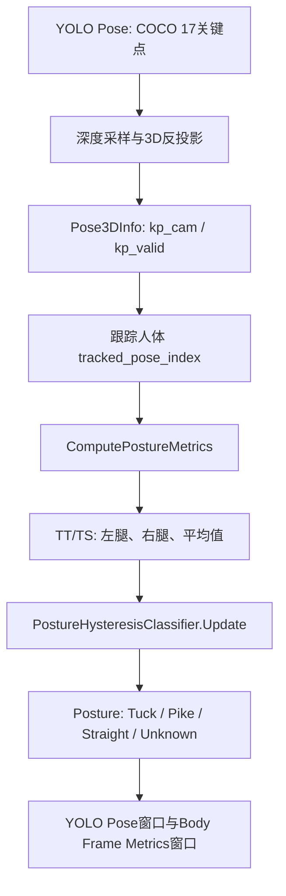
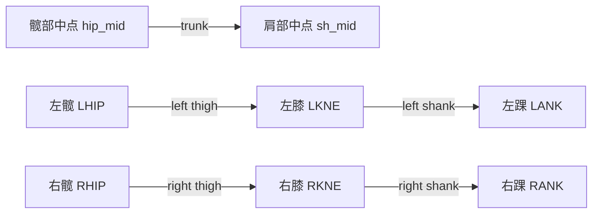
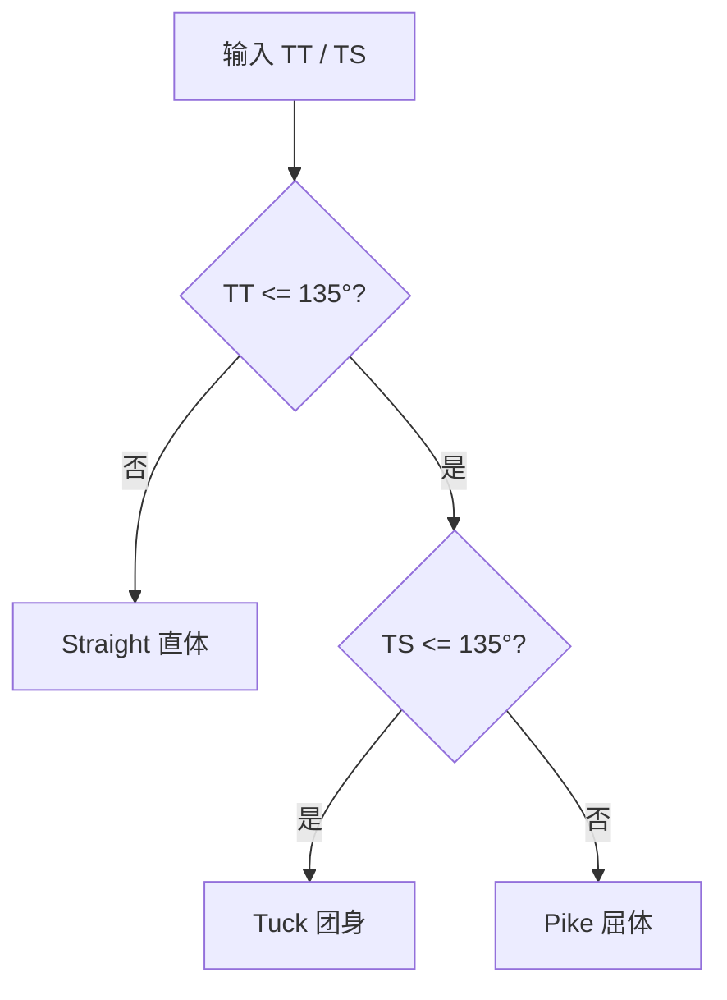

本页解释当前代码中三种基础姿态 **Tuck（团身）/ Pike（屈体）/ Straight（直体）** 的判定链路：输入来自 COCO 17 关键点与深度融合后的 3D 点，核心量是 `TT`（trunk-thigh，躯干-大腿夹角）与 `TS`（thigh-shank，大腿-小腿夹角），输出则是运行时界面中的 `Posture: <label>`。本页只覆盖姿态角度、分类规则与显示路径；YOLO 推理、床面坐标系、落点检测与稳定性优化分别属于其他页面。Sources: [docs/20260204三种基本姿态判断.md](docs/20260204三种基本姿态判断.md#L1-L4), [get_pose_indemind_left.cpp](get_pose_indemind_left.cpp#L252-L263)

## 架构假设与验证结论

本页的初始架构假设是：**姿态判定不是独立模型，而是 3D 骨架关键点上的几何分类器**。代码验证后可以确认，姿态相关数据集中在 `PostureMetrics` 中，包含左右腿有效性、左右腿 TT/TS、平均 TT/TS，以及最终标签 `label`；主循环在选中跟踪人体后调用 `ComputePostureMetrics(...)` 计算这些量，并把结果送入姿态标签更新路径。Sources: [get_pose_indemind_left.cpp](get_pose_indemind_left.cpp#L252-L263), [get_pose_indemind_left.cpp](get_pose_indemind_left.cpp#L1114-L1121)

这张图强调的是本页范围内的“几何判定子链路”：姿态分类依赖 3D 关键点有效性、角度计算与标签更新，不讨论 ONNX 输出解析、NMS、ROI 平面拟合或落点状态机的内部实现。Sources: [get_pose_indemind_left.cpp](get_pose_indemind_left.cpp#L754-L800), [get_pose_indemind_left.cpp](get_pose_indemind_left.cpp#L1074-L1121)

## 输入关键点：从 COCO 17 中取躯干与双腿

姿态判定使用 COCO 17 关键点中的肩、髋、膝、踝：左肩 `LEFT_SHOULDER=5`、右肩 `RIGHT_SHOULDER=6`、左髋 `LEFT_HIP=11`、右髋 `RIGHT_HIP=12`、左膝 `LEFT_KNEE=13`、右膝 `RIGHT_KNEE=14`、左踝 `LEFT_ANKLE=15`、右踝 `RIGHT_ANKLE=16`。这些枚举来自姿态检测公共头文件，`PoseResult` 默认持有 17 个 `KeyPoint`，每个关键点有图像坐标、置信度与后续填充的 3D 坐标。Sources: [yolo_pose_detector.h](yolo_pose_detector.h#L16-L33), [yolo_pose_detector.h](yolo_pose_detector.h#L36-L57)

| 身体部位 | 关键点 | 用途 |
|---|---|---|
| 肩部 | `LEFT_SHOULDER`, `RIGHT_SHOULDER` | 形成肩部中点，用于躯干向量终点 |
| 髋部 | `LEFT_HIP`, `RIGHT_HIP` | 形成髋部中点，用于躯干向量起点；同时作为大腿向量起点 |
| 膝部 | `LEFT_KNEE`, `RIGHT_KNEE` | 大腿向量终点、小腿向量起点 |
| 踝部 | `LEFT_ANKLE`, `RIGHT_ANKLE` | 小腿向量终点 |

Sources: [yolo_pose_detector.h](yolo_pose_detector.h#L22-L33), [docs/20260204三种基本姿态判断.md](docs/20260204三种基本姿态判断.md#L9-L23)

## 3D 点有效性：姿态判定只接受可信关键点

`PostureMetrics` 默认所有有效标记为 `false`，标签为 `Unknown`；这意味着只要关键点缺失、3D 点无效或置信度不足，姿态结果就会自然退回未知状态。文档中也明确说明：两条腿都无效时，角度与姿态标记为 `Unknown`。Sources: [get_pose_indemind_left.cpp](get_pose_indemind_left.cpp#L252-L263), [docs/20260204三种基本姿态判断.md](docs/20260204三种基本姿态判断.md#L39-L44)

主循环中，图像与深度帧先按时间戳缓冲并匹配，随后才进行 3D 骨架构建；图像回调将左相机图像转成 BGR 后推入 `image_buffer`，深度回调把深度转为 `CV_16U` 毫米单位后推入 `depth_buffer`。因此，姿态判定接收的不是纯 2D 骨架，而是已经经过深度融合并带 `kp_valid` 标记的 3D 关键点集合。Sources: [get_pose_indemind_left.cpp](get_pose_indemind_left.cpp#L763-L787), [get_pose_indemind_left.cpp](get_pose_indemind_left.cpp#L789-L804)

## 向量定义：躯干、大腿、小腿

核心几何定义非常直接：髋部中点 `hip_mid=(LHIP+RHIP)/2`，肩部中点 `sh_mid=(LSHO+RSHO)/2`，躯干向量 `trunk=sh_mid-hip_mid`；左腿大腿向量由左髋指向左膝，左腿小腿向量由左膝指向左踝，右腿同理。这个定义把姿态判定从“图像外观问题”转化为“空间向量夹角问题”。Sources: [docs/20260204三种基本姿态判断.md](docs/20260204三种基本姿态判断.md#L9-L23)

这张关系图只描述姿态判定所需的骨段关系；人体坐标系的旋转矩阵、四元数或床面坐标转换不属于本页的分类规则本身。Sources: [docs/20260204三种基本姿态判断.md](docs/20260204三种基本姿态判断.md#L11-L23), [get_pose_indemind_left.cpp](get_pose_indemind_left.cpp#L1074-L1121)

## 角度定义：TT 与 TS

本页中的两个角度分别是 `TT` 与 `TS`：`TT = angle(trunk, thigh)` 表示躯干与大腿的夹角，`TS = angle(thigh, shank)` 表示大腿与小腿的夹角。文档给出的夹角公式是 `angle = arccos(dot(a,b)/(|a||b|))*180/π`，并说明代码中的 `AngleDeg(...)` 会完成归一化、`acos`、角度转换，以及把余弦值限制在 `[-1, 1]` 的数值保护。Sources: [docs/20260204三种基本姿态判断.md](docs/20260204三种基本姿态判断.md#L24-L38)

| 指标 | 中文含义 | 几何含义 | 姿态判定作用 |
|---|---|---|---|
| `TT` | 躯干-大腿角 | 躯干是否向腿部折叠 | 区分 Straight 与非 Straight |
| `TS` | 大腿-小腿角 | 膝关节是否弯曲 | 在非 Straight 中区分 Tuck 与 Pike |
| `avg_tt` | 平均 TT | 左右腿 TT 的合并显示值 | 作为当前显示标签更新的输入之一 |
| `avg_ts` | 平均 TS | 左右腿 TS 的合并显示值 | 作为当前显示标签更新的输入之一 |

Sources: [get_pose_indemind_left.cpp](get_pose_indemind_left.cpp#L252-L263), [docs/20260204三种基本姿态判断.md](docs/20260204三种基本姿态判断.md#L32-L38)

## 基础分类规则：135° 阈值的语义

基础姿态分类规则使用 135° 作为折叠阈值：当 `TT <= 135` 且 `TS <= 135` 时为 `Tuck`，表示躯干靠近大腿且膝部弯曲；当 `TT <= 135` 且 `TS > 135` 时为 `Pike`，表示躯干靠近大腿但膝部相对伸直；当 `TT > 135` 时为 `Straight`，表示躯干与大腿没有明显折叠。Sources: [docs/20260204三种基本姿态判断.md](docs/20260204三种基本姿态判断.md#L46-L55)

这棵决策树是理解三种基础姿态的最小模型：`TT` 首先判断身体是否折叠，`TS` 只在折叠成立时进一步判断膝关节是否弯曲。Sources: [docs/20260204三种基本姿态判断.md](docs/20260204三种基本姿态判断.md#L46-L55)

## 左右腿合并：角度显示与标签输出是两个层次

当前文档说明，左右腿角度会分别计算，平均角度仍用于显示；如果两条腿都有效，姿态分类按逐腿判断与一致性规则处理，只有两条腿满足同一姿态时才输出该姿态，否则为 `Unknown`；如果只有一条腿有效，则使用该腿角度；如果两条腿都无效，则保持 `Unknown`。Sources: [docs/20260204三种基本姿态判断.md](docs/20260204三种基本姿态判断.md#L39-L55)

代码层面还存在一个运行时标签更新环节：主循环先得到 `posture_metrics`，随后把 `posture_metrics.avg_valid`、`avg_tt` 与 `avg_ts` 传入 `posture_classifier.Update(...)`，并把返回值写回 `posture_metrics.label`。因此，阅读运行时显示结果时要区分两层信息：面板中的左右腿/平均角度是度量值，最终 `Posture` 文本是经过标签更新器输出的显示标签。Sources: [get_pose_indemind_left.cpp](get_pose_indemind_left.cpp#L1114-L1121), [get_pose_indemind_left.cpp](get_pose_indemind_left.cpp#L252-L263)

| 场景 | 角度显示 | 标签含义 |
|---|---|---|
| 左右腿都有效 | 显示左腿、右腿、平均 TT/TS | 标签由运行时分类更新路径生成 |
| 仅左腿有效 | 显示左腿角度，并可形成平均显示值 | 标签只能依赖可用侧的角度信息 |
| 仅右腿有效 | 显示右腿角度，并可形成平均显示值 | 标签只能依赖可用侧的角度信息 |
| 双腿都无效 | 显示 `N/A` 或无有效平均值 | 默认保持 `Unknown` |

Sources: [docs/20260204三种基本姿态判断.md](docs/20260204三种基本姿态判断.md#L39-L44), [get_pose_indemind_left.cpp](get_pose_indemind_left.cpp#L1114-L1121)

## 运行时标签状态：Unknown / Pike / Tuck / Straight

代码中定义了 `PostureState` 枚举，包含 `Unknown`、`Pike`、`Tuck`、`Straight` 四种状态，并通过 `PostureStateToString(...)` 映射成界面显示字符串。这个枚举层把“几何分类结果”转化成稳定的 UI 标签集合，避免在显示层散落硬编码字符串。Sources: [get_pose_indemind_left.cpp](get_pose_indemind_left.cpp#L265-L284)

`PostureHysteresisClassifier` 是运行时标签更新器，内部保存当前 `state` 与 `missing_count`，并定义了缺失帧重置阈值及进入/退出用角度阈值；主循环创建一个 `posture_classifier` 实例，然后每帧用当前平均角度更新标签。Sources: [get_pose_indemind_left.cpp](get_pose_indemind_left.cpp#L286-L293), [get_pose_indemind_left.cpp](get_pose_indemind_left.cpp#L756-L761), [get_pose_indemind_left.cpp](get_pose_indemind_left.cpp#L1120-L1121)

## 主循环中的调用位置

主循环先根据可用的 3D 骨架选择被跟踪的人体：如果存在床面坐标系且 `pose_3d_infos` 非空，代码遍历候选人体，优先选择有 `pelvis_valid` 的人体，并在已经有跟踪对象时按当前 pelvis 与上一帧 pelvis 的三维距离平方选择最近者。这个跟踪索引用于确保姿态判定面向同一个被跟踪目标，而不是每帧随机切换检测框。Sources: [get_pose_indemind_left.cpp](get_pose_indemind_left.cpp#L1074-L1101)

选中 `tracked_pose_index` 后，代码调用 `ComputePostureMetrics(poses[tracked_pose_index], pose_3d_infos[tracked_pose_index])` 得到姿态度量，然后用 `posture_classifier.Update(...)` 生成最终标签。这说明姿态判定在实时循环中逐帧执行，输入是当前跟踪人体的 `PoseResult` 与对应 `Pose3DInfo`。Sources: [get_pose_indemind_left.cpp](get_pose_indemind_left.cpp#L1114-L1121)

## 界面输出：两个窗口显示同一标签

`YOLO Pose - INDEMIND Left Camera` 主窗口右上状态区会写入 `Posture: <label>`，用于在视频画面上快速观察当前姿态；同一帧中，`Body Frame Metrics` 面板也会写入 `Posture: <label>`，并继续展示左右腿与平均角度。Sources: [docs/20260204三种基本姿态判断.md](docs/20260204三种基本姿态判断.md#L56-L67), [get_pose_indemind_left.cpp](get_pose_indemind_left.cpp#L1071-L1075)

角度显示采用 `format_angle` 逻辑：无效时显示 `N/A`，有效时保留 1 位小数；随后分别渲染 `Left TT/TS (deg)`、`Right TT/TS (deg)` 与 `Avg TT/TS (deg)`。因此调试姿态误判时，应同时看标签与三组角度，而不是只看最终 `Posture` 文本。Sources: [get_pose_indemind_left.cpp](get_pose_indemind_left.cpp#L1145-L1159), [get_pose_indemind_left.cpp](get_pose_indemind_left.cpp#L1161-L1186)

## 开发者阅读路径

如果你要修改阈值，先阅读本页的 TT/TS 语义，再定位姿态分类与标签更新代码；如果你要确认关键点来源，阅读 [COCO 17 关键点数据结构与骨架可视化](14-coco-17-guan-jian-dian-shu-ju-jie-gou-yu-gu-jia-ke-shi-hua)；如果你要理解 3D 点如何获得，阅读 [深度图单位、相机内参与像素反投影](16-shen-du-tu-dan-wei-xiang-ji-nei-can-yu-xiang-su-fan-tou-ying)；如果你要理解稳定标签为什么不直接等于硬阈值瞬时结果，阅读 [稳定性优化：EMA、滞回、同步与异常抑制](24-wen-ding-xing-you-hua-ema-zhi-hui-tong-bu-yu-yi-chang-yi-zhi)。Sources: [get_pose_indemind_left.cpp](get_pose_indemind_left.cpp#L252-L293), [get_pose_indemind_left.cpp](get_pose_indemind_left.cpp#L1114-L1121)

本页之后的自然下一步是 [单腿姿态、左右侧角度与人体框测量扩展](23-dan-tui-zi-tai-zuo-you-ce-jiao-du-yu-ren-ti-kuang-ce-liang-kuo-zhan)，它延伸了左右侧角度与人体框测量；如果你正在排查姿态标签抖动，则应优先跳转到 [稳定性优化：EMA、滞回、同步与异常抑制](24-wen-ding-xing-you-hua-ema-zhi-hui-tong-bu-yu-yi-chang-yi-zhi)。Sources: [docs/20260204三种基本姿态判断.md](docs/20260204三种基本姿态判断.md#L68-L75), [get_pose_indemind_left.cpp](get_pose_indemind_left.cpp#L286-L293)