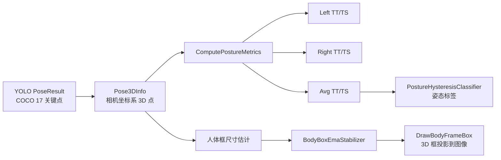
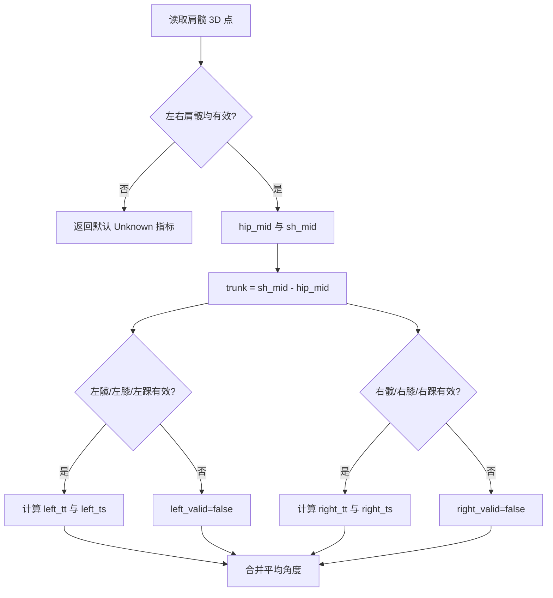
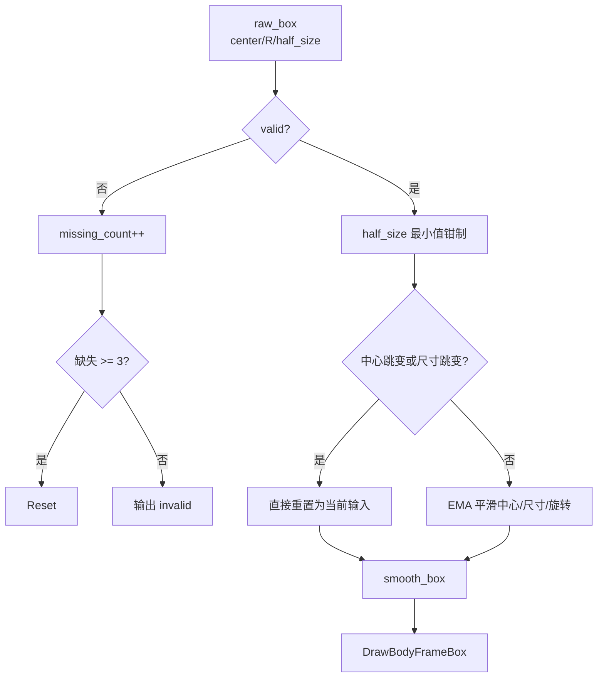

本页定位在“业务算法”章节中，专门解释当前实现里围绕**单腿姿态角度、左右侧角度展开、平均姿态标签、以及人体框测量与绘制**形成的扩展逻辑；它不重复 YOLOv8 Pose 推理、COCO 关键点结构、深度反投影、床面坐标系或基础三姿态规则的完整背景，而是聚焦 `get_pose_indemind_left.cpp` 中这些扩展如何把已获得的 3D 关键点转化为开发者可观察的姿态指标与 3D 视觉框。Sources: [get_pose_indemind_left.cpp](get_pose_indemind_left.cpp#L252-L263), [get_pose_indemind_left.cpp](get_pose_indemind_left.cpp#L458-L520), [get_pose_indemind_left.cpp](get_pose_indemind_left.cpp#L1173-L1289)

## 架构假设与验证结论

从第一性原理看，这一页描述的扩展由三类数据构成：第一类是 COCO 17 关键点中的肩、髋、膝、踝；第二类是这些关键点经过深度融合后得到的相机坐标系 3D 点；第三类是人体坐标系方向矩阵与由躯干尺寸估计出的 3D 包围框。代码验证表明，`PostureMetrics` 保存左右腿有效性、左右 `TT/TS` 角度、平均角度与最终姿态标签，`BodyBoxMeasurement` 保存人体框是否有效、人体坐标系到相机坐标系的旋转、框中心与半尺寸。Sources: [get_pose_indemind_left.cpp](get_pose_indemind_left.cpp#L68-L73), [get_pose_indemind_left.cpp](get_pose_indemind_left.cpp#L252-L263)

上图中的关键边界是：姿态角度计算只依赖肩、髋、膝、踝 3D 点；姿态标签并不在 `ComputePostureMetrics` 内直接给出，而是在主循环中把平均角度交给 `PostureHysteresisClassifier::Update` 后写回 `posture_metrics.label`；人体框则使用已跟踪人体坐标系、骨盆点、肩髋间距估计尺寸，并通过 EMA 稳定后绘制。Sources: [get_pose_indemind_left.cpp](get_pose_indemind_left.cpp#L458-L520), [get_pose_indemind_left.cpp](get_pose_indemind_left.cpp#L1114-L1121), [get_pose_indemind_left.cpp](get_pose_indemind_left.cpp#L1177-L1297)

## 数据结构：从单腿角度到框测量

`PostureMetrics` 是姿态扩展的核心承载结构：`left_valid/right_valid/avg_valid` 表示左右腿与平均角度是否可用，`left_tt/left_ts/right_tt/right_ts` 分别记录左、右侧躯干-大腿角与大腿-小腿角，`avg_tt/avg_ts` 记录可用腿侧的平均值或单侧值，`label` 默认为 `"Unknown"`。这里的 `TT` 对应 trunk-thigh，`TS` 对应 thigh-shank。Sources: [get_pose_indemind_left.cpp](get_pose_indemind_left.cpp#L252-L263), [get_pose_indemind_left.cpp](get_pose_indemind_left.cpp#L505-L517)

| 字段 | 含义 | 产生位置 | 下游用途 |
|---|---|---|---|
| `left_valid` / `right_valid` | 左右腿角度是否成功计算 | `ComputePostureMetrics` | UI 显示 `N/A` 或角度值 |
| `left_tt` / `right_tt` | 左右躯干-大腿角 | `AngleDeg(trunk, thigh, ...)` | 判断屈体程度的输入 |
| `left_ts` / `right_ts` | 左右大腿-小腿角 | `AngleDeg(rev_thigh, shank, ...)` | 区分团身与屈体的输入 |
| `avg_tt` / `avg_ts` | 双侧平均或单侧回退值 | 有效性合并分支 | 滞回分类器输入 |
| `label` | 当前姿态标签 | 主循环调用分类器后写入 | YOLO 窗口与指标窗口显示 |

这些字段全部在同一帧的已跟踪人体上计算：主循环先初始化 `PostureMetrics`，若 `tracked_pose_index` 有效则调用 `ComputePostureMetrics(poses[tracked_pose_index], pose_3d_infos[tracked_pose_index])`，随后用 `posture_classifier.Update(posture_metrics.avg_valid, posture_metrics.avg_tt, posture_metrics.avg_ts)` 更新标签。Sources: [get_pose_indemind_left.cpp](get_pose_indemind_left.cpp#L1114-L1121)

人体框使用独立结构 `BodyBoxMeasurement` 表达，字段包括 `valid`、`R_body_cam`、`center_cam` 与 `half_size`；其中 `R_body_cam` 是人体坐标系方向，`center_cam` 是相机坐标系中的框中心，`half_size` 是人体框在人体坐标系三个方向上的半尺寸。Sources: [get_pose_indemind_left.cpp](get_pose_indemind_left.cpp#L68-L73)

## 单腿角度计算链路

姿态角度计算首先要求左右髋与左右肩都可用，因为躯干向量由髋中点到肩中点构造；代码用 `GetKpCam` 以 `0.3f` 作为关键点置信度阈值读取 `LEFT_HIP`、`RIGHT_HIP`、`LEFT_SHOULDER`、`RIGHT_SHOULDER`，任一基础躯干关键点缺失时直接返回默认的 `PostureMetrics`。Sources: [get_pose_indemind_left.cpp](get_pose_indemind_left.cpp#L458-L480)

左腿角度只在左髋、左膝、左踝都有效时计算：`thigh = LKNE - LHIP`，`shank = LANK - LKNE`，`rev_thigh = -thigh`；`left_tt` 使用躯干向量与大腿向量的夹角，`left_ts` 使用反向大腿向量与小腿向量的夹角。右腿采用相同模式，只是关键点替换为右髋、右膝、右踝。Sources: [get_pose_indemind_left.cpp](get_pose_indemind_left.cpp#L481-L503)

夹角函数 `AngleDeg` 对两个 3D 向量先计算模长，若任一模长小于 `1e-6` 则判定失败；随后计算点积归一化余弦值，将其钳制到 `[-1.0, 1.0]`，再通过 `acos` 转换为角度制。这一数值保护确保了退化向量和浮点误差不会产生非法反三角输入。Sources: [get_pose_indemind_left.cpp](get_pose_indemind_left.cpp#L446-L456)

## 左右侧角度合并规则

左右角度合并遵循可用性优先：如果左右腿都有效，则 `avg_tt` 与 `avg_ts` 取双侧均值；如果只有左腿有效，则平均角度退化为左腿角度；如果只有右腿有效，则平均角度退化为右腿角度；如果两侧都无效，则 `avg_valid` 保持 `false`。Sources: [get_pose_indemind_left.cpp](get_pose_indemind_left.cpp#L505-L517)

| 左腿有效 | 右腿有效 | `avg_valid` | `avg_tt/avg_ts` 来源 |
|---|---|---|---|
| 是 | 是 | 是 | 左右侧角度均值 |
| 是 | 否 | 是 | 左侧角度 |
| 否 | 是 | 是 | 右侧角度 |
| 否 | 否 | 否 | 保持默认值，不参与有效分类 |

最终姿态标签不是简单地在左右腿上分别投票，而是把合并后的 `avg_tt/avg_ts` 输入滞回分类器；这意味着当前实现的公开标签代表“当前已跟踪人体的合并姿态状态”，而左右 `TT/TS` 数值保留在指标面板中用于开发者诊断左右不对称或单侧关键点丢失。Sources: [get_pose_indemind_left.cpp](get_pose_indemind_left.cpp#L1114-L1121), [get_pose_indemind_left.cpp](get_pose_indemind_left.cpp#L1426-L1467)

## 姿态标签的滞回分类接口

`PostureHysteresisClassifier` 维护 `state` 与 `missing_count`，并设置缺失重置帧数 `kResetAfterMissingFrames = 6`，同时为躯干-大腿角和大腿-小腿角分别设置进入与退出阈值：`132.0` 与 `138.0`。这些阈值使标签在临界角度附近不会每帧来回抖动。Sources: [get_pose_indemind_left.cpp](get_pose_indemind_left.cpp#L286-L341)

当输入无效时，分类器增加 `missing_count`，达到 6 帧后将状态重置为 `Unknown`；当当前状态为 `Unknown` 且输入有效时，`tt_deg >= 135.0` 进入 `Straight`，否则根据 `ts_deg <= 135.0` 进入 `Tuck` 或 `Pike`。已有状态下的转移使用进入/退出阈值进行滞回控制。Sources: [get_pose_indemind_left.cpp](get_pose_indemind_left.cpp#L301-L341)

| 当前状态 | 主要转移条件 | 新状态 |
|---|---|---|
| `Unknown` | `tt_deg >= 135.0` | `Straight` |
| `Unknown` | `tt_deg < 135.0` 且 `ts_deg <= 135.0` | `Tuck` |
| `Unknown` | `tt_deg < 135.0` 且 `ts_deg > 135.0` | `Pike` |
| `Straight` | `tt_deg < 132.0` 且 `ts_deg <= 132.0` | `Tuck` |
| `Straight` | `tt_deg < 132.0` 且 `ts_deg > 132.0` | `Pike` |
| `Pike` | `tt_deg >= 138.0` | `Straight` |
| `Pike` | `ts_deg <= 132.0` | `Tuck` |
| `Tuck` | `tt_deg >= 138.0` | `Straight` |
| `Tuck` | `ts_deg >= 138.0` | `Pike` |

该分类器的输出通过 `PostureStateToString` 转成 `"Pike"`、`"Tuck"`、`"Straight"` 或 `"Unknown"`，并写入 `posture_metrics.label`，随后被两个 UI 区域复用：YOLO 主窗口的人体附近标签，以及 `Body Frame Metrics` 面板中的姿态行。Sources: [get_pose_indemind_left.cpp](get_pose_indemind_left.cpp#L272-L284), [get_pose_indemind_left.cpp](get_pose_indemind_left.cpp#L1120-L1121), [get_pose_indemind_left.cpp](get_pose_indemind_left.cpp#L1332-L1356), [get_pose_indemind_left.cpp](get_pose_indemind_left.cpp#L1426-L1430)

## 人体框测量：尺寸来源与坐标定义

人体框只在 `tracked_body_frame.valid`、`tracked_pose_index` 合法且骨盆点有效时尝试更新；它使用当前跟踪人体的相机坐标骨盆点作为基础锚点，并使用 `tracked_body_frame.R_body_cam` 提供人体坐标系方向。Sources: [get_pose_indemind_left.cpp](get_pose_indemind_left.cpp#L1177-L1184), [get_pose_indemind_left.cpp](get_pose_indemind_left.cpp#L1267-L1275)

躯干高度由肩中点与髋中点之间的 3D 距离估计；如果左右肩或左右髋只存在单侧，则中点退化为可用单点；若高度小于 `1.0`，代码使用 `400.0` 作为回退值。Sources: [get_pose_indemind_left.cpp](get_pose_indemind_left.cpp#L1227-L1246), [get_pose_indemind_left.cpp](get_pose_indemind_left.cpp#L1259-L1261)

躯干宽度优先使用左右肩距离；如果左右髋也有效，则再计算髋宽，并在已有肩宽时取肩宽与髋宽的平均值；若宽度小于 `1.0`，代码使用 `300.0` 作为回退值。躯干深度取 `max(120.0, torso_width * 0.4)`。Sources: [get_pose_indemind_left.cpp](get_pose_indemind_left.cpp#L1248-L1265)

人体框中心不是骨盆点本身，而是沿人体坐标系 `Y` 方向从骨盆点上移半个躯干高度：`center_cam = pelvis_cam + y_dir * (torso_height * 0.5)`；半尺寸则设为 `(torso_width * 0.5, torso_height * 0.5, torso_depth * 0.5)`。Sources: [get_pose_indemind_left.cpp](get_pose_indemind_left.cpp#L1267-L1278)

## 人体框稳定化与绘制

`BodyBoxEmaStabilizer` 对人体框中心、旋转与尺寸进行指数平滑：中心 `alpha_center = 0.35`，旋转 `alpha_rotation = 0.30`，尺寸 `alpha_size = 0.30`；它还设置缺失 3 帧重置、中心跳变超过 `900.0` mm 重置、尺寸比超过 `2.2` 重置，以及最小半尺寸 `20.0` mm。Sources: [get_pose_indemind_left.cpp](get_pose_indemind_left.cpp#L345-L359), [get_pose_indemind_left.cpp](get_pose_indemind_left.cpp#L369-L425)

当输入有效时，稳定器先对半尺寸做最小值钳制，再判断是否需要重置；如果无需重置，则对中心、尺寸与旋转进行平滑，其中旋转通过线性混合矩阵后调用 `OrthonormalizeRotation` 保持正交化。输出的 `smooth_box` 被传给 `DrawBodyFrameBox`。Sources: [get_pose_indemind_left.cpp](get_pose_indemind_left.cpp#L380-L417), [get_pose_indemind_left.cpp](get_pose_indemind_left.cpp#L1280-L1289)

`DrawBodyFrameBox` 在人体坐标系中构造 8 个角点，使用 `R_body_cam` 与 `center_cam` 转到相机坐标系，再调用 `ProjectPoint` 投影到图像；只有端点均可见的边才绘制，边颜色为 `cv::Scalar(0, 200, 255)`。Sources: [get_pose_indemind_left.cpp](get_pose_indemind_left.cpp#L522-L577)

## 可视化输出位置

YOLO 主窗口会在人体坐标系原点可投影时，把 `Posture: <label>` 放在骨盆投影点附近，并根据画面边界修正文本位置；如果人体锚点不可用，则退回到右上状态面板显示。Sources: [get_pose_indemind_left.cpp](get_pose_indemind_left.cpp#L1332-L1356)

`Body Frame Metrics` 窗口显示姿态标签、左侧 `TT/TS`、右侧 `TT/TS`、平均 `TT/TS`，其中无效角度通过 `format_angle` 输出 `"N/A"`；该窗口还显示人体坐标系姿态的四元数、欧拉角、累计角度与翻腾/转体/侧翻计数，但本页仅把这些内容视为人体框与姿态扩展共享的可视化上下文。Sources: [get_pose_indemind_left.cpp](get_pose_indemind_left.cpp#L1358-L1467)

| UI 位置 | 显示内容 | 数据来源 |
|---|---|---|
| YOLO 主窗口人体附近 | `Posture: <label>` | `posture_metrics.label` |
| YOLO 主窗口橙色 3D 框 | 人体坐标系对齐框 | `smooth_box` |
| Body Frame Metrics | `Posture` | `posture_metrics.label` |
| Body Frame Metrics | `Left TT/TS` | `posture_metrics.left_*` |
| Body Frame Metrics | `Right TT/TS` | `posture_metrics.right_*` |
| Body Frame Metrics | `Avg TT/TS` | `posture_metrics.avg_*` |

## 与 COCO 关键点和 3D 数据的接口边界

左右侧角度扩展依赖 COCO 17 关键点索引中的肩、髋、膝、踝：`LEFT_SHOULDER=5`、`RIGHT_SHOULDER=6`、`LEFT_HIP=11`、`RIGHT_HIP=12`、`LEFT_KNEE=13`、`RIGHT_KNEE=14`、`LEFT_ANKLE=15`、`RIGHT_ANKLE=16`。`PoseResult` 本身保存检测框、检测置信度、17 个关键点和可选 `person_id`。Sources: [yolo_pose_detector.h](yolo_pose_detector.h#L15-L34), [yolo_pose_detector.h](yolo_pose_detector.h#L48-L58)

`KeyPoint` 的原始结构包含图像坐标、关键点置信度和 `pos3d`，而本页讨论的 `ComputePostureMetrics` 实际通过 `Pose3DInfo` 的 `kp_cam` 与 `kp_valid` 读取相机坐标系点；因此这里的角度和人体框测量是 3D 几何结果，而不是 2D 图像平面角度。Sources: [yolo_pose_detector.h](yolo_pose_detector.h#L36-L46), [get_pose_indemind_left.cpp](get_pose_indemind_left.cpp#L428-L444), [get_pose_indemind_left.cpp](get_pose_indemind_left.cpp#L458-L503)

## 开发者阅读与修改入口

如果只需要理解左右腿角度，应从 `PostureMetrics`、`AngleDeg`、`ComputePostureMetrics` 三处入手；如果需要调整标签稳定性，应修改 `PostureHysteresisClassifier` 的状态转移阈值；如果需要调整人体框尺寸和稳定程度，应查看 `BodyBoxMeasurement`、`BodyBoxEmaStabilizer`、人体框尺寸估计段与 `DrawBodyFrameBox`。Sources: [get_pose_indemind_left.cpp](get_pose_indemind_left.cpp#L252-L341), [get_pose_indemind_left.cpp](get_pose_indemind_left.cpp#L446-L520), [get_pose_indemind_left.cpp](get_pose_indemind_left.cpp#L1173-L1297)

建议后续阅读顺序是：若需要回到基础姿态数学规则，阅读 [团身、屈体、直体三种基础姿态判定](22-tuan-shen-qu-ti-zhi-ti-san-chong-ji-chu-zi-tai-pan-ding)；若要理解人体坐标系如何产生，阅读 [相机坐标系、床面坐标系与人体坐标系的转换关系](19-xiang-ji-zuo-biao-xi-chuang-mian-zuo-biao-xi-yu-ren-ti-zuo-biao-xi-de-zhuan-huan-guan-xi)；若要理解标签抖动、EMA 和异常抑制的整体策略，继续阅读 [稳定性优化：EMA、滞回、同步与异常抑制](24-wen-ding-xing-you-hua-ema-zhi-hui-tong-bu-yu-yi-chang-yi-zhi)。Sources: [get_pose_indemind_left.cpp](get_pose_indemind_left.cpp#L286-L341), [get_pose_indemind_left.cpp](get_pose_indemind_left.cpp#L345-L425), [docs/20260204三种基本姿态判断.md](docs/20260204三种基本姿态判断.md#L46-L66)