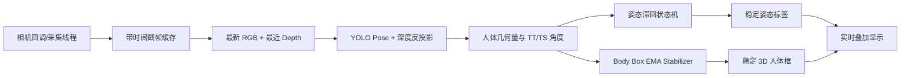
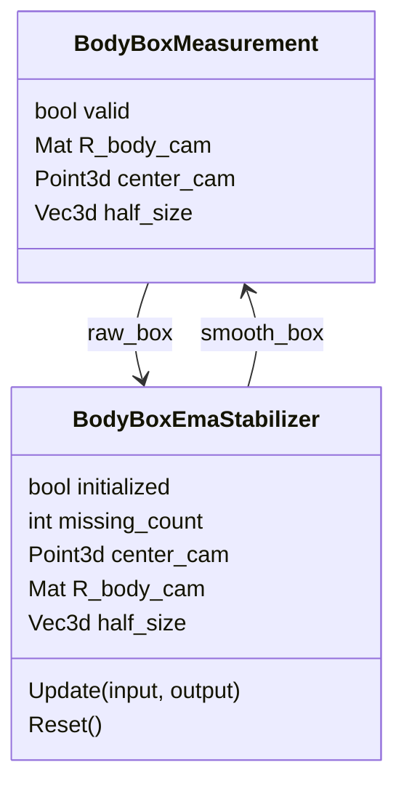
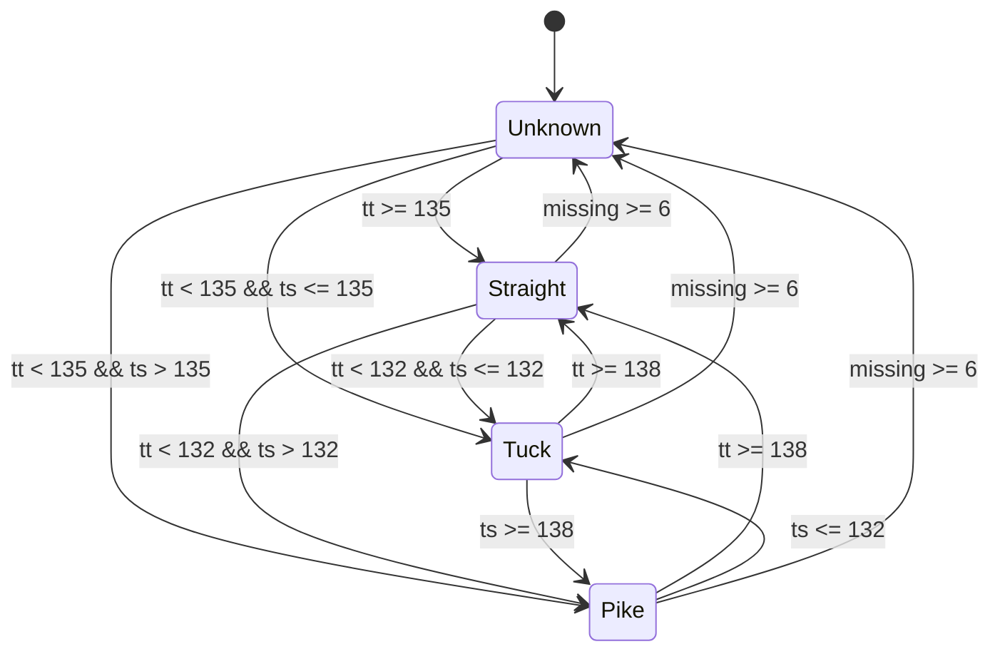

本页位于「深入解析 / 业务算法」中的 **[稳定性优化：EMA、滞回、同步与异常抑制](24-wen-ding-xing-you-hua-ema-zhi-hui-tong-bu-yu-yi-chang-yi-zhi)**，目标是解释当前代码如何降低实时 3D 姿态链路中的四类不稳定：RGB/Depth 时序错配、3D 人体框高频抖动、姿态标签阈值跳变，以及关键点/深度缺失带来的异常传播。代码考古形成的架构假设是：系统没有把稳定性集中封装成单一模块，而是在 **采集缓冲、业务分类、渲染前平滑、缺失复位** 四个边界点分别插入抑制机制。Sources: [get_pose_indemind_left.cpp](get_pose_indemind_left.cpp#L63-L73), [get_pose_indemind_left.cpp](get_pose_indemind_left.cpp#L286-L426), [get_pose_indemind_left.cpp](get_pose_indemind_left.cpp#L729-L761)

## 稳定性机制总览

当前稳定性优化的核心模式可以概括为：输入侧用时间戳和“最新帧”策略降低实时延迟，几何侧用 EMA 平滑人体框中心、方向和尺寸，分类侧用滞回状态机替代单帧硬阈值，异常侧用连续缺失计数和突变阈值触发复位。这个组合不是改变 YOLO 推理结果本身，而是在 3D 重建与业务显示之间建立一层抗噪缓冲。Sources: [get_pose_indemind_left.cpp](get_pose_indemind_left.cpp#L178-L239), [get_pose_indemind_left.cpp](get_pose_indemind_left.cpp#L286-L426), [get_pose_indemind_left.cpp](get_pose_indemind_left.cpp#L1114-L1121), [get_pose_indemind_left.cpp](get_pose_indemind_left.cpp#L1272-L1297)



| 稳定性问题 | 代码边界 | 已实现策略 | 抑制对象 |
|---|---|---|---|
| RGB/Depth 不同步 | `TimedFrame` 缓冲与最近邻选择 | 最新 RGB、时间戳最近 Depth、清理旧深度 | 双流错配、旧帧滞后 |
| 人体框抖动 | `BodyBoxEmaStabilizer` | 中心/方向/尺寸 EMA，旋转正交化 | 深度噪声、关键点微抖 |
| 姿态标签跳变 | `PostureHysteresisClassifier` | 进入/退出阈值分离，保留状态 | Pike/Tuck/Straight 临界跳变 |
| 异常传播 | 缺失计数、突变复位、最小尺寸钳制 | 连续缺失复位、中心突跳复位、体高比例复位 | 遮挡、换人、深度异常 |

Sources: [get_pose_indemind_left.cpp](get_pose_indemind_left.cpp#L178-L239), [get_pose_indemind_left.cpp](get_pose_indemind_left.cpp#L286-L426), [get_pose_indemind_left.cpp](get_pose_indemind_left.cpp#L760-L761)

## RGB/Depth 同步：从队列积压转向时间戳最近邻

INDEMIND 链路将图像和深度流都包装为 `TimedFrame`，其中包含 `timestamp` 与 `cv::Mat frame`；回调侧不再只保存裸 `cv::Mat`，而是通过 `PushTimedFrame` 写入有容量上限的 `std::deque`，当缓冲超过上限时从队首丢弃旧帧并增加丢帧计数。这个设计把“帧内容”和“采集时刻”绑定在一起，使后续同步可以基于时间而非队列顺序。Sources: [get_pose_indemind_left.cpp](get_pose_indemind_left.cpp#L63-L66), [get_pose_indemind_left.cpp](get_pose_indemind_left.cpp#L178-L190), [get_pose_indemind_left.cpp](get_pose_indemind_left.cpp#L729-L741), [get_pose_indemind_left.cpp](get_pose_indemind_left.cpp#L763-L804)

主循环每次通过 `PopLatestFrame` 取出 RGB 缓冲末尾的最新帧，并清空历史图像帧；随后在深度缓冲中调用 `SelectNearestDepthFrame`，按 `abs(depth_ts - rgb_ts)` 搜索与当前 RGB 时间戳最接近的深度帧。该函数还会丢弃早于 `rgb_timestamp - 0.35s` 的深度历史，并在选择后仅保留最新深度帧，避免历史深度长期主导实时链路。Sources: [get_pose_indemind_left.cpp](get_pose_indemind_left.cpp#L193-L239), [get_pose_indemind_left.cpp](get_pose_indemind_left.cpp#L852-L877)

```mermaid
sequenceDiagram
    participant RGB as RGB Callback
    participant DEP as Depth Callback
    participant BUF as Timestamped Deques
    participant LOOP as Main Loop
    participant UI as Overlay

    RGB->>BUF: PushTimedFrame(image, time)
    DEP->>BUF: PushTimedFrame(depth_mm, time)
    LOOP->>BUF: PopLatestFrame(image_buffer)
    LOOP->>BUF: SelectNearestDepthFrame(depth_buffer, image_ts)
    LOOP->>UI: Draw Sync dt
```

同步误差通过 `depth_sync_error_ms` 暴露到实时画面，显示文本为 `Sync dt: <ms>`；因此该机制不仅影响数据选择，也提供了运行时观测入口。对于高级开发者，调试同步稳定性时应优先观察该值是否长期偏大，而不是只看推理帧率。Sources: [get_pose_indemind_left.cpp](get_pose_indemind_left.cpp#L740-L743), [get_pose_indemind_left.cpp](get_pose_indemind_left.cpp#L940-L944)

OAK RGBD 新链路采用另一种同步边界：采集类内部保存 `TimedRgbdFrame`，其中直接包含已配对的 `bgr`、`depth_mm`、`timestamp_sec` 和 `pair_dt_ms`；主循环通过 `TryGetLatest` 只消费最新一帧，并将 `pair_dt_ms` 作为 `depth_sync_error_ms` 显示。也就是说，OAK 链路把配对前移到采集模块，INDEMIND 链路则在主循环中做最近邻匹配。Sources: [app/oak_rgbd_capture.h](app/oak_rgbd_capture.h#L35-L40), [app/oak_rgbd_capture.cpp](app/oak_rgbd_capture.cpp#L233-L244), [get_pose_oak_rgbd.cpp](get_pose_oak_rgbd.cpp#L731-L747), [get_pose_oak_rgbd.cpp](get_pose_oak_rgbd.cpp#L809-L813)

## Body Box EMA：在渲染边界稳定中心、方向与尺寸

人体框稳定化使用 `BodyBoxMeasurement` 作为原始/平滑数据载体，字段包括 `R_body_cam`、`center_cam` 和 `half_size`；`BodyBoxEmaStabilizer` 内部保存上一帧平滑后的中心、旋转矩阵和半尺寸，并使用三个独立系数控制平滑强度：`alpha_center = 0.35`、`alpha_rotation = 0.30`、`alpha_size = 0.30`。Sources: [get_pose_indemind_left.cpp](get_pose_indemind_left.cpp#L68-L73), [get_pose_indemind_left.cpp](get_pose_indemind_left.cpp#L345-L359)

EMA 更新公式在代码中直接体现为 `old * (1 - alpha) + input * alpha`：中心点按 x/y/z 分量逐项平滑，尺寸向量整体线性融合，旋转矩阵先线性融合再通过 `OrthonormalizeRotation` 做 SVD 正交化，避免线性混合后的矩阵偏离合法旋转空间。Sources: [get_pose_indemind_left.cpp](get_pose_indemind_left.cpp#L164-L176), [get_pose_indemind_left.cpp](get_pose_indemind_left.cpp#L407-L418)



人体框的原始测量来自已跟踪人体的骨盆点、人体坐标系方向和躯干尺度：代码根据肩点/髋点估计 `torso_height` 与 `torso_width`，当高度或宽度过小时分别回退到 `400.0` 和 `300.0`，深度厚度取 `max(120.0, torso_width * 0.4)`；框中心为 `pelvis_cam + y_dir * torso_height * 0.5`，半尺寸为宽/高/深的一半。Sources: [get_pose_indemind_left.cpp](get_pose_indemind_left.cpp#L1216-L1278)

平滑只发生在绘制 3D 人体框之前：主循环先构造 `raw_box`，再调用 `body_box_stabilizer.Update(raw_box, smooth_box)`，只有更新成功时才把 `smooth_box` 传给 `DrawBodyFrameBox`。这说明 EMA 被限定在显示稳定层，不直接回写骨架关键点、人体坐标系求解或姿态分类输入。Sources: [get_pose_indemind_left.cpp](get_pose_indemind_left.cpp#L1272-L1290)

## 异常抑制：缺失复位、突跳复位与尺寸钳制

`BodyBoxEmaStabilizer` 对无效输入采用连续缺失计数：当 `input.valid` 为 false 或旋转矩阵为空时，`missing_count` 增加；连续缺失达到 `kResetAfterMissingFrames = 3` 后调用 `Reset()`，并输出无效结果。这能避免人体消失、遮挡或关键点链路断裂后继续沿用陈旧人体框。Sources: [get_pose_indemind_left.cpp](get_pose_indemind_left.cpp#L352-L376)

对于有效输入，稳定器还包含两类硬复位条件：若新中心与当前平滑中心的三维距离超过 `900.0 mm`，或躯干高度半尺寸的比例变化超过 `2.2`，则不做 EMA 拖拽，而是直接用当前输入重新初始化平滑状态。该策略用于阻断换人、深度跳变或尺度突变造成的长尾拖影。Sources: [get_pose_indemind_left.cpp](get_pose_indemind_left.cpp#L352-L355), [get_pose_indemind_left.cpp](get_pose_indemind_left.cpp#L385-L406)

尺寸异常还通过最小半尺寸钳制处理：输入的三个半尺寸分量都会与 `kMinHalfSizeMm = 20.0` 取较大值后再进入比例判断和 EMA。这个边界条件保证人体框不会因为某一维测量塌缩到接近零而污染后续平滑状态。Sources: [get_pose_indemind_left.cpp](get_pose_indemind_left.cpp#L352-L356), [get_pose_indemind_left.cpp](get_pose_indemind_left.cpp#L380-L383)

当本帧没有成功更新人体框时，主循环会主动向稳定器提交一个默认无效的 `BodyBoxMeasurement`，从而驱动缺失计数递增，而不是让稳定器停留在上一帧状态。这个细节保证“无框可画”也会被状态机感知。Sources: [get_pose_indemind_left.cpp](get_pose_indemind_left.cpp#L1293-L1297)

## 姿态滞回：用状态机替代逐帧硬切换

姿态分类输入来自 `ComputePostureMetrics`：它先要求左右髋与左右肩关键点都能通过 `GetKpCam`，再计算躯干向量；随后分别尝试计算左右腿的 TT 角和 TS 角，如果双侧有效则取平均，如果仅单侧有效则使用单侧值，并通过 `avg_valid` 标记分类输入是否可用。Sources: [get_pose_indemind_left.cpp](get_pose_indemind_left.cpp#L458-L519)

`PostureHysteresisClassifier` 持有持久状态 `Unknown / Pike / Tuck / Straight`，并定义四个阈值：`TT` 弯曲进入阈值 `132°`、弯曲退出阈值 `138°`、`TS` 团身进入阈值 `132°`、团身退出阈值 `138°`。进入阈值和退出阈值分离，形成 6° 的滞回带，避免角度在 135° 附近微小波动时每帧翻转标签。Sources: [get_pose_indemind_left.cpp](get_pose_indemind_left.cpp#L265-L294)



分类器对无效测量也保持稳定：当 `valid` 为 false 时，`missing_count` 增加；连续无效达到 `6` 帧后才回退到 `Unknown`，否则返回当前状态字符串。这意味着短暂关键点缺失不会立即清空姿态标签，但长期缺失会被显式复位。Sources: [get_pose_indemind_left.cpp](get_pose_indemind_left.cpp#L286-L308)

主循环中，姿态指标先按跟踪人体计算，然后通过 `posture_classifier.Update(posture_metrics.avg_valid, posture_metrics.avg_tt, posture_metrics.avg_ts)` 写回 `posture_metrics.label`。因此最终显示的 `Posture` 文本不是单帧规则输出，而是经过状态机滤波后的业务标签。Sources: [get_pose_indemind_left.cpp](get_pose_indemind_left.cpp#L1114-L1121), [get_pose_indemind_left.cpp](get_pose_indemind_left.cpp#L1332-L1332), [get_pose_indemind_left.cpp](get_pose_indemind_left.cpp#L1427-L1427)

## 目标选择与落点链路中的已有平滑模式

除了本页核心的 Body Box EMA 和姿态滞回，落点检测相关的 `DepthRegion` 也体现了同类稳定性模式：`EMA3` 是一个按时间步长自适应计算系数的 3D 点 EMA，`Step` 在未初始化时直接采纳首个点，之后按 `1 - exp(-2πfc dt)` 计算滤波系数并更新位置。Sources: [app/depth_region.h](app/depth_region.h#L548-L565)

`DepthRegion` 还通过 `PickTrackedHipIndex` 选择距离上一帧跟踪髋点最近的人体，避免多人检测顺序变化导致目标跳变；当髋点数据为空并连续达到缺失阈值时，落点状态会复位并清除上一跟踪目标。该模式与主循环中人体框的缺失复位属于同一类“状态必须有失效边界”的稳定性设计。Sources: [app/depth_region.h](app/depth_region.h#L580-L600), [app/depth_region.h](app/depth_region.h#L625-L645)

当跟踪髋点存在新坐标系位置时，`DepthRegion` 会计算实际时间间隔 `dt`，用 `ema_new_frame_.Step` 对 `new_frame_pos` 做滤波，然后把滤波后的 z 值写入历史曲线并用于落点检测。这说明项目中已经存在“空间测量先滤波、业务状态后判断”的一致架构风格。Sources: [app/depth_region.h](app/depth_region.h#L646-L674)

## INDEMIND 与 OAK RGBD 链路的稳定化边界差异

| 维度 | INDEMIND 旧目标 | OAK RGBD 新目标 |
|---|---|---|
| RGB/Depth 配对位置 | 主循环内基于两个 `TimedFrame` deque 最近邻匹配 | `OakRgbdCapture` 内部输出已配对 `TimedRgbdFrame` |
| 最新帧策略 | `PopLatestFrame` 取 RGB 最新帧并清空历史 | `TryGetLatest` 返回最新发布帧并清除 `has_new_frame_` |
| 同步误差来源 | `abs(depth_ts - rgb_ts) * 1000` | `pair_dt_ms` |
| 人体框 EMA | `BodyBoxEmaStabilizer` | 同名结构与同类逻辑 |
| 姿态滞回 | `PostureHysteresisClassifier` | 同名状态机逻辑 |

Sources: [get_pose_indemind_left.cpp](get_pose_indemind_left.cpp#L193-L239), [get_pose_indemind_left.cpp](get_pose_indemind_left.cpp#L857-L877), [app/oak_rgbd_capture.cpp](app/oak_rgbd_capture.cpp#L233-L244), [get_pose_oak_rgbd.cpp](get_pose_oak_rgbd.cpp#L731-L747), [get_pose_oak_rgbd.cpp](get_pose_oak_rgbd.cpp#L1135-L1166)

OAK 采集模块还在 DepthAI 管线层启用帧同步和深度对齐：RGB、左右单目相机设置了 FrameSyncMode，StereoDepth 开启 `setFrameSync(true)`，并通过 `rgb_out->link(stereo->inputAlignTo)` 将深度对齐到 CAM_A RGB 输出；主循环消费时已经拿到 `bgr + depth_mm + pair_dt_ms` 的组合帧。Sources: [app/oak_rgbd_capture.cpp](app/oak_rgbd_capture.cpp#L323-L329), [app/oak_rgbd_capture.cpp](app/oak_rgbd_capture.cpp#L353-L369), [app/oak_rgbd_capture.cpp](app/oak_rgbd_capture.cpp#L450-L456)

## 参数速查

| 参数/常量 | 当前值 | 作用位置 | 稳定性含义 |
|---|---:|---|---|
| `kMaxImageBufferSize` | 4 | INDEMIND RGB 缓冲 | 限制图像积压 |
| `kMaxDepthBufferSize` | 8 | INDEMIND Depth 缓冲 | 保留短深度历史供最近邻匹配 |
| `kMaxDepthHistorySec` | 0.35s | `SelectNearestDepthFrame` | 清理相对 RGB 过旧的深度帧 |
| `alpha_center` | 0.35 | Body Box EMA | 中心跟随速度 |
| `alpha_rotation` | 0.30 | Body Box EMA | 方向跟随速度 |
| `alpha_size` | 0.30 | Body Box EMA | 尺寸跟随速度 |
| `kResetAfterMissingFrames` | 3 | Body Box EMA | 连续无效后重置人体框 |
| `kCenterJumpResetMm` | 900mm | Body Box EMA | 中心突跳硬复位 |
| `kSizeRatioReset` | 2.2 | Body Box EMA | 体高尺度突变硬复位 |
| `kMinHalfSizeMm` | 20mm | Body Box EMA | 防止尺寸塌缩 |
| `Posture missing reset` | 6 帧 | 姿态滞回 | 连续无效后回到 Unknown |
| `TT enter/exit` | 132° / 138° | 姿态滞回 | Straight 与弯曲姿态切换带 |
| `TS enter/exit` | 132° / 138° | 姿态滞回 | Tuck 与 Pike 切换带 |

Sources: [get_pose_indemind_left.cpp](get_pose_indemind_left.cpp#L211-L237), [get_pose_indemind_left.cpp](get_pose_indemind_left.cpp#L734-L735), [get_pose_indemind_left.cpp](get_pose_indemind_left.cpp#L290-L294), [get_pose_indemind_left.cpp](get_pose_indemind_left.cpp#L352-L359)

## 设计边界与阅读建议

本页只覆盖稳定性优化本身：如果要理解深度值如何从图像变为 3D 点，应继续阅读 [深度图单位、相机内参与像素反投影](16-shen-du-tu-dan-wei-xiang-ji-nei-can-yu-xiang-su-fan-tou-ying)；如果要理解 ROI 与床面坐标系如何影响人体框和髋点轨迹，应阅读 [四点 ROI、RANSAC 平面拟合与床面坐标系构建](18-si-dian-roi-ransac-ping-mian-ni-he-yu-chuang-mian-zuo-biao-xi-gou-jian)；如果要理解姿态角 TT/TS 的业务含义，应阅读 [团身、屈体、直体三种基础姿态判定](22-tuan-shen-qu-ti-zhi-ti-san-chong-ji-chu-zi-tai-pan-ding)。Sources: [get_pose_indemind_left.cpp](get_pose_indemind_left.cpp#L458-L519), [get_pose_indemind_left.cpp](get_pose_indemind_left.cpp#L1216-L1290)

工程化层面，稳定性机制与实时性能、队列限流、线程协作强相关；理解本页后，建议继续阅读 [性能统计、队列限流与只处理最新帧策略](25-xing-neng-tong-ji-dui-lie-xian-liu-yu-zhi-chu-li-zui-xin-zheng-ce-lue)、[录制会话、落点 CSV 导出与运行状态管理](26-lu-zhi-hui-hua-luo-dian-csv-dao-chu-yu-yun-xing-zhuang-tai-guan-li) 和 [全局状态、回调线程与主循环协作模式](27-quan-ju-zhuang-tai-hui-diao-xian-cheng-yu-zhu-xun-huan-xie-zuo-mo-shi)。Sources: [get_pose_indemind_left.cpp](get_pose_indemind_left.cpp#L729-L804), [get_pose_indemind_left.cpp](get_pose_indemind_left.cpp#L852-L890), [get_pose_indemind_left.cpp](get_pose_indemind_left.cpp#L1136-L1163)