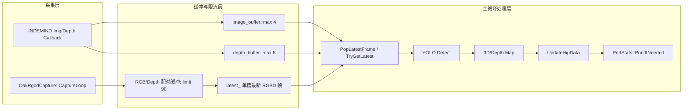

实时姿态链路的核心矛盾不是“处理每一帧”，而是**在推理、深度映射和业务判断耗时不稳定时保持低延迟**。本页只解释三个运行时工程机制：`PerfStats` 如何采样并周期性输出耗时，INDEMIND 兼容链路如何用有界 `deque` 限流并丢弃旧帧，OAK RGBD 新链路如何用“最新一帧槽位”避免主循环追赶历史帧。Sources: [perf_stats.h](app/perf_stats.h#L7-L23), [get_pose_indemind_left.cpp](get_pose_indemind_left.cpp#L729-L741), [oak_rgbd_capture.h](app/oak_rgbd_capture.h#L52-L63)

## 运行时延迟控制的总体关系

本页涉及的对象可以拆成三层：**采集层**负责接收 RGB/Depth 数据并统计采集量，**缓冲层**负责限制积压或发布最新 RGBD 配对帧，**主循环**只在拿到可处理帧时执行 YOLO 推理、深度映射、落点更新和性能打印。INDEMIND 链路在入口文件中维护 `image_buffer`、`depth_buffer`、互斥锁和丢帧计数；OAK 链路把采集线程封装在 `OakRgbdCapture`，对外暴露 `TryGetLatest()`、采集计数、配对计数和丢帧计数。Sources: [get_pose_indemind_left.cpp](get_pose_indemind_left.cpp#L729-L743), [oak_rgbd_capture.h](app/oak_rgbd_capture.h#L50-L63), [get_pose_oak_rgbd.cpp](get_pose_oak_rgbd.cpp#L731-L747)

这张图表达的是“低延迟优先”的实现边界：INDEMIND 通过 `PushTimedFrame()` 在回调侧限制 `deque` 长度，并通过 `PopLatestFrame()` 在主循环侧取最后一帧后清空旧帧；OAK 先在采集线程里用时间戳匹配 RGB/Depth，再通过 `PublishFrame()` 覆盖 `latest_`，主循环调用 `TryGetLatest()` 后会把 `has_new_frame_` 置回 `false`。Sources: [get_pose_indemind_left.cpp](get_pose_indemind_left.cpp#L178-L199), [app/oak_rgbd_capture.cpp](app/oak_rgbd_capture.cpp#L271-L278), [app/oak_rgbd_capture.cpp](app/oak_rgbd_capture.cpp#L233-L244)

## 性能统计：固定样本窗口与周期打印

`PerfStats` 是一个全局运行时统计器，保存三类耗时样本：`inference_ms`、`depth_map_ms`、`landing_detect_ms`。每类样本使用 `std::deque<double>`，并共享 `MAX_SAMPLES = 100` 的固定窗口；新增样本超过窗口后从队首弹出旧样本，因此统计代表最近最多 100 次处理，而不是全量历史平均。Sources: [perf_stats.h](app/perf_stats.h#L7-L21), [perf_stats.cpp](app/perf_stats.cpp#L9-L22)

| 指标 | 写入函数 | 采样位置 | 时间单位 | 窗口策略 |
|---|---|---|---|---|
| 推理耗时 | `AddInference()` | YOLO `Detect()` 前后 | 毫秒，`duration_cast<milliseconds>` | 最多 100 条，超出 `pop_front()` |
| 深度映射耗时 | `AddDepthMap()` | 3D 关键点、床面坐标、姿态相关深度处理后 | 毫秒，微秒转毫秒 | 最多 100 条，超出 `pop_front()` |
| 落点更新耗时 | `AddLandingDetect()` | `depth_region.UpdateHipData()` 前后 | 毫秒，微秒转毫秒 | 最多 100 条，超出 `pop_front()` |

Sources: [perf_stats.cpp](app/perf_stats.cpp#L9-L22), [get_pose_oak_rgbd.cpp](get_pose_oak_rgbd.cpp#L750-L758), [get_pose_indemind_left.cpp](get_pose_indemind_left.cpp#L1123-L1134)

周期打印由 `PrintIfNeeded()` 控制：第一次调用只初始化 `last_print_time` 并返回，之后每当距离上次打印达到 2 秒就调用 `PrintStats()`。`PrintStats()` 对每个 `deque` 计算平均值和最大值，并以 `[Perf] Inference: avg/maxms | Depth: avg/maxms | Landing: avg/maxms` 的格式输出到标准输出。Sources: [perf_stats.cpp](app/perf_stats.cpp#L24-L36), [perf_stats.cpp](app/perf_stats.cpp#L38-L54)

主循环还在窗口叠加层显示更即时的指标：每处理一帧累加 `fps_frame_count`，每秒刷新一次 `current_fps`；当前帧推理耗时以 `Inference: <ms>` 绘制；OAK 链路还显示 RGB/Depth 配对误差 `Sync dt`。这与 `PerfStats` 的 2 秒控制台聚合不同，前者服务实时观察，后者服务阶段性诊断。Sources: [get_pose_oak_rgbd.cpp](get_pose_oak_rgbd.cpp#L775-L813), [get_pose_indemind_left.cpp](get_pose_indemind_left.cpp#L906-L930), [get_pose_oak_rgbd.cpp](get_pose_oak_rgbd.cpp#L1398-L1403)

## INDEMIND：有界队列与只取最新 RGB 帧

INDEMIND 兼容链路在主函数中建立两个带时间戳的 `deque`：`image_buffer` 和 `depth_buffer`，并分别设置 `kMaxImageBufferSize = 4`、`kMaxDepthBufferSize = 8`。同时维护 `dropped_images` 和 `dropped_depth`，用于记录由于缓冲区满而被丢弃的旧帧数量。Sources: [get_pose_indemind_left.cpp](get_pose_indemind_left.cpp#L729-L741)

`PushTimedFrame()` 是该链路的限流入口：如果输入帧为空则直接返回；当缓冲区大小已经达到 `max_size` 时，循环弹出队首旧帧并递增 `drop_count`；最后把当前帧和时间戳压入队尾。这个策略保证回调不会让队列无限增长，并明确选择“丢旧帧”而不是阻塞采集回调。Sources: [get_pose_indemind_left.cpp](get_pose_indemind_left.cpp#L178-L191)

RGB 图像回调只使用左相机图像：当左图非空时，先根据通道数把灰度图转换为 BGR 或克隆彩色图，然后在 `mutex_image` 保护下调用 `PushTimedFrame(image_buffer, time, color_image, kMaxImageBufferSize, dropped_images)`。深度回调则在启用深度处理器后把深度从米转换为毫米 `CV_16U`，再在 `mutex_depth` 保护下压入 `depth_buffer`。Sources: [get_pose_indemind_left.cpp](get_pose_indemind_left.cpp#L763-L787), [get_pose_indemind_left.cpp](get_pose_indemind_left.cpp#L789-L807)

主循环不是逐帧消费 RGB 队列，而是调用 `PopLatestFrame()`：该函数取 `buffer.back()` 作为输出，然后 `buffer.clear()` 清空所有历史帧。因此，只要推理耗时超过采集间隔，下一轮处理会跳到最新 RGB 帧，而不会把过时画面逐一补处理。Sources: [get_pose_indemind_left.cpp](get_pose_indemind_left.cpp#L193-L199), [get_pose_indemind_left.cpp](get_pose_indemind_left.cpp#L852-L865)

深度帧的处理稍有不同：`SelectNearestDepthFrame()` 会先删除早于当前 RGB 时间戳 0.35 秒以上的旧深度帧，然后遍历缓冲区选择与 RGB 时间戳绝对差最小的深度帧，并输出同步误差毫秒值；选择完成后，它保留原缓冲区最后一帧并清空其他深度帧。这个策略同时满足“按时间戳最近匹配”和“避免深度历史积压”。Sources: [get_pose_indemind_left.cpp](get_pose_indemind_left.cpp#L202-L239), [get_pose_indemind_left.cpp](get_pose_indemind_left.cpp#L867-L877)

## OAK RGBD：配对缓冲、最新槽位与主循环拉取

OAK 链路把采集细节封装在 `OakRgbdCapture`：类内部有采集线程 `worker_`、原子运行标志 `running_`、互斥保护的 `latest_`、`has_new_frame_`，以及图像、深度、配对和丢帧计数。对主循环公开的关键方法是 `Start()`、`Stop()` 和 `TryGetLatest()`。Sources: [oak_rgbd_capture.h](app/oak_rgbd_capture.h#L42-L63), [oak_rgbd_capture.h](app/oak_rgbd_capture.h#L69-L89)

在采集线程中，RGB 输出队列和 Depth 输出队列分别创建为 `kOutputQueueSize = 120` 且 `kOutputQueueBlocking = true`，进入本地 `rgb_buf`、`depth_buf` 后再由 `AppendAndTrim()` 限制为 `kPairBufferLimit = 90`。当本地缓冲超过限制时，队首帧被弹出并递增对应的丢帧计数。Sources: [app/oak_rgbd_capture.cpp](app/oak_rgbd_capture.cpp#L19-L21), [app/oak_rgbd_capture.cpp](app/oak_rgbd_capture.cpp#L43-L52), [app/oak_rgbd_capture.cpp](app/oak_rgbd_capture.cpp#L376-L416)

RGB/Depth 配对由 `PopClosestPair()` 完成：它以 `primary_buf.front()` 的时间戳为基准，在 secondary 缓冲中寻找时间差最小的帧；如果最小时间差超过 `pair_threshold_ms`，就根据两个时间戳先后丢弃更早的一侧并计入丢帧；如果满足阈值，则弹出 RGB 队首和 secondary 中截至最佳索引的帧，并返回 `pair_dt_ms`。Sources: [app/oak_rgbd_capture.cpp](app/oak_rgbd_capture.cpp#L54-L97), [app/oak_rgbd_capture.cpp](app/oak_rgbd_capture.cpp#L423-L431)

配对成功后，采集线程把 RGB 帧转换为 BGR，把深度帧转换为 `CV_16UC1` 毫米图，并检查尺寸和类型是否符合配置；随后构造 `TimedRgbdFrame`，写入 RGB 时间戳、配对误差、BGR 图和深度图，调用 `PublishFrame()` 发布。`PublishFrame()` 不是追加队列，而是在互斥锁下覆盖 `latest_` 并设置 `has_new_frame_ = true`。Sources: [app/oak_rgbd_capture.cpp](app/oak_rgbd_capture.cpp#L433-L456), [app/oak_rgbd_capture.cpp](app/oak_rgbd_capture.cpp#L271-L278)

主循环调用 `TryGetLatest()` 拉取最新 RGBD 帧；如果没有新帧，它只处理键盘退出事件并 `continue`，不会执行推理。`TryGetLatest()` 在成功返回时克隆 `latest_.bgr` 和 `latest_.depth_mm`，然后把 `has_new_frame_` 置为 `false`，因此主循环每次最多消费一个已发布的最新配对帧。Sources: [app/oak_rgbd_capture.cpp](app/oak_rgbd_capture.cpp#L233-L244), [get_pose_oak_rgbd.cpp](get_pose_oak_rgbd.cpp#L731-L747)

## 两条链路的策略对比

INDEMIND 和 OAK 都选择低延迟优先，但实现位置不同：INDEMIND 在入口文件中用 `deque` 暴露并控制 RGB/Depth 缓冲；OAK 在采集类内部完成 RGB/Depth 配对，然后对主循环只暴露一个“最新 RGBD 帧”槽位。两者都会记录丢帧数量，并在程序结束时输出性能统计。Sources: [get_pose_indemind_left.cpp](get_pose_indemind_left.cpp#L729-L741), [oak_rgbd_capture.h](app/oak_rgbd_capture.h#L58-L63), [get_pose_oak_rgbd.cpp](get_pose_oak_rgbd.cpp#L1497-L1505)

| 维度 | INDEMIND 兼容链路 | OAK RGBD 新链路 |
|---|---|---|
| RGB 缓冲 | `image_buffer`，最大 4 | 采集类内部 RGB 配对缓冲，最大 90 |
| Depth 缓冲 | `depth_buffer`，最大 8 | 采集类内部 Depth 配对缓冲，最大 90 |
| 最新帧策略 | `PopLatestFrame()` 取队尾后清空 | `PublishFrame()` 覆盖 `latest_`，`TryGetLatest()` 拉取 |
| 同步方式 | 当前 RGB 时间戳匹配最近 Depth | 采集线程中按阈值匹配 RGB/Depth |
| 丢帧统计 | `dropped_images`、`dropped_depth` | `DroppedRgbCount()`、`DroppedDepthCount()` |
| 主循环无帧行为 | RGB 为空时跳过处理并继续循环后续交互 | `TryGetLatest()` 失败时只检查退出键并 `continue` |

Sources: [get_pose_indemind_left.cpp](get_pose_indemind_left.cpp#L178-L239), [app/oak_rgbd_capture.cpp](app/oak_rgbd_capture.cpp#L43-L97), [get_pose_oak_rgbd.cpp](get_pose_oak_rgbd.cpp#L731-L740)

## 退出时统计：吞吐量与丢帧量

OAK 链路退出时先停止采集线程并销毁窗口，然后输出总运行时间、总图像数、总深度图数、姿态检测次数、丢弃 RGB 帧数和丢弃深度帧数；如果总运行时间大于 0，还会输出图像采集、深度和姿态检测的平均 FPS。Sources: [get_pose_oak_rgbd.cpp](get_pose_oak_rgbd.cpp#L1490-L1511)

INDEMIND 链路退出时也输出同类统计：总运行时间、采集图像数、深度图数、姿态检测次数、丢弃图像帧和丢弃深度帧，并继续计算平均速率。这里的丢帧主要来自 `PushTimedFrame()` 在缓冲区满时弹出的旧帧。Sources: [get_pose_indemind_left.cpp](get_pose_indemind_left.cpp#L1624-L1640), [get_pose_indemind_left.cpp](get_pose_indemind_left.cpp#L178-L191)

## 阅读与维护建议

如果你要理解为什么 OAK 链路需要先配对 RGB 与 Depth，再进入这里讨论的最新帧策略，下一步阅读 [OAK DepthAI 管线、RGB-Depth 配对与时间同步](15-oak-depthai-guan-xian-rgb-depth-pei-dui-yu-shi-jian-tong-bu)。如果你要理解主循环如何与采集回调、全局状态和窗口交互协作，继续阅读 [全局状态、回调线程与主循环协作模式](27-quan-ju-zhuang-tai-hui-diao-xian-cheng-yu-zhu-xun-huan-xie-zuo-mo-shi)。如果你关心性能统计之后的数据落盘和运行状态切换，继续阅读 [录制会话、落点 CSV 导出与运行状态管理](26-lu-zhi-hui-hua-luo-dian-csv-dao-chu-yu-yun-xing-zhuang-tai-guan-li)。Sources: [get_pose_oak_rgbd.cpp](get_pose_oak_rgbd.cpp#L731-L747), [get_pose_indemind_left.cpp](get_pose_indemind_left.cpp#L852-L877), [get_pose_oak_rgbd.cpp](get_pose_oak_rgbd.cpp#L1497-L1511)