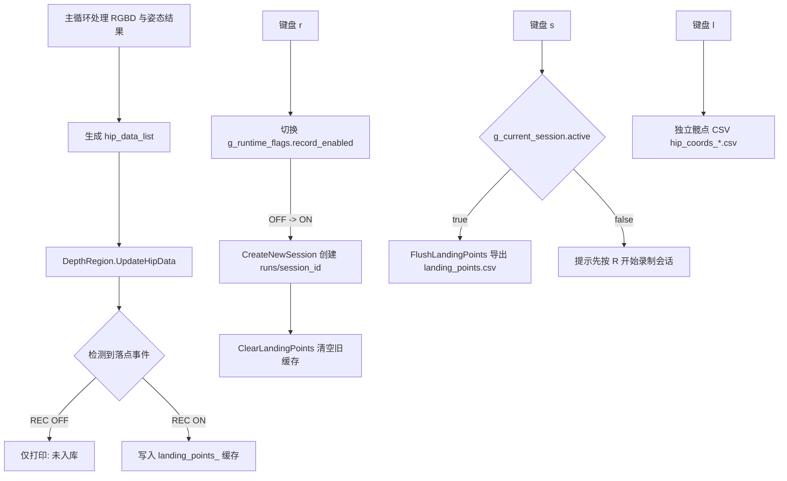

本页解释运行时工程化链路中的**录制会话、落点缓存、CSV 导出与状态显示**：它不讨论落点检测的数学判定，也不展开相机采集、姿态推理或床面坐标系构建；这些主题分别属于 [髋点轨迹建模与落点检测状态机](21-kuan-dian-gui-ji-jian-mo-yu-luo-dian-jian-ce-zhuang-tai-ji)、[OAK DepthAI 管线、RGB-Depth 配对与时间同步](15-oak-depthai-guan-xian-rgb-depth-pei-dui-yu-shi-jian-tong-bu) 与 [四点 ROI、RANSAC 平面拟合与床面坐标系构建](18-si-dian-roi-ransac-ping-mian-ni-he-yu-chuang-mian-zuo-biao-xi-gou-jian)。本页当前位于目录中的“运行时与工程化”部分，直接承接 [性能统计、队列限流与只处理最新帧策略](25-xing-neng-tong-ji-dui-lie-xian-liu-yu-zhi-chu-li-zui-xin-zheng-ce-lue)，并为后续理解 [全局状态、回调线程与主循环协作模式](27-quan-ju-zhuang-tai-hui-diao-xian-cheng-yu-zhu-xun-huan-xie-zuo-mo-shi) 提供状态管理背景。Sources: [get_pose_oak_rgbd.cpp](get_pose_oak_rgbd.cpp#L691-L706), [app/runtime_state.h](app/runtime_state.h#L7-L24)

## 架构假设与代码验证结论

从第一性原理看，本页涉及两类“录制”：第一类是按 `l` 键开启的**髋点逐帧 CSV 录制**，它直接在入口主循环中维护 `recording_data`、`csv_file` 与 `frame_count`；第二类是按 `r` 键开启的**落点会话录制**，它通过全局 `g_runtime_flags.record_enabled` 控制 `DepthRegion` 是否把已确认落点写入内存缓存，再由 `s` 键导出到会话目录下的 `landing_points.csv`。Sources: [get_pose_oak_rgbd.cpp](get_pose_oak_rgbd.cpp#L684-L687), [get_pose_oak_rgbd.cpp](get_pose_oak_rgbd.cpp#L1408-L1487), [app/depth_region.h](app/depth_region.h#L858-L880)

以下图展示本页关注的状态与数据流；图中的“检测落点”只作为上游事件出现，具体极低点确认、加权平均与滞回细节不在本页展开。Sources: [app/depth_region.h](app/depth_region.h#L840-L851), [app/depth_region.h](app/depth_region.h#L933-L964)

该架构的核心边界是：**运行状态在 `runtime_state` 中集中声明，落点缓存与导出在 `DepthRegion` 中实现，键盘事件与 UI 状态显示在两个入口文件中编排**。CMake 将 `app/runtime_state.cpp` 与 `app/depth_region.cpp` 放入 `APP_SOURCES`，并同时链接到 `yolo_pose_oak_rgbd` 和 `yolo_pose_indemind_left`，因此两条入口链路复用同一套会话与落点导出实现。Sources: [CMakeLists.txt](CMakeLists.txt#L551-L568), [CMakeLists.txt](CMakeLists.txt#L625-L631)

## 运行时状态模型

`RuntimeFlags` 目前只包含一个布尔字段 `record_enabled`，默认值为 `false`，用于控制落点是否被真正写入缓存；`DataSession` 保存 `session_id`、`output_dir`、`start_time` 与 `active`，用于描述当前录制会话是否已经创建以及输出路径在哪里。两个对象以 `extern` 形式在头文件中声明，并在 `runtime_state.cpp` 中定义为进程级全局对象。Sources: [app/runtime_state.h](app/runtime_state.h#L7-L24), [app/runtime_state.cpp](app/runtime_state.cpp#L10-L11)

| 状态对象 | 字段 | 默认/赋值位置 | 作用 | Sources |
|---|---|---|---|---|
| `RuntimeFlags` | `record_enabled` | 结构体内默认 `false` | 控制落点是否入库 | [app/runtime_state.h](app/runtime_state.h#L7-L10) |
| `DataSession` | `session_id` | `CreateNewSession()` 中按本地时间格式化 | 作为会话标识与目录名的一部分 | [app/runtime_state.cpp](app/runtime_state.cpp#L15-L22) |
| `DataSession` | `output_dir` | `"runs/" + session_id` | 落点 CSV 输出目录 | [app/runtime_state.cpp](app/runtime_state.cpp#L21-L28) |
| `DataSession` | `active` | 创建成功前设为 `true`，失败后设为 `false` | 判断 `s` 键是否允许保存 | [app/runtime_state.cpp](app/runtime_state.cpp#L23-L36), [get_pose_oak_rgbd.cpp](get_pose_oak_rgbd.cpp#L1480-L1486) |

`CreateNewSession()` 使用 `std::chrono::system_clock::now()` 获取当前时间，并通过 `std::put_time(std::localtime(...), "%Y%m%d_%H%M%S")` 生成形如 `20260212_122107` 的会话 ID；随后它把输出目录设置为 `runs/<session_id>`，调用 `mkdir -p` 创建目录，成功时打印“新会话已创建”，失败时打印错误并将 `active` 置回 `false`。Sources: [app/runtime_state.cpp](app/runtime_state.cpp#L13-L38)

## 键盘交互：`r`、`s`、`c` 与 `l` 的职责分离

程序启动时会在控制台打印交互说明，其中 `l` 被定义为髋点坐标录制开关，`r` 被定义为落点录制 REC 开关，`c` 用于清空落点缓存，`s` 用于保存落点到 CSV；这说明代码层面同时存在“逐帧髋点记录”和“落点事件记录”两条不同的数据输出路径。Sources: [get_pose_oak_rgbd.cpp](get_pose_oak_rgbd.cpp#L691-L706), [get_pose_indemind_left.cpp](get_pose_indemind_left.cpp#L1540-L1618)

| 按键 | 管理对象 | 输出文件 | 触发条件 | 行为 |
|---|---|---|---|---|
| `l` / `L` | 入口文件局部变量 `recording_data`、`csv_file`、`frame_count` | `hip_coords_YYYYMMDD_HHMMSS.csv` | 每次按键切换 | 开启时写表头，关闭时关闭文件 |
| `r` / `R` | `g_runtime_flags.record_enabled` 与 `g_current_session` | 会话目录，后续由 `s` 写 `landing_points.csv` | OFF → ON 时创建新会话 | 切换 REC，并在开启时清空旧落点缓存 |
| `c` / `C` | `DepthRegion::landing_points_` 与计数器 | 无直接文件输出 | 按键立即执行 | 清空落点缓存并复位落点状态 |
| `s` / `S` | `DepthRegion::FlushLandingPoints()` | `runs/<session_id>/landing_points.csv` | `g_current_session.active == true` | 导出当前缓存，否则提示先按 `R` |

Sources: [get_pose_oak_rgbd.cpp](get_pose_oak_rgbd.cpp#L1414-L1487), [app/depth_region.h](app/depth_region.h#L920-L964)

按 `r` 时，入口代码先记录切换前是否为 OFF，然后翻转 `g_runtime_flags.record_enabled`；当状态从 OFF 切到 ON 时，程序调用 `CreateNewSession()` 创建新目录，并调用 `depth_region.ClearLandingPoints()` 清除上一轮缓存。这个顺序保证新会话开始时不会携带上一会话的落点列表。Sources: [get_pose_oak_rgbd.cpp](get_pose_oak_rgbd.cpp#L1465-L1476), [app/depth_region.h](app/depth_region.h#L920-L926)

按 `s` 时，入口代码不会自动创建会话，而是先检查 `g_current_session.active`；只有会话已激活时才调用 `depth_region.FlushLandingPoints(g_current_session.output_dir)`，否则输出“请先按 R 开始录制会话”。因此，落点 CSV 的导出语义是“保存当前会话缓存”，不是“按下即新建文件并开始采集”。Sources: [get_pose_oak_rgbd.cpp](get_pose_oak_rgbd.cpp#L1480-L1486), [app/runtime_state.h](app/runtime_state.h#L12-L18)

## 落点入库：REC 状态如何影响缓存

`DepthRegion::RecordLandingPoint()` 是落点事件从“检测到”变为“入库”的门禁点：当 `g_runtime_flags.record_enabled` 为真时，它递增 `landing_count_`、设置 `landing_id`、把 `LandingPoint` 推入 `landing_points_`，并在控制台打印“已入库”；当 REC 为假时，它仍然打印检测到落点的信息，但明确标记为“未入库 - REC OFF”。Sources: [app/depth_region.h](app/depth_region.h#L854-L880)

`LandingPoint` 记录的 CSV 相关字段包括 `landing_id`、`t_ms_since_start`、`new_frame_x`、`new_frame_y` 与 `new_frame_z`；其中 `time_minutes` 和 `time_seconds` 用于控制台展示，而 `landing_id` 在创建临时记录时先置为 `0`，只有通过 `RecordLandingPoint()` 入库时才会被赋予递增编号。Sources: [app/depth_region.h](app/depth_region.h#L529-L538), [app/depth_region.h](app/depth_region.h#L840-L863)

`ClearLandingPoints()` 会同时清空 `landing_points_`、把 `landing_count_` 归零，并调用 `ResetLandingState(true)` 复位落点检测相关状态；这也是新会话开始时执行的清理动作。Sources: [app/depth_region.h](app/depth_region.h#L920-L926), [get_pose_oak_rgbd.cpp](get_pose_oak_rgbd.cpp#L1470-L1474)

## 落点 CSV 导出格式

`FlushLandingPoints(output_dir)` 在缓存为空时直接打印“没有落点数据需要保存”并返回 `false`；缓存非空时，它打开 `output_dir + "/landing_points.csv"`，写入表头 `id,t_ms,new_frame_x,new_frame_y,new_frame_z`，然后逐行写出每个落点的编号、相对开始时间与新坐标系坐标，坐标使用 `std::fixed` 与 `std::setprecision(1)` 输出一位小数。Sources: [app/depth_region.h](app/depth_region.h#L933-L964)

| CSV 列 | 来源字段 | 含义 | 输出精度 | Sources |
|---|---|---|---|---|
| `id` | `LandingPoint::landing_id` | 当前会话内递增落点编号 | 整数 | [app/depth_region.h](app/depth_region.h#L947-L953) |
| `t_ms` | `LandingPoint::t_ms_since_start` | 相对 `DepthRegion` 初始化起点的毫秒时间 | 整数毫秒 | [app/depth_region.h](app/depth_region.h#L817-L845), [app/depth_region.h](app/depth_region.h#L951-L954) |
| `new_frame_x` | `LandingPoint::new_frame_x` | 新坐标系 X 坐标 | 1 位小数 | [app/depth_region.h](app/depth_region.h#L845-L847), [app/depth_region.h](app/depth_region.h#L954-L956) |
| `new_frame_y` | `LandingPoint::new_frame_y` | 新坐标系 Y 坐标 | 1 位小数 | [app/depth_region.h](app/depth_region.h#L845-L847), [app/depth_region.h](app/depth_region.h#L954-L957) |
| `new_frame_z` | `LandingPoint::new_frame_z` | 新坐标系 Z 极低点值 | 1 位小数 | [app/depth_region.h](app/depth_region.h#L845-L847), [app/depth_region.h](app/depth_region.h#L954-L957) |

会话目录与导出文件之间的关系是固定的：`CreateNewSession()` 只负责创建 `runs/<session_id>`，`FlushLandingPoints()` 只负责在调用方传入的目录下写 `landing_points.csv`。因此，同一会话内多次按 `s` 会写向同一个路径名；代码没有在文件名中追加导出时间戳。Sources: [app/runtime_state.cpp](app/runtime_state.cpp#L21-L28), [app/depth_region.h](app/depth_region.h#L940-L963)

## 髋点逐帧 CSV：与落点会话并行但独立

`l` 键控制的是入口文件中的局部录制逻辑，而不是 `g_runtime_flags.record_enabled`；开启时，它创建 `hip_coords_YYYYMMDD_HHMMSS.csv`，写入表头 `frame,timestamp_ms,person_id,cam_x,cam_y,cam_z,new_x,new_y,new_z`，并将 `recording_data` 置为 `true`、`frame_count` 归零；再次按下时关闭文件并停止记录。Sources: [get_pose_oak_rgbd.cpp](get_pose_oak_rgbd.cpp#L1414-L1440), [get_pose_indemind_left.cpp](get_pose_indemind_left.cpp#L1545-L1571)

当 `recording_data` 为真且 `hip_data_list` 非空时，主循环按人写出每帧髋点数据：前三列是帧编号、相对主循环开始的毫秒时间与 `person_id`，随后写相机坐标 `camera_pos`；如果该髋点存在新坐标系结果，则继续写 `new_frame_pos`，否则写入三个空字段。Sources: [get_pose_oak_rgbd.cpp](get_pose_oak_rgbd.cpp#L1005-L1032), [get_pose_indemind_left.cpp](get_pose_indemind_left.cpp#L1136-L1163)

这条髋点 CSV 路径不会使用 `runs/<session_id>` 目录，也不会检查 `g_current_session.active`；它直接在当前工作目录生成 `hip_coords_*.csv`。代码库根目录中已有一个 `hip_coords_20260316_112654.csv` 文件，文件名模式与入口代码生成逻辑一致。Sources: [get_pose_oak_rgbd.cpp](get_pose_oak_rgbd.cpp#L1418-L1428), [get_pose_oak_rgbd.cpp](get_pose_oak_rgbd.cpp#L1005-L1032)

## UI 状态面板与可观测性

入口窗口右上角显示落点 REC 状态、当前入库落点数量以及最近一个落点的新坐标系坐标；REC 开启时文本为 `REC: ON` 且使用红色，关闭时为 `REC: OFF` 且使用灰色。这个面板读取的是 `g_runtime_flags.record_enabled`、`depth_region.GetLandingPointCount()` 与 `depth_region.GetLandingPoints()`，因此它反映的是落点会话状态，不是 `l` 键的髋点逐帧录制状态。Sources: [get_pose_oak_rgbd.cpp](get_pose_oak_rgbd.cpp#L1171-L1199), [get_pose_indemind_left.cpp](get_pose_indemind_left.cpp#L1302-L1330)

髋点逐帧录制另有一个简单的 `[REC]` 标识：当 `recording_data` 为真时，入口窗口会在画面右上区域绘制 `[REC]`。由于该标识只读取局部变量 `recording_data`，开发者排查 UI 时需要区分它与落点面板中的 `REC: ON/OFF`。Sources: [get_pose_oak_rgbd.cpp](get_pose_oak_rgbd.cpp#L834-L838), [get_pose_oak_rgbd.cpp](get_pose_oak_rgbd.cpp#L1176-L1186)

## OAK 与 INDEMIND 两个入口的一致性

OAK RGBD 入口和 INDEMIND 兼容入口都实现了相同的运行时交互：`l` 控制髋点 CSV，`r` 切换落点 REC 并在 OFF → ON 时创建会话与清空缓存，`c` 清空缓存，`s` 在会话激活后导出 `landing_points.csv`。这说明录制与导出行为是跨入口一致的工程约定，而不是某一个相机后端的特例。Sources: [get_pose_oak_rgbd.cpp](get_pose_oak_rgbd.cpp#L1414-L1487), [get_pose_indemind_left.cpp](get_pose_indemind_left.cpp#L1545-L1618)

两个目标也共享相同的应用源文件集合：`APP_SOURCES` 包含 `app/depth_region.cpp`、`app/perf_stats.cpp` 与 `app/runtime_state.cpp`，并被同时加入 `yolo_pose_oak_rgbd` 与 `yolo_pose_indemind_left`。因此，修改 `runtime_state` 或 `DepthRegion` 中的落点缓存、会话创建、导出格式，会同时影响两个可执行目标。Sources: [CMakeLists.txt](CMakeLists.txt#L551-L568), [CMakeLists.txt](CMakeLists.txt#L625-L631)

## 开发者检查清单

如果需要验证落点 CSV 导出链路，按键顺序应是：先运行目标程序并完成上游坐标系准备，然后按 `r` 进入 REC ON 并创建 `runs/<session_id>`，等待落点被入库，最后按 `s` 将当前缓存写成 `landing_points.csv`；如果直接按 `s` 且没有激活会话，程序只会提示先按 `R` 开始录制。Sources: [get_pose_oak_rgbd.cpp](get_pose_oak_rgbd.cpp#L1465-L1486), [app/runtime_state.cpp](app/runtime_state.cpp#L21-L36)

如果需要验证髋点逐帧 CSV，按 `l` 开始记录，再次按 `l` 停止；该文件名以 `hip_coords_` 开头，字段粒度是“帧 × 人”，并包含相机坐标与可选的新坐标系坐标。该路径适合检查连续轨迹数据，而不是检查最终落点事件列表。Sources: [get_pose_oak_rgbd.cpp](get_pose_oak_rgbd.cpp#L1414-L1440), [get_pose_oak_rgbd.cpp](get_pose_oak_rgbd.cpp#L1005-L1032)

如果需要排查“检测到了落点但 CSV 为空”，优先确认 `REC: ON` 是否处于开启状态，因为 `RecordLandingPoint()` 在 REC OFF 时只打印“未入库”而不会 push 到 `landing_points_`；其次确认是否已经按过 `r` 创建会话，因为 `s` 键保存依赖 `g_current_session.active`。Sources: [app/depth_region.h](app/depth_region.h#L858-L880), [get_pose_oak_rgbd.cpp](get_pose_oak_rgbd.cpp#L1480-L1486)

## 下一步阅读

理解本页后，建议向前回看 [性能统计、队列限流与只处理最新帧策略](25-xing-neng-tong-ji-dui-lie-xian-liu-yu-zhi-chu-li-zui-xin-zheng-ce-lue)，因为主循环在落点更新前后记录了 `LandingDetect` 耗时；随后继续阅读 [全局状态、回调线程与主循环协作模式](27-quan-ju-zhuang-tai-hui-diao-xian-cheng-yu-zhu-xun-huan-xie-zuo-mo-shi)，以理解这些全局状态、鼠标回调与主循环键盘事件如何共同工作。Sources: [get_pose_oak_rgbd.cpp](get_pose_oak_rgbd.cpp#L997-L1003), [app/runtime_state.h](app/runtime_state.h#L20-L24)