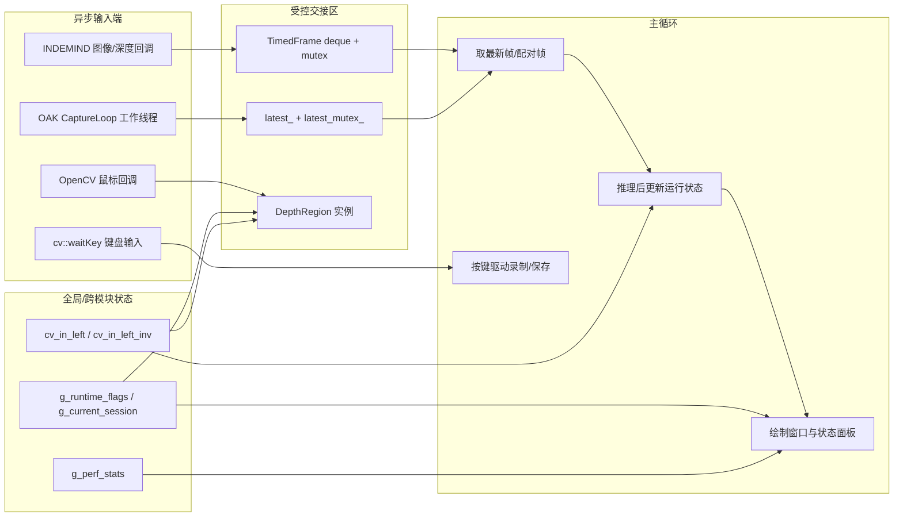

本页解释当前工程中**运行时状态如何在全局模块、采集回调、鼠标回调与主循环之间协作**。范围限定在状态所有权、线程交接、事件输入与主循环消费模式；姿态推理、深度数学、落点算法细节分别属于 [YOLOv8 Pose 的 ONNX Runtime 推理流程](12-yolov8-pose-de-onnx-runtime-tui-li-liu-cheng)、[深度图单位、相机内参与像素反投影](16-shen-du-tu-dan-wei-xiang-ji-nei-can-yu-xiang-su-fan-tou-ying)、[髋点轨迹建模与落点检测状态机](21-kuan-dian-gui-ji-jian-mo-yu-luo-dian-jian-ce-zhuang-tai-ji)。Sources: [runtime_state.h](app/runtime_state.h#L7-L24), [get_pose_indemind_left.cpp](get_pose_indemind_left.cpp#L729-L850), [get_pose_oak_rgbd.cpp](get_pose_oak_rgbd.cpp#L639-L731)

## 架构假设与验证结论

从第一性原理看，这类实时视觉程序必须解决四个协作问题：**采集端不能被推理阻塞**、**主循环必须消费最新帧而不是积压帧**、**GUI 事件要修改可视化/业务状态**、**跨模块状态需要被入口程序与业务类共同访问**。代码验证后可以确认：INDEMIND 入口使用 SDK 图像/深度回调写入带时间戳的缓冲区，主循环加锁取最新 RGB 并按时间匹配深度；OAK 入口把采集线程封装到 `OakRgbdCapture`，主循环通过 `TryGetLatest` 拉取最新配对帧；录制状态、会话目录、相机内参和性能统计使用 `extern` 全局对象跨模块共享。Sources: [get_pose_indemind_left.cpp](get_pose_indemind_left.cpp#L729-L807), [get_pose_indemind_left.cpp](get_pose_indemind_left.cpp#L852-L877), [oak_rgbd_capture.h](app/oak_rgbd_capture.h#L42-L90), [oak_rgbd_capture.cpp](app/oak_rgbd_capture.cpp#L233-L243)

上图中的关键边界是：回调或工作线程只负责**生产或修改轻量状态**，主循环负责**集中消费、推理、绘制与键盘命令分发**。这种设计在 INDEMIND 入口中表现为 `RegistImgCallback`/`RegistDepthCallback` 写入缓冲，主循环从缓冲中取出数据；在 OAK 入口中表现为 `OakRgbdCapture::CaptureLoop` 发布最新帧，主循环调用 `TryGetLatest`。Sources: [get_pose_indemind_left.cpp](get_pose_indemind_left.cpp#L763-L807), [get_pose_indemind_left.cpp](get_pose_indemind_left.cpp#L852-L877), [oak_rgbd_capture.cpp](app/oak_rgbd_capture.cpp#L271-L278), [oak_rgbd_capture.cpp](app/oak_rgbd_capture.cpp#L395-L457)

## 全局状态：小而明确的跨模块共享面

当前代码中的全局运行状态集中在几个小模块：`runtime_state` 暴露录制开关 `g_runtime_flags` 和当前会话 `g_current_session`；`camera_intrinsics` 暴露相机内参矩阵及其逆矩阵；`perf_stats` 暴露性能统计对象。它们都采用头文件 `extern` 声明、`.cpp` 唯一定义的模式，使入口程序、`DepthRegion` 和显示逻辑可以访问同一份状态。Sources: [runtime_state.h](app/runtime_state.h#L7-L24), [runtime_state.cpp](app/runtime_state.cpp#L10-L38), [camera_intrinsics.h](app/camera_intrinsics.h#L1-L9), [camera_intrinsics.cpp](app/camera_intrinsics.cpp#L1-L4), [perf_stats.h](app/perf_stats.h#L7-L24)

| 全局对象 | 定义位置 | 写入者 | 读取者 | 作用边界 |
|---|---|---|---|---|
| `g_runtime_flags.record_enabled` | `runtime_state.cpp` | 主循环键盘 `R` 分支 | 状态面板、`DepthRegion` 相关录制逻辑 | 控制落点录制是否开启 |
| `g_current_session` | `runtime_state.cpp` | `CreateNewSession()` | 主循环保存分支、落点导出逻辑 | 保存当前会话 ID、目录、开始时间与激活状态 |
| `cv_in_left` / `cv_in_left_inv` | `camera_intrinsics.cpp` | 入口初始化阶段 | 主循环 3D 处理、`DepthRegion` 坐标显示/ROI 拟合 | 相机投影/反投影共享参数 |
| `g_perf_stats` | `perf_stats.cpp` | 主循环推理/深度/落点阶段 | 主循环周期打印 | 运行时性能样本缓存 |

`CreateNewSession()` 是全局会话状态的唯一构造入口：它生成时间戳会话 ID，写入 `g_current_session.session_id`、`output_dir`、`start_time`、`active`，并创建 `runs/<session_id>` 目录；若目录创建失败，则把 `active` 置回 `false`。主循环在按下 `R` 且从 OFF 切到 ON 时调用它，然后清空旧落点缓存。Sources: [runtime_state.cpp](app/runtime_state.cpp#L13-L38), [get_pose_indemind_left.cpp](get_pose_indemind_left.cpp#L1596-L1607), [get_pose_oak_rgbd.cpp](get_pose_oak_rgbd.cpp#L1465-L1476)

## INDEMIND 回调线程：生产带时间戳的轻量帧

INDEMIND 入口在 `main` 内创建 `image_buffer`、`depth_buffer` 两个 `std::deque<TimedFrame>`，并分别用 `mutex_image`、`mutex_depth` 保护；图像缓冲上限为 4，深度缓冲上限为 8。图像回调把左目图像转成 BGR 后调用 `PushTimedFrame` 写入缓冲，深度回调把深度从米转换为 `CV_16U` 毫米图后写入深度缓冲。Sources: [get_pose_indemind_left.cpp](get_pose_indemind_left.cpp#L729-L735), [get_pose_indemind_left.cpp](get_pose_indemind_left.cpp#L763-L807)

`PushTimedFrame` 的策略不是无界排队，而是在超过上限时从队首丢弃旧帧并递增丢帧计数，然后把新帧压入队尾；`PopLatestFrame` 则取队尾最新帧并清空整个缓冲。这使回调线程可以持续生产，而主循环不会因为推理耗时而处理过期画面。Sources: [get_pose_indemind_left.cpp](get_pose_indemind_left.cpp#L178-L200), [get_pose_indemind_left.cpp](get_pose_indemind_left.cpp#L857-L865)

主循环对 INDEMIND 数据的消费顺序是：先在 `mutex_image` 下取最新 RGB 和时间戳，再在 `mutex_depth` 下用当前 RGB 时间戳选择最近深度帧，并记录同步误差 `depth_sync_error_ms`。这说明同步决策被放在主循环侧，而不是在 SDK 回调侧完成。Sources: [get_pose_indemind_left.cpp](get_pose_indemind_left.cpp#L852-L877)

## OAK 工作线程：封装采集并发布最新配对帧

OAK 入口没有直接在主文件中注册两个回调，而是创建 `OakRgbdCapture` 对象并调用 `Start()`。该类内部持有 `running_`、`worker_`、`latest_mutex_`、`latest_`、`has_new_frame_` 和若干原子计数器，形成一个“采集线程 + 最新帧槽位”的封装。Sources: [get_pose_oak_rgbd.cpp](get_pose_oak_rgbd.cpp#L616-L644), [oak_rgbd_capture.h](app/oak_rgbd_capture.h#L42-L90)

`Start()` 设置运行标志并启动 `CaptureLoop` 工作线程，然后等待启动报告；`Stop()` 清除运行标志并 `join` 工作线程；`TryGetLatest()` 在 `latest_mutex_` 下检查是否有新帧，若有则 clone 出 RGB 与深度并把 `has_new_frame_` 置为 `false`。Sources: [oak_rgbd_capture.cpp](app/oak_rgbd_capture.cpp#L206-L243)

`CaptureLoop()` 内部从 DepthAI 的 RGB 队列和 depth 队列非阻塞取帧，分别追加到本地 `rgb_buf` 与 `depth_buf`，然后通过 `PopClosestPair` 在阈值内配对；配对成功后转换 RGB/深度格式，填充 `TimedRgbdFrame` 并调用 `PublishFrame()` 写入最新帧槽位。主循环只需要不断调用 `TryGetLatest()`，没有新帧时通过 `waitKey(1)` 仍保持窗口响应。Sources: [oak_rgbd_capture.cpp](app/oak_rgbd_capture.cpp#L392-L457), [oak_rgbd_capture.cpp](app/oak_rgbd_capture.cpp#L271-L278), [get_pose_oak_rgbd.cpp](get_pose_oak_rgbd.cpp#L731-L747)

## 主循环：集中消费、绘制与命令分发

两个入口的主循环都遵循同一原则：拿到一帧后，才执行推理、性能计时、3D/业务状态更新、绘制窗口与键盘处理。INDEMIND 主循环从缓冲取图像并匹配深度；OAK 主循环从 `OakRgbdCapture` 取已经配对的 `TimedRgbdFrame`。Sources: [get_pose_indemind_left.cpp](get_pose_indemind_left.cpp#L852-L889), [get_pose_oak_rgbd.cpp](get_pose_oak_rgbd.cpp#L731-L758)

主循环还负责把运行状态反馈到界面：显示 `REC: ON/OFF` 时读取 `g_runtime_flags.record_enabled`，显示落点数量时读取 `depth_region.GetLandingPointCount()`，显示最后落点时读取 `depth_region.GetLandingPoints()`。这类读取发生在单个主循环绘制阶段，避免把 GUI 绘制分散到采集线程。Sources: [get_pose_indemind_left.cpp](get_pose_indemind_left.cpp#L1302-L1329), [get_pose_oak_rgbd.cpp](get_pose_oak_rgbd.cpp#L1171-L1199)

键盘输入统一由 `cv::waitKey(1)` 分发：`K/T/I` 切换显示状态，`L` 控制髋点 CSV 记录，空格保存当前帧，`+/-` 与 `[/]` 调整 `DepthRegion` 参数，`P` 打印参数，`R` 切换全局落点录制并创建新会话，`C` 清空落点缓存，`S` 将落点刷入当前会话目录。Sources: [get_pose_indemind_left.cpp](get_pose_indemind_left.cpp#L1532-L1618), [get_pose_oak_rgbd.cpp](get_pose_oak_rgbd.cpp#L1401-L1487)

## 鼠标回调：OpenCV 事件到 DepthRegion 的桥接

鼠标协作采用一个很薄的 C 风格回调桥：`OnDepthMouseCallback` 从 `userdata` 取回 `DepthRegion*`，然后调用 `region->OnMouse(event, x, y, flags)`。两个入口都在主显示窗口上调用 `cv::setMouseCallback(..., OnDepthMouseCallback, &depth_region)`，把主循环栈上的 `DepthRegion` 实例交给 OpenCV 事件系统。Sources: [depth_region.cpp](app/depth_region.cpp#L1-L6), [get_pose_indemind_left.cpp](get_pose_indemind_left.cpp#L1299-L1300), [get_pose_oak_rgbd.cpp](get_pose_oak_rgbd.cpp#L1168-L1169)

`DepthRegion::OnMouse` 只处理鼠标移动与左键点击。移动事件在坐标系尚未建立时更新当前光标点；左键事件会在已有 4 个 ROI 点时重置选择，然后记录新点、更新点击计数，并在第 4 个点后设置 `pending_roi_finalize_ = true`。真正依赖深度图的 ROI 平面完成动作不在鼠标回调里直接做，而是在 `ShowElems()` 看到 `pending_roi_finalize_` 后用当前深度图调用 `TryFinalizePlaneFromROI(depth)`。Sources: [depth_region.h](app/depth_region.h#L45-L81), [depth_region.h](app/depth_region.h#L83-L109)

这个模式的意义是：鼠标回调只修改 `DepthRegion` 的轻量状态，深度相关的重计算被延后到主循环展示/更新阶段执行。当前代码没有为 `DepthRegion` 内部状态加锁，因此可验证的安全边界是：它被作为 GUI 交互对象在 OpenCV 窗口回调与主循环显示路径中共享，而不是被采集回调直接写入。Sources: [depth_region.h](app/depth_region.h#L50-L81), [depth_region.h](app/depth_region.h#L83-L109), [get_pose_indemind_left.cpp](get_pose_indemind_left.cpp#L1228-L1238)

## 协作模式对比

| 协作点 | INDEMIND 入口 | OAK RGBD 入口 | 共同目标 |
|---|---|---|---|
| 采集生产者 | SDK 图像/深度回调 | `OakRgbdCapture::CaptureLoop` 工作线程 | 与推理主循环解耦 |
| 帧交接结构 | `std::deque<TimedFrame>` + 两把 mutex | `latest_` + `latest_mutex_` | 主循环读取线程安全副本 |
| 时间同步 | 主循环按 RGB 时间戳选最近深度 | 采集线程内按阈值配对 RGB/depth | 保持 RGB 与深度一致性 |
| 最新帧策略 | `PopLatestFrame` 取队尾并清空 | `TryGetLatest` 读取最新槽位并清标志 | 避免处理历史积压 |
| 交互事件 | `cv::waitKey` + `setMouseCallback` | 同样模式 | GUI 输入集中影响运行状态 |

两条入口链路的差异主要在采集层封装：INDEMIND 把 SDK 回调直接写在入口文件中，状态交接结构也在 `main` 中创建；OAK 把 DepthAI 采集、配对、发布封装在类中。两者进入主循环后的状态使用方式趋同：都读取 `DepthRegion`、`g_runtime_flags`、`g_current_session`、`g_perf_stats` 并用键盘事件驱动状态变化。Sources: [get_pose_indemind_left.cpp](get_pose_indemind_left.cpp#L729-L807), [get_pose_oak_rgbd.cpp](get_pose_oak_rgbd.cpp#L639-L690), [oak_rgbd_capture.cpp](app/oak_rgbd_capture.cpp#L206-L243)

## 状态生命周期

初始化阶段首先建立外设与模型相关对象，然后写入全局相机内参。INDEMIND 入口从 SDK 模块参数构造 `cv_in_left` 与 `cv_in_left_inv`；OAK 入口在 `OakRgbdCapture::Start()` 后通过 `GetCameraMatrix()` 与 `GetCameraMatrixInv()` 取得内参并写入同名全局矩阵。Sources: [get_pose_indemind_left.cpp](get_pose_indemind_left.cpp#L700-L718), [get_pose_oak_rgbd.cpp](get_pose_oak_rgbd.cpp#L646-L659), [oak_rgbd_capture.cpp](app/oak_rgbd_capture.cpp#L293-L306)

运行阶段由采集端持续更新帧交接区，主循环持续取帧并更新局部状态、`DepthRegion` 状态、性能统计和显示面板。退出阶段则根据入口不同释放资源：OAK 在初始化失败路径和正常结束前调用 `oak_capture.Stop()`，其析构函数也会调用 `Stop()`；INDEMIND 入口在失败路径删除 SDK 对象。Sources: [oak_rgbd_capture.cpp](app/oak_rgbd_capture.cpp#L202-L230), [get_pose_oak_rgbd.cpp](get_pose_oak_rgbd.cpp#L640-L667), [get_pose_indemind_left.cpp](get_pose_indemind_left.cpp#L692-L727)

## 维护提示

新增运行时开关时，应优先判断它属于哪一类状态：若只影响当前入口的显示或临时记录，保持为 `main` 内局部变量即可；若需要被入口程序与 `DepthRegion` 等模块共同访问，才考虑仿照 `runtime_state` 使用小型 `extern` 全局对象。这样可以避免把所有业务状态都提升为全局变量。Sources: [runtime_state.h](app/runtime_state.h#L7-L24), [get_pose_indemind_left.cpp](get_pose_indemind_left.cpp#L826-L844), [get_pose_oak_rgbd.cpp](get_pose_oak_rgbd.cpp#L708-L726)

新增采集链路时，可以在 INDEMIND 和 OAK 两种模式中选择边界：若外部 SDK 原生提供回调，可使用“回调写缓冲、主循环取最新”的模式；若采集过程包含复杂配对、格式转换或启动同步，则更接近 `OakRgbdCapture` 的“工作线程封装、发布最新帧槽位”模式。下一步可阅读 [性能统计、队列限流与只处理最新帧策略](25-xing-neng-tong-ji-dui-lie-xian-liu-yu-zhi-chu-li-zui-xin-zheng-ce-lue) 理解帧丢弃与延迟控制，再阅读 [录制会话、落点 CSV 导出与运行状态管理](26-lu-zhi-hui-hua-luo-dian-csv-dao-chu-yu-yun-xing-zhuang-tai-guan-li) 理解录制数据落盘。Sources: [get_pose_indemind_left.cpp](get_pose_indemind_left.cpp#L178-L200), [get_pose_indemind_left.cpp](get_pose_indemind_left.cpp#L763-L807), [oak_rgbd_capture.h](app/oak_rgbd_capture.h#L42-L90), [oak_rgbd_capture.cpp](app/oak_rgbd_capture.cpp#L395-L457)