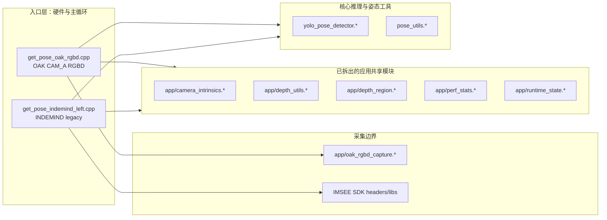

本页位于运行时与工程化章节的末尾，目标不是重新解释推理、RGBD、姿态算法或交互细节，而是把当前仓库中已经发生的拆分、仍然保留的耦合点、以及后续维护时应遵守的模块边界整理成可执行的技术路线。当前代码库已经从单入口单体形态演进为 **OAK RGBD 新链路默认构建、INDEMIND 旧链路可选构建、公共推理与部分运行时模块复用** 的结构：`BUILD_OAK_RGBD_TARGET` 默认开启，`BUILD_INDEMIND_TARGET` 默认关闭；公共源文件集中在 `yolo_pose_detector.cpp`、`pose_utils.cpp`，应用共享源集中在 `app/camera_intrinsics.cpp`、`app/depth_region.cpp`、`app/depth_utils.cpp`、`app/perf_stats.cpp`、`app/runtime_state.cpp`。Sources: [CMakeLists.txt](CMakeLists.txt#L10-L12), [CMakeLists.txt](CMakeLists.txt#L541-L568)

## 架构假设与验证结论

从第一原则看，重构边界应按“变化原因”划分：相机采集会随硬件变化，YOLO 推理会随模型与运行时变化，三维/姿态业务会随算法变化，录制、性能统计、运行状态会随工程化需求变化。当前仓库验证出的事实是：相机入口已经分裂为 `get_pose_oak_rgbd.cpp` 与 `get_pose_indemind_left.cpp`；两者共同包含 `yolo_pose_detector.h`、`pose_utils.h` 以及 `app` 下的运行时/深度/性能模块；OAK 入口额外包含 `app/oak_rgbd_capture.h`，INDEMIND 入口额外包含 IMSEE SDK 头文件。Sources: [get_pose_oak_rgbd.cpp](get_pose_oak_rgbd.cpp#L9-L18), [get_pose_indemind_left.cpp](get_pose_indemind_left.cpp#L8-L20)

当前重构已经完成的边界主要是 **运行时状态、性能统计、相机内参、深度采样、ROI/落点交互、OAK 采集封装**；尚未完全完成的边界是 **姿态度量、人体坐标系、3D 框绘制、主循环业务编排**，因为这些结构和函数仍以 `static` 或局部结构体形式同时存在于两个入口源文件中，例如 `Pose3DInfo`、`BodyFrame`、`RotationTracker`、`ComputePostureMetrics()`、`BuildBodyFrameFromPose()` 在 OAK 与 INDEMIND 入口中均有对应实现。Sources: [get_pose_oak_rgbd.cpp](get_pose_oak_rgbd.cpp#L41-L93), [get_pose_indemind_left.cpp](get_pose_indemind_left.cpp#L44-L100), [get_pose_oak_rgbd.cpp](get_pose_oak_rgbd.cpp#L388-L540), [get_pose_indemind_left.cpp](get_pose_indemind_left.cpp#L458-L610)

上图表达的是当前可验证的依赖方向：入口文件依赖采集层、共享 `app` 模块与核心推理模块；CMake 对 OAK 目标显式加入 `app/oak_rgbd_capture.cpp`，而 INDEMIND 目标不加入该文件；两个目标都链接公共源和 `APP_SOURCES`。Sources: [CMakeLists.txt](CMakeLists.txt#L561-L631)

## 已确认的模块边界

| 边界 | 当前承载文件 | 入口依赖方式 | 维护含义 |
|---|---|---|---|
| 构建目标边界 | `CMakeLists.txt` | `BUILD_OAK_RGBD_TARGET` / `BUILD_INDEMIND_TARGET` 控制 | 默认维护 OAK，新旧入口可并存 |
| 采集边界 | `app/oak_rgbd_capture.*`、IMSEE SDK | OAK 通过 `OakRgbdCapture`，INDEMIND 通过 SDK 回调 | 硬件差异应停留在入口/采集层 |
| 运行状态边界 | `app/runtime_state.*` | 全局 `g_runtime_flags`、`g_current_session` | 录制会话状态集中管理 |
| 性能统计边界 | `app/perf_stats.*` | 全局 `g_perf_stats` | 推理、深度、落点耗时统一统计 |
| 深度与 ROI 边界 | `app/depth_utils.*`、`app/depth_region.*` | `RobustDepthMedianU16()` 与 `DepthRegion` | 深度采样、ROI、落点交互复用 |
| 推理核心边界 | `yolo_pose_detector.*`、`pose_utils.*` | 两个入口共同编译 | 模型推理与姿态工具不应依赖硬件入口 |

该表的维护原则是：**凡是两个入口共同使用且不依赖具体相机 SDK 的逻辑，应优先移入共享模块；凡是依赖 DepthAI 或 IMSEE 的逻辑，应保留在对应采集边界或入口适配层**。当前 CMake 已经以 `COMMON_SOURCES`、`APP_SOURCES`、OAK 专属 `app/oak_rgbd_capture.cpp`、INDEMIND 专属 `${IMSEE_LIB}` 的方式体现了这条分界线。Sources: [CMakeLists.txt](CMakeLists.txt#L487-L506), [CMakeLists.txt](CMakeLists.txt#L541-L657)

## 已完成重构的事实边界

已有重构文档明确记录：原单体 `get_pose_indemind_left.cpp` 被拆分为应用层、运行时状态层、性能层、相机/深度工具层、交互/可视化层；目标是在保持运行时行为不变的前提下拆分模块，并保持 `yolo_pose_indemind_left` 的构建输出与核心依赖关系。Sources: [refactor_get_pose_indemind_left.md](docs/refactor_get_pose_indemind_left.md#L4-L36)

文档中的映射关系与当前文件结构一致：相机内参从原全局矩阵迁移到 `app/camera_intrinsics.*`，运行时标志与会话迁移到 `app/runtime_state.*`，性能统计迁移到 `app/perf_stats.*`，深度采样迁移到 `app/depth_utils.*`，`DepthRegion` 与鼠标回调迁移到 `app/depth_region.*`，队列清理辅助迁移到 `app/queue_utils.h`。Sources: [refactor_get_pose_indemind_left.md](docs/refactor_get_pose_indemind_left.md#L38-L79)

代码层面，`camera_intrinsics.h` 只暴露 `cv_in_left` 与 `cv_in_left_inv` 两个外部矩阵；OAK 入口从 `OakRgbdCapture` 读取相机矩阵并赋值，INDEMIND 入口从 SDK 模块参数构造相机矩阵并求逆。这说明相机内参已经成为跨入口共享状态，但来源仍由各入口负责。Sources: [camera_intrinsics.h](app/camera_intrinsics.h#L1-L10), [get_pose_oak_rgbd.cpp](get_pose_oak_rgbd.cpp#L646-L659), [get_pose_indemind_left.cpp](get_pose_indemind_left.cpp#L700-L718)

`runtime_state` 当前负责 `RuntimeFlags`、`DataSession`、`g_runtime_flags`、`g_current_session` 与 `CreateNewSession()`；`CreateNewSession()` 生成时间戳会话 ID，设置 `runs/<session_id>` 输出目录，并调用 `mkdir -p` 创建目录。这个模块的边界是“录制会话状态与会话目录创建”，不包含具体 CSV 字段写入逻辑。Sources: [runtime_state.h](app/runtime_state.h#L7-L24), [runtime_state.cpp](app/runtime_state.cpp#L10-L38)

`perf_stats` 当前负责推理耗时、深度图耗时、落点检测耗时的滑动样本与打印接口；两个入口都在推理后调用 `g_perf_stats.AddInference()`，并在循环中调用 `g_perf_stats.PrintIfNeeded()`。因此性能统计的维护边界已经从主循环中抽离，但采样点仍由入口主循环决定。Sources: [perf_stats.h](app/perf_stats.h#L7-L24), [get_pose_oak_rgbd.cpp](get_pose_oak_rgbd.cpp#L752-L758), [get_pose_indemind_left.cpp](get_pose_indemind_left.cpp#L883-L889)

`depth_utils` 只暴露 `RobustDepthMedianU16()`，`DepthRegion` 在显示交互中调用该函数进行局部深度中值采样，并使用 `cv_in_left_inv` 将像素与深度反投影到相机坐标。这个边界将“深度值鲁棒采样”与“ROI/坐标/落点交互”分开，但 `DepthRegion` 仍然依赖全局相机内参。Sources: [depth_utils.h](app/depth_utils.h#L1-L14), [depth_region.h](app/depth_region.h#L106-L130)

`DepthRegion` 的职责目前较宽：鼠标点击记录四点 ROI，等待深度图到达后完成平面拟合，显示 ROI 点、床面坐标系状态、检测参数，并通过独立的 `OnDepthMouseCallback()` 连接 OpenCV 鼠标回调。这是一个已经从入口拆出的“交互/可视化/落点状态”模块，但不是纯算法模块。Sources: [depth_region.h](app/depth_region.h#L45-L81), [depth_region.h](app/depth_region.h#L154-L200), [depth_region.cpp](app/depth_region.cpp#L1-L7)

## 仍需收敛的重复逻辑

两个入口仍保留相似的姿态三维信息结构、人体坐标系结构、旋转跟踪器与数学辅助函数。OAK 入口定义 `Pose3DInfo`、`BodyFrame`、`BodyBoxMeasurement`、`RotationTracker`、`NormalizeVec()`、`RotationMatrixToQuaternion()` 等；INDEMIND 入口定义了对应结构和函数，并额外保留 `TimedFrame` 以及 RGB/depth 同步相关辅助函数。Sources: [get_pose_oak_rgbd.cpp](get_pose_oak_rgbd.cpp#L41-L104), [get_pose_indemind_left.cpp](get_pose_indemind_left.cpp#L44-L111), [get_pose_indemind_left.cpp](get_pose_indemind_left.cpp#L193-L210)

姿态业务计算也仍在入口内：两个入口都实现 `GetKpCam()`、`AngleDeg()`、`ComputePostureMetrics()`、`DrawBodyFrameBox()`、`BuildBodyFrameFromPose()`，其中 `ComputePostureMetrics()` 基于髋、肩、膝、踝关键点计算躯干、大腿、小腿夹角，`BuildBodyFrameFromPose()` 基于髋点和肩点构建人体坐标轴。后续维护时，若修改这些函数，应同步检查两个入口是否存在重复变更风险。Sources: [get_pose_oak_rgbd.cpp](get_pose_oak_rgbd.cpp#L358-L540), [get_pose_indemind_left.cpp](get_pose_indemind_left.cpp#L428-L610)

主循环编排仍属于入口文件：OAK 入口通过 `OakRgbdCapture::TryGetLatest()` 拉取最新 RGBD 帧；INDEMIND 入口通过 SDK 图像回调和深度回调写入带时间戳的缓冲区，再由主循环取帧。这个差异说明“帧来源与同步策略”尚不适合直接合并进同一个主循环，除非先定义统一的帧提供接口。Sources: [get_pose_oak_rgbd.cpp](get_pose_oak_rgbd.cpp#L731-L747), [get_pose_indemind_left.cpp](get_pose_indemind_left.cpp#L763-L807)

## 后续维护路线

第一阶段应保持现有构建边界稳定：继续以 `yolo_pose_oak_rgbd` 作为默认目标，以 `yolo_pose_indemind_left` 作为显式开启的 legacy 目标；新增共享源码时加入 `COMMON_SOURCES` 或 `APP_SOURCES`，新增 OAK 专属源码时只加入 OAK 目标，新增 INDEMIND 专属依赖时只放入 `BUILD_INDEMIND_TARGET` 分支。Sources: [CMakeLists.txt](CMakeLists.txt#L10-L12), [CMakeLists.txt](CMakeLists.txt#L541-L657), [CMakeLists.txt](CMakeLists.txt#L663-L688)

第二阶段可以优先抽出“纯姿态几何”模块，因为这些函数已经在两个入口中重复，并且主要依赖 `PoseResult`、关键点索引、OpenCV 向量/矩阵，不直接依赖 DepthAI 或 IMSEE。候选边界包括 `Pose3DInfo`、`BodyFrame`、`RotationTracker`、`GetKpCam()`、`AngleDeg()`、`ComputePostureMetrics()`、`BuildBodyFrameFromPose()` 与 `DrawBodyFrameBox()`；抽出后应由两个入口共同链接，避免 OAK 与 INDEMIND 在姿态业务上产生分叉。Sources: [get_pose_oak_rgbd.cpp](get_pose_oak_rgbd.cpp#L41-L93), [get_pose_oak_rgbd.cpp](get_pose_oak_rgbd.cpp#L358-L540), [get_pose_indemind_left.cpp](get_pose_indemind_left.cpp#L44-L100), [get_pose_indemind_left.cpp](get_pose_indemind_left.cpp#L428-L610)

第三阶段可以定义统一的“最新 RGBD 帧提供者”接口，但现阶段应只作为重构方向而非已存在事实：OAK 已经有 `OakRgbdCapture::Start()`、`Stop()`、`TryGetLatest()`、`GetCameraMatrix()`、`GetCameraMatrixInv()`；INDEMIND 目前仍直接在入口中注册图像/深度回调并维护缓冲区。若要统一，应先把 INDEMIND 的回调缓冲逻辑封装成与 OAK 类似的采集类，再让入口只处理推理与业务展示。Sources: [oak_rgbd_capture.h](app/oak_rgbd_capture.h#L42-L90), [get_pose_indemind_left.cpp](get_pose_indemind_left.cpp#L729-L807)

第四阶段应谨慎拆分 `DepthRegion`：当前它同时承担鼠标 ROI、平面拟合触发、坐标显示、检测参数显示、落点状态与 CSV 相关状态访问。可维护的方向是先分离“纯床面模型/坐标转换”和“OpenCV 可视化交互”，但在分离前必须保留 `OnDepthMouseCallback()` 与入口 `cv::setMouseCallback()` 的调用关系不变，以降低交互行为回归风险。Sources: [depth_region.h](app/depth_region.h#L26-L81), [depth_region.h](app/depth_region.h#L96-L200), [depth_region.cpp](app/depth_region.cpp#L1-L7), [get_pose_oak_rgbd.cpp](get_pose_oak_rgbd.cpp#L1169-L1169), [get_pose_indemind_left.cpp](get_pose_indemind_left.cpp#L1300-L1300)

## 维护决策矩阵

| 变更类型 | 应修改位置 | 不应修改位置 | 验证点 |
|---|---|---|---|
| OAK 相机参数、DepthAI 配置、帧配对 | `app/oak_rgbd_capture.*` 或 OAK 入口配置段 | INDEMIND SDK 回调逻辑 | `yolo_pose_oak_rgbd` 可构建并启动 |
| INDEMIND SDK 初始化、回调缓冲 | `get_pose_indemind_left.cpp`，后续可封装为采集类 | `app/oak_rgbd_capture.*` | `BUILD_INDEMIND_TARGET=ON` 时构建 |
| YOLO 模型推理行为 | `yolo_pose_detector.*` | 相机采集层 | 两个入口仍共同链接公共推理 |
| 姿态角度/人体坐标系 | 当前在两个入口；后续应抽共享模块 | 单入口私改另一入口重复逻辑 | OAK 与 INDEMIND 对应函数一致 |
| 会话目录与录制状态 | `app/runtime_state.*` | 相机采集类 | `CreateNewSession()` 仍创建 `runs/<id>` |
| 性能统计项 | `app/perf_stats.*` 与入口采样点 | 推理核心内部硬编码入口展示 | 推理、深度、落点采样仍可打印 |

该矩阵的核心判断标准是 **依赖方向**：底层共享模块不应反向包含硬件入口；采集层不应包含姿态业务判定；入口可以组合采集、推理、业务与显示，但不应长期承载可复用的纯函数。当前 CMake 的目标组织、入口头文件包含关系、以及 `app` 模块的外部接口共同支持这一判断。Sources: [CMakeLists.txt](CMakeLists.txt#L529-L568), [get_pose_oak_rgbd.cpp](get_pose_oak_rgbd.cpp#L9-L18), [get_pose_indemind_left.cpp](get_pose_indemind_left.cpp#L8-L20)

## 清理与保留策略

已有清理文档记录了一批不参与 `get_pose_indemind_left.cpp` 构建或运行的旧目录、构建产物、脚本、输出数据和其他目标源码；这些记录说明仓库曾进行过面向 legacy INDEMIND 左相机应用的裁剪。当前仓库又包含 OAK RGBD 新目标，因此后续清理时不能只按旧 INDEMIND 目标判断，还必须检查 `CMakeLists.txt` 中 OAK 默认目标、DepthAI 依赖和 `app/oak_rgbd_capture.cpp` 的构建引用。Sources: [cleanup_deletions.md](docs/cleanup_deletions.md#L4-L6), [cleanup_deletions.md](docs/cleanup_deletions.md#L7-L70), [CMakeLists.txt](CMakeLists.txt#L561-L623)

对构建产物和运行输出，应维持“源码与可再生成产物分离”的原则：CMake 支持通过 `YOLO_OUTPUT_DIR` 指定输出目录，默认输出到 `build_agent_out`；运行会话目录由 `CreateNewSession()` 在 `runs/<timestamp>` 下创建。维护时应把 `build*`、运行 CSV、截图等视为产物，把 `CMakeLists.txt`、`app/`、入口源文件、模型和必要 SDK 头/库视为构建输入。Sources: [CMakeLists.txt](CMakeLists.txt#L16-L19), [runtime_state.cpp](app/runtime_state.cpp#L21-L38)

## 推荐阅读路径

如果需要回看本页涉及的上游概念，建议先阅读 [双入口架构：OAK RGBD 新链路与 INDEMIND 兼容链路](10-shuang-ru-kou-jia-gou-oak-rgbd-xin-lian-lu-yu-indemind-jian-rong-lian-lu)，再阅读 [CMake 目标、依赖发现与输出目录组织](11-cmake-mu-biao-yi-lai-fa-xian-yu-shu-chu-mu-lu-zu-zhi)，然后按需要跳转到 [性能统计、队列限流与只处理最新帧策略](25-xing-neng-tong-ji-dui-lie-xian-liu-yu-zhi-chu-li-zui-xin-zheng-ce-lue)、[录制会话、落点 CSV 导出与运行状态管理](26-lu-zhi-hui-hua-luo-dian-csv-dao-chu-yu-yun-xing-zhuang-tai-guan-li)、[全局状态、回调线程与主循环协作模式](27-quan-ju-zhuang-tai-hui-diao-xian-cheng-yu-zhu-xun-huan-xie-zuo-mo-shi)。这些页面分别覆盖本页引用但不展开的入口架构、构建组织、性能、录制和线程协作背景。Sources: [CMakeLists.txt](CMakeLists.txt#L663-L688), [runtime_state.h](app/runtime_state.h#L7-L24), [perf_stats.h](app/perf_stats.h#L7-L24)

本页之后的实际行动应是“先稳边界，再抽重复”：短期避免在单个入口中私改重复的姿态几何函数；中期将重复的姿态结构和纯函数抽到共享模块；长期再考虑统一 OAK 与 INDEMIND 的帧提供接口。这样可以在不破坏 OAK 默认目标和 INDEMIND legacy 目标的前提下，逐步降低双入口维护成本。Sources: [CMakeLists.txt](CMakeLists.txt#L625-L657), [get_pose_oak_rgbd.cpp](get_pose_oak_rgbd.cpp#L358-L540), [get_pose_indemind_left.cpp](get_pose_indemind_left.cpp#L428-L610)