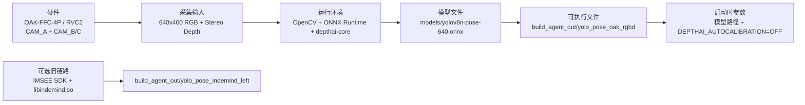

本页只做准备工作，不讲推理算法本身。你可以把它理解为：先把 OAK 相机、模型文件和 Linux 依赖准备正确，再进入后续的构建与运行页。README 已明确给出 OAK 新目标的硬件配置、默认模型和启动命令，CMake 与脚本则定义了构建时需要的 OpenCV、ONNX Runtime、DepthAI 以及输出目录。Sources: [README_OAK_RGBD.md](README_OAK_RGBD.md#L3-L18), [README_OAK_RGBD.md](README_OAK_RGBD.md#L19-L26), [CMakeLists.txt](CMakeLists.txt#L10-L18), [CMakeLists.txt](CMakeLists.txt#L58-L123), [build_oak_rgbd_linux.sh](build_oak_rgbd_linux.sh#L4-L18)

## 总体关系

下面这张图先帮你建立最小心智模型：硬件负责采集，模型文件负责推理，运行时负责把 OpenCV、ONNX Runtime 和 DepthAI 连起来，最终产出可执行文件。对于新手来说，先记住 OAK 路径和旧 INDEMIND 路径是两条不同的准备线，但它们共享同一套 YOLO/ONNX 基础。Sources: [README_OAK_RGBD.md](README_OAK_RGBD.md#L10-L18), [CMakeLists.txt](CMakeLists.txt#L447-L485), [CMakeLists.txt](CMakeLists.txt#L561-L643), [CMakeLists.txt](CMakeLists.txt#L663-L688)



如果你只想先跑通新链路，就把注意力集中在 OAK、DepthAI、`yolov8n-pose-640.onnx` 和 `yolo_pose_oak_rgbd` 这四个对象上；旧 INDEMIND 只在你需要兼容老硬件时才准备。Sources: [README_OAK_RGBD.md](README_OAK_RGBD.md#L43-L52), [CMakeLists.txt](CMakeLists.txt#L487-L505), [CMakeLists.txt](CMakeLists.txt#L625-L643)

## 硬件准备

OAK 新目标在 README 中给出的硬件画像很明确：主机侧使用 OAK-FFC-4P / RVC2，`CAM_A` 作为 RGB 主摄像头，`CAM_B/C` 作为双目深度相机，且同步方式是 `CAM_B` 输出主时钟、`CAM_A/C` 输入同步信号。深度输出格式是 `CV_16UC1`，单位是毫米，并且已经对齐到 `CAM_A`。Sources: [README_OAK_RGBD.md](README_OAK_RGBD.md#L10-L18)

| 硬件项 | 仓库中的要求 | 你需要关注的点 |
|---|---|---|
| OAK-FFC-4P / RVC2 | 新目标使用的硬件平台 | 先确认设备型号，再谈软件 |
| CAM_A | AR0234 / B0368，RGB master，640x400 | 这是业务层看到的主彩色输入 |
| CAM_B / CAM_C | OV9282 / B0413 stereo，640x400 | 用于深度计算 |
| FSYNC | `CAM_B OUTPUT master, CAM_A/C INPUT` | 影响 RGB 与深度的同步 |
| 深度输出 | `CV_16UC1`，毫米，已对齐到 CAM_A | 不要再把它当作别的单位处理 |

这套配置的核心意义是：OAK 侧的业务输入不是任意分辨率的图片，而是固定在 640x400 的 RGB 与深度配对数据，因此后续模型和运行时都应按这个前提准备。Sources: [README_OAK_RGBD.md](README_OAK_RGBD.md#L12-L18)

## 模型准备

仓库里提供了多个 ONNX 模型文件，OAK 新目标在文档和启动命令中默认使用的是 `models/yolov8n-pose-640.onnx`；README 也明确要求在运行前把这个模型放回 `models/` 目录下。对新手来说，先把默认模型准备好，比先纠结其它版本更重要。Sources: [README_OAK_RGBD.md](README_OAK_RGBD.md#L17-L18), [README_OAK_RGBD.md](README_OAK_RGBD.md#L43-L50), [CMakeLists.txt](CMakeLists.txt#L685-L687)

| 模型文件 | 在当前仓库中的角色 | 适合你先做的事 |
|---|---|---|
| `models/yolov8n-pose-640.onnx` | README 与运行示例中的默认模型 | 先放在 `models/` 下，优先跑通它 |
| `models/yolov8n-pose-1280.onnx` | 仓库中的另一份 pose ONNX 文件 | 先保留，不急着切换 |
| `models/yolov8m-pose-1280.onnx` | 仓库中的另一份 pose ONNX 文件 | 先保留，不急着切换 |

代码层面已经把模型输入处理做成了内部 letterbox：运行时会把任意输入图等比缩放到模型输入尺寸，再回映射关键点；README 还特别提示业务层不要把图像强行改成 640x640。也就是说，模型准备的重点不是你自己手动 resize，而是把正确的 ONNX 文件放在正确的位置。Sources: [yolo_pose_detector.cpp](yolo_pose_detector.cpp#L53-L111), [yolo_pose_detector.cpp](yolo_pose_detector.cpp#L119-L155), [README_OAK_RGBD.md](README_OAK_RGBD.md#L56-L58)

## 运行环境准备

新链路的构建依赖在 CMake 里写得很清楚：`OpenCV` 是必需项，`ONNX Runtime` 是必需项，`depthai-core` 只在 OAK 目标开启时需要；默认构建类型是 `Release`，默认输出目录是 `build_agent_out`，而 `DEPTHAI_CORE_ROOT` 的默认值指向一个本机路径，如果你的机器不同，需要显式覆盖。Sources: [CMakeLists.txt](CMakeLists.txt#L13-L23), [CMakeLists.txt](CMakeLists.txt#L58-L123), [CMakeLists.txt](CMakeLists.txt#L447-L485), [CMakeLists.txt](CMakeLists.txt#L561-L579)

| 环境项 | 仓库中的处理方式 | 对新手的含义 |
|---|---|---|
| C++ 标准 | `C++17` | 编译器要支持 C++17 |
| CMake | 需要 3.20 以上 | 先确认本机 `cmake` 可用 |
| OpenCV | `find_package(OpenCV REQUIRED)` | 没装就不能过配置 |
| ONNX Runtime | 必需，支持 Conda 或系统路径 | 需要能找到头文件和库 |
| depthai-core | OAK 目标必需 | 需要有对应 build tree 或安装前缀 |
| CUDA | 代码里可选启用 | 失败会回退到 CPU |
| IMSEE SDK | 仅旧链路需要 | 只在 legacy 目标启用时准备 |

`build_oak_rgbd_linux.sh` 已经把很多路径细节帮你包了一层：它会自动设置 `DEPTHAI_AUTOCALIBRATION=OFF`，收集 depthai-core build tree 里的 `_deps` 和 `vcpkg_installed` 前缀，并把这些路径拼进 `CMAKE_PREFIX_PATH`；它还固定了 `OpenCV_DIR`，所以你不需要从零手工猜依赖位置，但前提是这些目录本身真实存在。Sources: [build_oak_rgbd_linux.sh](build_oak_rgbd_linux.sh#L9-L18), [build_oak_rgbd_linux.sh](build_oak_rgbd_linux.sh#L23-L45), [build_oak_rgbd_linux.sh](build_oak_rgbd_linux.sh#L48-L77)

如果你走旧 INDEMIND 兼容链路，运行环境准备会变成另一套：`include/` 下需要有 SDK 头文件，`lib/libindemind.so` 需要存在，构建目标也会切到 `yolo_pose_indemind_left`。这条路径是可选的，不影响你先把 OAK 新链路准备好。Sources: [CMakeLists.txt](CMakeLists.txt#L487-L505), [CMakeLists.txt](CMakeLists.txt#L625-L643), [build_linux.sh](build_linux.sh#L88-L107)

## 项目结构速览

下面这个简化结构只保留与本页直接相关的部分，目的是让你知道“文件放哪里、入口在哪里、运行产物在哪里”。Sources: [CMakeLists.txt](CMakeLists.txt#L541-L579), [CMakeLists.txt](CMakeLists.txt#L625-L643), [README_OAK_RGBD.md](README_OAK_RGBD.md#L3-L18)

```text
YOLO_rec
├── CMakeLists.txt
├── README_OAK_RGBD.md
├── build_oak_rgbd_linux.sh
├── models/
│   ├── yolov8n-pose-640.onnx
│   ├── yolov8n-pose-1280.onnx
│   └── yolov8m-pose-1280.onnx
├── get_pose_oak_rgbd.cpp
├── app/
│   └── oak_rgbd_capture.cpp
├── build_agent_out/
│   ├── yolo_pose_oak_rgbd
│   └── yolo_pose_indemind_left
└── lib/
    └── libindemind.so
```

这张图对应的实际含义是：构建入口在 `CMakeLists.txt` 和脚本里，OAK 新链路由 `get_pose_oak_rgbd.cpp` 与 `app/oak_rgbd_capture.cpp` 组成，模型统一放在 `models/`，最终可执行文件输出到 `build_agent_out/`。Sources: [CMakeLists.txt](CMakeLists.txt#L561-L579), [CMakeLists.txt](CMakeLists.txt#L625-L643), [README_OAK_RGBD.md](README_OAK_RGBD.md#L43-L50)

## 建议的下一步

如果你已经把硬件、模型和依赖准备好了，下一步建议按这个顺序继续阅读：先看 [OAK RGBD 目标的构建与启动](4-oak-rgbd-mu-biao-de-gou-jian-yu-qi-dong)，再看 [实时窗口、鼠标 ROI 与键盘交互指南](6-shi-shi-chuang-kou-shu-biao-roi-yu-jian-pan-jiao-hu-zhi-nan)，最后用 [常见构建、模型加载与相机连接问题排查](8-chang-jian-gou-jian-mo-xing-jia-zai-yu-xiang-ji-lian-jie-wen-ti-pai-cha) 做自查。Sources: [README_OAK_RGBD.md](README_OAK_RGBD.md#L19-L26), [README_OAK_RGBD.md](README_OAK_RGBD.md#L43-L59), [build_oak_rgbd_linux.sh](build_oak_rgbd_linux.sh#L65-L84)

如果你以后还需要兼容旧设备，再补读 [INDEMIND 旧目标的构建与启动](5-indemind-jiu-mu-biao-de-gou-jian-yu-qi-dong)。Sources: [CMakeLists.txt](CMakeLists.txt#L487-L505), [CMakeLists.txt](CMakeLists.txt#L625-L643), [build_linux.sh](build_linux.sh#L88-L107)