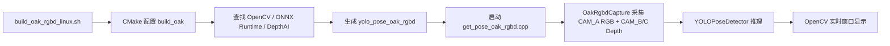
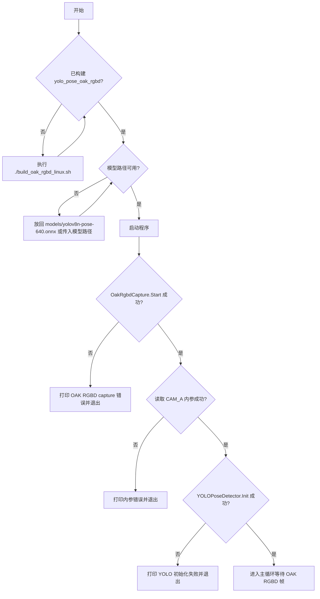

本页只解决一个新手最容易卡住的问题：如何把仓库中的 **OAK/DepthAI RGBD 新目标**构建出来，并用 OAK 相机与 YOLOv8 Pose 模型启动实时检测程序。当前页位于“运行与验证”小节，建议先阅读[硬件、模型与运行环境准备](3-ying-jian-mo-xing-yu-yun-xing-huan-jing-zhun-bei)，再执行本页步骤；运行成功后，可继续阅读[实时窗口、鼠标 ROI 与键盘交互指南](6-shi-shi-chuang-kou-shu-biao-roi-yu-jian-pan-jiao-hu-zhi-nan)。Sources: [README_OAK_RGBD.md](README_OAK_RGBD.md#L19-L50), [get_pose_oak_rgbd.cpp](get_pose_oak_rgbd.cpp#L691-L706)

## 架构假设与验证结论

从第一性原理看，OAK RGBD 目标的启动链路必须同时满足三件事：**CMake 生成 `yolo_pose_oak_rgbd` 可执行文件**、**DepthAI 负责输出对齐到 CAM_A 的 RGBD 帧**、**ONNX Runtime + OpenCV 负责 YOLOv8 Pose 推理与显示**。代码验证显示，仓库通过 `BUILD_OAK_RGBD_TARGET` 控制 OAK 目标，CMake 在该开关开启时查找 DepthAI 包，并把 `get_pose_oak_rgbd.cpp`、`app/oak_rgbd_capture.cpp`、公共推理源码和 app 模块共同编译进 `yolo_pose_oak_rgbd`。Sources: [CMakeLists.txt](CMakeLists.txt#L10-L14), [CMakeLists.txt](CMakeLists.txt#L447-L485), [CMakeLists.txt](CMakeLists.txt#L561-L623)



上图的读法是：脚本只负责构建入口，真正的运行入口是 `get_pose_oak_rgbd.cpp` 的 `main()`；相机采集由 `OakRgbdCapture` 封装，主循环拿到最新 RGBD 帧后交给 `YOLOPoseDetector::Detect()` 做姿态检测。Sources: [build_oak_rgbd_linux.sh](build_oak_rgbd_linux.sh#L65-L83), [get_pose_oak_rgbd.cpp](get_pose_oak_rgbd.cpp#L602-L668), [get_pose_oak_rgbd.cpp](get_pose_oak_rgbd.cpp#L731-L758)

## 本页涉及的项目结构

OAK RGBD 构建与启动只需要关注少数几个文件：`build_oak_rgbd_linux.sh` 是推荐构建脚本，`CMakeLists.txt` 定义目标与依赖，`get_pose_oak_rgbd.cpp` 是运行入口，`app/oak_rgbd_capture.*` 封装 DepthAI 采集，`models/yolov8n-pose-640.onnx` 是默认模型路径。Sources: [README_OAK_RGBD.md](README_OAK_RGBD.md#L3-L17), [get_pose_oak_rgbd.cpp](get_pose_oak_rgbd.cpp#L605-L609)

```text
YOLO_rec/
├── build_oak_rgbd_linux.sh      # 推荐的 OAK RGBD 构建脚本
├── CMakeLists.txt               # OAK 目标、依赖发现、输出目录
├── get_pose_oak_rgbd.cpp        # OAK RGBD 运行入口
├── app/
│   ├── oak_rgbd_capture.h       # OAK 采集配置、帧结构、采集类接口
│   └── oak_rgbd_capture.cpp     # DepthAI 管线、同步、发布最新帧
└── models/
    └── yolov8n-pose-640.onnx    # 默认启动模型
```

这个结构说明了一个关键边界：本页不解释 YOLO 后处理、三维重建、ROI 或落点算法，只解释如何让 `yolo_pose_oak_rgbd` 从源码变成可运行程序并开始接收 OAK RGBD 帧。Sources: [CMakeLists.txt](CMakeLists.txt#L541-L568), [app/oak_rgbd_capture.h](app/oak_rgbd_capture.h#L11-L40)

## 推荐构建方式：使用脚本

推荐从仓库根目录执行脚本；脚本会设置 `DEPTHAI_AUTOCALIBRATION=OFF`，配置 `build_oak` 构建目录，开启 `BUILD_OAK_RGBD_TARGET=ON`，关闭 `BUILD_INDEMIND_TARGET=OFF`，并把 DepthAI、OpenCV、Boost 相关路径传给 CMake。Sources: [build_oak_rgbd_linux.sh](build_oak_rgbd_linux.sh#L4-L10), [build_oak_rgbd_linux.sh](build_oak_rgbd_linux.sh#L65-L79)

```bash
export DEPTHAI_AUTOCALIBRATION=OFF
./build_oak_rgbd_linux.sh
```

脚本成功结束时会打印两个提示：构建产物位于 `build_agent_out/yolo_pose_oak_rgbd`，启动命令是 `DEPTHAI_AUTOCALIBRATION=OFF ./build_agent_out/yolo_pose_oak_rgbd models/yolov8n-pose-640.onnx`。Sources: [build_oak_rgbd_linux.sh](build_oak_rgbd_linux.sh#L81-L83)

## 手动构建方式：理解脚本背后的 CMake 参数

如果你需要排查构建问题，可以手动运行等价的 CMake 命令；README 中给出的手动构建方式显式开启 OAK 目标、关闭 INDEMIND 旧目标，并传入 `DEPTHAI_CORE_ROOT`、`DEPTHAI_CORE_BUILD_DIR` 与 `CMAKE_PREFIX_PATH`。Sources: [README_OAK_RGBD.md](README_OAK_RGBD.md#L28-L41)

```bash
export DEPTHAI_AUTOCALIBRATION=OFF

cmake -S . -B build_oak \
  -DCMAKE_BUILD_TYPE=Release \
  -DBUILD_OAK_RGBD_TARGET=ON \
  -DBUILD_INDEMIND_TARGET=OFF \
  -DDEPTHAI_CORE_ROOT=/home/chris4/workspace/from_git/depthai-core \
  -DDEPTHAI_CORE_BUILD_DIR=/home/chris4/workspace/from_git/depthai-core/build \
  -DCMAKE_PREFIX_PATH=/home/chris4/workspace/from_git/depthai-core/build

cmake --build build_oak --parallel
```

需要注意脚本与 README 的默认 DepthAI build 目录不完全相同：脚本中 `DEPTHAI_CORE_BUILD_DIR` 默认是 `${DEPTHAI_CORE_ROOT}/build_no_dcl`，而 README 的手动示例使用 `${DEPTHAI_CORE_ROOT}/build`；新手优先使用脚本，只有在确认本机 DepthAI 构建目录时才改手动参数。Sources: [build_oak_rgbd_linux.sh](build_oak_rgbd_linux.sh#L5-L7), [README_OAK_RGBD.md](README_OAK_RGBD.md#L32-L38)

| 参数 | 推荐值或来源 | 作用 |
|---|---:|---|
| `BUILD_OAK_RGBD_TARGET` | `ON` | 生成 OAK/DepthAI RGBD 目标 |
| `BUILD_INDEMIND_TARGET` | `OFF` | 不构建旧 INDEMIND 目标 |
| `CMAKE_BUILD_TYPE` | `Release` | 使用发布构建 |
| `DEPTHAI_CORE_ROOT` | `/home/chris4/workspace/from_git/depthai-core` | DepthAI 源码根目录 |
| `DEPTHAI_CORE_BUILD_DIR` | 脚本默认 `build_no_dcl` | DepthAI 构建输出目录 |
| `YOLO_OUTPUT_DIR` | 默认 `build_agent_out` | 可执行文件输出目录 |

这些参数都能在 CMake 或脚本中找到直接定义：CMake 默认开启 OAK 目标、关闭 INDEMIND 目标，并把默认输出目录设置为 `build_agent_out`；脚本则把 OAK 目标开启、INDEMIND 目标关闭，并最终构建 `build_oak`。Sources: [CMakeLists.txt](CMakeLists.txt#L10-L19), [build_oak_rgbd_linux.sh](build_oak_rgbd_linux.sh#L65-L79)

## 构建过程中的依赖检查

CMake 会先查找 OpenCV，并保存 YOLO 应用使用的 OpenCV include 和 library；随后查找 ONNX Runtime，如果找不到 `onnxruntime_cxx_api.h` 或 `onnxruntime` 库，会直接 `FATAL_ERROR`；只有在 `BUILD_OAK_RGBD_TARGET=ON` 时，CMake 才查找 DepthAI 包并选择 `depthai::core` 或 `depthai::opencv` 作为链接目标。Sources: [CMakeLists.txt](CMakeLists.txt#L58-L72), [CMakeLists.txt](CMakeLists.txt#L73-L123), [CMakeLists.txt](CMakeLists.txt#L447-L485)

| 依赖 | 是否用于 OAK 目标 | CMake 行为 |
|---|---|---|
| OpenCV | 是 | `find_package(OpenCV REQUIRED)`，保存给最终链接使用 |
| ONNX Runtime | 是 | 优先从 Conda 查找，失败后查系统路径；找不到则报错 |
| DepthAI | 是 | 仅在 `BUILD_OAK_RGBD_TARGET=ON` 时查找 |
| pthread | Linux 下是 | Linux 非 Apple 平台链接 `pthread` |
| INDEMIND SDK | 否 | 只有 `BUILD_INDEMIND_TARGET=ON` 时才检查 |

这张表只用于帮助新手判断“当前错误属于哪个层次”：OpenCV 和 ONNX Runtime 是推理与显示层依赖，DepthAI 是 OAK 相机采集层依赖，INDEMIND SDK 不参与本页的 OAK RGBD 构建。Sources: [CMakeLists.txt](CMakeLists.txt#L58-L123), [CMakeLists.txt](CMakeLists.txt#L447-L506), [CMakeLists.txt](CMakeLists.txt#L598-L600)

## 启动程序

构建完成后，确保模型文件位于 `models/` 下，然后从仓库根目录启动 OAK RGBD 程序；如果不传参数，程序默认使用 `models/yolov8n-pose-640.onnx`，如果传入第一个命令行参数，则使用该参数作为模型路径。Sources: [README_OAK_RGBD.md](README_OAK_RGBD.md#L43-L50), [get_pose_oak_rgbd.cpp](get_pose_oak_rgbd.cpp#L605-L609)

```bash
export DEPTHAI_AUTOCALIBRATION=OFF
./build_agent_out/yolo_pose_oak_rgbd models/yolov8n-pose-640.onnx
```

启动后，程序会再次设置 `DEPTHAI_AUTOCALIBRATION=OFF`，打印 “YOLO Pose Detection with OAK CAM_A RGBD”，创建 `OakRgbdConfig`，然后启动 `OakRgbdCapture`；如果 OAK 采集启动失败，程序会输出 `ERROR: Failed to start OAK RGBD capture` 并返回 `-1`。Sources: [get_pose_oak_rgbd.cpp](get_pose_oak_rgbd.cpp#L611-L644)

## 启动后的相机与模型配置

当前 OAK 目标在 `main()` 中使用 640×400 的 RGB 与 Mono 分辨率、50 FPS、5 ms RGB/Depth 配对阈值、5000 μs 曝光、RGB ISO 1200、Mono ISO 400、深度置信度 180，并开启 subpixel、关闭 extended disparity；这些是程序内写死的启动配置，而不是命令行参数。Sources: [get_pose_oak_rgbd.cpp](get_pose_oak_rgbd.cpp#L616-L637)

| 配置项 | 当前值 | 新手理解 |
|---|---:|---|
| RGB 分辨率 | `640x400` | CAM_A 输出给显示与推理的图像尺寸 |
| Mono 分辨率 | `640x400` | CAM_B/C 立体深度输入尺寸 |
| FPS | `50.0` | 相机请求帧率 |
| Pair threshold | `5.0 ms` | RGB 与 Depth 时间戳最大配对差 |
| Exposure | `5000 us` | 手动曝光 |
| RGB ISO | `1200` | CAM_A 增益 |
| Mono ISO | `400` | CAM_B/C 增益 |
| Confidence | `180` | StereoDepth 置信度阈值 |
| Subpixel | `true` | 深度亚像素模式开启 |

这些值进入 `OakRgbdCapture` 后，会用于 DepthAI 管线创建、RGB/Mono 输出请求、StereoDepth 配置以及 RGB/Depth 配对逻辑。Sources: [get_pose_oak_rgbd.cpp](get_pose_oak_rgbd.cpp#L616-L639), [app/oak_rgbd_capture.cpp](app/oak_rgbd_capture.cpp#L308-L377), [app/oak_rgbd_capture.cpp](app/oak_rgbd_capture.cpp#L423-L456)

## 启动流程图

下面的流程图描述的是一次完整启动的最小路径：构建产物存在、模型存在、OAK 采集成功、内参读取成功、YOLO 初始化成功，然后主循环开始等待 RGBD 帧。Sources: [get_pose_oak_rgbd.cpp](get_pose_oak_rgbd.cpp#L639-L668), [get_pose_oak_rgbd.cpp](get_pose_oak_rgbd.cpp#L728-L740)



程序进入主循环后，会通过 `TryGetLatest()` 取最新帧；没有帧时只处理退出按键，有帧时取出 `bgr` 与 `depth_mm`，并对 `left_image` 执行 `pose_detector.Detect(left_image)`。Sources: [get_pose_oak_rgbd.cpp](get_pose_oak_rgbd.cpp#L731-L758), [app/oak_rgbd_capture.cpp](app/oak_rgbd_capture.cpp#L233-L244)

## 运行成功时应该看到什么

运行成功后，终端会打印 OAK 设备信息、连接相机信息、OAK RGBD capture started、FSYNC 配置、RGB/Mono 分辨率、配对阈值、LR-check 状态、深度来源与滤波说明；随后 `main()` 会打印 CAM_A 640×400 内参、模型路径、快捷键说明，并显示 “Waiting for OAK RGBD frames...”。Sources: [app/oak_rgbd_capture.cpp](app/oak_rgbd_capture.cpp#L289-L291), [app/oak_rgbd_capture.cpp](app/oak_rgbd_capture.cpp#L379-L390), [get_pose_oak_rgbd.cpp](get_pose_oak_rgbd.cpp#L654-L663), [get_pose_oak_rgbd.cpp](get_pose_oak_rgbd.cpp#L691-L729)

程序的主要窗口名称是 `YOLO Pose - OAK CAM_A RGBD`，另有 `Body Frame Metrics` 指标窗口；主窗口会显示 OAK RGBD 姿态检测画面，具体鼠标 ROI、键盘交互和窗口含义建议进入下一页[实时窗口、鼠标 ROI 与键盘交互指南](6-shi-shi-chuang-kou-shu-biao-roi-yu-jian-pan-jiao-hu-zhi-nan)继续学习。Sources: [get_pose_oak_rgbd.cpp](get_pose_oak_rgbd.cpp#L1169-L1170), [get_pose_oak_rgbd.cpp](get_pose_oak_rgbd.cpp#L1371-L1373), [get_pose_oak_rgbd.cpp](get_pose_oak_rgbd.cpp#L1589-L1597)

## 新旧命令对照：从“容易混淆”到“推荐写法”

对新手来说，最常见的混淆是把旧 INDEMIND 目标和新 OAK RGBD 目标混在一起；本页推荐只构建并运行 `yolo_pose_oak_rgbd`，因为 CMake 中 OAK 与 INDEMIND 是两个独立开关，README 也明确说明旧目标只有在设置 `BUILD_INDEMIND_TARGET=ON` 且 SDK 文件存在时才构建。Sources: [CMakeLists.txt](CMakeLists.txt#L10-L14), [README_OAK_RGBD.md](README_OAK_RGBD.md#L52-L52)

| 场景 | 不推荐或容易混淆 | 推荐写法 |
|---|---|---|
| 构建目标 | 同时思考 OAK 与 INDEMIND | `./build_oak_rgbd_linux.sh` |
| OAK CMake 开关 | 忘记打开 OAK 目标 | `-DBUILD_OAK_RGBD_TARGET=ON` |
| 旧目标开关 | 无意中构建旧 SDK 目标 | `-DBUILD_INDEMIND_TARGET=OFF` |
| 启动程序 | 运行旧可执行文件 | `./build_agent_out/yolo_pose_oak_rgbd models/yolov8n-pose-640.onnx` |
| 模型路径 | 依赖不存在的默认文件 | 确认 `models/yolov8n-pose-640.onnx` 存在或显式传参 |

这些对照项都能从脚本、CMake 和 README 直接验证：脚本固定设置 OAK 开、INDEMIND 关，构建完成后打印 OAK 可执行文件路径与运行命令。Sources: [build_oak_rgbd_linux.sh](build_oak_rgbd_linux.sh#L65-L83), [CMakeLists.txt](CMakeLists.txt#L561-L623)

## 常见启动问题快速定位

如果构建阶段失败，先看错误属于 OpenCV、ONNX Runtime 还是 DepthAI；如果运行阶段失败，先看是 OAK 采集启动失败、CAM_A 内参读取失败，还是 YOLO 初始化失败。程序中这三个运行失败点都有明确的错误输出和 `return -1` 路径。Sources: [CMakeLists.txt](CMakeLists.txt#L58-L123), [CMakeLists.txt](CMakeLists.txt#L447-L485), [get_pose_oak_rgbd.cpp](get_pose_oak_rgbd.cpp#L639-L668)

| 现象 | 直接检查点 | 代码依据 |
|---|---|---|
| CMake 报 ONNX Runtime not found | 检查 `ONNXRUNTIME_INCLUDE_DIR` 与 `ONNXRUNTIME_LIB` | CMake 找不到会 `FATAL_ERROR` |
| CMake 找不到 DepthAI | 检查 `DEPTHAI_CORE_ROOT`、`DEPTHAI_CORE_BUILD_DIR`、`CMAKE_PREFIX_PATH` | OAK 目标开启时 `find_package(depthai CONFIG ...)` |
| 程序启动后立即报 OAK capture 错误 | 检查 OAK 设备连接与 DepthAI 初始化输出 | `OakRgbdCapture.Start()` 失败会打印错误 |
| 报 CAM_A intrinsics 错误 | 检查 DepthAI calibration 是否能读到 CAM_A 内参 | 内参矩阵为空会退出 |
| 报 YOLO 初始化失败 | 检查模型路径与 ONNX Runtime 运行环境 | `pose_detector.Init()` 失败会退出 |

这张表只覆盖本页边界内的构建与启动问题；模型加载、相机连接和运行环境的更系统排查，请继续阅读[常见构建、模型加载与相机连接问题排查](8-chang-jian-gou-jian-mo-xing-jia-zai-yu-xiang-ji-lian-jie-wen-ti-pai-cha)。Sources: [get_pose_oak_rgbd.cpp](get_pose_oak_rgbd.cpp#L639-L668), [README_OAK_RGBD.md](README_OAK_RGBD.md#L19-L50)

## 下一步阅读路径

如果你已经成功看到 OAK RGBD 实时窗口，下一步建议按“先会操作，再理解数据”的顺序阅读：先读[实时窗口、鼠标 ROI 与键盘交互指南](6-shi-shi-chuang-kou-shu-biao-roi-yu-jian-pan-jiao-hu-zhi-nan)，再读[从 2D 姿态检测到 3D 落点检测的最小闭环](7-cong-2d-zi-tai-jian-ce-dao-3d-luo-dian-jian-ce-de-zui-xiao-bi-huan)，最后进入[整体数据流：相机采集、姿态推理、深度融合与业务判断](9-zheng-ti-shu-ju-liu-xiang-ji-cai-ji-zi-tai-tui-li-shen-du-rong-he-yu-ye-wu-pan-duan)。Sources: [get_pose_oak_rgbd.cpp](get_pose_oak_rgbd.cpp#L691-L706), [get_pose_oak_rgbd.cpp](get_pose_oak_rgbd.cpp#L731-L758)

如果你还没有完成硬件、模型或运行环境准备，请回到[硬件、模型与运行环境准备](3-ying-jian-mo-xing-yu-yun-xing-huan-jing-zhun-bei)；如果你需要理解为什么项目同时保留 OAK 新链路与 INDEMIND 旧链路，请阅读[双入口架构：OAK RGBD 新链路与 INDEMIND 兼容链路](10-shuang-ru-kou-jia-gou-oak-rgbd-xin-lian-lu-yu-indemind-jian-rong-lian-lu)。Sources: [README_OAK_RGBD.md](README_OAK_RGBD.md#L3-L8), [CMakeLists.txt](CMakeLists.txt#L10-L14)