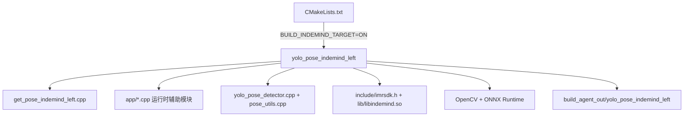
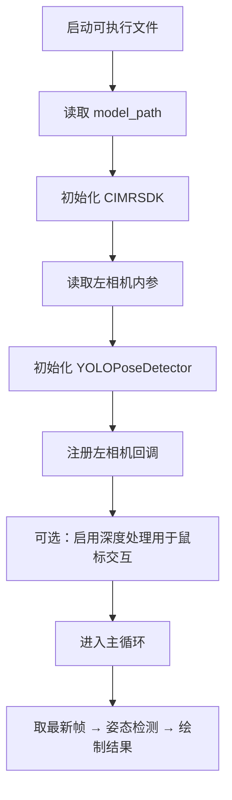

你当前要操作的是 **INDEMIND 左相机旧目标**，入口文件是 `get_pose_indemind_left.cpp`，构建目标名是 `yolo_pose_indemind_left`。这一页只处理“怎么把它编出来、怎么把它跑起来”，不展开深度融合或人体坐标系等后续算法内容；如果你后面还要看窗口交互和 ROI 操作，可以继续读 [实时窗口、鼠标 ROI 与键盘交互指南](6-shi-shi-chuang-kou-shu-biao-roi-yu-jian-pan-jiao-hu-zhi-nan)。Sources: [CMakeLists.txt](CMakeLists.txt#L10-L19), [CMakeLists.txt](CMakeLists.txt#L625-L653), [get_pose_indemind_left.cpp](get_pose_indemind_left.cpp#L672-L804)

## 1. 这条旧链路的文件关系

这个旧目标的构建关系很直接：`CMakeLists.txt` 决定是否生成 `yolo_pose_indemind_left`，`get_pose_indemind_left.cpp` 负责启动、相机初始化和主循环，公共检测器和工具由 `yolo_pose_detector.cpp`、`pose_utils.cpp` 以及 `app/` 下的辅助模块提供，运行时还要依赖 `include/` 里的 INDEMIND SDK 头文件和 `lib/libindemind.so`。对新手来说，可以把它理解成“CMake 负责拼装，源码负责执行，SDK 负责连相机”。Sources: [CMakeLists.txt](CMakeLists.txt#L487-L506), [CMakeLists.txt](CMakeLists.txt#L541-L656), [get_pose_indemind_left.cpp](get_pose_indemind_left.cpp#L8-L20), [get_pose_indemind_left.cpp](get_pose_indemind_left.cpp#L684-L723)



这张图的重点是两层：第一层是 **编译期**，也就是 CMake 把源码、SDK、第三方库拼成一个可执行文件；第二层是 **运行期**，也就是程序启动后通过 INDEMIND SDK 取左相机图像，再交给 YOLO 姿态检测器处理。Sources: [CMakeLists.txt](CMakeLists.txt#L10-L19), [CMakeLists.txt](CMakeLists.txt#L529-L656), [get_pose_indemind_left.cpp](get_pose_indemind_left.cpp#L672-L804)

## 2. 构建前你要先看懂的开关

`CMakeLists.txt` 里有两个关键选项：`BUILD_OAK_RGBD_TARGET` 默认是 `ON`，`BUILD_INDEMIND_TARGET` 默认是 `OFF`。这意味着如果你想要的是旧目标 `yolo_pose_indemind_left`，必须显式把 `BUILD_INDEMIND_TARGET` 打开；只有这样，CMake 才会检查 `imrsdk.h` 和 `lib/libindemind.so`，并生成这个可执行文件。Sources: [CMakeLists.txt](CMakeLists.txt#L10-L19), [CMakeLists.txt](CMakeLists.txt#L487-L506), [CMakeLists.txt](CMakeLists.txt#L625-L656)

| 配置项 | 默认值 | 对旧目标的影响 | 说明 |
|---|---:|---|---|
| `BUILD_INDEMIND_TARGET` | `OFF` | 关闭时不会生成 `yolo_pose_indemind_left` | 这是旧目标的总开关 |
| `BUILD_OAK_RGBD_TARGET` | `ON` | 默认会偏向新 OAK 目标 | 如果你只想构建旧目标，建议关掉 |
| `YOLO_OUTPUT_DIR` | `build_agent_out` | 控制可执行文件输出目录 | 默认不会落在你传入的 build 目录里 |
| `CMAKE_BUILD_TYPE` | `Release` | 默认发布构建 | 未指定时会自动设为 `Release` |

Sources: [CMakeLists.txt](CMakeLists.txt#L16-L23), [CMakeLists.txt](CMakeLists.txt#L29-L34), [CMakeLists.txt](CMakeLists.txt#L570-L572), [CMakeLists.txt](CMakeLists.txt#L633-L635)

从依赖上看，这个旧目标需要 **OpenCV、ONNX Runtime 和 INDEMIND SDK**；和 OAK/DepthAI 相关的依赖只在 `BUILD_OAK_RGBD_TARGET=ON` 时才会进入配置流程。也就是说，构建旧目标时，你关注的是 `include/`、`lib/libindemind.so`、OpenCV 和 ONNX Runtime，不需要把 DepthAI 当成前置条件。Sources: [CMakeLists.txt](CMakeLists.txt#L58-L123), [CMakeLists.txt](CMakeLists.txt#L447-L506)

## 3. 推荐的构建方式

最稳妥的方式是 **显式打开旧目标、显式关闭新目标**，然后再构建。这样做的好处是：你不会被 CMake 默认值带偏，也不会因为脚本里没传参数而误构建到别的目标。一个清晰的做法如下。Sources: [CMakeLists.txt](CMakeLists.txt#L10-L19), [CMakeLists.txt](CMakeLists.txt#L625-L656), [build_linux.sh](build_linux.sh#L122-L137)

```bash
cmake -S . -B build_indemind \
  -DCMAKE_BUILD_TYPE=Release \
  -DBUILD_OAK_RGBD_TARGET=OFF \
  -DBUILD_INDEMIND_TARGET=ON

cmake --build build_indemind --target yolo_pose_indemind_left --parallel
```

如果你希望产物不要默认落到 `build_agent_out/`，可以额外传 `-DYOLO_OUTPUT_DIR=...`；否则 CMake 会把 `yolo_pose_indemind_left` 放到 `build_agent_out/yolo_pose_indemind_left`。Linux 下还配置了 `RPATH` 指向 `lib/`，这有助于运行时找到 `libindemind.so`。Sources: [CMakeLists.txt](CMakeLists.txt#L16-L19), [CMakeLists.txt](CMakeLists.txt#L570-L572), [CMakeLists.txt](CMakeLists.txt#L633-L653)

`build_linux.sh` 这个脚本也还在仓库里，但它的 `cmake ..` 调用没有显式打开 `BUILD_INDEMIND_TARGET`，而 CMake 默认值又是旧目标关闭、新目标开启，所以从文件内容看，**旧目标更应该以手动 CMake 参数为准**。脚本本身更像是依赖检查和旧流程的保留样例，而不是最可靠的旧目标构建入口。Sources: [build_linux.sh](build_linux.sh#L32-L37), [build_linux.sh](build_linux.sh#L122-L137), [CMakeLists.txt](CMakeLists.txt#L10-L19)

## 4. 启动时程序到底做了什么

启动后，程序会先确定模型路径；如果你不传参数，代码里默认使用 `models/yolov8m-pose-1280.onnx`，传了第一个命令行参数就会覆盖这个默认值。随后它初始化 `CIMRSDK`，设置左相机分辨率和帧率，读取左相机内参，再初始化 `YOLOPoseDetector`，然后注册左相机图像回调并进入主循环。Sources: [get_pose_indemind_left.cpp](get_pose_indemind_left.cpp#L672-L723), [get_pose_indemind_left.cpp](get_pose_indemind_left.cpp#L763-L804), [yolo_pose_detector.cpp](yolo_pose_detector.cpp#L10-L46), [yolo_pose_detector.cpp](yolo_pose_detector.cpp#L53-L80)



这个流程里最重要的点有两个：第一，回调里**只使用左相机图像**，右相机数据被直接忽略；第二，主循环里主要做的是“取最新 RGB 帧、跑姿态检测、绘制结果”，所以这个旧目标的定位就是 **RGB-only 的左相机姿态检测**。Sources: [get_pose_indemind_left.cpp](get_pose_indemind_left.cpp#L763-L787), [get_pose_indemind_left.cpp](get_pose_indemind_left.cpp#L852-L925), [get_pose_indemind_left.cpp](get_pose_indemind_left.cpp#L1807-L1814)

## 5. 启动后如何判断是否成功

如果启动正常，你会先看到初始化提示，然后程序会等待相机图像；进入主循环后，窗口会显示检测结果、FPS、推理耗时和同步误差等信息。代码还把常见问题写在了注释说明里：比如检测器初始化失败、多半先看 ONNX Runtime 和模型文件；相机初始化失败，则先检查设备连接和权限，必要时用 `sudo` 启动。Sources: [get_pose_indemind_left.cpp](get_pose_indemind_left.cpp#L681-L723), [get_pose_indemind_left.cpp](get_pose_indemind_left.cpp#L846-L949), [get_pose_indemind_left.cpp](get_pose_indemind_left.cpp#L1784-L1805), [build_linux.sh](build_linux.sh#L148-L152)

| 常见现象 | 先检查什么 | 依据 |
|---|---|---|
| `Failed to initialize YOLO Pose Detector` | ONNX Runtime、模型路径 | `Init()` 失败路径和注释说明 |
| `Failed to initialize INDEMIND SDK` | 相机是否连接、权限是否足够 | `CIMRSDK::Init(config)` 返回失败 |
| 窗口不出图 | 是否已经进入主循环、是否收到左相机帧 | 图像回调和 `PopLatestFrame()` 逻辑 |
| 运行时找不到库 | `lib/libindemind.so` 是否存在、RPATH 是否生效 | CMake 的 Linux RPATH 设置 |

Sources: [get_pose_indemind_left.cpp](get_pose_indemind_left.cpp#L693-L723), [get_pose_indemind_left.cpp](get_pose_indemind_left.cpp#L763-L804), [get_pose_indemind_left.cpp](get_pose_indemind_left.cpp#L852-L949), [CMakeLists.txt](CMakeLists.txt#L649-L653)

## 6. 你接下来该读什么

如果你现在只是想把旧目标跑起来，下一步最自然的是先补齐环境和硬件前提，再看窗口交互和排障页面；建议顺序是 [硬件、模型与运行环境准备](3-ying-jian-mo-xing-yu-yun-xing-huan-jing-zhun-bei) → [实时窗口、鼠标 ROI 与键盘交互指南](6-shi-shi-chuang-kou-shu-biao-roi-yu-jian-pan-jiao-hu-zhi-nan) → [常见构建、模型加载与相机连接问题排查](8-chang-jian-gou-jian-mo-xing-jia-zai-yu-xiang-ji-lian-jie-wen-ti-pai-cha)。如果你只是想确认“我现在这个目标为什么启动不了”，就直接去排障页。Sources: [build_linux.sh](build_linux.sh#L32-L97), [build_linux.sh](build_linux.sh#L148-L152), [get_pose_indemind_left.cpp](get_pose_indemind_left.cpp#L1784-L1805)