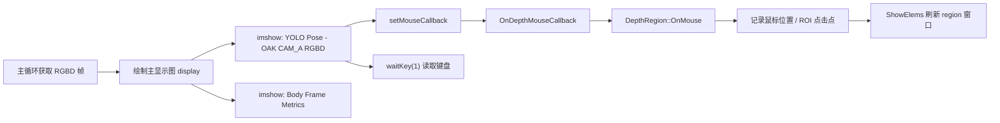
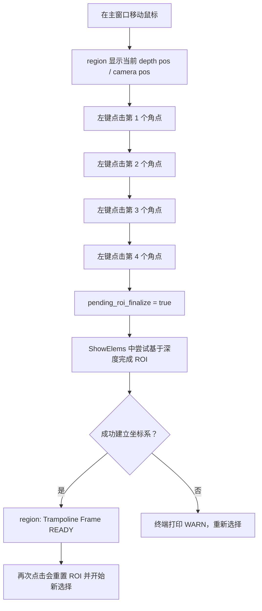
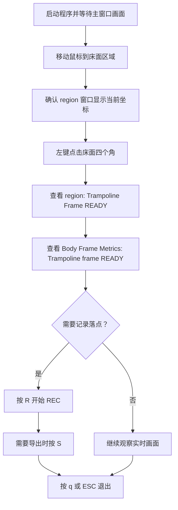

本页面面向刚开始运行项目的开发者，只解释**程序打开后你会看到哪些实时窗口、鼠标如何选择蹦床 ROI、键盘如何控制显示与录制**。这里不展开 YOLO 推理、深度反投影、平面拟合数学或落点检测算法细节；这些内容可在后续深入页面继续阅读。Sources: [get_pose_oak_rgbd.cpp](get_pose_oak_rgbd.cpp#L691-L706), [app/depth_region.h](app/depth_region.h#L45-L80)

## 架构假设与验证结论

从第一原则看，实时交互链路必须满足三个条件：主循环持续刷新 OpenCV 窗口，鼠标事件被绑定到主显示窗口，键盘事件通过 `cv::waitKey(1)` 在每帧轮询。代码验证显示，OAK RGBD 入口会显示 `"YOLO Pose - OAK CAM_A RGBD"` 主窗口和 `"Body Frame Metrics"` 指标窗口，并在主窗口上注册 `OnDepthMouseCallback`；深度区域面板由 `DepthRegion::ShowElems()` 调用 `cv::imshow("region", im)` 显示。Sources: [get_pose_oak_rgbd.cpp](get_pose_oak_rgbd.cpp#L1168-L1169), [get_pose_oak_rgbd.cpp](get_pose_oak_rgbd.cpp#L1371-L1386), [app/depth_region.h](app/depth_region.h#L99-L108), [app/depth_region.h](app/depth_region.h#L275-L281)



这张图的阅读方式是：**窗口刷新、鼠标回调、键盘轮询都发生在运行期主循环附近**；鼠标回调只把事件转交给 `DepthRegion::OnMouse()`，真正的点击计数、ROI 点保存、4 点完成标记都在 `DepthRegion` 内部。Sources: [app/depth_region.cpp](app/depth_region.cpp#L1-L6), [app/depth_region.h](app/depth_region.h#L50-L80), [get_pose_oak_rgbd.cpp](get_pose_oak_rgbd.cpp#L1401-L1404)

## 你会看到的窗口

运行 OAK RGBD 目标时，主交互窗口名是 `"YOLO Pose - OAK CAM_A RGBD"`；程序在该窗口里显示姿态检测画面、右上角 REC 状态、落点数量、最后一个落点坐标，以及姿态文本等覆盖信息。主窗口也是鼠标点击 ROI 的目标窗口。Sources: [get_pose_oak_rgbd.cpp](get_pose_oak_rgbd.cpp#L1168-L1199), [get_pose_oak_rgbd.cpp](get_pose_oak_rgbd.cpp#L1201-L1225), [get_pose_oak_rgbd.cpp](get_pose_oak_rgbd.cpp#L1371-L1373)

`"Body Frame Metrics"` 是独立指标窗口，代码每帧创建一个 `950x650` 的面板并绘制 `Trampoline frame: READY/NOT READY`、被跟踪的人、人体姿态、角度与 3D 骨架坐标等运行期指标。对新手而言，最直接的用途是确认床面坐标系是否已经从 `NOT READY` 变为 `READY`。Sources: [get_pose_oak_rgbd.cpp](get_pose_oak_rgbd.cpp#L1227-L1249), [get_pose_oak_rgbd.cpp](get_pose_oak_rgbd.cpp#L1252-L1293), [get_pose_oak_rgbd.cpp](get_pose_oak_rgbd.cpp#L1338-L1371)

`"region"` 窗口由 `DepthRegion::ShowElems()` 显示；当 `show_` 为 false 时该函数直接返回，而鼠标移动或左键点击会把 `show_` 置为 true，因此它是鼠标深度查看和 ROI 状态查看的辅助面板。窗口内容包括当前深度图坐标、当前相机坐标、ROI 点列表、床面坐标系状态、检测参数、髋点和落点信息。Sources: [app/depth_region.h](app/depth_region.h#L56-L64), [app/depth_region.h](app/depth_region.h#L96-L108), [app/depth_region.h](app/depth_region.h#L136-L190), [app/depth_region.h](app/depth_region.h#L193-L272)

| 窗口名 | 何时出现/刷新 | 新手主要看什么 | 交互作用 |
|---|---|---|---|
| `YOLO Pose - OAK CAM_A RGBD` | 每帧 `imshow` 主画面 | 姿态画面、REC、LP、Last、Posture | 鼠标点击 4 点 ROI；键盘控制作用于当前 OpenCV 窗口轮询 |
| `Body Frame Metrics` | 每帧绘制指标面板 | `Trampoline frame: READY/NOT READY`、跟踪目标、角度和 3D 骨架 | 只读指标窗口 |
| `region` | 鼠标触发后由 `ShowElems()` 显示 | 当前像素/相机坐标、ROI 点、参数、落点 | 鼠标 ROI 的状态反馈窗口 |

Sources: [get_pose_oak_rgbd.cpp](get_pose_oak_rgbd.cpp#L1371-L1386), [app/depth_region.h](app/depth_region.h#L136-L190), [app/depth_region.h](app/depth_region.h#L193-L272)

## 鼠标 ROI：4 次左键点击建立蹦床区域

鼠标交互只处理两类 OpenCV 事件：`EVENT_MOUSEMOVE` 和 `EVENT_LBUTTONDOWN`。移动鼠标时，如果床面坐标系尚未建立，程序会更新当前光标像素位置；左键点击时，程序记录当前点到 `roi_points_`，更新点击计数，并在第 4 个点后设置 `pending_roi_finalize_ = true`，等待后续深度数据用于完成 ROI 平面处理。Sources: [app/depth_region.h](app/depth_region.h#L50-L80), [app/depth_region.h](app/depth_region.h#L106-L108)



建议新手按**蹦床床面四个角**依次点击，顺时针或逆时针都可以；代码注释明确说明 Click 1-4 是 ROI 多边形角点，并且第 4 次点击后会使用 ROI 内深度点进行 RANSAC 与 refinement。若已经有 4 个点，再次左键点击会先调用 `ResetRoiSelection()` 清空旧 ROI、点击计数、平面状态和坐标系状态，然后开始新的点选。Sources: [app/depth_region.h](app/depth_region.h#L45-L49), [app/depth_region.h](app/depth_region.h#L64-L80), [app/depth_region.h](app/depth_region.h#L1031-L1041)

在主图上，`DrawRect()` 会把已记录的 ROI 点画成圆点；当点数不少于 2 时绘制折线，当点数等于 4 时闭合多边形。颜色也表达状态：坐标系就绪时为绿色，否则为红色；如果还没有 ROI 点，则显示当前鼠标附近的小矩形提示。Sources: [app/depth_region.h](app/depth_region.h#L405-L425)

## ROI 状态如何判断

判断 ROI 是否成功，优先看 `"region"` 窗口：如果显示 `Trampoline Frame: READY`，说明 `coord_system_ready_` 已经为 true；同时窗口会显示 `Plane inliers` 及内点比例。如果尚未就绪，则显示 `Clicks: 当前次数 / 4`。Sources: [app/depth_region.h](app/depth_region.h#L174-L190)

如果第 4 点之后没有成功，终端可能打印明确的警告，例如深度图不可用、ROI 点退化、ROI 内有效深度样本不足、RANSAC 拟合失败、refined plane 拟合失败或无法从平面建立蹦床坐标系。新手排查时应先确认深度数据可用，再重新点击四个覆盖床面的角点。Sources: [app/depth_region.h](app/depth_region.h#L284-L304), [app/depth_region.h](app/depth_region.h#L330-L363)

| 现象 | 代码中的触发条件 | 建议动作 |
|---|---|---|
| `Clicks: 0 / 4` 到 `3 / 4` | 已触发鼠标但未满 4 点 | 继续在床面角点左键点击 |
| `Trampoline Frame: READY` | `coord_system_ready_` 为 true | 可以继续观察主窗口与指标窗口 |
| `[WARN] Depth map unavailable for plane fit.` | 深度为空或类型不是 `CV_16UC1` | 确认 RGBD 深度链路正在输出 |
| `[WARN] ROI points are degenerate; please reselect.` | 4 点凸包不是 4 点 | 避免点太近、共线或交叉混乱 |
| `[WARN] Not enough depth samples in ROI` | ROI 内有效深度样本少于阈值 | 扩大 ROI 或重新选择有深度的床面区域 |

Sources: [app/depth_region.h](app/depth_region.h#L174-L190), [app/depth_region.h](app/depth_region.h#L293-L331)

## 键盘控制速查

程序启动时会在终端打印控制说明，包括退出、关键点显示、骨架显示、信息覆盖、髋点坐标录制、保存当前帧、调节 Z 阈值、调节窗口半径、打印参数、ROI 鼠标说明，以及落点录制相关的 `r/c/s`。这些按键在主循环末尾通过 `cv::waitKey(1)` 每帧读取。Sources: [get_pose_oak_rgbd.cpp](get_pose_oak_rgbd.cpp#L691-L706), [get_pose_oak_rgbd.cpp](get_pose_oak_rgbd.cpp#L1401-L1404)

| 按键 | 功能 | 屏幕/终端反馈 |
|---|---|---|
| `q` / `ESC` | 退出程序 | 跳出主循环，停止采集并关闭窗口 |
| `k` / `K` | 开关关键点显示 | 终端打印 `Keypoints: ON/OFF` |
| `t` / `T` | 开关骨架线显示 | 终端打印 `Skeleton: ON/OFF` |
| `i` / `I` | 开关信息覆盖层 | 终端打印 `Info overlay: ON/OFF` |
| `l` / `L` | 开始/停止髋点坐标 CSV 录制 | 生成 `hip_coords_时间戳.csv` 或关闭文件 |
| `SPACE` | 保存当前原始图像帧 | 生成 `pose_frame_0000.jpg` 这类文件名 |
| `+` / `=` | 增大 Z 阈值 | 终端打印新的 Z 阈值 |
| `-` / `_` | 减小 Z 阈值 | 终端打印新的 Z 阈值 |
| `]` / `}` | 增大窗口半径 | 终端打印新的窗口半径 |
| `[` / `{` | 减小窗口半径 | 终端打印新的窗口半径 |
| `p` / `P` | 打印当前参数 | 终端打印当前落点检测参数 |
| `r` / `R` | 开关落点 REC 会话 | 主窗口显示 `REC: ON/OFF`，终端打印录制状态 |
| `c` / `C` | 清空落点缓存 | 终端打印已清空落点数据 |
| `s` / `S` | 保存落点 CSV | 若无会话，终端提示先按 `R` |

Sources: [get_pose_oak_rgbd.cpp](get_pose_oak_rgbd.cpp#L1401-L1487), [app/depth_region.h](app/depth_region.h#L888-L925)

需要注意一个容易混淆点：启动说明注释块中把 `s/S` 写成 skeleton 开关，但实际运行逻辑中骨架开关是 `t/T`，`s/S` 用于保存落点 CSV；本文以主循环实际按键分支为准。Sources: [get_pose_oak_rgbd.cpp](get_pose_oak_rgbd.cpp#L1570-L1575), [get_pose_oak_rgbd.cpp](get_pose_oak_rgbd.cpp#L1408-L1410), [get_pose_oak_rgbd.cpp](get_pose_oak_rgbd.cpp#L1480-L1486)

## 两套录制：`l` 与 `r/s/c` 的区别

`l/L` 控制的是髋点坐标逐帧 CSV 录制：首次按下时创建 `hip_coords_YYYYMMDD_HHMMSS.csv`，写入 `frame,timestamp_ms,person_id,cam_x,cam_y,cam_z,new_x,new_y,new_z` 表头，再次按下时关闭文件并打印总帧数。Sources: [get_pose_oak_rgbd.cpp](get_pose_oak_rgbd.cpp#L1414-L1440)

`r/R` 控制的是落点 REC 会话：从 OFF 切到 ON 时调用 `CreateNewSession()` 并清空旧落点；`c/C` 只清空内存中的落点缓存；`s/S` 在已有会话时把落点写出到当前会话目录，否则提示先按 `R`。主窗口右上角还会显示 `REC: ON/OFF` 和 `LP: 数量`，帮助你确认是否正在记录落点。Sources: [get_pose_oak_rgbd.cpp](get_pose_oak_rgbd.cpp#L1176-L1187), [get_pose_oak_rgbd.cpp](get_pose_oak_rgbd.cpp#L1465-L1487), [app/depth_region.h](app/depth_region.h#L920-L930)

## 操作流程：从打开窗口到完成 ROI

初次运行时，建议按这个顺序操作：先确认主窗口有画面，再移动鼠标让 `"region"` 窗口出现，然后点击床面四角，观察 `"region"` 或 `"Body Frame Metrics"` 中的 READY 状态，最后再根据需要开启录制。Sources: [get_pose_oak_rgbd.cpp](get_pose_oak_rgbd.cpp#L728-L735), [app/depth_region.h](app/depth_region.h#L56-L80), [get_pose_oak_rgbd.cpp](get_pose_oak_rgbd.cpp#L1227-L1239)



如果第 4 次点击后仍没有 READY，最小排查路径是：确认鼠标点击的是 OAK 主窗口而不是指标窗口；确认四点覆盖实际床面区域；如果终端出现深度不可用或样本不足警告，先等待深度帧或重新选择更大的有效区域。Sources: [get_pose_oak_rgbd.cpp](get_pose_oak_rgbd.cpp#L1168-L1169), [app/depth_region.h](app/depth_region.h#L284-L331), [app/depth_region.h](app/depth_region.h#L405-L425)

## OAK 与 INDEMIND 窗口名差异

本页以 OAK RGBD 运行链路为主；如果你运行旧 INDEMIND 目标，鼠标 ROI 的机制相同，但主窗口名变为 `"YOLO Pose - INDEMIND Left Camera"`，代码同样把 `OnDepthMouseCallback` 绑定到这个窗口，并显示 `"Body Frame Metrics"` 指标窗口。Sources: [get_pose_indemind_left.cpp](get_pose_indemind_left.cpp#L1299-L1300), [get_pose_indemind_left.cpp](get_pose_indemind_left.cpp#L1358-L1370)

| 入口 | 主窗口名 | 鼠标回调绑定 | 指标窗口 |
|---|---|---|---|
| OAK RGBD | `YOLO Pose - OAK CAM_A RGBD` | `cv::setMouseCallback(..., OnDepthMouseCallback, &depth_region)` | `Body Frame Metrics` |
| INDEMIND 旧目标 | `YOLO Pose - INDEMIND Left Camera` | `cv::setMouseCallback(..., OnDepthMouseCallback, &depth_region)` | `Body Frame Metrics` |

Sources: [get_pose_oak_rgbd.cpp](get_pose_oak_rgbd.cpp#L1168-L1169), [get_pose_oak_rgbd.cpp](get_pose_oak_rgbd.cpp#L1371-L1373), [get_pose_indemind_left.cpp](get_pose_indemind_left.cpp#L1299-L1300), [get_pose_indemind_left.cpp](get_pose_indemind_left.cpp#L1358-L1370)

## 可视化项目结构

和本页交互功能直接相关的文件很少：入口文件负责窗口刷新、鼠标绑定和键盘分支；`DepthRegion` 负责鼠标事件状态、ROI 点、`region` 面板和参数调整；`depth_region.cpp` 只是 OpenCV C 风格回调到 C++ 类方法的桥接。Sources: [get_pose_oak_rgbd.cpp](get_pose_oak_rgbd.cpp#L1168-L1169), [get_pose_oak_rgbd.cpp](get_pose_oak_rgbd.cpp#L1371-L1404), [app/depth_region.h](app/depth_region.h#L26-L80), [app/depth_region.cpp](app/depth_region.cpp#L1-L6)

```text
YOLO_rec/
├── get_pose_oak_rgbd.cpp          # OAK 主循环：imshow、setMouseCallback、waitKey
├── get_pose_indemind_left.cpp     # INDEMIND 兼容入口：窗口名不同，交互模式相同
└── app/
    ├── depth_region.h             # 鼠标 ROI、region 窗口、参数调整、落点缓存接口
    └── depth_region.cpp           # OnDepthMouseCallback -> DepthRegion::OnMouse
```

Sources: [get_pose_oak_rgbd.cpp](get_pose_oak_rgbd.cpp#L1401-L1487), [app/depth_region.h](app/depth_region.h#L50-L80), [app/depth_region.h](app/depth_region.h#L888-L930), [app/depth_region.cpp](app/depth_region.cpp#L1-L6)

## 下一步阅读

如果你还没有成功启动目标程序，请先回到 [OAK RGBD 目标的构建与启动](4-oak-rgbd-mu-biao-de-gou-jian-yu-qi-dong) 或 [INDEMIND 旧目标的构建与启动](5-indemind-jiu-mu-biao-de-gou-jian-yu-qi-dong)。如果你已经能完成 4 点 ROI，并想理解为什么 4 点能建立床面坐标系，下一步读 [四点 ROI、RANSAC 平面拟合与床面坐标系构建](18-si-dian-roi-ransac-ping-mian-ni-he-yu-chuang-mian-zuo-biao-xi-gou-jian)；如果你想理解按 `r/s/c` 后数据如何保存，继续读 [录制会话、落点 CSV 导出与运行状态管理](26-lu-zhi-hui-hua-luo-dian-csv-dao-chu-yu-yun-xing-zhuang-tai-guan-li)。Sources: [get_pose_oak_rgbd.cpp](get_pose_oak_rgbd.cpp#L701-L706), [get_pose_oak_rgbd.cpp](get_pose_oak_rgbd.cpp#L1465-L1487), [app/depth_region.h](app/depth_region.h#L284-L371)